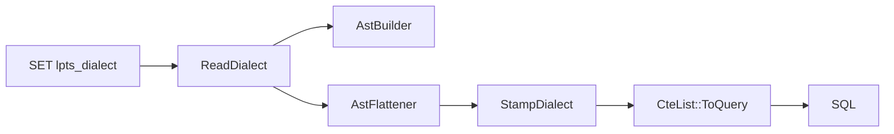

# LPTS 3-phase pipeline: orchestration view

## 1. Scope

This chapter describes LPTS from the orchestration point of view.
It explains how a DuckDB logical plan becomes a SQL string.
It does not enumerate every operator-specific lowering rule.
Those details belong in the phase-specific chapters.

The pipeline is:

```text
DuckDB LogicalOperator tree
  -> AstBuilder / LogicalPlanToAst
  -> AstFlattener / AstToCteList
  -> CteList::ToQuery
  -> SQL string
```

Use this chapter as the map for the whole LPTS path.
For implementation details, continue with:

- [Chapter 2: AstBuilder](2-ast-builder.md)
- [Chapter 3: AstFlattener](3-ast-flattener.md)
- [Chapter 4: SQL emission](4-sql-emission.md)

## 2. The orchestrator function

The extension entry points live in `src/lpts_extension.cpp`.
The common orchestration is visible in `LptsPragmaFunction`:

```cpp
auto plan = PlanQuery(context, query);
SqlDialect dialect = ReadDialect(context);
auto ast = LogicalPlanToAst(context, plan, dialect);
auto cte_list = AstToCteList(*ast, dialect);
string result_sql = cte_list->ToQuery(true);
```

Source: `src/lpts_extension.cpp:108-120`.

The table function form uses the same sequence.
Source: `src/lpts_extension.cpp:143-158`.

`PRAGMA lpts_exec` also uses the same pipeline, then returns the generated SQL for execution.
Source: `src/lpts_extension.cpp:188-195`.

`PRAGMA lpts_check` uses the same pipeline, then compares original and generated results with `EXCEPT ALL`.
Source: `src/lpts_extension.cpp:210-231`.

The helper `PlanQuery` parses the SQL, creates a DuckDB plan, and runs the optimizer.
Source: `src/lpts_extension.cpp:57-80`.

That matters because LPTS serializes the optimized logical plan.
It is not a pretty-printer for the original SQL text.
The generated SQL can expose pushdowns, rewritten joins, inlined CTEs, and other optimizer decisions.

The public phase declarations are in `src/include/lpts_pipeline.hpp`:

```cpp
unique_ptr<AstNode> LogicalPlanToAst(
    ClientContext &context,
    unique_ptr<LogicalOperator> &plan,
    SqlDialect dialect = SqlDialect::DUCKDB);

unique_ptr<CteList> AstToCteList(
    const AstNode &root,
    SqlDialect dialect = SqlDialect::DUCKDB);
```

Source: `src/include/lpts_pipeline.hpp:8-15`.

## 3. Phase summary

### Phase 1: AstBuilder

Input:

```cpp
unique_ptr<LogicalOperator> &plan
```

This is DuckDB's logical operator tree.
It is produced after parse, bind, plan, and optimize.

Output:

```cpp
unique_ptr<AstNode>
```

The result is LPTS's intermediate AST tree.
Every `AstNode` has a `children` vector, a `NodeType`, and output column names.
Source: `src/include/lpts_ast.hpp:41-56`.

What it does:

- walks the plan in post-order;
- builds an AST node for each supported `LogicalOperator`;
- preserves parent/child structure in the AST;
- tracks DuckDB `ColumnBinding` values in a column map;
- renders bound expressions into LPTS column names;
- applies dialect-dependent expression rendering where needed.

Source: `src/lpts_pipeline.cpp:73-80`.
Source: `src/lpts_pipeline.cpp:2387-2494`.
Source: `src/lpts_pipeline.cpp:2497-2503`.

Chapter 2 covers AstBuilder in depth.

### Phase 2: AstFlattener

Input:

```cpp
const AstNode &root
```

The input is the AST tree from Phase 1.

Output in the current source:

```cpp
unique_ptr<CteList>
```

Some design notes describe Phase 2 as producing a simplified AST tree.
In the current code, there is no separate simplified-AST return type.
The simplification boundary is the flat `CteList`.
That list is the IR consumed by Phase 3.

What it does:

- walks the AST bottom-up;
- turns each subtree into a named CTE node;
- replaces nested tree edges with references to earlier CTE names;
- assigns names such as `scan_0`, `filter_1`, and `aggregate_2`;
- flattens materialized CTE bodies before their references;
- orders delim-join and recursive-CTE lowering carefully;
- stamps the chosen dialect onto all CTE nodes.

Source: `src/lpts_pipeline.cpp:2521-2536`.
Source: `src/lpts_pipeline.cpp:2891-3152`.
Source: `src/lpts_pipeline.cpp:3155-3223`.

Chapter 3 covers AstFlattener in depth.

### Phase 3: CteList::ToQuery

Input:

```cpp
CteList
```

The input is the ordered flat list from Phase 2.

Output:

```cpp
string
```

The output is a SQL string.

What it does:

- emits `WITH` or `WITH RECURSIVE` when CTEs exist;
- emits each CTE as `name(columns) AS (<body>)`;
- emits the final root statement after the CTE list;
- maps internal LPTS column names back to final aliases;
- uses newlines when `use_newlines` is true;
- emits a trailing semicolon;
- uses dialect-aware quoting through the dialect stamped onto nodes.

Source: `src/cte_nodes.cpp:82-93`.
Source: `src/cte_nodes.cpp:357-390`.
Source: `src/cte_nodes.cpp:37-57`.

Chapter 4 covers SQL emission in depth.

## 4. Why the phases are separated

DuckDB's logical plan is not SQL text.
It is an operator tree with internal bindings.
Expressions refer to `ColumnBinding` values, not just names visible in the query.
Operators can also reflect optimizer rewrites that the user never typed.

The AST phase captures the plan's semantics in an LPTS-owned tree.
Source: `src/include/lpts_ast.hpp:12-20`.

The CTE-list phase converts that tree into dependency order.
Each parent can read from a named child CTE that has already been emitted.
Source: `src/include/cte_nodes.hpp:12-21`.

The SQL-emission phase prints the flat program.
It is the only phase that concatenates the final full SQL statement.

This separation lets contributors debug one boundary at a time:

1. logical plan;
2. AST;
3. CTE list;
4. emitted SQL;
5. round-trip correctness.

## 5. Phase 1 details: AstBuilder

`AstBuilder` is an internal class in `src/lpts_pipeline.cpp`.
It owns the state needed while walking DuckDB's logical plan.
The most important piece of state is the column map.
That map converts DuckDB bindings into LPTS names such as `t0_a`.

The traversal method is `RecursiveTraversal`.
It processes children before parents.
Then it calls `BuildNode` for the current operator.
Then it attaches child AST nodes to the parent AST node.
Source: `src/lpts_pipeline.cpp:2387-2482`.

The public `Build` method runs pre-passes for aggregate and projection references.
Then it calls `RecursiveTraversal`.
Source: `src/lpts_pipeline.cpp:2489-2494`.

The phase entry point is tiny:

```cpp
unique_ptr<AstNode> LogicalPlanToAst(
    ClientContext &context,
    unique_ptr<LogicalOperator> &plan,
    SqlDialect dialect) {
    AstBuilder builder(context, dialect);
    return builder.Build(plan);
}
```

Source: `src/lpts_pipeline.cpp:2497-2503`.

Unsupported logical operators fail explicitly.
The current implementation throws DuckDB's `NotImplementedException`:

```cpp
throw NotImplementedException(
    "AstBuilder: operator '%s' is not yet implemented",
    LogicalOperatorToString(op->type));
```

Source: `src/lpts_pipeline.cpp:2381-2384`.

Some older notes may describe this as `std::runtime_error("LPTS: unsupported operator ...")`.
The current source is more specific.
It raises a DuckDB `NotImplementedException` with the logical operator name.
It does not silently drop unsupported operators.

## 6. Phase 2 details: AstFlattener

`AstFlattener` is an internal class in `src/lpts_pipeline.cpp`.
It has a `node_count`, a vector of CTE nodes, the selected dialect, and bookkeeping maps.
Source: `src/lpts_pipeline.cpp:2531-2547`.

The core method is `FlattenNode`.
It flattens child nodes first.
It records each child's CTE name and column list.
It then creates the parent `CteNode` using those child names.
Source: `src/lpts_pipeline.cpp:3028-3045`.

The common mappings are direct:

| AST node | CTE node |
|---|---|
| `AstGetNode` | `GetNode` |
| `AstFilterNode` | `FilterNode` |
| `AstProjectNode` | `ProjectNode` |
| `AstAggregateNode` | `AggregateNode` |
| `AstJoinNode` | `JoinNode` |
| `AstUnionNode` | `UnionNode` |
| `AstSetOperationNode` | `CteSetOperationNode` |

Source: `src/lpts_pipeline.cpp:3046-3124`.

`Flatten` handles the root specially.
For a regular SELECT, it creates a `FinalReadNode` after the last CTE.
That final node strips internal prefixes such as `t1_` from output names.
Source: `src/lpts_pipeline.cpp:3177-3201`.

For INSERT, it creates an `InsertNode` root.
Source: `src/lpts_pipeline.cpp:3164-3174`.

Special orchestration cases include materialized CTEs.
The body is flattened before references can read it.
Source: `src/lpts_pipeline.cpp:2897-2908`.

A `CteRef` becomes a scan-like `GetNode` over the flattened body CTE.
Source: `src/lpts_pipeline.cpp:2911-2928`.

Delim joins flatten the outer side first.
Then the flattener registers the outer CTE as the source for `DelimGet` nodes inside the inner side.
Source: `src/lpts_pipeline.cpp:2930-2962`.

Recursive CTEs flatten the anchor normally.
The recursive step is rendered inline to avoid illegal forward references.
Source: `src/lpts_pipeline.cpp:2981-3025`.

Unsupported AST nodes fail explicitly.
Source: `src/lpts_pipeline.cpp:3151-3152`.

## 7. Phase 3 details: CteList::ToQuery

The CTE hierarchy is defined in `src/include/cte_nodes.hpp`.
`CteBaseNode` defines `ToQuery()` and carries the `dialect` field.
Source: `src/include/cte_nodes.hpp:45-57`.

`CteNode` adds the CTE name and column list.
Source: `src/include/cte_nodes.hpp:118-138`.

`CteNode::ToCteQuery()` wraps a node body like this:

```text
cte_name (col1, col2) AS (<node-body-sql>)
```

Source: `src/cte_nodes.cpp:82-93`.

`CteList::ToQuery` emits the whole statement.
It starts with `WITH` or `WITH RECURSIVE`.
It loops over CTE nodes.
It then appends the final root node.
It ends with `;`.
Source: `src/cte_nodes.cpp:372-389`.

The root is not wrapped in another CTE.
For SELECT, the root is `FinalReadNode`.
For INSERT, the root is `InsertNode`.
Source: `src/include/cte_nodes.hpp:59-104`.

## 8. Worked example

Input SQL:

```sql
SELECT a, SUM(b)
FROM t
WHERE c > 0
GROUP BY a
HAVING SUM(b) > 100;
```

DuckDB parses, binds, plans, and optimizes the query.
LPTS receives the optimized logical plan from `PlanQuery`.
A conceptual plan shape is:

```mermaid
graph TD
    P[LogicalProjection\noutput: a, sum(b)]
    H[LogicalFilter\nHAVING sum(b) > 100]
    A[LogicalAggregate\ngroups: a\naggregates: sum(b)]
    W[LogicalFilter or scan filter\nWHERE c > 0]
    G[LogicalGet\ntable: t\ncolumns: a, b, c]
    P --> H
    H --> A
    A --> W
    W --> G
```

The `WHERE c > 0` predicate may be pushed into the scan.
The emitted SQL therefore may not match the original text exactly.
It should, however, be equivalent as a bag of rows.

### 8.1 Phase 1 AST

A simplified AST tree is:

```text
Project
  expressions: [t0_a, t2_aggregate_0]
  output: [t3_a, t3_sum_b]
  Filter
    conditions: [(t2_aggregate_0) > (CAST(100 AS INTEGER))]
    Aggregate
      group_by_columns: [t0_a]
      aggregate_expressions: [sum(t0_b)]
      output: [t2_a, t2_aggregate_0]
      Get
        table: memory.main.t
        columns: [a, b, c]
        table_filters: [(c > 0)]
        output: [t0_a, t0_b, t0_c]
```

The exact column names can differ.
They depend on DuckDB bindings and optimizer output.
The important structure is `Get -> Aggregate -> Filter -> Project`.

### 8.2 Phase 2 CTE list

A simplified flat CTE list is:

```text
scan_0(t0_a, t0_b, t0_c)
  SELECT a, b, c FROM memory.main.t WHERE c > 0

aggregate_1(t1_a, t1_aggregate_0)
  SELECT t0_a, sum(t0_b) FROM scan_0 GROUP BY t0_a

filter_2(t1_a, t1_aggregate_0)
  SELECT t1_a, t1_aggregate_0 FROM aggregate_1
  WHERE (t1_aggregate_0) > (CAST(100 AS INTEGER))

projection_3(t3_a, t3_sum_b)
  SELECT t1_a, t1_aggregate_0 FROM filter_2

FinalReadNode
  SELECT t3_a AS a, t3_sum_b AS sum_b FROM projection_3
```

Each entry depends only on earlier entries.
That is the flattening invariant.

### 8.3 Phase 3 SQL

A canonical LPTS-style result is:

```sql
WITH scan_0 (t0_a, t0_b, t0_c) AS (
  SELECT a, b, c FROM memory.main.t WHERE (c) > (CAST(0 AS INTEGER))
),
aggregate_1 (t1_a, t1_aggregate_0) AS (
  SELECT t0_a, sum(t0_b) FROM scan_0 GROUP BY t0_a
),
filter_2 (t1_a, t1_aggregate_0) AS (
  SELECT t1_a, t1_aggregate_0 FROM aggregate_1
  WHERE ((t1_aggregate_0) > (CAST(100 AS INTEGER)))
),
projection_3 (t3_a, t3_sum_b) AS (
  SELECT t1_a, t1_aggregate_0 FROM filter_2
)
SELECT t3_a AS a, t3_sum_b AS sum_b FROM projection_3;
```

The real output may use different internal aliases.
It may be more compact.
It may push the `WHERE` predicate into `scan_0`.
The invariant is semantic equivalence, not textual preservation.

## 9. Dialect threading

The dialect is selected by the `lpts_dialect` setting.
The setting is registered with default value `duckdb`.
Source: `src/lpts_extension.cpp:286-292`.

The current source accepts `duckdb`, `postgres`, and `spark`.
Source: `src/lpts_pipeline.cpp:2508-2518`.

The enum is defined as:

```cpp
enum class SqlDialect {
    DUCKDB,
    POSTGRES,
    SPARK
};
```

Source: `src/include/sql_dialect.hpp:13-17`.

The setting is read by `ReadDialect`.
Source: `src/lpts_extension.cpp:24-34`.

The value is passed into `LogicalPlanToAst` and `AstToCteList`.
Before emission, `AstFlattener` stamps it onto every CTE node and the root node.
Source: `src/lpts_pipeline.cpp:3204-3214`.



Dialect effects are split across phases.
Expression rendering can remap function names.
For Postgres, `strptime` becomes `to_timestamp` and `strftime` becomes `to_char`.
For Spark, `strftime` becomes `date_format`, `strptime` becomes `to_timestamp`, and selected list/array functions are remapped.
Source: `src/lpts_pipeline.cpp:896-930`.

Identifier and table quoting happen through helper functions.
Spark uses backticks.
DuckDB and Postgres use DuckDB's optional quoting helper.
Source: `src/lpts_helpers.cpp:9-27`.
Source: `src/lpts_helpers.cpp:68-92`.

Postgres table references drop DuckDB catalog and schema qualifiers during flattening.
Source: `src/lpts_pipeline.cpp:3046-3056`.

So dialect is threaded through all three phases.
It is not just a final string-formatting flag.

## 10. Error handling

LPTS fails explicitly when it cannot safely lower something.
Unsupported logical operators fail in AstBuilder.
Source: `src/lpts_pipeline.cpp:2381-2384`.

Unsupported AST node types fail in AstFlattener.
Source: `src/lpts_pipeline.cpp:3151-3152`.

Unsupported join types fail during CTE emission.
Source: `src/cte_nodes.cpp:212-228`.

Unknown dialect values fail in `ParseSqlDialect`.
Source: `src/lpts_pipeline.cpp:2508-2518`.

Dialect-specific semantic gaps can fail too.
For example, the Spark dialect rejects window `GROUPS` frames and `EXCLUDE` clauses.
Source: `src/lpts_pipeline.cpp:780-812`.

The rule is:

```text
known operator + safe dialect behavior -> emit SQL
unknown operator or unsafe dialect behavior -> throw an explicit error
```

## 11. `LptsOptions` or similar configuration

There is no `LptsOptions` struct in the current source snapshot.
There is no `max_line_length` field.
There is no formatter object passed to the emitter.

The current configuration surface is split across smaller parameters.

### 11.1 Dialect

`lpts_dialect` is a DuckDB extension option.
Source: `src/lpts_extension.cpp:286-292`.

It is represented by `SqlDialect`.
Source: `src/include/sql_dialect.hpp:13-21`.

It is read by `ReadDialect` and passed through the pipeline.
Source: `src/lpts_extension.cpp:24-34`.

### 11.2 Pretty output

`CteList::ToQuery` accepts `bool use_newlines`.
This is the current equivalent of a `prettify` option.
The extension calls `ToQuery(true)`.
Source: `src/include/cte_nodes.hpp:410-414`.
Source: `src/lpts_extension.cpp:117-120`.

### 11.3 Final output aliases

`CteList::ToQuery` also accepts optional `output_names`.
Those names override final SELECT aliases when supplied.
Source: `src/include/cte_nodes.hpp:410-414`.
Source: `src/cte_nodes.cpp:359-369`.

### 11.4 Future shape

A future options object could collect `dialect`, `use_newlines`, `max_line_length`, and `output_names`.
That object does not exist today, so this chapter documents the current source.

## 12. Contributor mental model

AstBuilder is semantic capture.
It asks: what does DuckDB's optimized plan do?

AstFlattener is dependency ordering.
It asks: which named CTE must exist before this node can read it?

`CteList::ToQuery` is text emission.
It asks: how do we print this ordered CTE program in the requested dialect?

Debugging should follow that same order:

1. inspect DuckDB's logical plan;
2. inspect the AST with `PRAGMA print_ast` or `print_ast_query`;
3. inspect generated SQL with `PRAGMA lpts` or `lpts_query`;
4. validate results with `PRAGMA lpts_check`.

Source for entry points: `src/lpts_extension.cpp:100-231`.

## 13. Cross-links

For AstBuilder internals, see [Chapter 2](2-ast-builder.md).
For AstFlattener internals, see [Chapter 3](3-ast-flattener.md).
For CTE and SQL emission internals, see [Chapter 4](4-sql-emission.md).
