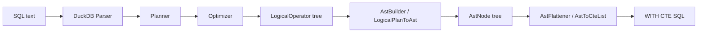

# 2. The LPTS `AstBuilder` phase

TL;DR: `AstBuilder` is LPTS phase 1: it recursively walks DuckDB's optimized `LogicalOperator` tree bottom-up, records `ColumnBinding` → generated-column-name mappings, and returns a dialect-aware AST that phase 2 flattens into CTE SQL. In this checkout the class lives in `.temp/lpts/src/lpts_pipeline.cpp`, not in a standalone `.temp/lpts/src/ast_builder.cpp`; the requested topic maps to the `AstBuilder` class and `LogicalPlanToAst` entry point in that file.

> Scope note: the source path named in the task, `.temp/lpts/src/ast_builder.cpp`, is not present in this checkout. The verified implementation is the `AstBuilder` class embedded in `.temp/lpts/src/lpts_pipeline.cpp:74-80` and invoked by `LogicalPlanToAst` at `.temp/lpts/src/lpts_pipeline.cpp:2500-2502`.

## 2.1 Where this phase sits

The extension entry point plans and optimizes the SQL first.

`PlanQuery` parses the string, creates a DuckDB plan, runs the optimizer, and returns the optimized logical plan (`.temp/lpts/src/lpts_extension.cpp:57-80`).

The `PRAGMA lpts` path then reads the requested dialect, calls `LogicalPlanToAst`, calls `AstToCteList`, and serializes the CTE list to SQL (`.temp/lpts/src/lpts_extension.cpp:108-124`).

The same `LogicalPlanToAst` → `AstToCteList` pipeline is used by the `lpts_query` table function (`.temp/lpts/src/lpts_extension.cpp:143-158`).



The public phase-1 declaration says exactly what it returns: a `unique_ptr<AstNode>` for a DuckDB `LogicalOperator` tree (`.temp/lpts/src/include/lpts_pipeline.hpp:8-11`).

The AST header describes the IR as dialect-agnostic and explicitly places it between DuckDB's logical plan and the flat CTE list (`.temp/lpts/src/include/lpts_ast.hpp:12-20`).

The SQL dialect is still passed in because expression serialization does dialect-specific function and identifier choices; supported dialects are `DUCKDB`, `POSTGRES`, and `SPARK` (`.temp/lpts/src/include/sql_dialect.hpp:13-17`).

## 2.2 Class signature and entry point

`AstBuilder` is a private helper class inside `namespace duckdb`.

The class banner says its job is to walk the `LogicalOperator` tree bottom-up and construct `AstNode` objects while maintaining `column_map` for CTE-qualified expression strings (`.temp/lpts/src/lpts_pipeline.cpp:73-79`).

The class begins at line 80 (`.temp/lpts/src/lpts_pipeline.cpp:80-90`).

Its constructor is:

```cpp
AstBuilder(ClientContext &_context, SqlDialect _dialect = SqlDialect::DUCKDB)
    : dialect(_dialect), context(_context) {
}
```

That constructor captures the DuckDB `ClientContext` and the requested SQL dialect (`.temp/lpts/src/lpts_pipeline.cpp:2484-2487`).

`ClientContext` is needed for runtime lookups such as DuckLake current snapshot probing (`.temp/lpts/src/lpts_pipeline.cpp:161-181`).

`SqlDialect` is stored in the builder and used by expression serialization and table-filter serialization (`.temp/lpts/src/lpts_pipeline.cpp:158-162`, `.temp/lpts/src/lpts_pipeline.cpp:916-940`).

The phase entry function inside the class is:

```cpp
unique_ptr<AstNode> Build(unique_ptr<LogicalOperator> &plan) {
    MarkAggregateReferencedBindings(plan.get());
    MarkProjectionReferencedBindings(plan.get());
    return RecursiveTraversal(plan);
}
```

So, despite the conceptual API being "build from a `LogicalOperator&`", the actual implementation takes a `unique_ptr<LogicalOperator>&` (`.temp/lpts/src/lpts_pipeline.cpp:2489-2494`).

Before traversal, it performs two pre-passes.

`MarkAggregateReferencedBindings` records extra pass-through bindings needed by aggregate expressions, filters, and aggregate `ORDER BY` clauses (`.temp/lpts/src/lpts_pipeline.cpp:258-292`).

`MarkProjectionReferencedBindings` does the same for projection expressions that reference bindings not directly exposed by the child (`.temp/lpts/src/lpts_pipeline.cpp:295-315`).

The public wrapper `LogicalPlanToAst` simply constructs `AstBuilder builder(context, dialect)` and returns `builder.Build(plan)` (`.temp/lpts/src/lpts_pipeline.cpp:2500-2502`).

That means the real entry stack is:

```text
LptsPragmaFunction / LptsTableBind
  └── LogicalPlanToAst(context, plan, dialect)
        └── AstBuilder(context, dialect)
              └── Build(plan)
                    ├── MarkAggregateReferencedBindings(plan.get())
                    ├── MarkProjectionReferencedBindings(plan.get())
                    └── RecursiveTraversal(plan)
```

## 2.3 The AST node vocabulary

The AST is not a SQL parser AST with a single `SelectNode` class.

It is an operator AST whose nodes correspond closely to logical-plan operators.

The header lists the current hierarchy from `AstGetNode` through `AstDelimJoinNode` (`.temp/lpts/src/include/lpts_ast.hpp:22-38`).

Important nodes for this chapter are:

| Conceptual role | Actual AST class | Source |
|---|---|---|
| Table reference / scan | `AstGetNode` | `.temp/lpts/src/include/lpts_ast.hpp:66-95` |
| WHERE wrapper | `AstFilterNode` | `.temp/lpts/src/include/lpts_ast.hpp:97-114` |
| SELECT list / computed columns | `AstProjectNode` | `.temp/lpts/src/include/lpts_ast.hpp:116-135` |
| GROUP BY + aggregates | `AstAggregateNode` | `.temp/lpts/src/include/lpts_ast.hpp:137-159` |
| Join | `AstJoinNode` | `.temp/lpts/src/include/lpts_ast.hpp:161-183` |
| UNION | `AstUnionNode` | `.temp/lpts/src/include/lpts_ast.hpp:185-203` |
| EXCEPT / INTERSECT | `AstSetOperationNode` | `.temp/lpts/src/include/lpts_ast.hpp:205-224` |
| ORDER BY | `AstOrderNode` | `.temp/lpts/src/include/lpts_ast.hpp:246-263` |
| LIMIT / OFFSET | `AstLimitNode` | `.temp/lpts/src/include/lpts_ast.hpp:265-288` |
| TOP N | `AstTopNNode` | `.temp/lpts/src/include/lpts_ast.hpp:290-310` |
| DISTINCT | `AstDistinctNode` | `.temp/lpts/src/include/lpts_ast.hpp:312-327` |
| Materialized CTE wrapper | `AstMaterializedCteNode` | `.temp/lpts/src/include/lpts_ast.hpp:329-347` |
| CTE reference | `AstCteRefNode` | `.temp/lpts/src/include/lpts_ast.hpp:349-367` |
| Recursive CTE | `AstRecursiveCteNode` | `.temp/lpts/src/include/lpts_ast.hpp:369-392` |
| Correlation scan | `AstDelimGetNode` | `.temp/lpts/src/include/lpts_ast.hpp:394-415` |
| Decorrelated subquery join | `AstDelimJoinNode` | `.temp/lpts/src/include/lpts_ast.hpp:417-442` |

Phase 2 is what turns these into SQL `SELECT` statements.

For example, an `AstFilterNode` is not itself named `SelectNode`, but the CTE node rendered later is a `SELECT ... WHERE ...` wrapper.

That separation is visible in the phase-2 entry point: `AstToCteList` constructs an `AstFlattener` and flattens the AST (`.temp/lpts/src/lpts_pipeline.cpp:3220-3222`).

## 2.4 Visitor pattern: operator dispatch

The core dispatch function is `BuildNode(unique_ptr<LogicalOperator> &op)`.

Its comment says children must already be processed and `column_map` is updated for the current operator's output columns (`.temp/lpts/src/lpts_pipeline.cpp:1237-1246`).

`BuildNode` is a manual visitor: a `switch (op->type)` over `LogicalOperatorType` (`.temp/lpts/src/lpts_pipeline.cpp:1246-1249`).

Every handled switch case in this checkout is listed below.

| `LogicalOperatorType` case | Actual AST node emitted | What is captured |
|---|---|---|
| `LOGICAL_GET` | `AstGetNode` | catalog/schema/table, scan columns, generated CTE names, pushdown filters (`.temp/lpts/src/lpts_pipeline.cpp:1249-1444`) |
| `LOGICAL_FILTER` | `AstFilterNode` | filter expressions serialized via `ExpressionToAliasedString` (`.temp/lpts/src/lpts_pipeline.cpp:1448-1454`) |
| `LOGICAL_WINDOW` | `AstProjectNode` | child pass-through columns plus window-function expressions (`.temp/lpts/src/lpts_pipeline.cpp:1458-1500`) |
| `LOGICAL_PROJECTION` | `AstProjectNode` or pass-through `nullptr` | SELECT-list expressions and output CTE names; skips compressed internal projections (`.temp/lpts/src/lpts_pipeline.cpp:1504-1615`) |
| `LOGICAL_UNNEST` | `AstProjectNode` | child columns plus `UNNEST(...)` outputs (`.temp/lpts/src/lpts_pipeline.cpp:1619-1643`) |
| `LOGICAL_AGGREGATE_AND_GROUP_BY` | `AstAggregateNode` | group expressions, grouping sets clause, aggregate expressions, output CTE names (`.temp/lpts/src/lpts_pipeline.cpp:1647-1820`) |
| `LOGICAL_COMPARISON_JOIN` | `AstJoinNode` | comparison predicates, join type, output CTE names, MARK-join expression (`.temp/lpts/src/lpts_pipeline.cpp:1824-1881`) |
| `LOGICAL_ANY_JOIN` | `AstJoinNode` | opaque arbitrary ON predicate (`.temp/lpts/src/lpts_pipeline.cpp:1885-1903`) |
| `LOGICAL_CROSS_PRODUCT` | `AstJoinNode` | synthetic `(TRUE)` join condition (`.temp/lpts/src/lpts_pipeline.cpp:1906-1913`) |
| `LOGICAL_UNION` | `AstUnionNode` | `UNION`/`UNION ALL` flag and left-derived output names (`.temp/lpts/src/lpts_pipeline.cpp:1917-1929`) |
| `LOGICAL_EXCEPT` | `AstSetOperationNode` | `EXCEPT`/`EXCEPT ALL` and left-derived output names (`.temp/lpts/src/lpts_pipeline.cpp:1932-1946`) |
| `LOGICAL_INTERSECT` | `AstSetOperationNode` | `INTERSECT`/`INTERSECT ALL` and left-derived output names (`.temp/lpts/src/lpts_pipeline.cpp:1932-1946`) |
| `LOGICAL_ORDER_BY` | `AstOrderNode` | order expressions plus direction, pass-through output names (`.temp/lpts/src/lpts_pipeline.cpp:1950-1972`) |
| `LOGICAL_LIMIT` | `AstLimitNode` | constant or expression limit/offset and scalar-dependency flags (`.temp/lpts/src/lpts_pipeline.cpp:1976-2005`) |
| `LOGICAL_TOP_N` | `AstTopNNode` | fused ORDER BY + constant limit/offset (`.temp/lpts/src/lpts_pipeline.cpp:2009-2031`) |
| `LOGICAL_DISTINCT` | `AstDistinctNode` | pass-through output column names (`.temp/lpts/src/lpts_pipeline.cpp:2035-2041`) |
| `LOGICAL_INSERT` | `AstInsertNode` | target table and conflict action (`.temp/lpts/src/lpts_pipeline.cpp:2045-2047`) |
| `LOGICAL_DUMMY_SCAN` | `AstGetNode` | one-row `(SELECT 1)` source for scalar constants (`.temp/lpts/src/lpts_pipeline.cpp:2051-2062`) |
| `LOGICAL_EMPTY_RESULT` | `AstGetNode` | zero-row `(SELECT 1)` source with `WHERE false` (`.temp/lpts/src/lpts_pipeline.cpp:2066-2083`) |
| `LOGICAL_CHUNK_GET` | `AstGetNode` | materialized constant rows rendered as `(VALUES ...)` (`.temp/lpts/src/lpts_pipeline.cpp:2087-2133`) |
| `LOGICAL_EXPRESSION_GET` | `AstGetNode` | `VALUES` clause expressions rendered as `(VALUES ...)` (`.temp/lpts/src/lpts_pipeline.cpp:2137-2171`) |
| `LOGICAL_CTE_REF` | `AstCteRefNode` | reference to a materialized or recursive CTE body (`.temp/lpts/src/lpts_pipeline.cpp:2175-2207`) |
| `LOGICAL_MATERIALIZED_CTE` | `AstMaterializedCteNode` | wrapper preserving body-before-use ordering (`.temp/lpts/src/lpts_pipeline.cpp:2211-2218`) |
| `LOGICAL_DELIM_GET` | `AstDelimGetNode` | duplicate-eliminated correlation keys (`.temp/lpts/src/lpts_pipeline.cpp:2222-2254`) |
| `LOGICAL_DELIM_JOIN` | `AstDelimJoinNode` | decorrelated subquery join with delim-get metadata (`.temp/lpts/src/lpts_pipeline.cpp:2258-2378`) |
| `LOGICAL_DEPENDENT_JOIN` | `AstDelimJoinNode` | same path as `LOGICAL_DELIM_JOIN` (`.temp/lpts/src/lpts_pipeline.cpp:2262-2378`) |

Anything not in that table reaches the default branch and throws `NotImplementedException("AstBuilder: operator ... is not yet implemented")` (`.temp/lpts/src/lpts_pipeline.cpp:2381-2383`).

That includes no explicit `LOGICAL_PIVOT` or `LOGICAL_UNPIVOT` handling in this switch.

It also means the task's conceptual `LOGICAL_JOIN` row should be read as DuckDB's actual join operators: `LOGICAL_COMPARISON_JOIN`, `LOGICAL_ANY_JOIN`, `LOGICAL_CROSS_PRODUCT`, `LOGICAL_DELIM_JOIN`, and `LOGICAL_DEPENDENT_JOIN`.

Likewise, the task's conceptual `LOGICAL_SET_OPERATION` row is implemented by the concrete DuckDB enum cases `LOGICAL_UNION`, `LOGICAL_EXCEPT`, and `LOGICAL_INTERSECT`, all cast to `LogicalSetOperation` (`.temp/lpts/src/lpts_pipeline.cpp:1917-1929`, `.temp/lpts/src/lpts_pipeline.cpp:1932-1946`).

The task's conceptual `ValuesNode` is not a separate AST class in this checkout.

Both `LOGICAL_CHUNK_GET` and `LOGICAL_EXPRESSION_GET` are represented as `AstGetNode` with a synthetic `(VALUES ...)` table name (`.temp/lpts/src/lpts_pipeline.cpp:2087-2133`, `.temp/lpts/src/lpts_pipeline.cpp:2137-2171`).

## 2.5 Operator case notes

### `LOGICAL_GET` → table reference

`LOGICAL_GET` reads `LogicalGet`, extracts the table index, catalog, schema, table name, selected columns, virtual columns, and table filters (`.temp/lpts/src/lpts_pipeline.cpp:1249-1444`).

The code has special DuckLake handling.

It detects explicit time travel by comparing the scan snapshot against the catalog's current snapshot (`.temp/lpts/src/lpts_pipeline.cpp:1273-1299`).

It also detects DuckLake insertions/deletions change scans and renders them as `ducklake_table_insertions(...)` or `ducklake_table_deletions(...)` function-style table names (`.temp/lpts/src/lpts_pipeline.cpp:1301-1318`).

For ordinary catalog-backed scans, the table identity comes from the catalog entry (`.temp/lpts/src/lpts_pipeline.cpp:1321-1328`).

For table functions without a catalog entry, it reconstructs a function call from function name, parameters, or child bindings (`.temp/lpts/src/lpts_pipeline.cpp:1329-1356`).

The column loop uses DuckDB `ColumnBinding` and `ColumnId` metadata to map physical columns and virtual columns into `column_map` (`.temp/lpts/src/lpts_pipeline.cpp:1363-1418`).

For `COUNT(*)` scans with no projected columns, it emits a dummy column; virtual-column-only scans are not collapsed because parents may reference the virtual column (`.temp/lpts/src/lpts_pipeline.cpp:1421-1429`).

Pushdown table filters are converted to SQL by `TableFilterToSql` (`.temp/lpts/src/lpts_pipeline.cpp:1431-1439`).

### `LOGICAL_FILTER` → WHERE wrapper

The filter case serializes every bound expression into a string using `ExpressionToAliasedString` and stores the result in `AstFilterNode::conditions` (`.temp/lpts/src/lpts_pipeline.cpp:1448-1454`).

The AST node itself passes through the child's output names (`.temp/lpts/src/include/lpts_ast.hpp:97-114`).

Phase 2 turns that into a CTE with a `WHERE` clause.

### `LOGICAL_PROJECTION` → SELECT list

The projection case is the main column-alias propagation point.

First it checks whether the projection is only DuckDB compressed-materialization wrappers (`__internal_compress_*` or `__internal_decompress_*`) and, if so, remaps bindings to the source columns and returns `nullptr` so traversal skips the node (`.temp/lpts/src/lpts_pipeline.cpp:1508-1540`).

For a simple column-ref projection, it resolves the source binding, emits the source CTE column name as the expression, deduplicates output aliases, and registers a new `ColumnBinding(table_index, i)` for the projected output (`.temp/lpts/src/lpts_pipeline.cpp:1547-1582`).

For computed expressions, it registers fallback child bindings, serializes the expression, creates a scalar alias when needed, deduplicates it, and stores the new output binding (`.temp/lpts/src/lpts_pipeline.cpp:1583-1598`).

Finally, it appends hidden pass-through columns required by earlier pre-passes (`.temp/lpts/src/lpts_pipeline.cpp:1601-1612`).

### `LOGICAL_AGGREGATE_AND_GROUP_BY` → GROUP BY + aggregates

The aggregate case tracks two table indexes: `group_index` for group keys and `aggregate_index` for aggregate outputs (`.temp/lpts/src/lpts_pipeline.cpp:1647-1653`).

Group keys that are column references are resolved through `column_map`, emitted as existing CTE column names, then registered as group-output bindings (`.temp/lpts/src/lpts_pipeline.cpp:1656-1674`).

Non-column group expressions are serialized and assigned synthetic `grp_N` aliases (`.temp/lpts/src/lpts_pipeline.cpp:1675-1682`).

Aggregate expressions must be `BOUND_AGGREGATE`; unsupported aggregate expression classes fail fast (`.temp/lpts/src/lpts_pipeline.cpp:1686-1691`).

The builder maps internal `sum_no_overflow` to `sum`, preserves `DISTINCT`, renders children, and preserves order-sensitive aggregate `ORDER BY` when necessary (`.temp/lpts/src/lpts_pipeline.cpp:1692-1760`).

It also preserves aggregate `FILTER (WHERE ...)`, with a source comment noting the correctness bug this prevents for conditional counts (`.temp/lpts/src/lpts_pipeline.cpp:1761-1769`).

Grouping functions are rendered as `GROUPING(...)` outputs (`.temp/lpts/src/lpts_pipeline.cpp:1777-1792`).

After building aggregate expressions, the builder remaps source bindings for group keys to the aggregate output bindings so parents do not reference stale child CTE aliases (`.temp/lpts/src/lpts_pipeline.cpp:1795-1816`).

### Join cases → `AstJoinNode` or `AstDelimJoinNode`

`LOGICAL_COMPARISON_JOIN` serializes each comparison condition, registers MARK-join boolean outputs, converts MARK to a SQL LEFT join, and emits `AstJoinNode` (`.temp/lpts/src/lpts_pipeline.cpp:1824-1881`).

`LOGICAL_ANY_JOIN` is used when DuckDB cannot decompose the ON clause into comparison predicates; it serializes the arbitrary condition opaquely (`.temp/lpts/src/lpts_pipeline.cpp:1885-1903`).

`LOGICAL_CROSS_PRODUCT` becomes an inner `AstJoinNode` with condition `(TRUE)` (`.temp/lpts/src/lpts_pipeline.cpp:1906-1913`).

`LOGICAL_DELIM_JOIN` and `LOGICAL_DEPENDENT_JOIN` are the correlated-subquery cases and are covered in detail below (`.temp/lpts/src/lpts_pipeline.cpp:2258-2378`).

## 2.6 Expression conversion

There is no separate expression-node hierarchy in this LPTS AST.

DuckDB expressions are converted directly to SQL strings by `ExpressionToAliasedString(const unique_ptr<Expression> &expression)` (`.temp/lpts/src/lpts_pipeline.cpp:832-839`).

The function switches on `ExpressionClass`, not on `ExpressionType` first (`.temp/lpts/src/lpts_pipeline.cpp:839-842`).

It replaces internal `ColumnBinding` references with the CTE column names found in `column_map` (`.temp/lpts/src/lpts_pipeline.cpp:843-847`).

Constants are rendered with DuckDB's expression stringification (`.temp/lpts/src/lpts_pipeline.cpp:849-851`).

Comparisons recurse into left and right child expressions and render the operator between them (`.temp/lpts/src/lpts_pipeline.cpp:853-862`).

`BETWEEN` is expanded into lower and upper comparisons using the input expression twice (`.temp/lpts/src/lpts_pipeline.cpp:864-872`).

Casts render as `CAST(...)` or `TRY_CAST(...)` with the return type (`.temp/lpts/src/lpts_pipeline.cpp:874-879`).

Conjunctions support N children, not only binary AND/OR, and serialize them as `(child0) OP (child1) ...` (`.temp/lpts/src/lpts_pipeline.cpp:881-894`).

Functions are the largest branch (`.temp/lpts/src/lpts_pipeline.cpp:896-1030`).

The function branch strips internal compress/decompress wrappers by rendering only their first argument (`.temp/lpts/src/lpts_pipeline.cpp:898-906`).

It remaps selected function names for PostgreSQL and Spark dialects, including `strftime` → `date_format` and list/array functions to Spark equivalents (`.temp/lpts/src/lpts_pipeline.cpp:908-940`).

It treats operator functions as infix when appropriate, including fallback detection by function name for arithmetic and concatenation (`.temp/lpts/src/lpts_pipeline.cpp:955-966`).

It handles named struct construction via `struct_pack` / `row`, quoting field names from the return type (`.temp/lpts/src/lpts_pipeline.cpp:968-994`).

It serializes DuckDB lambda-function bind data into `lambda p0, ...: ...` form (`.temp/lpts/src/lpts_pipeline.cpp:996-1026`).

Bound references and lambda references use their existing `ToString()` output (`.temp/lpts/src/lpts_pipeline.cpp:1032-1038`).

`BOUND_CASE` serializes `CASE WHEN ... THEN ... ELSE ... END` recursively (`.temp/lpts/src/lpts_pipeline.cpp:1040-1051`).

`BOUND_OPERATOR` covers `IS NULL`, `IS NOT NULL`, `NOT`, `IN`, `NOT IN`, `COALESCE`, `NULLIF`, and `TRY`; unsupported operator subtypes throw (`.temp/lpts/src/lpts_pipeline.cpp:1053-1101`).

`BOUND_UNNEST` renders `UNNEST(child)` (`.temp/lpts/src/lpts_pipeline.cpp:1104-1107`).

`BOUND_WINDOW` delegates to `WindowExpressionToAliasedString` (`.temp/lpts/src/lpts_pipeline.cpp:1109-1112`).

Unsupported expression classes throw `NotImplementedException` with the expression type (`.temp/lpts/src/lpts_pipeline.cpp:1114-1116`).

Window serialization has its own helper path.

`WindowFunctionName` maps DuckDB window expression types such as `WINDOW_ROW_NUMBER`, `WINDOW_RANK`, `WINDOW_LEAD`, and `WINDOW_LAG` to SQL function names (`.temp/lpts/src/lpts_pipeline.cpp:566-605`).

`WindowExpressionToAliasedString` renders function arguments, `DISTINCT`, `ORDER BY`, `IGNORE NULLS`, `FILTER`, `PARTITION BY`, frame clauses, and `EXCLUDE` clauses (`.temp/lpts/src/lpts_pipeline.cpp:714-829`).

For Spark dialect, `GROUPS` frames and window `EXCLUDE` clauses are rejected because Spark SQL does not support them (`.temp/lpts/src/lpts_pipeline.cpp:792-812`).

## 2.7 Column resolution and alias tracking

Column resolution is the critical invariant of this phase.

DuckDB plans refer to columns by `ColumnBinding(table_index, column_index)`, while generated SQL needs stable textual names like `t0_age`.

`AstBuilder` wraps bindings in `MappableColumnBinding` so they can be used as `std::map` keys ordered by `(table_index, column_index)` (`.temp/lpts/src/lpts_pipeline.cpp:82-90`).

Each output column is represented by `ColStruct`, which stores the current `table_index`, physical `column_name`, and optional `alias` (`.temp/lpts/src/lpts_pipeline.cpp:105-113`).

`ColStruct::ToUniqueColumnName()` emits `t{table_index}_{alias || column_name}` after sanitizing unsafe characters (`.temp/lpts/src/lpts_pipeline.cpp:115-119`).

`SanitizeIdentifierFragment` keeps letters, digits, and `_`, replacing other characters with `_` and falling back to `col` for empty names (`.temp/lpts/src/lpts_pipeline.cpp:92-103`).

The global `column_map` is a `std::map<MappableColumnBinding, unique_ptr<ColStruct>>` populated bottom-up by each operator (`.temp/lpts/src/lpts_pipeline.cpp:185-187`).

`FindColumnBinding` is the choke point: if an expression references a binding that has not been registered, the builder throws a `NotImplementedException` with the missing `(table_index,column_index)` (`.temp/lpts/src/lpts_pipeline.cpp:204-213`).

`RegisterChildBindingFallbacks` walks an expression and, when an expression refers to a binding not present in `column_map`, maps it through the child's output binding at the same column index (`.temp/lpts/src/lpts_pipeline.cpp:215-230`).

The pre-pass `CollectColumnRefs` finds bound column refs recursively using DuckDB's `ExpressionIterator` (`.temp/lpts/src/lpts_pipeline.cpp:232-239`).

`EnsureBindingAvailableFrom` walks down projection chains and records hidden pass-through columns when an upstream aggregate or projection still needs a lower-scope binding (`.temp/lpts/src/lpts_pipeline.cpp:241-255`).

That mechanism is summarized by the `extra_projection_outputs` field comment: some rewrites leave aggregate arguments bound to a pre-projection column, so LPTS must carry the binding upward to avoid stale CTE column names (`.temp/lpts/src/lpts_pipeline.cpp:198-202`).

The projection case then appends those hidden pass-through outputs after normal SELECT-list expressions (`.temp/lpts/src/lpts_pipeline.cpp:1601-1612`).

Set operations get special column-map handling because sibling subtrees can reuse table indexes.

For `UNION` / `EXCEPT` / `INTERSECT`, traversal saves `column_map` after the left child, traverses right children, then restores the left map before building the set-op node (`.temp/lpts/src/lpts_pipeline.cpp:2396-2411`).

This keeps the output names derived from the left input, which is also what the set-op BuildNode cases do (`.temp/lpts/src/lpts_pipeline.cpp:1917-1929`, `.temp/lpts/src/lpts_pipeline.cpp:1932-1946`).

Materialized CTEs get a separate body-name map.

`materialized_cte_body_column_names` records actual body output names because DuckDB may prune unused CTE body columns even though `LogicalCTERef::bound_columns` still carries original aliases (`.temp/lpts/src/lpts_pipeline.cpp:193-196`).

The `LOGICAL_CTE_REF` case consults that map first, strips `tN_` prefixes, and registers reference output bindings in the reference's table index (`.temp/lpts/src/lpts_pipeline.cpp:2185-2197`).

## 2.8 Recursive versus iterative walks

The plan visitor is recursive.

`RecursiveTraversal` describes itself as bottom-up: process all children first, attach them to the current node, then create the current node (`.temp/lpts/src/lpts_pipeline.cpp:2387-2392`).

For ordinary operators, it simply loops over `op->children` and recursively calls `RecursiveTraversal(child)` (`.temp/lpts/src/lpts_pipeline.cpp:2464-2467`).

After child traversal, it calls `BuildNode(op)`, handles `nullptr` pass-through nodes, attaches child AST nodes, and returns the current AST node (`.temp/lpts/src/lpts_pipeline.cpp:2469-2481`).

There is no explicit maximum recursion depth or iterative stack in `RecursiveTraversal`.

Deep logical plans therefore rely on the C++ call stack.

The only bounds are semantic special cases: set operations isolate sibling maps, delim joins force outer-before-inner order, materialized CTEs force body-before-use order, and recursive CTEs build a special node directly (`.temp/lpts/src/lpts_pipeline.cpp:2396-2463`).

Expression traversal is also recursive.

`ExpressionToAliasedString` recurses manually into children for comparisons, casts, conjunctions, functions, CASE expressions, operators, unnest, and windows (`.temp/lpts/src/lpts_pipeline.cpp:853-1112`).

Helper walkers such as `RegisterChildBindingFallbacks`, `CollectColumnRefs`, `CollectLambdaParamNames`, and `ExpressionContainsColumnRef` use DuckDB's `ExpressionIterator::EnumerateChildren` and recurse from each child (`.temp/lpts/src/lpts_pipeline.cpp:215-239`, `.temp/lpts/src/lpts_pipeline.cpp:318-356`).

The delim-get helper walkers are recursive too.

`CollectDelimGetTableIndices` walks the inner subtree and stops at nested delim joins except for the nested outer child that belongs to the current parent scope (`.temp/lpts/src/lpts_pipeline.cpp:1152-1180`).

`PreregisterDelimGetColumns` uses the same nested-scope rule while registering correlation columns before the inner subtree is traversed (`.temp/lpts/src/lpts_pipeline.cpp:1184-1234`).

So the answer is: recursive, with special-case pruning for correlation scopes, but no numeric recursion-depth guard.

## 2.9 Correlated subqueries

LPTS does not keep a raw correlated-reference expression in the serialized SQL.

It also does not rewrite correlated subqueries to `LATERAL JOIN` in `AstBuilder`.

Instead, it consumes DuckDB's decorrelated logical plan shape: `LOGICAL_DELIM_JOIN` / `LOGICAL_DEPENDENT_JOIN` plus `LOGICAL_DELIM_GET`.

The AST header defines `AstDelimGetNode` as `SELECT DISTINCT {source_col_names} FROM {left_cte}` and `AstDelimJoinNode` as the duplicate-eliminating join used to decorrelate subqueries (`.temp/lpts/src/include/lpts_ast.hpp:394-419`).

Before traversing a delim join's inner child, `RecursiveTraversal` traverses the outer child first, pre-registers `DELIM_GET` columns from `duplicate_eliminated_columns`, and then traverses the inner child (`.temp/lpts/src/lpts_pipeline.cpp:2412-2425`).

`PreregisterDelimGetColumns` maps each delim-get output column back to the corresponding source column name from the outer/left CTE (`.temp/lpts/src/lpts_pipeline.cpp:1184-1218`).

The `LOGICAL_DELIM_GET` case then builds an `AstDelimGetNode` using those pre-registered output names and source names; if the parent did not register them, it throws (`.temp/lpts/src/lpts_pipeline.cpp:2222-2254`).

The `LOGICAL_DELIM_JOIN` case collects all inner delim-get table indexes, registers MARK columns for correlated `EXISTS`, serializes join conditions, normalizes join types such as MARK → LEFT and RIGHT_SEMI → SEMI, and returns `AstDelimJoinNode` (`.temp/lpts/src/lpts_pipeline.cpp:2267-2378`).

Phase 2 then flattens the outer child first, registers its CTE name as the source for all delim gets, flattens the inner child, and emits a regular join CTE (`.temp/lpts/src/lpts_pipeline.cpp:2930-2961`).

The actual `DelimGetNode::ToQuery()` renders `SELECT DISTINCT ... FROM {source_cte_name}` (`.temp/lpts/src/cte_nodes.cpp:340-349`).

For MARK joins, `JoinNode::ToQuery()` deduplicates the right side with `SELECT DISTINCT *` to avoid left-row multiplication under IN/EXISTS semantics (`.temp/lpts/src/cte_nodes.cpp:230-237`).

So the serialized form is CTE-based decorrelation, not `LATERAL`.

A conceptual correlated EXISTS shape becomes:

```text
outer_ctes...
scan_N AS (SELECT DISTINCT outer_key FROM outer_cte)        -- DelimGet
inner_ctes_using_scan_N...
join_M AS (SELECT ... FROM outer_cte LEFT/SEMI/ANTI JOIN inner_cte ON ...)
```

That shape is why the builder must process delim-join children in a non-default order.

## 2.10 Worked example: `SELECT a FROM t WHERE b > 0`

Input SQL:

```sql
SELECT a
FROM t
WHERE b > 0;
```

A minimal optimized logical plan has this shape:

```text
LOGICAL_PROJECTION table_index=1 expressions=[t0_a]
└── LOGICAL_FILTER expressions=[(t0_b) > (CAST(0 AS INTEGER))]
    └── LOGICAL_GET table=t columns=[a, b]
```

The bottom-up builder visits the scan first.

At `LOGICAL_GET`, it registers the base-table bindings and emits an `AstGetNode` with CTE names like `t0_a` and `t0_b` (`.temp/lpts/src/lpts_pipeline.cpp:1363-1418`, `.temp/lpts/src/lpts_pipeline.cpp:1442-1444`).

Then it visits `LOGICAL_FILTER`.

The filter expression's `BOUND_COLUMN_REF` for `b` resolves through `column_map` to `t0_b`, and the constant renders through the expression visitor (`.temp/lpts/src/lpts_pipeline.cpp:843-862`, `.temp/lpts/src/lpts_pipeline.cpp:849-851`).

Finally it visits `LOGICAL_PROJECTION`.

The projection's `BOUND_COLUMN_REF` for `a` resolves to `t0_a`, then the projection registers output binding `ColumnBinding(1,0)` as `t1_a` (`.temp/lpts/src/lpts_pipeline.cpp:1547-1582`).

The AST tree is:

```text
AstProjectNode
├── expressions      = ["t0_a"]
├── cte_column_names = ["t1_a"]
└── child
    └── AstFilterNode
        ├── conditions = ["(t0_b) > (CAST(0 AS INTEGER))"]
        └── child
            └── AstGetNode
                ├── table_name       = "t"
                ├── column_names     = ["a", "b"]
                └── cte_column_names = ["t0_a", "t0_b"]
```

A compact operator-to-AST mapping for the example is:

| logical node | builder case | AST node | output names |
|---|---|---|---|
| `LOGICAL_GET` | scan registration | `AstGetNode` | `t0_a`, `t0_b` |
| `LOGICAL_FILTER` | condition wrapper | `AstFilterNode` | pass-through `t0_a`, `t0_b` |
| `LOGICAL_PROJECTION` | SELECT list | `AstProjectNode` | `t1_a` |

Phase 2 would then flatten that AST into CTEs such as:

```sql
WITH scan_0(t0_a, t0_b) AS (
  SELECT a, b FROM memory.main.t
),
filter_1 AS (
  SELECT t0_a, t0_b FROM scan_0 WHERE (t0_b) > (CAST(0 AS INTEGER))
),
projection_2(t1_a) AS (
  SELECT t0_a FROM filter_1
)
SELECT t1_a AS a FROM projection_2;
```

The exact catalog qualification depends on the dialect and catalog context; the structural point is that every parent references names produced by already-built children.

## 2.11 Edge cases called out by source comments

### DuckLake current snapshot versus explicit time travel

Every DuckLake scan has a snapshot id, but the builder must not emit `AT VERSION` for ordinary current-snapshot scans.

The source comment says emitting `AT VERSION` for regular scans would pin stored queries, such as MV definitions, to one snapshot instead of reading current data (`.temp/lpts/src/lpts_pipeline.cpp:1273-1285`).

The builder therefore compares the scan snapshot to the catalog's current snapshot and only appends `AT (VERSION => ...)` for historical scans (`.temp/lpts/src/lpts_pipeline.cpp:1286-1299`).

### Layout-dependent aggregate bind data

Quantile aggregate arguments are not exposed through aggregate children after binding.

The code uses isolated layout structs for quantile, approximate quantile, reservoir quantile, and string aggregate separator extraction, with comments warning that these are DuckDB-version-sensitive access points (`.temp/lpts/src/lpts_pipeline.cpp:413-437`, `.temp/lpts/src/lpts_pipeline.cpp:440-471`, `.temp/lpts/src/lpts_pipeline.cpp:486-497`).

This is a deliberate edge: if DuckDB changes bind-data layout, these helpers are where the fix belongs.

### Compressed materialization projections

DuckDB's `COMPRESSED_MATERIALIZATION` optimizer can inject `__internal_compress_*` and `__internal_decompress_*` calls.

The source says these cannot appear in user-facing SQL (`.temp/lpts/src/lpts_pipeline.cpp:1121-1128`).

The projection case skips projections made only of those wrappers and remaps their output bindings to the original source columns (`.temp/lpts/src/lpts_pipeline.cpp:1508-1540`).

The expression visitor also strips inline compress/decompress wrappers when they appear inside expressions, such as aggregate group keys (`.temp/lpts/src/lpts_pipeline.cpp:898-906`).

### Duplicate column names after joins

Projection deduplication is explicit because joins can produce same-named columns from different tables.

The code appends suffixes while building unique `t{table_index}_...` names (`.temp/lpts/src/lpts_pipeline.cpp:1565-1582`).

The same deduping helper is used for aggregate group and aggregate output names (`.temp/lpts/src/lpts_pipeline.cpp:122-141`, `.temp/lpts/src/lpts_pipeline.cpp:1670-1682`, `.temp/lpts/src/lpts_pipeline.cpp:1770-1774`).

### Aggregate `FILTER` correctness

A comment explains that dropping `FILTER (WHERE ...)` from aggregates silently changes `COUNT(*) FILTER (WHERE x > 0)` into total row count (`.temp/lpts/src/lpts_pipeline.cpp:1761-1768`).

The builder therefore preserves the filter clause on aggregate expressions.

### Aggregate `ORDER BY` correctness

The builder preserves intra-aggregate `ORDER BY` for order-sensitive aggregates such as `LIST` and `STRING_AGG`, but drops it for order-independent aggregates where rendering it would only perturb the plan (`.temp/lpts/src/lpts_pipeline.cpp:1732-1758`).

### Set-operation sibling scopes

Set-operation children can reuse table indexes.

The traversal saves and restores `column_map` around right-side traversal so the left side remains the source of output names (`.temp/lpts/src/lpts_pipeline.cpp:2396-2411`).

Without that special scope, the right child could overwrite left-derived bindings before the set-op node registers its output columns.

### Materialized CTE column pruning

DuckDB can prune unused materialized CTE body columns while `LogicalCTERef::bound_columns` still lists original aliases.

The code stores actual body output names after traversing the body and uses those names when building `AstCteRefNode` (`.temp/lpts/src/lpts_pipeline.cpp:193-196`, `.temp/lpts/src/lpts_pipeline.cpp:2426-2431`, `.temp/lpts/src/lpts_pipeline.cpp:2185-2197`).

### Recursive CTE self references

`LOGICAL_RECURSIVE_CTE` is handled in `RecursiveTraversal`, not in the `BuildNode` switch.

The traversal first builds the anchor, uses anchor output names to register the recursive CTE's output bindings, pre-registers those names for self-referencing `CTE_REF` nodes, then traverses the recursive step (`.temp/lpts/src/lpts_pipeline.cpp:2432-2457`).

It then constructs `AstRecursiveCteNode` directly and returns it (`.temp/lpts/src/lpts_pipeline.cpp:2458-2463`).

This is why `LOGICAL_RECURSIVE_CTE` does not appear as a `case` inside `BuildNode`, even though it is supported.

### MARK joins and duplicate RHS rows

A MARK join represents boolean match existence, not row multiplication.

The builder converts MARK joins to LEFT joins with a computed mark expression (`.temp/lpts/src/lpts_pipeline.cpp:1841-1881`).

The CTE renderer then wraps the RHS in `SELECT DISTINCT *` when a mark expression is present to preserve IN-subquery set semantics (`.temp/lpts/src/cte_nodes.cpp:230-237`).

### Delim-join correlation scopes

Nested delim joins are tricky because each delim join owns the `DELIM_GET` nodes in its own inner child.

Both `CollectDelimGetTableIndices` and `PreregisterDelimGetColumns` stop at nested delim joins and only recurse into the nested outer child when it can belong to the current parent correlation scope (`.temp/lpts/src/lpts_pipeline.cpp:1166-1176`, `.temp/lpts/src/lpts_pipeline.cpp:1220-1230`).

This prevents a parent correlated subquery from stealing a nested correlated subquery's delim-get columns.

### Spark window limitations

Window frames using `GROUPS` and window `EXCLUDE` clauses are explicitly rejected for Spark dialect because Spark SQL supports only `ROWS` and `RANGE` frames and lacks `EXCLUDE` support (`.temp/lpts/src/lpts_pipeline.cpp:792-812`).

That rejection happens during expression serialization, before the SQL reaches Spark.

## 2.12 Debugging checklist for this phase

When generated SQL has an unresolved column like `t8_col` that no CTE defines, inspect `column_map` registration in the child operator first.

The key source functions are `FindColumnBinding`, `RegisterChildBindingFallbacks`, `EnsureBindingAvailableFrom`, and the projection/aggregate BuildNode cases (`.temp/lpts/src/lpts_pipeline.cpp:204-255`, `.temp/lpts/src/lpts_pipeline.cpp:1504-1615`, `.temp/lpts/src/lpts_pipeline.cpp:1647-1820`).

When a query fails with `AstBuilder: operator ... is not yet implemented`, add the missing `LogicalOperatorType` case to `BuildNode` or normalize the plan before LPTS sees it; the default throw is at `.temp/lpts/src/lpts_pipeline.cpp:2381-2383`.

When a correlated subquery fails, inspect whether `PreregisterDelimGetColumns` saw the expected `duplicate_eliminated_columns` and whether `AstDelimGetNode` has matching `source_col_names` (`.temp/lpts/src/lpts_pipeline.cpp:1184-1234`, `.temp/lpts/src/lpts_pipeline.cpp:2222-2254`).

When CTE aliases look wrong after a `WITH` query, inspect `materialized_cte_body_column_names` and the `LOGICAL_CTE_REF` branch (`.temp/lpts/src/lpts_pipeline.cpp:193-196`, `.temp/lpts/src/lpts_pipeline.cpp:2175-2207`).

When a Spark-dialect query fails around a function call, inspect the function remapping branch in `ExpressionToAliasedString` and the downstream Spark post-processor in [5-lpts-spark-dialect-postprocessor.md](../openivm-spark/5-lpts-spark-dialect-postprocessor.md).

## 2.13 Summary mental model

`AstBuilder` is not a lossless copy of DuckDB's logical plan.

It is a lowering pass from optimizer internals to a SQL-emittable AST.

Its most important state is `column_map`.

Its most important invariant is bottom-up registration: every expression in a parent must resolve to a column name emitted by a child.

Its most important control-flow exception is correlated subqueries, where outer child traversal, delim-get pre-registration, and inner child traversal must happen in that order.

Its main incompleteness boundary is the `BuildNode` default throw: unsupported logical operators are rejected rather than guessed.

Next: read [3-ast-flattener-and-cte-list.md](./3-ast-flattener-and-cte-list.md) for how this AST becomes the flat `WITH ... SELECT ...` program consumed by OpenIVM and Spark.
