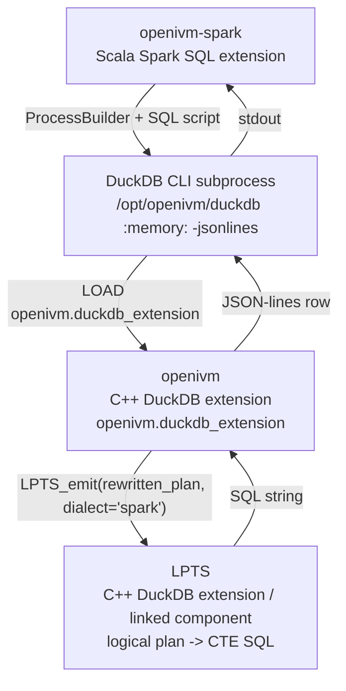
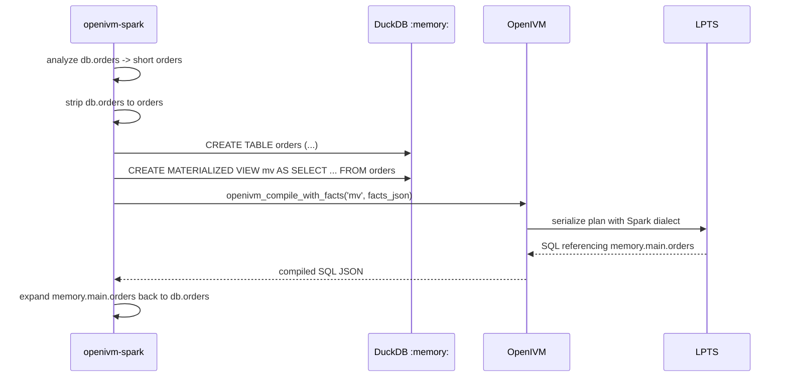
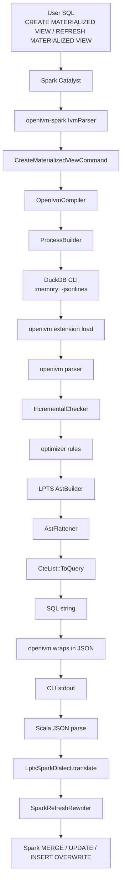
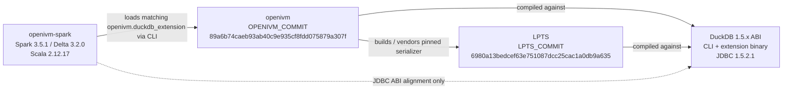

# 8. Integration with OpenIVM and Spark

> Scope: how LPTS is used by OpenIVM, and how that OpenIVM output is consumed
> by openivm-spark.
>
> This chapter is about the boundary contracts, not the internal correctness of
> each refresh strategy.
>
> Read with:
>
> - [openivm-spark / 4. DuckDB CLI compile bridge](../openivm-spark/4-duckdb-cli-compile-bridge.md)
> - [openivm-spark / 5. LptsSparkDialect](../openivm-spark/5-lpts-spark-dialect-postprocessor.md)
> - [openivm-spark / 6. SparkRefreshRewriter](../openivm-spark/6-refresh-rewriter-and-assemblers.md)
> - [openivm / 8. Cost model and adaptive refresh](../openivm/8-cost-model-and-adaptive-refresh.md)
> - [openivm / 11. Full refresh debugging, DuckDB side](../openivm/11-full-refresh-debugging-duckdb-side.md)

## 8.1 The stack

There are three product layers, plus the DuckDB runtime boundary that carries
OpenIVM and LPTS.

```text
openivm-spark (Scala)
  └─ calls DuckDB CLI subprocess with openivm.duckdb_extension loaded
      └─ openivm (C++ DuckDB extension)
          └─ calls LPTS to serialize rewritten delta plans
              └─ LPTS (C++ DuckDB extension)
```

The important point is that openivm-spark never links LPTS directly.
It links to neither LPTS headers nor LPTS binaries.
It launches DuckDB, loads OpenIVM, and OpenIVM reaches LPTS from inside the
native extension build.



In current code, `LPTS_emit(...)` is a useful architectural shorthand.
The concrete OpenIVM call sites invoke LPTS pipeline functions:

```cpp
SqlDialect dialect = facts.target_dialect;
auto ast = LogicalPlanToAst(*con.context, select_plan, dialect);
auto cte_list = AstToCteList(*ast, dialect);
view_query = cte_list->ToQuery(true, output_names);
```

Source landmarks:

- `spark-ext/ivm-compiler/src/main/scala/org/openivm/spark/compiler/OpenIvmCompiler.scala:144-196`
  builds the DuckDB script, embeds the Spark CompileFacts JSON, and calls `openivm_compile_with_facts`.
- `.temp/openivm/src/include/compile_facts.hpp` defines the per-call CompileFacts payload.
- `.temp/openivm/src/upsert/refresh.cpp` implements the compile table-function path.
- `.temp/lpts/src/lpts_pipeline.cpp:2500-2503` implements
  `LogicalPlanToAst`.
- `.temp/lpts/src/lpts_pipeline.cpp:3220-3223` implements
  `AstToCteList`.
- `.temp/lpts/src/cte_nodes.cpp:359-389` serializes `CteList::ToQuery`.

## 8.2 Layer responsibilities

### 8.2.1 openivm-spark

openivm-spark owns the Spark SQL surface and Spark execution.
It does four things around the native compiler:

1. Parses `CREATE MATERIALIZED VIEW`, `REFRESH MATERIALIZED VIEW`, and
   `DROP MATERIALIZED VIEW` through its Spark parser extension.
1. Analyzes the MV body in Spark, collecting source table schemas.
1. Calls OpenIVM through the DuckDB CLI bridge.
1. Post-processes and rewrites OpenIVM's compiled refresh program into Spark
   SQL / Delta Lake DML.

The compile bridge input is `CompileRequest`:

```scala
final case class CompileRequest(
    viewName: String,
    viewSql: String,
    sources: Map[String, StructType],
    sourceQualifiedNames: Map[String, String] = Map.empty
)
```

Source: `OpenIvmCompiler.scala:28-33`.

The output is `CompiledRefresh`:

```scala
final case class CompiledRefresh(
    refreshType: Int,
    refreshTypeName: String,
    sql: String,
    initialLoadSql: String
)
```

Source: `OpenIvmCompiler.scala:10-16`.

### 8.2.2 DuckDB CLI subprocess

The bridge intentionally uses a CLI subprocess, not JDBC execution.
Every compile starts a fresh process:

```scala
val pb = new ProcessBuilder(cliPath, ":memory:", "-jsonlines")
```

Source: `OpenIvmCompiler.scala:271-273`.

The default CLI path is derived beside the OpenIVM extension:

- default extension: `/opt/openivm/openivm.duckdb_extension`;
- default CLI: `/opt/openivm/duckdb`.

Source: `OpenIvmCompiler.scala:445-473`.

This boundary is ABI-sensitive.
The DuckDB CLI that loads `openivm.duckdb_extension` must be the CLI built from
the same DuckDB tree as the extension.
The Spark JVM is only the caller.

### 8.2.3 OpenIVM

OpenIVM owns the IVM classification and delta-plan generation.
For openivm-spark it is used in compile-only mode.
The Scala script loads the extension, keeps only the remaining session-scoped knobs,
and sends Spark-specific facts as one JSON payload:

```sql
LOAD '/opt/openivm/openivm.duckdb_extension';
SET openivm_minmax_incremental=false;
SET openivm_files_path='<compiler scratch directory>';
-- source CREATE TABLE statements and Spark function shims follow
CREATE OR REPLACE MATERIALIZED VIEW <view_name> AS <body>;
SELECT * FROM openivm_compile_with_facts(
  '<view_name>',
  '{"target_dialect":"spark","compile_only":true,"force_view_delta_cascade":true}'
);
```

Source: `OpenIvmCompiler.scala:149-195`.
The JSON keys select the Spark dialect, keep the compile side effect-free, and force cascade-delta emission for
Spark's depth-2 MV-over-MV support.

OpenIVM returns one row with:

```text
refresh_type        INTEGER
refresh_type_name   VARCHAR
sql                 VARCHAR
```

Source: `.temp/openivm/src/openivm_extension.cpp:375-386` and
`.temp/openivm/src/upsert/refresh.cpp:605-608`.

### 8.2.4 LPTS

LPTS owns logical-plan serialization.
OpenIVM calls it whenever OpenIVM needs to turn a DuckDB logical plan back into
SQL.
Conceptually:

```text
LPTS_emit(rewritten_plan, dialect='spark', options={...}) -> sql_string
```

Concrete pipeline:

```text
DuckDB LogicalOperator tree
  -> LogicalPlanToAst(context, plan, dialect)
  -> AstToCteList(ast, dialect)
  -> CteList::ToQuery(use_newlines=true, output_names=...)
  -> SQL string
```

LPTS has a `SqlDialect::SPARK` mode.
The enum documents it as Spark SQL syntax using backtick identifier quoting and
Spark-compatible window-frame restrictions.
Source: `.temp/lpts/src/include/sql_dialect.hpp:13-17`.

LPTS's helper layer renders Spark identifiers with backticks:

```cpp
if (dialect == SqlDialect::SPARK) {
    out << '`';
    ...
    out << '`';
    return out.str();
}
```

Source: `.temp/lpts/src/lpts_helpers.cpp:9-23`.

## 8.3 Handoff summary

| Boundary         | Caller        | Callee               | Payload                                                                              | Return            |
| ---------------- | ------------- | -------------------- | ------------------------------------------------------------------------------------ | ----------------- |
| Spark -> OpenIVM | openivm-spark | DuckDB CLI + OpenIVM | `openivm_compile_with_facts(view_name, facts_json)` after registering source schemas | JSON-lines row    |
| OpenIVM -> LPTS  | openivm       | LPTS pipeline        | `LPTS_emit(rewritten_plan, dialect='spark', options={...})`                          | SQL string        |
| LPTS -> OpenIVM  | LPTS          | openivm              | serialized CTE SQL                                                                   | string            |
| OpenIVM -> Spark | openivm       | openivm-spark        | `refresh_type`, `refresh_type_name`, `sql` plus sidecar initial-load SQL             | `CompiledRefresh` |

The user-facing compact form is:

```text
openivm-spark -> openivm:
  openivm_compile_with_facts(view_name, facts_json) with source schemas registered as DuckDB tables

openivm -> LPTS:
  LPTS_emit(rewritten_plan, dialect='spark', options={...})

LPTS -> openivm:
  sql_string

openivm -> openivm-spark:
  { refresh_type, sql, initial_load_sql }
```

The OpenIVM table function takes the view name and the CompileFacts JSON as its
SQL arguments.
The source-schema part is represented by the DuckDB tables that openivm-spark
creates in the ephemeral CLI session before the table function runs.

## 8.4 The dialect contract

openivm-spark requests Spark output through the CompileFacts payload:

```json
{"target_dialect":"spark","compile_only":true,"force_view_delta_cascade":true}
```

OpenIVM reads that per-call key and passes the parsed dialect into LPTS.
Source: `.temp/openivm/src/include/compile_facts.hpp` and the compile table-function path in
`.temp/openivm/src/upsert/refresh.cpp`.

The contract is intentionally pragmatic:

1. LPTS should emit Spark-looking SQL when `dialect='spark'`.
1. OpenIVM can still emit some DuckDB-shaped fragments outside the clean LPTS
   path.
1. openivm-spark owns a final defensive post-processor,
   `LptsSparkDialect.translate`.
1. `SparkRefreshRewriter` then converts the OpenIVM maintenance program into
   executable Delta Lake statements.

This is why chapter 5 of openivm-spark exists.
The Spark dialect is a shared responsibility, not a single switch.

## 8.5 Fix ownership map

| Fix                                                             | Owner                                                 | Justification                                                                                                              |
| --------------------------------------------------------------- | ----------------------------------------------------- | -------------------------------------------------------------------------------------------------------------------------- |
| `struct_extract(x, 'f')` -> `x.f`                               | LPTS Spark dialect **and** openivm-spark backup       | LPTS should serialize easy struct access; openivm-spark covers nested calls and sidecar SQL defensively.                   |
| `TIMESTAMP WITH TIME ZONE` -> `TIMESTAMP`                       | openivm-spark                                         | LPTS serializes DuckDB's logical type; Spark 3.5 rejects the SQL-standard suffix in emitted cast contexts.                 |
| `memory.main.<short>` -> `<db>.<short>`                         | openivm-spark                                         | The qualified-DB problem is created by openivm-spark's ephemeral `:memory:` compiler session and Spark catalog resolution. |
| double-quoted identifiers -> backticks                          | openivm-spark backup; LPTS Spark dialect should do it | LPTS Spark mode backtick-quotes identifiers, but OpenIVM or old cached SQL can still surface DuckDB quotes.                |
| `expr::TYPE` -> `CAST(expr AS TYPE)`                            | openivm-spark                                         | Postfix casts leak from DuckDB/OpenIVM fragments and Spark does not parse them.                                            |
| `VARCHAR`, `CHAR`, `TEXT` bare casts -> `STRING`                | openivm-spark                                         | Spark requires sized `VARCHAR(n)` / `CHAR(n)` or unbounded `STRING`; DuckDB often emits bare names.                        |
| `HUGEINT`, `UHUGEINT` -> `BIGINT`                               | openivm-spark                                         | DuckDB aggregate widening can produce 128-bit types Spark SQL does not recognize.                                          |
| `count_star()` -> `COUNT(*)`                                    | openivm-spark                                         | DuckDB has `count_star()`; Spark's spelling is standard `COUNT(*)`.                                                        |
| `generate_series(...)` -> `sequence(...)`                       | openivm-spark                                         | Projection refresh paths can contain DuckDB row-multiplicity expansion; Spark uses `sequence`.                             |
| `INTERVAL '1 day'` -> `INTERVAL 1 DAY`                          | openivm-spark                                         | DuckDB accepts quoted interval literals; Spark expects tokenized interval quantity and unit.                               |
| `to_milliseconds(expr)` and friends -> `expr * INTERVAL 1 UNIT` | openivm-spark                                         | LPTS/DuckDB interval helper functions do not exist in Spark.                                                               |
| `error(...)` -> `raise_error(...)`                              | openivm-spark                                         | DuckDB assertion helper name differs from Spark's built-in.                                                                |
| Spark shim macro bodies -> original Spark functions             | openivm-spark                                         | OpenIVM serializes DuckDB macro expansions; the Scala post-pass reverses them.                                             |
| `SELECT * EXCEPT (...)` expansion                               | `SparkRefreshRewriter`                                | This is not just dialect spelling; it needs Spark source schemas supplied by the caller.                                   |
| `LEFT SEMI JOIN` / `LEFT ANTI JOIN` before compile              | openivm-spark pre-normalization                       | DuckDB parses `SEMI JOIN` / `ANTI JOIN`, while Spark users write `LEFT SEMI/ANTI`.                                         |

Current `LptsSparkDialect.translate` order is:

1. `rewriteNowTimestamp`
1. `rewriteToTimestampDoubleCast`
1. `rewriteSparkFunctionInlinings`
1. `rewriteTimestampWithTimeZone`
1. `rewriteStructExtract`
1. `rewritePostfixCasts`
1. `rewriteBareVarcharCast`
1. `rewriteBareHugeIntCast`
1. `rewriteGenerateSeries`
1. `rewriteToTemporalUnit`
1. `rewriteIntervalLiterals`
1. `rewriteCountStar`
1. `rewriteErrorFn`
1. `rewriteDoubleQuotedIdentifiers`

Source: `LptsSparkDialect.scala:94-131`.

## 8.6 Why the post-processor remains necessary

The Spark dialect switch is necessary but not sufficient.
There are three sources of residual incompatibility.

First, OpenIVM emits some SQL by handwritten compiler paths.
Those paths can contain DuckDB syntax even when their embedded LPTS calls use
`SqlDialect::SPARK`.

Second, OpenIVM writes an initial-load sidecar file under `openivm_files_path`.
openivm-spark reads that file and translates the extracted CTAS body.
Source: `OpenIvmCompiler.scala:313-349`.

Third, MVs created under older versions may have cached compiled SQL in Spark
metadata.
The translator must remain idempotent and backward compatible.
See [openivm-spark chapter 5](../openivm-spark/5-lpts-spark-dialect-postprocessor.md).

## 8.7 The symmetric qualifier trick

The compiler subprocess is a DuckDB `:memory:` database.
openivm-spark registers source tables as short names:

```scala
val tableDdls: Seq[(String, String)] = req.sources.toSeq.map { case (name, schema) =>
  val cols = schema.fields.map(f => s"${f.name} ${sparkToDuckdbType(f.dataType)}").mkString(", ")
  name -> s"CREATE TABLE $name ($cols)"
}
```

Source: `OpenIvmCompiler.scala:75-78`.

But Spark workloads, especially dbt-style workloads, often reference sources as
`<db>.<table>`.
If that SQL were sent to DuckDB unchanged, DuckDB would look for a schema named
`<db>` in the `:memory:` database.
It would not find it.

So openivm-spark strips Spark database qualifiers before compile.

### 8.7.1 Before compile: `<db>.<table>` -> `<table>`

The call site is inside the `CREATE MATERIALIZED VIEW` statement that the bridge
sends to DuckDB:

```scala
sb ++= s"CREATE OR REPLACE MATERIALIZED VIEW ${req.viewName} AS ${
  normalizeSparkSqlForDuckdb(stripDbQualifiers(req.viewSql, req.sourceQualifiedNames))
};\n"
```

Source: `OpenIvmCompiler.scala:193-195`.

The helper is:

```scala
private[compiler] def stripDbQualifiers(
    sql: String,
    shortToQualified: Map[String, String]
): String = {
  val pairs = shortToQualified.toSeq.collect {
    case (short, qual) if qual.contains(".") && qual != short => (qual, short)
  }
  val sorted = pairs.sortBy(-_._1.length)
  sorted.foldLeft(sql) { case (acc, (qual, short)) =>
    val pattern = "(?i)\\b" + java.util.regex.Pattern.quote(qual) + "\\b"
    acc.replaceAll(pattern, java.util.regex.Matcher.quoteReplacement(short))
  }
}
```

Source: `OpenIvmCompiler.scala:221-234`.

The map comes from Spark analysis.
`collectSourceSchemas` returns both compile-time short schemas and a
`shortToQual` map.
Source: `MaterializedViewCommands.scala:112-126`.

### 8.7.2 After compile: `memory.main.<table>` -> `<db>.<table>`

LPTS serializes DuckDB table scans as qualified DuckDB names.
For the ephemeral compiler database, that often means:

```text
memory.main.<short>
```

For initial-load SQL, the Scala compiler bridge rewrites those references back:

```scala
for ((short, qual) <- req.sourceQualifiedNames) {
  sql = sql.replace(s"memory.main.$short", qual)
}
sql = sql.replaceAll("memory\\.main\\.", "")
LptsSparkDialect.translate(sql)
```

Source: `OpenIvmCompiler.scala:344-348`.

For refresh SQL, the inverse rewrite happens in `SparkRefreshRewriter`.
The caller passes the same map:

```scala
sourceQualifiedNames = shortToQual
```

Source: `MaterializedViewCommands.scala:997-1002`.

The rewriter stores it in a `ThreadLocal` so concurrent refreshes do not share
qualification state:

```scala
private val activeQualifiedNames: ThreadLocal[Map[String, String]] =
  new ThreadLocal[Map[String, String]] {
    override def initialValue(): Map[String, String] = Map.empty
  }
```

Source: `SparkRefreshRewriter.scala:62-65`.

At the top of each rewrite:

```scala
val prior = activeQualifiedNames.get()
activeQualifiedNames.set(sourceQualifiedNames)
try {
  ...
} finally {
  activeQualifiedNames.set(prior)
}
```

Source: `SparkRefreshRewriter.scala:125-178`.

This is the symmetric trick:



Without the first half, DuckDB cannot bind the view body.
Without the second half, Spark resolves `<short>` against the wrong current
schema or fails with `DELTA_TABLE_NOT_FOUND`.

## 8.8 End-to-end data flow



Notes on the diagram:

- `CreateMaterializedViewCommand` compiles during create to classify and cache
  SQL where possible.
- `RefreshMaterializedViewCommand` reuses cached SQL or recompiles on cache miss.
- `LptsSparkDialect.translate` is applied directly to initial-load SQL and as
  the `postProcess` hook for refresh statements.
- `SparkRefreshRewriter` is shape-driven: it splits OpenIVM's multi-statement
  program, classifies statement shapes, and emits Spark/Delta statements.

See [openivm-spark chapter 6](../openivm-spark/6-refresh-rewriter-and-assemblers.md)
for the statement-kind dispatch.

## 8.9 Version compatibility matrix

| Component                  | Current pin / version                                                                                                  | Where pinned                                                      | Why it matters                                                               |
| -------------------------- | ---------------------------------------------------------------------------------------------------------------------- | ----------------------------------------------------------------- | ---------------------------------------------------------------------------- |
| openivm-spark              | current repository checkout; benchmark image also pins `OPENIVM_SPARK_COMMIT=6dfe127dc03195bdcf4b1286ee612029ba10b23f` | benchmark Dockerfile ARG                                          | Spark extension jar must match the native compiler artifacts it expects.     |
| OpenIVM                    | `89a6b74caeb93ab40c9e935cf8fdd075879a307f`                                                                             | `spark-ext/dev/pins.env:5-7`                                      | Produces `openivm.duckdb_extension` and the matching DuckDB CLI.             |
| LPTS                       | `6980a13bedcef63e751087dcc25cac1a0db9a635`                                                                             | `spark-ext/dev/pins.env:25-27`                                    | OpenIVM builds this LPTS commit as its serializer dependency.                |
| DuckDB CLI / extension ABI | DuckDB 1.5.x, OpenIVM CI pin v1.5.2                                                                                    | OpenIVM build tree; `pins.env:55-56` documents the JDBC match     | `openivm.duckdb_extension` must be loaded by a CLI with the same native ABI. |
| DuckDB JDBC                | `1.5.2.1`                                                                                                              | `spark-ext/dev/pins.env:55-56`, `project/Dependencies.scala:7-11` | Not the compile execution path, but kept aligned with the native DuckDB ABI. |
| Spark                      | `3.5.1`                                                                                                                | `spark-ext/dev/pins.env:52`, `project/Dependencies.scala:4`       | Determines SQL dialect gaps and Catalyst/Delta behavior.                     |
| Delta Lake                 | `3.2.0`                                                                                                                | `spark-ext/dev/pins.env:53`, `project/Dependencies.scala:5`       | Determines MERGE, UPDATE, Delta path, and warehouse behavior.                |

The key constraints are:

1. openivm-spark requires a specific OpenIVM extension build.
1. OpenIVM requires a specific LPTS commit in `third_party/lpts`.
1. Both OpenIVM and LPTS are constrained by the DuckDB version they are built
   against.
1. openivm-spark's DuckDB JDBC dependency must not drift away from that ABI
   family even though the compile path is CLI-driven.

## 8.10 Version triangle



The triangle is deliberately pinned.
Treat any single-corner bump as a three-corner compatibility review.

## 8.11 Where pins live

The canonical openivm-spark pin file is:

```text
spark-ext/dev/pins.env
```

Current relevant entries:

```text
OPENIVM_REPO=https://github.com/mdrakiburrahman/openivm.git
OPENIVM_BRANCH=dev/mdrrahman/add-months-ila
OPENIVM_COMMIT=89a6b74caeb93ab40c9e935cf8fdd075879a307f

LPTS_REPO=https://github.com/mdrakiburrahman/lpts.git
LPTS_BRANCH=dev/mdrrahman/spark-add-months
LPTS_COMMIT=6980a13bedcef63e751087dcc25cac1a0db9a635

DUCKDB_JDBC_VERSION=1.5.2.1
```

Source: `spark-ext/dev/pins.env:4-56`.

The development Dockerfile consumes those build args and overrides OpenIVM's
`third_party/lpts` submodule URL/commit before building.
Source: `spark-ext/dev/docker/Dockerfile:33-69`.

The benchmark image must match the same native pins:

```text
.temp/ivm-bench/src/containers/spark-openivm-build/Dockerfile
```

That Dockerfile states the policy directly:

```text
OPENIVM_COMMIT and LPTS_COMMIT MUST match the values in
spark-ext/dev/pins.env at that SHA.
Whenever OPENIVM_SPARK_COMMIT is bumped, re-sync the other two pins from the
new pins.env.
```

Source: `.temp/ivm-bench/src/containers/spark-openivm-build/Dockerfile:25-29`.

When synchronized, its defaults should match `pins.env`:

```text
ARG OPENIVM_COMMIT=89a6b74caeb93ab40c9e935cf8fdd075879a307f
ARG LPTS_COMMIT=6980a13bedcef63e751087dcc25cac1a0db9a635
```

Source: `.temp/ivm-bench/src/containers/spark-openivm-build/Dockerfile:38-43`.

> The ivm-bench Dockerfile still declares the previous `LPTS_COMMIT`
> (`b3baf0bb…`); `dev.sh pins-sync` reports that as a non-fatal drift WARNING
> until the benchmark repo is re-synced to `6980a13b…`.

Pinning policy:

1. Change `spark-ext/dev/pins.env` first.
1. Rebuild the dev image so `openivm.duckdb_extension` and `duckdb` are built
   together.
1. Sync the benchmark Dockerfile ARGs to the same OpenIVM and LPTS commits.
1. Keep `DUCKDB_JDBC_VERSION` aligned with OpenIVM's DuckDB ABI family.
1. Run the openivm-spark verification path before trusting the new triangle.

See `spark-ext/README.md:68-80` for the same operational rule in the dev-loop
section.

## 8.12 Failure modes at the boundaries

### 8.12.1 DuckDB cannot bind Spark SQL

Symptom: `openivm_compile_with_facts` never returns a result row.
Likely causes:

- a qualified Spark table name was not stripped before compile;
- a Spark-only function lacks a shim;
- the MV body uses syntax outside the Spark/DuckDB intersection.

Relevant code:

- `stripDbQualifiers`, `OpenIvmCompiler.scala:221-234`;
- `normalizeSparkSqlForDuckdb`, `OpenIvmCompiler.scala:254-262`;
- Spark function shims, `OpenIvmCompiler.scala:479-533`.

### 8.12.2 LPTS emits mostly Spark SQL but one token is illegal

Symptom: Spark parser or analyzer rejects compiled refresh SQL.
Likely causes:

- a DuckDB cast form leaked;
- a DuckDB helper function leaked;
- `memory.main.<short>` was not expanded;
- a cached old SQL string predates a dialect fix.

Relevant code:

- `LptsSparkDialect.translate`, `LptsSparkDialect.scala:94-131`;
- `SparkRefreshRewriter.rewrite`, `SparkRefreshRewriter.scala:108-178`.

### 8.12.3 Native ABI mismatch

Symptom: DuckDB CLI fails while loading `openivm.duckdb_extension`, or crashes
before returning JSON.
Likely causes:

- OpenIVM extension built from one DuckDB commit;
- CLI from another DuckDB commit;
- benchmark Dockerfile pins drifted from `pins.env`.

Relevant files:

- `spark-ext/dev/pins.env`;
- `spark-ext/dev/docker/Dockerfile`;
- `.temp/ivm-bench/src/containers/spark-openivm-build/Dockerfile`.

## 8.13 Cross-links

openivm-spark chapters:

- [0. Overview](../openivm-spark/0.OVERVIEW.md) explains the Spark extension map.
- [1. Session extension and feature gate](../openivm-spark/1-session-extension-and-feature-gate.md) covers how the extension enters Spark.
- [2. IVM DDL parser grammar](../openivm-spark/2-ivm-ddl-parser-grammar.md) covers the Spark SQL surface.
- [3. DML interception and staging](../openivm-spark/3-dml-interception-and-staging.md) covers the staged deltas consumed at refresh time.
- [4. DuckDB CLI compile bridge](../openivm-spark/4-duckdb-cli-compile-bridge.md) is the direct companion to this chapter.
- [5. LptsSparkDialect postprocessor](../openivm-spark/5-lpts-spark-dialect-postprocessor.md) details the Spark dialect backup layer.
- [6. Refresh rewriter and assemblers](../openivm-spark/6-refresh-rewriter-and-assemblers.md) explains how OpenIVM SQL becomes Spark MERGE/UPDATE/INSERT.
- [7. State storage, RocksDB, and Delta](../openivm-spark/7-state-storage-rocksdb-and-delta.md) covers metadata persistence.
- [8. MV lifecycle create-refresh-drop](../openivm-spark/8-mv-lifecycle-create-refresh-drop.md) places compile in the lifecycle.
- [9. MV-over-MV cascade and fingerprints](../openivm-spark/9-mv-over-mv-cascade-and-fingerprints.md) depends on cascade delta emission settings.
- [10. Concurrency, mutex, retry, multiprocess](../openivm-spark/10-concurrency-mutex-retry-multiprocess.md) covers isolation around refreshes.
- [11. Full refresh demotion debugging](../openivm-spark/11-full-refresh-demotion-debugging.md) covers fallback behavior.
- [12. Parity gap forensics](../openivm-spark/12-parity-gap-forensics.md) is useful when LPTS/OpenIVM/Spark disagree.

OpenIVM chapters:

- [8. Cost model and adaptive refresh](../openivm/8-cost-model-and-adaptive-refresh.md) explains DuckDB-side refresh strategy selection concerns.
- [11. Full refresh debugging, DuckDB side](../openivm/11-full-refresh-debugging-duckdb-side.md) explains how to debug OpenIVM-side demotions and compile output.

## 8.14 Mental model

Keep the boundary sentence short:

```text
Spark asks OpenIVM for refresh math; OpenIVM asks LPTS to print that math as
Spark-ish SQL; Spark then repairs the remaining dialect leaks and executes the
result against Delta tables.
```

That is why fixes should be placed by ownership:

- plan semantics and refresh classification belong in OpenIVM;
- logical-plan-to-SQL serialization belongs in LPTS;
- Spark catalog, Delta execution, and Spark 3.5 parser gaps belong in
  openivm-spark;
- ABI and commit compatibility belong in the pin files and Docker images.
