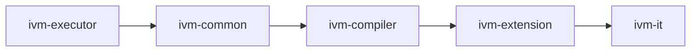
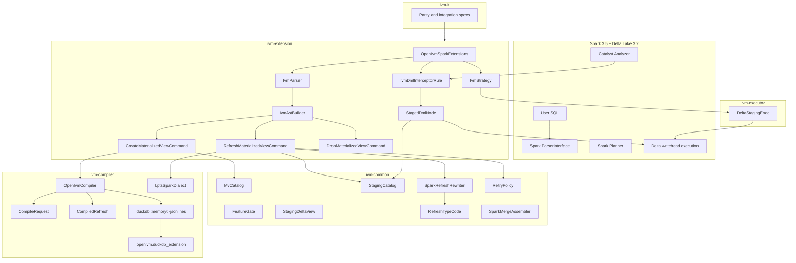
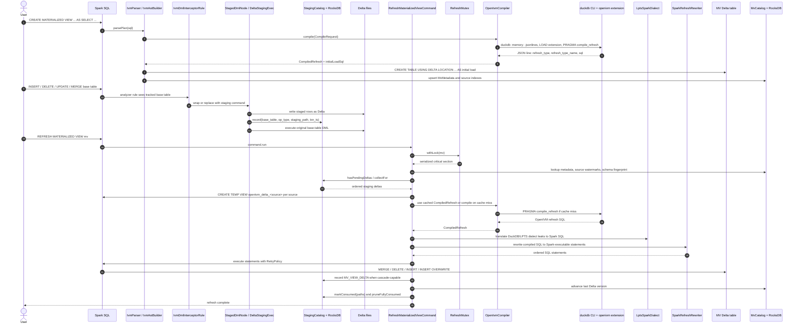

# 0. Overview: openivm-spark from 10,000 feet

openivm-spark is a Spark 3.5 / Delta Lake 3.2 SQL extension that brings OpenIVM-style incremental
materialized-view maintenance to Spark without requiring Delta Change Data Feed.
It does that by tee-ing Spark DML writes into staging Delta paths, then calling the DuckDB CLI with the
`openivm.duckdb_extension` loaded at compile time to obtain the IVM refresh math.

The shortest mental model is:

```text
Spark SQL surface
  + OpenIVM DDL parser
  + DML tee into staging Delta files
  + RocksDB metadata/catalogs
  + DuckDB CLI compile bridge
  + Spark SQL refresh rewriter
= incremental materialized views on Delta tables
```

The extension is not a replacement for Delta internals.
It is a Spark SQL extension layered above Delta.
Base tables remain Delta tables.
Materialized views are Delta tables.
DML still commits through Delta.
The openivm-spark-specific work is to capture enough row-level change information before or around the
base-table write so a later `REFRESH MATERIALIZED VIEW` can replay the relevant signed delta.

## 0.1 Scope of this chapter

This chapter is the map before the terrain.
It names every major moving part, explains how they fit together, and points to the later chapters in a
recommended order.
It intentionally omits most operator-specific rewrite details.
Those belong in the deep dives.

The important source landmarks are:

- Spark extension bootstrap: `OpenIvmSparkExtensions.apply`.
- SQL surface: `IvmParser`, `IvmSqlBase.g4`, and `IvmAstBuilder`.
- DML capture: `IvmDmlInterceptorRule`, `StagedDmlNode`, `DeltaStagingExec`.
- Metadata and staging catalogs: `MvCatalog`, `StagingCatalog`, `StagingDeltaView`.
- Compiler bridge: `OpenIvmCompiler`, `CompileRequest`, `CompiledRefresh`.
- Dialect bridge: `LptsSparkDialect` and `SparkRefreshRewriter`.
- Refresh commands: `CreateMaterializedViewCommand`, `RefreshMaterializedViewCommand`,
  `DropMaterializedViewCommand`.

The module graph is deliberately narrow:

```text
ivm-executor → ivm-common → ivm-compiler → ivm-extension → ivm-it
```

The root `build.sbt` documents the same dependency direction in reverse consumer order:
`ivm-it -> ivm-extension -> ivm-compiler -> ivm-common -> ivm-executor`
(`spark-ext/build.sbt:1-5`).
The project definitions enforce it through `.dependsOn(...)` for each layer
(`spark-ext/build.sbt:37-72`).

## 0.2 What the extension injects

Spark loads openivm-spark through the standard `spark.sql.extensions` hook.
The entry class is `org.openivm.spark.OpenIvmSparkExtensions`.
Its `apply` method injects exactly three Spark extension hooks, in this order:

1. `IvmParser`, through `injectParser`.
2. `IvmDmlInterceptorRule`, through `injectResolutionRule`.
3. `IvmStrategy`, through `injectPlannerStrategy`.

The code is only five lines long, and the ordering matters:

```scala
ext.injectParser((session, parent) => new parser.IvmParser(session, parent))
ext.injectResolutionRule(session => new analyzer.IvmDmlInterceptorRule(session))
ext.injectPlannerStrategy(session => new analyzer.IvmStrategy(session))
```

Citation: `spark-ext/ivm-extension/src/main/scala/org/openivm/spark/OpenIvmSparkExtensions.scala:27-31`.

The parser adds the DDL surface.
The resolution rule recognizes DML logical plans against tables that have dependent MVs.
The planner strategy maps staging logical nodes to physical staging execution nodes.

The injected parser handles only statements whose leading tokens are one of:

- `CREATE MATERIALIZED VIEW`
- `REFRESH MATERIALIZED VIEW`
- `DROP MATERIALIZED VIEW`

All other SQL is delegated back to Spark's own parser unchanged
(`spark-ext/ivm-extension/src/main/scala/org/openivm/spark/parser/IvmParser.scala:42-44`).
The grammar says the same thing in prose and only declares those three productions
(`spark-ext/ivm-extension/src/main/antlr4/org/openivm/spark/parser/IvmSqlBase.g4:1-15`,
`spark-ext/ivm-extension/src/main/antlr4/org/openivm/spark/parser/IvmSqlBase.g4:35-59`).
The MV query body is captured as raw text and re-parsed by Spark's parser, preserving Spark SELECT syntax
(`spark-ext/ivm-extension/src/main/scala/org/openivm/spark/parser/IvmAstBuilder.scala:30-43`,
`spark-ext/ivm-extension/src/main/scala/org/openivm/spark/parser/IvmAstBuilder.scala:93-102`).

## 0.3 Feature gate discrepancy

There is a feature gate named `spark.openivm.enabled`.
`FeatureGate.EnabledKey` defines the key and reads it from `SparkConf`, defaulting to `false`
(`spark-ext/ivm-common/src/main/scala/org/openivm/spark/common/FeatureGate.scala:17-25`).
The extension class comment claims that, when the gate is off, the class is a no-op and Spark boots as if the
jar were absent
(`spark-ext/ivm-extension/src/main/scala/org/openivm/spark/OpenIvmSparkExtensions.scala:15-24`).

The implementation currently does not match that claim.
`OpenIvmSparkExtensions.apply` registers all three injections unconditionally
(`spark-ext/ivm-extension/src/main/scala/org/openivm/spark/OpenIvmSparkExtensions.scala:27-31`).
The only visible gate check in the injected flow is inside `IvmDmlInterceptorRule.apply`, which immediately
returns the original logical plan when the flag is disabled or the rule is in bypass mode
(`spark-ext/ivm-extension/src/main/scala/org/openivm/spark/analyzer/IvmDmlInterceptorRule.scala:38-42`).

That means the current truth table is:

| Area | Injection unconditional? | Gate checked in code path? | Effect when gate is false |
| --- | --- | --- | --- |
| Parser | Yes | No in `IvmParser.parsePlan` | OpenIVM DDL is still routed to the custom parser. |
| DML rule | Yes | Yes in `IvmDmlInterceptorRule.apply` | DML interception is skipped. |
| Planner strategy | Yes | No in `IvmStrategy.apply` | Strategy exists, but only matters if a staging logical node appears. |

The discrepancy is important operationally.
If the jar is on the classpath, the parser hook is present even with the default gate value.
If you are debugging unexpected DML capture, however, the first branch to inspect is still the gate check in
`IvmDmlInterceptorRule.apply`.

## 0.4 Module dependency chain

The sbt build creates five modules plus the aggregate root.
Each production layer depends only on the layer immediately below it:



Read the arrows as "provides API to".
The sbt syntax reads in the consumer direction:

- `ivmCommon.dependsOn(ivmExecutor)`
- `ivmCompiler.dependsOn(ivmCommon)`
- `ivmExtension.dependsOn(ivmCompiler)`
- `ivmIt.dependsOn(ivmExtension)`

Citations: `spark-ext/build.sbt:37-72`.

The root project aggregates all five modules but publishes nothing
(`spark-ext/build.sbt:30-35`).
The pinned runtime stack is Spark 3.5.1, Delta Lake 3.2.0, Scala 2.12.17, DuckDB JDBC 1.5.2.1 for ABI
alignment, and RocksDB JNI 8.3.2
(`spark-ext/project/Dependencies.scala:4-20`).
The assembled jar shades DuckDB and ANTLR packages, but deliberately does not shade RocksDB JNI
(`spark-ext/project/Settings.scala:128-148`).

## 0.5 Component diagram



Public API anchors in that diagram:

- `OpenIvmSparkExtensions.apply` is the external Spark hook
  (`spark-ext/ivm-extension/src/main/scala/org/openivm/spark/OpenIvmSparkExtensions.scala:25-31`).
- `IvmParser.parsePlan` is the SQL routing point
  (`spark-ext/ivm-extension/src/main/scala/org/openivm/spark/parser/IvmParser.scala:42-44`).
- `CreateMaterializedViewCommand.run`, `RefreshMaterializedViewCommand.run`, and
  `DropMaterializedViewCommand.run` are Spark command entry points
  (`spark-ext/ivm-extension/src/main/scala/org/openivm/spark/commands/MaterializedViewCommands.scala:333-757`,
  `spark-ext/ivm-extension/src/main/scala/org/openivm/spark/commands/MaterializedViewCommands.scala:768-1181`,
  `spark-ext/ivm-extension/src/main/scala/org/openivm/spark/commands/MaterializedViewCommands.scala:1359-1420`).
- `OpenIvmCompiler.compile` returns a `CompiledRefresh`
  (`spark-ext/ivm-compiler/src/main/scala/org/openivm/spark/compiler/OpenIvmCompiler.scala:58-98`).
- `SparkRefreshRewriter.rewrite` returns ordered Spark SQL statements
  (`spark-ext/ivm-common/src/main/scala/org/openivm/spark/common/SparkRefreshRewriter.scala:79-179`).

## 0.6 Two state systems

openivm-spark has two persistent state systems.
They serve different purposes and should not be confused.

RocksDB stores metadata and idempotency state.
Delta stores materialized data and staged row sets.

```text
<warehouse>/
├── _openivm/                         # RocksDB metadata and some trigger scratch
│   ├── index/rocksdb/                # MV index, source→MV index, table index
│   ├── mvs/<safe-mv-name>/rocksdb/   # one RocksDB per MV: meta, properties, consumed
│   ├── tables/<safe-table>/rocksdb/  # one RocksDB per base table: staging records
│   └── triggers/<mv>/<uuid>/         # Delta trigger rows for non-cascade upstreams
│
└── _ivm/                             # Delta-backed data managed by openivm-spark
    ├── views/<db>/<mv>/              # materialized-view Delta table location
    └── view_deltas/<mv>/<uuid>/      # per-refresh persisted view delta for cascades
```

`MvCatalog` computes the RocksDB index path under `<warehouse>/_openivm/index/rocksdb` and per-MV paths under
`<warehouse>/_openivm/mvs/<safe-name>/rocksdb`
(`spark-ext/ivm-common/src/main/scala/org/openivm/spark/common/MvCatalog.scala:152-164`).
`StagingCatalog` computes the same index path and per-base-table RocksDB paths under
`<warehouse>/_openivm/tables/<safe-table>/rocksdb`
(`spark-ext/ivm-common/src/main/scala/org/openivm/spark/common/StagingCatalog.scala:84-93`).

The MV's physical Delta location is `<warehouse>/_ivm/views/<db>/<table>`
(`spark-ext/ivm-extension/src/main/scala/org/openivm/spark/commands/MaterializedViewCommands.scala:105-110`).
Per-refresh view-delta paths live under `<warehouse>/_ivm/view_deltas/<safe-mv-name>/<uuid>`
(`spark-ext/ivm-extension/src/main/scala/org/openivm/spark/commands/MaterializedViewCommands.scala:944-956`).
Drop cleanup removes the MV data and the per-MV view-delta namespace
(`spark-ext/ivm-extension/src/main/scala/org/openivm/spark/commands/MaterializedViewCommands.scala:1387-1413`).

The main RocksDB records are:

- MV metadata: name, original query SQL, refresh type, last Delta version, sources, schema fingerprint,
  location, creation time, and properties
  (`spark-ext/ivm-common/src/main/scala/org/openivm/spark/common/MvCatalog.scala:18-43`).
- MV properties: watermarks, cached compiled SQL, cascade-delta capability, group keys, count column, and
  HAVING predicate where relevant
  (`spark-ext/ivm-common/src/main/scala/org/openivm/spark/common/MvCatalog.scala:45-121`).
- Staging records: base table, op type, staging Delta path, transaction timestamp, and consumed state
  (`spark-ext/ivm-common/src/main/scala/org/openivm/spark/common/StagingCatalog.scala:11-27`).
- Per-MV consumed-path marks, written by `StagingCatalog.markConsumed`
  (`spark-ext/ivm-common/src/main/scala/org/openivm/spark/common/StagingCatalog.scala:270-283`).

The main Delta artifacts are:

- MV data tables in `_ivm/views`.
- DML staging Delta tables written by the interceptor to generated staging paths.
- Per-refresh MV view-delta tables in `_ivm/view_deltas`.
- Empty Delta trigger tables under `_openivm/triggers` for downstream full-refresh-demoted MVs when an upstream
  has no cascade-usable view delta
  (`spark-ext/ivm-extension/src/main/scala/org/openivm/spark/commands/MaterializedViewCommands.scala:1283-1314`).

## 0.7 DML capture without Delta CDF

The design avoids Delta CDF by intercepting Spark logical plans before or around Delta's write execution.
For INSERT and OVERWRITE paths, the rule wraps the query side with staging work and records a `StagingDelta`.
For DELETE, UPDATE, and MERGE paths, the command wrapper stages pre-DML and/or post-DML rows before executing the
original DML under a bypass flag.

The rule recognizes Spark V2 write forms and Delta-lowered forms.
The class comment documents that Delta analysis runs before the openivm rule in the Resolution batch, so the rule
must handle both shapes
(`spark-ext/ivm-extension/src/main/scala/org/openivm/spark/analyzer/IvmDmlInterceptorRule.scala:16-37`).
Concrete matches include:

- `AppendData` for INSERT
  (`spark-ext/ivm-extension/src/main/scala/org/openivm/spark/analyzer/IvmDmlInterceptorRule.scala:49-56`).
- `OverwriteByExpression` for OVERWRITE
  (`spark-ext/ivm-extension/src/main/scala/org/openivm/spark/analyzer/IvmDmlInterceptorRule.scala:61-68`).
- Delta delete/update/merge nodes
  (`spark-ext/ivm-extension/src/main/scala/org/openivm/spark/analyzer/IvmDmlInterceptorRule.scala:73-141`).
- Delta-lowered `ReplaceData` and `WriteDelta` fallbacks
  (`spark-ext/ivm-extension/src/main/scala/org/openivm/spark/analyzer/IvmDmlInterceptorRule.scala:147-171`).

`DeltaStagingExec` is the physical tee for insert-like paths.
It executes its child once, caches the RDD, writes an external-row DataFrame to a Delta staging path, records the
staging catalog entry, and returns the cached input RDD to the parent Delta write
(`spark-ext/ivm-extension/src/main/scala/org/openivm/spark/executor/DeltaStagingExec.scala:12-31`,
`spark-ext/ivm-extension/src/main/scala/org/openivm/spark/executor/DeltaStagingExec.scala:44-77`).

`StagedDmlNode` wraps DML commands that need explicit pre/post staging.
It sets the interceptor bypass flag, writes each staging delta as Delta, executes the original DML, writes any
post-staging deltas, and clears the bypass flag in `finally`
(`spark-ext/ivm-extension/src/main/scala/org/openivm/spark/analyzer/StagedDmlNode.scala:13-33`,
`spark-ext/ivm-extension/src/main/scala/org/openivm/spark/analyzer/StagedDmlNode.scala:43-91`).

At refresh time, `StagingDeltaView.buildSourceDeltaViewSql` converts the stored Delta paths into the
`openivm_delta_<source>` temp views expected by the compiled OpenIVM SQL.
It synthesizes `openivm_multiplicity = +1` for inserts/overwrites/update-after, `-1` for deletes/update-before,
preserves multiplicity for MV-over-MV deltas, and creates an empty view when a source has no usable deltas
(`spark-ext/ivm-common/src/main/scala/org/openivm/spark/common/StagingDeltaView.scala:5-18`,
`spark-ext/ivm-common/src/main/scala/org/openivm/spark/common/StagingDeltaView.scala:36-100`).

## 0.8 Compile bridge: DuckDB CLI plus OpenIVM

The compile bridge is in `ivm-compiler`.
It does not run OpenIVM inside Spark.
It spawns the DuckDB CLI as an external process, loads the OpenIVM DuckDB extension, and asks OpenIVM to compile a
refresh program.

The bridge's public request/response objects are:

- `CompileRequest(viewName, viewSql, sources, sourceQualifiedNames)`
  (`spark-ext/ivm-compiler/src/main/scala/org/openivm/spark/compiler/OpenIvmCompiler.scala:18-33`).
- `CompiledRefresh(refreshType, refreshTypeName, sql, initialLoadSql)`
  (`spark-ext/ivm-compiler/src/main/scala/org/openivm/spark/compiler/OpenIvmCompiler.scala:10-16`).

Each compile call registers empty DuckDB tables with Spark-derived schemas, creates a temporary OpenIVM materialized
view, runs `PRAGMA compile_refresh('<view>')`, and parses the emitted SQL program
(`spark-ext/ivm-compiler/src/main/scala/org/openivm/spark/compiler/OpenIvmCompiler.scala:58-87`).
The class comment explicitly says each call spawns `duckdb :memory: -jsonlines`
(`spark-ext/ivm-compiler/src/main/scala/org/openivm/spark/compiler/OpenIvmCompiler.scala:40-49`).
The process builder executes `cliPath :memory: -jsonlines`
(`spark-ext/ivm-compiler/src/main/scala/org/openivm/spark/compiler/OpenIvmCompiler.scala:267-273`).

The generated DuckDB script starts with:

- `LOAD '<extensionPath>'`
- `SET openivm_target_dialect='spark'`
- `SET openivm_compile_only=true`
- `SET openivm_enable_view_matching=false`
- cascade and recompute pragmas required by Spark-side MV-over-MV support
- `CREATE TABLE` statements for all sources
- Spark function shim macros
- `CREATE OR REPLACE MATERIALIZED VIEW ... AS ...`
- `PRAGMA compile_refresh('<view>')`

Citations: `spark-ext/ivm-compiler/src/main/scala/org/openivm/spark/compiler/OpenIvmCompiler.scala:144-196`.

The default extension path is `/opt/openivm/openivm.duckdb_extension`.
The default CLI path is either `OPENIVM_CLI_PATH` or the `duckdb` executable co-located with the extension, falling
back to `/opt/openivm/duckdb`
(`spark-ext/ivm-compiler/src/main/scala/org/openivm/spark/compiler/OpenIvmCompiler.scala:431-473`).
The dependency file notes that the compiler uses the CLI at `/opt/openivm/duckdb` rather than JDBC, while DuckDB JDBC
is pinned for ABI alignment
(`spark-ext/project/Dependencies.scala:7-11`).

The bridge parses the CLI's JSON-lines output by finding the line containing `"refresh_type"`, extracting
`refresh_type`, `refresh_type_name`, and `sql`, and returning `CompiledRefresh`
(`spark-ext/ivm-compiler/src/main/scala/org/openivm/spark/compiler/OpenIvmCompiler.scala:301-310`,
`spark-ext/ivm-compiler/src/main/scala/org/openivm/spark/compiler/OpenIvmCompiler.scala:351-370`).
It also reads the compiled initial-load SQL from the file that OpenIVM emits under the compile scratch directory and
translates it back toward Spark syntax
(`spark-ext/ivm-compiler/src/main/scala/org/openivm/spark/compiler/OpenIvmCompiler.scala:313-349`).

## 0.9 Refresh types and ordinals

OpenIVM emits a refresh-type ordinal.
Spark stores that ordinal in `MvMetadata.refreshType` and dispatches Spark-side rewrite logic from it.
The Spark mirror lives in `RefreshTypeCode` and declares ordinals 0 through 9
(`spark-ext/ivm-common/src/main/scala/org/openivm/spark/common/RefreshTypeCode.scala:3-18`).
The upstream OpenIVM enum has the same order
(`.temp/openivm/src/include/core/openivm_constants.hpp:67-79`).

| Ordinal | Name | Spark-side meaning in this project |
| ---: | --- | --- |
| 0 | `AGGREGATE_GROUP` | Keyed aggregate maintenance; generally MERGE-driven with count-monoid cleanup. |
| 1 | `SIMPLE_AGGREGATE` | Scalar aggregate maintenance; Spark rewrites UPDATE-shaped programs. |
| 2 | `SIMPLE_PROJECTION` | Signed projection maintenance; Spark uses view-delta CTAS plus INSERT/DELETE/MERGE shapes. |
| 3 | `FULL_REFRESH` | Recompute from the original user query via `INSERT OVERWRITE`. |
| 4 | `AGGREGATE_HAVING` | Data table stores all groups; user-facing Spark view applies HAVING. |
| 5 | `WINDOW_PARTITION` | Partition-scoped recompute plus optional cascade view-delta support. |
| 6 | `GROUP_RECOMPUTE` | Affected-key recompute for non-linear group cases. |
| 7 | `TOP_K` | Dead enum value for Spark execution; top-k views are explicitly demoted to `FULL_REFRESH`. |
| 8 | `DISTINCT_INCREMENTAL` | Count-monoid DISTINCT maintenance where supported. |
| 9 | `SEMI_ANTI_RECOMPUTE` | Aux-state / recompute path for SEMI/ANTI cases. |

`TOP_K = 7` deserves special treatment.
`RefreshTypeCode` says TopK is a dead enum value and the classifier never assigns it in the expected path
(`spark-ext/ivm-common/src/main/scala/org/openivm/spark/common/RefreshTypeCode.scala:14-18`).
OpenIVM's upstream enum also calls `TOP_K` a legacy enum value whose current top-k support strips
`ORDER BY`/`LIMIT` into the user-facing view
(`.temp/openivm/src/include/core/openivm_constants.hpp:73-76`).
The Spark CREATE path detects top-level top-k wrappers and forces the effective refresh type to `FULL_REFRESH`
(`spark-ext/ivm-extension/src/main/scala/org/openivm/spark/commands/MaterializedViewCommands.scala:183-206`,
`spark-ext/ivm-extension/src/main/scala/org/openivm/spark/commands/MaterializedViewCommands.scala:488-507`,
`spark-ext/ivm-extension/src/main/scala/org/openivm/spark/commands/MaterializedViewCommands.scala:597-599`).

The dispatcher table in `SparkMergeAssembler` is still useful as a high-level index of Spark strategies:
MERGE-like paths for 0, 1, 2, 4, and 8; full refresh for 3; affected-groups paths for 5 and 6; aux-state for 9;
TopK unsupported as a direct assembler target
(`spark-ext/ivm-common/src/main/scala/org/openivm/spark/common/SparkMergeAssembler.scala:3-24`,
`spark-ext/ivm-common/src/main/scala/org/openivm/spark/common/SparkMergeAssembler.scala:28-47`).

## 0.10 End-to-end sequence

The end-to-end flow has two time scales.
DML happens whenever users mutate a base table.
Refresh happens later when users issue `REFRESH MATERIALIZED VIEW`.
The staging catalog joins those two time scales.



Concrete refresh orchestration anchors:

- `RefreshMaterializedViewCommand.run` serializes by MV name through `RefreshMutex.withLock`
  (`spark-ext/ivm-extension/src/main/scala/org/openivm/spark/commands/MaterializedViewCommands.scala:764-778`).
- `RefreshMutex` is a JVM-wide per-MV lock map
  (`spark-ext/ivm-extension/src/main/scala/org/openivm/spark/commands/MaterializedViewCommands.scala:53-88`).
- Refresh reads metadata and pending staging deltas before doing any rewrite work
  (`spark-ext/ivm-extension/src/main/scala/org/openivm/spark/commands/MaterializedViewCommands.scala:784-827`).
- Full refresh uses `SparkMergeAssembler` to build `INSERT OVERWRITE`
  (`spark-ext/ivm-extension/src/main/scala/org/openivm/spark/commands/MaterializedViewCommands.scala:856-884`,
  `spark-ext/ivm-common/src/main/scala/org/openivm/spark/common/FullRefreshAssembler.scala:3-22`).
- Incremental refresh creates per-source `openivm_delta_<source>` temp views
  (`spark-ext/ivm-extension/src/main/scala/org/openivm/spark/commands/MaterializedViewCommands.scala:957-972`).
- It then calls `SparkRefreshRewriter.rewrite` with `LptsSparkDialect.translate` as the post-processor
  (`spark-ext/ivm-extension/src/main/scala/org/openivm/spark/commands/MaterializedViewCommands.scala:983-1004`).
- It executes the rewritten statements under Delta conflict retry
  (`spark-ext/ivm-extension/src/main/scala/org/openivm/spark/commands/MaterializedViewCommands.scala:1027-1089`).
- It records cascade view deltas when the MV emits them
  (`spark-ext/ivm-extension/src/main/scala/org/openivm/spark/commands/MaterializedViewCommands.scala:1107-1155`).
- It advances the MV version, marks consumed staging paths, and prunes fully consumed staging rows
  (`spark-ext/ivm-extension/src/main/scala/org/openivm/spark/commands/MaterializedViewCommands.scala:1224-1281`).

## 0.11 How CREATE differs from REFRESH

`CREATE MATERIALIZED VIEW` has two responsibilities.
First, it classifies and compiles the view definition.
Second, it creates the initial Delta table snapshot.

The CREATE path:

1. Ensures both catalogs exist
   (`spark-ext/ivm-extension/src/main/scala/org/openivm/spark/commands/MaterializedViewCommands.scala:333-338`).
2. Resolves source tables and full source schemas from Spark's analyzed plan
   (`spark-ext/ivm-extension/src/main/scala/org/openivm/spark/commands/MaterializedViewCommands.scala:112-173`).
3. Invokes `OpenIvmCompiler.compile`
   (`spark-ext/ivm-extension/src/main/scala/org/openivm/spark/commands/MaterializedViewCommands.scala:359-393`).
4. Applies Spark-specific demotions and capability checks, including top-k, no-real-delta, unsafe HAVING, and
   MV-over-MV cascade constraints
   (`spark-ext/ivm-extension/src/main/scala/org/openivm/spark/commands/MaterializedViewCommands.scala:459-619`).
5. Persists cached compiled SQL and metadata properties when the view stays incremental
   (`spark-ext/ivm-extension/src/main/scala/org/openivm/spark/commands/MaterializedViewCommands.scala:653-674`).
6. Creates the initial Delta table using the OpenIVM initial-load SQL when appropriate, otherwise the original
   user query
   (`spark-ext/ivm-extension/src/main/scala/org/openivm/spark/commands/MaterializedViewCommands.scala:696-718`).
7. Writes `MvCatalog` metadata and records the initial Delta version
   (`spark-ext/ivm-extension/src/main/scala/org/openivm/spark/commands/MaterializedViewCommands.scala:745-752`).

`REFRESH MATERIALIZED VIEW` has a different responsibility.
It consumes staged changes and mutates an already-created Delta table.
It does not re-run CREATE-time table creation.
It validates source schema fingerprints, assembles temp delta views, rewrites the compiled OpenIVM program, executes
Spark SQL, records cascade triggers, marks staging consumed, and advances the MV version.

## 0.12 Why LPTS translation and SparkRefreshRewriter are separate

OpenIVM and LPTS emit SQL that is close to Spark SQL but not identical.
Some differences are lexical or dialect-level:

- `now()::timestamp`
- DuckDB postfix casts such as `x::DOUBLE`
- `generate_series(...)`
- `INTERVAL '1 day'`
- `count_star()`
- double-quoted identifiers
- Spark function shim inlinings

`LptsSparkDialect.translate` handles these string-level dialect leaks as a pure post-processor
(`spark-ext/ivm-compiler/src/main/scala/org/openivm/spark/compiler/LptsSparkDialect.scala:1-10`,
`spark-ext/ivm-compiler/src/main/scala/org/openivm/spark/compiler/LptsSparkDialect.scala:92-132`).

Other differences are structural.
OpenIVM emits a multi-statement DuckDB-oriented refresh program containing bookkeeping statements and internal table
names such as `openivm_data_<view>` and `openivm_delta_<view>`.
Spark does not own OpenIVM's DuckDB system tables, so `SparkRefreshRewriter` classifies statements, drops
bookkeeping, redirects data operations to the Spark MV table and per-refresh Delta paths, and produces the ordered
Spark SQL to execute
(`spark-ext/ivm-common/src/main/scala/org/openivm/spark/common/SparkRefreshRewriter.scala:10-46`,
`spark-ext/ivm-common/src/main/scala/org/openivm/spark/common/SparkRefreshRewriter.scala:128-179`).

Keep this boundary in mind:

```text
LptsSparkDialect.translate
  fixes syntax and built-in spelling.

SparkRefreshRewriter.rewrite
  fixes program structure, table names, view-delta materialization, and statement selection.
```

## 0.13 Operational invariants

The extension relies on several invariants that are easy to miss:

- Staging rows are consumed per MV, not globally.
  `StagingCatalog.collectFor` excludes paths already marked consumed for that MV
  (`spark-ext/ivm-common/src/main/scala/org/openivm/spark/common/StagingCatalog.scala:207-248`).
- `markConsumed` records consumed paths in the per-MV RocksDB, and `pruneFullyConsumed` deletes base-table staging
  records only after every dependent MV has consumed them
  (`spark-ext/ivm-common/src/main/scala/org/openivm/spark/common/StagingCatalog.scala:270-317`).
- CREATE captures source watermarks before the initial CTAS so the first REFRESH does not double-apply older
  staging rows
  (`spark-ext/ivm-extension/src/main/scala/org/openivm/spark/commands/MaterializedViewCommands.scala:665-670`).
- Refresh validates source schema fingerprints before using cached compiled SQL
  (`spark-ext/ivm-extension/src/main/scala/org/openivm/spark/commands/MaterializedViewCommands.scala:829-855`).
- Cached compiled SQL is persisted on CREATE for incremental views and backfilled on REFRESH for older metadata
  (`spark-ext/ivm-common/src/main/scala/org/openivm/spark/common/MvCatalog.scala:89-121`,
  `spark-ext/ivm-extension/src/main/scala/org/openivm/spark/commands/MaterializedViewCommands.scala:897-942`).
- `IvmDmlInterceptorRule.bypass` is the guard that prevents internal CREATE/REFRESH writes from being staged again
  (`spark-ext/ivm-extension/src/main/scala/org/openivm/spark/analyzer/IvmDmlInterceptorRule.scala:34-42`,
  `spark-ext/ivm-extension/src/main/scala/org/openivm/spark/analyzer/StagedDmlNode.scala:43-57`).

## 0.14 One-screen summary

If you only remember one flow, remember this:

```text
CREATE MATERIALIZED VIEW
  parse custom DDL
  analyze Spark query sources
  compile via duckdb CLI + openivm extension
  store refresh type, compiled SQL, source fingerprint, and properties in RocksDB
  create MV Delta table under <warehouse>/_ivm/views/

DML on a tracked source
  analyzer rule sees the source has dependent MVs
  write changed rows to a staging Delta path
  record staging path/op/timestamp in RocksDB
  execute the original Delta DML

REFRESH MATERIALIZED VIEW
  lock by MV name
  collect unconsumed staging rows
  create openivm_delta_<source> temp views
  reuse or obtain OpenIVM compiled refresh SQL
  translate LPTS/DuckDB dialect leaks
  rewrite the OpenIVM program into Spark SQL
  execute MERGE/DELETE/INSERT/INSERT OVERWRITE
  record cascade view delta when available
  mark staging paths consumed and advance the MV version
```

That is the openivm-spark architecture at 10,000 feet.
