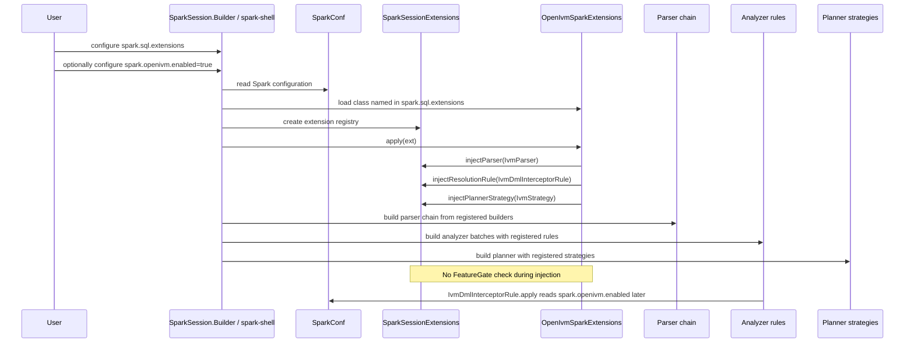
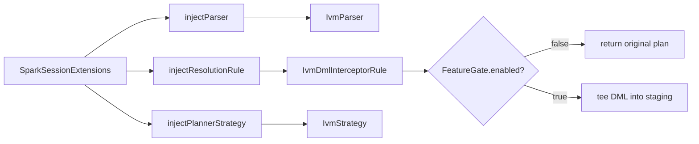

# 1. SessionExtension wiring and FeatureGate

This note documents the Spark-session entry point for openivm-spark.

It focuses on one small class, `OpenIvmSparkExtensions`, and one important
feature-gate discrepancy that affects how users should reason about activation.

The short version:

- Spark loads `org.openivm.spark.OpenIvmSparkExtensions` from
  `spark.sql.extensions` while constructing a `SparkSession`.
- `OpenIvmSparkExtensions.apply()` unconditionally injects three extension
  hooks: a parser, a resolution rule, and a planner strategy.
- `FeatureGate.EnabledKey` is `spark.openivm.enabled` and defaults to `false`.
- Only the DML interception rule checks that gate at execution-analysis time.
- The parser and planner strategy are still wired when the gate is `false`.

## Source files cited

Primary files:

- `spark-ext/ivm-extension/src/main/scala/org/openivm/spark/OpenIvmSparkExtensions.scala`
- `spark-ext/ivm-common/src/main/scala/org/openivm/spark/common/FeatureGate.scala`
- `spark-ext/ivm-extension/src/main/scala/org/openivm/spark/parser/IvmParser.scala`
- `spark-ext/ivm-extension/src/main/scala/org/openivm/spark/parser/IvmAstBuilder.scala`
- `spark-ext/ivm-extension/src/main/scala/org/openivm/spark/analyzer/IvmDmlInterceptorRule.scala`
- `spark-ext/ivm-extension/src/main/scala/org/openivm/spark/analyzer/IvmStrategy.scala`
- `spark-ext/README.md`

## The discrepancy to keep in mind

The entry-class Scaladoc says the extension is a no-op when the feature gate is
off.

That is misleading.

The feature gate defaults to off, but `apply()` does not branch on it.

The parser is injected.

The resolution rule is injected.

The planner strategy is injected.

The only component in that list with an explicit execution-time gate check is
`IvmDmlInterceptorRule`.

The practical result is that the extension is not syntactically invisible when
`enabled=false`.

OpenIVM materialized-view DDL is still parsed by `IvmParser`.

The DML tee is not active, so base-table mutations are not captured into staging
Delta paths.

That difference matters for user workflows and debugging.

## `OpenIvmSparkExtensions.scala` full text

The complete file is tiny and is reproduced verbatim below.

Source: `spark-ext/ivm-extension/src/main/scala/org/openivm/spark/OpenIvmSparkExtensions.scala:1-32`.

```scala
package org.openivm.spark

import org.apache.spark.sql.SparkSessionExtensions

/**
 * Entry point wired into Spark via `spark.sql.extensions`.
 *
 * Activation:
 * {{{
 *   spark-shell --conf spark.sql.extensions=org.openivm.spark.OpenIvmSparkExtensions \
 *               --conf spark.openivm.enabled=true \
 *               --jars openivm-spark-0.1.0-SNAPSHOT-assembly.jar
 * }}}
 *
 * This is a deliberately small surface: the heavy lifting (parser, analyzer
 * rules, commands, compiler bridge, refresh assemblers) lives in the
 * `ivm-extension`, `ivm-compiler`, and `ivm-common` modules. The bootstrap
 * registers each via the appropriate `inject*` API after consulting the
 * master feature gate ([[org.openivm.spark.common.FeatureGate.EnabledKey]]
 * = `spark.openivm.enabled`).
 *
 * If the feature gate is off (the default), this class is a no-op — Spark
 * boots up exactly as it would without our jar.
 */
class OpenIvmSparkExtensions extends (SparkSessionExtensions => Unit) {

  override def apply(ext: SparkSessionExtensions): Unit = {
    ext.injectParser((session, parent) => new parser.IvmParser(session, parent))
    ext.injectResolutionRule(session => new analyzer.IvmDmlInterceptorRule(session))
    ext.injectPlannerStrategy(session => new analyzer.IvmStrategy(session))
  }
}
```

## What `apply()` wires

The class implements `SparkSessionExtensions => Unit`.

Spark calls `apply(ext)` with a mutable `SparkSessionExtensions` instance during
session construction.

`apply()` registers three hooks, in this order.

### 1. Parser injection

Code:

```scala
ext.injectParser((session, parent) => new parser.IvmParser(session, parent))
```

Citation: `OpenIvmSparkExtensions.scala:28`.

This wraps Spark's existing parser with `IvmParser`.

The `parent` parser is Spark's current parser chain.

The OpenIVM parser only handles OpenIVM materialized-view DDL.

Everything else is delegated back to the parent parser.

`IvmParser.parsePlan` is the custom branch:

```scala
override def parsePlan(sqlText: String): LogicalPlan =
  if (isIvmStatement(sqlText)) parseIvmStatement(sqlText)
  else delegate.parsePlan(sqlText)
```

Citation: `IvmParser.scala:42-44`.

The matching logic recognizes statements whose first meaningful tokens are:

- `CREATE MATERIALIZED VIEW`
- `REFRESH MATERIALIZED VIEW`
- `DROP MATERIALIZED VIEW`

The keyword regex is case-insensitive:

```scala
val IvmKeyword: Pattern = Pattern.compile(
  "\\A(?:create|refresh|drop)\\s+materialized\\s+view\\b",
  Pattern.CASE_INSENSITIVE
)
```

Citation: `IvmParser.scala:143-146`.

There is no `FeatureGate.enabled(...)` call in `IvmParser`.

So the parser is active whenever the extension class was loaded through
`spark.sql.extensions`.

### 2. Resolution-rule injection

Code:

```scala
ext.injectResolutionRule(session => new analyzer.IvmDmlInterceptorRule(session))
```

Citation: `OpenIvmSparkExtensions.scala:29`.

This adds a Catalyst analyzer rule.

The rule looks for DML plans against base tables that have dependent materialized
views.

When active, it wraps or replaces those DML plans with staging-aware nodes.

The important distinction is that this component does check the feature gate.

The first line of `apply(plan)` returns the original plan if the gate is off:

```scala
override def apply(plan: LogicalPlan): LogicalPlan = {
  if (!FeatureGate.enabled(session) || IvmDmlInterceptorRule.bypass.get()) return plan
  if (alreadyWrapped(plan)) return plan
```

Citation: `IvmDmlInterceptorRule.scala:40-42`.

So the rule is wired unconditionally, but it becomes a pass-through rule when
`spark.openivm.enabled=false`.

### 3. Planner-strategy injection

Code:

```scala
ext.injectPlannerStrategy(session => new analyzer.IvmStrategy(session))
```

Citation: `OpenIvmSparkExtensions.scala:30`.

This adds a physical-planning strategy.

The strategy maps `WithDeltaStaging` logical nodes to `DeltaStagingExec` physical
operators:

```scala
override def apply(plan: LogicalPlan): Seq[SparkPlan] = plan match {
  case WithDeltaStaging(child, stagingPath, opType, baseTable) =>
    DeltaStagingExec(planLater(child), stagingPath, opType, baseTable) :: Nil
  case _ => Nil
}
```

Citation: `IvmStrategy.scala:17-21`.

`IvmStrategy` does not call `FeatureGate.enabled(...)`.

That is normally harmless because the gated DML interceptor is the component
that creates the staging-related logical shapes in the first place.

When the gate is off, the interceptor returns the original plan before wrapping
anything.

Citation: `IvmDmlInterceptorRule.scala:40-42`.

## The misleading docstring

The Scaladoc says:

```scala
* If the feature gate is off (the default), this class is a no-op — Spark
* boots up exactly as it would without our jar.
```

Citation: `OpenIvmSparkExtensions.scala:22-23`.

That statement conflicts with the implementation.

The implementation has no `if (FeatureGate.enabled(...))` around any injection.

The three injection calls happen directly inside `apply()`.

Citation: `OpenIvmSparkExtensions.scala:27-30`.

Therefore, the accurate statement is:

- The extension hooks are installed whenever Spark loads the extension class.
- The DML interception behavior is disabled by the feature gate.
- The parser is not disabled by the feature gate.
- The planner strategy is not disabled by the feature gate.

This is the discrepancy users and maintainers must account for.

## `FeatureGate.scala` full content

The complete file is reproduced verbatim below.

Source: `spark-ext/ivm-common/src/main/scala/org/openivm/spark/common/FeatureGate.scala:1-26`.

```scala
package org.openivm.spark.common

import org.apache.spark.SparkConf
import org.apache.spark.sql.SparkSession

/**
 * Master feature gate for the openivm-spark extension.
 *
 * All extension behaviour (the new `CREATE / REFRESH / DROP MATERIALIZED VIEW`
 * statements, DML interception, MV catalog, refresh assemblers) is conditional
 * on this flag. Default: `false` — the jar is opt-in even when installed.
 *
 * Activated by setting `spark.openivm.enabled=true` in the SparkConf before
 * the session is created, or via `--conf spark.openivm.enabled=true` on
 * spark-shell / spark-submit.
 */
object FeatureGate {

  val EnabledKey: String = "spark.openivm.enabled"

  def enabled(conf: SparkConf): Boolean =
    conf.getBoolean(EnabledKey, defaultValue = false)

  def enabled(spark: SparkSession): Boolean =
    enabled(spark.sparkContext.getConf)
}
```

Key facts:

- `EnabledKey` is exactly `spark.openivm.enabled`.
- The default is `false`.
- The SparkSession overload reads the SparkContext `SparkConf`.

Citations:

- `FeatureGate.scala:19`
- `FeatureGate.scala:21-25`

## Per-component gate check table

| Component | Wired in `apply()` | Execution-time gate check | Citation |
|---|---|---|---|
| `IvmParser` | unconditional | NO (always intercepts matching DDL) | Wired at `OpenIvmSparkExtensions.scala:28`; branch at `IvmParser.scala:42-44`; keyword match at `IvmParser.scala:143-146`. |
| `IvmDmlInterceptorRule` | unconditional | YES at `:40-42` | Wired at `OpenIvmSparkExtensions.scala:29`; early return at `IvmDmlInterceptorRule.scala:40-42`. |
| `IvmStrategy` | unconditional | NO (harmless — no `WithDeltaStaging` when gate off) | Wired at `OpenIvmSparkExtensions.scala:30`; strategy match at `IvmStrategy.scala:17-21`; DML rule returns before wrapping at `IvmDmlInterceptorRule.scala:40-42`. |

## Parser behavior when the gate is false

`IvmParser` only overrides `parsePlan` for routing.

If the statement starts with OpenIVM MV DDL, it calls `parseIvmStatement`.

If not, it delegates to Spark's parser.

Citation: `IvmParser.scala:42-44`.

The parser first strips leading whitespace and SQL comments.

Citation: `IvmParser.scala:84-88`.

Then it checks the case-insensitive OpenIVM keyword pattern.

Citation: `IvmParser.scala:143-146`.

For a matching statement, `parseIvmStatement` builds an ANTLR parser and then
calls `IvmAstBuilder.buildPlan(...)`.

Citation: `IvmParser.scala:91-123`.

`IvmAstBuilder` creates typed command logical plans:

- `CreateMaterializedViewCommand`
- `RefreshMaterializedViewCommand`
- `DropMaterializedViewCommand`

Citations:

- `IvmAstBuilder.scala:30-42`
- `IvmAstBuilder.scala:45-55`

No part of that parser route checks `FeatureGate.enabled(...)`.

That is why MV DDL can parse even when the gate is false.

## DML interception behavior when the gate is false

`IvmDmlInterceptorRule` is a Catalyst `Rule[LogicalPlan]`.

It is registered in Spark's resolution-rule extension point.

Citation: `OpenIvmSparkExtensions.scala:29`.

The rule's first executable line is the critical gate:

```scala
override def apply(plan: LogicalPlan): LogicalPlan = {
  if (!FeatureGate.enabled(session) || IvmDmlInterceptorRule.bypass.get()) return plan
  if (alreadyWrapped(plan)) return plan
```

Citation: `IvmDmlInterceptorRule.scala:40-42`.

Read left to right:

1. `FeatureGate.enabled(session)` reads `spark.openivm.enabled` from the
   session's SparkConf.
2. If that value is false, `!FeatureGate.enabled(session)` is true.
3. The method returns the original `plan` immediately.
4. None of the DML pattern matches below are evaluated.
5. No staging paths are generated.
6. No `StagedDmlNode` or staging wrapper is inserted by this rule.

The same early return also applies when the thread-local bypass flag is set.

That bypass is for re-executing original DML from inside staging execution.

Citation: `IvmDmlInterceptorRule.scala:294-299`.

After the gate, the rule also avoids double wrapping:

```scala
if (alreadyWrapped(plan)) return plan
```

Citation: `IvmDmlInterceptorRule.scala:42`.

Only after those two checks does the rule match DML shapes.

Examples include:

- `AppendData`
- `OverwriteByExpression`
- Delta-native delete/update/merge logical nodes
- Delta-lowered `ReplaceData`
- Delta-lowered `WriteDelta`
- Spark-standard fallback DML nodes

Citations:

- `IvmDmlInterceptorRule.scala:49-68`
- `IvmDmlInterceptorRule.scala:73-141`
- `IvmDmlInterceptorRule.scala:147-171`
- `IvmDmlInterceptorRule.scala:176-221`

Each active branch first extracts the target table name.

Then it asks whether that table has dependent materialized views.

The helper calls `MvCatalog.viewsForSource(session, tableName).nonEmpty`.

Citation: `IvmDmlInterceptorRule.scala:246-254`.

When there are dependent MVs, the rule creates staging operation metadata.

For inserts, for example, it creates an `INSERT` staging path and returns a
`StagedDmlNode`.

Citation: `IvmDmlInterceptorRule.scala:49-56`.

When the gate is false, none of those branches run.

That is the main behavioral gate in the session extension wiring.

## Planner strategy behavior when the gate is false

`IvmStrategy` is also registered unconditionally.

Citation: `OpenIvmSparkExtensions.scala:30`.

It is a small pattern match over logical plans.

It returns a physical operator only for `WithDeltaStaging`.

Citation: `IvmStrategy.scala:17-21`.

It has no feature-gate check.

This is usually safe because `WithDeltaStaging` is part of the staging path.

The staging path depends on the DML interceptor getting past its early return.

When `spark.openivm.enabled=false`, the DML interceptor returns the original plan
at `IvmDmlInterceptorRule.scala:40-42`.

So there is no normal OpenIVM-produced staging node for `IvmStrategy` to plan.

## Activation example

The README documents activation for `spark-shell` and `spark-submit`.

Source: `spark-ext/README.md:93-104`.

```bash
spark-shell \
    --jars target/scala-2.12/ivm-extension-0.1.0-SNAPSHOT-assembly.jar \
    --conf spark.sql.extensions=org.openivm.spark.OpenIvmSparkExtensions \
    --conf spark.openivm.enabled=true \
    --conf spark.driver.extraJavaOptions="$(cat .sbtopts | grep -oE '^-J.*' | sed 's/^-J//' | xargs)"
```

The two relevant flags are:

```bash
--conf spark.sql.extensions=org.openivm.spark.OpenIvmSparkExtensions
--conf spark.openivm.enabled=true
```

The first flag loads and applies the extension class.

The second flag allows the DML interception rule to do work.

The README also states that `spark.openivm.enabled` defaults to false.

Citation: `spark-ext/README.md:103-104`.

## Practical implication for users

Users should treat the two activation knobs as related but not identical.

`--conf spark.sql.extensions=org.openivm.spark.OpenIvmSparkExtensions` means:

- Spark will instantiate the extension class.
- Spark will call `apply()`.
- The OpenIVM parser will be in the parser chain.
- The OpenIVM resolution rule will be in the analyzer rule chain.
- The OpenIVM planner strategy will be in the strategy chain.

`--conf spark.openivm.enabled=true` means:

- The DML interceptor will not return immediately at its first line.
- Base-table DML can be teed into staging.
- Incremental refreshes can observe pending staged deltas.

If `spark.sql.extensions` is set but `spark.openivm.enabled=false`, then:

- `CREATE MATERIALIZED VIEW ... AS SELECT ...` can be parsed by `IvmParser`.
- `REFRESH MATERIALIZED VIEW ...` can also be parsed by `IvmParser`.
- `DROP MATERIALIZED VIEW ...` can also be parsed by `IvmParser`.
- Base-table DML is not captured by `IvmDmlInterceptorRule`.
- Incremental refresh logic may find no pending deltas after source-table
  mutations.

In practical terms, a user can create an MV without getting a parse-time error
from Spark for the `CREATE MATERIALIZED VIEW` syntax.

But if they then mutate a base table while the gate remains false, the DML tee
never fires.

A later incremental refresh can therefore see no staged deltas.

That can make the materialized view look stale rather than obviously disabled.

This is especially important in notebooks and shells where users often set
`spark.sql.extensions` in a shared profile but forget the separate
`spark.openivm.enabled=true` setting.

The safe user-facing guidance is:

- Always set both flags for real OpenIVM MV maintenance.
- Use `spark.openivm.enabled=true` before the `SparkSession` is created.
- Do not rely on the docstring claim that the extension is a complete no-op
  when the gate is false.

## SparkSession construction sequence

The high-level construction sequence is:

1. User starts `spark-shell`, `spark-submit`, or builds a `SparkSession`.
2. Spark reads configuration, including `spark.sql.extensions`.
3. Spark loads each configured extension class.
4. For `org.openivm.spark.OpenIvmSparkExtensions`, Spark creates the function
   object.
5. Spark calls `apply(ext)` with the session's `SparkSessionExtensions` holder.
6. `apply()` registers the parser builder.
7. `apply()` registers the resolution-rule builder.
8. `apply()` registers the planner-strategy builder.
9. Spark finishes building `SessionState` using those extension hooks.
10. Later SQL parsing, analysis, and planning use the augmented chains.

The feature-gate value is not consulted in steps 5-8 by
`OpenIvmSparkExtensions.apply()`.

The feature-gate value is consulted later by `IvmDmlInterceptorRule.apply(plan)`.



## Short extension-chain diagram



## Maintenance note

If the intended behavior is truly "Spark boots up exactly as it would without
our jar" when the gate is false, then `OpenIvmSparkExtensions.apply()` would need
to avoid injecting at least the parser when the gate is false.

That is not what the current implementation does.

Alternatively, the docstring should be changed to say that the gate disables DML
interception and most runtime maintenance behavior, not extension wiring.

Until the code or docstring is changed, architecture docs should be explicit
about this difference.
