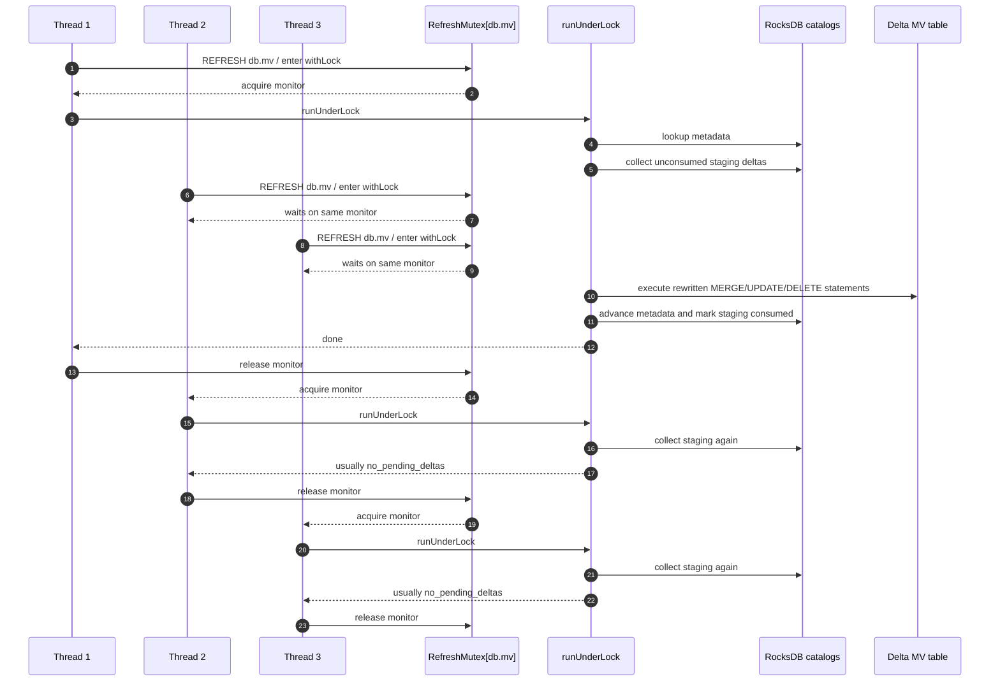
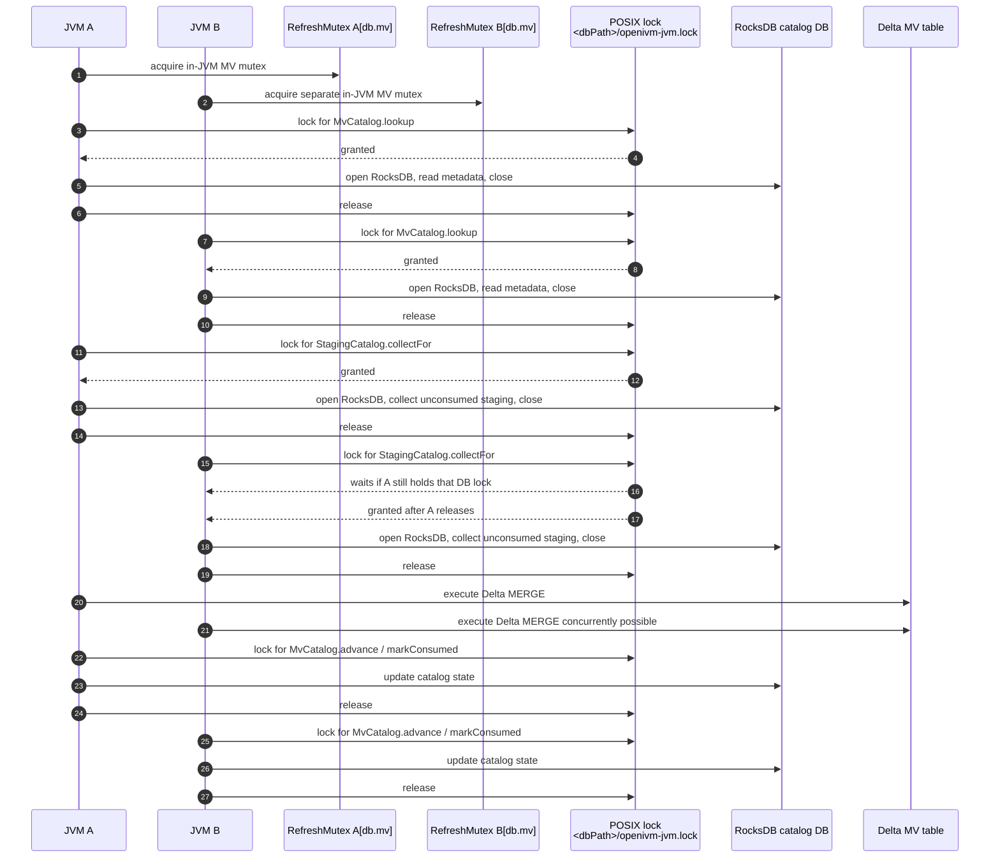

# 10. Concurrency model: mutex, retry, and multi-process catalog locking

This chapter documents the concurrency boundary around `REFRESH MATERIALIZED VIEW`.
It covers three mechanisms that are easy to confuse:

1. the in-JVM `RefreshMutex`,
1. the Delta-conflict `RetryPolicy`, and
1. the optional RocksDB multi-process file lock.
   They protect different resources.
   They do **not** compose into a fully crash-safe distributed transaction.
   For the refresh call-site context, read this with [chapter 8: lifecycle](08-lifecycle.md).

______________________________________________________________________

## 10.1 Threat model

A Spark driver can issue multiple `REFRESH MATERIALIZED VIEW` commands concurrently.
The concurrency can come from explicit user threads.
It can also come from orchestration tools that submit SQL concurrently through one driver.
Within one JVM, the dangerous case is two refresh threads targeting the same MV.
Both can observe the same unconsumed staging rows.
Both can compile or reuse the same refresh program.
Both can execute a Delta `MERGE` against the MV table.
Both can then mark the same staging rows consumed.
That looks harmless for some refresh types.
It is not harmless for count-monoid paths.
The count-monoid paths include:

- `AGGREGATE_GROUP`,
- `AGGREGATE_HAVING`, and
- `DISTINCT_INCREMENTAL`.
  Those paths maintain counts or count-like hidden state.
  A staging-derived delta must be applied exactly once per MV.
  If the same delta is applied twice, counts double.
  For example, one inserted source row can become `+2` in the MV state.
  For a later delete, the corresponding `-1` will not restore the correct value.
  Delta Lake has optimistic concurrency control (OCC).
  OCC retries, or asks the caller to retry, the failing statement.
  It does not know the logical `REFRESH MATERIALIZED VIEW` transaction.
  It does not automatically rewind the openivm-spark staging snapshot.
  It does not know which staging rows were meant to be consumed by this refresh.
  Therefore a naive whole-refresh retry is unsafe.
  If the first attempt partially applied the MV update, a second whole-refresh attempt may re-apply the same staging-derived delta.
  That is the core correctness threat.
  A second threat is multi-JVM access to the same warehouse.
  A common example is `dbt-spark-livy` with `threads=8`.
  Depending on deployment, those threads may talk to multiple Livy sessions.
  Each Livy session can have its own Spark driver JVM.
  Those JVMs can share the same Spark warehouse path.
  The in-JVM mutex cannot coordinate those processes.
  RocksDB also rejects concurrent native opens of the same database directory.
  The optional multi-process mode solves the native-handle problem for catalog operations.
  It does not solve MV data-table `MERGE` serialization.
  Keep these two planes separate:
- the **catalog plane**: RocksDB metadata and staging records,
- the **data plane**: Delta MV tables and staging Delta tables.
  `RefreshMutex` serializes the refresh body in one JVM.
  `RetryPolicy` retries individual Delta SQL statements on recognized transient conflicts.
  `multiProcess=true` serializes each RocksDB catalog operation across JVMs.
  None of them is a distributed transaction manager.

______________________________________________________________________

## 10.2 Source landmarks

The relevant implementation files are:

- `spark-ext/ivm-extension/src/main/scala/org/openivm/spark/commands/MaterializedViewCommands.scala`
- `spark-ext/ivm-common/src/main/scala/org/openivm/spark/common/RetryPolicy.scala`
- `spark-ext/ivm-common/src/main/scala/org/openivm/spark/common/SparkExceptions.scala`
- `spark-ext/ivm-common/src/main/scala/org/openivm/spark/common/rocksdb/OpenIvmRocksDB.scala`
- `spark-ext/ivm-common/src/main/scala/org/openivm/spark/common/rocksdb/OpenIvmRocksDBConf.scala`
- `spark-ext/ivm-common/src/main/scala/org/openivm/spark/common/MvCatalog.scala`
- `spark-ext/ivm-common/src/main/scala/org/openivm/spark/common/StagingCatalog.scala`
  The high-level refresh flow is in `RefreshMaterializedViewCommand.run`.
  The body under the per-MV mutex is in `runUnderLock`.
  The post-execution metadata and staging cleanup is in `postRefreshCleanup`.

______________________________________________________________________

## 10.3 `RefreshMutex`

`RefreshMutex` lives in `MaterializedViewCommands.scala` near the top of the file.
The exact current implementation is:

```scala
private[commands] object RefreshMutex {

  private val locks: java.util.Map[String, AnyRef] =
    Collections.synchronizedMap(new java.util.HashMap[String, AnyRef]())

  /** Acquire (creating if absent) and synchronize on the lock object that
    * keys this MV. The lock identity is the fully-qualified MV name so two
    * refreshes targeting the SAME logical MV serialise, even if they
    * originate from different Spark sessions in the same JVM.
    */
  def withLock[A](mvKey: String)(body: => A): A = {
    val existing = locks.get(mvKey)
    val lock =
      if (existing != null) existing
      else
        locks.synchronized {
          val again = locks.get(mvKey)
          if (again != null) again
          else {
            val l = new Object
            locks.put(mvKey, l)
            l
          }
        }
    lock.synchronized(body)
  }
}
```

The map is JVM-wide.
The key is the fully-qualified MV name produced by `MvCommandHelper.metaName(name)`.
That key has the shape `<db>.<mv>` when the MV has a database.
For a database-less identifier, it is just the table name.
The implementation currently uses `Collections.synchronizedMap(new java.util.HashMap...)`.
It is a concurrent lock registry, but it is not literally `java.util.concurrent.ConcurrentHashMap`.
The lock value is a plain `Object`.
The refresh body is executed under `lock.synchronized`.
The call site is:

```scala
RefreshMutex.withLock(metaName(name)) {
  runUnderLock(spark)
}
```

That wraps the full refresh operation.
The protected region includes:

1. `MvCatalog.lookup`,
1. `StagingCatalog.hasPendingDeltas`,
1. `StagingCatalog.collectFor`,
1. schema fingerprint validation,
1. compile-cache lookup or compile-cache back-fill,
1. temp delta view registration,
1. refresh SQL rewrite,
1. Delta SQL execution,
1. count-monoid zero-row cleanup,
1. cascade view-delta recording, and
1. `postRefreshCleanup`.
   The important property is atomicity from the MV's point of view.
   No second same-MV refresh in the same JVM can collect the same unconsumed staging snapshot while the first one is still applying it.
   No second same-MV refresh in the same JVM can run `collectFor` between the first one's `execute` and `markConsumed`.
   Different MVs get different lock keys.
   Different MVs can refresh concurrently in the same JVM.
   The mutex is per MV, not global.
   The mutex is JVM-wide, not SparkSession-wide.
   Two Spark sessions in the same driver JVM share the same singleton object.
   Two driver JVMs do not share it.

______________________________________________________________________

## 10.4 Single-JVM sequence: three concurrent refreshes

The following diagram shows three threads refreshing the same MV in one JVM.
It shows arrival order for clarity.
Java monitors do not provide a formal fairness guarantee, so do not build correctness on fairness.
Correctness only requires one-at-a-time execution of the protected refresh body.



The first refresh sees and consumes the pending deltas.
The second and third refreshes run only after the first releases the monitor.
By then, the first refresh has attempted cleanup.
In the normal success path, the same staging paths are recorded as consumed.
The later refreshes short-circuit as `no_pending_deltas`.
This is the intended first-come, first-served operational behavior within one JVM.
Again, the monitor gives mutual exclusion, not a strict scheduling contract.

______________________________________________________________________

## 10.5 Why the mutex is enough for `AGGREGATE_GROUP` within one JVM

`AGGREGATE_GROUP` refreshes are count-monoid refreshes.
They are sensitive to duplicate application.
The refresh code first collects staging rows:

```scala
val stagingDeltas = StagingCatalog.collectFor(
  spark,
  viewNameStr,
  meta.sourceTables,
  sourceWatermarks
)
```

It then builds per-source temp views from that fixed `stagingDeltas` value.
It rewrites the openivm refresh program against those temp views.
It executes the rewritten Delta statements.
It finally advances metadata and marks the staging paths consumed.
Within one JVM, `RefreshMutex` makes that sequence indivisible relative to another same-MV refresh.
The sequence is:

```text
collect staging
  -> build temp delta views
  -> rewrite SQL
  -> execute SQL
  -> cleanup count-monoid zero rows
  -> record cascade view-delta if needed
  -> MvCatalog.advance
  -> StagingCatalog.markConsumed
  -> prune fully consumed staging
```

The Delta `MERGE` statement itself may be retried by `RetryPolicy`.
That retry re-executes the same SQL statement.
It does not re-run `collectFor`.
It does not discover new staging deltas.
It does not widen the refresh snapshot.
That is exactly what we want for a statement-level Delta OCC conflict.
If an outside writer changed the MV table concurrently, retrying the statement can re-read the latest Delta table snapshot.
But the source delta input remains the same fixed temp view for this refresh.
Because no other same-JVM same-MV refresh can slip in and consume or re-apply those staging rows, the count-monoid delta is applied once in the normal success path.
That is the core correctness reason for `RefreshMutex`.

______________________________________________________________________

## 10.6 `RetryPolicy`: actual defaults and behavior

`RetryPolicy` is defined in `ivm-common`.
The current defaults are verified from source:

```scala
val DefaultMaxAttempts: Int = 5
val DefaultBackoffMs: Long = 1000
```

The sleep calculation is linear:

```scala
val sleep = backoffMs * attempt
```

Therefore the default retry sleeps are:

- after attempt 1: `1000ms`,
- after attempt 2: `2000ms`,
- after attempt 3: `3000ms`, and
- after attempt 4: `4000ms`.
  There are five total attempts including the first.
  There are four sleeps.
  This is not a `3` attempt policy.
  This is not exponential `100ms / 400ms / 1600ms` backoff in the current source.
  If older design notes mention those numbers, they are stale for this checkout.
  The policy is implemented as a by-name operation wrapper:

```scala
def execute[T](operation: => T): T = executeInternal(operation, attempt = 1)
```

Every retry re-evaluates the operation block.
A retry happens only when both conditions hold:

1. the current attempt is less than `maxAttempts`, and
1. some exception in the cause chain matches a configured regex.
   The regexes are matched against both:

- the exception class name, and
- the exception message.
  The predefined Delta policy is:

```scala
val DeltaConflicts: RetryPolicy =
  RetryPolicy(SparkExceptions.DefaultDeltaRetryPatterns.map(_.r))
```

`SparkExceptions.DefaultDeltaRetryPatterns` currently includes:

- `DELTA_METADATA_CHANGED`,
- `DELTA_PROTOCOL_CHANGED`,
- `DELTA_CONCURRENT_APPEND`,
- `DELTA_CONCURRENT_DELETE_READ`,
- `DELTA_CONCURRENT_DELETE_DELETE`,
- `DELTA_CONCURRENT_TRANSACTION`,
- `AlreadyExistsException`,
- `DELTA_CREATE_TABLE_WITH_NON_EMPTY_LOCATION`, and
- `SparkFileNotFoundException`.
  This catches the common Delta OCC conflict family.
  It also catches some Spark/Hive race signatures seen in tests.
  It is pattern-based, not type-based.
  A Delta `ConcurrentAppendException` is retried because the message normally contains `DELTA_CONCURRENT_APPEND`.
  A Delta concurrent modification class is retried if its class name or message matches one of the configured patterns.
  An `IllegalStateException` is retried only if its class name or message matches one of those patterns.
  A generic `IllegalStateException` with an unrelated message is not retried.

______________________________________________________________________

## 10.7 What `RetryPolicy` wraps during refresh

The refresh code uses `RetryPolicy.DeltaConflicts.execute` around individual SQL statement executions.
For full refresh:

```scala
assembled.statements.foreach { sql =>
  RetryPolicy.DeltaConflicts.execute { spark.sql(sql).collect() }
}
```

For incremental refresh, the helper is:

```scala
def executeSql(sql: String): Unit =
  RetryPolicy.DeltaConflicts.execute { spark.sql(sql).collect() }
```

The rewritten program's individual statements are then passed to `executeSql`.
The count-monoid zero-row cleanup `DELETE` is also wrapped:

```scala
RetryPolicy.DeltaConflicts.execute { spark.sql(deleteSql).collect() }
```

The retry wrapper is therefore statement-scoped.
It does not wrap all of `runUnderLock`.
It does not wrap `collectFor` plus `execute` plus `markConsumed` as one unit.
That is intentional.
Retrying the whole refresh would be dangerous for count-monoid paths.
A partially successful first attempt could already have changed the MV table.
A second whole-refresh attempt could re-collect the same unconsumed staging rows and apply them again.
The mutex removes the need for whole-refresh retry inside one JVM.
The statement retry handles a narrower case.
That case is Delta observing a transient data-table conflict while committing one statement.
One example is an operator manually updating the MV table while openivm-spark is refreshing it.
That should be extremely rare.
It is still better to retry the one conflicted Delta statement than to fail immediately.
The statement retry should not be interpreted as a general idempotency guarantee.
It is a pragmatic Delta OCC conflict handler.

______________________________________________________________________

## 10.8 Multi-process RocksDB lock

The RocksDB-backed catalogs are local filesystem databases under the Spark warehouse.
They include:

- the global index DB,
- one DB per tracked base table, and
- one DB per tracked MV.
  RocksDB itself uses a native lock file inside the DB directory.
  Concurrent opens of the same RocksDB directory from multiple processes fail.
  The optional openivm-spark multi-process mode coordinates those opens.
  Enable it with:

```text
spark.openivm.rocksdb.multiProcess=true
```

The config key is defined in `OpenIvmRocksDBConf.scala` as `MultiProcessKey`.
The default is `false`.
When `multiProcess=false`, each Spark driver JVM keeps RocksDB handles open through the registry.
That is fast and appropriate for single-JVM deployments.
When `multiProcess=true`, every catalog operation follows this pattern:

```text
acquire POSIX FileChannel lock on <dbPath>/openivm-jvm.lock
  -> open native RocksDB handle
  -> run the catalog operation
  -> flush and close RocksDB handle
  -> release POSIX lock
```

The external lock helper is `withExternalLock` in `OpenIvmRocksDB.scala`.
The native-handle wrapper is `withNativeHandle` in the same file.
`withExternalLock` creates or opens `<dbPath>/openivm-jvm.lock`.
It repeatedly calls `FileChannel.tryLock()` until it gets the lock or times out.
It sleeps `50ms` between failed attempts.
The default timeout is `60s`.
The timeout key is `spark.openivm.rocksdb.lockTimeout`.
The lock is reentrant for callbacks on the same thread.
The code tracks `externalLockOwner` and `externalLockDepth`.
That avoids `OverlappingFileLockException` when a catalog callback re-enters another catalog method on the same DB.
`withNativeHandle` always holds the in-JVM `writeMutex` first.
Then, in multi-process mode, it enters `withExternalLock`.
If the native handle is not open, it opens RocksDB.
It runs the operation.
It closes RocksDB in `finally`.
Closing the native handle releases RocksDB's own `<dbPath>/LOCK`.
Then `withExternalLock` releases `openivm-jvm.lock`.
This is required when multiple JVMs share one warehouse.
The `dbt-spark-livy` `threads=8` deployment is the common motivating example.
Without this mode, two Livy session drivers can try to open the same catalog RocksDB directory.
One of them may fail with a native RocksDB resource-unavailable error.
With this mode, those catalog operations queue on the POSIX file lock instead.

______________________________________________________________________

## 10.9 Throughput cost of multi-process mode

Multi-process mode is intentionally conservative.
It trades throughput for process safety around RocksDB native handles.
Every catalog operation now does at least these extra operations:

1. open or create the lock file,
1. acquire and release a POSIX file lock,
1. open RocksDB cold, and
1. flush and close RocksDB.
   The shorthand cost model is:

```text
catalog op ~= 3+ filesystem syscalls + cold RocksDB open/close + actual work
```

The cold open is usually the dominant cost.
Small catalog reads that were effectively memory-resident in single-process mode can become order-of-magnitude slower.
This matters because one refresh performs multiple catalog operations.
A refresh may look up MV metadata.
It may scan staging records.
It may read per-MV consumed keys.
It may update MV metadata.
It may mark consumed staging.
It may list all MVs for cascade and pruning.
In multi-process mode, each of those can acquire and release RocksDB locks separately.
Do not enable this mode for speed.
Enable it only when you must allow multiple JVMs to share one warehouse catalog.

______________________________________________________________________

## 10.10 Multi-JVM sequence with `multiProcess=true`

This diagram shows two JVMs refreshing the same MV with RocksDB multi-process mode enabled.
The file lock serializes each catalog operation.
It does not hold one lock across the entire refresh.
It does not cover the Delta `MERGE` data-plane operation.



The key point is that both JVMs can pass their own in-JVM mutexes.
The POSIX lock prevents simultaneous RocksDB native access.
It does not prevent both JVMs from collecting the same logical staging set in separate catalog critical sections.
It does not prevent concurrent Delta MERGE statements against the same MV table.
Delta OCC may make one statement retry or fail.
That is not the same as exactly-once refresh semantics.

______________________________________________________________________

## 10.11 DO NOT rely on multi-process mode for MERGE correctness

> **DO NOT DO THIS:** Do not assume `spark.openivm.rocksdb.multiProcess=true` makes concurrent multi-JVM refresh of the same MV correct.
> The file lock is a catalog native-handle lock.
> It is not a distributed MV refresh mutex.
> It is not a Delta table lock.
> It is not held across the whole `REFRESH MATERIALIZED VIEW` command.
> It cannot make two JVMs agree that only one of them owns a staging snapshot.
> It cannot make the Delta data-table update and RocksDB consumed mark atomic.
> Recommended deployments are:

1. use a single Spark driver per warehouse, or
1. coordinate `REFRESH MATERIALIZED VIEW` calls externally so only one process refreshes a given MV at a time.
   External coordination can be an orchestrator lock.
   It can be a database advisory lock.
   It can be a scheduler rule that routes all refreshes for one warehouse to one driver.
   The important requirement is end-to-end same-MV serialization across JVMs.
   `multiProcess=true` should be viewed as a compatibility switch for shared catalog access.
   It is not a correctness switch for concurrent refreshes.

______________________________________________________________________

## 10.12 Failure-window analysis

The success path is not one atomic transaction.
It spans Delta commits and RocksDB writes.
A process crash can leave those systems out of sync.
The most important source ordering is in `postRefreshCleanup`:

```scala
val newVersion = DeltaTableVersion.requireLatest(spark, meta.location)
MvCatalog.advance(spark, name, newVersion)

val consumedPaths = stagingDeltas.map(_.stagingPath)
StagingCatalog.markConsumed(spark, viewNameStr, consumedPaths)

val allMvs = MvCatalog.list(spark)
...
StagingCatalog.pruneFullyConsumed(spark, viewsByTable)
```

The actual current order is therefore:

1. execute refresh SQL against the MV Delta table,
1. optionally delete zero-count rows for count-monoid paths,
1. optionally record an upstream MV view-delta for cascades,
1. read the latest Delta table version,
1. write `MvCatalog.advance`,
1. write `StagingCatalog.markConsumed`,
1. list MVs, and
1. prune fully consumed staging.
   This order has known crash windows.

### Window A: crash after execute, before `MvCatalog.advance`

The MV Delta table has already changed.
The catalog metadata still has the old `lastVersion`.
The staging paths have not been marked consumed.
The next refresh will collect the same unconsumed staging paths again.
For count-monoid refresh types, this can duplicate the delta.
`AGGREGATE_GROUP` is the obvious example.
The duplicate replay can double-count.
The current source comments call this an at-least-once semantics gap.
A future mitigation would need idempotency at the refresh-program level.
Possible approaches include:

- a durable per-refresh fingerprint recorded before execute,
- idempotent MERGE keys that include the staging fingerprint,
- a transaction log table that records applied staging sets, or
- a two-phase protocol that can detect an already-applied MV Delta commit.
  Those mitigations are not implemented here.

### Window B: crash after `MvCatalog.advance`, before `markConsumed`

The MV Delta table has changed.
`lastVersion` has advanced.
The staging paths are still not marked consumed.
`StagingCatalog.collectFor` filters primarily by source watermarks and per-MV consumed keys.
It does not treat MV `lastVersion` as proof that a staging path was consumed.
Therefore the next refresh can still re-collect those paths.
For count-monoid paths, this is also a duplicate-application window.
This is arguably the sharpest current window because the metadata looks advanced but consumed-state is missing.

### Window C: crash after `markConsumed`, before prune

The MV Delta table has changed.
`lastVersion` has advanced.
The staging paths are marked consumed for this MV.
A later refresh of this MV should skip those staging paths.
The unpruned base-table staging rows may remain on disk.
That is a space leak or delayed cleanup, not a same-MV double-apply.
A later prune can remove them once all dependent MVs have consumed them.

### Window D: crash during cascade view-delta recording

Some refresh types emit a downstream-consumable `openivm_delta_<view>` Delta table.
The code records `MV_VIEW_DELTA` staging rows before `postRefreshCleanup`.
If the process crashes after the data table update but before recording the cascade row, downstream MVs may not see a trigger for that upstream change.
The source comment notes that the view-delta file may become an orphan.
The orphan sweep is expected to clean the file eventually.
That cleanup does not recover the missing downstream trigger.
If the process crashes after recording the cascade row but before marking input staging consumed, a retry can replay the upstream input and may record another cascade row.
Downstream correctness then depends on its own refresh semantics.

### Window E: requested `markConsumed` then `putMeta(watermark)` scenario

Some older designs describe the order as `markConsumed` followed by `putMeta(watermark)`.
That is not the current refresh ordering in this source.
Current `postRefreshCleanup` calls `MvCatalog.advance` before `StagingCatalog.markConsumed`.
The per-source `_ivm_watermark:<src>` properties are create-time low-water marks.
They are not advanced after every refresh in the shown code path.
So the exact window "markConsumed succeeds but putMeta(watermark) fails" is not present as written.
The closest current inverse window is Window B: metadata advance succeeds but consumed marking fails.
The correctness consequence is still a possible replay of already-applied staging rows.

______________________________________________________________________

## 10.13 Why Delta OCC cannot close the crash window

Delta OCC protects the Delta table commit protocol.
It can detect concurrent file-level conflicts.
It can reject a commit that read an obsolete snapshot.
It can retry the failing SQL statement when openivm-spark asks it to.
It cannot atomically update RocksDB consumed markers.
It cannot know that a set of staging paths has already been applied logically.
It cannot infer openivm-spark count-monoid idempotency from Delta files.
After a crash, Delta can only tell us that the MV table has some latest version.
It cannot say whether that version corresponds to staging set `S`.
It cannot say whether all statements in a multi-statement refresh program completed.
It cannot say whether `markConsumed(S)` completed.
That is why any future crash-safe design needs an explicit applied-staging fingerprint or transaction record.

______________________________________________________________________

## 10.14 Operational guidance

Use the default single-process RocksDB mode when one Spark driver owns the warehouse.
Keep `spark.openivm.rocksdb.multiProcess=false` in that deployment.
The catalog handles stay warm.
Refresh throughput is better.
Use `spark.openivm.rocksdb.multiProcess=true` only when multiple JVMs must share one warehouse directory.
When enabling it, also coordinate refreshes externally.
Do not run same-MV refreshes concurrently from multiple JVMs.
Avoid manual writes to MV data tables.
Manual `UPDATE`, `DELETE`, `MERGE`, or `INSERT` against an MV table can race with refresh.
If a manual write causes a Delta OCC conflict, `RetryPolicy` may retry a statement.
That does not make the manual write semantically compatible with openivm-spark state.
Treat MV tables as owned by openivm-spark.
If a refresh fails after applying data but before marking staging consumed, inspect before retrying count-monoid MVs.
A blind retry may duplicate counts.
The safe recovery pattern today is conservative:

1. stop concurrent refresh writers,
1. compare the MV against its full query result,
1. rebuild the MV if it diverged, and
1. resume serialized refreshes.
   Future work should make this recovery less manual.

______________________________________________________________________

## 10.15 Summary table

| Mechanism                    | Scope                           | Protects                                        | Does not protect                                     |
| ---------------------------- | ------------------------------- | ----------------------------------------------- | ---------------------------------------------------- |
| `RefreshMutex`               | One JVM, one MV key             | Same-MV refresh body serialization              | Multi-JVM refreshes, crash recovery                  |
| `RetryPolicy.DeltaConflicts` | One SQL statement execution     | Recognized transient Delta/Spark conflicts      | Whole-refresh idempotency                            |
| RocksDB `multiProcess=true`  | One RocksDB DB path across JVMs | Native RocksDB open/close and catalog op safety | Delta MERGE correctness, whole-refresh serialization |
| The safe mental model is:    |                                 |                                                 |                                                      |

```text
RefreshMutex: make one driver behave like openivm's per-view mutex.
RetryPolicy: make one Delta statement robust to transient OCC conflicts.
RocksDB file lock: make one catalog DB safe to open from multiple JVMs.
```

Do not substitute one for another.

______________________________________________________________________

## 10.16 Checklist for reviewers

When reviewing concurrency changes, ask these questions:

- Does the change preserve `RefreshMutex.withLock(metaName(name))` around the whole refresh body?
- Does any new count-monoid operation re-read staging inside a retry loop?
- Does any retry wrapper cover more than one Delta SQL statement?
- Does any new RocksDB operation bypass `withNativeHandle`?
- Does any multi-process change assume the file lock is held across the full refresh?
- Does any crash recovery claim account for both Delta commits and RocksDB consumed markers?
- Does a new cascade path record downstream triggers before inputs are marked consumed?
- Does a new cleanup path remain safe if it runs after a crash?
  If the answer is unclear, treat the change as concurrency-sensitive.
  Add targeted tests before relying on it.

______________________________________________________________________

## 10.17 Cross-link back to lifecycle

Chapter 8 describes the normal MV lifecycle:

```text
CREATE MATERIALIZED VIEW
  -> DML interceptor records staging
  -> REFRESH MATERIALIZED VIEW
  -> collect staging
  -> rewrite and execute refresh SQL
  -> update catalogs
  -> downstream cascade, if any
```

This chapter zooms in on the `REFRESH MATERIALIZED VIEW` part of that lifecycle.
The key call-site context is that refresh is not a single Spark or Delta transaction.
It is a Spark command that orchestrates several Delta and RocksDB operations.
The mutex, retry policy, and file lock are local safeguards around that orchestration.
They make the common single-driver path safe enough for incremental count-monoid refreshes.
They do not remove the need for deployment-level serialization across drivers.
