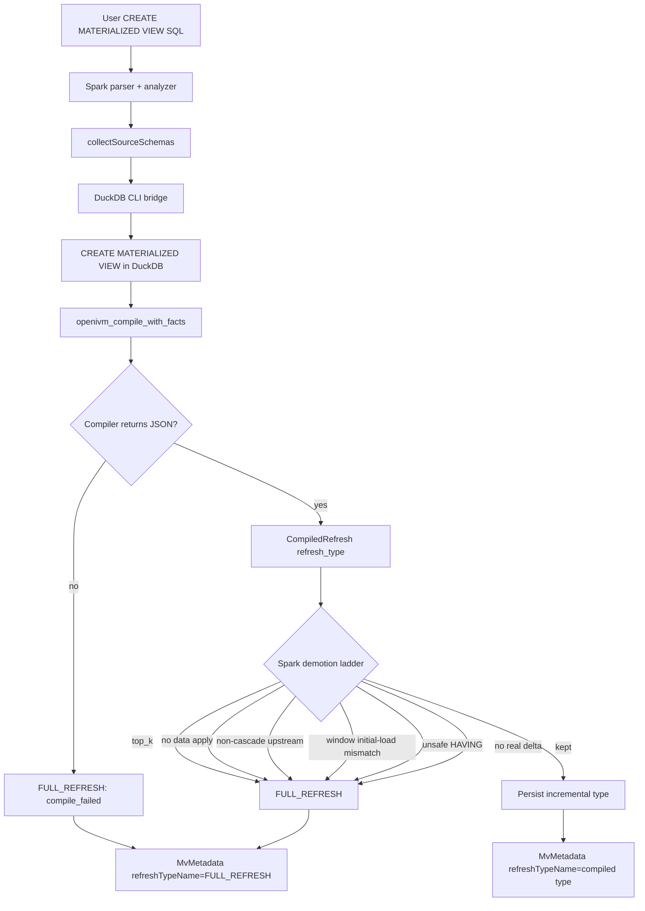

# 11. FULL_REFRESH demotion debugging

TL;DR: A Spark-side `FULL_REFRESH` demotion means OpenIVM probably classified the view as an incremental shape, but `openivm-spark` decided the compiled program was not safe or not executable on Spark. The view remains correct because refresh falls back to `INSERT OVERWRITE TABLE <mv> SELECT * FROM (<original query>)`; the cost is that every refresh scans the live sources instead of applying staged deltas. Start with `MvCatalog.refreshTypeName`, then the structured `[openivm-mv] ... reason='...'` log line, then the compile bridge if the reason is `compile_failed:*`.

## 1. Vocabulary: what "demotion" means

A materialized view has two classifications that are easy to conflate.

1. The DuckDB/OpenIVM compiler returns a `CompiledRefresh`:
   `refreshType`, `refreshTypeName`, `sql`, and `initialLoadSql`.
   That shape is emitted by `openivm_compile_with_facts` and decoded by
   `OpenIvmCompiler.parseRefreshLine`.
1. The Spark extension persists an effective type in `MvMetadata`.
   The persisted type controls CREATE-time storage, REFRESH-time assembly,
   and whether downstream MV-over-MV refresh can consume a view delta.

The `CompiledRefresh` record is defined in
`spark-ext/ivm-compiler/src/main/scala/org/openivm/spark/compiler/OpenIvmCompiler.scala:10-16`.
The persisted metadata stores `refreshType` and `refreshTypeName` in
`spark-ext/ivm-common/src/main/scala/org/openivm/spark/common/MvCatalog.scala:32-43`.
The enum value for full recompute is `RefreshTypeCode.FullRefresh = 3` in
`spark-ext/ivm-common/src/main/scala/org/openivm/spark/common/RefreshTypeCode.scala:6-18`.

A **demotion** is the moment where those two classifications diverge:

| concept                |                                                example value | who chose it             | consequence                                 |
| ---------------------- | -----------------------------------------------------------: | ------------------------ | ------------------------------------------- |
| compiled refresh type  | `AGGREGATE_GROUP` / `SIMPLE_PROJECTION` / `WINDOW_PARTITION` | OpenIVM DuckDB extension | Spark has an incremental program to inspect |
| effective refresh type |                                               `FULL_REFRESH` | Spark-side safety gate   | Refresh recomputes from `querySql`          |
| correctness            |                                      bag-equal to live query | Spark                    | preserved                                   |
| performance            |                                             full source scan | Spark                    | worse than incremental                      |

`FULL_REFRESH` is assembled as exactly one Spark SQL statement by
`FullRefreshAssembler`: `INSERT OVERWRITE TABLE <mv> SELECT * FROM (<deltaSql>)`.
See `spark-ext/ivm-common/src/main/scala/org/openivm/spark/common/FullRefreshAssembler.scala:3-22`.
`RefreshMaterializedViewCommand` passes the original user query as `deltaSql`
when `meta.refreshType == FullRefresh`, so a demoted MV refreshes by re-running
that query against live tables; see
`spark-ext/ivm-extension/src/main/scala/org/openivm/spark/commands/MaterializedViewCommands.scala:856-885`.

Version note: this chapter uses the word `demotionReason` for the structured
reason string because that is the operator-facing concept. In this checkout,
`MvMetadata` persists `refreshTypeName` and properties, but there is no
first-class `demotionReason` field in
`spark-ext/ivm-common/src/main/scala/org/openivm/spark/common/MvCatalog.scala:32-43`.
The durable evidence is therefore the persisted `FULL_REFRESH` plus the
structured log line emitted at CREATE time. If you are reading a branch that
added `MvMetadata.demotionReason`, it should store the same string as
`classifyReason` from
`spark-ext/ivm-extension/src/main/scala/org/openivm/spark/commands/MaterializedViewCommands.scala:597-618`.

## 2. Where demotion can enter

`CreateMaterializedViewCommand.run` does four things before it writes metadata:

1. Resolve source schemas and analyze the Spark plan.
1. Call the DuckDB/OpenIVM compiler bridge.
1. Run Spark-specific safety checks over the compiled program and analyzed plan.
1. Persist the effective `refreshType` / `refreshTypeName`.

The compiler call is at
`spark-ext/ivm-extension/src/main/scala/org/openivm/spark/commands/MaterializedViewCommands.scala:367-377`.
If the DuckDB bridge throws `OpenIvmCompileException`, Spark logs the failure
and substitutes a synthetic `CompiledRefresh(FULL_REFRESH, "FULL_REFRESH", "", "")`;
see
`spark-ext/ivm-extension/src/main/scala/org/openivm/spark/commands/MaterializedViewCommands.scala:378-392`.

The actual code shape is:

```scala
val compiled =
  try
    compiler.compile(
      CompileRequest(
        viewName = name.table,
        viewSql = originalQueryText,
        sources = compileSchemas,
        sourceQualifiedNames = shortToQual
      )
    )
  catch {
    case e: OpenIvmCompileException =>
      logError(
        s"[openivm-mv] view='${sqlIdent(name)}' " +
          s"compiled_refresh_type='COMPILE_FAILED' " +
          s"effective_refresh_type='FULL_REFRESH' " +
          s"reason='compile_failed' cause=${e.getMessage}"
      )
      CompiledRefresh(RefreshTypeCode.FullRefresh, "FULL_REFRESH", "", "")
  }
```

After compilation succeeds, the Spark side computes `effectiveRefreshType` with
an ordered `if`/`else` ladder. This is the main demotion table in code:
`spark-ext/ivm-extension/src/main/scala/org/openivm/spark/commands/MaterializedViewCommands.scala:597-618`.
The same block logs every decision with the compiled type, effective type,
reason, and cascade-delta capability at
`spark-ext/ivm-extension/src/main/scala/org/openivm/spark/commands/MaterializedViewCommands.scala:630-639`.

The metadata write uses `effectiveRefreshType` and `effectiveRefreshTypeName`
when constructing `MvMetadata`; see
`spark-ext/ivm-extension/src/main/scala/org/openivm/spark/commands/MaterializedViewCommands.scala:683-694`.
For full refreshes, cached compiled SQL is intentionally suppressed because the
incremental program will not be used; see
`spark-ext/ivm-extension/src/main/scala/org/openivm/spark/commands/MaterializedViewCommands.scala:658-664`.

### 2.1 Flow diagram



The important debugging implication: OpenIVM can be doing the right thing from
its point of view and Spark can still demote because Spark cannot safely replay
that program against Delta.

## 3. The named demotion reasons

Use the reason table as a triage map. The `Reason string` column is the value
emitted in the structured `reason='...'` log line and, on branches with a
persisted field, the value that should be stored in `MvMetadata.demotionReason`.

| Reason string                   | Trigger                                                                                                                                                                                                                                   | File:line                                                                                                                                                                                                                                                                                                                          |
| ------------------------------- | ----------------------------------------------------------------------------------------------------------------------------------------------------------------------------------------------------------------------------------------- | ---------------------------------------------------------------------------------------------------------------------------------------------------------------------------------------------------------------------------------------------------------------------------------------------------------------------------------- |
| `top_k`                         | Top-level `ORDER BY`, `LIMIT`, `OFFSET`, or `TAIL` wrapper is present. Spark does not maintain the OpenIVM inner-table + outer-view split for top-k in this code path.                                                                    | `spark-ext/ivm-extension/src/main/scala/org/openivm/spark/commands/MaterializedViewCommands.scala:183-206`, `spark-ext/ivm-extension/src/main/scala/org/openivm/spark/commands/MaterializedViewCommands.scala:488-507`, `spark-ext/ivm-extension/src/main/scala/org/openivm/spark/commands/MaterializedViewCommands.scala:597-599` |
| `simple_projection_no_apply`    | OpenIVM classified `SIMPLE_PROJECTION`, but Spark's rewrite probe did not produce a data-table apply statement after the view-delta statement.                                                                                            | `spark-ext/ivm-extension/src/main/scala/org/openivm/spark/commands/MaterializedViewCommands.scala:429-451`, `spark-ext/ivm-extension/src/main/scala/org/openivm/spark/commands/MaterializedViewCommands.scala:597-600`                                                                                                             |
| `non_cascade_upstream:<detail>` | A source table is itself an MV whose persisted instance cannot emit a downstream-consumable `MV_VIEW_DELTA`. The only sub-tag emitted today is `non_cascade:<upstream>` (upstream MV is `FULL_REFRESH` or otherwise not cascade-capable). | `spark-ext/ivm-extension/src/main/scala/org/openivm/spark/commands/MaterializedViewCommands.scala:516-559`, `spark-ext/ivm-extension/src/main/scala/org/openivm/spark/commands/MaterializedViewCommands.scala:601-602`                                                                                                             |
| `window_initial_load_mismatch`  | OpenIVM classified `WINDOW_PARTITION`, but Spark-translated initial-load SQL is not bag-equal to the user query on current data.                                                                                                          | `spark-ext/ivm-extension/src/main/scala/org/openivm/spark/commands/MaterializedViewCommands.scala:395-407`, `spark-ext/ivm-extension/src/main/scala/org/openivm/spark/commands/MaterializedViewCommands.scala:603-604`                                                                                                             |
| `having_pred_empty`             | OpenIVM classified `AGGREGATE_HAVING`, but Spark could not extract the HAVING predicate from the analyzed `Filter(cond, Aggregate)` shape.                                                                                                | `spark-ext/ivm-extension/src/main/scala/org/openivm/spark/commands/MaterializedViewCommands.scala:245-277`, `spark-ext/ivm-extension/src/main/scala/org/openivm/spark/commands/MaterializedViewCommands.scala:512-515`, `spark-ext/ivm-extension/src/main/scala/org/openivm/spark/commands/MaterializedViewCommands.scala:609-610` |
| `having_pred_hidden_agg`        | HAVING references an aggregate or synthetic analyzer attribute that is not materialized as a data-table column.                                                                                                                           | `spark-ext/ivm-extension/src/main/scala/org/openivm/spark/commands/MaterializedViewCommands.scala:279-288`, `spark-ext/ivm-extension/src/main/scala/org/openivm/spark/commands/MaterializedViewCommands.scala:410-427`, `spark-ext/ivm-extension/src/main/scala/org/openivm/spark/commands/MaterializedViewCommands.scala:611-615` |
| `no_real_delta`                 | The compiled SQL has no real `INSERT INTO openivm_delta_<view>` carrying source deltas; OpenIVM emitted only an empty placeholder such as `SELECT ... WHERE false`.                                                                       | `spark-ext/ivm-common/src/main/scala/org/openivm/spark/common/SparkRefreshRewriter.scala:1868-1904`, `spark-ext/ivm-extension/src/main/scala/org/openivm/spark/commands/MaterializedViewCommands.scala:459-486`, `spark-ext/ivm-extension/src/main/scala/org/openivm/spark/commands/MaterializedViewCommands.scala:616-617`        |
| `compile_failed:<msg>`          | The DuckDB CLI bridge failed before returning a `refresh_type` JSON row. Current logging uses `reason='compile_failed' cause=<msg>`; a persisted field should prefix the truncated cause.                                                 | `spark-ext/ivm-extension/src/main/scala/org/openivm/spark/commands/MaterializedViewCommands.scala:378-392`, `spark-ext/ivm-compiler/src/main/scala/org/openivm/spark/compiler/OpenIvmCompiler.scala:301-310`                                                                                                                       |

### 3.1 `top_k`

User SQL that triggers it:

```sql
CREATE TABLE sales_t1(id INT, region STRING, amount INT) USING DELTA;
INSERT INTO sales_t1 VALUES
  (1,'east',10),(2,'east',40),(3,'west',20),(4,'west',50),(5,'north',30);

CREATE MATERIALIZED VIEW mv_top3 AS
SELECT id, region, amount
FROM sales_t1
ORDER BY amount DESC
LIMIT 3;
```

Why Spark demotes:

- Spark parses the unresolved plan and checks whether the root is `GlobalLimit`,
  `LocalLimit`, `Sort`, `Offset`, or `Tail`; see
  `spark-ext/ivm-extension/src/main/scala/org/openivm/spark/commands/MaterializedViewCommands.scala:183-206`.
- The code comment explains the correctness issue: OpenIVM strips the top-k
  suffix and maintains an unlimited inner table plus a user-facing view, but
  this Spark implementation has a single Delta table addressed by the MV name;
  see
  `spark-ext/ivm-extension/src/main/scala/org/openivm/spark/commands/MaterializedViewCommands.scala:488-507`.

Expected metadata:

| field                    | value          |
| ------------------------ | -------------- |
| `refreshType`            | `3`            |
| `refreshTypeName`        | `FULL_REFRESH` |
| `demotionReason` concept | `top_k`        |

Expected log line:

```text
[openivm-mv] view='`mv_top3`' compiled_refresh_type='SIMPLE_PROJECTION' effective_refresh_type='FULL_REFRESH' reason='top_k' emits_cascade_view_delta='false'
```

Expected refresh SQL:

```sql
INSERT OVERWRITE TABLE `mv_top3`
SELECT * FROM (
  SELECT id, region, amount FROM sales_t1 ORDER BY amount DESC LIMIT 3
)
```

Recovery:

- Accept full refresh if the top-k result is small and source scans are cheap.
- Or implement the OpenIVM table/view split in Spark: maintain an internal
  unlimited data table incrementally and expose the user MV name as a Spark VIEW
  that applies `ORDER BY ... LIMIT` at read time.
- Do not simply store the unlimited inner result under the user MV name; that
  returns too many rows.
- Do not store only the current top-k incrementally without a replenishment
  strategy; deletes can require rows that were previously outside the top-k.

### 3.2 `simple_projection_no_apply`

> **Not the same as REFRESH-time `simple_projection_full_refresh`.** This
> section covers the **CREATE-time** demotion that persists
> `refreshTypeName = FULL_REFRESH` in `MvMetadata` for every subsequent
> REFRESH. The runtime `outcome='simple_projection_full_refresh' reason='conflicting_signed_rows'` log line is a **per-refresh** safety
> fallback — metadata stays `SIMPLE_PROJECTION`, the next refresh attempts
> the incremental path again, and the already-written cascade view-delta
> is preserved for downstream consumers. See chapter 8 §2.9 for that path.

User SQL class that can trigger it:

```sql
CREATE TABLE sp_src(id INT, payload STRING) USING DELTA;
INSERT INTO sp_src VALUES (1, 'a'), (2, 'b');

CREATE MATERIALIZED VIEW mv_sp AS
SELECT id, payload
FROM sp_src;
```

The plain shape above is normally supported. The reason appears when the
compiled `SIMPLE_PROJECTION` program has a view-delta statement but the Spark
rewriter cannot identify a usable data-table apply statement. The probe calls
`SparkRefreshRewriter.rewrite(...)` and requires more than one statement; see
`spark-ext/ivm-extension/src/main/scala/org/openivm/spark/commands/MaterializedViewCommands.scala:429-451`.

Why this matters:

- `SIMPLE_PROJECTION` refresh is not just "write the delta somewhere".
- Spark must also apply positive rows and negative rows to the MV table.
- The intended rewrite emits an `INSERT` for positive multiplicity and a
  delete-only `MERGE` for negative multiplicity; see
  `spark-ext/ivm-common/src/main/scala/org/openivm/spark/common/SparkRefreshRewriter.scala:742-833`.
- If that apply statement is missing, refresh would be a no-op or partial;
  Spark demotes instead.

Expected metadata:

| field                    | value                        |
| ------------------------ | ---------------------------- |
| `refreshType`            | `3`                          |
| `refreshTypeName`        | `FULL_REFRESH`               |
| `demotionReason` concept | `simple_projection_no_apply` |

Expected log line:

```text
[openivm-mv] view='`mv_sp`' compiled_refresh_type='SIMPLE_PROJECTION' effective_refresh_type='FULL_REFRESH' reason='simple_projection_no_apply' emits_cascade_view_delta='false'
```

Expected refresh SQL:

```sql
INSERT OVERWRITE TABLE `mv_sp`
SELECT * FROM (SELECT id, payload FROM sp_src)
```

Recovery:

- Inspect the compiled SQL and locate the statement that should look like
  `INSERT INTO openivm_data_<view> SELECT ... FROM openivm_delta_<view>`.
- If OpenIVM changed the SQL shape, update `SparkRefreshRewriter` statement
  classification and `rewriteSimpleProjectionDataInsert`.
- If the issue is non-injective projection semantics over duplicate rows, add a
  stable row identity or multiplicity-aware delete strategy before enabling the
  incremental path. The current delete `MERGE` uses value equality, which can
  delete all matching copies; see
  `spark-ext/ivm-common/src/main/scala/org/openivm/spark/common/SparkRefreshRewriter.scala:768-771`.

### 3.3 `non_cascade_upstream:<detail>`

User SQL that triggers it:

```sql
CREATE TABLE agg_src(k INT, v INT) USING DELTA;
INSERT INTO agg_src VALUES (1, 10), (1, 20), (2, 5);

CREATE MATERIALIZED VIEW mv_scalar AS
SELECT SUM(v) AS total_v
FROM agg_src;

CREATE MATERIALIZED VIEW mv_downstream AS
SELECT total_v
FROM mv_scalar;
```

A downstream MV over another MV needs the upstream refresh to emit a
view-delta that can be staged as `MV_VIEW_DELTA`. Spark checks every upstream
source resolved as an MV and demotes when `m.emitsCascadeViewDelta` is false or
when the downstream shape has a known unsafe cascade combination; see
`spark-ext/ivm-extension/src/main/scala/org/openivm/spark/commands/MaterializedViewCommands.scala:522-559`.

The coarse capability rule lives in `RefreshTypeCode.emitsCascadeViewDelta`.
It includes `AGGREGATE_GROUP`, `AGGREGATE_HAVING`, `SIMPLE_PROJECTION`,
`WINDOW_PARTITION`, and `GROUP_RECOMPUTE`, and excludes `SIMPLE_AGGREGATE`,
`FULL_REFRESH`, `DISTINCT_INCREMENTAL`, `SEMI_ANTI_RECOMPUTE`, and `TOP_K`; see
`spark-ext/ivm-common/src/main/scala/org/openivm/spark/common/RefreshTypeCode.scala:20-76`.

Expected metadata:

| field                                      | value                                       |
| ------------------------------------------ | ------------------------------------------- |
| upstream `mv_scalar.refreshTypeName`       | often `SIMPLE_AGGREGATE`                    |
| downstream `mv_downstream.refreshTypeName` | `FULL_REFRESH`                              |
| `demotionReason` concept                   | `non_cascade_upstream:non_cascade:<source>` |

Expected log line:

```text
[openivm-mv] view='`mv_downstream`' compiled_refresh_type='SIMPLE_PROJECTION' effective_refresh_type='FULL_REFRESH' reason='non_cascade_upstream:non_cascade:default.mv_scalar' emits_cascade_view_delta='false'
```

Expected refresh SQL:

```sql
INSERT OVERWRITE TABLE `mv_downstream`
SELECT * FROM (SELECT total_v FROM mv_scalar)
```

Recovery:

- Keep the downstream full-refresh if the upstream MV is cheap to scan.
- Or change the upstream MV into a cascade-capable shape.
- Or add Spark-side support for the missing upstream view-delta companion.

Note: two earlier sub-tags of `non_cascade_upstream` —
`aggregate_group_into_simple_projection` and `multi_mv_simple_projection` — were
removed. Multi-source SIMPLE_PROJECTION cascade is now supported (openivm emits
one `INSERT INTO openivm_delta_<view>` UNION-ALL-ing all upstream delta arms;
the Spark rewriter handles every `memory.main.openivm_delta_<src>` reference
regardless of source count). The AGGREGATE_GROUP→SIMPLE_PROJECTION cascade
follows duckdb-openivm's positive-only bag-apply contract: negative-multiplicity
retracts from the upstream's NULL-companion (`openivm/src/upsert/refresh_sql.cpp:898-960`)
are dropped at the downstream join filter (`BETWEEN` over NULL → UNKNOWN). At
scales where upstream dim deltas remain empty across batches — the canonical
TPC-DI 100/1/1 layout — Spark and DuckDB agree at every batch boundary. At
larger scales where dimension SCD-2 retracts manifest, both engines exhibit the
drift documented in `.scratch/OPENIVM_VALIDATE.md` — Failure Mode 1, and the
fix lives in openivm itself (emit pre-merge snapshot retracts instead of
NULL-companion).

### 3.4 `window_initial_load_mismatch`

User SQL class that can trigger it:

```sql
CREATE TABLE win_src(
  id INT,
  account_id INT,
  event_ts TIMESTAMP,
  status STRING,
  ignore_nulls BOOLEAN
) USING DELTA;

CREATE MATERIALIZED VIEW mv_win AS
SELECT
  account_id,
  event_ts,
  status,
  last_value(status, ignore_nulls)
    OVER (PARTITION BY account_id ORDER BY event_ts) AS carried_status
FROM win_src;
```

The literal-boolean form `last_value(status, true)` is normalized to DuckDB's
`IGNORE NULLS` syntax and has a regression spec; see
`spark-ext/ivm-compiler/src/main/scala/org/openivm/spark/compiler/OpenIvmCompiler.scala:236-262`
and
`spark-ext/ivm-it/src/test/scala/org/openivm/spark/parity/WindowIgnoreNullsForwardFillSpec.scala:78-110`.
A dynamic ignore-null flag is only a shim fallback and cannot preserve dynamic
semantics; see
`spark-ext/ivm-compiler/src/main/scala/org/openivm/spark/compiler/OpenIvmCompiler.scala:499-503`.

Spark validates `WINDOW_PARTITION` initial load by translating the OpenIVM
initial-load SQL, selecting user columns, and checking bidirectional
`EXCEPT ALL` against the original query; see
`spark-ext/ivm-extension/src/main/scala/org/openivm/spark/commands/MaterializedViewCommands.scala:395-407`.
If that comparison fails, the MV is demoted.

Recovery:

- Prefer literal `true` / `false` flags for `last_value` ignore-null semantics.
- Simplify the window frame to the Spark/DuckDB intersection.
- If the mismatch is a translator bug, add a compiler shim or an
  `LptsSparkDialect` rewrite and keep the `EXCEPT ALL` guard.

### 3.5 `having_pred_empty`

User SQL class that can trigger it:

```sql
CREATE TABLE h_src(region STRING, amount INT) USING DELTA;

CREATE MATERIALIZED VIEW mv_h AS
SELECT region, SUM(amount) AS total
FROM h_src
GROUP BY region
HAVING SUM(amount) > 100;
```

The simple form above is supported and covered by
`spark-ext/ivm-it/src/test/scala/org/openivm/spark/parity/AggregateHavingSpec.scala:101-119`.
The demotion appears when OpenIVM says `AGGREGATE_HAVING` but Spark's analyzed
plan does not expose a `Filter(cond, Aggregate)` from which the HAVING predicate
can be extracted. The extraction logic is in
`spark-ext/ivm-extension/src/main/scala/org/openivm/spark/commands/MaterializedViewCommands.scala:245-277`.

Recovery:

- Rewrite the MV body so the HAVING predicate is directly on the grouped query.
- Avoid wrapping the aggregate/HAVING in generated SQL that changes the analyzed
  shape before Spark sees it.
- If the shape is legitimate, extend `extractHavingPredicateSql` and add a
  parity spec.

### 3.6 `having_pred_hidden_agg`

User SQL that triggers it:

```sql
CREATE TABLE h2_src(region STRING, amount INT) USING DELTA;

CREATE MATERIALIZED VIEW mv_h2 AS
SELECT region, SUM(amount) AS total
FROM h2_src
GROUP BY region
HAVING COUNT(*) >= 3;
```

Spark's incremental `AGGREGATE_HAVING` implementation stores all groups in a
sibling data table and exposes a user-facing view that applies HAVING at read
time. That only works if every identifier in the HAVING predicate exists in the
data table. Spark checks the translated predicate against data-table columns at
`spark-ext/ivm-extension/src/main/scala/org/openivm/spark/commands/MaterializedViewCommands.scala:279-288`
and applies the demotion at
`spark-ext/ivm-extension/src/main/scala/org/openivm/spark/commands/MaterializedViewCommands.scala:611-615`.

Expected log line:

```text
[openivm-mv] view='`mv_h2`' compiled_refresh_type='AGGREGATE_HAVING' effective_refresh_type='FULL_REFRESH' reason='having_pred_hidden_agg' emits_cascade_view_delta='false'
```

Recovery:

```sql
CREATE MATERIALIZED VIEW mv_h2_fixed AS
SELECT region, SUM(amount) AS total, COUNT(*) AS cnt
FROM h2_src
GROUP BY region
HAVING COUNT(*) >= 3;
```

By projecting the aggregate used by HAVING, the data table has a column that the
user-facing view can reference. This supported shape is covered by
`spark-ext/ivm-it/src/test/scala/org/openivm/spark/parity/AggregateHavingSpec.scala:122-140`.

### 3.7 `no_real_delta`

User SQL class that can trigger it:

```sql
CREATE TABLE customers(id INT, name STRING) USING DELTA;
CREATE TABLE orders(id INT, customer_id INT, amount INT) USING DELTA;

CREATE MATERIALIZED VIEW mv_join AS
SELECT c.id, c.name, o.amount
FROM customers c
JOIN orders o
  ON c.id = o.customer_id;
```

Some multi-source shapes compile to a program that contains only an empty
placeholder insert into `openivm_delta_<view>`, for example `SELECT ... WHERE false`. Spark treats that as "no real delta" because replaying the program would
not update the MV after source changes. The detector is
`SparkRefreshRewriter.hasRealDelta`; see
`spark-ext/ivm-common/src/main/scala/org/openivm/spark/common/SparkRefreshRewriter.scala:1868-1904`.

Expected log line:

```text
[openivm-mv] view='`mv_join`' compiled_refresh_type='AGGREGATE_GROUP' effective_refresh_type='FULL_REFRESH' reason='no_real_delta' emits_cascade_view_delta='false'
```

Recovery:

- If correctness is the only requirement, keep the MV as full refresh.
- If incrementality is required, inspect the OpenIVM SQL and implement a real
  Spark rewrite for the join delta shape.
- Do not remove the guard; a placeholder delta is worse than full refresh
  because it silently leaves stale data.

## 4. Step-by-step debugging recipe

### Step 1: query `MvCatalog`

Use the project JVM, not a Python RocksDB binding, to inspect catalog metadata.
The catalog is RocksDB-backed and `MvCatalog.lookup` / `MvCatalog.list` are the
supported readers; see
`spark-ext/ivm-common/src/main/scala/org/openivm/spark/common/MvCatalog.scala:453-466`.

From inside the dev container:

```bash
cd spark-ext/dev
docker compose --env-file pins.env -f docker/docker-compose.yml \
  run --rm -T build sbt 'ivmCommon/console'
```

Then run a small Scala probe, adjusted to your warehouse path and MV name:

```scala
import org.apache.spark.sql.SparkSession
import org.openivm.spark.common.{MvCatalog, MvMetadata}

val warehouse = "/work/spark-ext/ivm-it/target/test-warehouse-your-spec"
val spark = SparkSession.builder()
  .master("local[1]")
  .appName("openivm-demotion-probe")
  .config("spark.sql.extensions", "io.delta.sql.DeltaSparkSessionExtension,org.openivm.spark.OpenIvmSparkExtensions")
  .config("spark.sql.catalog.spark_catalog", "org.apache.spark.sql.delta.catalog.DeltaCatalog")
  .config("spark.openivm.enabled", "true")
  .config("spark.sql.warehouse.dir", warehouse)
  .getOrCreate()

MvCatalog.ensureTables(spark)
MvCatalog.list(spark).foreach { meta =>
  val conceptualReason =
    meta.properties.get("_ivm_demotion_reason")
      .orElse(meta.properties.get("demotionReason"))
      .getOrElse("<not persisted in this checkout; grep logs for reason='...'>")

  println(s"${meta.name}: ${meta.refreshTypeName} (${meta.refreshType}), reason=$conceptualReason")
}
```

If your branch has a real `MvMetadata.demotionReason` field, print that field
directly. In this checkout, the reason is logged, not persisted.

### Step 2: inspect `_ivm_compiled_sql`

The cached compiled SQL key is `MvMetadata.CompiledSqlKey = "_ivm_compiled_sql"`;
see `spark-ext/ivm-common/src/main/scala/org/openivm/spark/common/MvCatalog.scala:89-101`.
Refresh reuses the cache when present at
`spark-ext/ivm-extension/src/main/scala/org/openivm/spark/commands/MaterializedViewCommands.scala:897-918`.

In the same Scala probe:

```scala
MvCatalog.list(spark).foreach { meta =>
  val compiled = meta.properties.get(MvMetadata.CompiledSqlKey)
  println(s"${meta.name} compiled cache present? ${compiled.exists(_.nonEmpty)}")
  compiled.foreach(sql => println(sql.take(2000)))
}
```

Interpretation:

| observation                                                       | meaning                                                         |
| ----------------------------------------------------------------- | --------------------------------------------------------------- |
| cache contains an incremental program with `openivm_delta_<view>` | MV was kept incremental                                         |
| cache is absent and `refreshTypeName = FULL_REFRESH`              | current code suppressed cache because incremental SQL is unused |
| cache or assembled SQL says `INSERT OVERWRITE TABLE`              | you are on the full-refresh path                                |

The absence of `_ivm_compiled_sql` for full refreshes is intentional in this
checkout; see
`spark-ext/ivm-extension/src/main/scala/org/openivm/spark/commands/MaterializedViewCommands.scala:658-664`.
Older metadata or future branches may cache the assembled full-refresh SQL; if
so, `INSERT OVERWRITE TABLE` is the smoking gun.

### Step 3: grep the Spark test logs

When tests are run through `spark-ext/dev/dev.sh`, the wrapper creates a
per-run directory `spark-ext/.logs/test-<YYYYMMDD-HHMMSS>/` and each forked JVM
writes a `fork-<HHmmss-SSS>.log`; see
`spark-ext/dev/dev.sh:81-115` and the fork propagation in
`spark-ext/project/Settings.scala:117-124`.

Search the newest run:

```bash
cd /home/mdrrahman/openivm-spark
latest=$(ls -td spark-ext/.logs/test-* | head -1)
grep -R "\[openivm-mv\].*effective_refresh_type='FULL_REFRESH'" "$latest" | head -50
grep -R "reason='" "$latest" | head -50
```

The CREATE-time log emit site is
`spark-ext/ivm-extension/src/main/scala/org/openivm/spark/commands/MaterializedViewCommands.scala:630-639`.
The compile-failed log emit site is
`spark-ext/ivm-extension/src/main/scala/org/openivm/spark/commands/MaterializedViewCommands.scala:378-386`.

### Step 4: if `compile_failed`, replay the DuckDB bridge manually

The bridge spawns `duckdb :memory: -jsonlines`; see
`spark-ext/ivm-compiler/src/main/scala/org/openivm/spark/compiler/OpenIvmCompiler.scala:267-299`.
It builds a script with the extension load, remaining OpenIVM settings, source `CREATE TABLE` DDL, Spark function shims, `CREATE MATERIALIZED VIEW`, and the
`openivm_compile_with_facts` table-function call; see
`spark-ext/ivm-compiler/src/main/scala/org/openivm/spark/compiler/OpenIvmCompiler.scala:144-196`.

Replay that shape manually:

```bash
/opt/openivm/duckdb :memory: -jsonlines <<'SQL'
LOAD '/opt/openivm/openivm.duckdb_extension';
SET openivm_minmax_incremental=false;
SET openivm_files_path='<compile-files-dir>';

CREATE TABLE src(id INTEGER, amount INTEGER, ts TIMESTAMP);

-- Copy the relevant CREATE OR REPLACE MACRO lines from SparkFunctionShimSql / OpenIvmCompiler.
CREATE OR REPLACE MACRO regexp_like(s, p) AS regexp_matches(s, p);

CREATE OR REPLACE MATERIALIZED VIEW mv_debug AS
SELECT id, amount FROM src;

SELECT * FROM openivm_compile_with_facts(
  'mv_debug',
  '{"target_dialect":"spark","compile_only":true,"force_view_delta_cascade":true}'
);
SQL
```

If DuckDB prints a binder/parser error on stderr, that error is the root cause.
If it prints a JSON row with `refresh_type`, Spark's failure is likely in a
Spark-side post-compile check rather than the compiler bridge.

### Step 5: cross-reference the known parity gaps

Once you have a reason string and the failing SQL shape, compare it with known
workarounds in [12-parity-gap-forensics.md](./12-parity-gap-forensics.md).
For workload-scale examples, especially TPC-DI models that intentionally remain
full refresh or become demoted due to cascade/window gaps, see
[14-tpc-di-deep-dive.md](./14-tpc-di-deep-dive.md).

## 5. The `compile_failed` deep dive

`OpenIvmCompiler.compile` builds DuckDB table DDL from Spark source schemas,
writes a temporary compile-only script, runs the DuckDB CLI, parses stdout, and
extracts initial-load SQL. The high-level sequence is in
`spark-ext/ivm-compiler/src/main/scala/org/openivm/spark/compiler/OpenIvmCompiler.scala:69-98`.

### 5.1 What throws `OpenIvmCompileException`

The exception type preserves DuckDB error text in `getMessage`; see
`spark-ext/ivm-compiler/src/main/scala/org/openivm/spark/compiler/OpenIvmCompiler.scala:35-38`.
The parser throws if stdout has no JSON row containing `"refresh_type"`; it
includes stderr in the message when stderr is non-empty; see
`spark-ext/ivm-compiler/src/main/scala/org/openivm/spark/compiler/OpenIvmCompiler.scala:301-310`.
Generic exceptions are wrapped as DuckDB CLI errors at
`spark-ext/ivm-compiler/src/main/scala/org/openivm/spark/compiler/OpenIvmCompiler.scala:87-95`.

Common operator-facing causes:

| cause                             | symptom                                                                | recovery                                                                                            |
| --------------------------------- | ---------------------------------------------------------------------- | --------------------------------------------------------------------------------------------------- |
| Spark function has no DuckDB shim | DuckDB binder says function does not exist or has no matching overload | Add a macro in `OpenIvmCompiler.sparkFunctionShimsPrologue` and a pre/post rewrite if names collide |
| Spark syntax is not DuckDB syntax | DuckDB parser error near a Spark-only construct                        | Normalize in `normalizeSparkSqlForDuckdb` or constrain MV SQL to the dialect intersection           |
| LPTS emits SQL Spark cannot parse | CREATE succeeds, but rewrite or initial-load check fails later         | Add an `LptsSparkDialect` translation and a parity spec                                             |
| Unsupported Spark type            | `NotImplementedError` from `sparkToDuckdbType`                         | Add a type mapping if DuckDB can represent it, otherwise reject with a clear user error             |
| CLI or extension missing          | build-time path error                                                  | Check `OPENIVM_EXTENSION_PATH` and `OPENIVM_CLI_PATH`                                               |

The current shim prologue includes `regexp_like`, `to_date`, `to_timestamp`,
`date_format`, and a fallback `last_value` shim; see
`spark-ext/ivm-compiler/src/main/scala/org/openivm/spark/compiler/OpenIvmCompiler.scala:479-533`.
The compile bridge pre-normalizes function calls and semi/anti joins before
DuckDB sees the SQL; see
`spark-ext/ivm-compiler/src/main/scala/org/openivm/spark/compiler/OpenIvmCompiler.scala:236-262`.

### 5.2 Timeout and stderr caveat

The bridge calls `process.waitFor(120, TimeUnit.SECONDS)` before collecting the
reader futures; see
`spark-ext/ivm-compiler/src/main/scala/org/openivm/spark/compiler/OpenIvmCompiler.scala:291-299`.
In practice, a non-zero CLI exit or fatal stderr usually appears as "produced no
result" because `parseCompileResult` requires a `refresh_type` JSON line.
If you are hardening this path, check the boolean return from `waitFor`, destroy
the process on timeout, and include exit code in `OpenIvmCompileException`.

### 5.3 Recovery loop

1. Reproduce the compiler script manually with `/opt/openivm/duckdb :memory: -jsonlines`.
1. Add the smallest shim or normalization that lets DuckDB parse and bind the
   MV body.
1. Add a compiler unit test or parity spec for the exact SQL shape.
1. `DROP MATERIALIZED VIEW` and re-`CREATE MATERIALIZED VIEW`; CREATE-time
   metadata will not be rewritten by only refreshing the old MV.
1. Confirm the log line changes from `reason='compile_failed'` to either
   `reason='kept'` or a later, more specific Spark-side demotion reason.

## 6. Reading demotion evidence as tables

A useful debug report looks like this:

| mv              | compiled_refresh_type | effective_refresh_type | reason                   | compiled_cache | refresh_plan                      |
| --------------- | --------------------- | ---------------------- | ------------------------ | -------------- | --------------------------------- |
| `mv_top3`       | `SIMPLE_PROJECTION`   | `FULL_REFRESH`         | `top_k`                  | absent         | `INSERT OVERWRITE TABLE`          |
| `mv_h2`         | `AGGREGATE_HAVING`    | `FULL_REFRESH`         | `having_pred_hidden_agg` | absent         | `INSERT OVERWRITE TABLE`          |
| `mv_join`       | `AGGREGATE_GROUP`     | `FULL_REFRESH`         | `no_real_delta`          | absent         | `INSERT OVERWRITE TABLE`          |
| `mv_region_sum` | `AGGREGATE_GROUP`     | `AGGREGATE_GROUP`      | `kept`                   | present        | `MERGE INTO` plus view-delta CTAS |

How to fill each column:

- `effective_refresh_type`: `MvCatalog.list(spark).map(_.refreshTypeName)`.
- `compiled_refresh_type`: CREATE log line, or run `OpenIvmCompiler.compile`
  directly with the same `CompileRequest`.
- `reason`: CREATE log line, or persisted `demotionReason` on branches that
  added the field.
- `compiled_cache`: `meta.properties.get(MvMetadata.CompiledSqlKey)`.
- `refresh_plan`: `FullRefreshAssembler` for type 3, `SparkRefreshRewriter` for
  incremental types.

## 7. Common false leads

### 7.1 "The MV is wrong because it is FULL_REFRESH"

No. Full refresh is the conservative correctness path. It recomputes from the
original `querySql` and overwrites the Delta MV table. If the result is wrong,
debug the user query, source data, schema drift, or full-refresh assembler, not
incremental demotion first.

### 7.2 "`_ivm_compiled_sql` is missing, so metadata is corrupt"

Not for demoted views in this checkout. The CREATE path intentionally stores
compiled SQL only when the effective type is not `FULL_REFRESH`; see
`spark-ext/ivm-extension/src/main/scala/org/openivm/spark/commands/MaterializedViewCommands.scala:658-664`.

### 7.3 "OpenIVM returned `FULL_REFRESH`, so Spark demoted it"

That is not a demotion. A demotion is when OpenIVM returned an incremental type
and Spark changed the effective type to `FULL_REFRESH`. If OpenIVM itself
classified the view as `FULL_REFRESH`, Spark is only persisting the compiler's
answer.

### 7.4 "Top-K has enum value 7, so it should be incremental"

`RefreshTypeCode.TopK = 7` exists, but the code comment says the classifier
never assigns it; OpenIVM strips `ORDER BY/LIMIT` and classifies the inner
query. See
`spark-ext/ivm-common/src/main/scala/org/openivm/spark/common/RefreshTypeCode.scala:14-18`.
Spark still demotes the user-facing top-k query because the single-table Spark
MV layout cannot preserve top-k semantics incrementally.

## 8. Minimal reproduction checklist

When filing or debugging a demotion, capture these artifacts:

1. The exact `CREATE MATERIALIZED VIEW` SQL.
1. The source table DDLs as Spark sees them.
1. The `MvCatalog` row: name, `refreshType`, `refreshTypeName`, source tables,
   and properties.
1. The CREATE-time `[openivm-mv]` log line.
1. The compiled SQL from `OpenIvmCompiler.compile`, if compilation succeeds.
1. The full-refresh assembled SQL if `refreshTypeName = FULL_REFRESH`.
1. A bidirectional `EXCEPT ALL` correctness check against the original query.
1. A note saying whether the view is over base tables only or over upstream MVs.

This set separates compiler failure, Spark rewrite gaps, cascade gaps, and
expected full-refresh classifications.

## 9. How to add support without hiding bugs

The safe pattern is:

1. Add or update a parity spec that currently demotes.
1. Assert the current `refreshTypeName` and reason so the baseline is explicit.
1. Implement the missing compiler shim, rewrite, cascade delta, or top-k storage
   split.
1. Change the assertion to the intended incremental type.
1. Keep the bidirectional `EXCEPT ALL` oracle.
1. Keep the demotion guard until the new support proves the previously unsafe
   case is safe.

Do not silently remove a demotion branch to make a benchmark faster. The code
comments around `no_real_delta` explain the philosophy: a no-op incremental
refresh is worse than full recompute because it preserves stale data. See
`spark-ext/ivm-extension/src/main/scala/org/openivm/spark/commands/MaterializedViewCommands.scala:459-463`.

## 10. Next

Next, read [12-parity-gap-forensics.md](./12-parity-gap-forensics.md) for the
workflow that turns a demotion or mismatch into a minimized parity test, then
read [14-tpc-di-deep-dive.md](./14-tpc-di-deep-dive.md) for workload-scale MVs
where these demotion reasons show up in realistic dependency graphs.
