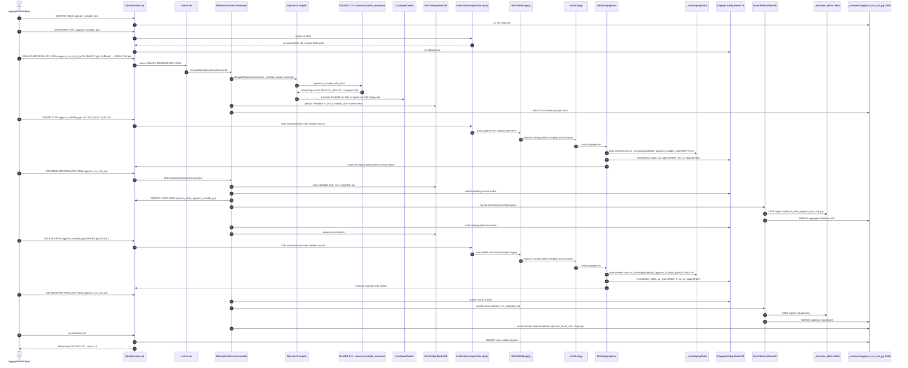

# 13. End-to-end trace: `AggregateSumSpec`

This chapter is a live, executed trace of the `org.openivm.spark.parity.AggregateSumSpec` parity suite.
It follows real data from Spark SQL, through OpenIVM compilation, into Delta staging, RocksDB metadata, rewritten Spark MERGE statements, and the final `assertMvCorrect` oracle.

The run used Spark 3.5.1 / Delta 3.2.0 through `spark-ext/dev/dev.sh`.
The observable warehouse for this trace is:

```text
/home/mdrrahman/openivm-spark/spark-ext/target/test-warehouse-aggregate-sum-spec-b474b4f7
```

The test command was the requested single-spec run, with project-local log/probe paths rather than `/tmp` paths:

```bash
cd /home/mdrrahman/openivm-spark
./spark-ext/dev/dev.sh test 'testOnly org.openivm.spark.parity.AggregateSumSpec' 2>&1 \
  | tee spark-ext/.logs/aggsum-trace/aggsum-test-rerun.log | tail -50
```

The suite passed in one live run:

```text
[info] AggregateSumSpec:
[info] - NULL is treated as a distinct group; INSERT and DELETE update it correctly
[info] - SUM over DECIMAL(10,2) is maintained correctly across INSERTs
[info] - SUM over near-max BIGINT values is maintained correctly
[info] - DATE-keyed SUM is maintained across INSERTs
[info] - MV created on empty base table is populated after first INSERT + REFRESH
[info] - INSERT of 1000 generated rows is consolidated in a single refresh
[info] - After DELETE-all, the MV becomes empty
[info] - MV reflects the new groupings after rows are UPDATEd to a different group
[info] - Deleting the only row in a group removes that group from the MV
[info] Run completed in 2 minutes, 2 seconds.
[info] Total number of tests run: 9
[info] Tests: succeeded 9, failed 0, canceled 0, ignored 0, pending 0
[info] All tests passed.
```

> Note: the checked-in test suite deletes its UUID warehouse in `afterAll`.
> For this documentation trace only, the suite was run once with cleanup disabled, then the source file was restored unchanged.
> The retained warehouse is therefore a real `AggregateSumSpec` warehouse from that single pass.

______________________________________________________________________

## 13.1 What this spec exercises

All nine examples compile to the OpenIVM `AGGREGATE_GROUP` refresh type.
No example demotes to `FULL_REFRESH`.
Every refresh writes a signed view-delta Delta table, then applies a keyed MERGE into the MV Delta table.
The hidden `openivm_count_star` column appears when the user query does not already expose a `COUNT(*)` alias; it lets the cleanup path delete groups whose count reaches zero.

The suite uses this correctness oracle from `AggregateSumSpec.scala`:

```scala
  /** Project away hidden `openivm_*` bookkeeping columns from the MV, then
    * perform a bidirectional EXCEPT ALL equivalence check against the
    * expected SQL expression. ARRAY columns must be passed in `arrayCols`
    * so they are JSON-serialised before the comparison.
    */
  private def assertMvCorrect(
      mvName: String,
      expectedSql: String,
      arrayCols: Set[String] = Set.empty
  ): Unit = {
    val expected: DataFrame = spark.sql(expectedSql)
    val userCols            = expected.columns.toSeq

    def project(df: DataFrame): DataFrame = {
      val exprs = userCols.map { c =>
        if (arrayCols.contains(c)) s"to_json(`$c`) AS `$c`"
        else s"`$c`"
      }
      df.selectExpr(exprs: _*)
    }

    val expectedProj = project(expected)
    val mv           = spark.table(mvName).select(userCols.head, userCols.tail: _*)
    val mvProj       = project(mv)

    withClue(s"$mvName EXCEPT ALL <expected> (MV has extra rows): ") {
      mvProj.exceptAll(expectedProj).count() shouldBe 0L
    }
    withClue(s"<expected> EXCEPT ALL $mvName (MV missing rows): ") {
      expectedProj.exceptAll(mvProj).count() shouldBe 0L
    }
  }
```

The oracle intentionally ignores hidden `openivm_*` columns and performs bidirectional `EXCEPT ALL`:

- `mv EXCEPT ALL expected` must have count `0`.
- `expected EXCEPT ALL mv` must have count `0`.
- The check is bag-equality, not a row-count smoke test.

______________________________________________________________________

## 13.2 Classification and demotion ledger

The run emitted one classification line per materialized view at CREATE time.
Every line below came from `spark-ext/.logs/test-20260524-114102/fork-114118-300.log`.

| #   | MV                     | compiled RefreshType | effective RefreshType | demotionReason | emits cascade delta |
| --- | ---------------------- | -------------------- | --------------------- | -------------- | ------------------- |
| 1   | aggsum_mv_null_grp     | AGGREGATE_GROUP      | AGGREGATE_GROUP       | kept           | true                |
| 2   | aggsum_mv_dec          | AGGREGATE_GROUP      | AGGREGATE_GROUP       | kept           | true                |
| 3   | aggsum_mv_big          | AGGREGATE_GROUP      | AGGREGATE_GROUP       | kept           | true                |
| 4   | aggsum_mv_daily        | AGGREGATE_GROUP      | AGGREGATE_GROUP       | kept           | true                |
| 5   | aggsum_mv_empty        | AGGREGATE_GROUP      | AGGREGATE_GROUP       | kept           | true                |
| 6   | aggsum_mv_batch        | AGGREGATE_GROUP      | AGGREGATE_GROUP       | kept           | true                |
| 7   | aggsum_mv_del_all      | AGGREGATE_GROUP      | AGGREGATE_GROUP       | kept           | true                |
| 8   | aggsum_mv_agg_grp_move | AGGREGATE_GROUP      | AGGREGATE_GROUP       | kept           | true                |
| 9   | aggsum_mv_agg_vanish   | AGGREGATE_GROUP      | AGGREGATE_GROUP       | kept           | true                |

Interpretation: `reason=kept` is the demotion reason of interest here: OpenIVM classified the query as incremental and Spark preserved that classification.

______________________________________________________________________

## 13.3 On-disk warehouse map

The Python probe decoded `_openivm` safe path segments and enumerated every Delta table under `_ivm`.
The live tree has the following high-level shape:

```text
test-warehouse-aggregate-sum-spec-b474b4f7/
├── aggsum_*                         # nine source Delta tables
├── _ivm/views/<mv>/                 # nine MV Delta tables
├── _ivm/staging/<base>/<op>/<ts>/    # captured DML Delta tables
├── _ivm/view_deltas/<mv>/<uuid>/     # signed per-refresh MV deltas
└── _openivm/                         # RocksDB metadata
    ├── index/rocksdb/
    ├── mvs/<base64url(mv)>/rocksdb/
    └── tables/<base64url(table)>/rocksdb/
```

Decoded MV RocksDB directories:

| encoded directory              | decoded MV name        |
| ------------------------------ | ---------------------- |
| YWdnc3VtX212X251bGxfZ3Jw       | aggsum_mv_null_grp     |
| YWdnc3VtX212X2FnZ192YW5pc2g    | aggsum_mv_agg_vanish   |
| YWdnc3VtX212X2FnZ19ncnBfbW92ZQ | aggsum_mv_agg_grp_move |
| YWdnc3VtX212X2JhdGNo           | aggsum_mv_batch        |
| YWdnc3VtX212X2JpZw             | aggsum_mv_big          |
| YWdnc3VtX212X2RhaWx5           | aggsum_mv_daily        |
| YWdnc3VtX212X2RlYw             | aggsum_mv_dec          |
| YWdnc3VtX212X2RlbF9hbGw        | aggsum_mv_del_all      |
| YWdnc3VtX212X2VtcHR5           | aggsum_mv_empty        |

Decoded source/table RocksDB directories include both source tables and MV trigger names:

| encoded directory                    | decoded name                |
| ------------------------------------ | --------------------------- |
| YWdnc3VtX212X251bGxfZ3Jw             | aggsum_mv_null_grp          |
| YWdnc3VtX212X2FnZ192YW5pc2g          | aggsum_mv_agg_vanish        |
| YWdnc3VtX212X2FnZ19ncnBfbW92ZQ       | aggsum_mv_agg_grp_move      |
| YWdnc3VtX212X2JhdGNo                 | aggsum_mv_batch             |
| YWdnc3VtX212X2JpZw                   | aggsum_mv_big               |
| YWdnc3VtX212X2RhaWx5                 | aggsum_mv_daily             |
| YWdnc3VtX212X2RlYw                   | aggsum_mv_dec               |
| YWdnc3VtX212X2RlbF9hbGw              | aggsum_mv_del_all           |
| YWdnc3VtX212X2VtcHR5                 | aggsum_mv_empty             |
| ZGVmYXVsdC5hZ2dzdW1fYWdnX2dycF9tb3Zl | default.aggsum_agg_grp_move |
| ZGVmYXVsdC5hZ2dzdW1fYWdnX3ZhbmlzaA   | default.aggsum_agg_vanish   |
| ZGVmYXVsdC5hZ2dzdW1fYmF0Y2hfdGJs     | default.aggsum_batch_tbl    |
| ZGVmYXVsdC5hZ2dzdW1fYmlnX251bXM      | default.aggsum_big_nums     |
| ZGVmYXVsdC5hZ2dzdW1fZGFpbHlfc2FsZXM  | default.aggsum_daily_sales  |
| ZGVmYXVsdC5hZ2dzdW1fZGVjaW1hbHM      | default.aggsum_decimals     |
| ZGVmYXVsdC5hZ2dzdW1fZGVsX2FsbA       | default.aggsum_del_all      |
| ZGVmYXVsdC5hZ2dzdW1fZW1wdHlfYmFzZQ   | default.aggsum_empty_base   |
| ZGVmYXVsdC5hZ2dzdW1fbnVsbGFibGVfZ3Jw | default.aggsum_nullable_grp |

RocksDB content was read with a Scala `MvCatalog` probe, not with `rocksdict`; the persistent compile cache is a RocksDB `properties` entry named `_ivm_compiled_sql`.

______________________________________________________________________

## 13.4 Probe script

This is the exact project-local Python probe used to enumerate Delta artifacts and decode `_openivm` directory names.
It deliberately does not try to open RocksDB; RocksDB values are inspected through Scala catalog APIs.

```bash
mkdir -p spark-ext/.logs/aggsum-probe
cat <<'EOF' > spark-ext/.logs/aggsum-probe/probe.py
"""Probe the per-spec warehouse for an AggregateSumSpec run."""
import argparse, base64, json, os
from pathlib import Path
from deltalake import DeltaTable


def b64decode(s):
    return base64.urlsafe_b64decode(s + '=' * (-len(s) % 4)).decode()


def is_delta(path: Path) -> bool:
    return path.is_dir() and (path / '_delta_log').is_dir()


def rows(path: Path, limit=20):
    try:
        df = DeltaTable(str(path)).to_pandas()
        if len(df) > limit:
            df = df.head(limit)
        return json.loads(df.to_json(orient='records', date_format='iso'))
    except Exception as e:
        return {'error': f'{type(e).__name__}: {e}'}


def versions(path: Path):
    log = path / '_delta_log'
    if not log.is_dir():
        return []
    return sorted(p.name for p in log.glob('*.json'))


def main():
    ap = argparse.ArgumentParser()
    ap.add_argument('warehouse')
    args = ap.parse_args()
    wh = Path(args.warehouse).resolve()
    out = {'warehouse': str(wh), 'decoded_openivm': {'mvs': [], 'tables': []}, 'delta_tables': []}

    for kind in ('mvs', 'tables'):
        root = wh / '_openivm' / kind
        if root.is_dir():
            for p in sorted(x for x in root.iterdir() if x.is_dir()):
                item = {'encoded': p.name, 'decoded': b64decode(p.name), 'rocksdb': str(p / 'rocksdb'), 'files': []}
                r = p / 'rocksdb'
                if r.is_dir():
                    item['files'] = sorted(x.name for x in r.iterdir())[:20]
                out['decoded_openivm'][kind].append(item)

    # user/base Delta tables
    for p in sorted(wh.iterdir()):
        if is_delta(p):
            out['delta_tables'].append({'kind': 'base', 'name': p.name, 'path': str(p), 'versions': versions(p), 'rows': rows(p)})
    # MV Delta tables
    views = wh / '_ivm' / 'views'
    if views.is_dir():
        for p in sorted(views.iterdir()):
            if is_delta(p):
                out['delta_tables'].append({'kind': 'mv', 'name': p.name, 'path': str(p), 'versions': versions(p), 'rows': rows(p)})
    # staging and view deltas
    for root, kind in [(wh / '_ivm' / 'staging', 'staging'), (wh / '_ivm' / 'view_deltas', 'view_delta')]:
        if root.is_dir():
            for dirpath, dirnames, filenames in os.walk(root):
                p = Path(dirpath)
                if is_delta(p):
                    out['delta_tables'].append({'kind': kind, 'name': str(p.relative_to(root)), 'path': str(p), 'versions': versions(p), 'rows': rows(p)})
                    dirnames[:] = []
    print(json.dumps(out, indent=2, sort_keys=True))

if __name__ == '__main__':
    main()
EOF
python3 spark-ext/.logs/aggsum-probe/probe.py spark-ext/target/test-warehouse-aggregate-sum-spec-b474b4f7 > spark-ext/.logs/aggsum-probe/probe-output.json
```

______________________________________________________________________

## 13.5 Source walkthrough for all nine `it(...)` blocks

This section reads `AggregateSumSpec.scala` in order and ties each block to its live warehouse artifacts.

### 13.5.1 `NULL values as GROUP BY keys — aggsum_nullable_grp`

Source lines: `103-119`.

```scala
103.   // openivm test/sql/aggregate.test §NULL group keys
104.   describe("NULL values as GROUP BY keys — aggsum_nullable_grp") {
105.     it("NULL is treated as a distinct group; INSERT and DELETE update it correctly") {
106.       spark.sql("CREATE TABLE aggsum_nullable_grp (grp STRING, val INT) USING DELTA")
107.       spark.sql("INSERT INTO aggsum_nullable_grp VALUES ('a', 10), (NULL, 20), ('a', 30), (NULL, 40)")
108.       val viewBody = "SELECT grp, SUM(val) AS total FROM aggsum_nullable_grp GROUP BY grp"
109.       spark.sql(s"CREATE MATERIALIZED VIEW aggsum_mv_null_grp AS $viewBody")
110.       assertMvCorrect("aggsum_mv_null_grp", viewBody)
111. 
112.       spark.sql("INSERT INTO aggsum_nullable_grp VALUES (NULL, 5), ('b', 100)")
113.       refreshMv("aggsum_mv_null_grp")
114.       assertMvCorrect("aggsum_mv_null_grp", viewBody)
115. 
116.       spark.sql("DELETE FROM aggsum_nullable_grp WHERE grp IS NULL")
117.       refreshMv("aggsum_mv_null_grp")
118.       assertMvCorrect("aggsum_mv_null_grp", viewBody)
119.     }
```

Setup SQL / Spark operation sequence:

- `CREATE TABLE aggsum_nullable_grp (grp STRING, val INT) USING DELTA`
- `INSERT INTO aggsum_nullable_grp VALUES ('a', 10), (NULL, 20), ('a', 30), (NULL, 40)`
- `CREATE MATERIALIZED VIEW aggsum_mv_null_grp AS SELECT grp, SUM(val) AS total FROM aggsum_nullable_grp GROUP BY grp`
- `INSERT INTO aggsum_nullable_grp VALUES (NULL, 5), ('b', 100)`
- `REFRESH MATERIALIZED VIEW aggsum_mv_null_grp`
- `DELETE FROM aggsum_nullable_grp WHERE grp IS NULL`
- `REFRESH MATERIALIZED VIEW aggsum_mv_null_grp`

Classification:

| field                 | value           |
| --------------------- | --------------- |
| compiledRefreshType   | AGGREGATE_GROUP |
| effectiveRefreshType  | AGGREGATE_GROUP |
| demotionReason        | kept            |
| emitsCascadeViewDelta | true            |

On-disk artifacts observed:

| artifact                | value                                                                                                                          |
| ----------------------- | ------------------------------------------------------------------------------------------------------------------------------ |
| base Delta path         | `/home/mdrrahman/openivm-spark/spark-ext/target/test-warehouse-aggregate-sum-spec-b474b4f7/aggsum_nullable_grp`                |
| base Delta versions     | 00000000000000000000, 00000000000000000001, 00000000000000000002, 00000000000000000003                                         |
| MV Delta path           | `/home/mdrrahman/openivm-spark/spark-ext/target/test-warehouse-aggregate-sum-spec-b474b4f7/_ivm/views/aggsum_mv_null_grp`      |
| MV Delta versions       | 00000000000000000000, 00000000000000000001, 00000000000000000002, 00000000000000000003                                         |
| staging Delta paths     | `default_aggsum_nullable_grp/DELETE/2026-05-24T11-41-45.538Z`<br>`default_aggsum_nullable_grp/INSERT/2026-05-24T11-41-35.541Z` |
| view-delta Delta paths  | `aggsum_mv_null_grp/a88c1e25-9d79-49d8-9613-730fcb64b3fc`<br>`aggsum_mv_null_grp/96c10dae-a1e7-455d-873d-a4c1453751dd`         |
| RocksDB MV directory    | `_openivm/mvs/YWdnc3VtX212X251bGxfZ3Jw/rocksdb`                                                                                |
| RocksDB table directory | `_openivm/tables/ZGVmYXVsdC5hZ2dzdW1fbnVsbGFibGVfZ3Jw/rocksdb`                                                                 |

Final base-table rows:

| grp | val |
| --- | --- |
| "a" | 10  |
| "a" | 30  |
| "b" | 100 |

Final MV rows as stored in Delta, including hidden columns:

| grp | openivm_count_star | total |
| --- | ------------------ | ----- |
| "a" | 2                  | 40    |
| "b" | 1                  | 100   |

Final recompute result used by `assertMvCorrect` (user-visible columns only):

| grp | total |
| --- | ----- |
| "a" | 40    |
| "b" | 100   |

Representative staged DML rows:

- `default_aggsum_nullable_grp/DELETE/2026-05-24T11-41-45.538Z`
  | grp | val |
  | \--- | --- |
  | NULL | 20 |
  | NULL | 40 |
  | NULL | 5 |
- `default_aggsum_nullable_grp/INSERT/2026-05-24T11-41-35.541Z`
  | grp | val |
  | \--- | --- |
  | NULL | 5 |
  | "b" | 100 |

Representative signed view-delta rows:

- `aggsum_mv_null_grp/a88c1e25-9d79-49d8-9613-730fcb64b3fc`
  | grp | openivm_count_star | openivm_multiplicity | total |
  | \--- | --- | --- | --- |
  | NULL | NULL | -1 | NULL |
  | "b" | 1.0 | 1 | 100.0 |
  | NULL | 1.0 | 1 | 5.0 |
- `aggsum_mv_null_grp/96c10dae-a1e7-455d-873d-a4c1453751dd`
  | grp | openivm_count_star | openivm_multiplicity | total |
  | \--- | --- | --- | --- |
  | NULL | 3 | -1 | 65 |

Spark MERGE that ran after rewrite:

```sql
WITH refresh_cte AS ( select grp,  	sum(openivm_multiplicity * total) as total,  	sum(openivm_multiplicity * openivm_count_star) as openivm_count_star from delta.`file:/work/spark-ext/target/test-warehouse-aggregate-sum-spec-b474b4f7/_ivm/view_deltas/aggsum_mv_null_grp/96c10dae-a1e7-455d-873d-a4c1453751dd` group by grp) MERGE INTO `aggsum_mv_null_grp` v USING refresh_cte d ON v.grp IS NOT DISTINCT FROM d.grp WHEN MATCHED THEN UPDATE SET total = COALESCE(v.total + d.total, v.total, d.total), openivm_count_star = COALESCE(v.openivm_count_star + d.openivm_count_star, v.openivm_count_star, d.openivm_count_star) WHEN NOT MATCHED THEN INSERT (grp, total, openivm_count_star) VALUES (d.grp, d.total, d.openivm_count_star)
```

Compiled `_ivm_compiled_sql` cache excerpt containing the original OpenIVM MERGE:

```sql
WITH refresh_cte AS ( select grp,  	sum(openivm_multiplicity * total) as total,  	sum(openivm_multiplicity * openivm_count_star) as openivm_count_star from openivm_delta_aggsum_mv_null_grp WHERE openivm_timestamp > '2026-05-24 11:41:27.925559'::TIMESTAMP group by grp) MERGE INTO openivm_data_aggsum_mv_null_grp v USING refresh_cte d ON v.grp IS NOT DISTINCT FROM d.grp WHEN MATCHED THEN UPDATE SET total = COALESCE(v.total + d.total, v.total, d.total), openivm_count_star = COALESCE(v.openivm_count_star + d.openivm_count_star, v.openivm_count_star, d.openivm_count_star) WHEN NOT MATCHED THEN INSERT (grp, total, openivm_count_star) VALUES (d.grp, d.total, d.openivm_count_star);
```

`assertMvCorrect("aggsum_mv_null_grp", viewBody)` ran 3 time(s) in this block and passed every bidirectional `EXCEPT ALL` check.

### 13.5.2 `DECIMAL / NUMERIC columns in SUM — aggsum_decimals(category, amount)`

Source lines: `122-134`.

```scala
122.   // openivm test/sql/aggregate.test §DECIMAL / NUMERIC columns in SUM
123.   describe("DECIMAL / NUMERIC columns in SUM — aggsum_decimals(category, amount)") {
124.     it("SUM over DECIMAL(10,2) is maintained correctly across INSERTs") {
125.       spark.sql("CREATE TABLE aggsum_decimals (category STRING, amount DECIMAL(10,2)) USING DELTA")
126.       spark.sql("INSERT INTO aggsum_decimals VALUES ('x', 10.50), ('x', 20.75), ('y', 100.00)")
127.       val viewBody = "SELECT category, SUM(amount) AS total FROM aggsum_decimals GROUP BY category"
128.       spark.sql(s"CREATE MATERIALIZED VIEW aggsum_mv_dec AS $viewBody")
129.       assertMvCorrect("aggsum_mv_dec", viewBody)
130. 
131.       spark.sql("INSERT INTO aggsum_decimals VALUES ('x', 0.01), ('y', 99.99)")
132.       refreshMv("aggsum_mv_dec")
133.       assertMvCorrect("aggsum_mv_dec", viewBody)
134.     }
```

Setup SQL / Spark operation sequence:

- `CREATE TABLE aggsum_decimals (category STRING, amount DECIMAL(10,2)) USING DELTA`
- `INSERT INTO aggsum_decimals VALUES ('x', 10.50), ('x', 20.75), ('y', 100.00)`
- `CREATE MATERIALIZED VIEW aggsum_mv_dec AS SELECT category, SUM(amount) AS total FROM aggsum_decimals GROUP BY category`
- `INSERT INTO aggsum_decimals VALUES ('x', 0.01), ('y', 99.99)`
- `REFRESH MATERIALIZED VIEW aggsum_mv_dec`

Classification:

| field                 | value           |
| --------------------- | --------------- |
| compiledRefreshType   | AGGREGATE_GROUP |
| effectiveRefreshType  | AGGREGATE_GROUP |
| demotionReason        | kept            |
| emitsCascadeViewDelta | true            |

On-disk artifacts observed:

| artifact                | value                                                                                                                |
| ----------------------- | -------------------------------------------------------------------------------------------------------------------- |
| base Delta path         | `/home/mdrrahman/openivm-spark/spark-ext/target/test-warehouse-aggregate-sum-spec-b474b4f7/aggsum_decimals`          |
| base Delta versions     | 00000000000000000000, 00000000000000000001, 00000000000000000002                                                     |
| MV Delta path           | `/home/mdrrahman/openivm-spark/spark-ext/target/test-warehouse-aggregate-sum-spec-b474b4f7/_ivm/views/aggsum_mv_dec` |
| MV Delta versions       | 00000000000000000000, 00000000000000000001                                                                           |
| staging Delta paths     | `default_aggsum_decimals/INSERT/2026-05-24T11-41-57.715Z`                                                            |
| view-delta Delta paths  | `aggsum_mv_dec/8525e5df-9c53-458e-bc13-7ae464c073dc`                                                                 |
| RocksDB MV directory    | `_openivm/mvs/YWdnc3VtX212X2RlYw/rocksdb`                                                                            |
| RocksDB table directory | `_openivm/tables/ZGVmYXVsdC5hZ2dzdW1fZGVjaW1hbHM/rocksdb`                                                            |

Final base-table rows:

| amount   | category |
| -------- | -------- |
| "0.01"   | "x"      |
| "99.99"  | "y"      |
| "10.50"  | "x"      |
| "20.75"  | "x"      |
| "100.00" | "y"      |

Final MV rows as stored in Delta, including hidden columns:

| category | openivm_count_star | total    |
| -------- | ------------------ | -------- |
| "x"      | 3                  | "31.26"  |
| "y"      | 2                  | "199.99" |

Final recompute result used by `assertMvCorrect` (user-visible columns only):

| category | total    |
| -------- | -------- |
| "x"      | "31.26"  |
| "y"      | "199.99" |

Representative staged DML rows:

- `default_aggsum_decimals/INSERT/2026-05-24T11-41-57.715Z`
  | amount | category |
  | \--- | --- |
  | "0.01" | "x" |
  | "99.99" | "y" |

Representative signed view-delta rows:

- `aggsum_mv_dec/8525e5df-9c53-458e-bc13-7ae464c073dc`
  | category | openivm_count_star | openivm_multiplicity | total |
  | \--- | --- | --- | --- |
  | "x" | NULL | -1 | NULL |
  | "y" | NULL | -1 | NULL |
  | "x" | 1.0 | 1 | "0.01" |
  | "y" | 1.0 | 1 | "99.99" |

Spark MERGE that ran after rewrite:

```sql
WITH refresh_cte AS ( select category,  	sum(openivm_multiplicity * total) as total,  	sum(openivm_multiplicity * openivm_count_star) as openivm_count_star from delta.`file:/work/spark-ext/target/test-warehouse-aggregate-sum-spec-b474b4f7/_ivm/view_deltas/aggsum_mv_dec/8525e5df-9c53-458e-bc13-7ae464c073dc` group by category) MERGE INTO `aggsum_mv_dec` v USING refresh_cte d ON v.category IS NOT DISTINCT FROM d.category WHEN MATCHED THEN UPDATE SET total = COALESCE(v.total + d.total, v.total, d.total), openivm_count_star = COALESCE(v.openivm_count_star + d.openivm_count_star, v.openivm_count_star, d.openivm_count_star) WHEN NOT MATCHED THEN INSERT (category, total, openivm_count_star) VALUES (d.category, d.total, d.openivm_count_star)
```

Compiled `_ivm_compiled_sql` cache excerpt containing the original OpenIVM MERGE:

```sql
WITH refresh_cte AS ( select category,  	sum(openivm_multiplicity * total) as total,  	sum(openivm_multiplicity * openivm_count_star) as openivm_count_star from openivm_delta_aggsum_mv_dec WHERE openivm_timestamp > '2026-05-24 11:41:55.349876'::TIMESTAMP group by category) MERGE INTO openivm_data_aggsum_mv_dec v USING refresh_cte d ON v.category IS NOT DISTINCT FROM d.category WHEN MATCHED THEN UPDATE SET total = COALESCE(v.total + d.total, v.total, d.total), openivm_count_star = COALESCE(v.openivm_count_star + d.openivm_count_star, v.openivm_count_star, d.openivm_count_star) WHEN NOT MATCHED THEN INSERT (category, total, openivm_count_star) VALUES (d.category, d.total, d.openivm_count_star);
```

`assertMvCorrect("aggsum_mv_dec", viewBody)` ran 2 time(s) in this block and passed every bidirectional `EXCEPT ALL` check.

### 13.5.3 `BIGINT columns — aggsum_big_nums(grp, val BIGINT)`

Source lines: `137-149`.

```scala
137.   // openivm test/sql/aggregate.test §BIGINT columns
138.   describe("BIGINT columns — aggsum_big_nums(grp, val BIGINT)") {
139.     it("SUM over near-max BIGINT values is maintained correctly") {
140.       spark.sql("CREATE TABLE aggsum_big_nums (grp INT, val BIGINT) USING DELTA")
141.       spark.sql("INSERT INTO aggsum_big_nums VALUES (1, 9223372036854775000), (1, 100)")
142.       val viewBody = "SELECT grp, SUM(val) AS total FROM aggsum_big_nums GROUP BY grp"
143.       spark.sql(s"CREATE MATERIALIZED VIEW aggsum_mv_big AS $viewBody")
144.       assertMvCorrect("aggsum_mv_big", viewBody)
145. 
146.       spark.sql("INSERT INTO aggsum_big_nums VALUES (1, 500)")
147.       refreshMv("aggsum_mv_big")
148.       assertMvCorrect("aggsum_mv_big", viewBody)
149.     }
```

Setup SQL / Spark operation sequence:

- `CREATE TABLE aggsum_big_nums (grp INT, val BIGINT) USING DELTA`
- `INSERT INTO aggsum_big_nums VALUES (1, 9223372036854775000), (1, 100)`
- `CREATE MATERIALIZED VIEW aggsum_mv_big AS SELECT grp, SUM(val) AS total FROM aggsum_big_nums GROUP BY grp`
- `INSERT INTO aggsum_big_nums VALUES (1, 500)`
- `REFRESH MATERIALIZED VIEW aggsum_mv_big`

Classification:

| field                 | value           |
| --------------------- | --------------- |
| compiledRefreshType   | AGGREGATE_GROUP |
| effectiveRefreshType  | AGGREGATE_GROUP |
| demotionReason        | kept            |
| emitsCascadeViewDelta | true            |

On-disk artifacts observed:

| artifact                | value                                                                                                                |
| ----------------------- | -------------------------------------------------------------------------------------------------------------------- |
| base Delta path         | `/home/mdrrahman/openivm-spark/spark-ext/target/test-warehouse-aggregate-sum-spec-b474b4f7/aggsum_big_nums`          |
| base Delta versions     | 00000000000000000000, 00000000000000000001, 00000000000000000002                                                     |
| MV Delta path           | `/home/mdrrahman/openivm-spark/spark-ext/target/test-warehouse-aggregate-sum-spec-b474b4f7/_ivm/views/aggsum_mv_big` |
| MV Delta versions       | 00000000000000000000, 00000000000000000001                                                                           |
| staging Delta paths     | `default_aggsum_big_nums/INSERT/2026-05-24T11-42-08.473Z`                                                            |
| view-delta Delta paths  | `aggsum_mv_big/844077e4-cbbc-4da1-95e7-ad7719d15d3d`                                                                 |
| RocksDB MV directory    | `_openivm/mvs/YWdnc3VtX212X2JpZw/rocksdb`                                                                            |
| RocksDB table directory | `_openivm/tables/ZGVmYXVsdC5hZ2dzdW1fYmlnX251bXM/rocksdb`                                                            |

Final base-table rows:

| grp | val                 |
| --- | ------------------- |
| 1   | 500                 |
| 1   | 9223372036854775000 |
| 1   | 100                 |

Final MV rows as stored in Delta, including hidden columns:

| grp | openivm_count_star | total               |
| --- | ------------------ | ------------------- |
| 1   | 3                  | 9223372036854775600 |

Final recompute result used by `assertMvCorrect` (user-visible columns only):

| grp | total               |
| --- | ------------------- |
| 1   | 9223372036854775600 |

Representative staged DML rows:

- `default_aggsum_big_nums/INSERT/2026-05-24T11-42-08.473Z`
  | grp | val |
  | \--- | --- |
  | 1 | 500 |

Representative signed view-delta rows:

- `aggsum_mv_big/844077e4-cbbc-4da1-95e7-ad7719d15d3d`
  | grp | openivm_count_star | openivm_multiplicity | total |
  | \--- | --- | --- | --- |
  | 1 | NULL | -1 | NULL |
  | 1 | 1.0 | 1 | 500.0 |

Spark MERGE that ran after rewrite:

```sql
WITH refresh_cte AS ( select grp,  	sum(openivm_multiplicity * total) as total,  	sum(openivm_multiplicity * openivm_count_star) as openivm_count_star from delta.`file:/work/spark-ext/target/test-warehouse-aggregate-sum-spec-b474b4f7/_ivm/view_deltas/aggsum_mv_big/844077e4-cbbc-4da1-95e7-ad7719d15d3d` group by grp) MERGE INTO `aggsum_mv_big` v USING refresh_cte d ON v.grp IS NOT DISTINCT FROM d.grp WHEN MATCHED THEN UPDATE SET total = COALESCE(v.total + d.total, v.total, d.total), openivm_count_star = COALESCE(v.openivm_count_star + d.openivm_count_star, v.openivm_count_star, d.openivm_count_star) WHEN NOT MATCHED THEN INSERT (grp, total, openivm_count_star) VALUES (d.grp, d.total, d.openivm_count_star)
```

Compiled `_ivm_compiled_sql` cache excerpt containing the original OpenIVM MERGE:

```sql
WITH refresh_cte AS ( select grp,  	sum(openivm_multiplicity * total) as total,  	sum(openivm_multiplicity * openivm_count_star) as openivm_count_star from openivm_delta_aggsum_mv_big WHERE openivm_timestamp > '2026-05-24 11:42:06.168395'::TIMESTAMP group by grp) MERGE INTO openivm_data_aggsum_mv_big v USING refresh_cte d ON v.grp IS NOT DISTINCT FROM d.grp WHEN MATCHED THEN UPDATE SET total = COALESCE(v.total + d.total, v.total, d.total), openivm_count_star = COALESCE(v.openivm_count_star + d.openivm_count_star, v.openivm_count_star, d.openivm_count_star) WHEN NOT MATCHED THEN INSERT (grp, total, openivm_count_star) VALUES (d.grp, d.total, d.openivm_count_star);
```

`assertMvCorrect("aggsum_mv_big", viewBody)` ran 2 time(s) in this block and passed every bidirectional `EXCEPT ALL` check.

### 13.5.4 `DATE columns as GROUP BY keys — aggsum_daily_sales(sale_date, amount)`

Source lines: `152-168`.

```scala
152.   // openivm test/sql/aggregate.test §DATE columns as GROUP BY keys
153.   describe("DATE columns as GROUP BY keys — aggsum_daily_sales(sale_date, amount)") {
154.     it("DATE-keyed SUM is maintained across INSERTs") {
155.       spark.sql("CREATE TABLE aggsum_daily_sales (sale_date DATE, amount INT) USING DELTA")
156.       spark.sql(
157.         "INSERT INTO aggsum_daily_sales VALUES " +
158.           "(DATE'2024-01-01', 100), (DATE'2024-01-01', 200), (DATE'2024-01-02', 300)"
159.       )
160.       val viewBody =
161.         "SELECT sale_date, SUM(amount) AS total FROM aggsum_daily_sales GROUP BY sale_date"
162.       spark.sql(s"CREATE MATERIALIZED VIEW aggsum_mv_daily AS $viewBody")
163.       assertMvCorrect("aggsum_mv_daily", viewBody)
164. 
165.       spark.sql("INSERT INTO aggsum_daily_sales VALUES (DATE'2024-01-02', 50), (DATE'2024-01-03', 400)")
166.       refreshMv("aggsum_mv_daily")
167.       assertMvCorrect("aggsum_mv_daily", viewBody)
168.     }
```

Setup SQL / Spark operation sequence:

- `CREATE TABLE aggsum_daily_sales (sale_date DATE, amount INT) USING DELTA`
- `INSERT INTO aggsum_daily_sales VALUES (DATE'2024-01-01', 100), (DATE'2024-01-01', 200), (DATE'2024-01-02', 300)`
- `CREATE MATERIALIZED VIEW aggsum_mv_daily AS SELECT sale_date, SUM(amount) AS total FROM aggsum_daily_sales GROUP BY sale_date`
- `INSERT INTO aggsum_daily_sales VALUES (DATE'2024-01-02', 50), (DATE'2024-01-03', 400)`
- `REFRESH MATERIALIZED VIEW aggsum_mv_daily`

Classification:

| field                 | value           |
| --------------------- | --------------- |
| compiledRefreshType   | AGGREGATE_GROUP |
| effectiveRefreshType  | AGGREGATE_GROUP |
| demotionReason        | kept            |
| emitsCascadeViewDelta | true            |

On-disk artifacts observed:

| artifact                | value                                                                                                                  |
| ----------------------- | ---------------------------------------------------------------------------------------------------------------------- |
| base Delta path         | `/home/mdrrahman/openivm-spark/spark-ext/target/test-warehouse-aggregate-sum-spec-b474b4f7/aggsum_daily_sales`         |
| base Delta versions     | 00000000000000000000, 00000000000000000001, 00000000000000000002                                                       |
| MV Delta path           | `/home/mdrrahman/openivm-spark/spark-ext/target/test-warehouse-aggregate-sum-spec-b474b4f7/_ivm/views/aggsum_mv_daily` |
| MV Delta versions       | 00000000000000000000, 00000000000000000001                                                                             |
| staging Delta paths     | `default_aggsum_daily_sales/INSERT/2026-05-24T11-42-18.548Z`                                                           |
| view-delta Delta paths  | `aggsum_mv_daily/af89f884-f97b-4d74-93d8-b9fbf3a8c678`                                                                 |
| RocksDB MV directory    | `_openivm/mvs/YWdnc3VtX212X2RhaWx5/rocksdb`                                                                            |
| RocksDB table directory | `_openivm/tables/ZGVmYXVsdC5hZ2dzdW1fZGFpbHlfc2FsZXM/rocksdb`                                                          |

Final base-table rows:

| amount | sale_date                 |
| ------ | ------------------------- |
| 50     | "2024-01-02T00:00:00.000" |
| 400    | "2024-01-03T00:00:00.000" |
| 100    | "2024-01-01T00:00:00.000" |
| 200    | "2024-01-01T00:00:00.000" |
| 300    | "2024-01-02T00:00:00.000" |

Final MV rows as stored in Delta, including hidden columns:

| openivm_count_star | sale_date                 | total |
| ------------------ | ------------------------- | ----- |
| 2                  | "2024-01-01T00:00:00.000" | 300   |
| 2                  | "2024-01-02T00:00:00.000" | 350   |
| 1                  | "2024-01-03T00:00:00.000" | 400   |

Final recompute result used by `assertMvCorrect` (user-visible columns only):

| sale_date                 | total |
| ------------------------- | ----- |
| "2024-01-01T00:00:00.000" | 300   |
| "2024-01-02T00:00:00.000" | 350   |
| "2024-01-03T00:00:00.000" | 400   |

Representative staged DML rows:

- `default_aggsum_daily_sales/INSERT/2026-05-24T11-42-18.548Z`
  | amount | sale_date |
  | \--- | --- |
  | 50 | "2024-01-02T00:00:00.000" |
  | 400 | "2024-01-03T00:00:00.000" |

Representative signed view-delta rows:

- `aggsum_mv_daily/af89f884-f97b-4d74-93d8-b9fbf3a8c678`
  | openivm_count_star | openivm_multiplicity | sale_date | total |
  | \--- | --- | --- | --- |
  | NULL | -1 | "2024-01-02T00:00:00.000" | NULL |
  | 1.0 | 1 | "2024-01-02T00:00:00.000" | 50.0 |
  | 1.0 | 1 | "2024-01-03T00:00:00.000" | 400.0 |

Spark MERGE that ran after rewrite:

```sql
WITH refresh_cte AS ( select sale_date,  	sum(openivm_multiplicity * total) as total,  	sum(openivm_multiplicity * openivm_count_star) as openivm_count_star from delta.`file:/work/spark-ext/target/test-warehouse-aggregate-sum-spec-b474b4f7/_ivm/view_deltas/aggsum_mv_daily/af89f884-f97b-4d74-93d8-b9fbf3a8c678` group by sale_date) MERGE INTO `aggsum_mv_daily` v USING refresh_cte d ON v.sale_date IS NOT DISTINCT FROM d.sale_date WHEN MATCHED THEN UPDATE SET total = COALESCE(v.total + d.total, v.total, d.total), openivm_count_star = COALESCE(v.openivm_count_star + d.openivm_count_star, v.openivm_count_star, d.openivm_count_star) WHEN NOT MATCHED THEN INSERT (sale_date, total, openivm_count_star) VALUES (d.sale_date, d.total, d.openivm_count_star)
```

Compiled `_ivm_compiled_sql` cache excerpt containing the original OpenIVM MERGE:

```sql
WITH refresh_cte AS ( select sale_date,  	sum(openivm_multiplicity * total) as total,  	sum(openivm_multiplicity * openivm_count_star) as openivm_count_star from openivm_delta_aggsum_mv_daily WHERE openivm_timestamp > '2026-05-24 11:42:16.356563'::TIMESTAMP group by sale_date) MERGE INTO openivm_data_aggsum_mv_daily v USING refresh_cte d ON v.sale_date IS NOT DISTINCT FROM d.sale_date WHEN MATCHED THEN UPDATE SET total = COALESCE(v.total + d.total, v.total, d.total), openivm_count_star = COALESCE(v.openivm_count_star + d.openivm_count_star, v.openivm_count_star, d.openivm_count_star) WHEN NOT MATCHED THEN INSERT (sale_date, total, openivm_count_star) VALUES (d.sale_date, d.total, d.openivm_count_star);
```

`assertMvCorrect("aggsum_mv_daily", viewBody)` ran 2 time(s) in this block and passed every bidirectional `EXCEPT ALL` check.

### 13.5.5 $Empty table \to CREATE MV \to INSERT \to refresh — aggsum_empty_{base}$

Source lines: `171-182`.

```scala
171.   // openivm test/sql/aggregate.test §Empty table → CREATE MV → INSERT → refresh
172.   describe("Empty table → CREATE MV → INSERT → refresh — aggsum_empty_base") {
173.     it("MV created on empty base table is populated after first INSERT + REFRESH") {
174.       spark.sql("CREATE TABLE aggsum_empty_base (id INT, val INT) USING DELTA")
175.       val viewBody = "SELECT id, SUM(val) AS total FROM aggsum_empty_base GROUP BY id"
176.       spark.sql(s"CREATE MATERIALIZED VIEW aggsum_mv_empty AS $viewBody")
177.       assertMvCorrect("aggsum_mv_empty", viewBody)
178. 
179.       spark.sql("INSERT INTO aggsum_empty_base VALUES (1, 100), (2, 200)")
180.       refreshMv("aggsum_mv_empty")
181.       assertMvCorrect("aggsum_mv_empty", viewBody)
182.     }
```

Setup SQL / Spark operation sequence:

- `CREATE TABLE aggsum_empty_base (id INT, val INT) USING DELTA`
- `CREATE MATERIALIZED VIEW aggsum_mv_empty AS SELECT id, SUM(val) AS total FROM aggsum_empty_base GROUP BY id`
- `INSERT INTO aggsum_empty_base VALUES (1, 100), (2, 200)`
- `REFRESH MATERIALIZED VIEW aggsum_mv_empty`

Classification:

| field                 | value           |
| --------------------- | --------------- |
| compiledRefreshType   | AGGREGATE_GROUP |
| effectiveRefreshType  | AGGREGATE_GROUP |
| demotionReason        | kept            |
| emitsCascadeViewDelta | true            |

On-disk artifacts observed:

| artifact                | value                                                                                                                  |
| ----------------------- | ---------------------------------------------------------------------------------------------------------------------- |
| base Delta path         | `/home/mdrrahman/openivm-spark/spark-ext/target/test-warehouse-aggregate-sum-spec-b474b4f7/aggsum_empty_base`          |
| base Delta versions     | 00000000000000000000, 00000000000000000001                                                                             |
| MV Delta path           | `/home/mdrrahman/openivm-spark/spark-ext/target/test-warehouse-aggregate-sum-spec-b474b4f7/_ivm/views/aggsum_mv_empty` |
| MV Delta versions       | 00000000000000000000, 00000000000000000001                                                                             |
| staging Delta paths     | `default_aggsum_empty_base/INSERT/2026-05-24T11-42-27.530Z`                                                            |
| view-delta Delta paths  | `aggsum_mv_empty/eaab2fc2-046b-4321-bdc7-f4e6a2dacd99`                                                                 |
| RocksDB MV directory    | `_openivm/mvs/YWdnc3VtX212X2VtcHR5/rocksdb`                                                                            |
| RocksDB table directory | `_openivm/tables/ZGVmYXVsdC5hZ2dzdW1fZW1wdHlfYmFzZQ/rocksdb`                                                           |

Final base-table rows:

| id  | val |
| --- | --- |
| 1   | 100 |
| 2   | 200 |

Final MV rows as stored in Delta, including hidden columns:

| id  | openivm_count_star | total |
| --- | ------------------ | ----- |
| 1   | 1                  | 100   |
| 2   | 1                  | 200   |

Final recompute result used by `assertMvCorrect` (user-visible columns only):

| id  | total |
| --- | ----- |
| 1   | 100   |
| 2   | 200   |

Representative staged DML rows:

- `default_aggsum_empty_base/INSERT/2026-05-24T11-42-27.530Z`
  | id | val |
  | \--- | --- |
  | 1 | 100 |
  | 2 | 200 |

Representative signed view-delta rows:

- `aggsum_mv_empty/eaab2fc2-046b-4321-bdc7-f4e6a2dacd99`
  | id | openivm_count_star | openivm_multiplicity | total |
  | \--- | --- | --- | --- |
  | 1 | 1 | 1 | 100 |
  | 2 | 1 | 1 | 200 |

Spark MERGE that ran after rewrite:

```sql
WITH refresh_cte AS ( select id,  	sum(openivm_multiplicity * total) as total,  	sum(openivm_multiplicity * openivm_count_star) as openivm_count_star from delta.`file:/work/spark-ext/target/test-warehouse-aggregate-sum-spec-b474b4f7/_ivm/view_deltas/aggsum_mv_empty/eaab2fc2-046b-4321-bdc7-f4e6a2dacd99` group by id) MERGE INTO `aggsum_mv_empty` v USING refresh_cte d ON v.id IS NOT DISTINCT FROM d.id WHEN MATCHED THEN UPDATE SET total = COALESCE(v.total + d.total, v.total, d.total), openivm_count_star = COALESCE(v.openivm_count_star + d.openivm_count_star, v.openivm_count_star, d.openivm_count_star) WHEN NOT MATCHED THEN INSERT (id, total, openivm_count_star) VALUES (d.id, d.total, d.openivm_count_star)
```

Compiled `_ivm_compiled_sql` cache excerpt containing the original OpenIVM MERGE:

```sql
WITH refresh_cte AS ( select id,  	sum(openivm_multiplicity * total) as total,  	sum(openivm_multiplicity * openivm_count_star) as openivm_count_star from openivm_delta_aggsum_mv_empty WHERE openivm_timestamp > '2026-05-24 11:42:25.661399'::TIMESTAMP group by id) MERGE INTO openivm_data_aggsum_mv_empty v USING refresh_cte d ON v.id IS NOT DISTINCT FROM d.id WHEN MATCHED THEN UPDATE SET total = COALESCE(v.total + d.total, v.total, d.total), openivm_count_star = COALESCE(v.openivm_count_star + d.openivm_count_star, v.openivm_count_star, d.openivm_count_star) WHEN NOT MATCHED THEN INSERT (id, total, openivm_count_star) VALUES (d.id, d.total, d.openivm_count_star);
```

`assertMvCorrect("aggsum_mv_empty", viewBody)` ran 2 time(s) in this block and passed every bidirectional `EXCEPT ALL` check.

### 13.5.6 `Large batch INSERT (1000 rows) — aggsum_batch_tbl`

Source lines: `185-204`.

```scala
185.   // openivm test/sql/aggregate.test §Large batch INSERT (1000 rows)
186.   describe("Large batch INSERT (1000 rows) — aggsum_batch_tbl") {
187.     it("INSERT of 1000 generated rows is consolidated in a single refresh") {
188.       spark.sql("CREATE TABLE aggsum_batch_tbl (grp INT, val INT) USING DELTA")
189.       val viewBody =
190.         "SELECT grp, SUM(val) AS total, COUNT(*) AS cnt FROM aggsum_batch_tbl GROUP BY grp"
191.       spark.sql(s"CREATE MATERIALIZED VIEW aggsum_mv_batch AS $viewBody")
192. 
193.       // Spark's `range(0, 1000)` TVF translation done via DataFrame insertInto
194.       // because the SQL-form `INSERT INTO … FROM range(…)` can be flaky on
195.       // Spark 3.5 depending on the catalog implementation.
196.       spark
197.         .range(0, 1000)
198.         .selectExpr("CAST(id % 10 AS INT) AS grp", "CAST(id AS INT) AS val")
199.         .write
200.         .mode("append")
201.         .insertInto("aggsum_batch_tbl")
202.       refreshMv("aggsum_mv_batch")
203.       assertMvCorrect("aggsum_mv_batch", viewBody)
204.     }
```

Setup SQL / Spark operation sequence:

- `CREATE TABLE aggsum_batch_tbl (grp INT, val INT) USING DELTA`
- `CREATE MATERIALIZED VIEW aggsum_mv_batch AS SELECT grp, SUM(val) AS total, COUNT(*) AS cnt FROM aggsum_batch_tbl GROUP BY grp`
- `spark.range(0, 1000).selectExpr(...).write.mode(append).insertInto(aggsum_batch_tbl)`
- `REFRESH MATERIALIZED VIEW aggsum_mv_batch`

Classification:

| field                 | value           |
| --------------------- | --------------- |
| compiledRefreshType   | AGGREGATE_GROUP |
| effectiveRefreshType  | AGGREGATE_GROUP |
| demotionReason        | kept            |
| emitsCascadeViewDelta | true            |

On-disk artifacts observed:

| artifact                | value                                                                                                                  |
| ----------------------- | ---------------------------------------------------------------------------------------------------------------------- |
| base Delta path         | `/home/mdrrahman/openivm-spark/spark-ext/target/test-warehouse-aggregate-sum-spec-b474b4f7/aggsum_batch_tbl`           |
| base Delta versions     | 00000000000000000000, 00000000000000000001                                                                             |
| MV Delta path           | `/home/mdrrahman/openivm-spark/spark-ext/target/test-warehouse-aggregate-sum-spec-b474b4f7/_ivm/views/aggsum_mv_batch` |
| MV Delta versions       | 00000000000000000000, 00000000000000000001                                                                             |
| staging Delta paths     | `default_aggsum_batch_tbl/INSERT/2026-05-24T11-42-35.243Z`                                                             |
| view-delta Delta paths  | `aggsum_mv_batch/4f14cccf-b323-49af-a14e-48552f7c1fbd`                                                                 |
| RocksDB MV directory    | `_openivm/mvs/YWdnc3VtX212X2JhdGNo/rocksdb`                                                                            |
| RocksDB table directory | `_openivm/tables/ZGVmYXVsdC5hZ2dzdW1fYmF0Y2hfdGJs/rocksdb`                                                             |

Final base-table rows:

| grp                       | val |
| ------------------------- | --- |
| 0                         | 0   |
| 1                         | 1   |
| 2                         | 2   |
| 3                         | 3   |
| 4                         | 4   |
| 5                         | 5   |
| 6                         | 6   |
| 7                         | 7   |
| 8                         | 8   |
| 9                         | 9   |
| 0                         | 10  |
| 1                         | 11  |
| _(showing 12 of 20 rows)_ |     |

Final MV rows as stored in Delta, including hidden columns:

| cnt | grp | total |
| --- | --- | ----- |
| 100 | 0   | 49500 |
| 100 | 1   | 49600 |
| 100 | 2   | 49700 |
| 100 | 3   | 49800 |
| 100 | 4   | 49900 |
| 100 | 5   | 50000 |
| 100 | 6   | 50100 |
| 100 | 7   | 50200 |
| 100 | 8   | 50300 |
| 100 | 9   | 50400 |

Final recompute result used by `assertMvCorrect` (user-visible columns only):

| cnt | grp | total |
| --- | --- | ----- |
| 100 | 0   | 49500 |
| 100 | 1   | 49600 |
| 100 | 2   | 49700 |
| 100 | 3   | 49800 |
| 100 | 4   | 49900 |
| 100 | 5   | 50000 |
| 100 | 6   | 50100 |
| 100 | 7   | 50200 |
| 100 | 8   | 50300 |
| 100 | 9   | 50400 |

Representative staged DML rows:

- `default_aggsum_batch_tbl/INSERT/2026-05-24T11-42-35.243Z`
  | grp | val |
  | \--- | --- |
  | 0 | 0 |
  | 1 | 1 |
  | 2 | 2 |
  | 3 | 3 |
  | 4 | 4 |
  | 5 | 5 |
  _(showing 6 of 20 rows)_

Representative signed view-delta rows:

- `aggsum_mv_batch/4f14cccf-b323-49af-a14e-48552f7c1fbd`
  | cnt | grp | openivm_multiplicity | total |
  | \--- | --- | --- | --- |
  | 100 | 0 | 1 | 49500 |
  | 100 | 1 | 1 | 49600 |
  | 100 | 2 | 1 | 49700 |
  | 100 | 3 | 1 | 49800 |
  | 100 | 4 | 1 | 49900 |
  | 100 | 5 | 1 | 50000 |
  | 100 | 6 | 1 | 50100 |
  | 100 | 7 | 1 | 50200 |
  _(showing 8 of 10 rows)_

Spark MERGE that ran after rewrite:

```sql
WITH refresh_cte AS ( select grp,  	sum(openivm_multiplicity * total) as total,  	sum(openivm_multiplicity * cnt) as cnt from delta.`file:/work/spark-ext/target/test-warehouse-aggregate-sum-spec-b474b4f7/_ivm/view_deltas/aggsum_mv_batch/4f14cccf-b323-49af-a14e-48552f7c1fbd` group by grp) MERGE INTO `aggsum_mv_batch` v USING refresh_cte d ON v.grp IS NOT DISTINCT FROM d.grp WHEN MATCHED THEN UPDATE SET total = COALESCE(v.total + d.total, v.total, d.total), cnt = COALESCE(v.cnt + d.cnt, v.cnt, d.cnt) WHEN NOT MATCHED THEN INSERT (grp, total, cnt) VALUES (d.grp, d.total, d.cnt)
```

Compiled `_ivm_compiled_sql` cache excerpt containing the original OpenIVM MERGE:

```sql
WITH refresh_cte AS ( select grp,  	sum(openivm_multiplicity * total) as total,  	sum(openivm_multiplicity * cnt) as cnt from openivm_delta_aggsum_mv_batch WHERE openivm_timestamp > '2026-05-24 11:42:34.264577'::TIMESTAMP group by grp) MERGE INTO openivm_data_aggsum_mv_batch v USING refresh_cte d ON v.grp IS NOT DISTINCT FROM d.grp WHEN MATCHED THEN UPDATE SET total = COALESCE(v.total + d.total, v.total, d.total), cnt = COALESCE(v.cnt + d.cnt, v.cnt, d.cnt) WHEN NOT MATCHED THEN INSERT (grp, total, cnt) VALUES (d.grp, d.total, d.cnt);
```

`assertMvCorrect("aggsum_mv_batch", viewBody)` ran 1 time(s) in this block and passed every bidirectional `EXCEPT ALL` check.

### 13.5.7 $DELETE all rows \to MV should be empty — aggsum_del_{all}$

Source lines: `207-219`.

```scala
207.   // openivm test/sql/aggregate.test §DELETE all rows → MV should be empty
208.   describe("DELETE all rows → MV should be empty — aggsum_del_all") {
209.     it("After DELETE-all, the MV becomes empty") {
210.       spark.sql("CREATE TABLE aggsum_del_all (grp STRING, val INT) USING DELTA")
211.       spark.sql("INSERT INTO aggsum_del_all VALUES ('a', 1), ('b', 2)")
212.       val viewBody = "SELECT grp, SUM(val) AS total FROM aggsum_del_all GROUP BY grp"
213.       spark.sql(s"CREATE MATERIALIZED VIEW aggsum_mv_del_all AS $viewBody")
214.       assertMvCorrect("aggsum_mv_del_all", viewBody)
215. 
216.       spark.sql("DELETE FROM aggsum_del_all")
217.       refreshMv("aggsum_mv_del_all")
218.       assertMvCorrect("aggsum_mv_del_all", viewBody)
219.     }
```

Setup SQL / Spark operation sequence:

- `CREATE TABLE aggsum_del_all (grp STRING, val INT) USING DELTA`
- `INSERT INTO aggsum_del_all VALUES ('a', 1), ('b', 2)`
- `CREATE MATERIALIZED VIEW aggsum_mv_del_all AS SELECT grp, SUM(val) AS total FROM aggsum_del_all GROUP BY grp`
- `DELETE FROM aggsum_del_all`
- `REFRESH MATERIALIZED VIEW aggsum_mv_del_all`

Classification:

| field                 | value           |
| --------------------- | --------------- |
| compiledRefreshType   | AGGREGATE_GROUP |
| effectiveRefreshType  | AGGREGATE_GROUP |
| demotionReason        | kept            |
| emitsCascadeViewDelta | true            |

On-disk artifacts observed:

| artifact                | value                                                                                                                    |
| ----------------------- | ------------------------------------------------------------------------------------------------------------------------ |
| base Delta path         | `/home/mdrrahman/openivm-spark/spark-ext/target/test-warehouse-aggregate-sum-spec-b474b4f7/aggsum_del_all`               |
| base Delta versions     | 00000000000000000000, 00000000000000000001, 00000000000000000002                                                         |
| MV Delta path           | `/home/mdrrahman/openivm-spark/spark-ext/target/test-warehouse-aggregate-sum-spec-b474b4f7/_ivm/views/aggsum_mv_del_all` |
| MV Delta versions       | 00000000000000000000, 00000000000000000001, 00000000000000000002                                                         |
| staging Delta paths     | `default_aggsum_del_all/DELETE/2026-05-24T11-42-43.605Z`                                                                 |
| view-delta Delta paths  | `aggsum_mv_del_all/79806a98-b880-4c13-b80a-47848975ead4`                                                                 |
| RocksDB MV directory    | `_openivm/mvs/YWdnc3VtX212X2RlbF9hbGw/rocksdb`                                                                           |
| RocksDB table directory | `_openivm/tables/ZGVmYXVsdC5hZ2dzdW1fZGVsX2FsbA/rocksdb`                                                                 |

Final base-table rows:

_(empty)_

Final MV rows as stored in Delta, including hidden columns:

_(empty)_

Final recompute result used by `assertMvCorrect` (user-visible columns only):

_(empty)_

Representative staged DML rows:

- `default_aggsum_del_all/DELETE/2026-05-24T11-42-43.605Z`
  | grp | val |
  | \--- | --- |
  | "a" | 1 |
  | "b" | 2 |

Representative signed view-delta rows:

- `aggsum_mv_del_all/79806a98-b880-4c13-b80a-47848975ead4`
  | grp | openivm_count_star | openivm_multiplicity | total |
  | \--- | --- | --- | --- |
  | "a" | 1 | -1 | 1 |
  | "b" | 1 | -1 | 2 |

Spark MERGE that ran after rewrite:

```sql
WITH refresh_cte AS ( select grp,  	sum(openivm_multiplicity * total) as total,  	sum(openivm_multiplicity * openivm_count_star) as openivm_count_star from delta.`file:/work/spark-ext/target/test-warehouse-aggregate-sum-spec-b474b4f7/_ivm/view_deltas/aggsum_mv_del_all/79806a98-b880-4c13-b80a-47848975ead4` group by grp) MERGE INTO `aggsum_mv_del_all` v USING refresh_cte d ON v.grp IS NOT DISTINCT FROM d.grp WHEN MATCHED THEN UPDATE SET total = COALESCE(v.total + d.total, v.total, d.total), openivm_count_star = COALESCE(v.openivm_count_star + d.openivm_count_star, v.openivm_count_star, d.openivm_count_star) WHEN NOT MATCHED THEN INSERT (grp, total, openivm_count_star) VALUES (d.grp, d.total, d.openivm_count_star)
```

Compiled `_ivm_compiled_sql` cache excerpt containing the original OpenIVM MERGE:

```sql
WITH refresh_cte AS ( select grp,  	sum(openivm_multiplicity * total) as total,  	sum(openivm_multiplicity * openivm_count_star) as openivm_count_star from openivm_delta_aggsum_mv_del_all WHERE openivm_timestamp > '2026-05-24 11:42:41.530664'::TIMESTAMP group by grp) MERGE INTO openivm_data_aggsum_mv_del_all v USING refresh_cte d ON v.grp IS NOT DISTINCT FROM d.grp WHEN MATCHED THEN UPDATE SET total = COALESCE(v.total + d.total, v.total, d.total), openivm_count_star = COALESCE(v.openivm_count_star + d.openivm_count_star, v.openivm_count_star, d.openivm_count_star) WHEN NOT MATCHED THEN INSERT (grp, total, openivm_count_star) VALUES (d.grp, d.total, d.openivm_count_star);
```

`assertMvCorrect("aggsum_mv_del_all", viewBody)` ran 2 time(s) in this block and passed every bidirectional `EXCEPT ALL` check.

### 13.5.8 `UPDATE moves rows between groups — aggsum_agg_grp_move`

Source lines: `222-241`.

```scala
222.   // openivm test/sql/aggregate.test §UPDATE that changes GROUP BY key (rows move between groups)
223.   describe("UPDATE moves rows between groups — aggsum_agg_grp_move") {
224.     it("MV reflects the new groupings after rows are UPDATEd to a different group") {
225.       spark.sql("CREATE TABLE aggsum_agg_grp_move (grp STRING, val INT) USING DELTA")
226.       spark.sql("INSERT INTO aggsum_agg_grp_move VALUES ('x', 10), ('x', 20), ('y', 30)")
227.       val viewBody = "SELECT grp, SUM(val) AS total FROM aggsum_agg_grp_move GROUP BY grp"
228.       spark.sql(s"CREATE MATERIALIZED VIEW aggsum_mv_agg_grp_move AS $viewBody")
229.       refreshMv("aggsum_mv_agg_grp_move")
230.       assertMvCorrect("aggsum_mv_agg_grp_move", viewBody)
231. 
232.       // Move val=20 row from x to y
233.       spark.sql("UPDATE aggsum_agg_grp_move SET grp = 'y' WHERE val = 20")
234.       refreshMv("aggsum_mv_agg_grp_move")
235.       assertMvCorrect("aggsum_mv_agg_grp_move", viewBody)
236. 
237.       // Move val=30 row from y to brand-new group z
238.       spark.sql("UPDATE aggsum_agg_grp_move SET grp = 'z' WHERE val = 30")
239.       refreshMv("aggsum_mv_agg_grp_move")
240.       assertMvCorrect("aggsum_mv_agg_grp_move", viewBody)
241.     }
```

Setup SQL / Spark operation sequence:

- `CREATE TABLE aggsum_agg_grp_move (grp STRING, val INT) USING DELTA`
- `INSERT INTO aggsum_agg_grp_move VALUES ('x', 10), ('x', 20), ('y', 30)`
- `CREATE MATERIALIZED VIEW aggsum_mv_agg_grp_move AS SELECT grp, SUM(val) AS total FROM aggsum_agg_grp_move GROUP BY grp`
- `REFRESH MATERIALIZED VIEW aggsum_mv_agg_grp_move`
- `UPDATE aggsum_agg_grp_move SET grp = 'y' WHERE val = 20`
- `REFRESH MATERIALIZED VIEW aggsum_mv_agg_grp_move`
- `UPDATE aggsum_agg_grp_move SET grp = 'z' WHERE val = 30`
- `REFRESH MATERIALIZED VIEW aggsum_mv_agg_grp_move`

Classification:

| field                 | value           |
| --------------------- | --------------- |
| compiledRefreshType   | AGGREGATE_GROUP |
| effectiveRefreshType  | AGGREGATE_GROUP |
| demotionReason        | kept            |
| emitsCascadeViewDelta | true            |

On-disk artifacts observed:

| artifact                | value                                                                                                                                                                                                                                                                                      |
| ----------------------- | ------------------------------------------------------------------------------------------------------------------------------------------------------------------------------------------------------------------------------------------------------------------------------------------ |
| base Delta path         | `/home/mdrrahman/openivm-spark/spark-ext/target/test-warehouse-aggregate-sum-spec-b474b4f7/aggsum_agg_grp_move`                                                                                                                                                                            |
| base Delta versions     | 00000000000000000000, 00000000000000000001, 00000000000000000002, 00000000000000000003                                                                                                                                                                                                     |
| MV Delta path           | `/home/mdrrahman/openivm-spark/spark-ext/target/test-warehouse-aggregate-sum-spec-b474b4f7/_ivm/views/aggsum_mv_agg_grp_move`                                                                                                                                                              |
| MV Delta versions       | 00000000000000000000, 00000000000000000001, 00000000000000000002                                                                                                                                                                                                                           |
| staging Delta paths     | `default_aggsum_agg_grp_move/UPDATE_BEFORE/2026-05-24T11-42-53.281Z`<br>`default_aggsum_agg_grp_move/UPDATE_BEFORE/2026-05-24T11-43-01.064Z`<br>`default_aggsum_agg_grp_move/UPDATE_AFTER/2026-05-24T11-42-53.281Z`<br>`default_aggsum_agg_grp_move/UPDATE_AFTER/2026-05-24T11-43-01.064Z` |
| view-delta Delta paths  | `aggsum_mv_agg_grp_move/d85d7ef8-6c64-48e1-a36f-1292a4efe573`<br>`aggsum_mv_agg_grp_move/2a458de3-3b29-450b-8a17-706aa1d1a313`                                                                                                                                                             |
| RocksDB MV directory    | `_openivm/mvs/YWdnc3VtX212X2FnZ19ncnBfbW92ZQ/rocksdb`                                                                                                                                                                                                                                      |
| RocksDB table directory | `_openivm/tables/ZGVmYXVsdC5hZ2dzdW1fYWdnX2dycF9tb3Zl/rocksdb`                                                                                                                                                                                                                             |

Final base-table rows:

| grp | val |
| --- | --- |
| "x" | 10  |
| "y" | 20  |
| "z" | 30  |

Final MV rows as stored in Delta, including hidden columns:

| grp | openivm_count_star | total |
| --- | ------------------ | ----- |
| "x" | 1                  | 10    |
| "y" | 1                  | 20    |
| "z" | 1                  | 30    |

Final recompute result used by `assertMvCorrect` (user-visible columns only):

| grp | total |
| --- | ----- |
| "x" | 10    |
| "y" | 20    |
| "z" | 30    |

Representative staged DML rows:

- `default_aggsum_agg_grp_move/UPDATE_BEFORE/2026-05-24T11-42-53.281Z`
  | grp | val |
  | \--- | --- |
  | "x" | 20 |
- `default_aggsum_agg_grp_move/UPDATE_BEFORE/2026-05-24T11-43-01.064Z`
  | grp | val |
  | \--- | --- |
  | "y" | 30 |
- `default_aggsum_agg_grp_move/UPDATE_AFTER/2026-05-24T11-42-53.281Z`
  | grp | val |
  | \--- | --- |
  | "y" | 20 |
- `default_aggsum_agg_grp_move/UPDATE_AFTER/2026-05-24T11-43-01.064Z`
  | grp | val |
  | \--- | --- |
  | "z" | 30 |

Representative signed view-delta rows:

- `aggsum_mv_agg_grp_move/d85d7ef8-6c64-48e1-a36f-1292a4efe573`
  | grp | openivm_count_star | openivm_multiplicity | total |
  | \--- | --- | --- | --- |
  | "x" | NULL | 1 | NULL |
  | "y" | NULL | -1 | NULL |
  | "x" | 1.0 | -1 | 20.0 |
  | "y" | 1.0 | 1 | 20.0 |
- `aggsum_mv_agg_grp_move/2a458de3-3b29-450b-8a17-706aa1d1a313`
  | grp | openivm_count_star | openivm_multiplicity | total |
  | \--- | --- | --- | --- |
  | "y" | NULL | 1 | NULL |
  | "y" | 1.0 | -1 | 30.0 |
  | "z" | 1.0 | 1 | 30.0 |

Spark MERGE that ran after rewrite:

```sql
WITH refresh_cte AS ( select grp,  	sum(openivm_multiplicity * total) as total,  	sum(openivm_multiplicity * openivm_count_star) as openivm_count_star from delta.`file:/work/spark-ext/target/test-warehouse-aggregate-sum-spec-b474b4f7/_ivm/view_deltas/aggsum_mv_agg_grp_move/2a458de3-3b29-450b-8a17-706aa1d1a313` group by grp) MERGE INTO `aggsum_mv_agg_grp_move` v USING refresh_cte d ON v.grp IS NOT DISTINCT FROM d.grp WHEN MATCHED THEN UPDATE SET total = COALESCE(v.total + d.total, v.total, d.total), openivm_count_star = COALESCE(v.openivm_count_star + d.openivm_count_star, v.openivm_count_star, d.openivm_count_star) WHEN NOT MATCHED THEN INSERT (grp, total, openivm_count_star) VALUES (d.grp, d.total, d.openivm_count_star)
```

Compiled `_ivm_compiled_sql` cache excerpt containing the original OpenIVM MERGE:

```sql
WITH refresh_cte AS ( select grp,  	sum(openivm_multiplicity * total) as total,  	sum(openivm_multiplicity * openivm_count_star) as openivm_count_star from openivm_delta_aggsum_mv_agg_grp_move WHERE openivm_timestamp > '2026-05-24 11:42:51.330403'::TIMESTAMP group by grp) MERGE INTO openivm_data_aggsum_mv_agg_grp_move v USING refresh_cte d ON v.grp IS NOT DISTINCT FROM d.grp WHEN MATCHED THEN UPDATE SET total = COALESCE(v.total + d.total, v.total, d.total), openivm_count_star = COALESCE(v.openivm_count_star + d.openivm_count_star, v.openivm_count_star, d.openivm_count_star) WHEN NOT MATCHED THEN INSERT (grp, total, openivm_count_star) VALUES (d.grp, d.total, d.openivm_count_star);
```

`assertMvCorrect("aggsum_mv_agg_grp_move", viewBody)` ran 3 time(s) in this block and passed every bidirectional `EXCEPT ALL` check.

### 13.5.9 `GROUP disappears entirely — aggsum_agg_vanish`

Source lines: `244-257`.

```scala
244.   // openivm test/sql/aggregate.test §GROUP disappears entirely
245.   describe("GROUP disappears entirely — aggsum_agg_vanish") {
246.     it("Deleting the only row in a group removes that group from the MV") {
247.       spark.sql("CREATE TABLE aggsum_agg_vanish (grp STRING, val INT) USING DELTA")
248.       spark.sql("INSERT INTO aggsum_agg_vanish VALUES ('p', 10), ('q', 20), ('r', 30)")
249.       val viewBody = "SELECT grp, SUM(val) AS total FROM aggsum_agg_vanish GROUP BY grp"
250.       spark.sql(s"CREATE MATERIALIZED VIEW aggsum_mv_agg_vanish AS $viewBody")
251.       refreshMv("aggsum_mv_agg_vanish")
252.       assertMvCorrect("aggsum_mv_agg_vanish", viewBody)
253. 
254.       spark.sql("DELETE FROM aggsum_agg_vanish WHERE grp = 'q'")
255.       refreshMv("aggsum_mv_agg_vanish")
256.       assertMvCorrect("aggsum_mv_agg_vanish", viewBody)
257.     }
```

Setup SQL / Spark operation sequence:

- `CREATE TABLE aggsum_agg_vanish (grp STRING, val INT) USING DELTA`
- `INSERT INTO aggsum_agg_vanish VALUES ('p', 10), ('q', 20), ('r', 30)`
- `CREATE MATERIALIZED VIEW aggsum_mv_agg_vanish AS SELECT grp, SUM(val) AS total FROM aggsum_agg_vanish GROUP BY grp`
- `REFRESH MATERIALIZED VIEW aggsum_mv_agg_vanish`
- `DELETE FROM aggsum_agg_vanish WHERE grp = 'q'`
- `REFRESH MATERIALIZED VIEW aggsum_mv_agg_vanish`

Classification:

| field                 | value           |
| --------------------- | --------------- |
| compiledRefreshType   | AGGREGATE_GROUP |
| effectiveRefreshType  | AGGREGATE_GROUP |
| demotionReason        | kept            |
| emitsCascadeViewDelta | true            |

On-disk artifacts observed:

| artifact                | value                                                                                                                       |
| ----------------------- | --------------------------------------------------------------------------------------------------------------------------- |
| base Delta path         | `/home/mdrrahman/openivm-spark/spark-ext/target/test-warehouse-aggregate-sum-spec-b474b4f7/aggsum_agg_vanish`               |
| base Delta versions     | 00000000000000000000, 00000000000000000001, 00000000000000000002                                                            |
| MV Delta path           | `/home/mdrrahman/openivm-spark/spark-ext/target/test-warehouse-aggregate-sum-spec-b474b4f7/_ivm/views/aggsum_mv_agg_vanish` |
| MV Delta versions       | 00000000000000000000, 00000000000000000001, 00000000000000000002                                                            |
| staging Delta paths     | `default_aggsum_agg_vanish/DELETE/2026-05-24T11-43-11.789Z`                                                                 |
| view-delta Delta paths  | `aggsum_mv_agg_vanish/a8ab9238-5d20-4304-8118-a146c99865d1`                                                                 |
| RocksDB MV directory    | `_openivm/mvs/YWdnc3VtX212X2FnZ192YW5pc2g/rocksdb`                                                                          |
| RocksDB table directory | `_openivm/tables/ZGVmYXVsdC5hZ2dzdW1fYWdnX3ZhbmlzaA/rocksdb`                                                                |

Final base-table rows:

| grp | val |
| --- | --- |
| "p" | 10  |
| "r" | 30  |

Final MV rows as stored in Delta, including hidden columns:

| grp | openivm_count_star | total |
| --- | ------------------ | ----- |
| "p" | 1                  | 10    |
| "r" | 1                  | 30    |

Final recompute result used by `assertMvCorrect` (user-visible columns only):

| grp | total |
| --- | ----- |
| "p" | 10    |
| "r" | 30    |

Representative staged DML rows:

- `default_aggsum_agg_vanish/DELETE/2026-05-24T11-43-11.789Z`
  | grp | val |
  | \--- | --- |
  | "q" | 20 |

Representative signed view-delta rows:

- `aggsum_mv_agg_vanish/a8ab9238-5d20-4304-8118-a146c99865d1`
  | grp | openivm_count_star | openivm_multiplicity | total |
  | \--- | --- | --- | --- |
  | "q" | 1 | -1 | 20 |

Spark MERGE that ran after rewrite:

```sql
WITH refresh_cte AS ( select grp,  	sum(openivm_multiplicity * total) as total,  	sum(openivm_multiplicity * openivm_count_star) as openivm_count_star from delta.`file:/work/spark-ext/target/test-warehouse-aggregate-sum-spec-b474b4f7/_ivm/view_deltas/aggsum_mv_agg_vanish/a8ab9238-5d20-4304-8118-a146c99865d1` group by grp) MERGE INTO `aggsum_mv_agg_vanish` v USING refresh_cte d ON v.grp IS NOT DISTINCT FROM d.grp WHEN MATCHED THEN UPDATE SET total = COALESCE(v.total + d.total, v.total, d.total), openivm_count_star = COALESCE(v.openivm_count_star + d.openivm_count_star, v.openivm_count_star, d.openivm_count_star) WHEN NOT MATCHED THEN INSERT (grp, total, openivm_count_star) VALUES (d.grp, d.total, d.openivm_count_star)
```

Compiled `_ivm_compiled_sql` cache excerpt containing the original OpenIVM MERGE:

```sql
WITH refresh_cte AS ( select grp,  	sum(openivm_multiplicity * total) as total,  	sum(openivm_multiplicity * openivm_count_star) as openivm_count_star from openivm_delta_aggsum_mv_agg_vanish WHERE openivm_timestamp > '2026-05-24 11:43:09.570375'::TIMESTAMP group by grp) MERGE INTO openivm_data_aggsum_mv_agg_vanish v USING refresh_cte d ON v.grp IS NOT DISTINCT FROM d.grp WHEN MATCHED THEN UPDATE SET total = COALESCE(v.total + d.total, v.total, d.total), openivm_count_star = COALESCE(v.openivm_count_star + d.openivm_count_star, v.openivm_count_star, d.openivm_count_star) WHEN NOT MATCHED THEN INSERT (grp, total, openivm_count_star) VALUES (d.grp, d.total, d.openivm_count_star);
```

`assertMvCorrect("aggsum_mv_agg_vanish", viewBody)` ran 2 time(s) in this block and passed every bidirectional `EXCEPT ALL` check.

______________________________________________________________________

## 13.6 Exhaustive walkthrough of the first block

The first block is `NULL values as GROUP BY keys — aggsum_nullable_grp`.
It is the most useful demo because it shows insertion of a new group, a `NULL` group key, deletion of an entire group, count-monoid cleanup, and a visible MV that exactly matches a full recompute.

### 1. CREATE TABLE

SQL / code:

```sql
CREATE TABLE aggsum_nullable_grp (grp STRING, val INT) USING DELTA
```

Spark side:

Spark creates an empty Delta table at `aggsum_nullable_grp/`.
The DEBUG test log for this run did not contain `== Parsed Logical Plan ==` / `== Physical Plan ==` sections; the concrete execution evidence is the Spark SQL command, the OpenIVM classification line, and the emitted `stmt[n]` refresh SQL lines quoted in this chapter.

Base table contents after this step:

_(empty)_

MV table contents after this step:

_(MV does not exist yet)_

### 2. Seed INSERT

SQL / code:

```sql
INSERT INTO aggsum_nullable_grp VALUES ('a', 10), (NULL, 20), ('a', 30), (NULL, 40)
```

Spark side:

No MV exists yet, so DML interception has no dependent MV to stage for this source. The base Delta table moves to version 1.
The DEBUG test log for this run did not contain `== Parsed Logical Plan ==` / `== Physical Plan ==` sections; the concrete execution evidence is the Spark SQL command, the OpenIVM classification line, and the emitted `stmt[n]` refresh SQL lines quoted in this chapter.

Base table contents after this step:

| grp  | val |
| ---- | --- |
| "a"  | 10  |
| NULL | 20  |
| "a"  | 30  |
| NULL | 40  |

MV table contents after this step:

_(MV does not exist yet)_

### 3. CREATE MV

SQL / code:

```sql
CREATE MATERIALIZED VIEW aggsum_mv_null_grp AS SELECT grp, SUM(val) AS total FROM aggsum_nullable_grp GROUP BY grp
```

Spark side:

The parser builds a `CreateMaterializedViewCommand`; the compile bridge classifies the body as `AGGREGATE_GROUP`; Spark writes the initial CTAS to `_ivm/views/aggsum_mv_null_grp`.
The DEBUG test log for this run did not contain `== Parsed Logical Plan ==` / `== Physical Plan ==` sections; the concrete execution evidence is the Spark SQL command, the OpenIVM classification line, and the emitted `stmt[n]` refresh SQL lines quoted in this chapter.

Base table contents after this step:

| grp  | val |
| ---- | --- |
| "a"  | 10  |
| NULL | 20  |
| "a"  | 30  |
| NULL | 40  |

MV table contents after this step:

| grp  | total | openivm_count_star |
| ---- | ----- | ------------------ |
| "a"  | 40    | 2                  |
| NULL | 60    | 2                  |

### 4. Post-CREATE INSERT

SQL / code:

```sql
INSERT INTO aggsum_nullable_grp VALUES (NULL, 5), ('b', 100)
```

Spark side:

Now the source is tracked. `IvmDmlInterceptorRule` wraps the write, `DeltaStagingExec` writes the same inserted rows to `_ivm/staging/default_aggsum_nullable_grp/INSERT/2026-05-24T11-41-35.541Z`, and `StagingCatalog.record` writes a RocksDB staging key.
The DEBUG test log for this run did not contain `== Parsed Logical Plan ==` / `== Physical Plan ==` sections; the concrete execution evidence is the Spark SQL command, the OpenIVM classification line, and the emitted `stmt[n]` refresh SQL lines quoted in this chapter.

Base table contents after this step:

| grp  | val |
| ---- | --- |
| NULL | 5   |
| "b"  | 100 |
| "a"  | 10  |
| NULL | 20  |
| "a"  | 30  |
| NULL | 40  |

MV table contents after this step:

| grp  | total | openivm_count_star |
| ---- | ----- | ------------------ |
| "a"  | 40    | 2                  |
| NULL | 60    | 2                  |

### 5. REFRESH after INSERT

SQL / code:

```sql
REFRESH MATERIALIZED VIEW aggsum_mv_null_grp
```

Spark side:

Spark collects pending staging deltas, builds `openivm_delta_aggsum_nullable_grp`, rewrites the cached OpenIVM program, writes a signed view delta, and MERGEs it into the MV.
The DEBUG test log for this run did not contain `== Parsed Logical Plan ==` / `== Physical Plan ==` sections; the concrete execution evidence is the Spark SQL command, the OpenIVM classification line, and the emitted `stmt[n]` refresh SQL lines quoted in this chapter.

Base table contents after this step:

| grp  | val |
| ---- | --- |
| NULL | 5   |
| "b"  | 100 |
| "a"  | 10  |
| NULL | 20  |
| "a"  | 30  |
| NULL | 40  |

MV table contents after this step:

| grp  | total | openivm_count_star |
| ---- | ----- | ------------------ |
| NULL | 65    | 3                  |
| "a"  | 40    | 2                  |
| "b"  | 100   | 1                  |

MERGE that ran:

```sql
WITH refresh_cte AS ( select grp,  	sum(openivm_multiplicity * total) as total,  	sum(openivm_multiplicity * openivm_count_star) as openivm_count_star from delta.`file:/work/spark-ext/target/test-warehouse-aggregate-sum-spec-b474b4f7/_ivm/view_deltas/aggsum_mv_null_grp/a88c1e25-9d79-49d8-9613-730fcb64b3fc` group by grp) MERGE INTO `aggsum_mv_null_grp` v USING refresh_cte d ON v.grp IS NOT DISTINCT FROM d.grp WHEN MATCHED THEN UPDATE SET total = COALESCE(v.total + d.total, v.total, d.total), openivm_count_star = COALESCE(v.openivm_count_star + d.openivm_count_star, v.openivm_count_star, d.openivm_count_star) WHEN NOT MATCHED THEN INSERT (grp, total, openivm_count_star) VALUES (d.grp, d.total, d.openivm_count_star)
```

### 6. DELETE NULL group

SQL / code:

```sql
DELETE FROM aggsum_nullable_grp WHERE grp IS NULL
```

Spark side:

The interceptor stages the deleted rows under `_ivm/staging/default_aggsum_nullable_grp/DELETE/2026-05-24T11-41-45.538Z`; each row becomes `openivm_multiplicity = -1` during refresh.
The DEBUG test log for this run did not contain `== Parsed Logical Plan ==` / `== Physical Plan ==` sections; the concrete execution evidence is the Spark SQL command, the OpenIVM classification line, and the emitted `stmt[n]` refresh SQL lines quoted in this chapter.

Base table contents after this step:

| grp | val |
| --- | --- |
| "a" | 10  |
| "a" | 30  |
| "b" | 100 |

MV table contents after this step:

| grp  | total | openivm_count_star |
| ---- | ----- | ------------------ |
| NULL | 65    | 3                  |
| "a"  | 40    | 2                  |
| "b"  | 100   | 1                  |

### 7. REFRESH after DELETE

SQL / code:

```sql
REFRESH MATERIALIZED VIEW aggsum_mv_null_grp
```

Spark side:

The MERGE subtracts the `NULL` group total/count. A count-monoid cleanup DELETE removes the zero-count hidden row, producing MV Delta version 3.
The DEBUG test log for this run did not contain `== Parsed Logical Plan ==` / `== Physical Plan ==` sections; the concrete execution evidence is the Spark SQL command, the OpenIVM classification line, and the emitted `stmt[n]` refresh SQL lines quoted in this chapter.

Base table contents after this step:

| grp | val |
| --- | --- |
| "a" | 10  |
| "a" | 30  |
| "b" | 100 |

MV table contents after this step:

| grp | total | openivm_count_star |
| --- | ----- | ------------------ |
| "a" | 40    | 2                  |
| "b" | 100   | 1                  |

MERGE that ran:

```sql
WITH refresh_cte AS ( select grp,  	sum(openivm_multiplicity * total) as total,  	sum(openivm_multiplicity * openivm_count_star) as openivm_count_star from delta.`file:/work/spark-ext/target/test-warehouse-aggregate-sum-spec-b474b4f7/_ivm/view_deltas/aggsum_mv_null_grp/96c10dae-a1e7-455d-873d-a4c1453751dd` group by grp) MERGE INTO `aggsum_mv_null_grp` v USING refresh_cte d ON v.grp IS NOT DISTINCT FROM d.grp WHEN MATCHED THEN UPDATE SET total = COALESCE(v.total + d.total, v.total, d.total), openivm_count_star = COALESCE(v.openivm_count_star + d.openivm_count_star, v.openivm_count_star, d.openivm_count_star) WHEN NOT MATCHED THEN INSERT (grp, total, openivm_count_star) VALUES (d.grp, d.total, d.openivm_count_star)
```

### 8. Final oracle

SQL / code:

```sql
assertMvCorrect("aggsum_mv_null_grp", viewBody)
```

Spark side:

The MV projected to `(grp,total)` is bag-equal to `SELECT grp, SUM(val) AS total FROM aggsum_nullable_grp GROUP BY grp` in both `EXCEPT ALL` directions.
The DEBUG test log for this run did not contain `== Parsed Logical Plan ==` / `== Physical Plan ==` sections; the concrete execution evidence is the Spark SQL command, the OpenIVM classification line, and the emitted `stmt[n]` refresh SQL lines quoted in this chapter.

Base table contents after this step:

| grp | val |
| --- | --- |
| "a" | 10  |
| "a" | 30  |
| "b" | 100 |

MV table contents after this step:

| grp | total | openivm_count_star |
| --- | ----- | ------------------ |
| "a" | 40    | 2                  |
| "b" | 100   | 1                  |

______________________________________________________________________

## 13.7 End-to-end sequence diagram



______________________________________________________________________

## 13.8 Timing evidence

The log did not contain structured `step_name=apply duration_ms=...` entries, so this run cannot honestly report per-refresh incremental-vs-full-recompute timings.
It did contain ScalaTest wall-clock durations per `it(...)` block:

| block                    | ScalaTest duration from console |
| ------------------------ | ------------------------------- |
| NULL group insert/delete | 34.020 s                        |
| DECIMAL insert           | 10.856 s                        |
| BIGINT insert            | 10.217 s                        |
| DATE insert              | 9.549 s                         |
| empty table then insert  | 8.610 s                         |
| 1000-row batch           | 7.080 s                         |
| delete all               | 9.809 s                         |
| update group moves       | 18.112 s                        |
| group vanish             | 10.494 s                        |

Because every MV was `AGGREGATE_GROUP` with `reason=kept`, these durations are dominated by one local Spark test JVM, Delta metadata operations, and small incremental MERGEs, not by `FULL_REFRESH` execution.
A separate benchmark should be used for fair incremental-vs-recompute timing.

______________________________________________________________________

## 13.9 Closing summary

This trace shows the whole OpenIVM Spark contract in one place: CREATE MV compiles and caches an OpenIVM refresh program in RocksDB; later base-table DML is intercepted without Delta CDF and materialized as Delta staging rows; REFRESH turns those staging rows into signed view deltas, rewrites the cached program into Spark SQL, applies a keyed MERGE to the MV Delta table, advances catalog state, and proves correctness with bidirectional `EXCEPT ALL`.
