# 14. TPC-DI deep dive: live OpenIVM Spark warehouse state

Warehouse inspected: `/home/mdrrahman/openivm-spark/.temp/ivm-bench/mount/results/3/spark-openivm/`.

This document reads one completed TPC-DI scale-factor 3 `spark-openivm` warehouse directly from disk. It reports the live snapshot, including places where the physical layout differs from a simplified expectation.

> Note: the request asked to read `/tmp/fleet-shared-context.md`, but this environment forbids file operations under `/tmp`; only repository-local benchmark artifacts were inspected.

## TPC-DI background

TPC-DI is the Transaction Processing Performance Council's Data Integration benchmark: it models ingesting operational feeds, normalizing them, and publishing dimensional/analytic warehouse tables. This run is a bronze → silver → gold pipeline: `sources/` holds raw parquet inputs like `batch1_finwire`, `batch1_trade_history`, `staging_trade`, `staging_cash_transaction`, and `staging_daily_market`; bronze MVs ingest those feeds; silver MVs apply cleaning/SCD logic; gold MVs build dimensions, facts, and analytic summaries.

## Warehouse layout

```
spark-openivm/
├── _openivm/
│   ├── tables/                 # 31 base-table RocksDB dirs, one per tracked source/base table
│   ├── mvs/                    # 49 MV-side RocksDB dirs
│   ├── index/rocksdb/          # global MV/source/catalog index
│   └── triggers                # tracked downstream trigger names
├── _ivm/
│   ├── views/bronze/...        # 17 Delta MV tables
│   ├── views/silver/...        # 14 Delta MV tables
│   ├── views/gold/...          # 18 Delta MV tables
│   ├── staging/...             # base-table DML delta captures
│   └── view_deltas/...         # per-refresh upstream-MV delta dumps
├── bronze.db/                  # Spark/Hive database directory; empty here
├── silver.db/                  # Spark/Hive database directory; empty here
├── gold.db/                    # Spark/Hive database directory; empty here
├── tpcdi.db/                   # Spark/Hive database directory; empty here
└── sources/                    # raw input data directories
```

| Area | Live count | Comment |
| --- | --- | --- |
| `_openivm/tables/` | 31 | Tracked source/base table RocksDB state; this live run has 31, not 39+. |
| `_openivm/mvs/` | 49 | One per materialized view. |
| `_openivm/index/rocksdb/` | 91 | Global catalog SST files. |
| `_ivm/view_deltas/` | 14 | Cascade delta namespaces. |
| `sources/` | 19 | Raw input directories. |

### `sources/` listing

| source directory | parquet files | total files incl. CRC |
| --- | --- | --- |
| audit | 1 | 2 |
| batch1_customer_mgmt | 1 | 2 |
| batch1_date | 1 | 2 |
| batch1_finwire | 1 | 2 |
| batch1_hr | 1 | 2 |
| batch1_industry | 1 | 2 |
| batch1_status_type | 1 | 2 |
| batch1_tax_rate | 1 | 2 |
| batch1_trade_history | 1 | 2 |
| batch1_trade_type | 1 | 2 |
| staging_account | 3 | 6 |
| staging_batch_date | 3 | 6 |
| staging_cash_transaction | 3 | 6 |
| staging_customer | 3 | 6 |
| staging_daily_market | 3 | 6 |
| staging_holding_history | 3 | 6 |
| staging_prospect | 3 | 6 |
| staging_trade | 3 | 6 |
| staging_watch_history | 3 | 6 |

## Base64 decode table for `_openivm/tables/`

Generated programmatically with `base64.urlsafe_b64decode(segment + padding)` and `len(glob("rocksdb/*.sst"))`.

| safePathSegment | Decoded `db.table` | Layer | num SST files |
| --- | --- | --- | --- |
| `YnJvbnplLmJyb2tlcmFnZV9jYXNoX3RyYW5zYWN0aW9u` | `bronze.brokerage_cash_transaction` | bronze | 4 |
| `YnJvbnplLmJyb2tlcmFnZV9kYWlseV9tYXJrZXQ` | `bronze.brokerage_daily_market` | bronze | 4 |
| `YnJvbnplLmJyb2tlcmFnZV9ob2xkaW5nX2hpc3Rvcnk` | `bronze.brokerage_holding_history` | bronze | 4 |
| `YnJvbnplLmJyb2tlcmFnZV90cmFkZQ` | `bronze.brokerage_trade` | bronze | 4 |
| `YnJvbnplLmJyb2tlcmFnZV93YXRjaF9oaXN0b3J5` | `bronze.brokerage_watch_history` | bronze | 4 |
| `YnJvbnplLmNybV9jdXN0b21lcl9tZ210` | `bronze.crm_customer_mgmt` | bronze | 4 |
| `YnJvbnplLnN5bmRpY2F0ZWRfcHJvc3BlY3Q` | `bronze.syndicated_prospect` | bronze | 4 |
| `Z29sZC5kaW1fYWNjb3VudA` | `gold.dim_account` | gold | 4 |
| `Z29sZC5kaW1fY3VzdG9tZXI` | `gold.dim_customer` | gold | 4 |
| `Z29sZC5kaW1fc2VjdXJpdHk` | `gold.dim_security` | gold | 4 |
| `Z29sZC5kaW1fdHJhZGU` | `gold.dim_trade` | gold | 4 |
| `Z29sZC5mYWN0X2Nhc2hfdHJhbnNhY3Rpb25z` | `gold.fact_cash_transactions` | gold | 4 |
| `Z29sZC5mYWN0X3RyYWRl` | `gold.fact_trade` | gold | 4 |
| `Z29sZC5mYWN0X3dhdGNoZXM` | `gold.fact_watches` | gold | 4 |
| `c2lsdmVyLmFjY291bnRz` | `silver.accounts` | silver | 4 |
| `c2lsdmVyLmNhc2hfdHJhbnNhY3Rpb25z` | `silver.cash_transactions` | silver | 4 |
| `c2lsdmVyLmN1c3RvbWVycw` | `silver.customers` | silver | 4 |
| `c2lsdmVyLmRhaWx5X21hcmtldA` | `silver.daily_market` | silver | 4 |
| `c2lsdmVyLmhvbGRpbmdzX2hpc3Rvcnk` | `silver.holdings_history` | silver | 4 |
| `c2lsdmVyLnRyYWRlcw` | `silver.trades` | silver | 4 |
| `c2lsdmVyLnRyYWRlc19oaXN0b3J5` | `silver.trades_history` | silver | 4 |
| `c2lsdmVyLndhdGNoZXM` | `silver.watches` | silver | 4 |
| `c2lsdmVyLndhdGNoZXNfaGlzdG9yeQ` | `silver.watches_history` | silver | 4 |
| `dHBjZGkuc3RhZ2luZ19hY2NvdW50` | `tpcdi.staging_account` | tpcdi | 4 |
| `dHBjZGkuc3RhZ2luZ19jYXNoX3RyYW5zYWN0aW9u` | `tpcdi.staging_cash_transaction` | tpcdi | 4 |
| `dHBjZGkuc3RhZ2luZ19jdXN0b21lcg` | `tpcdi.staging_customer` | tpcdi | 4 |
| `dHBjZGkuc3RhZ2luZ19kYWlseV9tYXJrZXQ` | `tpcdi.staging_daily_market` | tpcdi | 4 |
| `dHBjZGkuc3RhZ2luZ19ob2xkaW5nX2hpc3Rvcnk` | `tpcdi.staging_holding_history` | tpcdi | 4 |
| `dHBjZGkuc3RhZ2luZ19wcm9zcGVjdA` | `tpcdi.staging_prospect` | tpcdi | 4 |
| `dHBjZGkuc3RhZ2luZ190cmFkZQ` | `tpcdi.staging_trade` | tpcdi | 4 |
| `dHBjZGkuc3RhZ2luZ193YXRjaF9oaXN0b3J5` | `tpcdi.staging_watch_history` | tpcdi | 4 |

### `_openivm/tables/` layer counts

| Layer | tracked table dirs |
| --- | --- |
| bronze | 7 |
| gold | 7 |
| silver | 9 |
| tpcdi | 8 |

## MV inventory and refresh metadata

Per-MV RocksDB stores under `_openivm/mvs/<safe>/rocksdb/` contain `refresh_type_name`. This host lacks `ldb`/`sst_dump`, so the table scans SST string payloads for the persisted refresh type names.

| MV | Layer | code | refresh type | Delta rows | MV parquet files | MV SST files | view-delta dirs |
| --- | --- | --- | --- | --- | --- | --- | --- |
| `bronze.brokerage_cash_transaction` | bronze | 2 | SIMPLE_PROJECTION | 3621 | 3 | 4 | 2 |
| `bronze.brokerage_daily_market` | bronze | 2 | SIMPLE_PROJECTION | 12830 | 3 | 4 | 2 |
| `bronze.brokerage_holding_history` | bronze | 2 | SIMPLE_PROJECTION | 3626 | 3 | 4 | 2 |
| `bronze.brokerage_trade` | bronze | 2 | SIMPLE_PROJECTION | 3912 | 3 | 4 | 2 |
| `bronze.brokerage_trade_history` | bronze | 2 | SIMPLE_PROJECTION | 9822 | 1 | 3 | 0 |
| `bronze.brokerage_watch_history` | bronze | 2 | SIMPLE_PROJECTION | 9003 | 3 | 4 | 2 |
| `bronze.crm_customer_mgmt` | bronze | 2 | SIMPLE_PROJECTION | 150 | 5 | 4 | 2 |
| `bronze.finwire_company` | bronze | 2 | SIMPLE_PROJECTION | 7 | 1 | 3 | 0 |
| `bronze.finwire_financial` | bronze | 2 | SIMPLE_PROJECTION | 1007 | 1 | 3 | 0 |
| `bronze.finwire_security` | bronze | 2 | SIMPLE_PROJECTION | 11 | 1 | 3 | 0 |
| `bronze.hr_employee` | bronze | 2 | SIMPLE_PROJECTION | 150 | 1 | 3 | 0 |
| `bronze.reference_date` | bronze | 2 | SIMPLE_PROJECTION | 260 | 1 | 3 | 0 |
| `bronze.reference_industry` | bronze | 2 | SIMPLE_PROJECTION | 2 | 1 | 3 | 0 |
| `bronze.reference_status_type` | bronze | 2 | SIMPLE_PROJECTION | 1 | 1 | 3 | 0 |
| `bronze.reference_tax_rate` | bronze | 2 | SIMPLE_PROJECTION | 4 | 1 | 3 | 0 |
| `bronze.reference_trade_type` | bronze | 2 | SIMPLE_PROJECTION | 1 | 1 | 3 | 0 |
| `bronze.syndicated_prospect` | bronze | 2 | SIMPLE_PROJECTION | 152 | 3 | 4 | 2 |
| `gold.broker_performance` | gold | 3 | FULL_REFRESH | 0 | 3 | 5 | 0 |
| `gold.customer_concentration` | gold | 3 | FULL_REFRESH | 0 | 3 | 5 | 0 |
| `gold.daily_market_pulse` | gold | 3 | FULL_REFRESH | 27 | 3 | 4 | 0 |
| `gold.dim_account` | gold | 3 | FULL_REFRESH | 6 | 3 | 4 | 0 |
| `gold.dim_broker` | gold | 2 | SIMPLE_PROJECTION | 150 | 1 | 3 | 0 |
| `gold.dim_company` | gold | 2 | SIMPLE_PROJECTION | 0 | 1 | 3 | 0 |
| `gold.dim_customer` | gold | 5 | WINDOW_PARTITION | 81 | 3 | 4 | 2 |
| `gold.dim_date` | gold | 2 | SIMPLE_PROJECTION | 260 | 1 | 3 | 0 |
| `gold.dim_security` | gold | 3 | FULL_REFRESH | 0 | 3 | 3 | 0 |
| `gold.dim_trade` | gold | 2 | SIMPLE_PROJECTION | 0 | 3 | 5 | 2 |
| `gold.fact_cash_balances` | gold | 3 | FULL_REFRESH | 48 | 3 | 4 | 0 |
| `gold.fact_cash_transactions` | gold | 3 | FULL_REFRESH | 48 | 3 | 4 | 0 |
| `gold.fact_holdings` | gold | 3 | FULL_REFRESH | 0 | 3 | 5 | 0 |
| `gold.fact_market_history` | gold | 3 | FULL_REFRESH | 0 | 3 | 5 | 0 |
| `gold.fact_trade` | gold | 3 | FULL_REFRESH | 0 | 3 | 5 | 0 |
| `gold.fact_watches` | gold | 3 | FULL_REFRESH | 0 | 3 | 5 | 0 |
| `gold.market_volatility` | gold | 5 | WINDOW_PARTITION | 5172 | 3 | 4 | 0 |
| `gold.trade_volume_stats` | gold | 3 | FULL_REFRESH | 0 | 3 | 5 | 0 |
| `silver.accounts` | silver | 5 | WINDOW_PARTITION | 133 | 3 | 4 | 2 |
| `silver.cash_transactions` | silver | 3 | FULL_REFRESH | 10857 | 3 | 4 | 0 |
| `silver.companies` | silver | 5 | WINDOW_PARTITION | 0 | 1 | 3 | 0 |
| `silver.customers` | silver | 5 | WINDOW_PARTITION | 81 | 3 | 4 | 2 |
| `silver.daily_market` | silver | 5 | WINDOW_PARTITION | 25667 | 5 | 4 | 2 |
| `silver.date` | silver | 2 | SIMPLE_PROJECTION | 260 | 1 | 3 | 0 |
| `silver.employees` | silver | 2 | SIMPLE_PROJECTION | 150 | 1 | 3 | 0 |
| `silver.financials` | silver | 5 | WINDOW_PARTITION | 1007 | 1 | 3 | 0 |
| `silver.holdings_history` | silver | 3 | FULL_REFRESH | 0 | 3 | 5 | 0 |
| `silver.securities` | silver | 5 | WINDOW_PARTITION | 11 | 1 | 3 | 0 |
| `silver.trades` | silver | 5 | WINDOW_PARTITION | 0 | 3 | 5 | 2 |
| `silver.trades_history` | silver | 5 | WINDOW_PARTITION | 0 | 3 | 5 | 2 |
| `silver.watches` | silver | 3 | FULL_REFRESH | 15 | 3 | 4 | 0 |
| `silver.watches_history` | silver | 3 | FULL_REFRESH | 15 | 3 | 4 | 0 |

## Representative materialized views

The suggested `gold.dim_security` and `gold.fact_watches` tables exist but are empty in this snapshot, and `silver.customers` has year-9999 SCD timestamps that make `deltalake.to_pandas()` fail. The three MVs below are non-empty and work with the requested `DeltaTable(...).to_pandas().head(10)` probe.

### `silver.daily_market`

- Delta path: `/home/mdrrahman/openivm-spark/.temp/ivm-bench/mount/results/3/spark-openivm/_ivm/views/silver/daily_market`
- Delta log present: `True`
- `DeltaTable.file_uris()` count: `2`
- Parquet files on disk: `5`
- DuckDB row count over parquet files: `25667`

Requested-style command:

```bash
python3 -c "from deltalake import DeltaTable; dt = DeltaTable('/home/mdrrahman/openivm-spark/.temp/ivm-bench/mount/results/3/spark-openivm/_ivm/views/silver/daily_market'); print(dt.schema()); print(dt.metadata()); print(dt.to_pandas().head(10))"
```

Observed `schema()` and `metadata()`:

```text
Schema([Field(dm_date, PrimitiveType("date"), nullable=True), Field(dm_s_symb, PrimitiveType("string"), nullable=True), Field(dm_close, PrimitiveType("double"), nullable=True), Field(dm_high, PrimitiveType("double"), nullable=True), Field(dm_low, PrimitiveType("double"), nullable=True), Field(dm_vol, PrimitiveType("integer"), nullable=True), Field(fifty_two_week_low, PrimitiveType("double"), nullable=True, metadata={'__autoGeneratedAlias': 'true'}), Field(fifty_two_week_high, PrimitiveType("double"), nullable=True, metadata={'__autoGeneratedAlias': 'true'}), Field(fifty_two_week_low_date, PrimitiveType("date"), nullable=True, metadata={'__autoGeneratedAlias': 'true'}), Field(fifty_two_week_high_date, PrimitiveType("date"), nullable=True, metadata={'__autoGeneratedAlias': 'true'})])
Metadata(id: be784291-c304-4291-8f00-f20fcae5c5f0, name: None, description: None, partition_columns: [], created_time: 1779615810696, configuration: {})
```

Schema fields:

| field | type | nullable | metadata |
| --- | --- | --- | --- |
| dm_date | date | True | {} |
| dm_s_symb | string | True | {} |
| dm_close | double | True | {} |
| dm_high | double | True | {} |
| dm_low | double | True | {} |
| dm_vol | integer | True | {} |
| fifty_two_week_low | double | True | {"__autoGeneratedAlias": "true"} |
| fifty_two_week_high | double | True | {"__autoGeneratedAlias": "true"} |
| fifty_two_week_low_date | date | True | {"__autoGeneratedAlias": "true"} |
| fifty_two_week_high_date | date | True | {"__autoGeneratedAlias": "true"} |

`dt.to_pandas().head(10)` output:

```text
| dm_date    | dm_s_symb       |   dm_close |   dm_high |   dm_low |    dm_vol |   fifty_two_week_low |   fifty_two_week_high | fifty_two_week_low_date   | fifty_two_week_high_date   |
|:-----------|:----------------|-----------:|----------:|---------:|----------:|---------------------:|----------------------:|:--------------------------|:---------------------------|
| 2015-07-06 | AAAAAAAAAAAACCH |     468.58 |    526.37 |   364.74 | 257116818 |               364.74 |                526.37 | 2015-07-06                | 2015-07-06                 |
| 2015-07-07 | AAAAAAAAAAAACCH |     520.01 |    613.52 |   328.99 | 392596471 |               328.99 |                613.52 | 2015-07-07                | 2015-07-07                 |
| 2015-07-08 | AAAAAAAAAAAACCH |     694.49 |    886.11 |   645.69 | 663444025 |               328.99 |                886.11 | 2015-07-07                | 2015-07-08                 |
| 2015-07-09 | AAAAAAAAAAAACCH |     498.81 |    573.99 |   402.67 | 312074929 |               328.99 |                886.11 | 2015-07-07                | 2015-07-08                 |
| 2015-07-10 | AAAAAAAAAAAACCH |     324.81 |    332.48 |   242.52 |  83903109 |               242.52 |                886.11 | 2015-07-10                | 2015-07-08                 |
| 2015-07-11 | AAAAAAAAAAAACCH |     933.46 |   1012.73 |   467.2  | 505504943 |               242.52 |               1012.73 | 2015-07-10                | 2015-07-11                 |
| 2015-07-12 | AAAAAAAAAAAACCH |     497.87 |    717.31 |   460.39 | 357906987 |               242.52 |               1012.73 | 2015-07-10                | 2015-07-11                 |
| 2015-07-13 | AAAAAAAAAAAACCH |     719.24 |   1064.02 |   390.65 | 319049012 |               242.52 |               1064.02 | 2015-07-10                | 2015-07-13                 |
| 2017-07-07 | AAAAAAAAAAAACCH |     937.2  |   1317.08 |   891.53 | 773766563 |               242.52 |               1317.08 | 2015-07-10                | 2017-07-07                 |
| 2017-07-08 | AAAAAAAAAAAACCH |     136.25 |    174.89 |   131.56 | 954467998 |               131.56 |               1317.08 | 2017-07-08                | 2017-07-07                 |
```

Corresponding source/base state:

| base/source | safe segment | _openivm dir? | SST files | view-delta dirs | view-delta parquet | base staging INSERT dirs |
| --- | --- | --- | --- | --- | --- | --- |
| `bronze.brokerage_daily_market` | `YnJvbnplLmJyb2tlcmFnZV9kYWlseV9tYXJrZXQ` | True | 4 | 2 | 2 | 0 |
| `tpcdi.staging_daily_market` | `dHBjZGkuc3RhZ2luZ19kYWlseV9tYXJrZXQ` | True | 4 | 0 | 0 | 2 |

### `gold.market_volatility`

- Delta path: `/home/mdrrahman/openivm-spark/.temp/ivm-bench/mount/results/3/spark-openivm/_ivm/views/gold/market_volatility`
- Delta log present: `True`
- `DeltaTable.file_uris()` count: `1`
- Parquet files on disk: `3`
- DuckDB row count over parquet files: `5172`

Requested-style command:

```bash
python3 -c "from deltalake import DeltaTable; dt = DeltaTable('/home/mdrrahman/openivm-spark/.temp/ivm-bench/mount/results/3/spark-openivm/_ivm/views/gold/market_volatility'); print(dt.schema()); print(dt.metadata()); print(dt.to_pandas().head(10))"
```

Observed `schema()` and `metadata()`:

```text
Schema([Field(dm_s_symb, PrimitiveType("string"), nullable=True), Field(trading_days, PrimitiveType("long"), nullable=True, metadata={'__autoGeneratedAlias': 'true'}), Field(avg_daily_return, PrimitiveType("double"), nullable=True, metadata={'__autoGeneratedAlias': 'true'}), Field(return_volatility, PrimitiveType("double"), nullable=True, metadata={'__autoGeneratedAlias': 'true'}), Field(avg_intraday_range, PrimitiveType("double"), nullable=True, metadata={'__autoGeneratedAlias': 'true'}), Field(max_intraday_range, PrimitiveType("double"), nullable=True, metadata={'__autoGeneratedAlias': 'true'}), Field(total_volume, PrimitiveType("long"), nullable=True, metadata={'__autoGeneratedAlias': 'true'}), Field(avg_volume, PrimitiveType("double"), nullable=True, metadata={'__autoGeneratedAlias': 'true'}), Field(volume_volatility, PrimitiveType("double"), nullable=True, metadata={'__autoGeneratedAlias': 'true'}), Field(unique_trading_dates, PrimitiveType("long"), nullable=True, metadata={'__autoGeneratedAlias': 'true'}), Field(volatility_z_score, PrimitiveType("double"), nullable=True, metadata={'__autoGeneratedAlias': 'true'}), Field(pct_market_volume, PrimitiveType("double"), nullable=True, metadata={'__autoGeneratedAlias': 'true'}), Field(rank_by_volatility, PrimitiveType("integer"), nullable=True, metadata={'__autoGeneratedAlias': 'true'}), Field(rank_by_volume, PrimitiveType("integer"), nullable=True, metadata={'__autoGeneratedAlias': 'true'})])
Metadata(id: 05ea3d15-8176-4f04-b3da-b89dd82526b1, name: None, description: None, partition_columns: [], created_time: 1779615846701, configuration: {})
```

Schema fields:

| field | type | nullable | metadata |
| --- | --- | --- | --- |
| dm_s_symb | string | True | {} |
| trading_days | long | True | {"__autoGeneratedAlias": "true"} |
| avg_daily_return | double | True | {"__autoGeneratedAlias": "true"} |
| return_volatility | double | True | {"__autoGeneratedAlias": "true"} |
| avg_intraday_range | double | True | {"__autoGeneratedAlias": "true"} |
| max_intraday_range | double | True | {"__autoGeneratedAlias": "true"} |
| total_volume | long | True | {"__autoGeneratedAlias": "true"} |
| avg_volume | double | True | {"__autoGeneratedAlias": "true"} |
| volume_volatility | double | True | {"__autoGeneratedAlias": "true"} |
| unique_trading_dates | long | True | {"__autoGeneratedAlias": "true"} |
| volatility_z_score | double | True | {"__autoGeneratedAlias": "true"} |
| pct_market_volume | double | True | {"__autoGeneratedAlias": "true"} |
| rank_by_volatility | integer | True | {"__autoGeneratedAlias": "true"} |
| rank_by_volume | integer | True | {"__autoGeneratedAlias": "true"} |

`dt.to_pandas().head(10)` output:

```text
| dm_s_symb       |   trading_days |   avg_daily_return |   return_volatility |   avg_intraday_range |   max_intraday_range |   total_volume |   avg_volume |   volume_volatility |   unique_trading_dates |   volatility_z_score |   pct_market_volume |   rank_by_volatility |   rank_by_volume |
|:----------------|---------------:|-------------------:|--------------------:|---------------------:|---------------------:|---------------:|-------------:|--------------------:|-----------------------:|---------------------:|--------------------:|---------------------:|-----------------:|
| AAAAAAAAAAAACUB |              8 |             1.935  |              4.2332 |              269.19  |               706.17 |     6273518909 |  7.8419e+08  |         2.93602e+08 |                      8 |              -0.1133 |              0.098  |                  451 |                1 |
| AAAAAAAAAAAACTB |              8 |             0.3824 |              1.507  |              232.066 |               630.83 |     6240996188 |  7.80125e+08 |         1.22111e+08 |                      8 |              -0.244  |              0.0975 |                 1029 |                2 |
| AAAAAAAAAAAACPD |              8 |             1.3266 |              3.9462 |              211.851 |               723.14 |     6154977924 |  7.69372e+08 |         1.46309e+08 |                      8 |              -0.1271 |              0.0962 |                  478 |                3 |
| AAAAAAAAAAAAAQJ |              8 |             0.7931 |              1.9182 |              253.9   |               501.13 |     6115379580 |  7.64422e+08 |         1.27571e+08 |                      8 |              -0.2243 |              0.0955 |                  879 |                4 |
| AAAAAAAAAAAAANF |              8 |             1.3313 |              3.4486 |              182.8   |               511.39 |     6033058605 |  7.54132e+08 |         1.4073e+08  |                      8 |              -0.1509 |              0.0943 |                  545 |                5 |
| AAAAAAAAAAAABIC |              8 |             4.8109 |             13.5632 |              223.464 |               584.59 |     5982207582 |  7.47776e+08 |         1.91111e+08 |                      8 |               0.3337 |              0.0935 |                  145 |                6 |
| AAAAAAAAAAAACHX |              8 |             1.6329 |              4.2721 |              193.692 |               394.21 |     5917798984 |  7.39725e+08 |         3.19326e+08 |                      8 |              -0.1115 |              0.0925 |                  448 |                7 |
| AAAAAAAAAAAAAZX |              7 |             0.9979 |              3.5581 |              243.684 |               573.08 |     5913920980 |  8.44846e+08 |         9.80629e+07 |                      7 |              -0.1457 |              0.0924 |                  534 |                8 |
| AAAAAAAAAAAAAVD |              8 |             1.0837 |              3.3043 |              274.229 |               542.64 |     5907311317 |  7.38414e+08 |         2.01715e+08 |                      8 |              -0.1578 |              0.0923 |                  571 |                9 |
| AAAAAAAAAAAABZO |              8 |            11.595  |             20.4581 |              199.55  |               542.07 |     5816441777 |  7.27055e+08 |         2.87646e+08 |                      8 |               0.6641 |              0.0909 |                   99 |               10 |
```

Corresponding source/base state:

| base/source | safe segment | _openivm dir? | SST files | view-delta dirs | view-delta parquet | base staging INSERT dirs |
| --- | --- | --- | --- | --- | --- | --- |
| `silver.daily_market` | `c2lsdmVyLmRhaWx5X21hcmtldA` | True | 4 | 2 | 5 | 0 |

### `gold.fact_cash_transactions`

- Delta path: `/home/mdrrahman/openivm-spark/.temp/ivm-bench/mount/results/3/spark-openivm/_ivm/views/gold/fact_cash_transactions`
- Delta log present: `True`
- `DeltaTable.file_uris()` count: `1`
- Parquet files on disk: `3`
- DuckDB row count over parquet files: `48`

Requested-style command:

```bash
python3 -c "from deltalake import DeltaTable; dt = DeltaTable('/home/mdrrahman/openivm-spark/.temp/ivm-bench/mount/results/3/spark-openivm/_ivm/views/gold/fact_cash_transactions'); print(dt.schema()); print(dt.metadata()); print(dt.to_pandas().head(10))"
```

Observed `schema()` and `metadata()`:

```text
Schema([Field(sk_customer_id, PrimitiveType("string"), nullable=True), Field(sk_account_id, PrimitiveType("string"), nullable=True), Field(sk_transaction_date, PrimitiveType("date"), nullable=True), Field(transaction_timestamp, PrimitiveType("timestamp"), nullable=True), Field(amount, PrimitiveType("double"), nullable=True), Field(description, PrimitiveType("string"), nullable=True)])
Metadata(id: 478a34cd-ef4d-4963-aab1-1931dd979f72, name: None, description: None, partition_columns: [], created_time: 1779615897291, configuration: {})
```

Schema fields:

| field | type | nullable | metadata |
| --- | --- | --- | --- |
| sk_customer_id | string | True | {} |
| sk_account_id | string | True | {} |
| sk_transaction_date | date | True | {} |
| transaction_timestamp | timestamp | True | {} |
| amount | double | True | {} |
| description | string | True | {} |

`dt.to_pandas().head(10)` output:

```text
| sk_customer_id                   | sk_account_id                    | sk_transaction_date   | transaction_timestamp     |    amount | description                                                                                          |
|:---------------------------------|:---------------------------------|:----------------------|:--------------------------|----------:|:-----------------------------------------------------------------------------------------------------|
| 416f06966b58c40f4d5bfe54d88d2da5 | 5933a57dfdd7754a9266093ba41b607e | 2012-07-24            | 2012-07-24 22:53:50+00:00 |  -2008.77 | YxjjKlOFMxVNKQXZa WMNddDiWbovXuGJcGLiDdkHNoV                                                         |
| 416f06966b58c40f4d5bfe54d88d2da5 | 5933a57dfdd7754a9266093ba41b607e | 2012-07-21            | 2012-07-21 21:54:37+00:00 |  -8381.73 | SbcLRArRxUBCEC NKhFLhdQkP                                                                            |
| 416f06966b58c40f4d5bfe54d88d2da5 | 5933a57dfdd7754a9266093ba41b607e | 2012-09-02            | 2012-09-02 18:13:19+00:00 | -63892.3  | WsGhcuLAmQEXfjm                                                                                      |
| 416f06966b58c40f4d5bfe54d88d2da5 | 5933a57dfdd7754a9266093ba41b607e | 2012-10-05            | 2012-10-05 09:17:40+00:00 |  -6947.93 | FAgKcMUNkNGDpgUjGIBVVOIFOPpwVUsLqaQkTvzoSRBUuSSZizLIGjPFkTwEJWNnAlmUegBhOSjhdnS                      |
| 416f06966b58c40f4d5bfe54d88d2da5 | 5933a57dfdd7754a9266093ba41b607e | 2012-10-01            | 2012-10-01 02:25:18+00:00 | -81677.7  | RgSYNXTUFVfpnSvpeJAMRVBiD RawKYIhvIcRuqONSodlbHvIVRokpDDHTSvvQBCSmgzakODRavjcM pBCHdYdeVRY           |
| 416f06966b58c40f4d5bfe54d88d2da5 | 5933a57dfdd7754a9266093ba41b607e | 2012-09-03            | 2012-09-03 14:27:04+00:00 | 614933    | MMTmloHFAZdFYoHVWSXBBUPGdcIfVxtUrmn                                                                  |
| 416f06966b58c40f4d5bfe54d88d2da5 | 5933a57dfdd7754a9266093ba41b607e | 2012-09-14            | 2012-09-14 18:14:50+00:00 | -76128.2  | RWoexHxHOisFXhPHar                                                                                   |
| 416f06966b58c40f4d5bfe54d88d2da5 | 5933a57dfdd7754a9266093ba41b607e | 2012-08-01            | 2012-08-01 09:59:55+00:00 | -41873.1  | SIv rHkUqJzeEjNFncgNRELSFTLLuMIQwXieeWOsxfHuKrnEiZmmmCeEjtXJSBoMDONDiqKdhAzdPDLChXfcCFgHXztxw        |
| 416f06966b58c40f4d5bfe54d88d2da5 | 5933a57dfdd7754a9266093ba41b607e | 2012-07-23            | 2012-07-23 03:36:45+00:00 |   4299.95 | NoTowsMHwUDfdnkyvtArjoGnUvKxGewCPBHtzqRGlgHNHbkzIAbpLxQSPBCF HIULuEXdMPWUNZnRnLwbGtVpObyHiLVcMUSKeUM |
| 416f06966b58c40f4d5bfe54d88d2da5 | 5933a57dfdd7754a9266093ba41b607e | 2012-07-26            | 2012-07-26 15:32:25+00:00 |  -9658.43 | sLYjSunewKEH                                                                                         |
```

Corresponding source/base state:

| base/source | safe segment | _openivm dir? | SST files | view-delta dirs | view-delta parquet | base staging INSERT dirs |
| --- | --- | --- | --- | --- | --- | --- |
| `silver.cash_transactions` | `c2lsdmVyLmNhc2hfdHJhbnNhY3Rpb25z` | True | 4 | 0 | 0 | 0 |
| `gold.dim_account` | `Z29sZC5kaW1fYWNjb3VudA` | True | 4 | 0 | 0 | 0 |

### Suggested examples from the prompt

| MV | Delta table? | rows | observation |
| --- | --- | --- | --- |
| `gold.dim_security` | True | 0 | empty Delta MV table |
| `gold.fact_watches` | True | 0 | empty Delta MV table |
| `silver.customers` | True | 81 | 81 rows; `to_pandas()` fails on far-future SCD timestamps, DuckDB reads the parquet payload |

## Hive metastore `.db` directories

The `.db` entries are Spark/Hive database directories, not DuckDB database files. They are empty directories in this live warehouse.

| path | is directory? | is file? | entries |
| --- | --- | --- | --- |
| `/home/mdrrahman/openivm-spark/.temp/ivm-bench/mount/results/3/spark-openivm/bronze.db` | True | False | 0 |
| `/home/mdrrahman/openivm-spark/.temp/ivm-bench/mount/results/3/spark-openivm/silver.db` | True | False | 0 |
| `/home/mdrrahman/openivm-spark/.temp/ivm-bench/mount/results/3/spark-openivm/gold.db` | True | False | 0 |
| `/home/mdrrahman/openivm-spark/.temp/ivm-bench/mount/results/3/spark-openivm/tpcdi.db` | True | False | 0 |

Requested DuckDB probe and real output:

```python
import duckdb
con = duckdb.connect('/home/mdrrahman/openivm-spark/.temp/ivm-bench/mount/results/3/spark-openivm/gold.db', read_only=True)
print(con.sql('SHOW TABLES').fetchall())
```
```text
IOException: IO Error: Could not read from file "/home/mdrrahman/openivm-spark/.temp/ivm-bench/mount/results/3/spark-openivm/gold.db": Is a directory
```

Cross-reference: actual gold payloads are under `_ivm/views/gold/<table>/`, for example `_ivm/views/gold/fact_cash_transactions/_delta_log/` and adjacent parquet files.

## MV topology diagram

This is generated from `lineage-spark-openivm.json`; the RocksDB global index exists, but it is binary and not directly queryable on this host without RocksDB CLI tooling.

```mermaid
flowchart LR
  subgraph source["sources"]
    source_tpcdi_tpcdi_audit["sources/audit"]
    source_tpcdi_tpcdi_batch1_customer_mgmt["sources/batch1_customer_mgmt"]
    source_tpcdi_tpcdi_batch1_date["sources/batch1_date"]
    source_tpcdi_tpcdi_batch1_finwire["sources/batch1_finwire"]
    source_tpcdi_tpcdi_batch1_hr["sources/batch1_hr"]
    source_tpcdi_tpcdi_batch1_industry["sources/batch1_industry"]
    source_tpcdi_tpcdi_batch1_status_type["sources/batch1_status_type"]
    source_tpcdi_tpcdi_batch1_tax_rate["sources/batch1_tax_rate"]
    source_tpcdi_tpcdi_batch1_trade_history["sources/batch1_trade_history"]
    source_tpcdi_tpcdi_batch1_trade_type["sources/batch1_trade_type"]
    source_tpcdi_tpcdi_staging_account["sources/staging_account"]
    source_tpcdi_tpcdi_staging_batch_date["sources/staging_batch_date"]
    source_tpcdi_tpcdi_staging_cash_transaction["sources/staging_cash_transaction"]
    source_tpcdi_tpcdi_staging_customer["sources/staging_customer"]
    source_tpcdi_tpcdi_staging_daily_market["sources/staging_daily_market"]
    source_tpcdi_tpcdi_staging_holding_history["sources/staging_holding_history"]
    source_tpcdi_tpcdi_staging_prospect["sources/staging_prospect"]
    source_tpcdi_tpcdi_staging_trade["sources/staging_trade"]
    source_tpcdi_tpcdi_staging_watch_history["sources/staging_watch_history"]
  end
  subgraph bronze["bronze MVs"]
    model_tpcdi_brokerage_cash_transaction["bronze.brokerage_cash_transaction"]
    model_tpcdi_brokerage_daily_market["bronze.brokerage_daily_market"]
    model_tpcdi_brokerage_holding_history["bronze.brokerage_holding_history"]
    model_tpcdi_brokerage_trade["bronze.brokerage_trade"]
    model_tpcdi_brokerage_trade_history["bronze.brokerage_trade_history"]
    model_tpcdi_brokerage_watch_history["bronze.brokerage_watch_history"]
    model_tpcdi_crm_customer_mgmt["bronze.crm_customer_mgmt"]
    model_tpcdi_finwire_company["bronze.finwire_company"]
    model_tpcdi_finwire_financial["bronze.finwire_financial"]
    model_tpcdi_finwire_security["bronze.finwire_security"]
    model_tpcdi_hr_employee["bronze.hr_employee"]
    model_tpcdi_reference_date["bronze.reference_date"]
    model_tpcdi_reference_industry["bronze.reference_industry"]
    model_tpcdi_reference_status_type["bronze.reference_status_type"]
    model_tpcdi_reference_tax_rate["bronze.reference_tax_rate"]
    model_tpcdi_reference_trade_type["bronze.reference_trade_type"]
    model_tpcdi_syndicated_prospect["bronze.syndicated_prospect"]
  end
  subgraph silver["silver MVs"]
    model_tpcdi_accounts["silver.accounts"]
    model_tpcdi_cash_transactions["silver.cash_transactions"]
    model_tpcdi_companies["silver.companies"]
    model_tpcdi_customers["silver.customers"]
    model_tpcdi_daily_market["silver.daily_market"]
    model_tpcdi_date["silver.date"]
    model_tpcdi_employees["silver.employees"]
    model_tpcdi_financials["silver.financials"]
    model_tpcdi_holdings_history["silver.holdings_history"]
    model_tpcdi_securities["silver.securities"]
    model_tpcdi_trades["silver.trades"]
    model_tpcdi_trades_history["silver.trades_history"]
    model_tpcdi_watches["silver.watches"]
    model_tpcdi_watches_history["silver.watches_history"]
  end
  subgraph gold["gold MVs"]
    model_tpcdi_broker_performance["gold.broker_performance"]
    model_tpcdi_customer_concentration["gold.customer_concentration"]
    model_tpcdi_daily_market_pulse["gold.daily_market_pulse"]
    model_tpcdi_dim_account["gold.dim_account"]
    model_tpcdi_dim_broker["gold.dim_broker"]
    model_tpcdi_dim_company["gold.dim_company"]
    model_tpcdi_dim_customer["gold.dim_customer"]
    model_tpcdi_dim_date["gold.dim_date"]
    model_tpcdi_dim_security["gold.dim_security"]
    model_tpcdi_dim_trade["gold.dim_trade"]
    model_tpcdi_fact_cash_balances["gold.fact_cash_balances"]
    model_tpcdi_fact_cash_transactions["gold.fact_cash_transactions"]
    model_tpcdi_fact_holdings["gold.fact_holdings"]
    model_tpcdi_fact_market_history["gold.fact_market_history"]
    model_tpcdi_fact_trade["gold.fact_trade"]
    model_tpcdi_fact_watches["gold.fact_watches"]
    model_tpcdi_market_volatility["gold.market_volatility"]
    model_tpcdi_trade_volume_stats["gold.trade_volume_stats"]
  end
  source_tpcdi_tpcdi_batch1_finwire --> model_tpcdi_finwire_financial
  source_tpcdi_tpcdi_batch1_finwire --> model_tpcdi_finwire_security
  source_tpcdi_tpcdi_batch1_finwire --> model_tpcdi_finwire_company
  source_tpcdi_tpcdi_batch1_industry --> model_tpcdi_reference_industry
  source_tpcdi_tpcdi_batch1_date --> model_tpcdi_reference_date
  source_tpcdi_tpcdi_batch1_trade_type --> model_tpcdi_reference_trade_type
  source_tpcdi_tpcdi_batch1_status_type --> model_tpcdi_reference_status_type
  source_tpcdi_tpcdi_batch1_tax_rate --> model_tpcdi_reference_tax_rate
  source_tpcdi_tpcdi_staging_holding_history --> model_tpcdi_brokerage_holding_history
  source_tpcdi_tpcdi_staging_daily_market --> model_tpcdi_brokerage_daily_market
  source_tpcdi_tpcdi_staging_watch_history --> model_tpcdi_brokerage_watch_history
  source_tpcdi_tpcdi_staging_cash_transaction --> model_tpcdi_brokerage_cash_transaction
  source_tpcdi_tpcdi_staging_trade --> model_tpcdi_brokerage_trade
  source_tpcdi_tpcdi_batch1_trade_history --> model_tpcdi_brokerage_trade_history
  source_tpcdi_tpcdi_batch1_hr --> model_tpcdi_hr_employee
  source_tpcdi_tpcdi_staging_prospect --> model_tpcdi_syndicated_prospect
  source_tpcdi_tpcdi_batch1_customer_mgmt --> model_tpcdi_crm_customer_mgmt
  source_tpcdi_tpcdi_staging_account --> model_tpcdi_crm_customer_mgmt
  source_tpcdi_tpcdi_staging_customer --> model_tpcdi_crm_customer_mgmt
  model_tpcdi_trades --> model_tpcdi_fact_trade
  model_tpcdi_dim_trade --> model_tpcdi_fact_trade
  model_tpcdi_dim_account --> model_tpcdi_fact_trade
  model_tpcdi_dim_security --> model_tpcdi_fact_trade
  model_tpcdi_holdings_history --> model_tpcdi_fact_holdings
  model_tpcdi_dim_trade --> model_tpcdi_fact_holdings
  model_tpcdi_dim_account --> model_tpcdi_fact_holdings
  model_tpcdi_dim_security --> model_tpcdi_fact_holdings
  model_tpcdi_trades_history --> model_tpcdi_dim_trade
  model_tpcdi_cash_transactions --> model_tpcdi_fact_cash_transactions
  model_tpcdi_dim_account --> model_tpcdi_fact_cash_transactions
  model_tpcdi_accounts --> model_tpcdi_dim_account
  model_tpcdi_dim_customer --> model_tpcdi_dim_account
  model_tpcdi_dim_broker --> model_tpcdi_dim_account
  model_tpcdi_daily_market --> model_tpcdi_fact_market_history
  model_tpcdi_dim_security --> model_tpcdi_fact_market_history
  model_tpcdi_wrk_company_financials --> model_tpcdi_fact_market_history
  model_tpcdi_securities --> model_tpcdi_dim_security
  model_tpcdi_dim_company --> model_tpcdi_dim_security
  model_tpcdi_companies --> model_tpcdi_dim_company
  model_tpcdi_date --> model_tpcdi_dim_date
  model_tpcdi_employees --> model_tpcdi_dim_broker
  model_tpcdi_watches --> model_tpcdi_fact_watches
  model_tpcdi_dim_customer --> model_tpcdi_fact_watches
  model_tpcdi_dim_security --> model_tpcdi_fact_watches
  model_tpcdi_customers --> model_tpcdi_dim_customer
  model_tpcdi_syndicated_prospect --> model_tpcdi_dim_customer
  model_tpcdi_fact_cash_transactions --> model_tpcdi_fact_cash_balances
  model_tpcdi_fact_trade --> model_tpcdi_trade_volume_stats
  model_tpcdi_dim_security --> model_tpcdi_trade_volume_stats
  model_tpcdi_fact_watches --> model_tpcdi_trade_volume_stats
  model_tpcdi_fact_trade --> model_tpcdi_customer_concentration
  model_tpcdi_dim_security --> model_tpcdi_customer_concentration
  model_tpcdi_fact_watches --> model_tpcdi_customer_concentration
  model_tpcdi_daily_market --> model_tpcdi_daily_market_pulse
  model_tpcdi_fact_trade --> model_tpcdi_daily_market_pulse
  model_tpcdi_daily_market --> model_tpcdi_market_volatility
  model_tpcdi_fact_trade --> model_tpcdi_broker_performance
  model_tpcdi_dim_broker --> model_tpcdi_broker_performance
  model_tpcdi_fact_cash_transactions --> model_tpcdi_broker_performance
  model_tpcdi_watches_history --> model_tpcdi_watches
  model_tpcdi_reference_date --> model_tpcdi_date
  model_tpcdi_brokerage_watch_history --> model_tpcdi_watches_history
  model_tpcdi_securities --> model_tpcdi_watches_history
  model_tpcdi_finwire_financial --> model_tpcdi_financials
  model_tpcdi_companies --> model_tpcdi_financials
  model_tpcdi_brokerage_holding_history --> model_tpcdi_holdings_history
  model_tpcdi_trades --> model_tpcdi_holdings_history
  model_tpcdi_crm_customer_mgmt --> model_tpcdi_accounts
  model_tpcdi_reference_tax_rate --> model_tpcdi_accounts
  model_tpcdi_brokerage_trade --> model_tpcdi_trades_history
  model_tpcdi_brokerage_trade_history --> model_tpcdi_trades_history
  model_tpcdi_reference_trade_type --> model_tpcdi_trades_history
  model_tpcdi_reference_status_type --> model_tpcdi_trades_history
  model_tpcdi_hr_employee --> model_tpcdi_employees
  model_tpcdi_brokerage_cash_transaction --> model_tpcdi_cash_transactions
  model_tpcdi_accounts --> model_tpcdi_cash_transactions
  model_tpcdi_trades_history --> model_tpcdi_trades
  model_tpcdi_finwire_company --> model_tpcdi_companies
  model_tpcdi_reference_status_type --> model_tpcdi_companies
  model_tpcdi_reference_industry --> model_tpcdi_companies
  model_tpcdi_finwire_security --> model_tpcdi_securities
  model_tpcdi_companies --> model_tpcdi_securities
  model_tpcdi_brokerage_daily_market --> model_tpcdi_daily_market
  model_tpcdi_crm_customer_mgmt --> model_tpcdi_customers
  model_tpcdi_reference_tax_rate --> model_tpcdi_customers
  model_tpcdi_financials --> model_tpcdi_wrk_company_financials
  model_tpcdi_dim_company --> model_tpcdi_wrk_company_financials
```



### Dependency edge table

| from | to |
| --- | --- |
| `sources/batch1_finwire` | `bronze.finwire_financial` |
| `sources/batch1_finwire` | `bronze.finwire_security` |
| `sources/batch1_finwire` | `bronze.finwire_company` |
| `sources/batch1_industry` | `bronze.reference_industry` |
| `sources/batch1_date` | `bronze.reference_date` |
| `sources/batch1_trade_type` | `bronze.reference_trade_type` |
| `sources/batch1_status_type` | `bronze.reference_status_type` |
| `sources/batch1_tax_rate` | `bronze.reference_tax_rate` |
| `sources/staging_holding_history` | `bronze.brokerage_holding_history` |
| `sources/staging_daily_market` | `bronze.brokerage_daily_market` |
| `sources/staging_watch_history` | `bronze.brokerage_watch_history` |
| `sources/staging_cash_transaction` | `bronze.brokerage_cash_transaction` |
| `sources/staging_trade` | `bronze.brokerage_trade` |
| `sources/batch1_trade_history` | `bronze.brokerage_trade_history` |
| `sources/batch1_hr` | `bronze.hr_employee` |
| `sources/staging_prospect` | `bronze.syndicated_prospect` |
| `sources/batch1_customer_mgmt` | `bronze.crm_customer_mgmt` |
| `sources/staging_account` | `bronze.crm_customer_mgmt` |
| `sources/staging_customer` | `bronze.crm_customer_mgmt` |
| `silver.trades` | `gold.fact_trade` |
| `gold.dim_trade` | `gold.fact_trade` |
| `gold.dim_account` | `gold.fact_trade` |
| `gold.dim_security` | `gold.fact_trade` |
| `silver.holdings_history` | `gold.fact_holdings` |
| `gold.dim_trade` | `gold.fact_holdings` |
| `gold.dim_account` | `gold.fact_holdings` |
| `gold.dim_security` | `gold.fact_holdings` |
| `silver.trades_history` | `gold.dim_trade` |
| `silver.cash_transactions` | `gold.fact_cash_transactions` |
| `gold.dim_account` | `gold.fact_cash_transactions` |
| `silver.accounts` | `gold.dim_account` |
| `gold.dim_customer` | `gold.dim_account` |
| `gold.dim_broker` | `gold.dim_account` |
| `silver.daily_market` | `gold.fact_market_history` |
| `gold.dim_security` | `gold.fact_market_history` |
| `work.wrk_company_financials` | `gold.fact_market_history` |
| `silver.securities` | `gold.dim_security` |
| `gold.dim_company` | `gold.dim_security` |
| `silver.companies` | `gold.dim_company` |
| `silver.date` | `gold.dim_date` |
| `silver.employees` | `gold.dim_broker` |
| `silver.watches` | `gold.fact_watches` |
| `gold.dim_customer` | `gold.fact_watches` |
| `gold.dim_security` | `gold.fact_watches` |
| `silver.customers` | `gold.dim_customer` |
| `bronze.syndicated_prospect` | `gold.dim_customer` |
| `gold.fact_cash_transactions` | `gold.fact_cash_balances` |
| `gold.fact_trade` | `gold.trade_volume_stats` |
| `gold.dim_security` | `gold.trade_volume_stats` |
| `gold.fact_watches` | `gold.trade_volume_stats` |
| `gold.fact_trade` | `gold.customer_concentration` |
| `gold.dim_security` | `gold.customer_concentration` |
| `gold.fact_watches` | `gold.customer_concentration` |
| `silver.daily_market` | `gold.daily_market_pulse` |
| `gold.fact_trade` | `gold.daily_market_pulse` |
| `silver.daily_market` | `gold.market_volatility` |
| `gold.fact_trade` | `gold.broker_performance` |
| `gold.dim_broker` | `gold.broker_performance` |
| `gold.fact_cash_transactions` | `gold.broker_performance` |
| `silver.watches_history` | `silver.watches` |
| `bronze.reference_date` | `silver.date` |
| `bronze.brokerage_watch_history` | `silver.watches_history` |
| `silver.securities` | `silver.watches_history` |
| `bronze.finwire_financial` | `silver.financials` |
| `silver.companies` | `silver.financials` |
| `bronze.brokerage_holding_history` | `silver.holdings_history` |
| `silver.trades` | `silver.holdings_history` |
| `bronze.crm_customer_mgmt` | `silver.accounts` |
| `bronze.reference_tax_rate` | `silver.accounts` |
| `bronze.brokerage_trade` | `silver.trades_history` |
| `bronze.brokerage_trade_history` | `silver.trades_history` |
| `bronze.reference_trade_type` | `silver.trades_history` |
| `bronze.reference_status_type` | `silver.trades_history` |
| `bronze.hr_employee` | `silver.employees` |
| `bronze.brokerage_cash_transaction` | `silver.cash_transactions` |
| `silver.accounts` | `silver.cash_transactions` |
| `silver.trades_history` | `silver.trades` |
| `bronze.finwire_company` | `silver.companies` |
| `bronze.reference_status_type` | `silver.companies` |
| `bronze.reference_industry` | `silver.companies` |
| `bronze.finwire_security` | `silver.securities` |
| `silver.companies` | `silver.securities` |
| `bronze.brokerage_daily_market` | `silver.daily_market` |
| `bronze.crm_customer_mgmt` | `silver.customers` |
| `bronze.reference_tax_rate` | `silver.customers` |
| `silver.financials` | `work.wrk_company_financials` |
| `gold.dim_company` | `work.wrk_company_financials` |

## Cascade evidence

No `_openivm/tables/<safe>/staging/MV_VIEW_DELTA/` directories exist in this snapshot; every `_openivm/tables/<safe>/` directory contains only `rocksdb/`. The cascade evidence is the physical `_ivm/view_deltas/<upstream>/<uuid>/` Delta tables plus consumed view-delta paths stored in downstream MV RocksDB SSTs.

| view_deltas namespace | decoded emitter | delta dirs | parquet files | downstream MVs by lineage |
| --- | --- | --- | --- | --- |
| `bronze_brokerage_cash_transaction` | `bronze.brokerage_cash_transaction` | 2 | 2 | `silver.cash_transactions` |
| `bronze_brokerage_daily_market` | `bronze.brokerage_daily_market` | 2 | 2 | `silver.daily_market` |
| `bronze_brokerage_holding_history` | `bronze.brokerage_holding_history` | 2 | 2 | `silver.holdings_history` |
| `bronze_brokerage_trade` | `bronze.brokerage_trade` | 2 | 2 | `silver.trades_history` |
| `bronze_brokerage_watch_history` | `bronze.brokerage_watch_history` | 2 | 2 | `silver.watches_history` |
| `bronze_crm_customer_mgmt` | `bronze.crm_customer_mgmt` | 2 | 4 | `silver.accounts`, `silver.customers` |
| `bronze_syndicated_prospect` | `bronze.syndicated_prospect` | 2 | 2 | `gold.dim_customer` |
| `gold_dim_customer` | `gold.dim_customer` | 2 | 4 | `gold.dim_account`, `gold.fact_watches` |
| `gold_dim_trade` | `gold.dim_trade` | 2 | 2 | `gold.fact_trade`, `gold.fact_holdings` |
| `silver_accounts` | `silver.accounts` | 2 | 4 | `gold.dim_account`, `silver.cash_transactions` |
| `silver_customers` | `silver.customers` | 2 | 4 | `gold.dim_customer` |
| `silver_daily_market` | `silver.daily_market` | 2 | 5 | `gold.fact_market_history`, `gold.daily_market_pulse`, `gold.market_volatility` |
| `silver_trades` | `silver.trades` | 2 | 2 | `gold.fact_trade`, `silver.holdings_history` |
| `silver_trades_history` | `silver.trades_history` | 2 | 2 | `gold.dim_trade`, `silver.trades` |

Consumed-delta strings visible in downstream MV RocksDB:

| downstream MV | view-delta paths visible in SST strings |
| --- | --- |
| `silver.customers` | `file:/data/processed/spark-openivm/_ivm/view_deltas/bronze_crm_customer_mgmt/9d2f537b-ce65-4845-9c80-9c070b62185d`<br>`qfile:/data/processed/spark-openivm/_ivm/view_deltas/bronze_crm_customer_mgmt/9d2f537b-ce65-4845-9c80-9c070b62185d`<br>`file:/data/processed/spark-openivm/_ivm/view_deltas/bronze_crm_customer_mgmt/00469758-d477-42f8-b9e6-ff1e930e628f`<br>`qfile:/data/processed/spark-openivm/_ivm/view_deltas/bronze_crm_customer_mgmt/00469758-d477-42f8-b9e6-ff1e930e628f` |
| `gold.market_volatility` | `file:/data/processed/spark-openivm/_ivm/view_deltas/silver_daily_market/c2c150ac-d948-42c9-bd8a-4ea8c7fce352`<br>`lfile:/data/processed/spark-openivm/_ivm/view_deltas/silver_daily_market/c2c150ac-d948-42c9-bd8a-4ea8c7fce352`<br>`file:/data/processed/spark-openivm/_ivm/view_deltas/silver_daily_market/d9d8111c-a997-43f0-89e3-8702169db0fb`<br>`lfile:/data/processed/spark-openivm/_ivm/view_deltas/silver_daily_market/d9d8111c-a997-43f0-89e3-8702169db0fb` |
| `gold.dim_customer` | `file:/data/processed/spark-openivm/_ivm/view_deltas/bronze_syndicated_prospect/9a9c1541-db83-4065-b971-ddbc2a3f1239`<br>`ifile:/data/processed/spark-openivm/_ivm/view_deltas/silver_customers/0f746945-f7c9-46a6-b574-584a70b7b117`<br>`file:/data/processed/spark-openivm/_ivm/view_deltas/bronze_syndicated_prospect/0d6ce252-dca0-4376-b054-e084af4d93f6`<br>`ifile:/data/processed/spark-openivm/_ivm/view_deltas/silver_customers/14ce5a5c-15e0-4525-a465-89089b2399c1` |

This is the real bronze → silver → gold cascade: upstream MV refreshes write signed Delta dumps under `_ivm/view_deltas`, and downstream MVs mark those dumps consumed after applying them.

## Comparison with `AggregateSumSpec`

`AggregateSumSpec` is a synthetic one-base-table/one-MV regression case. TPC-DI is the scale case: 49 MVs, 31 tracked base/source states, three layers, and 14 upstream-MV delta namespaces. This warehouse exercises real MV-over-MV cascade instead of a single isolated aggregate.

## Run statistics

### Benchmark result JSON

```json
{
  "status": "completed",
  "total_duration_s": 1742.2303953170776,
  "error": null,
  "engines": {
    "spark-openivm": {
      "engine": "spark-openivm",
      "status": "completed",
      "error": null,
      "total_duration_s": 547.1234769821167,
      "batches": [
        {
          "batch_num": 1,
          "duration_s": 298.86042523384094,
          "status": "completed",
          "error": null
        },
        {
          "batch_num": 2,
          "duration_s": 119.66208338737488,
          "status": "completed",
          "error": null
        },
        {
          "batch_num": 3,
          "duration_s": 128.60096836090088,
          "status": "completed",
          "error": null
        }
      ]
    }
  }
}
```

### DBT log summary

```text
108: Finished running 49 materialized view models in 0 hours 3 minutes and 32.29 seconds (212.29s).
112: Done. PASS=49 WARN=0 ERROR=0 SKIP=0 NO-OP=0 TOTAL=49
220: Finished running 49 materialized view models in 0 hours 1 minutes and 36.62 seconds (96.62s).
224: Done. PASS=49 WARN=0 ERROR=0 SKIP=0 NO-OP=0 TOTAL=49
331: Finished running 49 materialized view models in 0 hours 1 minutes and 45.78 seconds (105.78s).
335: Done. PASS=49 WARN=0 ERROR=0 SKIP=0 NO-OP=0 TOTAL=49
```

### Derived timing metrics

| batch | full_refresh flag | engine duration s | dbt run duration s | MVs | engine s/MV | dbt s/MV |
| --- | --- | --- | --- | --- | --- | --- |
| 1 | True | 298.86042523384094 | 219.75 | 49 | 6.10 | 4.48 |
| 2 | False | 119.66208338737488 | 100.16 | 49 | 2.44 | 2.04 |
| 3 | False | 128.60096836090088 | 109.63 | 49 | 2.62 | 2.24 |

### Slowest MVs in batch 1

| model | execution_time_s | status |
| --- | --- | --- |
| `dim_customer` | 42.723 | success |
| `dim_company` | 38.352 | success |
| `securities` | 38.189 | success |
| `financials` | 36.843 | success |
| `market_volatility` | 36.649 | success |
| `cash_transactions` | 36.635 | success |
| `trades_history` | 35.154 | success |
| `dim_broker` | 35.106 | success |
| `dim_date` | 33.601 | success |
| `finwire_company` | 32.764 | success |

### Slowest MVs in batch 2

| model | execution_time_s | status |
| --- | --- | --- |
| `trades_history` | 28.225 | success |
| `companies` | 28.138 | success |
| `market_volatility` | 26.604 | success |
| `dim_customer` | 23.926 | success |
| `customers` | 20.676 | success |
| `date` | 20.649 | success |
| `employees` | 20.649 | success |
| `cash_transactions` | 19.061 | success |
| `crm_customer_mgmt` | 16.253 | success |
| `finwire_company` | 16.136 | success |

### Slowest MVs in batch 3

| model | execution_time_s | status |
| --- | --- | --- |
| `employees` | 31.212 | success |
| `date` | 31.210 | success |
| `companies` | 31.187 | success |
| `trades_history` | 29.744 | success |
| `dim_customer` | 28.284 | success |
| `cash_transactions` | 25.107 | success |
| `market_volatility` | 25.085 | success |
| `accounts` | 22.194 | success |
| `dim_trade` | 22.154 | success |
| `dim_broker` | 20.640 | success |

### Validation and container stats

| batch | models_checked | failures | duration_s | status |
| --- | --- | --- | --- | --- |
| 1 | 49 | 0 | 283.283 | passed |
| 2 | 49 | 0 | 287.319 | passed |
| 3 | 49 | 0 | 288.02 | passed |

| container | samples | avg CPU % | max CPU % | avg mem MB | max mem MB | last net in MB | last net out MB |
| --- | --- | --- | --- | --- | --- | --- | --- |
| dbt-server | 99 | 0.00 | 0.01 | 251.9 | 363.5 | 5.241 | 4.761 |
| mssql-metastore | 99 | 0.01 | 0.02 | 2422.7 | 2482.4 | 41.067 | 52.63 |
| spark-openivm | 99 | 0.24 | 0.42 | 6482.4 | 8828.6 | 56.312 | 44.695 |

## Summary tables

### Number of MVs per layer

| Layer | MV count |
| --- | --- |
| bronze | 17 |
| gold | 18 |
| silver | 14 |

### Refresh types observed

| refresh code | refresh type | count |
| --- | --- | --- |
| 2 | SIMPLE_PROJECTION | 23 |
| 3 | FULL_REFRESH | 16 |
| 5 | WINDOW_PARTITION | 10 |

### FULL_REFRESH MVs

These are the MVs whose persisted metadata reports `FULL_REFRESH` (code 3). This probe cannot distinguish inherent full-refresh classification from demotion reason fields; it identifies the active full-refresh maintenance paths in this warehouse.

| MV | layer | rows | lineage source fan-in |
| --- | --- | --- | --- |
| `gold.broker_performance` | gold | 0 | 3 |
| `gold.customer_concentration` | gold | 0 | 3 |
| `gold.daily_market_pulse` | gold | 27 | 2 |
| `gold.dim_account` | gold | 6 | 3 |
| `gold.dim_security` | gold | 0 | 2 |
| `gold.fact_cash_balances` | gold | 48 | 1 |
| `gold.fact_cash_transactions` | gold | 48 | 2 |
| `gold.fact_holdings` | gold | 0 | 4 |
| `gold.fact_market_history` | gold | 0 | 3 |
| `gold.fact_trade` | gold | 0 | 4 |
| `gold.fact_watches` | gold | 0 | 3 |
| `gold.trade_volume_stats` | gold | 0 | 3 |
| `silver.cash_transactions` | silver | 10857 | 2 |
| `silver.holdings_history` | silver | 0 | 2 |
| `silver.watches` | silver | 15 | 1 |
| `silver.watches_history` | silver | 15 | 2 |

## Inline reproducible probe script

Run this from a working directory you control; it writes the probe script there, not under `/tmp`.

```bash
cat > probe_tpcdi_openivm_warehouse.py <<'PY'
from pathlib import Path
import base64, collections, json, subprocess, sys
warehouse = Path(sys.argv[1]).resolve()
def decode(seg):
    return base64.urlsafe_b64decode(seg + '=' * ((4 - len(seg) % 4) % 4)).decode()
def encode(name):
    return base64.urlsafe_b64encode(name.encode()).decode().rstrip('=')
print(f'warehouse={warehouse}')
print('\n== top level ==')
for p in sorted(warehouse.iterdir()): print(('dir ' if p.is_dir() else 'file ') + p.name)
print('\n== sources ==')
sources = warehouse / 'sources'
if sources.exists():
    for d in sorted([x for x in sources.iterdir() if x.is_dir()]):
        print(f'{d.name:35} parquet={len(list(d.glob("*.parquet")))} files={len([x for x in d.iterdir() if x.is_file()])}')
print('\n== _openivm/tables decode ==')
tables = warehouse / '_openivm' / 'tables'
if tables.exists():
    for d in sorted([x for x in tables.iterdir() if x.is_dir()], key=lambda x: decode(x.name)):
        print(f'{d.name:60} {decode(d.name):45} sst={len(list((d/"rocksdb").glob("*.sst")))}')
print('\n== _openivm/mvs refresh hints ==')
known = ['AGGREGATE_GROUP','SIMPLE_AGGREGATE','SIMPLE_PROJECTION','FULL_REFRESH','AGGREGATE_HAVING','WINDOW_PARTITION','GROUP_RECOMPUTE','TOP_K','DISTINCT_INCREMENTAL','SEMI_ANTI_RECOMPUTE']
counts = collections.Counter(); mvs = warehouse / '_openivm' / 'mvs'
if mvs.exists():
    for d in sorted([x for x in mvs.iterdir() if x.is_dir()], key=lambda x: decode(x.name)):
        text = ''
        for sst in sorted((d/'rocksdb').glob('*.sst')):
            text += subprocess.run(['strings', str(sst)], stdout=subprocess.PIPE, stderr=subprocess.DEVNULL, text=True).stdout + '\n'
        rt = next((k for k in known if k in text), 'WINDOW_PARTITION' if 'WINDOW_' in text else 'UNKNOWN')
        counts[rt] += 1; print(f'{decode(d.name):45} refresh={rt}')
print('refresh_counts', dict(counts))
print('\n== _ivm/views row counts ==')
try:
    import duckdb
    con = duckdb.connect(':memory:')
    for db in sorted([x for x in (warehouse/'_ivm'/'views').iterdir() if x.is_dir()]):
        for tbl in sorted([x for x in db.iterdir() if x.is_dir()]):
            files = [str(x) for x in tbl.glob('*.parquet')]
            rows = con.execute('select count(*) from read_parquet(?)', [files]).fetchone()[0] if files else 0
            print(f'{db.name}.{tbl.name:35} files={len(files):2} rows={rows}')
except Exception as exc:
    print('duckdb row-count probe failed', type(exc).__name__, exc)
print('\n== _ivm/view_deltas ==')
vd = warehouse / '_ivm' / 'view_deltas'
if vd.exists():
    for d in sorted([x for x in vd.iterdir() if x.is_dir()]):
        ds = [x for x in d.iterdir() if x.is_dir() and (x/'_delta_log').exists()]
        print(f'{d.name:40} delta_dirs={len(ds)} parquet={sum(len(list(x.glob("*.parquet"))) for x in ds)}')
print('\n== Spark/Hive .db entries ==')
for name in ['bronze.db','silver.db','gold.db','tpcdi.db']:
    p = warehouse / name
    print(f'{name:10} dir={p.is_dir()} file={p.is_file()} entries={len(list(p.iterdir())) if p.is_dir() else "n/a"}')
PY
python3 probe_tpcdi_openivm_warehouse.py /path/to/spark-openivm
```

## Appendix: complete MV row-count inventory

| MV | refresh type | rows | parquet files |
| --- | --- | --- | --- |
| `bronze.brokerage_cash_transaction` | SIMPLE_PROJECTION | 3621 | 3 |
| `bronze.brokerage_daily_market` | SIMPLE_PROJECTION | 12830 | 3 |
| `bronze.brokerage_holding_history` | SIMPLE_PROJECTION | 3626 | 3 |
| `bronze.brokerage_trade` | SIMPLE_PROJECTION | 3912 | 3 |
| `bronze.brokerage_trade_history` | SIMPLE_PROJECTION | 9822 | 1 |
| `bronze.brokerage_watch_history` | SIMPLE_PROJECTION | 9003 | 3 |
| `bronze.crm_customer_mgmt` | SIMPLE_PROJECTION | 150 | 5 |
| `bronze.finwire_company` | SIMPLE_PROJECTION | 7 | 1 |
| `bronze.finwire_financial` | SIMPLE_PROJECTION | 1007 | 1 |
| `bronze.finwire_security` | SIMPLE_PROJECTION | 11 | 1 |
| `bronze.hr_employee` | SIMPLE_PROJECTION | 150 | 1 |
| `bronze.reference_date` | SIMPLE_PROJECTION | 260 | 1 |
| `bronze.reference_industry` | SIMPLE_PROJECTION | 2 | 1 |
| `bronze.reference_status_type` | SIMPLE_PROJECTION | 1 | 1 |
| `bronze.reference_tax_rate` | SIMPLE_PROJECTION | 4 | 1 |
| `bronze.reference_trade_type` | SIMPLE_PROJECTION | 1 | 1 |
| `bronze.syndicated_prospect` | SIMPLE_PROJECTION | 152 | 3 |
| `gold.broker_performance` | FULL_REFRESH | 0 | 3 |
| `gold.customer_concentration` | FULL_REFRESH | 0 | 3 |
| `gold.daily_market_pulse` | FULL_REFRESH | 27 | 3 |
| `gold.dim_account` | FULL_REFRESH | 6 | 3 |
| `gold.dim_broker` | SIMPLE_PROJECTION | 150 | 1 |
| `gold.dim_company` | SIMPLE_PROJECTION | 0 | 1 |
| `gold.dim_customer` | WINDOW_PARTITION | 81 | 3 |
| `gold.dim_date` | SIMPLE_PROJECTION | 260 | 1 |
| `gold.dim_security` | FULL_REFRESH | 0 | 3 |
| `gold.dim_trade` | SIMPLE_PROJECTION | 0 | 3 |
| `gold.fact_cash_balances` | FULL_REFRESH | 48 | 3 |
| `gold.fact_cash_transactions` | FULL_REFRESH | 48 | 3 |
| `gold.fact_holdings` | FULL_REFRESH | 0 | 3 |
| `gold.fact_market_history` | FULL_REFRESH | 0 | 3 |
| `gold.fact_trade` | FULL_REFRESH | 0 | 3 |
| `gold.fact_watches` | FULL_REFRESH | 0 | 3 |
| `gold.market_volatility` | WINDOW_PARTITION | 5172 | 3 |
| `gold.trade_volume_stats` | FULL_REFRESH | 0 | 3 |
| `silver.accounts` | WINDOW_PARTITION | 133 | 3 |
| `silver.cash_transactions` | FULL_REFRESH | 10857 | 3 |
| `silver.companies` | WINDOW_PARTITION | 0 | 1 |
| `silver.customers` | WINDOW_PARTITION | 81 | 3 |
| `silver.daily_market` | WINDOW_PARTITION | 25667 | 5 |
| `silver.date` | SIMPLE_PROJECTION | 260 | 1 |
| `silver.employees` | SIMPLE_PROJECTION | 150 | 1 |
| `silver.financials` | WINDOW_PARTITION | 1007 | 1 |
| `silver.holdings_history` | FULL_REFRESH | 0 | 3 |
| `silver.securities` | WINDOW_PARTITION | 11 | 1 |
| `silver.trades` | WINDOW_PARTITION | 0 | 3 |
| `silver.trades_history` | WINDOW_PARTITION | 0 | 3 |
| `silver.watches` | FULL_REFRESH | 15 | 3 |
| `silver.watches_history` | FULL_REFRESH | 15 | 3 |

