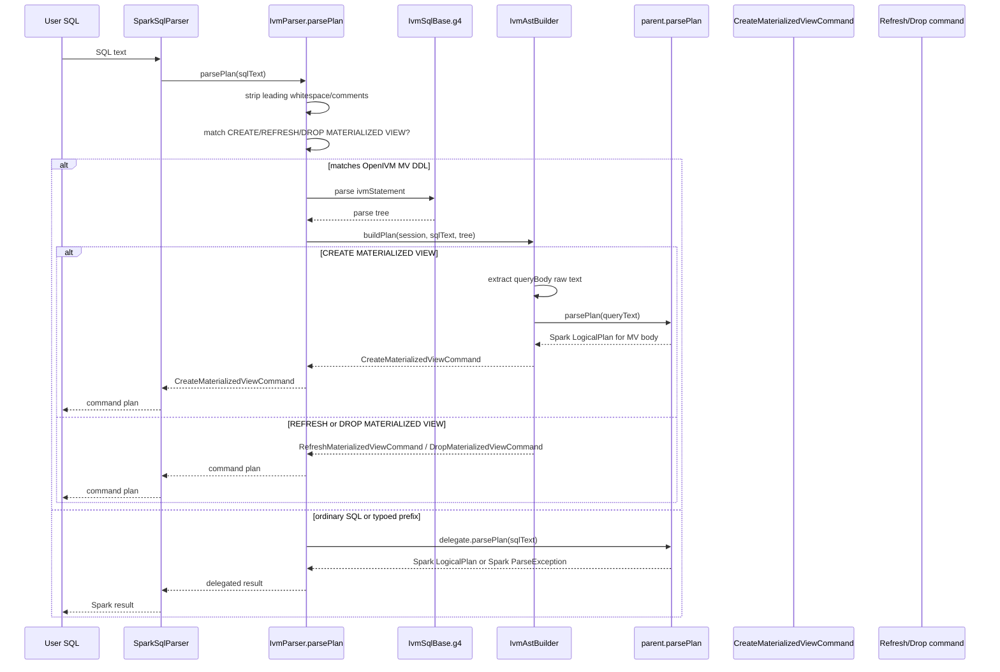

# IVM DDL parser and ANTLR4 grammar
This document explains the OpenIVM Spark parser layer for materialized-view DDL.
It covers the ANTLR grammar, the `IvmParser` wrapper, the raw-body reparse
trick, dialect constraints, build wiring, and parser examples.
Primary source files:
- `spark-ext/ivm-extension/src/main/antlr4/org/openivm/spark/parser/IvmSqlBase.g4`
- `spark-ext/ivm-extension/src/main/scala/org/openivm/spark/parser/IvmParser.scala`
- `spark-ext/ivm-extension/src/main/scala/org/openivm/spark/parser/IvmAstBuilder.scala`
- `spark-ext/ivm-extension/src/main/scala/org/openivm/spark/OpenIvmSparkExtensions.scala`
- `spark-ext/build.sbt`
- `spark-ext/project/Settings.scala`
- `spark-ext/project/Dependencies.scala`
The key design point is narrowness: OpenIVM does not fork Spark's SQL grammar.
It adds only `CREATE MATERIALIZED VIEW`, `REFRESH MATERIALIZED VIEW`, and
`DROP MATERIALIZED VIEW`. Everything else remains Spark SQL.

---

## 1. Full `IvmSqlBase.g4`
The full grammar file is reproduced below. Notice that it declares only the
OpenIVM DDL wrapper, not a full `SELECT` grammar.
```antlr
/*
 * Top-of-grammar ANTLR4 file for the OpenIVM Spark extension.
 *
 * Adds three productions to Spark's surface SQL:
 *
 *   CREATE MATERIALIZED VIEW <multipart_identifier>
 *     [USING <provider>] [<table_clauses>] AS <query>
 *
 *   REFRESH MATERIALIZED VIEW <multipart_identifier>
 *
 *   DROP MATERIALIZED VIEW [IF EXISTS] <multipart_identifier>
 *
 * The grammar is invoked only when `IvmParser.parsePlan` sees a statement
 * whose head matches one of the three forms above; otherwise the input is
 * delegated to Spark's own parser unchanged.
 *
 * Notes:
 *
 *  - `query` is captured as raw text (the `.+?` token pattern) and re-parsed
 *    via Spark's `ParserInterface.parseQuery(...)`. This means we automatically
 *    support every query construct Spark 3.5 can parse — including future
 *    additions — without re-stating Spark's full grammar here.
 *
 *  - Identifiers follow Spark's convention: dotted-multipart with optional
 *    backtick quoting per part. We deliberately do NOT support double-quoted
 *    identifiers (that's DuckDB syntax) — Spark backticks are the canonical
 *    quoting style.
 *
 *  - The reserved word `MATERIALIZED` does not exist in Spark 3.5's
 *    `SqlBaseParser.g4` (verified by RESEARCH.md §6.2), so introducing it as
 *    a keyword in this grammar has zero collision risk.
 */
grammar IvmSqlBase;

ivmStatement
    : createMaterializedView
    | refreshMaterializedView
    | dropMaterializedView
    ;

createMaterializedView
    : CREATE MATERIALIZED VIEW (IF NOT EXISTS)? multipartIdentifier
      (USING tableProvider=identifier)?
      (TBLPROPERTIES tableProperties)?
      (PARTITIONED BY '(' multipartIdentifier (',' multipartIdentifier)* ')')?
      AS queryBody
    ;

refreshMaterializedView
    : REFRESH MATERIALIZED VIEW multipartIdentifier
    ;

dropMaterializedView
    : DROP MATERIALIZED VIEW (IF EXISTS)? multipartIdentifier
    ;

queryBody
    : .+?
    ;

tableProperties
    : '(' tableProperty (',' tableProperty)* ')'
    ;

tableProperty
    : key=propertyKey EQ? value=propertyValue
    ;

propertyKey
    : identifier ( '.' identifier )*
    | STRING
    ;

propertyValue
    : INTEGER_VALUE
    | DECIMAL_VALUE
    | BOOLEAN_VALUE
    | STRING
    ;

multipartIdentifier
    : identifier ('.' identifier)*
    ;

identifier
    : IDENTIFIER
    | BACKQUOTED_IDENTIFIER
    | nonReserved
    ;

nonReserved
    : IF | NOT | EXISTS | USING | PARTITIONED | TBLPROPERTIES
    | AS  | BY  | DROP   | REFRESH
    ;

CREATE        : [Cc][Rr][Ee][Aa][Tt][Ee];
MATERIALIZED  : [Mm][Aa][Tt][Ee][Rr][Ii][Aa][Ll][Ii][Zz][Ee][Dd];
VIEW          : [Vv][Ii][Ee][Ww];
REFRESH       : [Rr][Ee][Ff][Rr][Ee][Ss][Hh];
DROP          : [Dd][Rr][Oo][Pp];
IF            : [Ii][Ff];
NOT           : [Nn][Oo][Tt];
EXISTS        : [Ee][Xx][Ii][Ss][Tt][Ss];
USING         : [Uu][Ss][Ii][Nn][Gg];
AS            : [Aa][Ss];
BY            : [Bb][Yy];
PARTITIONED   : [Pp][Aa][Rr][Tt][Ii][Tt][Ii][Oo][Nn][Ee][Dd];
TBLPROPERTIES : [Tt][Bb][Ll][Pp][Rr][Oo][Pp][Ee][Rr][Tt][Ii][Ee][Ss];

EQ            : '=' | '==';

INTEGER_VALUE : DIGIT+;
DECIMAL_VALUE : DIGIT+ '.' DIGIT* | '.' DIGIT+ | DIGIT+ ('.' DIGIT*)? [eE] [+-]? DIGIT+;
BOOLEAN_VALUE : [Tt][Rr][Uu][Ee] | [Ff][Aa][Ll][Ss][Ee];

IDENTIFIER             : (LETTER | '_') (LETTER | DIGIT | '_')*;
BACKQUOTED_IDENTIFIER  : '`' ( ~('`') | '``' )* '`';
STRING                 : '\'' ( ~('\'' | '\\') | ('\\' .) | '\'\'')* '\'';

fragment LETTER : [a-zA-Z];
fragment DIGIT  : [0-9];

SIMPLE_COMMENT : '--' ~[\r\n]* '\r'? '\n'? -> channel(HIDDEN);
BRACKETED_COMMENT : '/*' .*? '*/' -> channel(HIDDEN);
WS : [ \r\n\t]+ -> channel(HIDDEN);
```
The owned syntax is the DDL shell. Spark expressions, relations, joins,
aggregates, windows, CTEs, and scalar functions are intentionally outside this
ANTLR grammar.

---

## 2. Parser injection
`OpenIvmSparkExtensions` installs the parser wrapper through Spark's extension
API:
```scala
class OpenIvmSparkExtensions extends (SparkSessionExtensions => Unit) {
  override def apply(ext: SparkSessionExtensions): Unit = {
    ext.injectParser((session, parent) => new parser.IvmParser(session, parent))
    ext.injectResolutionRule(session => new analyzer.IvmDmlInterceptorRule(session))
    ext.injectPlannerStrategy(session => new analyzer.IvmStrategy(session))
  }
}
```
Spark passes the existing parser as `parent`. `IvmParser` wraps it and preserves
ordinary Spark behavior by delegating non-IVM SQL back to that parser.

---

## 3. `IvmParser` walkthrough
`IvmParser` is a Spark `ParserInterface` implementation:
```scala
class IvmParser(session: SparkSession, delegate: ParserInterface) extends ParserInterface {
```
Only `parsePlan` has custom logic:
```scala
override def parsePlan(sqlText: String): LogicalPlan =
  if (isIvmStatement(sqlText)) parseIvmStatement(sqlText)
  else delegate.parsePlan(sqlText)
```
All other parser methods delegate unchanged, so Spark still owns expressions,
identifiers, schemas, data types, multipart names, and standalone queries.

### 3.1 Statement matching
The matcher first strips leading whitespace and SQL comments:
```scala
val LeadingJunk: Pattern = Pattern.compile(
  "\\A(?:\\s+|--[^\\n]*(?:\\n|\\z)|/\\*.*?\\*/)+",
  Pattern.DOTALL
)
```
It then looks for exactly the supported MV DDL heads:
```scala
val IvmKeyword: Pattern = Pattern.compile(
  "\\A(?:create|refresh|drop)\\s+materialized\\s+view\\b",
  Pattern.CASE_INSENSITIVE
)
```
The routing helper is:
```scala
private def isIvmStatement(sqlText: String): Boolean = {
  val m        = IvmParser.LeadingJunk.matcher(sqlText)
  val stripped = if (m.find()) sqlText.substring(m.end()) else sqlText
  IvmParser.IvmKeyword.matcher(stripped).find()
}
```
So these are intercepted:
```sql
CREATE MATERIALIZED VIEW mv AS SELECT 1
refresh materialized view mv
/* comment */ DROP MATERIALIZED VIEW IF EXISTS mv
```
But typoed or unrelated SQL is delegated to Spark:
```sql
CREATE MATERIALIZD VIEW mv AS SELECT 1
ALTER MATERIALIZED VIEW mv RENAME TO mv2
SELECT 1
```

### 3.2 ANTLR parse and error surface
For a matching statement, `parseIvmStatement` constructs the generated lexer and
parser:
```scala
val inputStream = CharStreams.fromString(sqlText)
val lexer = new IvmSqlBaseLexer(inputStream)
lexer.removeErrorListeners()

val tokenStream = new CommonTokenStream(lexer)
val parser      = new IvmSqlBaseParser(tokenStream)
parser.removeErrorListeners()
```
It records the first ANTLR syntax error and wraps it in Spark's `ParseException`:
```scala
var parseError: Option[String] = None
parser.addErrorListener(new BaseErrorListener {
  override def syntaxError(
      recognizer: Recognizer[_, _],
      offendingSymbol: AnyRef,
      line: Int,
      charPositionInLine: Int,
      msg: String,
      e: RecognitionException
  ): Unit =
    if (parseError.isEmpty)
      parseError = Some(s"$msg (line $line, pos $charPositionInLine)")
})

val tree = parser.ivmStatement()

parseError match {
  case Some(errorMsg) =>
    throw new ParseException(Some(sqlText), errorMsg, Origin(), Origin())
  case None =>
    IvmAstBuilder.buildPlan(session, sqlText, tree)
}
```
The result is a Catalyst `LogicalPlan`, specifically one of the OpenIVM command
plans for valid MV DDL.

---

## 4. Critical re-parse trick
The grammar rule for the MV body is:
```antlr
queryBody
    : .+?
    ;
```
That rule captures raw text after `AS`. The OpenIVM grammar does not parse the
`SELECT` body.
`IvmAstBuilder` extracts the original character range from the ANTLR stream:
```scala
private def extractQueryBody(ctx: IvmSqlBaseParser.QueryBodyContext): String = {
  val startIdx = ctx.start.getStartIndex
  val stopIdx  = ctx.stop.getStopIndex
  ctx.start.getInputStream.getText(new Interval(startIdx, stopIdx))
}
```
Then the create visitor reparses the body with Spark:
```scala
override def visitCreateMaterializedView(
    ctx: IvmSqlBaseParser.CreateMaterializedViewContext
): AnyRef = {
  val name        = toTableIdentifier(ctx.multipartIdentifier(0))
  val ifNotExists = ctx.IF() != null
  val provider =
    if (ctx.USING() != null) Some(identifierText(ctx.tableProvider)) else None
  val properties =
    if (ctx.tableProperties() != null) buildProperties(ctx.tableProperties())
    else Map.empty[String, String]
  val queryText = extractQueryBody(ctx.queryBody())
  val queryPlan = session.sessionState.sqlParser.parsePlan(queryText)
  CreateMaterializedViewCommand(name, queryPlan, properties, ifNotExists, provider, queryText)
}
```
The critical line is:
```scala
val queryPlan = session.sessionState.sqlParser.parsePlan(queryText)
```
For this statement:
```sql
CREATE MATERIALIZED VIEW mv AS SELECT id, amount FROM sales WHERE amount > 0
```
OpenIVM captures and reparses only:
```sql
SELECT id, amount FROM sales WHERE amount > 0
```
Consequences:
- Spark dialect rules apply to the MV body.
- Spark parse errors in the body surface during `CREATE MATERIALIZED VIEW` parsing.
- OpenIVM does not need to mirror Spark's large SQL grammar.
- Future Spark parser support can become available without changing `IvmSqlBase.g4`.

---

## 5. Intersection-of-dialects constraint
The MV body must parse in **both** Spark and DuckDB:
1. Spark parses the body into a Catalyst plan during `CREATE MATERIALIZED VIEW`.
2. OpenIVM later compiles refresh through DuckDB.
Use only the intersection of both dialects.

### Double-quoted identifiers
DuckDB accepts double-quoted identifiers:
```sql
SELECT "region" FROM sales
```
Spark SQL uses backticks for quoted identifiers:
```sql
SELECT `region` FROM sales
```
Portable guidance: prefer unquoted identifiers; use Spark backticks only when
necessary; do not use double quotes in MV bodies.

### Struct extraction
DuckDB-style extraction:
```sql
SELECT STRUCT_EXTRACT(s, 'k') AS k FROM t
```
Spark-style extraction:
```sql
SELECT s.k AS k FROM t
```
A supported MV body must be accepted by both engines, so avoid committing to a
syntax that only one engine understands.

### `TIMESTAMP WITH TIME ZONE`
Avoid:
```sql
SELECT CAST(ts AS TIMESTAMP WITH TIME ZONE) AS tsz FROM events
```
Use timestamp forms already exercised by the Spark/DuckDB parity tests instead.

### Single vs double `=`
The DDL grammar accepts `=` and `==` only for `TBLPROPERTIES` pairs:
```antlr
EQ            : '=' | '==';
```
Inside the MV body, use standard SQL equality:
```sql
SELECT id FROM t WHERE id = 1
```
Do not rely on non-standard equality spellings for portable MV bodies:
```sql
SELECT id FROM t WHERE id == 1
```

---

## 6. Unsupported grammar features
The following are deliberate non-goals for `IvmSqlBase.g4`.

### `REFRESH EVERY`
Not supported:
```sql
CREATE MATERIALIZED VIEW mv REFRESH EVERY 1 HOUR AS SELECT * FROM t
```
OpenIVM supports explicit refresh:
```sql
REFRESH MATERIALIZED VIEW mv
```

### `ALTER MATERIALIZED VIEW`
Not supported:
```sql
ALTER MATERIALIZED VIEW mv RENAME TO mv2
```
The head is not one of the three intercepted prefixes, so it is delegated to
Spark and rejected there.

### MV with column list
Not supported:
```sql
CREATE MATERIALIZED VIEW mv(a, b) AS SELECT a, b FROM t
```
The grammar expects the MV name followed by optional `USING`, `TBLPROPERTIES`,
`PARTITIONED BY`, and then `AS`; it has no column-list production.

### Table-valued function MV bodies
Not part of the supported MV-body contract:
```sql
CREATE MATERIALIZED VIEW mv AS
SELECT * FROM TABLE(some_table_function(1, 2))
```
The raw-body rule may capture the text, but Spark, DuckDB, and OpenIVM refresh
classification must all accept the query. TVF-style bodies are outside the
supported surface.

---

## 7. ANTLR build wiring and shading
In this snapshot, ANTLR settings are inline in `spark-ext/build.sbt`; there is
no separate `antlr4Settings` helper in `project/Settings.scala`.
```scala
lazy val ivmExtension = (project in file("ivm-extension"))
  .dependsOn(ivmCompiler % "compile->compile;test->test")
  .enablePlugins(Antlr4Plugin)
  .settings(commonSettings: _*)
  .settings(assemblySettings: _*)
  .settings(libraryDependencies ++= Dependencies.extension)
  .settings(
    Antlr4 / antlr4PackageName := Some("org.openivm.spark.parser.gen"),
    Antlr4 / antlr4Version     := antlrV,
    Antlr4 / antlr4GenListener := true,
    Antlr4 / antlr4GenVisitor  := true
  )
```
The sbt plugin is declared in `spark-ext/project/plugins.sbt`:
```scala
addSbtPlugin("com.simplytyped" % "sbt-antlr4"    % "0.8.3")
```
The runtime dependency is pinned in `spark-ext/project/Dependencies.scala`:
```scala
val antlrV = "4.9.3"
val antlr  = "org.antlr" % "antlr4-runtime" % antlrV
```
The generated package is `org.openivm.spark.parser.gen`, which is why the
parser imports generated classes from that package:
```scala
import org.openivm.spark.parser.gen.IvmSqlBaseLexer
import org.openivm.spark.parser.gen.IvmSqlBaseParser
```
Shading is in `project/Settings.scala` under `assemblySettings`:
```scala
assembly / assemblyShadeRules := Seq(
  ShadeRule.rename("org.duckdb.**" -> "org.openivm.shaded.duckdb.@1").inAll,
  ShadeRule.rename("org.antlr.v4.runtime.**" -> "org.openivm.shaded.antlr.@1").inAll
)
```
The ANTLR relocation hides `org.antlr.v4.runtime.**` under
`org.openivm.shaded.antlr.**`, avoiding collisions with Spark's bundled parser
runtime.

---

## 8. Demo: successful statements
These examples match tests in `IvmParserSpec`, `ParserCreateSpec`, and
`ParserPassthroughSpec`.

### Simple create
```sql
CREATE MATERIALIZED VIEW mv_simple AS SELECT 1 AS x
```
Result: `CreateMaterializedViewCommand`. The body is reparsed by Spark as
`SELECT 1 AS x`.

### Create with provider and properties
```sql
CREATE MATERIALIZED VIEW IF NOT EXISTS cat.db.mv_sales
USING DELTA
TBLPROPERTIES('owner'='openivm', 'enabled'=true)
AS SELECT region, sum(amount) AS sum_amount FROM sales GROUP BY region
```
Result: `CreateMaterializedViewCommand` with `ifNotExists = true`, provider
`DELTA`, parsed properties, and a Spark aggregate plan for the body.

### Refresh
```sql
REFRESH MATERIALIZED VIEW mv_sales
```
Result: `RefreshMaterializedViewCommand`.

### Drop
```sql
DROP MATERIALIZED VIEW IF EXISTS mv_sales
```
Result: `DropMaterializedViewCommand` with `ifExists = true`.

---

## 9. Demo: failing statements
The existing tests assert `ParseException` for malformed DDL. Exact text can
vary with Spark/ANTLR versions, but these are the expected failure shapes.

### Missing `AS`
```sql
CREATE MATERIALIZED VIEW mv_no_as SELECT region FROM sales
```
Failure: OpenIVM intercepts the prefix, parses the MV name, then expects
optional clauses and `AS`; `SELECT` appears instead.
Typical shape:
```text
ParseException: mismatched input 'SELECT' expecting ... AS ...
```

### Missing real MV name
```sql
CREATE MATERIALIZED VIEW AS SELECT region FROM sales
```
Failure: the grammar requires a `multipartIdentifier` after `VIEW`, so this is
malformed OpenIVM DDL and raises `ParseException` before execution.

### MV with column list
```sql
CREATE MATERIALIZED VIEW mv_cols(a, b) AS SELECT a, b FROM t
```
Failure: `(` is not valid after the MV name in this grammar.
Typical shape:
```text
ParseException: mismatched input '(' expecting ... AS ...
```

### DuckDB-only body syntax
```sql
CREATE MATERIALIZED VIEW mv_bad_body AS
SELECT STRUCT_EXTRACT(s, 'k') AS k FROM t
```
Failure: the body violates the supported intersection-of-dialects contract.
Depending on which component sees it first, the user may get a Spark parse or
analysis error, or a later OpenIVM/DuckDB compile error.

---

## 10. Sequence diagram


---

## 11. Practical authoring rules
Use only the supported DDL forms:
```sql
CREATE MATERIALIZED VIEW mv AS SELECT ...
REFRESH MATERIALIZED VIEW mv
DROP MATERIALIZED VIEW mv
```
Use Spark identifier conventions in the DDL wrapper:
```sql
CREATE MATERIALIZED VIEW `mv-with-dash` AS SELECT id FROM t
```
Write MV bodies in the Spark/DuckDB intersection. Avoid double-quoted
identifiers, `STRUCT_EXTRACT(s,'k')`, `TIMESTAMP WITH TIME ZONE`, non-standard
equality spellings, `REFRESH EVERY`, `ALTER MATERIALIZED VIEW`, MV column lists,
and table-valued function bodies. If SQL is not one of the three MV DDL prefixes,
OpenIVM delegates it to Spark unchanged.
