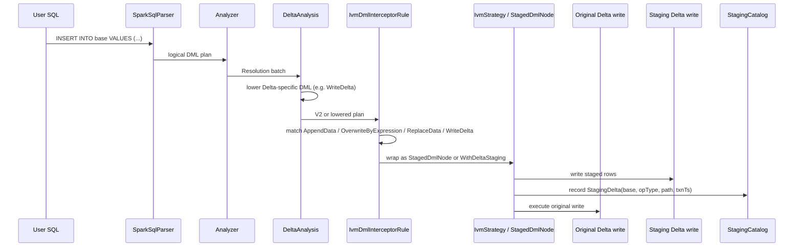

# 3. DML interception and staging tee

This document explains the Spark-side delta-capture layer used by openivm-spark.
It is the replacement for Delta Change Data Feed (CDF): instead of asking Delta
for row changes later, openivm-spark tees each relevant DML into explicit Delta
staging and records that staging path in RocksDB.

Core invariant:

> Every DML against a base table that has at least one materialized view must be
> represented as a per-`(base_table, op_type, txn_ts)` staging delta before the
> refresh path can consume it.

The implementation spans:

1. `IvmDmlInterceptorRule`: recognizes DML logical plans.
2. `StagedDmlNode`: current runnable wrapper emitted by the rule.
3. `WithDeltaStaging` + `IvmStrategy` + `DeltaStagingExec`: planner lowering path
   for a logical staging marker.
4. `StagingCatalog`: RocksDB-backed index of pending staging deltas.
5. `StagingDeltaView`: turns pending deltas into `openivm_delta_<source>` views.

---

## 3.1 Role: delta capture without Delta CDF

A captured change is represented by `StagingDelta`:

```scala
final case class StagingDelta(
    baseTable: String,
    opType: String,
    stagingPath: String,
    txnTs: Timestamp,
    consumedBy: Seq[String]
)
```

Citation: `spark-ext/ivm-common/src/main/scala/org/openivm/spark/common/StagingCatalog.scala:21-27`.

For a tracked base table, the interceptor writes the relevant row image to a
Delta staging path and records:

```text
(base_table, op_type, txn_ts) -> staging_path
```

The refresh command later calls `StagingCatalog.collectFor`, builds a signed
`openivm_delta_<source>` temp view, runs the OpenIVM-compiled refresh SQL, and
marks the staging paths consumed. This makes Delta CDF unnecessary.

The rule is active only when:

- `spark.openivm.enabled` is true;
- `IvmDmlInterceptorRule.bypass` is false;
- the plan is not already wrapped;
- `MvCatalog.viewsForSource(session, tableName).nonEmpty`.

Citations: `IvmDmlInterceptorRule.scala:40-43` and `IvmDmlInterceptorRule.scala:246-268`.

---

## 3.2 Registration and why ordering matters

OpenIVM registers one parser, one resolution rule, and one planner strategy:

```scala
class OpenIvmSparkExtensions extends (SparkSessionExtensions => Unit) {
  override def apply(ext: SparkSessionExtensions): Unit = {
    ext.injectParser((session, parent) => new parser.IvmParser(session, parent))
    ext.injectResolutionRule(session => new analyzer.IvmDmlInterceptorRule(session))
    ext.injectPlannerStrategy(session => new analyzer.IvmStrategy(session))
  }
}
```

Citation: `spark-ext/ivm-extension/src/main/scala/org/openivm/spark/OpenIvmSparkExtensions.scala:25-31`.

`IvmDmlInterceptorRule` documents the critical ordering:

```scala
* Registered via `injectResolutionRule`.  Delta's `DeltaAnalysis` fires in the
* same "Resolution" batch.  Because Delta is registered before openivm-spark,
* Delta's rules run first in each pass:
*   - `AppendData` / `OverwriteByExpression` are NOT lowered by Delta → our
*     rule sees them directly and wraps their query child with [[WithDeltaStaging]].
*   - `DeleteFromTable` → `ReplaceData`, `UpdateTable` → `ReplaceData`,
*     `MergeIntoTable` → `WriteDelta` before our rule fires → our rule matches
*     the Delta-lowered forms and wraps them in [[StagedDmlNode]].
```

Citation: `IvmDmlInterceptorRule.scala:20-28`.

Therefore the rule must match both:

- V2 forms that can remain visible: `AppendData`, `OverwriteByExpression`;
- Delta-lowered forms: `ReplaceData`, `WriteDelta`;
- Delta-native parsed forms: `DeltaDelete`, `DeltaUpdateTable`, `DeltaMergeInto`;
- Spark-standard fallbacks: `DeleteFromTable`, `UpdateTable`, `MergeIntoTable`.

If OpenIVM matched only the original Spark V2 syntax, `DELETE`, `UPDATE`, and
`MERGE` would be missed after DeltaAnalysis had lowered them.

---

## 3.3 `IvmDmlInterceptorRule.apply` method

Source: `spark-ext/ivm-extension/src/main/scala/org/openivm/spark/analyzer/IvmDmlInterceptorRule.scala:40-226`.

```scala
override def apply(plan: LogicalPlan): LogicalPlan = {
  if (!FeatureGate.enabled(session) || IvmDmlInterceptorRule.bypass.get()) return plan
  if (alreadyWrapped(plan)) return plan

  plan match {
    case a: AppendData =>
      val tableName = extractTableName(a.table)
      if (tableName.isEmpty || !hasDependentMvs(tableName)) a
      else {
        val sp  = stagingPath(tableName, "INSERT")
        val ops = Seq((a.query, sp, "INSERT"))
        StagedDmlNode(a, ops, tableName)
      }

    case o: OverwriteByExpression =>
      val tableName = extractTableName(o.table)
      if (tableName.isEmpty || !hasDependentMvs(tableName)) o
      else {
        val sp  = stagingPath(tableName, "OVERWRITE")
        val ops = Seq((o.query, sp, "OVERWRITE"))
        StagedDmlNode(o, ops, tableName)
      }

    case d: DeltaDelete =>
      val tableName = extractTableName(d.child)
      if (tableName.isEmpty || !hasDependentMvs(tableName)) d
      else {
        val cond                     = d.condition.getOrElse(Literal(true))
        val deletedPlan: LogicalPlan = Filter(cond, d.child)
        val ops                      = Seq((deletedPlan, stagingPath(tableName, "DELETE"), "DELETE"))
        StagedDmlNode(d, ops, tableName)
      }

    case u: DeltaUpdateTable =>
      val tableName = extractTableName(u.child)
      if (tableName.isEmpty || !hasDependentMvs(tableName)) u
      else {
        val filteredPlan: LogicalPlan =
          u.condition.map(c => Filter(c, u.child)).getOrElse(u.child)
        val beforePlan: LogicalPlan = filteredPlan
        val assignMap: Map[String, Expression] =
          u.updateColumns
            .zip(u.updateExpressions)
            .flatMap { case (colExpr, valueExpr) =>
              DeltaUpdateTable
                .getTargetColNameParts(colExpr)
                .headOption
                .map(_.toLowerCase -> valueExpr)
            }
            .toMap
        val afterProjections = filteredPlan.output.map { attr =>
          assignMap.get(attr.name.toLowerCase) match {
            case Some(newValue) => Alias(newValue, attr.name)()
            case None           => attr
          }
        }
        val afterPlan: LogicalPlan = Project(afterProjections, filteredPlan)
        val preOps = Seq(
          (beforePlan, stagingPath(tableName, "UPDATE_BEFORE"), "UPDATE_BEFORE"),
          (afterPlan, stagingPath(tableName, "UPDATE_AFTER"), "UPDATE_AFTER")
        )
        StagedDmlNode(u, preOps, tableName)
      }

    case m: DeltaMergeInto =>
      val tableName = extractTableName(m.target)
      if (tableName.isEmpty || !hasDependentMvs(tableName)) m
      else {
        val ops = Seq((m.source, stagingPath(tableName, "MERGE_SRC"), "MERGE_SRC"))
        StagedDmlNode(m, ops, tableName)
      }

    case r: ReplaceData =>
      val tableName = extractTableName(r.originalTable)
      if (tableName.isEmpty || !hasDependentMvs(tableName)) r
      else {
        val ops = if (isUpdateReplaceData(r)) {
          val beforePlan: LogicalPlan = Filter(r.condition, r.originalTable)
          val afterPlan: LogicalPlan  = r.query
          Seq(
            (beforePlan, stagingPath(tableName, "UPDATE_BEFORE"), "UPDATE_BEFORE"),
            (afterPlan, stagingPath(tableName, "UPDATE_AFTER"), "UPDATE_AFTER")
          )
        } else {
          val deletedPlan: LogicalPlan = Filter(r.condition, r.originalTable)
          Seq((deletedPlan, stagingPath(tableName, "DELETE"), "DELETE"))
        }
        StagedDmlNode(r, ops, tableName)
      }

    case w: WriteDelta =>
      val tableName = extractTableName(w.originalTable)
      if (tableName.isEmpty || !hasDependentMvs(tableName)) w
      else {
        val ops = Seq((w.query, stagingPath(tableName, "MERGE_SRC"), "MERGE_SRC"))
        StagedDmlNode(w, ops, tableName)
      }

    case d: DeleteFromTable =>
      val tableName = extractTableName(d.table)
      if (tableName.isEmpty || !hasDependentMvs(tableName)) d
      else {
        val deletedPlan: LogicalPlan = Filter(d.condition, d.table)
        val ops                      = Seq((deletedPlan, stagingPath(tableName, "DELETE"), "DELETE"))
        StagedDmlNode(d, ops, tableName)
      }

    case u: UpdateTable =>
      val tableName = extractTableName(u.table)
      if (tableName.isEmpty || !hasDependentMvs(tableName)) u
      else {
        val filteredPlan: LogicalPlan =
          u.condition.map(c => Filter(c, u.table)).getOrElse(u.table)
        val beforePlan: LogicalPlan = filteredPlan
        val assignMap: Map[String, Expression] = u.assignments.collect { case Assignment(attr: Attribute, value) =>
          attr.name.toLowerCase -> value
        }.toMap
        val afterProjections = filteredPlan.output.map { attr =>
          assignMap.get(attr.name.toLowerCase) match {
            case Some(newValue) => Alias(newValue, attr.name)()
            case None           => attr
          }
        }
        val afterPlan: LogicalPlan = Project(afterProjections, filteredPlan)
        val preOps = Seq(
          (beforePlan, stagingPath(tableName, "UPDATE_BEFORE"), "UPDATE_BEFORE"),
          (afterPlan, stagingPath(tableName, "UPDATE_AFTER"), "UPDATE_AFTER")
        )
        StagedDmlNode(u, preOps, tableName)
      }

    case m: MergeIntoTable =>
      val tableName = extractTableName(m.targetTable)
      if (tableName.isEmpty || !hasDependentMvs(tableName)) m
      else {
        val ops = Seq((m.sourceTable, stagingPath(tableName, "MERGE_SRC"), "MERGE_SRC"))
        StagedDmlNode(m, ops, tableName)
      }

    case _ => plan
  }
}
```

---

## 3.4 `apply` walkthrough

| Lines | Walkthrough |
|---:|---|
| 40 | Entry point for the Catalyst rule. |
| 41 | Feature gate and bypass guard; bypass prevents recursion when staged commands execute their original DML. |
| 42 | Double-wrap guard using `alreadyWrapped`. |
| 44 | Begins matching the current logical node. |
| 49-56 | `AppendData`: stages the input query as `INSERT`. |
| 61-68 | `OverwriteByExpression`: stages replacement rows as `OVERWRITE`. |
| 73-80 | `DeltaDelete`: stages `Filter(condition, child)` as `DELETE`. |
| 86-129 | `DeltaUpdateTable`: builds old-row and new-row plans. |
| 105-107 | `filteredPlan` captures rows matching the update predicate before mutation. |
| 108-117 | Builds a SET-assignment map from Delta update columns and expressions. |
| 118-124 | Projects the after image, preserving unchanged columns. |
| 125-128 | Emits `UPDATE_BEFORE` and `UPDATE_AFTER`. |
| 135-140 | `DeltaMergeInto`: stages the source as `MERGE_SRC`. |
| 147-163 | `ReplaceData`: Delta-lowered delete/update fallback. |
| 151-157 | Update-shaped `ReplaceData` emits before and after images. |
| 159-160 | Delete-shaped `ReplaceData` emits removed rows. |
| 165-170 | `WriteDelta`: Delta-lowered merge fallback, staged as `MERGE_SRC`. |
| 176-182 | Spark-standard delete fallback. |
| 185-213 | Spark-standard update fallback. |
| 216-221 | Spark-standard merge fallback. |
| 224 | All unrelated plans pass through unchanged. |

Related helpers:

- `isUpdateReplaceData`: `IvmDmlInterceptorRule.scala:232-241`.
- `alreadyWrapped`: `IvmDmlInterceptorRule.scala:243-244`.
- `hasDependentMvs`: `IvmDmlInterceptorRule.scala:246-268`.
- `extractTableName`: `IvmDmlInterceptorRule.scala:270-281`.
- `stagingPath`: `IvmDmlInterceptorRule.scala:283-290`.

---

## 3.5 `WithDeltaStaging`

Definition from `spark-ext/ivm-extension/src/main/scala/org/openivm/spark/analyzer/WithDeltaStaging.scala:19-28`:

```scala
case class WithDeltaStaging(
    child: LogicalPlan,
    stagingPath: String,
    opType: String,
    baseTable: String
) extends UnaryNode {
  override def output: Seq[Attribute] = child.output
  override protected def withNewChildInternal(newChild: LogicalPlan): WithDeltaStaging =
    copy(child = newChild)
}
```

It is a unary logical marker around the original data-bearing child. The output
is exactly `child.output`, so the parent write sees the same columns. The class
comment identifies its physical counterpart as `DeltaStagingExec` and calls out
`AppendData` / `OverwriteByExpression` as the intended V2 write commands.
Citation: `WithDeltaStaging.scala:6-17`.

Current-state note: the `apply` method shown above currently returns
`StagedDmlNode` for the direct `AppendData` and `OverwriteByExpression` cases
at `IvmDmlInterceptorRule.scala:55` and `IvmDmlInterceptorRule.scala:67`.
`WithDeltaStaging` remains the logical marker that `IvmStrategy` knows how to
lower when such a node is present.

---

## 3.6 `IvmStrategy` and physical tee execution

Source: `spark-ext/ivm-extension/src/main/scala/org/openivm/spark/analyzer/IvmStrategy.scala:15-21`.

```scala
class IvmStrategy(session: SparkSession) extends Strategy {
  override def apply(plan: LogicalPlan): Seq[SparkPlan] = plan match {
    case WithDeltaStaging(child, stagingPath, opType, baseTable) =>
      DeltaStagingExec(planLater(child), stagingPath, opType, baseTable) :: Nil
    case _ => Nil
  }
}
```

The strategy recognizes only `WithDeltaStaging`. It plans the original child
later, wraps it in `DeltaStagingExec`, and returns no plans for other nodes.

`DeltaStagingExec` is defined at `DeltaStagingExec.scala:32-37`:

```scala
case class DeltaStagingExec(
    child: SparkPlan,
    stagingPath: String,
    opType: String,
    baseTable: String
) extends UnaryExecNode
```

Its `doExecute` method performs both sides of the tee:

1. execute `child` and cache the RDD;
2. convert `InternalRow` values to external `Row` values;
3. write those rows to `stagingPath` as a Delta table in append mode;
4. call `StagingCatalog.record` with `baseTable`, `opType`, `stagingPath`, and a timestamp;
5. return the cached RDD so the parent Delta write consumes the original rows.

Citations: `DeltaStagingExec.scala:44-77`, with the catalog record at lines 64-74.

Current `StagedDmlNode` execution follows the same fail-safe idea for all DML
branches emitted by `IvmDmlInterceptorRule`: write pre-DML staging, execute the
original DML with bypass enabled, then write any post-DML staging. Citation:
`StagedDmlNode.scala:43-59`. Its writer records `StagingDelta` at
`StagedDmlNode.scala:81-91`.

---

## 3.7 The seven `opType` values

Vocabulary source: `StagingCatalog.scala:54-69`.

```scala
object OpTypes {
  val Insert       = "INSERT"
  val Delete       = "DELETE"
  val UpdateBefore = "UPDATE_BEFORE"
  val UpdateAfter  = "UPDATE_AFTER"
  val MergeSrc     = "MERGE_SRC"
  val Overwrite    = "OVERWRITE"
  val MvViewDelta = "MV_VIEW_DELTA"
}
```

| opType | Triggered by | Staging shape | Exact emitter |
|---|---|---|---|
| `INSERT` | `AppendData` / `INSERT INTO` | rows to add | `IvmDmlInterceptorRule.scala:49-55`; recorded by `StagedDmlNode.scala:84-90`. |
| `DELETE` | `DELETE FROM` | rows to remove | `DeltaDelete` at `IvmDmlInterceptorRule.scala:73-80`; `ReplaceData` delete fallback at `147-162`; Spark fallback at `176-182`. |
| `UPDATE_BEFORE` | `UPDATE` before-image | old rows matching the predicate | `DeltaUpdateTable` at `IvmDmlInterceptorRule.scala:105-127`; `ReplaceData` update fallback at `151-157`; Spark fallback at `196-211`. |
| `UPDATE_AFTER` | `UPDATE` after-image | rows after SET projections | `DeltaUpdateTable` at `IvmDmlInterceptorRule.scala:118-128`; `ReplaceData` update fallback at `151-157`; Spark fallback at `202-212`. |
| `MERGE_SRC` | `MERGE INTO` source side | source rows available to the merge | `DeltaMergeInto` at `IvmDmlInterceptorRule.scala:135-140`; `WriteDelta` at `165-170`; Spark fallback at `216-221`. |
| `OVERWRITE` | `OverwriteByExpression` / `INSERT OVERWRITE` | full replacement row set | `IvmDmlInterceptorRule.scala:61-67`; synthetic non-cascade trigger also uses `Overwrite` at `MaterializedViewCommands.scala:1303-1311`. |
| `MV_VIEW_DELTA` | MV-over-MV cascade | upstream MV delta with signed multiplicity | `MaterializedViewCommands.scala:1107-1154`, especially `1144-1153`. |

`StagingDeltaView` maps these to refresh-time multiplicities:

- `MV_VIEW_DELTA`: preserve existing `openivm_multiplicity` (`StagingDeltaView.scala:65-70`);
- `INSERT`, `OVERWRITE`, `UPDATE_AFTER`: synthesize `+1` (`StagingDeltaView.scala:72-77`);
- `DELETE`, `UPDATE_BEFORE`: synthesize `-1` (`StagingDeltaView.scala:79-84`);
- `MERGE_SRC`: currently unsupported by that builder and falls through to `None` (`StagingDeltaView.scala:86-88`).

---

## 3.8 Staging paths and catalog paths

The current Delta row-staging path is generated in `IvmDmlInterceptorRule.scala:283-290`:

```scala
private def stagingPath(tableName: String, opType: String): String = {
  val warehouse = session.conf.get("spark.sql.warehouse.dir").stripSuffix("/")
  val safeTable = tableName.replace(".", "_").replace(" ", "_")
  val txnTs = DateTimeFormatter
    .ofPattern("yyyy-MM-dd'T'HH-mm-ss.SSS'Z'")
    .withZone(ZoneOffset.UTC)
    .format(Instant.now())
  s"$warehouse/_ivm/staging/$safeTable/$opType/$txnTs"
}
```

So the current row data path is:

```text
<warehouse>/_ivm/staging/<db_table>/<opType>/<txnTs>
```

The per-base RocksDB catalog path uses `_openivm/tables` and a base64url table
segment:

```scala
private def baseTableDbPath(spark: SparkSession, baseTable: String): String =
  Paths
    .get(warehouseDir(spark), "_openivm", "tables", RocksDBCodec.safePathSegment(baseTable), "rocksdb")
    .toString
```

Citation: `StagingCatalog.scala:90-93`.

`safePathSegment` is:

```scala
def safePathSegment(name: String): String =
  Base64.getUrlEncoder.withoutPadding.encodeToString(utf8(name))
```

Citation: `RocksDBCodec.scala:122-123`.

Therefore the per-base catalog namespace is:

```text
<warehouse>/_openivm/tables/<base64url(db.table)>/rocksdb
```

Some diagrams describe the desired per-base row-staging layout as:

```text
<warehouse>/_openivm/tables/<base64url(db.table)>/staging/<opType>/<txnTs>/
```

The code citations above show the current split: RocksDB catalog state lives
under `_openivm/tables/<base64url>/rocksdb`, while intercepted row Delta files
are still written under `_ivm/staging/<db_table>/<opType>/<txnTs>`.

---

## 3.9 `StagingCatalog.ensureTables` and RocksDB schema

Column-family groups are declared in `StagingCatalog.scala:75-78`:

```scala
private val IndexDbColumnFamilies = Seq("mv_index", "source_to_mvs", "table_index")
private val MvDbColumnFamilies    = Seq("meta", "properties", "consumed")
private val BaseDbColumnFamilies  = Seq("staging")
```

`ensureTables` opens the shared index DB:

```scala
def ensureTables(spark: SparkSession): Unit = {
  openIndexDb(spark)
  ()
}
```

Citation: `StagingCatalog.scala:147-150`.

The per-base DB is opened lazily by `record` through `openBaseTableDb`, using
only the `staging` CF. Citation: `StagingCatalog.scala:101-102`.

`record` writes this key/value pair to the per-base `staging` CF:

```scala
val stagingKey = RocksDBCodec.compositeKey(
  Seq(RocksDBCodec.encodeLongBE(delta.txnTs.getTime), RocksDBCodec.utf8(delta.stagingPath))
)
val stagingValue = RocksDBCodec.compositeKey(Seq(RocksDBCodec.utf8(delta.opType)))
```

Citation: `StagingCatalog.scala:152-160`; the put is at `StagingCatalog.scala:165-167`.

Decoded schema:

| Location | Key | Value |
|---|---|---|
| per-base RocksDB, `staging` CF | composite `(txnTsMillis: Long big-endian, stagingPath: UTF-8)` | composite `(opType: UTF-8)` |

The index DB's `table_index` CF maps `baseTable -> baseDbPath`, written at
`StagingCatalog.scala:169-180`.

Reads decode the same schema via `decodeStagingKey` and `decodeOpType` at
`StagingCatalog.scala:116-126`, then `collectFor` returns sorted pending
`StagingDelta` rows at `StagingCatalog.scala:207-248`.

---

## 3.10 Decoded TPC-DI example

First ten directories under the local benchmark result path:

```text
/home/mdrrahman/openivm-spark/.temp/ivm-bench/mount/results/3/spark-openivm/_openivm/tables/
```

Each name is base64url without padding, matching `RocksDBCodec.safePathSegment`.

| # | Directory | Decoded base table |
|---:|---|---|
| 1 | `YnJvbnplLmJyb2tlcmFnZV90cmFkZQ` | `bronze.brokerage_trade` |
| 2 | `YnJvbnplLmJyb2tlcmFnZV93YXRjaF9oaXN0b3J5` | `bronze.brokerage_watch_history` |
| 3 | `YnJvbnplLmJyb2tlcmFnZV9jYXNoX3RyYW5zYWN0aW9u` | `bronze.brokerage_cash_transaction` |
| 4 | `YnJvbnplLmJyb2tlcmFnZV9kYWlseV9tYXJrZXQ` | `bronze.brokerage_daily_market` |
| 5 | `YnJvbnplLmJyb2tlcmFnZV9ob2xkaW5nX2hpc3Rvcnk` | `bronze.brokerage_holding_history` |
| 6 | `YnJvbnplLmNybV9jdXN0b21lcl9tZ210` | `bronze.crm_customer_mgmt` |
| 7 | `YnJvbnplLnN5bmRpY2F0ZWRfcHJvc3BlY3Q` | `bronze.syndicated_prospect` |
| 8 | `Z29sZC5kaW1fY3VzdG9tZXI` | `gold.dim_customer` |
| 9 | `Z29sZC5kaW1fYWNjb3VudA` | `gold.dim_account` |
| 10 | `Z29sZC5kaW1fc2VjdXJpdHk` | `gold.dim_security` |

Decoder:

```python
import base64
padded = segment + "=" * ((4 - len(segment) % 4) % 4)
base_table = base64.urlsafe_b64decode(padded.encode()).decode()
```

---

## 3.11 Sequence diagram



Text form:

```text
INSERT INTO base VALUES (...)
  → SparkSqlParser
  → Analyzer
  → DeltaAnalysis (lowers applicable shapes; MERGE can become WriteDelta)
  → IvmDmlInterceptorRule (matches V2 and Delta-lowered shapes)
  → WithDeltaStaging / StagedDmlNode
  → IvmStrategy lowers WithDeltaStaging to DeltaStagingExec
  → execution performs both the original write and the staging write
```

For plain append, the current code matches `AppendData` directly at
`IvmDmlInterceptorRule.scala:49-56`. For lowered merge, it matches `WriteDelta`
at `IvmDmlInterceptorRule.scala:165-170`.

---

## 3.12 Refresh consumption lifecycle

After staging exists, refresh follows this lifecycle:

1. `StagingCatalog.collectFor` returns pending deltas for the MV's sources.
2. `StagingDeltaView.buildSourceDeltaViewSql` builds signed delta temp views.
3. `MaterializedViewCommands` executes the rewritten refresh SQL.
4. `postRefreshCleanup` advances the MV version and marks staging paths consumed.
5. `StagingCatalog.pruneFullyConsumed` removes staging keys consumed by all dependent MVs.

Citations:

- collect pending deltas: `StagingCatalog.scala:207-248`;
- build signed temp views: `StagingDeltaView.scala:36-101`;
- mark consumed: `StagingCatalog.scala:270-283`;
- prune fully consumed: `StagingCatalog.scala:285-317`;
- post-refresh cleanup: `MaterializedViewCommands.scala:1261-1316`.

The important property is that refresh reads the OpenIVM staging index, not
Delta CDF. That is the reason the DML interception tee is on the critical path
for every MV-backed base-table mutation.
