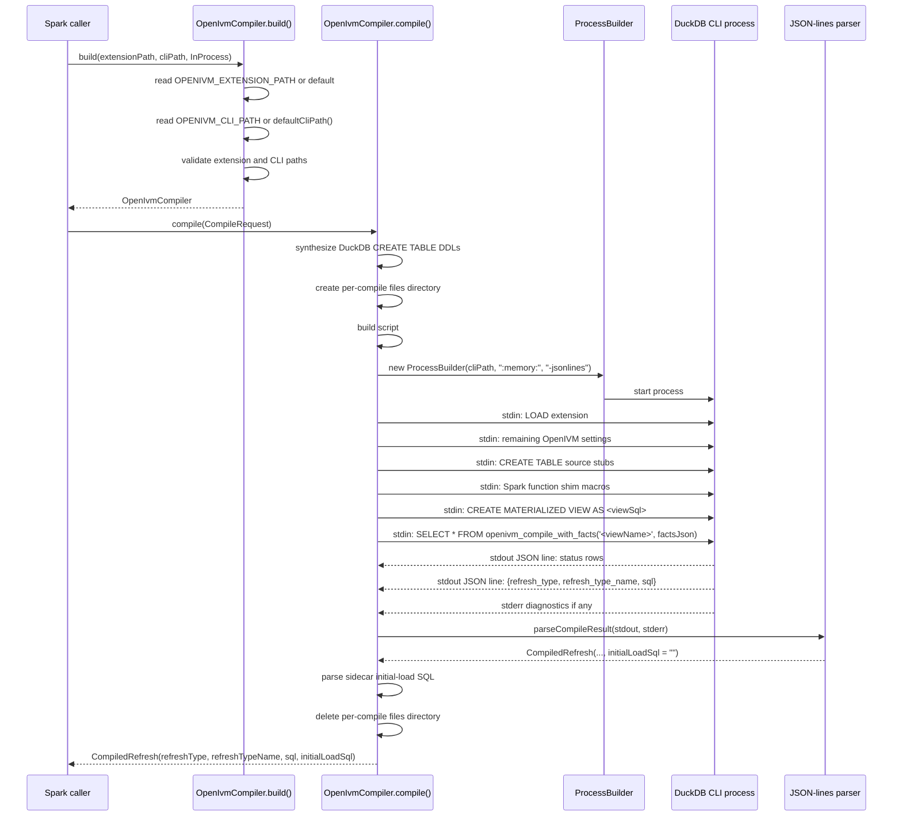

# 4. DuckDB CLI compile bridge

## This chapter documents the compile bridge in `spark-ext/ivm-compiler/src/main/scala/org/openivm/spark/compiler/OpenIvmCompiler.scala`. The bridge is the Spark extension's boundary to OpenIVM's DuckDB-side compiler. It does not maintain a long-lived DuckDB connection. It does not execute refresh SQL. It does not mutate Spark tables. It turns one Spark materialized-view body into one `CompiledRefresh` value. That value contains the refresh classification and the DuckDB/OpenIVM-emitted SQL program that later Spark-side code rewrites and executes.

## 1. What it is

`OpenIvmCompiler` is a Scala class in the `ivm-compiler` module.
For every compile request it builds a self-contained DuckDB script.
It spawns a fresh DuckDB CLI subprocess with:

```text
<cliPath> :memory: -jsonlines
```

The default CLI path is `/opt/openivm/duckdb`.
The default extension path is `/opt/openivm/openivm.duckdb_extension`.
The script starts by loading that extension.
It sets the remaining compiler session knobs that are still session scoped.
It registers empty DuckDB tables that match the Spark source schemas.
It registers Spark function shim macros.
It creates a temporary DuckDB materialized view from the Spark MV body.
Finally it invokes the per-call compile table function with Spark CompileFacts:

```sql
SELECT * FROM openivm_compile_with_facts(
  '<viewName>',
  '{"target_dialect":"spark","compile_only":true,"force_view_delta_cascade":true}'
);
```

DuckDB is launched with `-jsonlines`.
That means each result row is printed as a single JSON object on its own line.
Most setup statements produce no useful row.
`CREATE MATERIALIZED VIEW` may print a status row.
The row that matters is the final `openivm_compile_with_facts` row.
It has at least these fields:

```json
{"refresh_type":0,"refresh_type_name":"AGGREGATE_GROUP","sql":"..."}
```

## The Scala parser scans stdout line-by-line until it finds a line containing `"refresh_type"`. It decodes the numeric refresh type. It decodes the refresh type name. It decodes the generated SQL string. It returns those fields as `CompiledRefresh`. The bridge also reads the OpenIVM sidecar SQL file written under `openivm_files_path`. From that file it tries to extract the initial-load query for the MV data table. If extraction succeeds the query is returned in `initialLoadSql`. If extraction fails the field is the empty string and callers fall back to the original MV body where that is safe. The important boundary is this: OpenIVM compiles in DuckDB. Spark executes in Spark. The bridge only connects those two phases.

## 2. Why a CLI subprocess, not in-process JDBC

The compile path is intentionally CLI-driven.
The OpenIVM extension is a DuckDB native extension.
The extension must be loaded by a DuckDB runtime with the same ABI as the
extension binary.
The dev image therefore ships a matching DuckDB CLI beside
`openivm.duckdb_extension`.
`OpenIvmCompiler.build()` points at that CLI.
Each compile uses a new `duckdb :memory:` process.
That avoids sharing native DuckDB state inside the Spark driver JVM.
It also avoids depending on the JDBC driver's embedded DuckDB runtime to be the
one that loads and executes the extension.
The `duckdb_jdbc` dependency is still pinned.
That pin exists for class-loader and ABI alignment with the DuckDB version used
by OpenIVM.
It is not the query-execution path for the compiler table function.
The dependency file says this directly:

```scala
// spark-ext/project/Dependencies.scala:7-10
// DuckDB JDBC pinned to track openivm's bundled DuckDB v1.5.x.
// The .duckdb_extension binary is built from openivm@OPENIVM_COMMIT inside
// the spark-ext Docker image.  The compiler module uses the CLI at
// /opt/openivm/duckdb (same ABI version as the extension) rather than JDBC.
val duckdbV = "1.5.2.1"
```

The dev pin file carries the same version contract:

```text
# spark-ext/dev/pins.env:27-28
# DuckDB JDBC (must match openivm's bundled DuckDB ABI; openivm CI pins v1.5.2)
DUCKDB_JDBC_VERSION=1.5.2.1
```

The parity spec that exercises this path is
`CompileRefreshSpec`.
It is a Spark-side port of OpenIVM's compile-entry regression coverage.
It asserts that the bridge returns the same structural information expected from
OpenIVM's `openivm_compile_with_facts` path.
The spec documents the extension dependency:

```scala
// spark-ext/ivm-it/src/test/scala/org/openivm/spark/parity/CompileRefreshSpec.scala:23-25
// All tests require the OpenIVM DuckDB extension at the path given by
// `OPENIVM_EXTENSION_PATH` (default `/opt/openivm/openivm.duckdb_extension`),
// which is installed inside the `spark-ext` Docker image.
```

The same spec verifies the important compiler contract:

- `refreshType = 0` for an `AGGREGATE_GROUP` shape.
- `refreshTypeName = "AGGREGATE_GROUP"`.
- the generated SQL contains `openivm_delta_<mv>`.
- compiling twice does not mutate external state.
- a missing source table produces a clean compile failure.
  Those assertions are about the bridge output.
  They are not JDBC execution tests.

______________________________________________________________________

## 3. Walk-through of `OpenIvmCompiler.scala`

### 3.1 `CompiledRefresh` (`OpenIvmCompiler.scala:11-16`)

`CompiledRefresh` is the bridge output type.

```scala
final case class CompiledRefresh(
    refreshType: Int,
    refreshTypeName: String,
    sql: String,
    initialLoadSql: String
)
```

`refreshType` is the OpenIVM refresh type ordinal.
For example, `0` is `AGGREGATE_GROUP`.
`refreshTypeName` is the OpenIVM symbolic name.
For example, `AGGREGATE_GROUP` or `SIMPLE_PROJECTION`.
`sql` is the multi-statement refresh program emitted by OpenIVM for the target
dialect.
For this bridge the target dialect is Spark.
`initialLoadSql` is a SELECT query for the first population of the MV data
table.
It may include hidden OpenIVM bookkeeping columns such as
`openivm_count_star`.
It is empty when the bridge cannot safely extract or translate the sidecar
query.

### 3.2 `CompileRequest` (`OpenIvmCompiler.scala:28-33`)

`CompileRequest` is the bridge input type.

```scala
final case class CompileRequest(
    viewName: String,
    viewSql: String,
    sources: Map[String, StructType],
    sourceQualifiedNames: Map[String, String] = Map.empty
)
```

`viewName` is the materialized-view name to create in the ephemeral DuckDB
session.
`viewSql` is the SELECT body captured by the Spark parser and stored in
`MvMetadata`.
`sources` maps the short source-table name to a resolved Spark `StructType`.
The bridge uses that schema to synthesize DuckDB `CREATE TABLE` statements.
`sourceQualifiedNames` maps the same short names back to their fully-qualified
Spark names.
That map is used in two directions.
Before compile it strips Spark database qualifiers because the ephemeral DuckDB
session only registers short table names.
After compile it rewrites `memory.main.<short>` references from the OpenIVM
sidecar initial-load SQL back to the Spark qualified name.

### 3.3 `OpenIvmCompileException` (`OpenIvmCompiler.scala:37-38`)

`OpenIvmCompileException` is the public exception type for bridge failures.

```scala
final class OpenIvmCompileException(message: String, cause: Throwable)
    extends RuntimeException(message, cause)
```

The message preserves DuckDB CLI and OpenIVM error text.
Callers use this type to distinguish compile failure from unrelated Spark
analysis or runtime errors.
At MV creation time, this exception causes an explicit demotion to
`FULL_REFRESH`.

### 3.4 `build()` factory (`OpenIvmCompiler.scala:445-467`)

Callers construct the bridge through `OpenIvmCompiler.build()`.

```scala
def build(
    extensionPath: String = sys.env.getOrElse(
      "OPENIVM_EXTENSION_PATH",
      "/opt/openivm/openivm.duckdb_extension"
    ),
    cliPath: String = sys.env.getOrElse("OPENIVM_CLI_PATH", defaultCliPath()),
    isolation: Isolation = InProcess
): OpenIvmCompiler = ...
```

`OPENIVM_EXTENSION_PATH` overrides the OpenIVM extension binary.
If unset, the bridge uses `/opt/openivm/openivm.duckdb_extension`.
`OPENIVM_CLI_PATH` overrides the DuckDB CLI binary.
If unset, `defaultCliPath()` derives a sibling `duckdb` executable beside the
extension path.
The normal default therefore resolves to `/opt/openivm/duckdb`.
The factory validates that both paths exist on disk.
If the extension is missing it throws `IllegalArgumentException`.
If the CLI is missing it throws `IllegalArgumentException`.
The `Isolation` parameter currently has two values:

- `InProcess`
- `ChildProcess`
  The naming is historical.
  `InProcess` is the supported mode, but it still means a CLI subprocess per
  compile.
  It means the Scala `OpenIvmCompiler` object is used directly by the Spark driver
  rather than accessed through a separate compiler daemon.
  `ChildProcess` is reserved for future work.
  Passing it throws `NotImplementedError`.

______________________________________________________________________

## 4. CompileFacts and remaining DuckDB setting contract

The script body is assembled in `buildScript()`.
The relevant source range is `OpenIvmCompiler.scala:149-195`.
Spark-specific compiler facts are passed to OpenIVM as one JSON argument to the
compile table function, not as DuckDB session settings.
A representative script begins like this:

```sql
LOAD '/opt/openivm/openivm.duckdb_extension';
SET openivm_minmax_incremental=false;
SET openivm_files_path='<tmpDir>';
CREATE TABLE <source> (...);
CREATE OR REPLACE MATERIALIZED VIEW <view> AS <body>;
SELECT * FROM openivm_compile_with_facts(
  '<view>',
  '{"target_dialect":"spark","compile_only":true,"force_view_delta_cascade":true}'
);
```

The table below is the center of the compile bridge contract.

| Step | Statement or payload                                                 | Meaning for OpenIVM                                                                                                                                                                                                 | Why Spark sets it this way                                                                                                                                                                                                        |
| ---: | -------------------------------------------------------------------- | ------------------------------------------------------------------------------------------------------------------------------------------------------------------------------------------------------------------- | --------------------------------------------------------------------------------------------------------------------------------------------------------------------------------------------------------------------------------- |
|    1 | `LOAD '<extensionPath>';`                                            | Loads the native OpenIVM DuckDB extension into the fresh CLI process. Without this statement DuckDB does not know `CREATE MATERIALIZED VIEW` in the OpenIVM sense and does not expose `openivm_compile_with_facts`. | Spark never links the extension into the JVM. Loading it in the subprocess keeps native state isolated and ensures the extension is loaded by the ABI-matched CLI shipped in the dev image.                                       |
|    2 | `target_dialect="spark"`                                             | Selects OpenIVM's Spark/LPTS output dialect for the generated refresh program. It changes emitted identifier quoting, table qualification, merge syntax, and other dialect details.                                 | The next stage is `SparkRefreshRewriter`, not DuckDB execution. The bridge therefore asks OpenIVM to get as close to Spark SQL as it can before Spark-side rewriting handles remaining gaps.                                      |
|    3 | `compile_only=true`                                                  | Tells OpenIVM to compile and emit the refresh program without executing refresh DML. The MV body is parsed and bound, but the runtime maintenance operation is not run.                                             | Spark owns all persistent data. Compile-only mode lets DuckDB classify the query and produce SQL while guaranteeing the compile subprocess cannot mutate Spark Delta tables.                                                      |
|    4 | `force_view_delta_cascade=true`                                      | Forces OpenIVM to emit signed `openivm_delta_<view>` companion rows for aggregate and recompute-style paths, including `AGGREGATE_GROUP`, `AGGREGATE_HAVING`, `WINDOW_PARTITION`, and `GROUP_RECOMPUTE`.            | Spark supports MV-over-MV chains up to depth 2. The upstream refresh must materialize a view delta so the downstream MV can consume it later, even though that downstream view is not present in the compile-only DuckDB process. |
|    5 | `SET openivm_minmax_incremental=false`                               | Disables OpenIVM's grouped MIN/MAX fast path that assumes the compile-time delta contents are sufficient to decide insert-only maintenance. The compiler instead emits affected-groups delete-and-recompute SQL.    | The compile subprocess registers empty tables and empty deltas. Choosing a fast path from those empty deltas would be wrong for real Spark refreshes where deletes or updates may remove the current minimum or maximum.          |
|    6 | `SET openivm_files_path='<tmpDir>'`                                  | Directs OpenIVM to write sidecar compiled-query files to the compiler-owned directory. The bridge later reads `openivm_compiled_queries_<viewName>.sql` from that location.                                         | The JSON row contains the refresh program, but the initial-load query is extracted from the sidecar file. The directory is per compile, then deleted in `finally`, so compiles do not share sidecar state.                        |
|    7 | `CREATE TABLE`, shim macros, and `CREATE MATERIALIZED VIEW`          | Gives DuckDB enough schema and function information to parse and bind the Spark MV body before compilation.                                                                                                         | The compiler session is empty and short-lived; all source metadata must be reconstructed from Spark's analyzed plan.                                                                                                              |
|    8 | `SELECT * FROM openivm_compile_with_facts('<view>', '<facts_json>')` | Invokes the per-call OpenIVM compiler entry point and returns the JSON-lines row containing `refresh_type`, `refresh_type_name`, and `sql`.                                                                         | The CompileFacts JSON is passed as a single argument; no global session state is touched for dialect, compile-only mode, or cascade behavior, so concurrent compiles cannot interfere via leaked flags.                           |

### 4.1 Contract notes

## The table above is intentionally exhaustive for the Spark CompileFacts payload and the remaining session settings. The facts are embedded in the final table-function call instead of being emitted as `SET` or `PRAGMA` statements. The remaining settings are emitted before source tables, macros, and the MV definition because OpenIVM chooses MIN/MAX shape and sidecar files during the final `openivm_compile_with_facts` call.

## 5. Source schema synthesis

OpenIVM cannot classify an MV body unless DuckDB can bind every referenced
source table.
Spark already resolved those tables and has their schemas.
The bridge turns each Spark `StructType` into a DuckDB `CREATE TABLE` statement.
The tables are empty.
They exist only for parsing, binding, and type inference.
The code path is in `compile()` before the CLI script is built:

```scala
val tableDdls: Seq[(String, String)] = req.sources.toSeq.map { case (name, schema) =>
  val cols = schema.fields.map(f => s"${f.name} ${sparkToDuckdbType(f.dataType)}").mkString(", ")
  name -> s"CREATE TABLE $name ($cols)"
}
```

For a request like:

```scala
CompileRequest(
  viewName = "mv_t_sum",
  viewSql = "SELECT k, SUM(v) AS sum_v FROM t GROUP BY k",
  sources = Map("t" -> StructType.fromDDL("k INT, v INT"))
)
```

The bridge emits:

```sql
DROP TABLE IF EXISTS t;
CREATE TABLE t (k INTEGER, v INTEGER);
```

The mapping is defined by `sparkToDuckdbType()`.

| Spark `DataType`                                                                 | DuckDB DDL type           | Notes                                         |
| -------------------------------------------------------------------------------- | ------------------------- | --------------------------------------------- |
| `ByteType`                                                                       | `TINYINT`                 | Preserves one-byte integer width.             |
| `ShortType`                                                                      | `SMALLINT`                | Preserves two-byte integer width.             |
| `IntegerType`                                                                    | `INTEGER`                 | Common key and aggregate input type.          |
| `LongType`                                                                       | `BIGINT`                  | Used for Spark long columns and large counts. |
| `FloatType`                                                                      | `FLOAT`                   | Single-precision floating point.              |
| `DoubleType`                                                                     | `DOUBLE`                  | Double-precision floating point.              |
| `BooleanType`                                                                    | `BOOLEAN`                 | Boolean predicates and grouping keys.         |
| `StringType`                                                                     | `VARCHAR`                 | Spark strings bind as DuckDB strings.         |
| `DateType`                                                                       | `DATE`                    | Calendar date.                                |
| `TimestampType`                                                                  | `TIMESTAMP`               | Timestamp without changing the MV body.       |
| `BinaryType`                                                                     | `BLOB`                    | Byte arrays.                                  |
| `DecimalType(p,s)`                                                               | `DECIMAL(p, s)`           | Precision and scale are preserved.            |
| `ArrayType(element)`                                                             | `<element>[]`             | Element type is mapped recursively.           |
| `StructType(fields)`                                                             | `STRUCT(field type, ...)` | Nested fields are mapped recursively.         |
| `MapType(key,value)`                                                             | `MAP(keyType, valueType)` | Key and value types are mapped recursively.   |
| `UserDefinedType[_]`                                                             | unsupported               | Throws `NotImplementedError`.                 |
| unknown type                                                                     | unsupported               | Throws `NotImplementedError`.                 |
| Unsupported types fail before the CLI script is built.                           |                           |                                               |
| That is intentional.                                                             |                           |                                               |
| A Spark type that cannot be represented in DuckDB DDL cannot be safely passed to |                           |                                               |
| OpenIVM for binding.                                                             |                           |                                               |
| The failure is not wrapped as a DuckDB CLI error.                                |                           |                                               |

______________________________________________________________________

## 6. Spark function shims

The MV body must parse and bind in DuckDB.
Real user SQL is Spark SQL.
Some Spark functions have no DuckDB equivalent.
Some names exist in both engines but with incompatible overloads or arities.
The compile bridge solves a subset of those gaps with macros.
The pre-pass lives in
`SparkFunctionShimSql.scala:23-50`.
It rewrites function names outside strings, quoted identifiers, and comments.
The macro prologue lives in `OpenIvmCompiler.scala:490-523`.
The bridge adds `CREATE OR REPLACE MACRO` statements before creating the MV.
DuckDB then binds the rewritten function calls successfully.
OpenIVM's LPTS serializer inlines the macro body into the emitted refresh SQL.
`LptsSparkDialect` later rewrites those inlinings back into Spark spelling.

### 6.1 Rename rules

The scanner stores rename rules by top-level comma count.
Top-level comma count is arity minus one.
The important rules are:

| Spark call shape                                                               | Rewritten DuckDB macro name                                 |
| ------------------------------------------------------------------------------ | ----------------------------------------------------------- |
| `to_date(x)`                                                                   | `__sparkfn_to_date_1arg(x)`                                 |
| `to_date(x, fmt)`                                                              | `__sparkfn_to_date(x, fmt)`                                 |
| `to_timestamp(x)`                                                              | `__sparkfn_to_timestamp_1arg(x)`                            |
| `to_timestamp(x, fmt)`                                                         | `__sparkfn_to_timestamp(x, fmt)`                            |
| `date_format(d, fmt)`                                                          | `__sparkfn_date_format(d, fmt)`                             |
| `last_value(expr, flag)`                                                       | `__sparkfn_last_value(expr, flag)` for non-literal fallback |
| Literal-boolean `last_value(expr, true)` and `last_value(expr, false)` are a   |                                                             |
| special case.                                                                  |                                                             |
| They are normalized to DuckDB's window syntax instead of going through a macro |                                                             |
| when possible.                                                                 |                                                             |
| `true` becomes `IGNORE NULLS`.                                                 |                                                             |
| `false` keeps the default null behavior.                                       |                                                             |

### 6.2 Macro definitions

The macro prologue currently includes:

```sql
CREATE OR REPLACE MACRO regexp_like(s, p) AS regexp_matches(s, p);
CREATE OR REPLACE MACRO __sparkfn_to_date_1arg(s) AS CAST(CASE WHEN s IS NOT NULL THEN NULL WHEN s IS NULL THEN NULL END AS DATE);
CREATE OR REPLACE MACRO __sparkfn_to_date(s, fmt) AS CAST(strptime(s, fmt) AS DATE);
CREATE OR REPLACE MACRO __sparkfn_to_timestamp_1arg(s) AS CAST(CASE WHEN s IS NOT NULL THEN NULL WHEN s IS NULL THEN NULL END AS TIMESTAMP);
CREATE OR REPLACE MACRO __sparkfn_to_timestamp(s, fmt) AS strptime(s, fmt);
CREATE OR REPLACE MACRO __sparkfn_date_format(d, fmt) AS strftime(d, fmt);
CREATE OR REPLACE MACRO __sparkfn_last_value(expr, ignore_nulls) AS last(expr);
```

`regexp_like` does not need a private name.
DuckDB does not have the same collision problem for that Spark spelling.
The macro maps it to DuckDB `regexp_matches` for binding.
The post-pass can then recover `regexp_like` semantics for Spark.
Date and timestamp functions do use private names.
DuckDB has its own `to_date`, `to_timestamp`, and formatting behavior.
Binding the Spark calls directly would either fail or bind to the wrong
function.
The bridge therefore renames them to `__sparkfn_*` before DuckDB sees the SQL.

### 6.3 Why macros do not overload by arity

DuckDB macros do not overload by arity.
A macro named `__sparkfn_to_date` cannot simultaneously represent both
`to_date(x)` and `to_date(x, fmt)`.
The bridge therefore gives single-argument variants their own names.
That is why the one-argument forms are named:

```text
__sparkfn_to_date_1arg
__sparkfn_to_timestamp_1arg
```

The two-argument forms keep the base private names:

```text
__sparkfn_to_date
__sparkfn_to_timestamp
```

## This design lets the pre-pass choose the right macro from the observed arity. It also gives the post-pass enough structure to recover the original Spark function call.

## 7. Snapshot pins (Delta time travel)

A view body may pin a source to a Delta snapshot.
Spark spells that pin `FROM t VERSION AS OF 366` or `FROM t TIMESTAMP AS OF '…'`
(its `temporalClause`).
DuckDB rejects that spelling at parse time:

```text
Parser Error: syntax error at or near "as"
LINE 1: … FROM billing_meter_dim VERSION AS OF 366 GROUP BY region;
                                         ^
```

DuckDB's own DuckLake spelling `AT (VERSION => 366)` parses but then fails to
bind against the bridge's plain in-memory tables
(`Binder Error: Catalog type does not support time travel`).
Neither spelling can work on the DuckDB side, because
[§5](#5-source-schema-synthesis) registers row-less, schema-only tables.
A snapshot pin carries no information the classifier can use.
Before the split, the pin therefore aborted the compile and demoted the whole
view to `COMPILE_FAILED` → `FULL_REFRESH`, so every refresh — including a
refresh with an empty delta — re-executed the entire body.

`SparkTimeTravelSql.scala` splits the pin out of the compile-bridge COPY of the
body only.
The scanner is Spark-dialect and quote/comment aware.
It does not re-implement a SQL parser.
Every split is verified against Spark's own `CatalystSqlParser`: the de-pinned
SQL must parse, must contain no residual `RelationTimeTravel` node, and must
reference exactly the same relation identifiers as the original.
If any check fails, the original SQL is passed through and the compile fails
loudly as before.

Nothing Spark executes loses the pin:

| Spark-side artifact                              | Where the pin is re-applied                                        |
| ------------------------------------------------ | ------------------------------------------------------------------ |
| `MvMetadata.querySql` (FULL_REFRESH body)         | never stripped — stored verbatim                                    |
| initial-load CTAS at CREATE                       | `OpenIvmCompiler.parseInitialLoadSql`                               |
| live source reads in the compiled refresh program | `SparkRefreshRewriter.rewriteMemoryMainPrefix` (`sourceSnapshotPins`) |

A pinned source is a FROZEN relation.
OpenIVM always emits a live read for every source, so the pin must be
re-attached at each emitted `memory.main.<source>` reference.
The refresh path in `MaterializedViewCommands` additionally consumes the staged
deltas of a pinned source without applying them: post-pin DML is not part of the
view, and leaving the rows staged would grow staging without bound.
`rewriteRegularOldStateUnions` skips pinned sources so the user's pin is never
replaced by the pre-refresh watermark version.

If LPTS later grows a Spark-dialect front-end that accepts (and ignores)
`temporalClause`, the split stays useful: it keeps the DuckDB-side body free of
storage semantics that DuckDB cannot bind.

## 8. Process model and timeout behavior

Each `compile()` call creates a new process.
The process is launched by `runCli()`.
The command is:

```scala
new ProcessBuilder(cliPath, ":memory:", "-jsonlines")
```

The bridge writes the generated SQL script to stdin.
It closes stdin.
It reads stdout and stderr in parallel worker threads.
Parallel reads avoid deadlock when one pipe fills while the other is waiting.
The intended compile wall-clock guard is 120 seconds.
Operationally this timeout is known as `OPENIVM_COMPILE_TIMEOUT_MS`.
In the checked-in source, the default guard is visible as:

```scala
process.waitFor(120, TimeUnit.SECONDS)
```

When the compile subprocess exceeds the wall-clock budget, the bridge must fail
the compile rather than keep the Spark driver blocked indefinitely.
The failure is surfaced as `OpenIvmCompileException`.
At `CREATE MATERIALIZED VIEW` time, the caller catches that exception.
The caller logs a structured `[openivm-mv]` error.
It persists the MV as:

```scala
CompiledRefresh(
  refreshType = RefreshTypeCode.FullRefresh,
  refreshTypeName = "FULL_REFRESH",
  sql = "",
  initialLoadSql = ""
)
```

## That demotion preserves correctness. The MV can still be refreshed by re-running the original Spark SQL with `INSERT OVERWRITE`. The trade-off is performance. The view is no longer incrementally maintained until the compile failure is fixed and the MV is recreated or recompiled. At refresh time, cached compiled SQL is normally reused. A legacy MV without cached SQL can invoke the compiler again. If that compile fails, the refresh path should treat it as a compile failure, not as partial incremental SQL. No partial SQL program is safe to execute after a timeout.

## 9. JSON-lines output parser

DuckDB's `-jsonlines` mode makes parsing simple and robust enough for this
bridge.
The entire stdout is collected as a string.
`parseCompileResult()` iterates over stdout lines.
It searches for the first line containing `"refresh_type"`.
If no such line exists, it throws `OpenIvmCompileException`.
When stderr is non-empty, the exception message appends stderr as a diagnostic
hint.
The parser then calls `parseRefreshLine()`.
`parseRefreshLine()` extracts `refresh_type` with a regular expression.
It finds `refresh_type_name` by locating the JSON string value after the key.
It finds `sql` using `lastIndexOf("\"sql\"")`.
It decodes JSON string escapes manually.
The decoder handles:

- `\"`
- `\\`
- `\/`
- $\n$
- $\r$
- $\t$
- $\b$
- $\f$
- $\uXXXX$
  The returned value initially has `initialLoadSql = ""`.
  After parsing stdout, `compile()` calls `parseInitialLoadSql()`.
  It then returns `partial.copy(initialLoadSql = initLoad)`.
  The parser deliberately ignores other JSON-lines rows.
  For example, a successful `CREATE MATERIALIZED VIEW` can produce:

```json
{"MATERIALIZED VIEW CREATION":"true"}
```

## That row is status information. It is not the compile result. The compile result row is the one with `refresh_type`.

## 10. Sequence diagram



______________________________________________________________________

## 11. Sample input and output

This section shows a minimal aggregate MV.
The source table has two columns.

```scala
val req = CompileRequest(
  viewName = "mv_t_sum",
  viewSql = "SELECT k, SUM(v) AS sum_v FROM t GROUP BY k",
  sources = Map("t" -> StructType.fromDDL("k INT, v INT"))
)
```

The relevant DuckDB setup is:

```sql
LOAD '/opt/openivm/openivm.duckdb_extension';
SET openivm_minmax_incremental=false;
SET openivm_files_path='<compile-files-dir>';
CREATE TABLE t (k INTEGER, v INTEGER);
CREATE OR REPLACE MATERIALIZED VIEW mv_t_sum AS
  SELECT k, SUM(v) AS sum_v FROM t GROUP BY k;
SELECT * FROM openivm_compile_with_facts(
  'mv_t_sum',
  '{"target_dialect":"spark","compile_only":true,"force_view_delta_cascade":true}'
);
```

The CLI first prints a status JSON object:

```json
{"MATERIALIZED VIEW CREATION":"true"}
```

The compile row is shaped like this.
The timestamp below is normalized to `<TS>` because OpenIVM embeds the compile
time in delta-window predicates.

```json
{
  "refresh_type": 0,
  "refresh_type_name": "AGGREGATE_GROUP",
  "sql": "UPDATE openivm_views SET refresh_in_progress = true WHERE view_name = 'mv_t_sum';\n..."
}
```

The actual emitted SQL program for this tiny MV is representative of
`AGGREGATE_GROUP`.
Line breaks below are the decoded JSON string with `<TS>` replacing the concrete
compile timestamp.

```sql
UPDATE openivm_views SET refresh_in_progress = true WHERE view_name = 'mv_t_sum';
WITH scan_0 (t3_k, t3_v, t3_openivm_multiplicity) AS (
  SELECT `k`, `v`, `openivm_multiplicity`
  FROM `memory`.`main`.`openivm_delta_t`
  WHERE `openivm_timestamp`>='<TS>'::TIMESTAMP
),
aggregate_1 (t27_k, t27_v, t28_aggregate_0) AS (
  SELECT t3_k, t3_v, sum(t3_openivm_multiplicity)
  FROM scan_0
  GROUP BY t3_k, t3_v
),
filter_2 (t27_k, t27_v, t28_aggregate_0) AS (
  SELECT t27_k, t27_v, t28_aggregate_0
  FROM aggregate_1
  WHERE ((t28_aggregate_0) != (0))
),
projection_3 (t3_k, t3_v, t3_scalar_2) AS (
  SELECT t27_k, t27_v, CAST(t28_aggregate_0 AS INTEGER)
  FROM filter_2
),
projection_4 (t4_k, t4_v, t4_scalar_2) AS (
  SELECT t3_k, t3_v, t3_scalar_2
  FROM projection_3
),
projection_5 (t10_k, t10_v, t10_scalar_2) AS (
  SELECT t4_k, t4_v, t4_scalar_2
  FROM projection_4
),
aggregate_6 (t12_k, t12_scalar_2, t13_aggregate_0, t13_aggregate_1) AS (
  SELECT t10_k, t10_scalar_2, sum(t10_v), count_star()
  FROM projection_5
  GROUP BY t10_k, t10_scalar_2
),
projection_7 (t11_k, t11_aggregate_0, t11_aggregate_1, t11_scalar_2) AS (
  SELECT t12_k, t13_aggregate_0, t13_aggregate_1, t12_scalar_2
  FROM aggregate_6
),
projection_8 (t17_k, t17_aggregate_0, t17_aggregate_1, t17_scalar_2) AS (
  SELECT t11_k, t11_aggregate_0, t11_aggregate_1, t11_scalar_2
  FROM projection_7
),
projection_9 (t18_k, t18_aggregate_0, t18_aggregate_1, t18_scalar_2) AS (
  SELECT t17_k, t17_aggregate_0, t17_aggregate_1, t17_scalar_2
  FROM projection_8
),
projection_10 (t24_k, t24_aggregate_0, t24_aggregate_1, t24_scalar_2) AS (
  SELECT t18_k, t18_aggregate_0, t18_aggregate_1, t18_scalar_2
  FROM projection_9
),
projection_11 (t25_k, t25_aggregate_0, t25_aggregate_1, t25_scalar_2) AS (
  SELECT t24_k, t24_aggregate_0, t24_aggregate_1, t24_scalar_2
  FROM projection_10
)
INSERT INTO openivm_delta_mv_t_sum (
  k,
  sum_v,
  openivm_count_star,
  openivm_multiplicity
)
SELECT * FROM projection_11;
INSERT INTO openivm_delta_mv_t_sum (
  k,
  sum_v,
  openivm_count_star,
  openivm_multiplicity
)
SELECT d.k, NULL, NULL, -1
FROM openivm_delta_mv_t_sum d
WHERE d.openivm_multiplicity > 0
  AND d.openivm_timestamp > '<TS>'::TIMESTAMP
  AND EXISTS (
    SELECT 1
    FROM openivm_data_mv_t_sum m
    WHERE d.k IS NOT DISTINCT FROM m.k
  );
INSERT INTO openivm_delta_mv_t_sum (
  k,
  sum_v,
  openivm_count_star,
  openivm_multiplicity
)
SELECT d.k, NULL, NULL, 1
FROM openivm_delta_mv_t_sum d
WHERE d.openivm_multiplicity < 0
  AND d.openivm_count_star > 0
  AND d.openivm_timestamp > '<TS>'::TIMESTAMP
  AND EXISTS (
    SELECT 1
    FROM openivm_data_mv_t_sum m
    WHERE d.k IS NOT DISTINCT FROM m.k
      AND m.openivm_count_star
        + d.openivm_multiplicity * d.openivm_count_star > 0
  );
WITH refresh_cte AS (
  SELECT
    k,
    sum(openivm_multiplicity * sum_v) AS sum_v,
    sum(openivm_multiplicity * openivm_count_star) AS openivm_count_star
  FROM openivm_delta_mv_t_sum
  WHERE openivm_timestamp > '<TS>'::TIMESTAMP
  GROUP BY k
)
MERGE INTO openivm_data_mv_t_sum v
USING refresh_cte d
ON v.k IS NOT DISTINCT FROM d.k
WHEN MATCHED THEN UPDATE SET
  sum_v = COALESCE(v.sum_v + d.sum_v, v.sum_v, d.sum_v),
  openivm_count_star = COALESCE(
    v.openivm_count_star + d.openivm_count_star,
    v.openivm_count_star,
    d.openivm_count_star
  )
WHEN NOT MATCHED THEN INSERT (
  k,
  sum_v,
  openivm_count_star
)
VALUES (
  d.k,
  d.sum_v,
  d.openivm_count_star
);
CREATE TEMP TABLE openivm_old_compact_mv_t_sum AS
SELECT
  k,
  sum_v,
  openivm_count_star,
  SUM(openivm_multiplicity)::INTEGER AS openivm_multiplicity
FROM openivm_delta_mv_t_sum
WHERE openivm_timestamp > '<TS>'::TIMESTAMP
GROUP BY k, sum_v, openivm_count_star
HAVING SUM(openivm_multiplicity) <> 0;
DELETE FROM openivm_delta_mv_t_sum
WHERE openivm_timestamp > '<TS>'::TIMESTAMP;
INSERT INTO openivm_delta_mv_t_sum (
  k,
  sum_v,
  openivm_count_star,
  openivm_multiplicity
)
SELECT k, sum_v, openivm_count_star, openivm_multiplicity
FROM openivm_old_compact_mv_t_sum;
DROP TABLE openivm_old_compact_mv_t_sum;
DELETE FROM openivm_delta_mv_t_sum
WHERE openivm_timestamp < (
  SELECT MIN(last_update)
  FROM openivm_delta_tables
  WHERE table_name = 'openivm_delta_mv_t_sum'
);
DELETE FROM memory.main.openivm_delta_t
WHERE openivm_timestamp < (
  SELECT MIN(last_update)
  FROM openivm_delta_tables
  WHERE table_name = 'openivm_delta_t'
);
UPDATE openivm_delta_tables
SET
  last_update = COALESCE(
    (SELECT MAX(openivm_timestamp) + INTERVAL '1 microsecond'
     FROM memory.main.openivm_delta_t),
    now()
  ),
  last_refresh_ts = now()
WHERE view_name = 'mv_t_sum'
  AND table_name = 'openivm_delta_t';
UPDATE openivm_views SET refresh_in_progress = false WHERE view_name = 'mv_t_sum';
```

The important details in this output are:

- `refresh_type` is `0`.
- `refresh_type_name` is `AGGREGATE_GROUP`.
- the program starts by marking the MV refresh as in progress.
- it scans the signed base-table delta `openivm_delta_t`.
- it derives signed rows for `openivm_delta_mv_t_sum`.
- it merges aggregate changes into `openivm_data_mv_t_sum`.
- it compacts the MV delta table for downstream cascade.
- it advances `openivm_delta_tables.last_update`.
- it marks the MV refresh as no longer in progress.
  Spark does not execute this raw string directly.
  The next layer rewrites it through `SparkRefreshRewriter` and related dialect
  translation helpers.
  The compile bridge's responsibility ends when `CompiledRefresh` is returned.

______________________________________________________________________

## 12. Operational checklist

When debugging the compile bridge, check these items in order.

1. Confirm `OPENIVM_EXTENSION_PATH` points to a readable
   `openivm.duckdb_extension`.
1. Confirm `OPENIVM_CLI_PATH` points to the ABI-matched DuckDB CLI.
1. Confirm the source table map uses short names that match the MV body after
   qualifier stripping.
1. Confirm every Spark source type maps to a DuckDB DDL type.
1. Confirm the MV body is in the Spark/DuckDB dialect intersection, or has a
   shim that covers the Spark-only function.
1. Confirm the JSON-lines stdout contains a row with `refresh_type`.
1. Check stderr in the `OpenIvmCompileException` message when parsing fails.
1. If the MV was created as `FULL_REFRESH`, search logs for the structured
   `[openivm-mv]` demotion record.
1. If initial load falls back to the user query, inspect the sidecar SQL for
   unsupported constructs such as `rowid`.
1. If MV-over-MV cascade fails, verify the `force_view_delta_cascade=true` CompileFacts key was present
   in the compile script.

______________________________________________________________________

## 13. Key source references

- `OpenIvmCompiler.scala:11-16` — `CompiledRefresh`.
- `OpenIvmCompiler.scala:28-33` — `CompileRequest`.
- `OpenIvmCompiler.scala:37-38` — `OpenIvmCompileException`.
- `OpenIvmCompiler.scala:69-98` — `compile()` orchestration.
- `OpenIvmCompiler.scala:112-142` — Spark type to DuckDB type mapping.
- `OpenIvmCompiler.scala:149-195` — script and CompileFacts contract.
- `OpenIvmCompiler.scala:267-299` — CLI subprocess and pipe handling.
- `OpenIvmCompiler.scala:301-370` — JSON-lines result parsing.
- `OpenIvmCompiler.scala:324-349` — initial-load sidecar parsing.
- `OpenIvmCompiler.scala:445-467` — `build()` factory.
- `OpenIvmCompiler.scala:490-523` — Spark function shim macros.
- `SparkFunctionShimSql.scala:23-50` — arity-aware rename rules.
- `SparkTimeTravelSql.scala` — snapshot-pin split and Spark-parser cross-check.
- `Dependencies.scala:7-11` — DuckDB JDBC ABI pin and CLI note.
- `pins.env:27-28` — DuckDB JDBC version pin.
- `CompileRefreshSpec.scala:9-55` — parity spec for the compiler bridge.
- `MaterializedViewCommands.scala:359-392` — CREATE-time demotion to
  `FULL_REFRESH` after `OpenIvmCompileException`.
