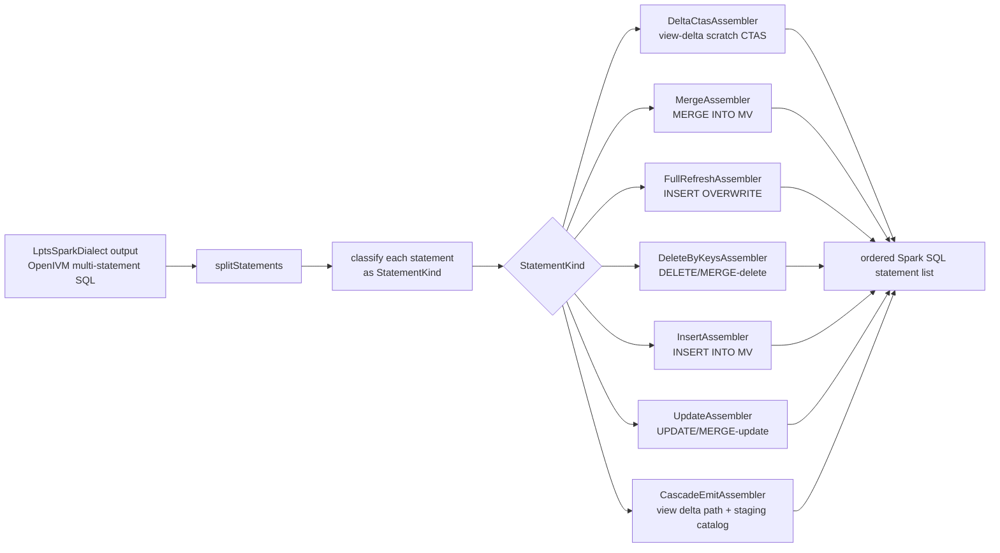

# 6. SparkRefreshRewriter and per-StatementKind assemblers

> Scope: `spark-ext/ivm-common/src/main/scala/org/openivm/spark/common/SparkRefreshRewriter.scala`
> plus the small `Assembler` layer used for full-refresh fallbacks.

## 1. The core insight

The refresh rewriter is **shape-driven**.
It does **not** say:

```scala
refreshType match {
  case AggregateGroup => ...
  case SimpleProjection => ...
}
```

Instead, it says:

```scala
split the compiled SQL into statements
classify each statement by SQL shape
rewrite each shape with the matching statement assembler
```

The dispatch key is `StatementKind`.

The dispatch key is **not** the `RefreshType` ordinal.
That distinction matters because OpenIVM can emit different SQL shapes for the
same `RefreshType`.

For example:

- an `AGGREGATE_GROUP` view can be the normal additive path;
- an `AGGREGATE_GROUP` view with MIN/MAX can additionally emit delete/recompute
  shapes;
- an `AGGREGATE_GROUP` view with cascade enabled can emit a companion
  `INSERT INTO openivm_delta_<view>` shape;
- a recompute path can emit snapshot shapes that are independent of the ordinal
  alone.

So readers should think in two layers:

1. **OpenIVM classifier**: chooses a coarse refresh type such as
   `AGGREGATE_GROUP`, `SIMPLE_PROJECTION`, or `FULL_REFRESH`.
1. **SparkRefreshRewriter**: inspects the concrete SQL statements produced by
   that classifier and dispatches on their `StatementKind`.

The relevant source is `SparkRefreshRewriter.rewrite`, which splits statements
at lines 128-130, classifies each statement at line 131, and dispatches on
`StatementKind` at lines 132-164.
There is also a separate `SparkMergeAssembler` abstraction in `ivm-common` that
is `RefreshType`-driven for assembled fallback/full-refresh programs. Do not
confuse that with the main `SparkRefreshRewriter` dispatch. `SparkMergeAssembler`
routes by `AssemblyInput.refreshType` in `SparkMergeAssembler.scala:26-48`;
`SparkRefreshRewriter` routes by SQL shape in `SparkRefreshRewriter.scala:130-164`.

## 2. End-to-end flow



The final result is `RewrittenRefresh(statements: Seq[String])`.
The caller executes each statement in order.

## 3. Where the rewriter begins

`SparkRefreshRewriter.rewrite` takes:

- the compiled OpenIVM refresh program;
- the Spark MV identifier;
- the MV Delta location;
- the OpenIVM logical view name;
- source-table temp view mappings;
- a per-refresh view-delta path;
- a post-processing function, normally `LptsSparkDialect.translate`;
- source schemas for `SELECT * EXCEPT` expansion;
- source qualified names for `memory.main.<short>` rewrite;
- the pre-refresh MV version for recompute cascade snapshots.
  The signature is at `SparkRefreshRewriter.scala:108-119`.

The first non-trivial step is to install a per-thread source-qualified-name map.
That map lets every private assembler rewrite `memory.main.<short>` either to a
fully-qualified Spark identifier or to the short backticked temp view name. The
ThreadLocal is declared at `SparkRefreshRewriter.scala:62-65`, populated at
`SparkRefreshRewriter.scala:125-127`, and restored at
`SparkRefreshRewriter.scala:176-178`.

## 4. Statement splitting

The rewriter calls:

```scala
val stmts = splitStatements(compiledSql).map(_.trim).filter(_.nonEmpty)
```

Source: `SparkRefreshRewriter.scala:128`.
`splitStatements` lives at `SparkRefreshRewriter.scala:1912-1945`.

It scans the SQL string character by character.
It splits only on semicolons that are outside single-quoted string literals.

It handles escaped single quotes using DuckDB/Spark SQL's doubled-quote form:

```sql
'it''s ok'
```

This behavior is pinned by `SparkRefreshRewriterSpec.scala:75-90`.
Important nuance: the top-level splitter is **quote-aware**, but it does not
maintain a parenthesis depth counter. Parenthesis-aware scanning appears in
helper routines such as `findMatchingCloseParen` (`SparkRefreshRewriter.scala:1750-1780`),
`splitTopLevelOr` (`SparkRefreshRewriter.scala:1406-1457`), and
`findTopLevelSqlKeyword` (`SparkRefreshRewriter.scala:1072-1086`). In practice,
OpenIVM emits statement terminators between statements, not semicolon tokens
inside parenthesized subqueries.

## 5. Classification

After splitting, each statement is classified by SQL shape:

```scala
classify(stmt, viewLogicalName)
```

Source: `SparkRefreshRewriter.scala:131`.

The classifier starts at `SparkRefreshRewriter.scala:301` and ends at
`SparkRefreshRewriter.scala:404`.
It uses string-shape tests such as:

- `UPDATE OPENIVM_VIEWS`;
- `CREATE OR REPLACE TEMP TABLE OPENIVM_AFFECTED_<view>`;
- `INSERT INTO OPENIVM_DELTA_<view>`;
- `MERGE INTO OPENIVM_DATA_<view>`;
- `INSERT INTO OPENIVM_DATA_<view>`;
- `UPDATE OPENIVM_DATA_<view>`;
- `DELETE FROM OPENIVM_DATA_<view>`;
- `IN (SELECT ...)` markers for window-partition recompute.
  The classifier also drops OpenIVM-side compact-delta cleanup shapes. Those
  shapes reference `openivm_old_compact_<view>` and are declared irrelevant to the
  Spark per-refresh view-delta path at `SparkRefreshRewriter.scala:307-316`.

## 6. Dispatch

The dispatcher is a `match` over `StatementKind`.

Source: `SparkRefreshRewriter.scala:130-164`.
The important branches are:

```scala
case StatementKind.ViewDeltaInsert =>
  Seq(rewriteViewDeltaInsert(...))
case StatementKind.ViewDeltaCompanion =>
  Seq(rewriteViewDeltaCompanion(...))

case StatementKind.MvMerge =>
  Seq(rewriteMvMerge(...))
case StatementKind.SimpleProjectionDataInsert =>
  rewriteSimpleProjectionDataInsert(...)

case StatementKind.ScalarUpdate =>
  Seq(rewriteScalarUpdate(...))
case StatementKind.ScalarDeleteMv =>
  rewriteScalarDeleteMv(...)

case StatementKind.PartitionScopedDelete =>
  rewritePartitionScopedDelete(...)
case StatementKind.PartitionScopedInsert =>
  Seq(rewritePartitionScopedInsert(...))
```

Bookkeeping and unknown shapes are dropped:

```scala
case StatementKind.InProgressFlag | StatementKind.Cleanup => Nil
case StatementKind.Unknown => Nil
```

This is why the number of surviving Spark statements is often smaller than the
OpenIVM docstring statement count.

## 7. Post-dispatch passes

After shape-specific rewriting, the rewriter applies four generic passes and one
caller-supplied pass, in this order:

1. `expandSelectStarExcept` for DuckDB-style column exclusion.
1. `fixMergeAliasRefs` for Spark/Delta merge alias compatibility.
1. `deduplicateNullSafeMergeSource` to fold duplicate `IS NOT DISTINCT FROM`
   conjuncts that some openivm shapes emit twice over the same merge source.
1. `rewriteRecomputeWhereExistsAsAffectedKeysJoin` — converts the strict
   "recompute INSERT MERGE … `WHERE EXISTS (SELECT 1 FROM <ref> _d WHERE _d.<col> IS NOT DISTINCT FROM <outer>.<col> …)`" shape into a
   `LEFT SEMI JOIN (SELECT DISTINCT <cols> FROM <ref>) _d ON …` form. See
   section §15 below for the full rationale and applicability conditions.
1. `postProcess`, usually `LptsSparkDialect.translate`.

Source: `SparkRefreshRewriter.scala:291-296`.
The result is then wrapped in `RewrittenRefresh`.

## 8. StatementKind enumeration and assembler mapping

The enum is private to `SparkRefreshRewriter`.

Source: `SparkRefreshRewriter.scala:183-299`.
The table below lists every variant in source order.

| StatementKind                                                 | Shape recognized                                                                             | Conceptual assembler                                | Spark statement form                                                                                          |
| ------------------------------------------------------------- | -------------------------------------------------------------------------------------------- | --------------------------------------------------- | ------------------------------------------------------------------------------------------------------------- |
| `InProgressFlag`                                              | `UPDATE openivm_views SET refresh_in_progress = ...`                                         | none / dropped                                      | no Spark statement                                                                                            |
| `ViewDeltaInsert`                                             | main `INSERT INTO openivm_delta_<view>`                                                      | `DeltaCtasAssembler`                                | `CREATE OR REPLACE TABLE delta.<viewDeltaPath> USING DELTA AS ...`                                            |
| `ViewDeltaCompanion`                                          | cascade companion self-read of `openivm_delta_<view>`                                        | `CascadeEmitAssembler`                              | `INSERT INTO delta.<viewDeltaPath> (...) SELECT ...`                                                          |
| `MvMerge`                                                     | `MERGE INTO openivm_data_<view>`                                                             | `MergeAssembler`                                    | `MERGE INTO <mv> ... USING delta.<viewDeltaPath> ...`                                                         |
| `SimpleProjectionDataInsert`                                  | `INSERT INTO openivm_data_<view> SELECT ... FROM openivm_delta_<view>, generate_series(...)` | `InsertAssembler` plus `DeleteByKeysAssembler`      | `INSERT INTO <mv> ...`; delete-only `MERGE INTO <mv> ... WHEN MATCHED THEN DELETE`                            |
| `ScalarUpdate`                                                | `UPDATE openivm_data_<view> SET ...`                                                         | `UpdateAssembler`                                   | `UPDATE <mv> SET ...` or null-reset `MERGE INTO <mv> ... WHEN MATCHED THEN UPDATE`                            |
| `ScalarDeleteMv`                                              | `DELETE FROM openivm_data_<view>`                                                            | `DeleteByKeysAssembler`                             | `DELETE FROM <mv>` or delete `MERGE`                                                                          |
| `ScalarFullRecomputeInsert`                                   | live-source `INSERT INTO openivm_data_<view> ... memory.main.<src>`                          | `InsertAssembler`                                   | `INSERT INTO <mv> ...` or insert-only `MERGE ... ON false`                                                    |
| `GroupRecomputeAffectedCreate`                                | `CREATE OR REPLACE TEMP TABLE openivm_affected_<view> AS ...`                                | `DeltaCtasAssembler` / scratch-view assembler       | `CREATE OR REPLACE TEMPORARY VIEW openivm_affected_<view> AS ...`                                             |
| `GroupRecomputeAffectedDrop`                                  | `DROP TABLE IF EXISTS openivm_affected_<view>`                                               | cleanup assembler                                   | `DROP VIEW IF EXISTS openivm_affected_<view>`                                                                 |
| `OldSnapshotCreate`                                           | `CREATE OR REPLACE TEMP TABLE openivm_old_<view> AS ...`                                     | `CascadeEmitAssembler` / snapshot scratch assembler | `CREATE OR REPLACE TEMPORARY VIEW openivm_old_<view> AS SELECT ... FROM delta.<mvLocation> VERSION AS OF ...` |
| `NewSnapshotCreate`                                           | `CREATE OR REPLACE TEMP TABLE openivm_new_<view> AS ...`                                     | `CascadeEmitAssembler` / snapshot scratch assembler | `CREATE OR REPLACE TEMPORARY VIEW openivm_new_<view> AS ...`                                                  |
| `SnapshotDataInsert`                                          | `INSERT INTO openivm_data_<view> SELECT * FROM openivm_new_<view>`                           | `InsertAssembler`                                   | `INSERT INTO <mv> SELECT * FROM openivm_new_<view>`                                                           |
| `SnapshotDrop`                                                | `DROP TABLE IF EXISTS openivm_old_<view>` or `openivm_new_<view>`                            | cleanup assembler                                   | `DROP VIEW IF EXISTS openivm_old_<view>` / `openivm_new_<view>`                                               |
| `PartitionScopedDelete`                                       | window partition `DELETE ... WHERE k IN (SELECT ...)`                                        | `DeleteByKeysAssembler`                             | one delete `MERGE` per `IN` clause                                                                            |
| `PartitionScopedInsert`                                       | window partition `INSERT ... WHERE k IN (SELECT ...)`                                        | `InsertAssembler`                                   | `INSERT INTO <mv> SELECT ... WHERE k IN (SELECT ...)`                                                         |
| `Cleanup`                                                     | OpenIVM bookkeeping cleanup                                                                  | none / dropped                                      | no Spark statement                                                                                            |
| `Unknown`                                                     | no recognized shape                                                                          | none / dropped                                      | no Spark statement                                                                                            |
| A single `RefreshType` can produce multiple table rows above. |                                                                                              |                                                     |                                                                                                               |

For example, `WINDOW_PARTITION` can produce:

- `OldSnapshotCreate`;
- `NewSnapshotCreate`;
- `PartitionScopedDelete`;
- `PartitionScopedInsert`;
- `SnapshotDataInsert`;
- `ViewDeltaInsert`;
- `SnapshotDrop`.

That is one ordinal and many statement shapes.

## 9. Per-assembler guide

The following subsections use the requested assembler names as a vocabulary for
statement-shape families. Some of these names are concrete Scala objects
(`MergeAssembler`, `FullRefreshAssembler`); others are conceptual groupings of
private methods inside `SparkRefreshRewriter`.

### 9.1 DeltaCtasAssembler

**Source locations**

- Main shape entry: `SparkRefreshRewriter.scala:408-420`.
- Column-list CTAS rewrite: `SparkRefreshRewriter.scala:508-548`.
- Empty-placeholder CTAS fallback: `SparkRefreshRewriter.scala:561-585`.
- No-column-list recompute cascade CTAS fallback: `SparkRefreshRewriter.scala:601-629`.
- Group-recompute scratch view create: `SparkRefreshRewriter.scala:1591-1600`.

**Input template**

```sql
WITH scan_0 (...) AS (...),
     aggregate_1 (...) AS (...),
     projection_n (...) AS (...)
INSERT INTO openivm_delta_<view> (c1, c2, openivm_multiplicity, openivm_timestamp)
SELECT * FROM projection_n
```

**Output template**

```sql
CREATE OR REPLACE TABLE delta.`<viewDeltaPath>` USING DELTA AS
WITH scan_0 (...) AS (...),
     aggregate_1 (...) AS (...),
     projection_n (...) AS (...)
SELECT src_c1 AS c1,
       src_c2 AS c2,
       src_mult AS openivm_multiplicity,
       src_ts AS openivm_timestamp
FROM projection_n
```

**What it does**
The assembler converts OpenIVM's logical view-delta table write into a Spark
Delta scratch table under the per-refresh `viewDeltaPath`.

That path is generated by `MaterializedViewCommands.scala:944-955`:

```text
<warehouse>/_ivm/view_deltas/<safe-qualified-mv-name>/<uuid>
```

The source code does not currently emit a literal `CACHE TABLE` statement in
this path. The durable Spark form is a temporary scratch CTAS backed by Delta.

### 9.2 MergeAssembler

**Source locations**

- Statement-shape merge rewrite: `SparkRefreshRewriter.scala:693-740`.
- Concrete standalone object: `MergeAssembler.scala:17-78`.
- Standalone refresh-type dispatcher: `SparkMergeAssembler.scala:26-48`.

**Input template**

```sql
WITH refresh_cte AS (
  SELECT k, SUM(openivm_multiplicity * total) AS total
  FROM openivm_delta_<view>
  WHERE openivm_timestamp > '<ts>'::TIMESTAMP
  GROUP BY k
)
MERGE INTO openivm_data_<view> v
USING refresh_cte d
ON v.k IS NOT DISTINCT FROM d.k
WHEN MATCHED THEN UPDATE SET total = ...
WHEN NOT MATCHED THEN INSERT (k, total) VALUES (d.k, d.total)
```

**Output template**

```sql
WITH refresh_cte AS (
  SELECT k, SUM(openivm_multiplicity * total) AS total
  FROM delta.`<viewDeltaPath>`
  GROUP BY k
)
MERGE INTO `<db>`.`<mv>` v
USING refresh_cte d
ON v.k IS NOT DISTINCT FROM d.k
WHEN MATCHED THEN UPDATE SET total = ...
WHEN NOT MATCHED THEN INSERT (k, total) VALUES (d.k, d.total)
```

**What it does**
The statement-shape merge assembler replaces OpenIVM internal table names with
Spark identifiers and redirects `openivm_delta_<view>` reads to the per-refresh
Delta CTAS path.

It also fixes alias-qualified column references for Spark/Delta merge syntax.
See `SparkRefreshRewriter.scala:714-736`.
The standalone `MergeAssembler` object is a different layer. It emits generic
MERGE programs from `AssemblyInput` for refresh types 0, 1, 2, 4, and 8. Its
core monoid form is at `MergeAssembler.scala:36-47`; its signed projection form
is at `MergeAssembler.scala:54-66`; its aggregate-having post-delete is at
`MergeAssembler.scala:71-77`.

### 9.3 FullRefreshAssembler

**Source locations**

- Concrete object: `FullRefreshAssembler.scala:12-22`.
- Full-refresh execution branch: `MaterializedViewCommands.scala:856-873`.
- Runtime simple-projection fallback: `MaterializedViewCommands.scala:1038-1059`.
  **Input template**

```sql
SELECT <user projection>
FROM <live source tables>
WHERE <user predicate>
```

**Output template**

```sql
INSERT OVERWRITE TABLE `<db>`.`<mv>`
SELECT * FROM (
  SELECT <user projection>
  FROM <live source tables>
  WHERE <user predicate>
)
```

**What it does**

Full refresh bypasses the OpenIVM incremental program and re-runs the original
user query against live source tables.
`FullRefreshAssembler.assemble` emits exactly one statement:

```scala
INSERT OVERWRITE TABLE <mv> SELECT * FROM (<deltaSql>)
```

Source: `FullRefreshAssembler.scala:19-22`.

### 9.4 DeleteByKeysAssembler

**Source locations**

- SIMPLE_PROJECTION delete-only merge: `SparkRefreshRewriter.scala:817-830`.
- General MV delete rewrite: `SparkRefreshRewriter.scala:909-944`.
- `DELETE ... USING` to merge: `SparkRefreshRewriter.scala:1122-1149`.
- `DELETE ... IN (...)` to merge: `SparkRefreshRewriter.scala:1161-1204`.
- `DELETE ... EXISTS (...)` to merge: `SparkRefreshRewriter.scala:1243-1300`.
- Window partition delete split: `SparkRefreshRewriter.scala:1343-1365`.
- Single `IN` clause conversion: `SparkRefreshRewriter.scala:1372-1396`.
  **Input template: simple projection retraction**

```sql
INSERT INTO openivm_data_<view>
SELECT c1, c2
FROM openivm_delta_<view>, generate_series(1, openivm_multiplicity::BIGINT)
WHERE openivm_timestamp >= '<ts>'::TIMESTAMP
  AND openivm_multiplicity > 0
```

The rewriter adds a companion delete statement for negative multiplicities:

```sql
MERGE INTO <mv> AS v
USING (
  SELECT c1, c2
  FROM delta.`<viewDeltaPath>`
  WHERE openivm_multiplicity < 0
) AS d
ON v.c1 IS NOT DISTINCT FROM d.c1
AND v.c2 IS NOT DISTINCT FROM d.c2
WHEN MATCHED THEN DELETE
```

**Input template: window partition delete**

```sql
DELETE FROM openivm_data_<view>
WHERE k IN (
  SELECT DISTINCT k
  FROM openivm_delta_<source>
  WHERE openivm_timestamp > '<ts>'::TIMESTAMP
)
```

**Output template**

```sql
MERGE INTO `<db>`.`<mv>` AS v
USING (
  SELECT DISTINCT k
  FROM openivm_delta_<source>
) AS d
ON v.k IS NOT DISTINCT FROM d.k
WHEN MATCHED THEN DELETE
```

**What it does**

Delta Lake rejects several forms of `DELETE` with subqueries. The delete
assembler preserves semantics by converting those deletes into `MERGE ... WHEN MATCHED THEN DELETE` statements.
For OR-joined window partition predicates, it emits one merge per top-level
`IN (SELECT ...)` clause.

### 9.5 InsertAssembler

**Source locations**

- SIMPLE_PROJECTION positive insert: `SparkRefreshRewriter.scala:811-815`.
- Full-recompute insert entry: `SparkRefreshRewriter.scala:969-992`.
- Insert-star-from-subquery rewrite: `SparkRefreshRewriter.scala:994-1036`.
- Window partition insert: `SparkRefreshRewriter.scala:1468-1479`.
- Snapshot data insert: `SparkRefreshRewriter.scala:1525-1535`.
  **Input template: positive simple projection rows**

```sql
INSERT INTO openivm_data_<view>
SELECT c1, c2
FROM openivm_delta_<view>, generate_series(1, openivm_multiplicity::BIGINT)
WHERE openivm_timestamp >= '<ts>'::TIMESTAMP
  AND openivm_multiplicity > 0
```

**Output template**

```sql
INSERT INTO `<db>`.`<mv>`
SELECT `c1`, `c2`
FROM delta.`<viewDeltaPath>`
WHERE `openivm_multiplicity` > 0
```

**Input template: recompute insert**

```sql
INSERT INTO openivm_data_<view>
SELECT *
FROM (<view query over memory.main.<src>>) openivm_recompute
WHERE EXISTS (... affected keys ...)
```

**Output template**

```sql
INSERT INTO `<db>`.`<mv>`
SELECT *
FROM (<view query over `<src>`>) openivm_recompute
WHERE EXISTS (... affected keys ...)
```

When Spark needs explicit insert columns for `SELECT * FROM (<subquery>)`,
`rewriteInsertSelectStarFromSubquery` can reshape the insert into an insert-only
`MERGE ... ON false ... WHEN NOT MATCHED THEN INSERT`. Source:
`SparkRefreshRewriter.scala:1028-1033`.

### 9.6 UpdateAssembler

**Source locations**

- Scalar update entry: `SparkRefreshRewriter.scala:851-883`.
- Null-reset conversion: `SparkRefreshRewriter.scala:1697-1710`.
- CTE inlining: `SparkRefreshRewriter.scala:1720-1743`.
  **Input template: CTE-prefixed update**

```sql
WITH openivm_delta AS (
  SELECT SUM(openivm_multiplicity * total) AS d_total
  FROM openivm_delta_<view>
  WHERE openivm_timestamp > '<ts>'::TIMESTAMP
)
UPDATE openivm_data_<view>
SET total = COALESCE(total, 0) + COALESCE((SELECT d_total FROM openivm_delta), 0)
```

**Output template**

```sql
UPDATE `<db>`.`<mv>`
SET total = COALESCE(total, 0)
          + COALESCE((SELECT SUM(openivm_multiplicity * total)
                      FROM delta.`<viewDeltaPath>`), 0)
```

**Input template: null reset**

```sql
UPDATE openivm_data_<view>
SET total = NULL
WHERE NOT EXISTS (SELECT 1 FROM memory.main.<source> LIMIT 1)
```

**Output template**

```sql
MERGE INTO `<db>`.`<mv>` AS v
USING (SELECT COUNT(*) AS _cnt FROM `<source>`) AS _chk
ON TRUE
WHEN MATCHED AND _chk._cnt = 0 THEN UPDATE SET total = NULL
```

**What it does**

Spark SQL does not support every DuckDB CTE-before-UPDATE or subquery-in-UPDATE
shape that OpenIVM emits. The update assembler either inlines the CTE into
scalar subqueries or converts the update into a Delta-compatible merge.

### 9.7 CascadeEmitAssembler

**Source locations**

- Refresh-type capability predicate: `RefreshTypeCode.scala:73-76`.
- Per-refresh view-delta path creation: `MaterializedViewCommands.scala:944-955`.
- Companion view-delta append: `SparkRefreshRewriter.scala:656-689`.
- Old snapshot create: `SparkRefreshRewriter.scala:1489-1508`.
- New snapshot create: `SparkRefreshRewriter.scala:1514-1520`.
- Snapshot data insert: `SparkRefreshRewriter.scala:1525-1535`.
- Snapshot cleanup: `SparkRefreshRewriter.scala:1541-1547`.
- Staging-catalog persistence: `MaterializedViewCommands.scala:1107-1155`.

**Input template: companion retract rows**

```sql
INSERT INTO openivm_delta_<view> (k, total, openivm_multiplicity)
SELECT d.k, 0, -1
FROM openivm_delta_<view> d
WHERE d.openivm_multiplicity > 0
  AND d.openivm_timestamp > '<ts>'::TIMESTAMP
  AND EXISTS (
    SELECT 1
    FROM openivm_data_<view> m
    WHERE d.k IS NOT DISTINCT FROM m.k
  )
```

**Output template**

```sql
INSERT INTO delta.`<viewDeltaPath>` (k, total, openivm_multiplicity)
SELECT d.k, 0, -1
FROM delta.`<viewDeltaPath>` d
WHERE d.openivm_multiplicity > 0
  AND EXISTS (
    SELECT 1
    FROM `<db>`.`<mv>` m
    WHERE d.k IS NOT DISTINCT FROM m.k
  )
```

**Persistence side effect**
After the SQL statements run, `MaterializedViewCommands` records the view-delta
path as an `MV_VIEW_DELTA` staging row so downstream MVs can consume it.

The path format is:

```text
<warehouse>/_ivm/view_deltas/<safe-qualified-mv-name>/<uuid>
```

Source: `MaterializedViewCommands.scala:944-955`.
The staging record is written at `MaterializedViewCommands.scala:1143-1153`.

## 10. Verified surviving statement counts

The source of truth for the basic aggregate-group shrink is
`SparkRefreshRewriterSpec.scala:59-72`, especially line 71, which asserts that a
7-statement OpenIVM `AGGREGATE_GROUP` program rewrites to 2 surviving Spark
statements.

The table below records the verified/observed shape-level behavior used by the
architecture docs. "Docstring claim" is the OpenIVM-program shape described by
comments or the upstream compiler; "Actual surviving" is what Spark executes
after dropping bookkeeping and rewriting data-bearing statements.

| RefreshType            | Docstring claim | Actual surviving | Assemblers used                                                                |
| ---------------------- | --------------: | ---------------: | ------------------------------------------------------------------------------ |
| `FULL_REFRESH`         |               1 |                1 | `FullRefreshAssembler`                                                         |
| `SIMPLE_PROJECTION`    |               2 |                2 | `DeleteByKeysAssembler` + `InsertAssembler` or 1 `MergeAssembler` shape        |
| `SIMPLE_AGGREGATE`     |         8 (A-H) |                4 | `DeltaCtasAssembler` + `MergeAssembler`/`UpdateAssembler` + cleanup drops      |
| `AGGREGATE_GROUP`      |         7 (A-G) |                2 | `DeltaCtasAssembler` + `MergeAssembler`                                        |
| `AGGREGATE_HAVING`     |               3 |                3 | `DeltaCtasAssembler` + `MergeAssembler` into `__ivm_data` + user-facing `VIEW` |
| `DISTINCT_INCREMENTAL` |               2 |                2 | `DeltaCtasAssembler` + `MergeAssembler` count-monoid upsert                    |
| `WINDOW_PARTITION`     |               2 |                2 | `DeltaCtasAssembler` + `MergeAssembler`/delete+insert over touched partitions  |
| `JOIN_INCREMENTAL`     |          varies |              2-5 | Möbius-signed `UNION ALL` CTAS + `MergeAssembler`                              |
| `SEMI_ANTI`            |               2 |                2 | `DeltaCtasAssembler` + `MergeAssembler`/`DeleteByKeysAssembler`                |

The exact number can vary when cascade snapshots are enabled because snapshot
creation/drop statements are additional executable scratch-view statements.
The key invariant is that the rewriter does not preserve OpenIVM bookkeeping
statements such as `UPDATE openivm_views` or `DELETE FROM openivm_delta_tables`.

## 11. The `hasRealDelta(sql, viewName)` short-circuit

`hasRealDelta` starts at `SparkRefreshRewriter.scala:1879`.
It is used during `CREATE MATERIALIZED VIEW` classification to demote a compiled
incremental program to full refresh when the OpenIVM SQL contains no usable view
delta. The demotion branch is at `MaterializedViewCommands.scala:616-618`:

```scala
else if (!SparkRefreshRewriter.hasRealDelta(compiled.sql, name.table))
  (RefreshTypeCode.FullRefresh, "no_real_delta")
```

The scanner logic is:

```scala
val stmts      = splitStatements(compiledSql).map(_.trim).filter(_.nonEmpty)
val deltaTbl   = s"openivm_delta_$viewLogicalName".toUpperCase
val compactTbl = s"openivm_old_compact_$viewLogicalName".toUpperCase
val deltaStmts = stmts.filter { stmt =>
  stmt.toUpperCase.contains(s"INSERT INTO $deltaTbl")
}
val realDeltaStmts = deltaStmts.filterNot { stmt =>
  val upper     = stmt.toUpperCase
  val insertIdx = upper.indexOf(s"INSERT INTO $deltaTbl")
  val tail      = if (insertIdx >= 0) upper.substring(insertIdx + s"INSERT INTO $deltaTbl".length) else upper
  tail.contains(deltaTbl) || tail.contains(compactTbl)
}
realDeltaStmts.nonEmpty && !realDeltaStmts.forall(_.toUpperCase.contains("WHERE FALSE"))
```

Source: `SparkRefreshRewriter.scala:1880-1903`.

Despite the high-level name, the current scanner is specifically looking for a
non-placeholder `INSERT INTO openivm_delta_<view>` that is not a self-referential
companion and not compact-delta cleanup. It does not need to scan every
`DELETE` or `MERGE` because the view-delta insert is the durable signal that the
incremental program has real source changes to apply.
Empty placeholder programs look like:

```sql
INSERT INTO openivm_delta_<view> (...)
SELECT CAST(NULL AS ...), ...
WHERE false
```

Those are treated as no real delta.

## 12. Cascade telemetry

The create-time log field `emits_cascade_view_delta` is true only when both
conditions hold:

```scala
RefreshTypeCode.mayEmitCascadeViewDelta(effectiveRefreshType) &&
  SparkRefreshRewriter.hasRealDelta(compiled.sql, name.table)
```

`mayEmitCascadeViewDelta` permits `FULL_REFRESH` in addition to the incremental
types in `emitsCascadeViewDelta`; `hasRealDelta` over the compiled program is
what decides, so a FULL_REFRESH without a verified companion still reports
`false`.

Source: `MaterializedViewCommands.scala` (`classifyEffectiveRefreshType`).

The field is then written into the create-time decision log at
`MaterializedViewCommands.scala:630-638`:

```scala
s"emits_cascade_view_delta='$emitsCascadeViewDelta'"
```

This means a refresh type with cascade capability is not enough.
The compiled SQL must also contain a real view-delta statement.

The capability predicate itself is in `RefreshTypeCode.emitsCascadeViewDelta` at
`RefreshTypeCode.scala:73-76`. It currently returns true for:

- `AGGREGATE_GROUP`;
- `AGGREGATE_HAVING`;
- `SIMPLE_PROJECTION`;
- `WINDOW_PARTITION`;
- `GROUP_RECOMPUTE`.

It returns false for full refresh, simple aggregate, distinct incremental,
semi/anti recompute, and TopK.
At refresh time, persisted metadata controls whether the view-delta path is
recorded as downstream staging. The recording block is guarded by
`meta.emitsCascadeViewDelta` in `MaterializedViewCommands.scala`.

## 13. Concrete demo: AGGREGATE_GROUP

Consider:

```sql
CREATE MATERIALIZED VIEW mv_r AS
SELECT region, SUM(amount) AS total
FROM sales
GROUP BY region
```

The unit test captures an empirical OpenIVM output for this shape in
`SparkRefreshRewriterSpec.scala:21-41`.

The test asserts:

- the input splits into 7 statements at `SparkRefreshRewriterSpec.scala:60-61`;
- the output has 2 Spark statements at `SparkRefreshRewriterSpec.scala:63-71`.

### 13.1 Abbreviated OpenIVM program

Below is the same shape, shortened to the important 6 entries. One source-delta
cleanup statement from the 7-statement test fixture is omitted for readability.

```sql
-- A
UPDATE openivm_views
SET refresh_in_progress = true
WHERE view_name = 'mv_r';
-- B
WITH scan_0 (...) AS (
  SELECT region, amount, openivm_multiplicity
  FROM memory.main.openivm_delta_sales
  WHERE openivm_timestamp >= '2026-05-16 10:00:55'::TIMESTAMP
),
aggregate_1 (...) AS (...),
projection_11 (...) AS (...)
INSERT INTO openivm_delta_mv_r
  (region, total, openivm_count_star, openivm_multiplicity)
SELECT * FROM projection_11;

-- C
WITH refresh_cte AS (
  SELECT region,
         SUM(openivm_multiplicity * total) AS total,
         SUM(openivm_multiplicity * openivm_count_star) AS openivm_count_star
  FROM openivm_delta_mv_r
  WHERE openivm_timestamp > '2026-05-16 10:00:55'::TIMESTAMP
  GROUP BY region
)
MERGE INTO openivm_data_mv_r v
USING refresh_cte d
ON v.region IS NOT DISTINCT FROM d.region
WHEN MATCHED THEN UPDATE SET
  total = COALESCE(v.total + d.total, v.total, d.total),
  openivm_count_star = COALESCE(v.openivm_count_star + d.openivm_count_star,
                                v.openivm_count_star,
                                d.openivm_count_star)
WHEN NOT MATCHED THEN INSERT
  (region, total, openivm_count_star)
VALUES
  (d.region, d.total, d.openivm_count_star);
-- D
DELETE FROM openivm_delta_mv_r;

-- F
UPDATE openivm_delta_tables
SET last_update = now(), last_refresh_ts = now()
WHERE view_name = 'mv_r'
  AND table_name = 'openivm_delta_sales';
-- G
UPDATE openivm_views
SET refresh_in_progress = false
WHERE view_name = 'mv_r';
```

### 13.2 Classification

| Program entry | StatementKind     | Assembler            | Survives? |
| ------------- | ----------------- | -------------------- | --------- |
| A             | `InProgressFlag`  | none                 | no        |
| B             | `ViewDeltaInsert` | `DeltaCtasAssembler` | yes       |
| C             | `MvMerge`         | `MergeAssembler`     | yes       |
| D             | `Cleanup`         | none                 | no        |
| F             | `Cleanup`         | none                 | no        |
| G             | `InProgressFlag`  | none                 | no        |

The source classifier rules that make this happen are:

- `UPDATE OPENIVM_VIEWS` -> `InProgressFlag` at `SparkRefreshRewriter.scala:318-320`;
- `INSERT INTO OPENIVM_DELTA_<view>` -> `ViewDeltaInsert` or companion at
  `SparkRefreshRewriter.scala:335-351`;
- `MERGE INTO OPENIVM_DATA_<view>` -> `MvMerge` at `SparkRefreshRewriter.scala:352-354`;
- generic `DELETE FROM` / `UPDATE` cleanup -> `Cleanup` at
  `SparkRefreshRewriter.scala:399-400`.

### 13.3 Final Spark statement 1: view-delta CTAS

```sql
CREATE OR REPLACE TABLE delta.`<warehouse>/_ivm/view_deltas/mydb_mv_r/<uuid>` USING DELTA AS
WITH scan_0 (...) AS (
  SELECT region, amount, openivm_multiplicity
  FROM `openivm_delta_sales`
),
aggregate_1 (...) AS (...),
projection_11 (...) AS (...)
SELECT t25_region AS region,
       t25_aggregate_0 AS total,
       t25_aggregate_1 AS openivm_count_star,
       t25_scalar_2 AS openivm_multiplicity
FROM projection_11
```

This is produced by `rewriteViewDeltaInsert` and `rewriteInsertToCtas`.
Source: `SparkRefreshRewriter.scala:408-420` and
`SparkRefreshRewriter.scala:508-548`.

### 13.4 Final Spark statement 2: MV merge

```sql
WITH refresh_cte AS (
  SELECT region,
         SUM(openivm_multiplicity * total) AS total,
         SUM(openivm_multiplicity * openivm_count_star) AS openivm_count_star
  FROM delta.`<warehouse>/_ivm/view_deltas/mydb_mv_r/<uuid>`
  GROUP BY region
)
MERGE INTO `mydb`.`mv_r` v
USING refresh_cte d
ON v.region IS NOT DISTINCT FROM d.region
WHEN MATCHED THEN UPDATE SET
  total = COALESCE(v.total + d.total, v.total, d.total),
  openivm_count_star = COALESCE(v.openivm_count_star + d.openivm_count_star,
                                v.openivm_count_star,
                                d.openivm_count_star)
WHEN NOT MATCHED THEN INSERT
  (region, total, openivm_count_star)
VALUES
  (d.region, d.total, d.openivm_count_star)
```

This is produced by `rewriteMvMerge`.
Source: `SparkRefreshRewriter.scala:693-740`.

## 14. Broadcast-disable gating predicates

`SparkRefreshRewriter` exposes three shape-detection helpers used by
`MaterializedViewCommands` to gate per-statement plan-time broadcast disables
around openivm-emitted SQL. None of them mutate the input string; all return
booleans (or, for `extractViewDeltaCtasBody`, an `Option[String]`).

### 14.1 `isRecomputeInsertMerge(sql)`

Recognises the specific `MERGE INTO <target> USING (<full view body>) AS d ON FALSE WHEN NOT MATCHED THEN INSERT …` shape used by SIMPLE_PROJECTION,
AGGREGATE_GROUP, WINDOW_PARTITION, GROUP_RECOMPUTE, and DuckLake recompute
paths. Paren-aware so a `(` inside a `delta.`<path>\`\` qualifier or string
literal cannot fool the matcher. Returns false for non-MERGE statements,
non-parenthesised USING sources, non-`ON FALSE` predicates, and any MERGE
whose first matched clause is `WHEN MATCHED` (delete / update merges).
Source: `SparkRefreshRewriter.scala:117-127`.

### 14.2 `isMergeStatement(sql)`

Strictly broader than `isRecomputeInsertMerge`: true iff `sql` begins (after
the execution-marker strip) with `MERGE INTO …`. Used by current callers
because openivm-emitted MERGEs include not just the `ON FALSE WHEN NOT MATCHED INSERT` recompute shape but also `WHEN MATCHED THEN DELETE` (SIMPLE_PROJECTION
delete-merge) and `WHEN MATCHED THEN UPDATE … WHEN NOT MATCHED THEN INSERT`
(aggregate upsert). Any of those can trip Spark's 8 GiB
`BroadcastExchangeExec` cap on a SCD2-shaped MV body — even when the USING
source itself is tiny — because Delta's MERGE rewrite synthesises a
"find affected target files" subquery that may materialise the outer view
body for `IS NOT DISTINCT FROM` matching. Source:
`SparkRefreshRewriter.scala:147-150`.

### 14.3 `extractViewDeltaCtasBody(stmt, viewDeltaPath)`

Returns the `SELECT` body of `CREATE OR REPLACE TABLE delta.`<viewDeltaPath>` USING DELTA AS …` (whitespace-tolerant, case-insensitive on keywords) iff the
statement is a view-delta CTAS for that exact path. Used both for the
SIMPLE_PROJECTION fuse fast path (swapping the on-disk CTAS for a cached temp
view) and as a side-channel detector telling the runner "this stmt is the
view-delta CTAS — wrap it in plan-time broadcast disable." Source:
`SparkRefreshRewriter.scala:161-168`.

## 15. The $WHERE EXISTS \to LEFT SEMI JOIN$ rewrite

### 15.1 Why this rewrite exists

GROUP_RECOMPUTE / WINDOW_PARTITION / multi-source SIMPLE_PROJECTION refresh
programs emit a recompute INSERT MERGE whose USING source body ends in
`WHERE EXISTS (SELECT 1 FROM <ref> _d WHERE _d.<col> IS NOT DISTINCT FROM <outer>.<col> [AND …])` for the per-key "affected" filter. Under
null-tolerant `IS NOT DISTINCT FROM` equality (and especially when the outer
body contains SCD2 range joins or multi-key composite predicates) Catalyst
cannot reliably push the correlated EXISTS down through the CTE chain, and
the resulting BroadcastNestedLoopJoin / BroadcastHashJoin on the lifted
subquery can exceed Spark's hard-coded 8 GiB `BroadcastExchangeExec` cap.

The rewrite engages Catalyst's join-strategy path (which respects
`spark.sql.autoBroadcastJoinThreshold = -1` and the AQE broadcast cap) so
the affected-keys filter executes as a `ShuffledHashJoinExec` /
`SortMergeJoinExec` instead.

### 15.2 Equivalence

`LEFT SEMI JOIN (SELECT DISTINCT k FROM X) ON o.k <=> i.k` is row-by-row
equivalent to `WHERE EXISTS (SELECT 1 FROM X WHERE x.k IS NOT DISTINCT FROM o.k)` because `<=>` is the operator form of `IS NOT DISTINCT FROM` and
LEFT SEMI preserves outer-row identity (no duplication, no projection
change). The `DISTINCT` is technically redundant under LEFT SEMI semantics
but is kept defensively to keep the build side small.

### 15.3 Applicability conditions

The rewrite is strict and only fires when **all** of these hold:

- the source body is a recompute INSERT MERGE matched by
  `isRecomputeInsertMerge`;
- the USING source body's outermost `WHERE` clause is **exactly** one
  `EXISTS (...)` clause with no conjuncts before or after EXISTS;
- the EXISTS body is a single-relation scan `SELECT 1 FROM <ref> _d WHERE <key_preds>` (no joins, no GROUP BY, no aggregation);
- every predicate inside the EXISTS body is
  `_d.<col> IS NOT DISTINCT FROM <outer>.<col>`;
- the EXISTS subquery uses `_d` as the alias (either explicit `AS _d` or
  bare `_d`).

If any condition fails the input is returned unchanged, so a non-matching
program is never silently mis-rewritten. The output no longer matches the
EXISTS shape, so a second pass cannot re-fire.

### 15.4 Source locations

- Pipeline step: `SparkRefreshRewriter.scala:294-296`.
- Top-level rewrite entry: `rewriteRecomputeWhereExistsAsAffectedKeysJoin`
  at `SparkRefreshRewriter.scala:2414-2437`.
- WHERE-clause locator + splice: `rewriteSourceWhereExistsAsSemiJoin` at
  `SparkRefreshRewriter.scala:2477-2514`.
- Key-predicate parser: `tryParseExistsKeyPredicates` at
  `SparkRefreshRewriter.scala:2536-2573` and `parseIsNotDistinctFrom` at
  `SparkRefreshRewriter.scala:2579-2593`.

## 16. Practical reading checklist

When debugging a refresh rewrite, do not start by asking only "what
`RefreshType` is this?"

Ask these questions instead:

1. What exact statements did OpenIVM emit?
1. How does `splitStatements` divide them?
1. Which `StatementKind` does each statement match?
1. Which private rewrite method handles that kind?
1. Which statements are dropped as bookkeeping?
1. Which surviving statements still need `postProcess` dialect translation?
1. Did `hasRealDelta` see a real `INSERT INTO openivm_delta_<view>`?
1. Does metadata say this MV emits cascade view deltas?
1. Is the surviving statement gated by `isMergeStatement` or
   `extractViewDeltaCtasBody` so the runner wraps it in plan-time
   broadcast disable?
1. Did `rewriteRecomputeWhereExistsAsAffectedKeysJoin` fire (look for
   `LEFT SEMI JOIN (SELECT DISTINCT` in the final SQL)?

This workflow matches the code path and prevents the common mistake of treating
`RefreshType` as the Spark rewrite dispatch key.
