# 7 — State Storage: RocksDB and Delta

OpenIVM-spark keeps state in two very different places.

Small, hot, high-frequency state lives in **RocksDB** under `_openivm/`.
Large, tabular, Spark-readable state lives in **Delta Lake** under `_ivm/`.

That split is the key to debugging the system.
If an MV is missing, stale, or demoted, start with RocksDB.
If rows are wrong, duplicated, or missing after refresh, start with Delta.
If a downstream MV does not wake up, inspect both: RocksDB tells you which
staging rows are visible, while Delta holds the actual staged rows.

This chapter is intentionally operational.  It shows the physical tree,
column-family schemas, lifecycle rules, and a live TPC-DI warehouse probe from:

```text
/home/mdrrahman/openivm-spark/.temp/ivm-bench/mount/results/3/spark-openivm/
```

The most important debugging artifact is the persisted compile cache:
`_ivm_compiled_sql`.  It is stored in the per-MV RocksDB `properties` column
family, not in a file.  When a refresh behaves differently than expected,
this property is the exact OpenIVM program that Spark rewrites and executes.

______________________________________________________________________

## 7.1 Why two state systems

OpenIVM-spark has two kinds of state.

One kind is metadata: view names, dependencies, watermarks, consumed staging
markers, source schema fingerprints, and the path of each staged delta.  The
metadata is small, read often, and updated on every DML or refresh.  It also
has key/value access patterns: "what MVs depend on this source?", "has this
view consumed this staging path?", and "where is this MV's per-view catalog?".
RocksDB fits that shape.

The other kind is relational data: the materialized view itself, rows captured
from INSERT/DELETE/UPDATE/MERGE, and the signed per-refresh view delta that a
downstream MV can consume.  That state is columnar and can be large.  Spark
must be able to scan, join, MERGE, and time-travel it.  Delta Lake fits that
shape.

| State class             | Backing store | Why                                                                 |
| ----------------------- | ------------- | ------------------------------------------------------------------- |
| MV catalog index        | RocksDB       | Point lookups by MV name and source table.                          |
| Per-MV metadata         | RocksDB       | Small strings and maps, updated at CREATE and REFRESH.              |
| Staging index           | RocksDB       | Fast append and prefix scan by `(txnTs, stagingPath)`.              |
| Consumed markers        | RocksDB       | Idempotency guard, one key per consumed staging path per MV.        |
| MV rows                 | Delta         | Spark SQL target for CTAS, MERGE, UPDATE, DELETE, INSERT OVERWRITE. |
| Base-table staged rows  | Delta         | Captured DML rows can be scanned as `delta.` paths.                 |
| Per-refresh view deltas | Delta         | Downstream MV refresh reads signed rows as tabular input.           |

This is not a generic streaming state store.  It is a Spark SQL extension that
needs to survive across commands and drivers.  RocksDB gives a compact local
catalog.  Delta gives Spark-native data files.  The two are deliberately joined
by paths: RocksDB stores the path, Delta stores the rows at that path.

______________________________________________________________________

## 7.2 On-disk layout

The warehouse root is Spark's `spark.sql.warehouse.dir`, normalized to a local
filesystem path before RocksDB opens it.  The current implementation requires
RocksDB paths to be local: `RocksDBCodec.requireLocalPath` rejects remote URI
schemes and accepts an absolute path or `file:` URI.

Full tree:

```text
<warehouse>/
├── _openivm/
│   ├── index/rocksdb/                 (shared global index)
│   │   ├── CF "mv_index"
│   │   ├── CF "source_to_mvs"
│   │   └── CF "table_index"
│   ├── mvs/<base64url(db.mvname)>/rocksdb/
│   │   ├── CF "meta"
│   │   ├── CF "properties"
│   │   └── CF "consumed"
│   ├── tables/<base64url(db.table)>/rocksdb/
│   │   └── CF "staging"
│   └── triggers/<safe>/<uuid>/
└── _ivm/
    ├── views/<db>/<mvname>/           (Delta table)
    ├── staging/<safe-table>/<op>/<ts>/ (Delta table per captured DML)
    └── view_deltas/<safe>/<uuid>/     (Delta table per refresh)
```

The user-facing tree in most diagrams omits `_ivm/staging`, but the code writes
there today.  `IvmDmlInterceptorRule.stagingPath` builds
`<warehouse>/_ivm/staging/<safeTable>/<opType>/<timestamp>`
(`MaterializedViewCommands.scala` and `IvmDmlInterceptorRule.scala:283-290`).
The `_openivm/triggers` subtree is not a RocksDB database; it stores empty Delta
trigger tables used to wake FullRefresh-demoted downstream MVs.

### Path inventory and lifecycle

| Path                                          | Purpose                                        | Producer                                                               | Consumer                                                                  | Lifecycle                                                                            |
| --------------------------------------------- | ---------------------------------------------- | ---------------------------------------------------------------------- | ------------------------------------------------------------------------- | ------------------------------------------------------------------------------------ |
| `_openivm/index/rocksdb`                      | Global catalog index.                          | `MvCatalog.ensureTables`, `MvCatalog.upsert`, `StagingCatalog.record`. | `MvCatalog.lookup/list/viewsForSource`, `StagingCatalog.openTrackedMvDb`. | Created on first catalog access; retained for warehouse lifetime.                    |
| `_openivm/index/rocksdb` CF `mv_index`        | MV name → per-MV RocksDB path.                 | `MvCatalog.upsert`.                                                    | `MvCatalog.lookup`, `StagingCatalog.markConsumed`.                        | Entry removed by `MvCatalog.remove` on DROP MV.                                      |
| `_openivm/index/rocksdb` CF `source_to_mvs`   | Dependency edge from source table to MV.       | `MvCatalog.upsert`.                                                    | DML interception and cascade cleanup.                                     | Edges rewritten on MV upsert; deleted on DROP MV.                                    |
| `_openivm/index/rocksdb` CF `table_index`     | Base table name → per-table RocksDB path.      | `StagingCatalog.record`.                                               | `StagingCatalog.removeForBaseTable`.                                      | Rows remain until table cleanup or explicit remove.                                  |
| `_openivm/mvs/<safe>/rocksdb`                 | Per-MV metadata database.                      | `MvCatalog.upsert`.                                                    | `RefreshMaterializedViewCommand`.                                         | Removed by `MvCatalog.remove`; also closed in registry.                              |
| `_openivm/mvs/<safe>/rocksdb` CF `meta`       | Fixed metadata keys for `MvMetadata`.          | `MvCatalog.writeMetadata`.                                             | `MvCatalog.readMetadata`.                                                 | Updated at CREATE and when `last_version` advances.                                  |
| `_openivm/mvs/<safe>/rocksdb` CF `properties` | User and internal TBLPROPERTIES.               | `MvCatalog.rewriteProperties`.                                         | Refresh path, count cleanup, compile cache, watermarks.                   | Rewritten atomically as a map.                                                       |
| `_openivm/mvs/<safe>/rocksdb` CF `consumed`   | Per-MV consumed staging paths.                 | `StagingCatalog.markConsumed`.                                         | `StagingCatalog.collectFor`, `hasPendingDeltas`, `pruneFullyConsumed`.    | Tombstone-like empty values; rows deleted only when all dependent MVs consumed.      |
| `_openivm/tables/<safe>/rocksdb`              | Per-source staging index database.             | `StagingCatalog.record`.                                               | `StagingCatalog.collectFor`.                                              | Created on first captured DML for a table.                                           |
| `_openivm/tables/<safe>/rocksdb` CF `staging` | Pending staging delta index.                   | DML interception and MV cascade record.                                | Refresh collect path.                                                     | Rows pruned when all dependent MVs consumed them.                                    |
| `_openivm/triggers/<safe>/<uuid>`             | Empty Delta trigger for non-cascade upstreams. | `postRefreshCleanup`.                                                  | Downstream FullRefresh-demoted MV only observes presence.                 | No central GC besides DROP/pruning paths.                                            |
| `_ivm/views/<db>/<mvname>`                    | Physical materialized view Delta table.        | `CREATE MATERIALIZED VIEW`, refresh rewrite.                           | User queries and future refreshes.                                        | Deleted on DROP MV.                                                                  |
| `_ivm/staging/<safe-table>/<op>/<ts>`         | Captured base-table DML rows.                  | `StagedDmlNode` or `DeltaStagingExec`.                                 | `StagingDeltaView.buildSourceDeltaViewSql`.                               | Data files may outlive index rows; index pruning is separate from file cleanup.      |
| `_ivm/view_deltas/<safe>/<uuid>`              | Persisted signed MV output delta for cascade.  | `SparkRefreshRewriter` CTAS and companion appends.                     | Downstream `MV_VIEW_DELTA` staging rows.                                  | Namespace deleted on DROP MV; failed refresh path best-effort deletes partial table. |

______________________________________________________________________

## 7.3 Safe path segment encoding

RocksDB directory names use URL-safe base64 without padding.  The source is
`RocksDBCodec.safePathSegment`:

```scala
// RocksDBCodec.scala:122-123
def safePathSegment(name: String): String =
  Base64.getUrlEncoder.withoutPadding.encodeToString(utf8(name))
```

Equivalent Python:

```python
import base64

def safe(name):
    return base64.urlsafe_b64encode(name.encode()).rstrip(b'=').decode()

def unsafe(s):
    return base64.urlsafe_b64decode(s + '=' * (-len(s) % 4)).decode()
```

Examples from the live TPC-DI warehouse:

| Encoded directory                 | Decoded name              |
| --------------------------------- | ------------------------- |
| `YnJvbnplLmJyb2tlcmFnZV90cmFkZQ`  | `bronze.brokerage_trade`  |
| `c2lsdmVyLmN1c3RvbWVycw`          | `silver.customers`        |
| `Z29sZC5kYWlseV9tYXJrZXRfcHVsc2U` | `gold.daily_market_pulse` |

Do not confuse this with the older `replace(".", "_")` safe name used by
some Delta paths, such as `_ivm/view_deltas/<safe>/<uuid>` and
`_ivm/staging/<safe-table>/<op>/<ts>`.  RocksDB catalog directories are
base64url.  View-delta and DML-staging Delta paths are string-sanitized.

______________________________________________________________________

## 7.4 RocksDB column-family schemas

The RocksDB schema is not one JSON table.  The current implementation uses
multiple physical RocksDB instances and multiple column families.  Values are
mostly UTF-8 strings, empty marker bytes, or composite byte keys.  Composite
keys are encoded by `RocksDBCodec.compositeKey`; long timestamps are big-endian
via `encodeLongBE`.

### Shared global index: `_openivm/index/rocksdb`

| RocksDB instance         | CF              | Key schema                         | Value schema                          | Producer                                                 | Consumer                                                  |
| ------------------------ | --------------- | ---------------------------------- | ------------------------------------- | -------------------------------------------------------- | --------------------------------------------------------- |
| `_openivm/index/rocksdb` | `mv_index`      | `<db.mv>` UTF-8                    | per-MV RocksDB absolute path UTF-8    | `MvCatalog.upsert` (`MvCatalog.scala:430-449`)           | `MvCatalog.lookup/list`, `StagingCatalog.openTrackedMvDb` |
| `_openivm/index/rocksdb` | `source_to_mvs` | composite(`sourceTable`, `mvName`) | empty bytes                           | `MvCatalog.upsert` (`MvCatalog.scala:430-442`)           | `MvCatalog.viewsForSource`, `postRefreshCleanup`          |
| `_openivm/index/rocksdb` | `table_index`   | `<db.table>` UTF-8                 | per-table RocksDB absolute path UTF-8 | `StagingCatalog.record` (`StagingCatalog.scala:169-180`) | `StagingCatalog.removeForBaseTable`                       |

The important correction is `source_to_mvs`: it is not stored as a JSON set.
The set is represented by one composite key per edge.  Prefix scanning by the
source name reconstructs the dependent MV list.

### Per-MV database: `_openivm/mvs/<safe>/rocksdb`

| RocksDB instance              | CF           | Key schema                  | Value schema                | Producer                      | Consumer                                               |
| ----------------------------- | ------------ | --------------------------- | --------------------------- | ----------------------------- | ------------------------------------------------------ |
| `_openivm/mvs/<safe>/rocksdb` | `meta`       | `name`                      | serialized MV name UTF-8    | `MvCatalog.writeMetadata`     | `MvCatalog.readMetadata`                               |
| `_openivm/mvs/<safe>/rocksdb` | `meta`       | `query_sql`                 | original MV body UTF-8      | CREATE MV                     | Refresh compile fallback, FullRefresh path             |
| `_openivm/mvs/<safe>/rocksdb` | `meta`       | `refresh_type`              | integer as UTF-8            | CREATE MV                     | Refresh path dispatch                                  |
| `_openivm/mvs/<safe>/rocksdb` | `meta`       | `refresh_type_name`         | string UTF-8                | CREATE MV                     | Logging, compile-cache reconstruction                  |
| `_openivm/mvs/<safe>/rocksdb` | `meta`       | `last_version`              | Delta version as UTF-8 long | `MvCatalog.advance`           | Time-travel old snapshot rewrite, drift checks         |
| `_openivm/mvs/<safe>/rocksdb` | `meta`       | `source_tables`             | composite UTF-8 parts       | CREATE MV                     | DML collection, source temp views                      |
| `_openivm/mvs/<safe>/rocksdb` | `meta`       | `source_schema_fingerprint` | SHA-256 hex UTF-8           | CREATE MV                     | REFRESH schema-drift guard                             |
| `_openivm/mvs/<safe>/rocksdb` | `meta`       | `location`                  | MV Delta path UTF-8         | CREATE MV                     | Refresh target path, DROP MV                           |
| `_openivm/mvs/<safe>/rocksdb` | `meta`       | `created_at`                | epoch millis as UTF-8 long  | CREATE MV                     | Metadata listing and migration compatibility           |
| `_openivm/mvs/<safe>/rocksdb` | `properties` | property key UTF-8          | property value UTF-8        | `MvCatalog.rewriteProperties` | Refresh path and debugging                             |
| `_openivm/mvs/<safe>/rocksdb` | `consumed`   | staging path UTF-8          | empty bytes                 | `StagingCatalog.markConsumed` | `collectFor`, `hasPendingDeltas`, `pruneFullyConsumed` |

The `consumed` CF is deliberately per MV.  That makes the idempotency question
local: "has this MV already applied this path?"  The per-table staging index can
then delete a row only after all dependent MVs have a matching consumed marker.

### Per-source database: `_openivm/tables/<safe>/rocksdb`

| RocksDB instance                 | CF        | Key schema                                         | Value schema        | Producer                                                                                  | Consumer                                                         |
| -------------------------------- | --------- | -------------------------------------------------- | ------------------- | ----------------------------------------------------------------------------------------- | ---------------------------------------------------------------- |
| `_openivm/tables/<safe>/rocksdb` | `staging` | composite(big-endian `txnTsMillis`, `stagingPath`) | composite(`opType`) | `IvmDmlInterceptorRule` → `StagedDmlNode` or `DeltaStagingExec` → `StagingCatalog.record` | `RefreshMaterializedViewCommand` via `StagingCatalog.collectFor` |

`StagingCatalog.record` builds the key at `StagingCatalog.scala:157-160`.
`collectFor` decodes and filters it at `StagingCatalog.scala:223-239`.
A per-source watermark can reject old rows.  A per-MV `consumed` marker can
reject already-applied rows.  The remaining rows are sorted by transaction time.

______________________________________________________________________

## 7.5 `MvMetadata` and well-known properties

The case class is defined in `MvCatalog.scala:32-42`:

```scala
final case class MvMetadata(
    name: TableIdentifier,
    querySql: String,
    refreshType: Int,
    refreshTypeName: String,
    lastVersion: Long,
    sourceTables: Seq[String],
    sourceSchemaFingerprint: String,
    location: String,
    createdAt: Timestamp,
    properties: Map[String, String]
)
```

### Case-class fields

| Field                     | Type                 | Stored in                                   | Producer                                             | Consumer                                            | Refresh paths that read it                          |
| ------------------------- | -------------------- | ------------------------------------------- | ---------------------------------------------------- | --------------------------------------------------- | --------------------------------------------------- |
| `name`                    | `TableIdentifier`    | per-MV `meta/name`                          | CREATE MV (`MaterializedViewCommands.scala:683-694`) | SQL identifier helpers, DROP, refresh logging       | All paths                                           |
| `querySql`                | `String`             | per-MV `meta/query_sql`                     | CREATE MV                                            | FullRefresh assembler; lazy compile fallback        | FullRefresh; incremental cache miss                 |
| `refreshType`             | `Int`                | per-MV `meta/refresh_type`                  | CREATE MV classifier                                 | Refresh dispatch; cascade capability fallback       | All paths                                           |
| `refreshTypeName`         | `String`             | per-MV `meta/refresh_type_name`             | CREATE MV classifier                                 | Logging; cached compile reconstruction              | All paths                                           |
| `lastVersion`             | `Long`               | per-MV `meta/last_version`                  | CREATE initializes `-1`; `MvCatalog.advance` updates | Rewriter old-snapshot time travel; metadata listing | Incremental recompute cascade; all paths advance it |
| `sourceTables`            | `Seq[String]`        | per-MV `meta/source_tables` composite bytes | Source analysis at CREATE                            | DML collect, schema drift, temp view registration   | All paths except no-op short-circuit details        |
| `sourceSchemaFingerprint` | `String`             | per-MV `meta/source_schema_fingerprint`     | `MvCatalog.schemaFingerprint`                        | Refresh drift guard                                 | All paths before execution                          |
| `location`                | `String`             | per-MV `meta/location`                      | `MvCommandHelper.mvLocation`                         | Delta target path, FullRefresh, DROP                | All executable refresh paths                        |
| `createdAt`               | `Timestamp`          | per-MV `meta/created_at` epoch millis       | CREATE MV                                            | Metadata display/migration; not a refresh decision  | None directly                                       |
| `properties`              | `Map[String,String]` | per-MV `properties` CF                      | User TBLPROPERTIES plus internal keys                | Many targeted consumers                             | Depends on key; see below                           |

### Well-known property keys

| Property key                     | Value type                      | Producer                                                                               | Consumer                                                                  | Refresh paths that read it                                                       |
| -------------------------------- | ------------------------------- | -------------------------------------------------------------------------------------- | ------------------------------------------------------------------------- | -------------------------------------------------------------------------------- |
| `_ivm_group_keys`                | comma-separated column list     | CREATE MV (`MaterializedViewCommands.scala:654`)                                       | Refresh assembler/count cleanup helpers                                   | AggregateGroup, AggregateHaving, GroupRecompute when grouping metadata is needed |
| `_ivm_count_col`                 | column name                     | CREATE MV from user `COUNT(*)` alias (`MaterializedViewCommands.scala:655`)            | `countMonoidColumn` fallback (`MaterializedViewCommands.scala:1327-1351`) | AggregateGroup, AggregateHaving, DistinctIncremental cleanup                     |
| `_ivm_having_pred`               | SQL predicate                   | CREATE MV for AggregateHaving (`MaterializedViewCommands.scala:656`)                   | Data-table/user-view split and refresh targeting                          | AggregateHaving                                                                  |
| `_ivm_emits_cascade_view_delta`  | boolean string                  | `MvMetadata.cascadeViewDeltaProperties` (`MvCatalog.scala:107-109`)                    | `MvMetadata.emitsCascadeViewDelta` (`MvCatalog.scala:65-73`)              | MV-over-MV cascade decisions                                                     |
| `_ivm_compiled_sql`              | full OpenIVM refresh SQL string | CREATE MV compile cache (`MaterializedViewCommands.scala:658-664`) or refresh backfill | Cached incremental refresh (`MaterializedViewCommands.scala:908-918`)     | Incremental paths only; absent for FullRefresh                                   |
| `_ivm_compiled_initial_load_sql` | OpenIVM initial-load SQL string | CREATE MV compile cache                                                                | Cached `CompiledRefresh` reconstruction                                   | Incremental paths; used with `_ivm_compiled_sql`                                 |
| `_ivm_watermark:<source>`        | `Timestamp.toString`            | CREATE MV, before initial CTAS (`MaterializedViewCommands.scala:665-670`)              | `meta.sourceWatermarks` and `StagingCatalog.collectFor`                   | All paths that collect staging deltas                                            |
| user TBLPROPERTIES               | string                          | `CREATE MATERIALIZED VIEW ... TBLPROPERTIES`                                           | Preserved and available for future behavior                               | Only if a future path reads them                                                 |

There is no persisted `demotion_reason` field in the current RocksDB schema.
Demotion reasons are logged during CREATE (`classifyReason`) but not written as
a fixed `meta` key.  If a future version adds such a property, it belongs in the
per-MV `properties` CF so it can be rewritten without touching `last_version`.

### Fingerprints

`source_schema_fingerprint` is deterministic.  `MvCatalog.schemaFingerprint`
sorts source names, encodes `name=DDL` lines, optionally adds upstream MV
identity lines, and hashes the content with SHA-256 (`MvCatalog.scala:553-580`).
Refresh recomputes it before executing SQL.  A mismatch raises
`INCOMPATIBLE_VIEW_SCHEMA_CHANGE` instead of trying to apply stale compiled SQL.

### Watermarks

Watermarks live as properties with key prefix `_ivm_watermark:`.  They are
captured before initial CTAS so a newly-created downstream MV does not consume
staging rows it already absorbed in its initial load.  At refresh time,
`StagingCatalog.collectFor` rejects staging rows with `txnTs <= watermark`.

______________________________________________________________________

## 7.6 The `_ivm_compiled_sql` cache

This is the single most useful debugging artifact in the system.

At CREATE time, after the DuckDB CLI compile bridge returns `CompiledRefresh`,
openivm-spark stores the raw refresh program in `MvMetadata.properties`:

```scala
// MaterializedViewCommands.scala:658-664
val compiledProps =
  if (effectiveRefreshType == RefreshTypeCode.FullRefresh) Map.empty[String, String]
  else MvMetadata.compiledProperties(compiled.sql, compiled.initialLoadSql)
```

`MvMetadata.compiledProperties` writes two property keys:

```scala
// MvCatalog.scala:95-101 and 116-120
_ivm_compiled_sql
_ivm_compiled_initial_load_sql
```

Those properties live in:

```text
<warehouse>/_openivm/mvs/<base64url(db.mvname)>/rocksdb
└── CF "properties"
    ├── _ivm_compiled_sql
    └── _ivm_compiled_initial_load_sql
```

They do **not** live as a separate file under `_openivm/mvs/<safe>/`.
They do **not** live in the `meta` CF.  They are user/internal properties in
the `properties` CF.

At REFRESH time, the incremental path tries to reuse the cache:

```scala
// MaterializedViewCommands.scala:908-918
val cachedCompiledSql = meta.properties.get(MvMetadata.CompiledSqlKey).filter(_.nonEmpty)
val cachedInitialLoadSql =
  meta.properties.get(MvMetadata.CompiledInitialLoadSqlKey).getOrElse("")
val compiled = cachedCompiledSql match {
  case Some(sql) =>
    org.openivm.spark.compiler.CompiledRefresh(
      refreshType = meta.refreshType,
      refreshTypeName = meta.refreshTypeName,
      sql = sql,
      initialLoadSql = cachedInitialLoadSql
    )
```

If the cache is absent, refresh invokes the DuckDB CLI compiler and backfills
properties with `MvCatalog.updateProperties`.  The schema fingerprint guard has
already run before the cache is trusted, so a cached SQL program is invalidated
by schema drift rather than by a timestamp.

### How to use it while debugging

Read `_ivm_compiled_sql` when:

- an MV refresh updates too many rows;
- an MV refresh updates no rows despite visible staging;
- the rewriter drops a statement as bookkeeping;
- a view-delta path is missing;
- a downstream MV does not cascade;
- a FullRefresh demotion was unexpected.

The property is the exact pre-rewrite program.  Compare it with the Spark log
statements emitted around refresh execution and with `SparkRefreshRewriter`'s
statement classifiers.  If `_ivm_compiled_sql` has no `INSERT INTO openivm_delta_<view>`, no cascade-usable view delta can be produced for that
refresh path.

______________________________________________________________________

## 7.7 Delta tables under `_ivm/`

Delta is where Spark does bulk work.

### Materialized view tables: `_ivm/views/<db>/<mvname>/`

`MvCommandHelper.mvLocation` constructs the path:

```scala
// MaterializedViewCommands.scala:105-109
def mvLocation(spark: SparkSession, id: TableIdentifier): String = {
  val warehouse = spark.conf.get("spark.sql.warehouse.dir").stripSuffix("/")
  val segment   = id.database.fold(id.table)(db => s"$db/${id.table}")
  s"$warehouse/_ivm/views/$segment"
}
```

The schema is the MV result schema plus whatever hidden OpenIVM bookkeeping
columns are required by the selected refresh type.  Examples include:

| Hidden column            | Where it appears                                           | Purpose                                                                |
| ------------------------ | ---------------------------------------------------------- | ---------------------------------------------------------------------- |
| `openivm_count_star`     | Aggregate count-monoid data tables                         | Keeps rows until a cleanup DELETE removes zero-count groups.           |
| `openivm_distinct_count` | DISTINCT-as-aggregate paths                                | Same cleanup role for distinct rows.                                   |
| `openivm_left_key`       | Outer/semi/anti join support paths                         | Tracks unmatched-side state.                                           |
| `openivm_multiplicity`   | Delta temp views and persisted view deltas                 | Signed multiset delta, +1/-1.                                          |
| `openivm_timestamp`      | Temporary source delta views, sometimes CTAS rewrite paths | Logical timestamp filter compatibility; often synthesized or stripped. |

The column generators are distributed across the compile bridge output and the
Spark rewrite layer.  On the Spark side, `StagingDeltaView` synthesizes
`openivm_timestamp` and `openivm_multiplicity` for source delta temp views
(`StagingDeltaView.scala:72-83`) and preserves upstream `openivm_multiplicity`
for MV-over-MV deltas (`StagingDeltaView.scala:48-70`).
`SparkRefreshRewriter` aliases missing metadata expressions as
`openivm_multiplicity` and `openivm_timestamp` for recompute-cascade CTAS
(`SparkRefreshRewriter.scala:588-627`).

### Base-table DML staging: `_ivm/staging/<safe-table>/<op>/<ts>/`

DML staging Delta tables hold captured rows from a base-table operation.
The row schema is the source table schema, without `openivm_*` columns.
`StagingDeltaView` adds multiplicity at refresh time:

| Op type         |                Multiplicity in temp view |
| --------------- | ---------------------------------------: |
| `INSERT`        |                                     `+1` |
| `OVERWRITE`     |                                     `+1` |
| `UPDATE_AFTER`  |                                     `+1` |
| `DELETE`        |                                     `-1` |
| `UPDATE_BEFORE` |                                     `-1` |
| `MERGE_SRC`     |       currently ignored / empty fallback |
| `MV_VIEW_DELTA` | preserve upstream `openivm_multiplicity` |

`StagedDmlNode.writeStagingDelta` writes these Delta tables for pre/post-DML
capture (`StagedDmlNode.scala:61-91`).  `DeltaStagingExec` writes them for
physical INSERT/OVERWRITE tee plans (`DeltaStagingExec.scala:57-74`).

### Per-refresh view deltas: `_ivm/view_deltas/<safe>/<uuid>/`

`RefreshMaterializedViewCommand` creates a unique path for each refresh:

```scala
// MaterializedViewCommands.scala:944-955
val warehouse     = spark.conf.get("spark.sql.warehouse.dir").stripSuffix("/")
val safeMvName    = metaName(name).replace(".", "_").replace(" ", "_")
val viewDeltaPath = s"$warehouse/_ivm/view_deltas/$safeMvName/${java.util.UUID.randomUUID()}"
```

Conceptually, this table is:

```text
MV result columns + delta_sign + txn_ts
```

In the current physical schema, the sign column is named
`openivm_multiplicity`.  `txn_ts` is not usually stored as a physical column in
the persisted view-delta table.  It is stored in the `StagingDelta` record in
RocksDB, and `StagingDeltaView` synthesizes `openivm_timestamp` from that
catalog timestamp when a downstream MV consumes the delta.  This distinction is
important when probing files directly: do not expect a `txn_ts` column in every
view-delta Delta table.

`SparkRefreshRewriter` rewrites OpenIVM's `INSERT INTO openivm_delta_<view>`
into `CREATE OR REPLACE TABLE delta.` CTAS at the unique path
(`SparkRefreshRewriter.scala:42-45`, `408-419`, `543-546`).  For some recompute
paths it also aliases `CURRENT_TIMESTAMP` as `openivm_timestamp`
(`SparkRefreshRewriter.scala:620-626`).

Lifecycle:

1. Incremental refresh picks a fresh UUID path.
1. Rewritten SQL writes signed rows to that path.
1. If the MV emits cascade deltas, `StagingCatalog.record` records an
   `MV_VIEW_DELTA` row pointing at the path.
1. Downstream refresh reads the path through `StagingDeltaView`.
1. DROP MV deletes the whole per-MV `view_deltas/<safe>` namespace
   (`MaterializedViewCommands.scala:1407-1413`).
1. A failed refresh best-effort deletes the partial path
   (`MaterializedViewCommands.scala:1156-1160`).

______________________________________________________________________

## 7.8 Multi-process RocksDB locking

By default, a Spark driver keeps RocksDB handles hot in-process.  That is fast,
but native RocksDB also places a `LOCK` file in the DB directory and does not
allow two processes to open the same DB at once.

When `spark.openivm.rocksdb.multiProcess=true`, openivm-spark wraps every
native RocksDB operation in an external POSIX file lock, opens RocksDB, runs the
operation, closes RocksDB, and releases the lock.

The lock file is:

```text
<rocksdb_path>/openivm-jvm.lock
```

The code calls it out directly:

```scala
// OpenIvmRocksDB.scala:238-245
// Cross-JVM POSIX file lock at `<dbPath>/openivm-jvm.lock`.
private def externalLockPath = dbDir.resolve("openivm-jvm.lock")
```

`withExternalLock` opens that file with `FileChannel.open(... CREATE, WRITE)`,
loops on `tryLock()`, and times out after `conf.lockTimeoutMs`
(`OpenIvmRocksDB.scala:256-304`).

`withNativeHandle` defines the full protocol:

```text
single-process:
  ensure cached RocksDB handle is open
  run body
  keep handle open

multi-process:
  acquire openivm-jvm.lock
  open RocksDB
  run body
  close RocksDB, releasing native <dbPath>/LOCK
  release openivm-jvm.lock
```

The relevant code is `OpenIvmRocksDB.scala:358-395`.
Prefix scans are special: in multi-process mode they materialize the result into
a `Vector` before the handle closes (`OpenIvmRocksDB.scala:411-430`).

______________________________________________________________________

## 7.9 State write-path diagram

```mermaid
flowchart TD
    A[User Spark SQL DML\nINSERT / DELETE / UPDATE / MERGE / OVERWRITE] --> B{Feature gate\nspark.openivm.enabled?}
    B -- false --> Z[Plan unchanged]
    B -- true --> C[IvmDmlInterceptorRule\nresolution rule]
    C --> D{Target table has\ndependent MVs?}
    D -- no --> Z
    D -- yes --> E{DML shape}

    E -- AppendData / OverwriteByExpression --> F[Wrap query child\nWithDeltaStaging]
    F --> G[IvmStrategy]
    G --> H[DeltaStagingExec]
    H --> I[Execute child once\nand cache RDD]
    I --> J[Write rows as Delta\n_ivm/staging/<table>/<op>/<ts>]
    J --> K[StagingCatalog.ensureTables]
    K --> L[StagingCatalog.record]
    L --> M[Open per-table RocksDB\n_openivm/tables/<safe>/rocksdb]
    M --> N[CF staging put\nkey=(txnTs, stagingPath)\nvalue=(opType)]
    N --> O[Open shared index RocksDB]
    O --> P[CF table_index put\nbaseTable -> per-table DB path]
    P --> Q[Return cached RDD\nto parent Delta write]
    Q --> R[Original Delta write commits]

    E -- Delete / Update / Merge\nDelta-lowered or fallback --> S[Build pre/post read plans]
    S --> T[StagedDmlNode]
    T --> U[Set bypass=true]
    U --> V[Execute pre-read plan]
    V --> W[Write captured rows\nas Delta staging table]
    W --> X[StagingCatalog.record\nupdates RocksDB]
    X --> Y[Execute original DML]
    Y --> AA{Post-DML staging ops?}
    AA -- yes --> AB[Execute post-read plan]
    AB --> AC[Write post staging Delta]
    AC --> AD[Record post staging key]
    AA -- no --> AE[Clear bypass]
    AD --> AE
    AE --> AF[DML command returns]

    subgraph RocksDBWrites[_openivm RocksDB writes]
      N
      P
      X
      AD
    end

    subgraph DeltaWrites[_ivm Delta writes]
      J
      W
      AC
      R
    end
```

Write path invariants:

- The base-table DML should not commit without a staging record for rows that
  were successfully captured.
- INSERT/OVERWRITE use the physical tee so the input is materialized once.
- DELETE/UPDATE/MERGE use command wrapping because the useful rows are often
  visible only before or after the base-table mutation.
- The RocksDB staging index is the durable pointer to the Delta staging table.

______________________________________________________________________

## 7.10 State read-path diagram

```mermaid
flowchart TD
    A[REFRESH MATERIALIZED VIEW] --> B[RefreshMaterializedViewCommand.run]
    B --> C[Per-MV RefreshMutex]
    C --> D[MvCatalog.lookup]
    D --> E[Open shared index RocksDB\nCF mv_index]
    E --> F[Resolve per-MV RocksDB path]
    F --> G[Read per-MV meta CF]
    G --> H[Read per-MV properties CF]
    H --> I[MvMetadata]

    I --> J[Compute source watermarks\nfrom _ivm_watermark:*]
    J --> K{FullRefresh?}

    K -- no --> L[StagingCatalog.hasPendingDeltas]
    L --> M[For each source\nopen _openivm/tables/<safe>/rocksdb]
    M --> N[Prefix scan CF staging]
    N --> O[Filter by watermark]
    O --> P[Check per-MV CF consumed]
    P --> Q{Any pending?}
    Q -- no --> R[Return no_pending_deltas]
    Q -- yes --> S[StagingCatalog.collectFor]

    K -- yes --> S
    S --> T[Sort StagingDelta by txnTs]
    T --> U[Refresh schema fingerprint]
    U --> V{Fingerprint matches?}
    V -- no --> W[Raise INCOMPATIBLE_VIEW_SCHEMA_CHANGE]
    V -- yes --> X{Refresh type}

    X -- FullRefresh --> Y[Assemble INSERT OVERWRITE\nfrom original query]
    Y --> Z[Execute Spark SQL\nagainst _ivm/views/<db>/<mv>]

    X -- Incremental --> AA[Load _ivm_compiled_sql\nfrom properties CF]
    AA --> AB{Cache hit?}
    AB -- no --> AC[DuckDB CLI openivm_compile_with_facts]
    AC --> AD[MvCatalog.updateProperties\nbackfill compile cache]
    AB -- yes --> AE[Reconstruct CompiledRefresh]
    AD --> AE
    AE --> AF[For each source\nStagingDeltaView builds\nopenivm_delta_<source> temp view]
    AF --> AG[Read Delta staging paths\nwith +1/-1 multiplicity]
    AG --> AH[Choose viewDeltaPath\n_ivm/view_deltas/<safe>/<uuid>]
    AH --> AI[SparkRefreshRewriter]
    AI --> AJ[Execute rewritten SQL\nMERGE / UPDATE / CTAS / DELETE]
    AJ --> AK{emitsCascadeViewDelta?}
    AK -- yes --> AL[StagingCatalog.record\nMV_VIEW_DELTA -> viewDeltaPath]
    AK -- no --> AM[Maybe write empty trigger\n_openivm/triggers/<safe>/<uuid>]

    Z --> AN[postRefreshCleanup]
    AL --> AN
    AM --> AN
    AN --> AO[DeltaTable.history -> new version]
    AO --> AP[MvCatalog.advance\nmeta.last_version]
    AP --> AQ[StagingCatalog.markConsumed\nper-MV CF consumed]
    AQ --> AR[StagingCatalog.pruneFullyConsumed]
    AR --> AS[Drop temp source delta views]
    AS --> AT[Refresh returns]
```



Read path invariants:

- `MvCatalog.lookup` is the source of truth for the MV row.
- `StagingCatalog.collectFor` is the source of truth for pending deltas.
- `properties/_ivm_compiled_sql` is trusted only after the fingerprint check.
- `markConsumed` happens after the Delta refresh program succeeds.
- `pruneFullyConsumed` deletes staging index rows only after every dependent MV
  has a consumed marker.

______________________________________________________________________

## 7.11 Live TPC-DI exploration

The following numbers come from the existing warehouse:

```text
/home/mdrrahman/openivm-spark/.temp/ivm-bench/mount/results/3/spark-openivm/
```

### `_openivm/tables/*`

| safe_name                                      | decoded_name                        | num_sst_files | total_size_kb |
| ---------------------------------------------- | ----------------------------------- | ------------: | ------------: |
| `YnJvbnplLmJyb2tlcmFnZV90cmFkZQ`               | `bronze.brokerage_trade`            |             4 |          91.2 |
| `YnJvbnplLmJyb2tlcmFnZV93YXRjaF9oaXN0b3J5`     | `bronze.brokerage_watch_history`    |             4 |          91.4 |
| `YnJvbnplLmJyb2tlcmFnZV9jYXNoX3RyYW5zYWN0aW9u` | `bronze.brokerage_cash_transaction` |             4 |          91.5 |
| `YnJvbnplLmJyb2tlcmFnZV9kYWlseV9tYXJrZXQ`      | `bronze.brokerage_daily_market`     |             4 |          91.4 |
| `YnJvbnplLmJyb2tlcmFnZV9ob2xkaW5nX2hpc3Rvcnk`  | `bronze.brokerage_holding_history`  |             4 |          91.5 |
| `YnJvbnplLmNybV9jdXN0b21lcl9tZ210`             | `bronze.crm_customer_mgmt`          |             4 |          91.2 |
| `YnJvbnplLnN5bmRpY2F0ZWRfcHJvc3BlY3Q`          | `bronze.syndicated_prospect`        |             4 |          91.3 |
| `Z29sZC5kaW1fY3VzdG9tZXI`                      | `gold.dim_customer`                 |             4 |          84.9 |
| `Z29sZC5kaW1fYWNjb3VudA`                       | `gold.dim_account`                  |             4 |          84.9 |
| `Z29sZC5kaW1fc2VjdXJpdHk`                      | `gold.dim_security`                 |             4 |          85.0 |
| `Z29sZC5kaW1fdHJhZGU`                          | `gold.dim_trade`                    |             4 |          84.9 |
| `Z29sZC5mYWN0X2Nhc2hfdHJhbnNhY3Rpb25z`         | `gold.fact_cash_transactions`       |             4 |          85.3 |
| `Z29sZC5mYWN0X3RyYWRl`                         | `gold.fact_trade`                   |             4 |          84.9 |
| `Z29sZC5mYWN0X3dhdGNoZXM`                      | `gold.fact_watches`                 |             4 |          85.0 |
| `c2lsdmVyLmFjY291bnRz`                         | `silver.accounts`                   |             4 |          90.9 |
| `c2lsdmVyLmN1c3RvbWVycw`                       | `silver.customers`                  |             4 |          91.0 |
| `c2lsdmVyLmNhc2hfdHJhbnNhY3Rpb25z`             | `silver.cash_transactions`          |             4 |          85.2 |
| `c2lsdmVyLmRhaWx5X21hcmtldA`                   | `silver.daily_market`               |             4 |          91.1 |
| `c2lsdmVyLmhvbGRpbmdzX2hpc3Rvcnk`              | `silver.holdings_history`           |             4 |          85.2 |
| `c2lsdmVyLnRyYWRlc19oaXN0b3J5`                 | `silver.trades_history`             |             4 |          91.1 |
| `c2lsdmVyLnRyYWRlcw`                           | `silver.trades`                     |             4 |          84.8 |
| `c2lsdmVyLndhdGNoZXM`                          | `silver.watches`                    |             4 |          84.9 |
| `c2lsdmVyLndhdGNoZXNfaGlzdG9yeQ`               | `silver.watches_history`            |             4 |          85.1 |
| `dHBjZGkuc3RhZ2luZ190cmFkZQ`                   | `tpcdi.staging_trade`               |             4 |          90.9 |
| `dHBjZGkuc3RhZ2luZ193YXRjaF9oaXN0b3J5`         | `tpcdi.staging_watch_history`       |             4 |          91.1 |
| `dHBjZGkuc3RhZ2luZ19hY2NvdW50`                 | `tpcdi.staging_account`             |             4 |          90.9 |
| `dHBjZGkuc3RhZ2luZ19jYXNoX3RyYW5zYWN0aW9u`     | `tpcdi.staging_cash_transaction`    |             4 |          91.2 |
| `dHBjZGkuc3RhZ2luZ19jdXN0b21lcg`               | `tpcdi.staging_customer`            |             4 |          91.0 |
| `dHBjZGkuc3RhZ2luZ19kYWlseV9tYXJrZXQ`          | `tpcdi.staging_daily_market`        |             4 |          91.1 |
| `dHBjZGkuc3RhZ2luZ19ob2xkaW5nX2hpc3Rvcnk`      | `tpcdi.staging_holding_history`     |             4 |          91.2 |
| `dHBjZGkuc3RhZ2luZ19wcm9zcGVjdA`               | `tpcdi.staging_prospect`            |             4 |          91.0 |

### `_openivm/mvs/*`

| safe_name                                      | decoded_name                        | num_sst_files | total_size_kb |
| ---------------------------------------------- | ----------------------------------- | ------------: | ------------: |
| `YnJvbnplLmJyb2tlcmFnZV90cmFkZQ`               | `bronze.brokerage_trade`            |             4 |         171.9 |
| `YnJvbnplLmJyb2tlcmFnZV90cmFkZV9oaXN0b3J5`     | `bronze.brokerage_trade_history`    |             3 |         142.7 |
| `YnJvbnplLmJyb2tlcmFnZV93YXRjaF9oaXN0b3J5`     | `bronze.brokerage_watch_history`    |             4 |         171.3 |
| `YnJvbnplLmJyb2tlcmFnZV9jYXNoX3RyYW5zYWN0aW9u` | `bronze.brokerage_cash_transaction` |             4 |         171.3 |
| `YnJvbnplLmJyb2tlcmFnZV9kYWlseV9tYXJrZXQ`      | `bronze.brokerage_daily_market`     |             4 |         171.5 |
| `YnJvbnplLmJyb2tlcmFnZV9ob2xkaW5nX2hpc3Rvcnk`  | `bronze.brokerage_holding_history`  |             4 |         171.4 |
| `YnJvbnplLmNybV9jdXN0b21lcl9tZ210`             | `bronze.crm_customer_mgmt`          |             4 |         184.8 |
| `YnJvbnplLmZpbndpcmVfY29tcGFueQ`               | `bronze.finwire_company`            |             3 |         144.1 |
| `YnJvbnplLmZpbndpcmVfZmluYW5jaWFs`             | `bronze.finwire_financial`          |             3 |         145.3 |
| `YnJvbnplLmZpbndpcmVfc2VjdXJpdHk`              | `bronze.finwire_security`           |             3 |         144.7 |
| `YnJvbnplLmhyX2VtcGxveWVl`                     | `bronze.hr_employee`                |             3 |         143.1 |
| `YnJvbnplLnJlZmVyZW5jZV90YXhfcmF0ZQ`           | `bronze.reference_tax_rate`         |             3 |         142.6 |
| `YnJvbnplLnJlZmVyZW5jZV90cmFkZV90eXBl`         | `bronze.reference_trade_type`       |             3 |         142.7 |
| `YnJvbnplLnJlZmVyZW5jZV9kYXRl`                 | `bronze.reference_date`             |             3 |         144.2 |
| `YnJvbnplLnJlZmVyZW5jZV9pbmR1c3RyeQ`           | `bronze.reference_industry`         |             3 |         142.6 |
| `YnJvbnplLnJlZmVyZW5jZV9zdGF0dXNfdHlwZQ`       | `bronze.reference_status_type`      |             3 |         142.6 |
| `YnJvbnplLnN5bmRpY2F0ZWRfcHJvc3BlY3Q`          | `bronze.syndicated_prospect`        |             4 |         173.0 |
| `Z29sZC50cmFkZV92b2x1bWVfc3RhdHM`              | `gold.trade_volume_stats`           |             5 |         145.3 |
| `Z29sZC5icm9rZXJfcGVyZm9ybWFuY2U`              | `gold.broker_performance`           |             5 |         145.3 |
| `Z29sZC5jdXN0b21lcl9jb25jZW50cmF0aW9u`         | `gold.customer_concentration`       |             5 |         145.2 |
| `Z29sZC5kYWlseV9tYXJrZXRfcHVsc2U`              | `gold.daily_market_pulse`           |             4 |         159.3 |
| `Z29sZC5kaW1fY29tcGFueQ`                       | `gold.dim_company`                  |             3 |         134.0 |
| `Z29sZC5kaW1fY3VzdG9tZXI`                      | `gold.dim_customer`                 |             4 |         166.4 |
| `Z29sZC5kaW1fYWNjb3VudA`                       | `gold.dim_account`                  |             4 |         158.3 |
| `Z29sZC5kaW1fYnJva2Vy`                         | `gold.dim_broker`                   |             3 |         132.3 |
| `Z29sZC5kaW1fZGF0ZQ`                           | `gold.dim_date`                     |             3 |         132.9 |
| `Z29sZC5kaW1fc2VjdXJpdHk`                      | `gold.dim_security`                 |             3 |         130.8 |
| `Z29sZC5kaW1fdHJhZGU`                          | `gold.dim_trade`                    |             5 |         145.9 |
| `Z29sZC5mYWN0X21hcmtldF9oaXN0b3J5`             | `gold.fact_market_history`          |             5 |         144.6 |
| `Z29sZC5mYWN0X2Nhc2hfYmFsYW5jZXM`              | `gold.fact_cash_balances`           |             4 |         158.3 |
| `Z29sZC5mYWN0X2Nhc2hfdHJhbnNhY3Rpb25z`         | `gold.fact_cash_transactions`       |             4 |         158.5 |
| `Z29sZC5mYWN0X2hvbGRpbmdz`                     | `gold.fact_holdings`                |             5 |         144.7 |
| `Z29sZC5mYWN0X3RyYWRl`                         | `gold.fact_trade`                   |             5 |         144.6 |
| `Z29sZC5mYWN0X3dhdGNoZXM`                      | `gold.fact_watches`                 |             5 |         144.4 |
| `Z29sZC5tYXJrZXRfdm9sYXRpbGl0eQ`               | `gold.market_volatility`            |             4 |         178.1 |
| `c2lsdmVyLmFjY291bnRz`                         | `silver.accounts`                   |             4 |         175.5 |
| `c2lsdmVyLmN1c3RvbWVycw`                       | `silver.customers`                  |             4 |         175.6 |
| `c2lsdmVyLmNhc2hfdHJhbnNhY3Rpb25z`             | `silver.cash_transactions`          |             4 |         158.4 |
| `c2lsdmVyLmNvbXBhbmllcw`                       | `silver.companies`                  |             3 |         145.2 |
| `c2lsdmVyLmRhaWx5X21hcmtldA`                   | `silver.daily_market`               |             4 |         172.0 |
| `c2lsdmVyLmRhdGU`                              | `silver.date`                       |             3 |         144.0 |
| `c2lsdmVyLmVtcGxveWVlcw`                       | `silver.employees`                  |             3 |         143.2 |
| `c2lsdmVyLmZpbmFuY2lhbHM`                      | `silver.financials`                 |             3 |         135.4 |
| `c2lsdmVyLmhvbGRpbmdzX2hpc3Rvcnk`              | `silver.holdings_history`           |             5 |         144.3 |
| `c2lsdmVyLnNlY3VyaXRpZXM`                      | `silver.securities`                 |             3 |         134.7 |
| `c2lsdmVyLnRyYWRlc19oaXN0b3J5`                 | `silver.trades_history`             |             5 |         159.9 |
| `c2lsdmVyLnRyYWRlcw`                           | `silver.trades`                     |             5 |         146.0 |
| `c2lsdmVyLndhdGNoZXM`                          | `silver.watches`                    |             4 |         158.3 |
| `c2lsdmVyLndhdGNoZXNfaGlzdG9yeQ`               | `silver.watches_history`            |             4 |         158.4 |

### Delta MV sample: `bronze.brokerage_trade`

Path:

```text
_ivm/views/bronze/brokerage_trade
```

Schema:

| column          | type                       | nullable |
| --------------- | -------------------------- | -------- |
| `t_id`          | `BIGINT`                   | `YES`    |
| `t_dts`         | `TIMESTAMP WITH TIME ZONE` | `YES`    |
| `t_st_id`       | `VARCHAR`                  | `YES`    |
| `t_tt_id`       | `VARCHAR`                  | `YES`    |
| `t_is_cash`     | `TINYINT`                  | `YES`    |
| `t_s_symb`      | `VARCHAR`                  | `YES`    |
| `t_qty`         | `INTEGER`                  | `YES`    |
| `t_bid_price`   | `DOUBLE`                   | `YES`    |
| `t_ca_id`       | `BIGINT`                   | `YES`    |
| `t_exec_name`   | `VARCHAR`                  | `YES`    |
| `t_trade_price` | `DOUBLE`                   | `YES`    |
| `t_chrg`        | `DOUBLE`                   | `YES`    |
| `t_comm`        | `DOUBLE`                   | `YES`    |
| `t_tax`         | `DOUBLE`                   | `YES`    |

Head, first eight columns:

| t_id     | t_dts                       | t_st_id | t_tt_id | t_is_cash | t_s_symb          | t_qty  | t_bid_price |
| -------- | --------------------------- | ------- | ------- | --------- | ----------------- | ------ | ----------- |
| `372221` | `2017-07-09 21:56:25+00:00` | `SBMT`  | `TLS`   | `0`       | `AAAAAAAAAAAACPT` | `6454` | `2.97`      |
| `372101` | `2017-07-08 00:57:49+00:00` | `SBMT`  | `TLS`   | `0`       | `AAAAAAAAAAAABFV` | `5225` | `4.06`      |
| `0`      | `2012-07-07 00:02:34+00:00` | `CMPT`  | `TMB`   | `0`       | `AAAAAAAAAAAACQP` | `2939` | `9.57`      |

### Delta MV sample: `silver.customers`

Path:

```text
_ivm/views/silver/customers
```

Schema excerpt:

| column             | type      | nullable |
| ------------------ | --------- | -------- |
| `action_type`      | `VARCHAR` | `YES`    |
| `status`           | `VARCHAR` | `YES`    |
| `customer_id`      | `BIGINT`  | `YES`    |
| `account_id`       | `BIGINT`  | `YES`    |
| `tax_id`           | `VARCHAR` | `YES`    |
| `gender`           | `VARCHAR` | `YES`    |
| `tier`             | `INTEGER` | `YES`    |
| `dob`              | `DATE`    | `YES`    |
| `last_name`        | `VARCHAR` | `YES`    |
| `first_name`       | `VARCHAR` | `YES`    |
| `middle_name`      | `VARCHAR` | `YES`    |
| `openivm_left_key` | `VARCHAR` | `YES`    |

Head, first eight columns:

| action_type | status   | customer_id | account_id | tax_id        | gender | tier | dob          |
| ----------- | -------- | ----------- | ---------- | ------------- | ------ | ---- | ------------ |
| `NEW`       | `Active` | `4739`      | \`\`       | `016-32-5107` | `M`    | `3`  | `1983-06-21` |
| `NEW`       | `Active` | `4728`      | \`\`       | `031-80-9744` | \`\`   | `3`  | `1933-04-19` |
| `UPDCUST`   | `Active` | \`\`        | \`\`       | \`\`          | \`\`   | \`\` | \`\`         |

### Delta MV sample: `gold.daily_market_pulse`

Path:

```text
_ivm/views/gold/daily_market_pulse
```

Schema excerpt:

| column                | type      | nullable |
| --------------------- | --------- | -------- |
| `dm_date`             | `DATE`    | `YES`    |
| `num_records`         | `BIGINT`  | `YES`    |
| `active_symbols`      | `BIGINT`  | `YES`    |
| `total_volume`        | `BIGINT`  | `YES`    |
| `avg_close_price`     | `DOUBLE`  | `YES`    |
| `close_dispersion`    | `DOUBLE`  | `YES`    |
| `market_low`          | `DOUBLE`  | `YES`    |
| `market_high`         | `DOUBLE`  | `YES`    |
| `avg_intraday_spread` | `DOUBLE`  | `YES`    |
| `rank_by_volume`      | `INTEGER` | `YES`    |

Head, first eight columns:

| dm_date      | num_records | active_symbols | total_volume   | avg_close_price      | close_dispersion | market_low | market_high |
| ------------ | ----------- | -------------- | -------------- | -------------------- | ---------------- | ---------- | ----------- |
| `2015-07-12` | `1724`      | `1724`         | `881459032080` | `490.5302784222737`  | `295.420618`     | `1.1`      | `1456.37`   |
| `2015-07-11` | `1724`      | `1724`         | `873608557952` | `506.9888167053365`  | `293.688921`     | `0.34`     | `1481.42`   |
| `2015-07-06` | `1724`      | `1724`         | `852098086633` | `486.55004060324916` | `290.080455`     | `0.98`     | `1469.79`   |

### Persisted view-delta sample

Path:

```text
_ivm/view_deltas/bronze_brokerage_cash_transaction/eec59711-e110-4e41-a39f-e83839ef6dd4
```

Schema:

| column                 | type                       | nullable |
| ---------------------- | -------------------------- | -------- |
| `ct_ca_id`             | `BIGINT`                   | `YES`    |
| `ct_dts`               | `TIMESTAMP WITH TIME ZONE` | `YES`    |
| `ct_amt`               | `DOUBLE`                   | `YES`    |
| `ct_name`              | `VARCHAR`                  | `YES`    |
| `openivm_multiplicity` | `INTEGER`                  | `YES`    |

Rows:

| ct_ca_id | ct_dts                      | ct_amt     | ct_name                                              | openivm_multiplicity |
| -------- | --------------------------- | ---------- | ---------------------------------------------------- | -------------------- |
| `2491`   | `2017-07-09 10:02:43+00:00` | `-9204.27` | `UhmPrvMHxBAaAqugXnssPCIKEuJeROkJBfFIXOsPwqGGVpRYMK` | `1`                  |

This confirms the current physical note above: the persisted file has the sign
column, while the transaction timestamp is represented by the RocksDB
`StagingDelta.txnTs` that points at this path.

______________________________________________________________________

## 7.12 Reproducibility recipe

The following is a self-contained probe.  It enumerates base64url RocksDB
catalog directories, inspects Delta MV tables, lists view-delta tables, and
prints `openivm_refresh_profile` from a DuckDB database if one is found.

`rocksdict` does **not** work for openivm-spark's RocksDB instances.  The issue
is a comparator/format mismatch with the project's native RocksDB layout.  Use
this script for filesystem and Delta inspection.  Use the Scala snippet below
for actual RocksDB key/value inspection.

```bash
cat <<'EOF' > /tmp/probe-ivm-state/requirements.txt
deltalake==1.6.0
duckdb==1.5.3
pandas==3.0.3
EOF

cat <<'EOF' > /tmp/probe-ivm-state/probe.py
"""Probe openivm-spark on-disk state. Run from any path containing _openivm/ + _ivm/."""
from __future__ import annotations
import base64
import sys
from pathlib import Path
import duckdb
from deltalake import DeltaTable
def unsafe(segment: str) -> str:
    return base64.urlsafe_b64decode(segment + "=" * (-len(segment) % 4)).decode()
def size_kb(path: Path) -> float:
    total = 0
    for item in path.rglob("*"):
        if item.is_file():
            total += item.stat().st_size
    return round(total / 1024.0, 1)
def sst_count(path: Path) -> int:
    return sum(1 for item in path.rglob("*.sst") if item.is_file())
def print_md(headers, rows):
    print("| " + " | ".join(headers) + " |")
    print("| " + " | ".join(["---"] * len(headers)) + " |")
    for row in rows:
        print("| " + " | ".join(str(v) for v in row) + " |")
def enumerate_rocks(root: Path, kind: str):
    base = root / "_openivm" / kind
    print(f"\n## _openivm/{kind}")
    if not base.exists():
        print("missing")
        return
    rows = []
    for child in sorted(p for p in base.iterdir() if p.is_dir()):
        rocks = child / "rocksdb"
        target = rocks if rocks.exists() else child
        try:
            decoded = unsafe(child.name)
        except Exception as exc:
            decoded = f"<decode-error: {exc}>"
        rows.append((f"`{child.name}`", f"`{decoded}`", sst_count(target), size_kb(target)))
    print_md(["safe_name", "decoded_name", "num_sst_files", "total_size_kb"], rows)
def delta_schema(con: duckdb.DuckDBPyConnection, path: Path):
    return con.execute(f"DESCRIBE SELECT * FROM delta_scan('{path}')").fetchall()
def delta_head(con: duckdb.DuckDBPyConnection, path: Path, columns, limit: int = 5):
    quoted = ", ".join('"' + c.replace('"', '""') + '"' for c in columns[:8])
    return con.execute(f"SELECT {quoted} FROM delta_scan('{path}') LIMIT {limit}").fetchall()
def enumerate_delta_views(root: Path):
    views = root / "_ivm" / "views"
    print("\n## _ivm/views")
    if not views.exists():
        print("missing")
        return
    con = duckdb.connect()
    con.execute("LOAD delta")
    for table in sorted(p for p in views.glob("*/*") if (p / "_delta_log").exists()):
        rel = table.relative_to(root)
        print(f"\n### {rel}")
        dt = DeltaTable(str(table))
        print(f"Delta version: {dt.version()}")
        schema = delta_schema(con, table)
        print_md(["column", "type", "nullable"], [(f"`{c}`", f"`{t}`", f"`{n}`") for c, t, n, *_ in schema])
        cols = [c for c, *_ in schema]
        rows = delta_head(con, table, cols)
        print("\nhead (first 8 columns):")
        print_md(cols[:8], [[f"`{'' if v is None else str(v)}`" for v in row] for row in rows])
def enumerate_view_deltas(root: Path):
    base = root / "_ivm" / "view_deltas"
    print("\n## _ivm/view_deltas")
    if not base.exists():
        print("missing")
        return
    rows = []
    for table in sorted(p for p in base.glob("*/*") if (p / "_delta_log").exists()):
        rows.append((str(table.relative_to(base)), size_kb(table)))
    print_md(["relative_path", "total_size_kb"], rows[:50])
def profile_tables(root: Path):
    print("\n## DuckDB openivm_refresh_profile")
    dbs = sorted(root.rglob("*.db"))
    if not dbs:
        print("no *.db files found")
        return
    for db in dbs[:10]:
        try:
            con = duckdb.connect(str(db), read_only=True)
            exists = con.execute(
                "SELECT count(*) FROM information_schema.tables WHERE table_name='openivm_refresh_profile'"
            ).fetchone()[0]
            if exists:
                print(f"\n### {db}")
                print(con.execute("SELECT * FROM openivm_refresh_profile LIMIT 20").df())
        except Exception as exc:
            print(f"{db}: {exc}")
def main(argv):
    if len(argv) != 2:
        print("usage: probe.py <warehouse_path>", file=sys.stderr)
        return 2
    root = Path(argv[1]).resolve()
    if not (root / "_openivm").exists() or not (root / "_ivm").exists():
        print(f"{root} does not contain both _openivm/ and _ivm/", file=sys.stderr)
        return 2
    enumerate_rocks(root, "tables")
    enumerate_rocks(root, "mvs")
    enumerate_delta_views(root)
    enumerate_view_deltas(root)
    profile_tables(root)
    return 0
if __name__ == "__main__":
    raise SystemExit(main(sys.argv))
EOF

cd /tmp/probe-ivm-state
python3 -m venv .venv && .venv/bin/pip install -r requirements.txt
.venv/bin/python probe.py <warehouse_path>
```

### RocksDB introspection with project classes

Use the project's own RocksDB wrapper.  This avoids comparator and column-family
mismatches from generic Python bindings.

```scala
// From spark-ext/dev/dev.sh enter, or from an sbt console with ivm-common on the classpath:
import org.openivm.spark.common.rocksdb.{OpenIvmRocksDB, OpenIvmRocksDBConf, RocksDBCodec}

val db = new OpenIvmRocksDB(
  "<warehouse>/_openivm/index/rocksdb",
  OpenIvmRocksDBConf.defaultRead,
  Seq("mv_index", "source_to_mvs", "table_index")
)

db.load()

def dumpUtf8(cf: String): Unit = {
  val it = db.prefixScan(cf, Array.emptyByteArray)
  try {
    it.foreach { case (k, v) =>
      println(s"$cf key=${RocksDBCodec.fromUtf8(k)} value=${RocksDBCodec.fromUtf8(v)}")
    }
  } finally {
    it.asInstanceOf[AutoCloseable].close()
  }
}

dumpUtf8("mv_index")
dumpUtf8("table_index")
```

For `source_to_mvs` and `staging`, decode composite keys:

```scala
val parts = RocksDBCodec.splitComposite(key, 2).map(RocksDBCodec.fromUtf8)
```

For `staging`, the first part is a big-endian long timestamp, not UTF-8:

```scala
val parts = RocksDBCodec.splitComposite(key, 2)
val txnMillis = RocksDBCodec.decodeLongBE(parts.head)
val stagingPath = RocksDBCodec.fromUtf8(parts(1))
```

______________________________________________________________________

## 7.13 Sharp edges

### DROP MV and staging orphans

The current DROP path removes the MV Delta table, per-MV RocksDB, per-MV
view-delta namespace, and staging rows whose base table could reference the MV
itself.  General orphaned `StagingCatalog` rows can still exist, especially for
base-table staging paths.  Tests that DROP and recreate the same view often need
to mark or clear stale staging before the next refresh.

### `MvMetadata.sourceTables` matching

`MvMetadata.sourceTables` stores names such as `<db>.<table>` when Spark resolves
the source through a V2 namespace.  A db-less `CREATE MATERIALIZED VIEW` can
produce a db-less `TableIdentifier`.  Cascade cleanup therefore matches by the
trailing short-name segment (`MaterializedViewCommands.scala:1254-1259`), not by
strict string equality.

### Warehouse URI normalization

Spark normalizes `spark.sql.warehouse.dir` to a `file:` URI in many contexts.
RocksDB requires a local filesystem path and calls `RocksDBCodec.requireLocalPath`.
When comparing `MvMetadata.location` with a local path, strip the `file:` scheme
or normalize with `new File(new URI(loc))`.

______________________________________________________________________

## 7.14 Mental model summary

RocksDB answers "what should be read?"  Delta answers "what rows are there?"
The most compact explanation of an incremental MV is still:

```text
<warehouse>/_openivm/mvs/<base64url(db.mvname)>/rocksdb/CF properties/_ivm_compiled_sql
```

Read that value first when debugging refresh behavior.
