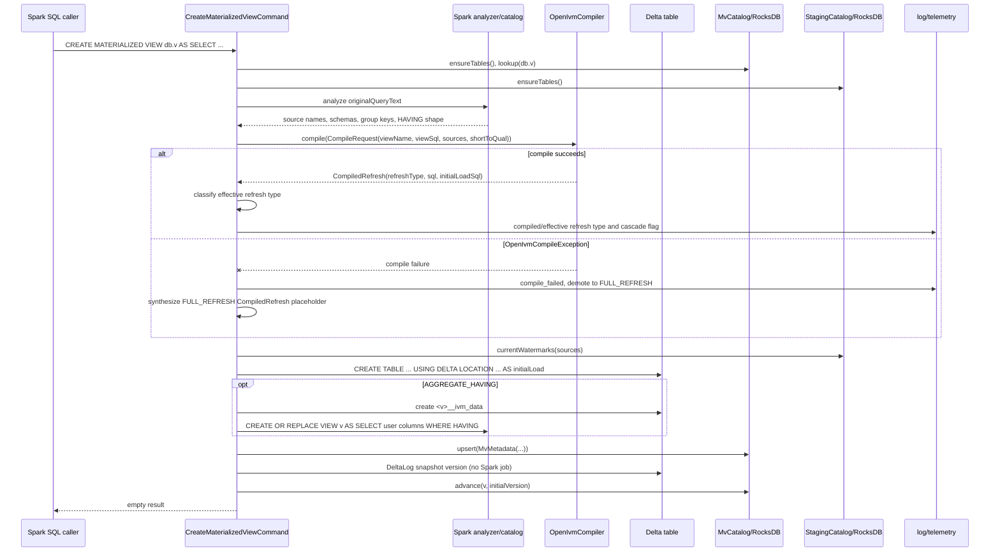
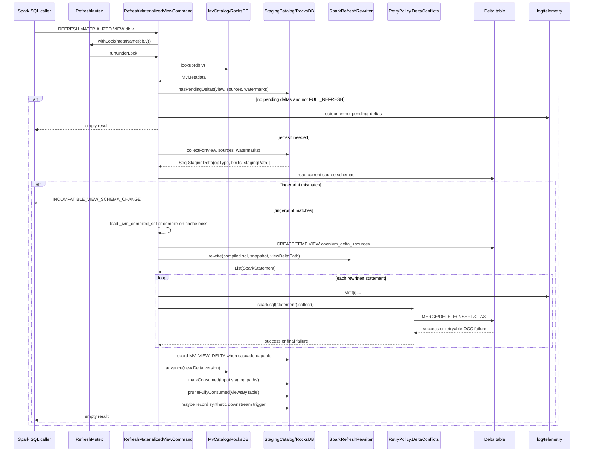
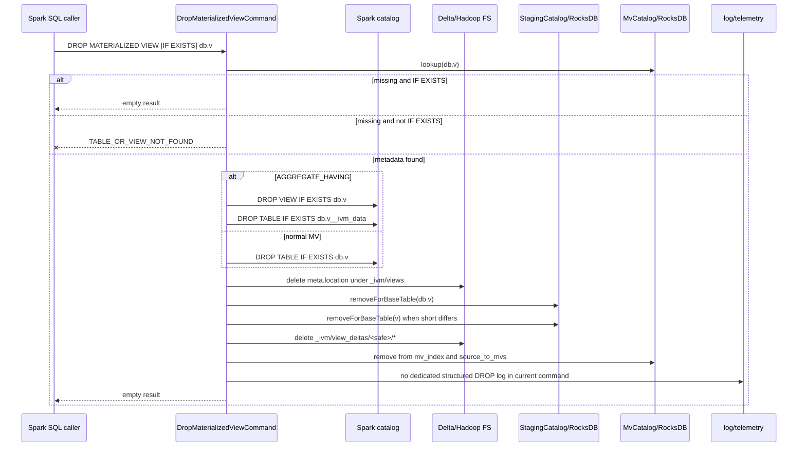

# 8. Materialized-view lifecycle: CREATE, REFRESH, DROP

This page documents the materialized-view lifecycle commands implemented in `MaterializedViewCommands.scala`.
The command classes are:

- `CreateMaterializedViewCommand`
- `RefreshMaterializedViewCommand`
- `DropMaterializedViewCommand`
  Primary implementation file:
- `spark-ext/ivm-extension/src/main/scala/org/openivm/spark/commands/MaterializedViewCommands.scala`
  Related state and helpers:
- `spark-ext/ivm-common/src/main/scala/org/openivm/spark/common/MvCatalog.scala`
- `spark-ext/ivm-common/src/main/scala/org/openivm/spark/common/StagingCatalog.scala`
- `spark-ext/ivm-common/src/main/scala/org/openivm/spark/common/SparkRefreshRewriter.scala`
- `spark-ext/ivm-common/src/main/scala/org/openivm/spark/common/RetryPolicy.scala`
- `spark-ext/ivm-common/src/main/scala/org/openivm/spark/common/FullRefreshAssembler.scala`
- `spark-ext/ivm-compiler/src/main/scala/org/openivm/spark/compiler/OpenIvmCompiler.scala`
  Line-citation note:
- Citations are to the current repository version used for this document.
- Older design notes sometimes say CREATE performs `INSERT OVERWRITE` into an existing table.
- Current CREATE uses `CREATE TABLE IF NOT EXISTS ... USING DELTA LOCATION ... AS ...`.
- Later `FULL_REFRESH` uses `INSERT OVERWRITE TABLE <mv> SELECT * FROM (<viewSql>)`.
- Older design notes sometimes say retry defaults are three exponential attempts.
- Current `RetryPolicy.DeltaConflicts` defaults are five attempts with linear one-second backoff.
- This page documents the current source and calls out those differences explicitly.

______________________________________________________________________

## 1. `CREATE MATERIALIZED VIEW` — `CreateMaterializedViewCommand`

### 1.1 Command shape

`CreateMaterializedViewCommand` is a Spark `LeafRunnableCommand`. It stores the parsed MV name, analyzed query plan, user properties, `IF NOT EXISTS`, provider, and raw view body. The raw view body is `originalQueryText`. That raw body is passed to OpenIVM. That raw body is also the fallback Spark query for `FULL_REFRESH` views.
Source:

- `MaterializedViewCommands.scala:318-331`
- `MaterializedViewCommands.scala:333-337`

### 1.2 Parser context

`IvmParser` routes only OpenIVM DDL statements to the extension parser.
The recognized lifecycle statements are:

- `CREATE MATERIALIZED VIEW`
- `REFRESH MATERIALIZED VIEW`
- `DROP MATERIALIZED VIEW`
  Everything else delegates to Spark's parser.
  Source:
- `IvmParser.scala:23-35`
- `IvmParser.scala:42-44`
- `IvmParser.scala:75-88`

### 1.3 Resolving `db.mv` and db-less identifiers

The command receives a Spark `TableIdentifier`. The identifier may be database-qualified. The identifier may also be database-less. `metaName(id)` serializes it for OpenIVM metadata. If `id.database` is empty, `metaName` returns `id.table`. If `id.database` is present, `metaName` returns `db.table`.
Source:

- `MaterializedViewCommands.scala:95-98`
  `sqlIdent(id)` produces a backtick-quoted Spark SQL identifier. It includes catalog and database segments when present.
  Source:
- `MaterializedViewCommands.scala:99-103`
  `mvLocation(spark, id)` computes the physical Delta location.
  For a db-less MV named `v`, the path is:

```text
<warehouse>/_ivm/views/v
```

For a database-qualified MV named `db.v`, the path is:

```text
<warehouse>/_ivm/views/db/v
```

Source:

- `MaterializedViewCommands.scala:105-110`
  This namespace distinction matters in MV-over-MV chains. A source table may be stored in metadata as `default.t` while an MV command name is db-less. The code therefore matches upstream MVs by both full name and trailing short name in cascade-related paths.
  Source:
- `MaterializedViewCommands.scala:520-530`
- `MaterializedViewCommands.scala:1254-1259`

### 1.4 Catalog initialization and existence check

CREATE starts by ensuring both catalogs exist. It calls `MvCatalog.ensureTables(spark)`. It calls `StagingCatalog.ensureTables(spark)`.
Source:

- `MaterializedViewCommands.scala:336-337`
  Then it checks whether the MV already exists. If the MV exists and `IF NOT EXISTS` was supplied, CREATE returns an empty result. If the MV exists and `IF NOT EXISTS` was not supplied, CREATE raises `TABLE_OR_VIEW_ALREADY_EXISTS`.
  Source:
- `MaterializedViewCommands.scala:339-348`

### 1.5 Discovering source tables

CREATE calls `collectSourceSchemas(spark, originalQueryText)`.
The helper returns four values:

- `qualNames`
- `qualSchemas`
- `compileSchemas`
- `shortToQual`
  Source:
- `MaterializedViewCommands.scala:350-353`
- `MaterializedViewCommands.scala:123-126`
  `qualNames` are the source-table names stored in `MvMetadata.sourceTables`. `qualSchemas` maps each qualified source name to its full Spark schema. `compileSchemas` maps short source names to schemas for the DuckDB/OpenIVM compiler. `shortToQual` maps short source names back to qualified Spark names.
  Source:
- `MaterializedViewCommands.scala:112-122`
- `MaterializedViewCommands.scala:165-172`
  The helper analyzes the Spark SQL text. It extracts sources from `LogicalRelation` when a catalog table is present. It extracts sources from `DataSourceV2Relation` when a V2 identifier is present.
  Source:
- `MaterializedViewCommands.scala:127-142`
  The helper also walks `SubqueryExpression` plans. That catches tables referenced inside nested `EXISTS`, `IN`, and scalar subqueries.
  Source:
- `MaterializedViewCommands.scala:144-160`
  After table names are discovered, CREATE reads schemas with `spark.table(n).schema`.
  Source:
- `MaterializedViewCommands.scala:165-168`

### 1.5b Source constraint facts and metastore cost

CREATE also discovers per-source constraint facts — foreign keys, unique keys, Delta `CHECK` constraints, and generated columns — through `WorkloadFactsRegistry.discover`. Those facts feed the refresh rewriter, so they are collected for every source of every MV.
Source:

- `MaterializedViewCommands.scala:1196`
- `WorkloadFactsRegistry.scala:34-48`
  Each fact source needs one `CatalogTable`: the Delta metadata is read from the resolved table location and the catalog properties come from the same object. `WorkloadFactsRegistry` therefore issues a single `SessionCatalog.getTableMetadata` per source and threads the result into both `deltaProperties` and `catalogProperties`.
  Source:
- `WorkloadFactsRegistry.scala:65-68`
- `WorkloadFactsRegistry.scala:196-233`
  This matters because every Hive metastore read runs inside Spark's globally synchronized Hive client (`HiveExternalCatalog.withClient`). A redundant `getTableMetadata` is not local work — it is a serialized section that every concurrent CREATE and REFRESH queues behind. `DeltaLog.forTable(spark, tableIdentifier)` resolves the identifier through `getTableMetadata` and then delegates to `DeltaLog.forTable(spark, catalogTable)`, so passing the already-resolved `CatalogTable` is the identical code path with the round-trip removed.
  Source:
- `DeltaLog.scala:770-781` (delta-spark 3.2.0)
  `WorkloadFactsCatalogBudgetSpec` pins the budget against a real (Derby-backed) Hive metastore by counting `HiveMetaStore.audit` records: one warmed `discover` of a single Delta source must stay within 4 `get_table` and 2 `get_database` calls. Resolving the table twice costs 6 and 3.
  Source:
- `WorkloadFactsCatalogBudgetSpec.scala`


CREATE analyzes the view body with Spark. It extracts group-by key names. It extracts a `COUNT(*)` alias when the query exposes one. It later extracts a HAVING predicate for `AGGREGATE_HAVING`.
Source:

- `MaterializedViewCommands.scala:354-358`
- `MaterializedViewCommands.scala:175-181`
- `MaterializedViewCommands.scala:208-220`
- `MaterializedViewCommands.scala:245-277`
  CREATE persists these as properties:
- `_ivm_group_keys`
- `_ivm_count_col`
- `_ivm_having_pred`
  Source:
- `MaterializedViewCommands.scala:653-657`

### 1.7 Calling `OpenIvmCompiler.compile(CompileRequest(...))`

CREATE gets a compiler from `OpenIvmCompilers.forSession(spark)`. The compiler is cached per `SparkSession` in a synchronized weak map.
Source:

- `MaterializedViewCommands.scala:34-50`
- `MaterializedViewCommands.scala:367-377`
  The compile call is:

```scala
compiler.compile(
  CompileRequest(
    viewName = name.table,
    viewSql = originalQueryText,
    sources = compileSchemas,
    sourceQualifiedNames = shortToQual
  )
)
```

Source:

- `MaterializedViewCommands.scala:370-376`
- `OpenIvmCompiler.scala:28-33`
  The compiler returns `CompiledRefresh`.
  `CompiledRefresh` contains:
- `refreshType`
- `refreshTypeName`
- `sql`
- `initialLoadSql`
  Source:
- `OpenIvmCompiler.scala:10-16`
  The compiler bridge parses OpenIVM's JSON-lines output from `openivm_compile_with_facts`.
  Source:
- `OpenIvmCompiler.scala:301-310`
- `OpenIvmCompiler.scala:351-370`
  It separately extracts the initial-load SQL from OpenIVM's generated `openivm_data_<view>` CTAS body. That initial-load query may include hidden OpenIVM bookkeeping columns.
  Source:
- `OpenIvmCompiler.scala:313-349`

### 1.8 Compile failure demotion

The compile call is wrapped in `try`/`catch`. The catch handles `OpenIvmCompileException`. On that exception, CREATE logs an error-level demotion message. Then it synthesizes a `CompiledRefresh` with effective `FULL_REFRESH` classification.
Current source shape:

```scala
CompiledRefresh(
  refreshType = RefreshTypeCode.FullRefresh,
  refreshTypeName = "FULL_REFRESH",
  sql = "",
  initialLoadSql = ""
)
```

Source:

- `MaterializedViewCommands.scala:359-393`
  Operationally, this is the same correctness decision as a synthetic:

```scala
CompiledRefresh(
  refreshType = FullRefresh.ordinal,
  sql = fullRefreshSqlFor(viewSql),
  initialLoadSql = viewSql,
  ...
)
```

The current code does not store that full-refresh SQL string in the compile cache. Instead, refresh-time assembly uses the original query SQL.
`FullRefreshAssembler` emits:

```sql
INSERT OVERWRITE TABLE <mv> SELECT * FROM (<viewSql>)
```

Source:

- `FullRefreshAssembler.scala:3-11`
- `FullRefreshAssembler.scala:19-22`
- `MaterializedViewCommands.scala:859-872`

### 1.9 Effective refresh-type classification

A successful compile is not automatically the final refresh type. CREATE applies additional demotion rules. The classification block computes `(effectiveRefreshType, classifyReason)`.
Demotion reasons include:

- top-k queries
- simple projection with no data apply step
- non-cascade upstream MV
- window initial-load mismatch
- missing or unsafe HAVING predicate
- compiled SQL with no real delta
  Source:
- `MaterializedViewCommands.scala:560-618`
  The effective name is `FULL_REFRESH` after demotion. Otherwise it remains the compiler's `refreshTypeName`.
  Source:
- `MaterializedViewCommands.scala:623-625`

### 1.10 Persisting compiled SQL cache

CREATE stores the compile result for incremental views.
The cache properties are:

- `_ivm_compiled_sql`
- `_ivm_compiled_initial_load_sql`
  Source:
- `MaterializedViewCommands.scala:658-664`
- `MvCatalog.scala:89-101`
- `MvCatalog.scala:111-121`
  The cache is suppressed for effective `FULL_REFRESH` views. That means compile failures and later demotions do not persist `_ivm_compiled_sql`.
  Source:
- `MaterializedViewCommands.scala:662-664`
  The current persisted representation is not a single JSON blob. It is a property map containing the SQL strings. REFRESH reconstructs `CompiledRefresh` from those properties.
  Source:
- `MaterializedViewCommands.scala:908-918`

### 1.11 Cascade capability telemetry

CREATE computes whether this MV emits a downstream-consumable view delta.
The condition is:

```scala
RefreshTypeCode.mayEmitCascadeViewDelta(effectiveRefreshType) &&
  SparkRefreshRewriter.hasRealDelta(compiled.sql, name.table)
```

`mayEmitCascadeViewDelta` is a permission set, never a verdict — it adds
`FULL_REFRESH` on top of `emitsCascadeViewDelta` (which stays the fail-closed
fallback for legacy metadata) because openivm's
`refresh_sql.cpp build_split_safe_full_refresh_companion` emits an exact signed
companion around every Spark-dialect FULL_REFRESH recompute. Capability is
decided by `hasRealDelta` over the actual compiled program, not by the label.

Source:
- `MaterializedViewCommands.scala` (`classifyEffectiveRefreshType`)
- `RefreshTypeCode.scala:20-76`
- `SparkRefreshRewriter.scala:1868-1879`
  The classification log line includes `emits_cascade_view_delta='<boolean>'`. That boolean is true only when both conditions are true.
  Source:
- `MaterializedViewCommands.scala:630-639`

### 1.12 `AGGREGATE_HAVING` special handling

`AGGREGATE_HAVING` uses a table/view split. The internal Delta table stores all aggregate groups. The user-facing object is a Spark view that applies HAVING at read time. The internal data table name is `<table>__ivm_data`.
Source:

- `MaterializedViewCommands.scala:232-243`
  CREATE detects incremental `AGGREGATE_HAVING` after effective classification. If true, the Delta target is `dataTableId(name)`. If false, the Delta target is `name`.
  Source:
- `MaterializedViewCommands.scala:641-649`
  After creating the internal Delta table, CREATE creates or replaces the user-facing Spark view. The view selects user output columns from `<mv>__ivm_data`. The view filters with the extracted HAVING predicate.
  Source:
- `MaterializedViewCommands.scala:719-743`
  REFRESH also redirects merge targets to `<mv>__ivm_data` for `AGGREGATE_HAVING`.
  Source:
- `MaterializedViewCommands.scala:974-982`
  DROP removes both the Spark view and the sibling Delta table.
  Source:
- `MaterializedViewCommands.scala:1376-1382`

### 1.13 Source watermarks

CREATE captures current source watermarks before the initial materialization.
The call is:

```scala
StagingCatalog.currentWatermarks(spark, qualNames)
```

Source:

- `MaterializedViewCommands.scala:665-670`
- `StagingCatalog.scala:250-268`
  Watermark properties are named:

```text
_ivm_watermark:<source>
```

Source:

- `MvCatalog.scala:45-58`
- `MvCatalog.scala:78-105`
  These watermarks prevent CREATE from double-applying older staging rows during the first REFRESH. The initial snapshot already includes the live source state.

### 1.14 Schema fingerprint

CREATE fingerprints current source schemas. If a source is itself an MV, the fingerprint also includes that upstream MV identity hash.
Source:

- `MaterializedViewCommands.scala:676-681`
- `MvCatalog.scala:553-593`
  The fingerprint is stored in `MvMetadata.sourceSchemaFingerprint`. REFRESH later recomputes it before rewrite and execution.
  Source:
- `MaterializedViewCommands.scala:829-854`

### 1.15 Metadata row

CREATE builds `MvMetadata` with:

- MV name
- original query SQL
- effective refresh type
- effective refresh type name
- `lastVersion = -1L`
- source table list
- source schema fingerprint
- physical Delta location
- creation timestamp
- properties
  Source:
- `MaterializedViewCommands.scala:683-694`
- `MvCatalog.scala:18-43`
  The row is written with `MvCatalog.upsert`. `upsert` writes the per-MV metadata. It also writes global `mv_index` and `source_to_mvs` indexes.
  Source:
- `MaterializedViewCommands.scala:745-746`
- `MvCatalog.scala:413-451`

### 1.16 Initial load

CREATE chooses the initial-load SQL. For `FULL_REFRESH`, it uses the original view body. For incremental refresh types, it prefers translated `compiled.initialLoadSql` when non-empty. If no initial-load SQL is available, it falls back to the original view body.
Source:

- `MaterializedViewCommands.scala:696-711`
  Current CREATE then runs CTAS:

```sql
CREATE TABLE IF NOT EXISTS <mv-or-data-table>
USING DELTA
LOCATION '<warehouse>/_ivm/views/...'
AS <viewBodySql>
```

Source:

- `MaterializedViewCommands.scala:712-718`
  The DML interceptor is bypassed while the MV table is created.
  Source:
- `MaterializedViewCommands.scala:715-718`
- `MaterializedViewCommands.scala:752-754`
  After CTAS and metadata write, CREATE reads the latest Delta version. It advances `lastVersion` from `-1` to that initial snapshot version.
  Source:
- `MaterializedViewCommands.scala:749-751`
- `MvCatalog.scala:485-508`

### 1.17 CREATE sequence diagram



______________________________________________________________________

## 2. `REFRESH MATERIALIZED VIEW` — `RefreshMaterializedViewCommand`

### 2.1 Command shape and mutex

`RefreshMaterializedViewCommand` is a Spark `LeafRunnableCommand`. Its public `run` method wraps refresh execution in a per-MV mutex. The lock key is `metaName(name)`.
Source:

- `MaterializedViewCommands.scala:764-778`
  The mutex is implemented by `RefreshMutex`. It is JVM-wide. It maps fully-qualified MV names to lock objects.
  Source:
- `MaterializedViewCommands.scala:53-87`
  The lock is necessary because the retry harness retries individual MERGE statements without re-reading the staging snapshot. Without the lock, two threads could collect the same unconsumed delta and both apply it.
  Source:
- `MaterializedViewCommands.scala:53-61`
- `MaterializedViewCommands.scala:771-777`

### 2.2 Loading metadata and compile cache

Under the lock, REFRESH loads `MvMetadata`. If metadata is missing, it raises `TABLE_OR_VIEW_NOT_FOUND`.
Source:

- `MaterializedViewCommands.scala:780-791`
  The command reads source watermarks from metadata properties.
  Source:
- `MaterializedViewCommands.scala:793-795`
- `MvCatalog.scala:45-58`
  For incremental views, REFRESH later reads `_ivm_compiled_sql` and `_ivm_compiled_initial_load_sql`.
  Source:
- `MaterializedViewCommands.scala:897-918`
  If the cache is missing, REFRESH recompiles and back-fills the properties.
  Source:
- `MaterializedViewCommands.scala:919-941`

### 2.3 Pending-delta probe

For non-`FULL_REFRESH` views, REFRESH first checks whether pending deltas exist. It calls `StagingCatalog.hasPendingDeltas` with the MV name, source tables, and watermarks.
Source:

- `MaterializedViewCommands.scala:796-805`
- `StagingCatalog.scala:183-205`
  If no pending deltas exist, REFRESH logs `outcome='no_pending_deltas'` and returns.
  Source:
- `MaterializedViewCommands.scala:800-805`

### 2.4 Collecting the staging snapshot

REFRESH collects staging with:

```scala
StagingCatalog.collectFor(
  spark,
  viewNameStr,
  meta.sourceTables,
  sourceWatermarks
)
```

Source:

- `MaterializedViewCommands.scala:807-812`
- `StagingCatalog.scala:207-248`
  Each returned item is a `StagingDelta`.
  A `StagingDelta` contains:
- `baseTable`
- `opType`
- `stagingPath`
- `txnTs`
- `consumedBy`
  Source:
- `StagingCatalog.scala:11-27`
  This is the implementation equivalent of `Snapshot[op, txnTs, deltaPath]`. The collector filters by watermark. The collector filters out paths already consumed by this MV. The returned sequence is ordered by transaction timestamp.
  Source:
- `StagingCatalog.scala:223-248`
  A second no-delta guard handles races between the cheap probe and full collection.
  Source:
- `MaterializedViewCommands.scala:814-822`

### 2.5 Schema fingerprint check

Before rewriting or executing, REFRESH reads current source schemas.
Source:

- `MaterializedViewCommands.scala:829-843`
  It recomputes the source-schema fingerprint. It includes upstream MV identity hashes when a source is itself an MV.
  Source:
- `MaterializedViewCommands.scala:833-843`
- `MvCatalog.scala:553-593`
  If the fingerprint differs, REFRESH throws `INCOMPATIBLE_VIEW_SCHEMA_CHANGE`.
  Source:
- `MaterializedViewCommands.scala:843-854`
  Important correction:
- Current code does not force `FULL_REFRESH` on fingerprint mismatch.
- It aborts with an analysis exception.
- Recovery is DROP and recreate, with stale staging handled explicitly when needed.
  `SchemaEvolutionSpec.clearStaging` exists for that recovery path.
  Source:
- `SchemaEvolutionSpec.scala:116-128`
- `SchemaEvolutionSpec.scala:170-178`

### 2.6 `FULL_REFRESH` path

If metadata says `FULL_REFRESH`, REFRESH assembles a full-refresh program. The assembler input uses `meta.querySql` as the source query.
Source:

- `MaterializedViewCommands.scala:856-867`
  `FullRefreshAssembler` emits:

```sql
INSERT OVERWRITE TABLE <mv> SELECT * FROM (<viewSql>)
```

Source:

- `FullRefreshAssembler.scala:19-22`
  REFRESH bypasses DML interception while executing internal writes. Each statement is wrapped in `RetryPolicy.DeltaConflicts.execute`.
  Source:
- `MaterializedViewCommands.scala:868-883`
  On success, it calls `postRefreshCleanup`.
  Source:
- `MaterializedViewCommands.scala:873-884`

### 2.7 Incremental rewrite path

For incremental views, REFRESH reconstructs compiler source maps from current schemas.
Source:

- `MaterializedViewCommands.scala:887-896`
  It uses cached compiled SQL when available.
  Source:
- `MaterializedViewCommands.scala:908-918`
  It creates a per-refresh view-delta path under:

```text
<warehouse>/_ivm/view_deltas/<safe-qualified-mv-name>/<uuid>
```

Source:

- `MaterializedViewCommands.scala:944-956`
  It groups collected staging deltas by base table.
  Source:
- `MaterializedViewCommands.scala:957-958`
  It creates source-delta temp views for every source table. Sources with no pending delta get an empty temp view.
  Source:
- `MaterializedViewCommands.scala:960-972`
  For `AGGREGATE_HAVING`, the merge target is `<mv>__ivm_data`.
  Source:
- `MaterializedViewCommands.scala:974-982`
  Then REFRESH calls `SparkRefreshRewriter.rewrite`. The call passes compiled SQL, MV target, MV location, source temp views, view-delta path, dialect post-processing, source schemas, source-name mapping, and MV version.
  Source:
- `MaterializedViewCommands.scala:983-1004`
  The rewriter returns a list of Spark-executable SQL statements.

### 2.8 Sequential execution with retry

REFRESH logs each rewritten statement with an index.
Source:

- `MaterializedViewCommands.scala:1017-1026`
  It executes statements sequentially.
  The helper is:

```scala
def executeSql(sql: String): Unit =
  RetryPolicy.DeltaConflicts.execute { spark.sql(sql).collect() }
```

Source:

- `MaterializedViewCommands.scala:1027-1028`
  Retry is therefore around each statement. Retry is not around the whole refresh. If statement 3 fails, statement 3 is retried. The staging snapshot is not recollected for each retry.

> **Important:** A failure after a target statement commits but before input
> changes are marked consumed can replay that statement on the next REFRESH.
> Multi-statement incremental refresh is therefore at-least-once across this
> failure boundary. This limitation applies to additive projection inserts and
> other non-idempotent statements.

### 2.9 Simple-projection signed-bag application

Simple projection applies mixed signed rows incrementally. The first statement
(stmt\[0\], the view-delta CTAS) runs under the per-statement plan-time
broadcast disable (see §2.9b). The command probes only for negative rows.
Positive-only deltas skip the delete merge.
Source:

- `MaterializedViewCommands.scala`, SIMPLE_PROJECTION execution branch

The rewriter consolidates raw signed rows by the complete output tuple. It
creates one `__openivm_net` value per tuple and drops zero-net groups. Negative
groups use a value-equality delete merge, followed by replenishment from the
pre-delete Delta version. Positive groups insert exactly their net
multiplicity. This program preserves bag semantics without a one-off full
recompute.

stmt\[0\]'s raw signed Δ(MV) remains the downstream cascade feed. Local net
consolidation changes only how the current MV applies that delta.

This path is separate from the CREATE-time `simple_projection_no_apply`
demotion documented in chapter 11 §3.2. Metadata remains
`SIMPLE_PROJECTION`.

### 2.9b Refresh-scoped broadcast disables

openivm-emitted recompute programs compose long CTE chains over multi-table
joins. Catalyst's plan-time row-count estimates for these chains are derived
from compressed Parquet file sizes and don't account for row expansion
through SCD2 range joins, count monoids, or LEFT SEMI / LEFT OUTER joins
that may not push down through the chain. Without protection, the resulting
broadcast exchanges exceed Spark's hard-coded 8 GiB
`BroadcastExchangeExec` cap and the refresh fails deterministically — which
`dbt-spark-livy`'s `retry_all` then loops on for hours, masquerading as
flakiness.

REFRESH installs two complementary defences inside the cloned session
scope (so neither leaks to sibling refreshes or user queries):

**AQE runtime promotion cap (whole-refresh scope).** REFRESH sets
`spark.sql.adaptive.autoBroadcastJoinThreshold = -1` on the cloned session
for the entire refresh. This blocks AQE from PROMOTING a join to broadcast
at runtime based on post-shuffle stats from an openivm CTE chain whose true
row count it cannot predict. Plan-time
`spark.sql.autoBroadcastJoinThreshold` is left untouched so genuinely
small-side broadcasts that Catalyst chooses at plan time (e.g. the
`SELECT DISTINCT key FROM <view_deltas>` USING source of a delete-merge)
still happen.
Source: `MaterializedViewCommands.scala:1120`.

**Plan-time per-statement broadcast disable (targeted).** The helper
`withPlanTimeBroadcastDisabled` saves and restores
`spark.sql.autoBroadcastJoinThreshold` around a body, setting it to `-1`
only while a specific high-risk action executes. The conf must remain set
across the DataFrame action (`.cache()` + `.count()` on the fused path,
`.collect()` on the on-disk path), not just construction, because
Catalyst plans lazily inside the action.
Source: `MaterializedViewCommands.scala:1153-1163`.

It is applied narrowly to the statement shapes that wrap the *full MV body*:

- the SIMPLE_PROJECTION view-delta CTAS (both fused fast path and on-disk
  CTAS fallback);
- the negative-row + conflict probes that read from the fused CTAS lineage;
- the SIMPLE_PROJECTION fallback's `INSERT OVERWRITE` statements;
- every openivm-emitted MERGE in the SIMPLE_PROJECTION tail (gated by
  `SparkRefreshRewriter.isMergeStatement`);
- in the non-SIMPLE_PROJECTION path, every openivm-emitted MERGE and every
  view-delta CTAS for the active `viewDeltaPath` (gated by
  `isMergeStatement` or `extractViewDeltaCtasBody`).

The ordinary persisted `FULL_REFRESH` path (`refreshType = FullRefresh`
at metadata read time, before any rewrite) is **not** wrapped: that path
executes the user's original query directly via `INSERT OVERWRITE` and does
not go through the openivm CTE chains that motivated the wraps.
Source: `MaterializedViewCommands.scala:1860-1863`, `:1906-1911`,
`:1696`, `:1757`, `:1773`, `:1827-1828`.

### 2.10 Count-monoid cleanup

For count-monoid refresh types, REFRESH deletes rows whose count column has reached zero.
Affected types are:

- `AGGREGATE_GROUP`
- `AGGREGATE_HAVING`
- `DISTINCT_INCREMENTAL`
  Source:
- `MaterializedViewCommands.scala:1093-1105`
- `MaterializedViewCommands.scala:1318-1325`
  The count column is chosen from:
- `openivm_count_star`
- `openivm_distinct_count`
- `_ivm_count_col`
  Source:
- `MaterializedViewCommands.scala:1327-1352`
  The DELETE is also executed through `RetryPolicy.DeltaConflicts.execute`.
  Source:
- `MaterializedViewCommands.scala:1100-1104`

### 2.11 Marking success and cascade

If the MV emits cascade view-deltas, REFRESH records a `StagingDelta` with `opType = MV_VIEW_DELTA`.
Source:

- `MaterializedViewCommands.scala:1107-1155`
- `StagingCatalog.scala:63-69`
  The staging path is the per-refresh view-delta Delta table. The base-table key is chosen to match downstream MVs that may reference the upstream by qualified or short name.
  Source:
- `MaterializedViewCommands.scala:1125-1142`
  The success ordering is documented in source:

1. execute the refresh program
1. run count-monoid cleanup
1. record `MV_VIEW_DELTA`
1. run `postRefreshCleanup`
   Source:

- `MaterializedViewCommands.scala:1114-1119`

### 2.12 `postRefreshCleanup`

`postRefreshCleanup` reads the latest Delta version and advances MV metadata.
Source:

- `MaterializedViewCommands.scala:1269-1272`
  It marks input staging paths consumed by this MV.
  Source:
- `MaterializedViewCommands.scala:1273-1275`
- `StagingCatalog.scala:270-283`
  It builds a source-to-MVs map and prunes rows consumed by all dependent MVs.
  Source:
- `MaterializedViewCommands.scala:1276-1282`
- `StagingCatalog.scala:285-317`
  For non-cascade upstreams, it may synthesize trigger rows for downstream MVs. Those trigger rows cause downstream REFRESH to run. They are not real data deltas.
  Source:
- `MaterializedViewCommands.scala:1283-1315`

### 2.13 Failure cleanup

If incremental execution fails, REFRESH deletes the partial view-delta path on a best-effort basis. It throws a `RuntimeException` that includes the rewritten SQL program.
Source:

- `MaterializedViewCommands.scala:1156-1168`
  The `finally` block disables DML-interceptor bypass and drops temp views.
  Source:
- `MaterializedViewCommands.scala:1171-1178`

### 2.14 REFRESH sequence diagram



### 2.15 REFRESH code-flow diagram

```mermaid
flowchart TD
    A[REFRESH MATERIALIZED VIEW] --> B[RefreshMutex.withLock(metaName)]
    B --> C[Load MvMetadata]
    C --> D{MV exists?}
    D -- no --> E[Throw TABLE_OR_VIEW_NOT_FOUND]
    D -- yes --> F{refreshType != FULL_REFRESH?}
    F -- yes --> G[hasPendingDeltas with source watermarks]
    G --> H{pending?}
    H -- no --> I[Log no_pending_deltas and return]
    H -- yes --> J[collectFor view/source/watermarks]
    F -- no --> J
    J --> K{incremental and snapshot empty?}
    K -- yes --> I
    K -- no --> L[Recompute source schemas and upstream MV identities]
    L --> M{schema fingerprint matches?}
    M -- no --> N[Throw INCOMPATIBLE_VIEW_SCHEMA_CHANGE]
    M -- yes --> O{FULL_REFRESH?}
    O -- yes --> P[Assemble INSERT OVERWRITE from original query]
    P --> Q[RetryPolicy.DeltaConflicts.execute per statement]
    Q --> R{retryable conflict?}
    R -- yes and attempts left --> Q
    R -- no or success --> S[postRefreshCleanup]
    O -- no --> T[Load _ivm_compiled_sql or compile and back-fill]
    T --> U[Create openivm_delta_source temp views]
    U --> V[SparkRefreshRewriter.rewrite]
    V --> V1{SIMPLE_PROJECTION?}
    V1 -- yes --> V2["Execute stmt[0] view-delta CTAS under withPlanTimeBroadcastDisabled"]
    V2 --> Z{conflicting signed rows? probes under broadcast-disable}
    Z -- yes --> AA[Force one-off FULL_REFRESH recompute under broadcast-disable. Preserve viewDeltaPath and cascade meta.]
    Z -- no --> W2[Execute tail statements via RetryPolicy. Wrap each MERGE in broadcast-disable.]
    V1 -- no --> W[Execute rewritten statements via RetryPolicy. Wrap each MERGE or matching view-delta CTAS in broadcast-disable.]
    W --> X{any final failure?}
    W2 --> X
    AA --> X
    X -- yes --> Y[Delete partial viewDeltaPath; throw rewritten SQL]
    X -- no --> AB[Count-monoid zero-row cleanup]
    AB --> AC{emitsCascadeViewDelta?}
    AC -- yes --> AD[Record MV_VIEW_DELTA staging rows]
    AC -- no --> AE[No cascade row]
    AD --> S
    AE --> S
    S --> AF[Advance lastVersion]
    AF --> AG[markConsumed input staging]
    AG --> AH[pruneFullyConsumed]
    AH --> AI{upstream snapshot trigger needed?}
    AI -- yes --> AJ[Record synthetic replacement trigger row]
    AI -- no --> AK[Return]
    AJ --> AK
```

______________________________________________________________________

## 3. `DROP MATERIALIZED VIEW` — `DropMaterializedViewCommand`

### 3.1 Command shape

`DropMaterializedViewCommand` stores the MV name and `IF EXISTS` flag.
Source:

- `MaterializedViewCommands.scala:1355-1362`

### 3.2 Verify MV exists

DROP first calls `MvCatalog.lookup`. If no metadata exists and `IF EXISTS` is true, DROP is a no-op. If no metadata exists and `IF EXISTS` is false, DROP raises `TABLE_OR_VIEW_NOT_FOUND`.
Source:

- `MaterializedViewCommands.scala:1364-1375`

### 3.3 Delete Spark catalog objects

For `AGGREGATE_HAVING`, the user-facing object is a Spark view. The data table is the sibling table `<mv>__ivm_data`. DROP removes both.
Source:

- `MaterializedViewCommands.scala:1376-1382`
  For other refresh types, DROP removes the Spark table registration.
  Source:
- `MaterializedViewCommands.scala:1382-1385`

### 3.4 Delete Delta table at `_ivm/views/db/mv/`

DROP deletes the physical Delta files at `meta.location`. That is the path under `<warehouse>/_ivm/views/...` computed at CREATE.
Source:

- `MaterializedViewCommands.scala:1387-1390`
- `MaterializedViewCommands.scala:105-110`

### 3.5 Delete `_ivm/view_deltas/<safe>/*`

DROP computes a safe MV name from `metaName(name)`.
It deletes the per-MV view-delta namespace:

```text
<warehouse>/_ivm/view_deltas/<safe-mv-name>
```

Source:

- `MaterializedViewCommands.scala:1407-1413`
  This removes per-refresh cascade-delta Delta tables for the dropped MV.

### 3.6 Remove from `MvCatalog`

DROP calls `MvCatalog.remove(spark, name)`.
Source:

- `MaterializedViewCommands.scala:1415-1417`
  `MvCatalog.remove` closes and deletes the per-MV RocksDB directory. It deletes the `mv_index` entry. It deletes `source_to_mvs` entries for the MV's sources.
  Source:
- `MvCatalog.scala:529-551`

### 3.7 Sharp edge: staging orphans

There are two categories of staging rows. First: rows where the dropped MV itself is the staged `baseTable`. These are MV-over-MV cascade rows. Current DROP removes those rows for qualified and short-name forms.
Source:

- `MaterializedViewCommands.scala:1392-1405`
- `StagingCatalog.scala:319-329`
  Second: rows for the MV's source base tables. DROP does not globally prune all old source-table staging rows merely because one MV was dropped. That is the sharp edge in schema-evolution tests. If a test drops and recreates the same MV name after source-table changes, stale source-table staging can be re-applied unless cleared. `SchemaEvolutionSpec.clearStaging` marks those rows consumed by a fake MV and prunes them.
  Source:
- `SchemaEvolutionSpec.scala:116-128`
- `SchemaEvolutionSpec.scala:170-178`
- `SchemaEvolutionSpec.scala:220-258`
- `SchemaEvolutionSpec.scala:320-335`
  Operational rule:
- DROP removes MV data.
- DROP removes per-MV view-deltas.
- DROP removes MV metadata and source indexes.
- DROP removes staging rows where the MV is the upstream base key.
- DROP does not certify that all old staging rows for the MV's source base tables are gone.
- Tests that DROP and CREATE the same name after source schema churn must clear staging explicitly.

### 3.8 DROP sequence diagram



______________________________________________________________________

## 4. `RetryPolicy`

### 4.1 Retry is around Delta statements, not the whole refresh

In the full-refresh path, each assembled statement is retried independently.
Source:

- `MaterializedViewCommands.scala:870-872`
  In the incremental path, the helper `executeSql` wraps each rewritten statement.
  Source:
- `MaterializedViewCommands.scala:1027-1028`
  The count-monoid cleanup DELETE is also retried independently.
  Source:
- `MaterializedViewCommands.scala:1100-1104`
  Retry does not cover the entire refresh operation. Retry does not recollect staging rows. Retry does not recompute the rewrite plan. Retry only re-evaluates the by-name statement operation passed to `RetryPolicy.execute`.
  Source:
- `RetryPolicy.scala:25-31`

### 4.2 Current retry defaults

`RetryPolicy` constructor defaults are:

- `maxAttempts = RetryPolicy.DefaultMaxAttempts`
- `backoffMs = RetryPolicy.DefaultBackoffMs`
  Source:
- `RetryPolicy.scala:17-21`
  Current defaults are:
- `DefaultMaxAttempts = 5`
- `DefaultBackoffMs = 1000`
  Source:
- `RetryPolicy.scala:77-83`
  The current backoff is linear:

```scala
val sleep = backoffMs * attempt
```

Source:

- `RetryPolicy.scala:38-46`
  Therefore default sleeps before retries are:
- 1000 ms after the first failed attempt
- 2000 ms after the second failed attempt
- 3000 ms after the third failed attempt
- 4000 ms after the fourth failed attempt
  The fifth failed attempt is final. This is not the older three-attempt `100 ms / 400 ms / 1600 ms` exponential shape sometimes referenced in stale design notes.

### 4.3 Retryable errors

`RetryPolicy.DeltaConflicts` uses `SparkExceptions.DefaultDeltaRetryPatterns`.
Source:

- `RetryPolicy.scala:85-91`
- `SparkExceptions.scala:63-79`
  The patterns include:
- `DELTA_METADATA_CHANGED`
- `DELTA_PROTOCOL_CHANGED`
- `DELTA_CONCURRENT_APPEND`
- `DELTA_CONCURRENT_DELETE_READ`
- `DELTA_CONCURRENT_DELETE_DELETE`
- `DELTA_CONCURRENT_TRANSACTION`
- `AlreadyExistsException`
- `DELTA_CREATE_TABLE_WITH_NON_EMPTY_LOCATION`
- `SparkFileNotFoundException`
  Source:
- `SparkExceptions.scala:12-79`
  A pattern can match either exception class name or exception message. The matcher walks the cause chain.
  Source:
- `RetryPolicy.scala:56-70`

______________________________________________________________________

## 5. Concrete CREATE example

### 5.1 SQL

Assume this table exists:

```sql
CREATE TABLE default.sales (
  k INT,
  v INT
) USING DELTA;
```

Create a materialized view:

```sql
CREATE MATERIALIZED VIEW v AS
SELECT
  k,
  SUM(v) AS total_v
FROM default.sales
GROUP BY k;
```

The MV identifier is db-less: `v`. The source identifier resolves as `default.sales`.

### 5.2 Walk-through

Step 1: `IvmParser` routes the SQL to the OpenIVM AST builder.
Source:

- `IvmParser.scala:23-35`
- `IvmParser.scala:42-44`
  Step 2: CREATE initializes `MvCatalog` and `StagingCatalog`.
  Source:
- `MaterializedViewCommands.scala:336-337`
  Step 3: CREATE verifies that `v` is not already tracked.
  Source:
- `MaterializedViewCommands.scala:339-348`
  Step 4: CREATE analyzes the view body. It discovers `default.sales` as a source table.
  Source:
- `MaterializedViewCommands.scala:123-172`
  Step 5: CREATE fetches the full source schema. The schema is `k INT, v INT`.
  Source:
- `MaterializedViewCommands.scala:165-168`
  Step 6: CREATE extracts group keys. `_ivm_group_keys` becomes `k`.
  Source:
- `MaterializedViewCommands.scala:175-181`
- `MaterializedViewCommands.scala:653-655`
  Step 7: CREATE calls OpenIVM.
  The compile request is conceptually:

```scala
CompileRequest(
  viewName = "v",
  viewSql = "SELECT k, SUM(v) AS total_v FROM default.sales GROUP BY k",
  sources = Map("sales" -> StructType(k INT, v INT)),
  sourceQualifiedNames = Map("sales" -> "default.sales")
)
```

Source:

- `MaterializedViewCommands.scala:367-377`
- `OpenIvmCompiler.scala:28-33`
  Step 8: OpenIVM returns a `CompiledRefresh`. A grouped SUM normally classifies as an aggregate refresh type such as `AGGREGATE_GROUP`.
  Source:
- `OpenIvmCompiler.scala:351-370`
- `RefreshTypeCode.scala:7-18`
  Step 9: CREATE applies demotion checks. If no demotion fires, the effective refresh type remains incremental.
  Source:
- `MaterializedViewCommands.scala:597-618`
  Step 10: CREATE computes cascade capability. For aggregate-group refresh, it is true only if the compiled SQL has a real view delta.
  Source:
- `MaterializedViewCommands.scala:626-629`
- `SparkRefreshRewriter.scala:1868-1879`
  Step 11: CREATE captures watermarks for `default.sales`. If there were no previous staging rows, no watermark entry is written for that source.
  Source:
- `MaterializedViewCommands.scala:665-670`
- `StagingCatalog.scala:250-268`
  Step 12: CREATE fingerprints `default.sales` schema. The hash is stored in `sourceSchemaFingerprint`.
  Source:
- `MaterializedViewCommands.scala:676-681`
- `MvCatalog.scala:553-580`
  Step 13: CREATE picks initial-load SQL. For incremental aggregate refresh, it prefers `compiled.initialLoadSql` because it may include hidden columns.
  Source:
- `MaterializedViewCommands.scala:696-711`
  Step 14: CREATE creates the Delta table.
  The path is:

```text
<warehouse>/_ivm/views/v
```

The SQL shape is:

```sql
CREATE TABLE IF NOT EXISTS `v`
USING DELTA
LOCATION '<warehouse>/_ivm/views/v'
AS <initial-load-query>
```

Source:

- `MaterializedViewCommands.scala:105-110`
- `MaterializedViewCommands.scala:712-718`
  Step 15: CREATE writes `MvMetadata`.
  Source:
- `MaterializedViewCommands.scala:683-694`
- `MaterializedViewCommands.scala:745-746`
  Step 16: CREATE advances `lastVersion` to the initial Delta table version.
  Source:
- `MaterializedViewCommands.scala:749-751`
- `MvCatalog.scala:485-508`

### 5.3 RocksDB after CREATE

The global index DB contains an `mv_index` entry.
Conceptual entry:

```text
cf=mv_index
key=v
value=<warehouse>/_openivm/mvs/v/rocksdb
```

Source:

- `MvCatalog.scala:129-135`
- `MvCatalog.scala:443-449`
  The global index DB contains a `source_to_mvs` entry.
  Conceptual entry:

```text
cf=source_to_mvs
key=(default.sales, v)
value=<empty>
```

Source:

- `MvCatalog.scala:230-235`
- `MvCatalog.scala:430-442`
  The per-MV DB contains metadata.
  Conceptual entries:

```text
name=v
query_sql=SELECT k, SUM(v) AS total_v FROM default.sales GROUP BY k
refresh_type=0
refresh_type_name=AGGREGATE_GROUP
last_version=<initial-delta-version>
source_tables=default.sales
source_schema_fingerprint=<sha256>
location=<warehouse>/_ivm/views/v
created_at=<millis>
```

Source:

- `MvCatalog.scala:139-148`
- `MvCatalog.scala:297-317`
  The per-MV DB contains properties.
  Conceptual properties:

```text
_ivm_group_keys=k
_ivm_emits_cascade_view_delta=true
_ivm_compiled_sql=<OpenIVM multi-statement refresh SQL>
_ivm_compiled_initial_load_sql=<initial SELECT, if non-empty>
```

If the view demoted to `FULL_REFRESH`, `_ivm_compiled_sql` is absent.
Source:

- `MaterializedViewCommands.scala:653-664`
- `MvCatalog.scala:89-121`
  The staging catalog normally has no new row from the MV creation. The command bypasses DML interception during CTAS.
  Source:
- `MaterializedViewCommands.scala:715-718`
- `MaterializedViewCommands.scala:752-754`

### 5.4 Delta after CREATE

The Delta table exists at:

```text
<warehouse>/_ivm/views/v
```

It contains the grouped SUM snapshot. It may include hidden OpenIVM bookkeeping columns required by incremental refresh.
Source:

- `OpenIvmCompiler.scala:313-349`
- `MaterializedViewCommands.scala:696-718`
  The Spark catalog has a table named `v` registered at that location. For this non-HAVING example, there is no `v__ivm_data` table. For `AGGREGATE_HAVING`, `v` would be a view and `v__ivm_data` would be the Delta table.
  Source:
- `MaterializedViewCommands.scala:641-649`
- `MaterializedViewCommands.scala:719-743`

### 5.5 Log after CREATE

A kept incremental aggregate view logs a classification line like:

```text
[openivm-mv] view='`v`' compiled_refresh_type='AGGREGATE_GROUP' effective_refresh_type='AGGREGATE_GROUP' reason='kept' emits_cascade_view_delta='true' time_travel_pin_status='NOT_APPLICABLE'
```

Source:

- `MaterializedViewCommands.scala:630-639`
  A compile failure logs a demotion line like:

```text
[openivm-mv] view='`v`' compiled_refresh_type='COMPILE_FAILED' effective_refresh_type='FULL_REFRESH' reason='compile_failed' cause=...
```

Source:

- `MaterializedViewCommands.scala:379-386`
  A later demotion logs a classification line with its reason.
  Source:
- `MaterializedViewCommands.scala:560-639`

______________________________________________________________________

## 6. Lifecycle invariants

### 6.1 CREATE invariants

CREATE resolves source tables from Spark analysis. CREATE uses full source schemas, not projected schemas. CREATE passes short source names to OpenIVM. CREATE preserves a short-to-qualified map for Spark rewrites. CREATE catches `OpenIvmCompileException` and demotes to `FULL_REFRESH`. CREATE logs every effective refresh-type decision. CREATE stores `_ivm_compiled_sql` only for incremental views. CREATE materializes a Delta snapshot that is bag-equal to the view query. CREATE stores source watermarks before initial materialization. CREATE writes `MvMetadata` and indexes after table creation. CREATE advances the initial Delta version after metadata write. CREATE creates a user-facing Spark view for incremental `AGGREGATE_HAVING`.

### 6.2 REFRESH invariants

REFRESH serializes per MV inside the JVM. REFRESH collects only unconsumed staging rows newer than source watermarks. REFRESH validates source schema fingerprint before execution. REFRESH uses cached compiled SQL when possible. REFRESH creates source delta temp views for all sources. REFRESH rewrites OpenIVM SQL into Spark-executable statements. REFRESH executes statements sequentially. REFRESH retries each Delta/Spark statement independently. REFRESH records cascade view-deltas only after the view-delta path is written. REFRESH marks input staging consumed only after success. REFRESH advances metadata to the latest Delta version. REFRESH prunes staging rows only after all dependent MVs consumed them.

### 6.3 DROP invariants

DROP is a no-op for missing MVs only with `IF EXISTS`. DROP removes Spark catalog objects. DROP deletes the `_ivm/views/...` Delta location. DROP deletes the per-MV `_ivm/view_deltas/...` namespace. DROP removes MV metadata from `mv_index`. DROP removes source reverse-index entries from `source_to_mvs`. DROP handles the `AGGREGATE_HAVING` view/data-table split. DROP removes staging rows where the dropped MV is the upstream base key. DROP does not guarantee cleanup of every old source-table staging row.

### 6.4 Practical review checklist

## When reviewing CREATE changes, check source discovery. When reviewing CREATE changes, check db-less and db-qualified MV names. When reviewing CREATE changes, check compiler demotion behavior. When reviewing CREATE changes, check initial-load SQL selection. When reviewing CREATE changes, check `_ivm_compiled_sql` persistence. When reviewing CREATE changes, check watermarks. When reviewing CREATE changes, check `AGGREGATE_HAVING` view creation. When reviewing REFRESH changes, check mutex coverage. When reviewing REFRESH changes, check staging collection. When reviewing REFRESH changes, check fingerprint failure behavior. When reviewing REFRESH changes, check retry scope. When reviewing REFRESH changes, check statement ordering. When reviewing REFRESH changes, check cascade view-delta ordering. When reviewing REFRESH changes, check `markConsumed` placement. When reviewing DROP changes, check Spark table/view deletion. When reviewing DROP changes, check Delta file deletion. When reviewing DROP changes, check view-delta namespace deletion. When reviewing DROP changes, check `MvCatalog.remove`. When reviewing DROP changes, check stale staging assumptions.

______________________________________________________________________

## 8. Mental model

CREATE is compile plus snapshot. It resolves Spark sources. It calls DuckDB/OpenIVM. It demotes when needed. It writes a Delta initial state. It writes RocksDB metadata. It caches incremental SQL. It records watermarks. REFRESH is serialized apply. It collects staged source deltas. It checks schema compatibility. It rewrites OpenIVM SQL to Spark SQL. It executes one statement at a time. It retries transient Delta conflicts. It records downstream cascade deltas. It marks inputs consumed. DROP is cleanup across stores. It removes Spark catalog objects. It deletes Delta data. It deletes per-refresh view-deltas. It removes RocksDB MV metadata and indexes. It handles `AGGREGATE_HAVING` specially. It does not make broad promises about stale source-table staging rows. The command layer is the coordinator between Spark parser/analyzer, OpenIVM compile output, Delta execution, and RocksDB lifecycle state.
