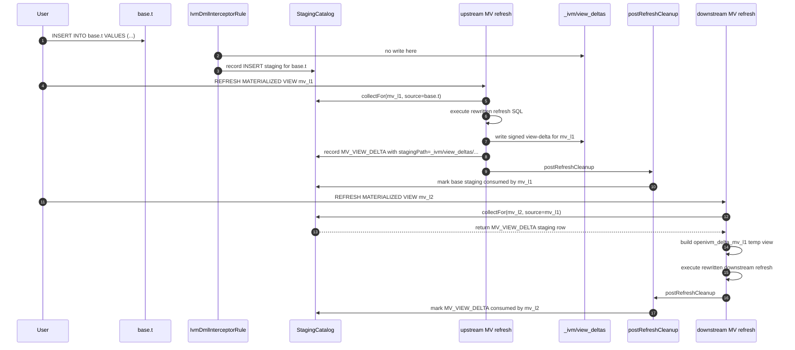

# 9. MV-over-MV cascade, watermarks, and fingerprints
This chapter documents how openivm-spark propagates deltas from one materialized view into another materialized view.
- A base-table DML creates a `StagingDelta` row.
- An upstream MV refresh consumes that base-table staging row.
- If the upstream refresh emits a view-delta, openivm-spark records that
view-delta as another `StagingDelta` row.
- The downstream MV refresh consumes that row exactly like a base-table delta.
- Supported production shape is depth 2: `base table -> MV -> MV`.
- Depth 3+ remains out of scope.
## 9.1 Vocabulary
- **Root table**: an ordinary Delta table modified by user DML.
- **Upstream MV**: a materialized view whose source is the root table.
- **Downstream MV**: a materialized view whose source is the upstream MV.
- **View-delta**: the signed rows emitted by an upstream MV refresh.
- **Cascade**: recording that view-delta as source staging for downstream MVs.
- **Staging row**: one `StagingDelta` catalog entry.
- **Staging path**: a Delta table path containing the staged rows.
- **Watermark**: the per-source low-water mark captured at MV creation time.
- **Consumed marker**: per-MV RocksDB state saying a staging path was applied.
- **Fingerprint**: a SHA-256 schema and upstream-MV identity guard.
## 9.2 Depth constraint: exactly depth <= 2
The user-facing README states the contract:
> `MV-over-MV chains are supported at depth <= 2 (ChainedSpec); depth > 2 is
> out of scope.`
Citation: `spark-ext/README.md:43-46`.
The test source carries the same constraint as executable documentation.
`ChainedDepth2Spec` keeps depth-3 cases pending:
```scala
// (K) Out-of-scope per PLAN.md §12: MV-over-MV cascade depth > 2
//
// openivm's `chained.test` includes a four-level chain
//     transactions → store_dept_totals → store_totals → chain_grand_total
//     (chained.test L452–L550)
// which exercises an MV depending on an MV depending on an MV.  Per PLAN
// §11 Risk #5 / §12, openivm-spark's MVP enforces depth ≤ 2.  The current
// `RefreshMaterializedViewCommand` has no topo-sort, no cycle check, and
// no automatic re-staging of the writes its MERGE emits into the
// intermediate MV, so a manual three-step `REFRESH MV1; REFRESH MV2;
// REFRESH MV3` would either no-op on the leaf (empty staging for MV2) or
// observe stale data.
```
Citation: `spark-ext/ivm-it/src/test/scala/org/openivm/spark/parity/ChainedDepth2Spec.scala:230-242`.
A second parity source repeats the operational reason:
- three-level `events -> user_totals -> {global_total, user_count}` is pending;
- depth-3 chains are intentionally out of scope;
- the pending tests cover out-of-order refresh, skip-a-level, leaf-only refresh,
idempotent refresh, and mixed INSERT/DELETE cascade cases.
Citation: `spark-ext/ivm-it/src/test/scala/org/openivm/spark/parity/PipelineDepth2Spec.scala:85-139`.
### Why the cap is 2
Depth 2 is the largest shape whose termination is guaranteed by the current mechanism.
For one upstream and one downstream MV:
1. base DML creates base staging;
2. upstream refresh consumes base staging;
3. upstream refresh records one downstream-consumable `MV_VIEW_DELTA`;
4. downstream refresh consumes that staging;
5. refresh end marks the consumed paths.
For depth 3+ the engine would need more than a local staging hand-off:
- topological ordering across all MVs in the graph;
- cycle detection;
- replay rules for skipped intermediate refreshes;
- deduplication when a node is reachable through more than one path;
- termination proof across every `RefreshTypeCode`;
- safe handling of refresh types that do not emit cascade-usable deltas.
The source comment is explicit that the current command has no topo-sort, no cycle check, and no automatic re-staging for depth-3 intermediates.
Therefore depth 2 is not an arbitrary product limit.
It is the point where a single synthetic source delta is enough.
Beyond that, a local trigger can either no-op on the leaf or observe stale data.
## 9.3 The cascade mechanism
The cascade begins during `REFRESH MATERIALIZED VIEW`.
`RefreshMaterializedViewCommand.runUnderLock` reads MV metadata, loads pending staging rows, builds source delta temp views, executes the rewritten refresh program, records any cascade view-delta, and then calls `postRefreshCleanup`.
The cleanup call is visible in both refresh paths:
- full refresh path calls `postRefreshCleanup` after executing assembled SQL;
- incremental path calls `postRefreshCleanup` after recording the view-delta.
Citations:
- `spark-ext/ivm-extension/src/main/scala/org/openivm/spark/commands/MaterializedViewCommands.scala:859-873`
- `spark-ext/ivm-extension/src/main/scala/org/openivm/spark/commands/MaterializedViewCommands.scala:1107-1171`
### 9.3.1 Incremental upstream path
For cascade-delta-capable refresh types, the incremental refresh creates a per-refresh view-delta path:
```scala
val warehouse     = spark.conf.get("spark.sql.warehouse.dir").stripSuffix("/")
val safeMvName    = metaName(name).replace(".", "_").replace(" ", "_")
val viewDeltaPath = s"$warehouse/_ivm/view_deltas/$safeMvName/${java.util.UUID.randomUUID()}"
```
Citation: `MaterializedViewCommands.scala:944-955`.
The path shape is therefore:
```text
<warehouse>/_ivm/view_deltas/<safe-qualified-upstream-mv>/<uuid>/
```
Example:
```text
target/test-warehouse-chain-dm-12345678/
  _ivm/view_deltas/default_chm_rsc_l1/2f1d.../
```
The rewritten refresh SQL receives that path as `viewDeltaPath`:
```scala
SparkRefreshRewriter.rewrite(
  ...,
  viewDeltaPath = viewDeltaPath,
  ...
)
```
Citation: `MaterializedViewCommands.scala:983-990`.
After the refresh statements run, the command records the path as staging for downstream consumers:
```scala
StagingCatalog.record(
  spark,
  StagingDelta(
    baseTable = triggerKey,
    opType = StagingDelta.OpTypes.MvViewDelta,
    stagingPath = viewDeltaPath,
    txnTs = txnTs,
    consumedBy = Seq.empty
  )
)
```
Citation: `MaterializedViewCommands.scala:1142-1153`.
The recorded staging row is the cascade hand-off.
The rows stay at `_ivm/view_deltas/...`.
The RocksDB catalog entry for the source key lives under:
```text
<warehouse>/_openivm/tables/<base64url(source-key)>/rocksdb/
```
That base64url encoding is implemented by `RocksDBCodec.safePathSegment`:
```scala
def safePathSegment(name: String): String =
  Base64.getUrlEncoder.withoutPadding.encodeToString(utf8(name))
```
Citation: `spark-ext/ivm-common/src/main/scala/org/openivm/spark/common/rocksdb/RocksDBCodec.scala:122-123`.
The base-table RocksDB path is constructed here:
```scala
Paths
  .get(warehouseDir(spark), "_openivm", "tables", RocksDBCodec.safePathSegment(baseTable), "rocksdb")
  .toString
```
Citation: `spark-ext/ivm-common/src/main/scala/org/openivm/spark/common/StagingCatalog.scala:90-93`.
Important implementation note:
- committed code does **not** copy the Delta data to
`_openivm/tables/<base64url>/staging/MV_VIEW_DELTA/<txnTs>/`;
- `_openivm/tables/<base64url>/rocksdb` is the catalog database;
- the `StagingDelta.stagingPath` points at `_ivm/view_deltas/...`.
## 9.4 `MV_VIEW_DELTA` is one of the seven staging opTypes
Chapter 3 defines the seven staging operation codes used at the staging layer.
The source lists them in `StagingDelta.OpTypes`:
1. `INSERT`
2. `DELETE`
3. `UPDATE_BEFORE`
4. `UPDATE_AFTER`
5. `MERGE_SRC`
6. `OVERWRITE`
7. `MV_VIEW_DELTA`
Citation: `spark-ext/ivm-common/src/main/scala/org/openivm/spark/common/StagingCatalog.scala:54-68`.
The opType contract states that `MV_VIEW_DELTA` preserves the existing multiplicity column at the staging path.
Citation: `StagingCatalog.scala:29-52`.
This matters because upstream view-deltas are already signed.
Treating them as `INSERT` would replace every multiplicity with `+1`.
That would corrupt downstream aggregates.
The emission site is inside the incremental refresh success block:
```scala
opType = StagingDelta.OpTypes.MvViewDelta,
stagingPath = viewDeltaPath,
```
Citation: `MaterializedViewCommands.scala:1144-1150`.
## 9.5 Downstream consumption is identical to base-table DML
The downstream MV stores the upstream MV name in `MvMetadata.sourceTables`.
At refresh time it calls:
```scala
val stagingDeltas = StagingCatalog.collectFor(
  spark,
  viewNameStr,
  meta.sourceTables,
  sourceWatermarks
)
```
Citation: `MaterializedViewCommands.scala:807-812`.
`collectFor` scans each source's staging RocksDB and filters by:
- source name;
- create-time watermark;
- per-MV consumed marker.
```scala
val watermarkPassed = watermarks.get(source).forall(wm => txnTsMillis > wm.getTime)
val alreadyConsumed = maybeMvDb.exists(_.get(ConsumedCf, RocksDBCodec.utf8(stagingPath)).isDefined)
if (watermarkPassed && !alreadyConsumed) {
  Iterator.single(StagingDelta(...))
}
```
Citation: `StagingCatalog.scala:223-239`.
Then `StagingDeltaView.buildSourceDeltaViewSql` creates the `openivm_delta_<source>` temp view expected by openivm-emitted SQL.
For `MV_VIEW_DELTA`, it reads the Delta path and preserves `openivm_multiplicity`:
```scala
case StagingDelta.OpTypes.MvViewDelta =>
  val ts = d.txnTs.toString
  Some(
    s"""SELECT $cols, openivm_multiplicity, CAST('$ts' AS TIMESTAMP) AS openivm_timestamp
       |FROM delta.`$escapedPath`""".stripMargin
  )
```
Citation: `spark-ext/ivm-common/src/main/scala/org/openivm/spark/common/StagingDeltaView.scala:45-70`.
For base-table inserts, overwrites, and update-after rows, the same function synthesizes `+1` multiplicities.
Citation: `StagingDeltaView.scala:72-77`.
For deletes and update-before rows, it synthesizes `-1` multiplicities.
Citation: `StagingDeltaView.scala:79-84`.
From the downstream refresh planner's point of view, both forms become the same kind of temp view:
```text
openivm_delta_<source>
```
That is the key abstraction.
## 9.6 The short-name sourceTables gotcha
Memory citation:
> `MvMetadata.sourceTables` stores `db.table` (V2 namespace) but a db-less
> `CREATE MATERIALIZED VIEW` produces a db-less `TableIdentifier`; match by
> trailing short-name segment, not by equality (see
> `MaterializedViewCommands.postRefreshCleanup`).
This is also documented in the source comment above `postRefreshCleanup`:
```scala
* Match the downstream's source-table entry by its trailing short-name
* segment so the synthetic staging uses the exact form recorded in the
* downstream's `MvMetadata.sourceTables` (the DML-interceptor convention
* stores sources with their Spark-resolved namespace prefix, e.g.
* `default.ch_sales_by_region`, but [[TableIdentifier]] for a
* `CREATE MATERIALIZED VIEW` issued without a db prefix is db-less).
```
Citation: `MaterializedViewCommands.scala:1254-1259`.
The actual matching code appears twice.
First, when recording an incremental view-delta:
```scala
val mvShortName = name.identifier
val triggerKeys: Set[String] = MvCatalog
  .list(spark)
  .filter(_.sourceTables.exists(_.split("\\.").last == mvShortName))
  .flatMap(_.sourceTables.filter(_.split("\\.").last == mvShortName))
  .toSet
```
Citation: `MaterializedViewCommands.scala:1132-1138`.
Second, when creating non-cascade trigger rows in `postRefreshCleanup`:
```scala
val upstreamShortName = name.identifier
val downstreamSourceKeys = allMvs
  .filterNot(m => metaName(m.name) == viewNameStr)
  .flatMap(_.sourceTables.filter(_.split("\\.").last == upstreamShortName))
  .distinct
```
Citation: `MaterializedViewCommands.scala:1283-1288`.
The important detail is the last segment comparison:
```scala
_.split("\\.").last == upstreamShortName
```
That is what bridges `default.my_mv` and `my_mv`.
## 9.7 Watermarks and consumed markers
The current implementation has two related mechanisms:
1. create-time per-source low watermarks;
2. refresh-time per-MV consumed markers.
It does not store a single per-MV meta-CF key named exactly `watermark`.
Instead, create-time watermarks are stored as properties with the prefix `_ivm_watermark:`.
The property prefix is defined here:
```scala
val WatermarkKeyPrefix: String = "_ivm_watermark:"
```
Citation: `spark-ext/ivm-common/src/main/scala/org/openivm/spark/common/MvCatalog.scala:78-82`.
The decoder reads those properties back into a `Map[String, Timestamp]`:
```scala
def sourceWatermarks: Map[String, Timestamp] =
  properties.iterator
    .filter(_._1.startsWith(MvMetadata.WatermarkKeyPrefix))
    .flatMap { case (k, v) =>
      val src = k.stripPrefix(MvMetadata.WatermarkKeyPrefix)
      scala.util.Try(Timestamp.valueOf(v)).toOption.map(ts => src -> ts)
    }
    .toMap
```
Citation: `MvCatalog.scala:45-58`.
At CREATE time the command captures current source watermarks before CTAS:
```scala
val watermarks     = StagingCatalog.currentWatermarks(spark, qualNames)
val watermarkProps = MvMetadata.watermarkProperties(watermarks)
val allProps =
  properties ++ baseProps ++ countProp ++ havingProp ++ cascadeDeltaProps ++
    compiledProps ++ watermarkProps
```
Citation: `MaterializedViewCommands.scala:665-673`.
`currentWatermarks` scans each source staging DB and records the maximum staging timestamp already present:
```scala
baseDb.prefixScan(StagingCf, Array.emptyByteArray).foreach { case (key, _) =>
  found = true
  maxTs = math.max(maxTs, decodeStagingKey(key)._1)
}
if (found) Some(source -> new Timestamp(maxTs)) else None
```
Citation: `StagingCatalog.scala:250-267`.
The properties are persisted in the per-MV RocksDB `properties` column family, not the `meta` column family:
```scala
properties.toSeq.sortBy(_._1).foreach { case (key, value) =>
  OpenIvmRocksDBBatchOps.put(db, batch, PropertiesCf, RocksDBCodec.utf8(key), RocksDBCodec.utf8(value))
}
```
Citation: `MvCatalog.scala:284-294`.
At refresh time the command reads them:
```scala
val sourceWatermarks = meta.sourceWatermarks
```
Citation: `MaterializedViewCommands.scala:793-795`.
Then both the cheap pending-delta probe and the full collect use them:
```scala
!StagingCatalog.hasPendingDeltas(spark, viewNameStr, meta.sourceTables, sourceWatermarks)
...
StagingCatalog.collectFor(spark, viewNameStr, meta.sourceTables, sourceWatermarks)
```
Citation: `MaterializedViewCommands.scala:796-812`.
Refresh completion is tracked by consumed markers.
`postRefreshCleanup` marks every input staging path consumed:
```scala
val consumedPaths = stagingDeltas.map(_.stagingPath)
StagingCatalog.markConsumed(spark, viewNameStr, consumedPaths)
```
Citation: `MaterializedViewCommands.scala:1273-1274`.
`markConsumed` writes those paths into the downstream MV's per-MV RocksDB `consumed` column family:
```scala
OpenIvmRocksDBBatchOps.put(mvDb, batch, ConsumedCf, RocksDBCodec.utf8(path), Array.emptyByteArray)
```
Citation: `StagingCatalog.scala:270-279`.
The MV's last Delta version is advanced separately in the per-MV `meta` column family under `last_version`:
```scala
OpenIvmRocksDBBatchOps.put(
  perMvDb,
  batch,
  MetaCf,
  LastVersionMetaKey,
  RocksDBCodec.utf8(newVersion.toString)
)
```
Citation: `MvCatalog.scala:485-503`.
`postRefreshCleanup` calls that advance before marking consumed:
```scala
val newVersion =
  DeltaTable.forPath(spark, meta.location).history(1).collect().head.getAs[Long]("version")
MvCatalog.advance(spark, name, newVersion)
```
Citation: `MaterializedViewCommands.scala:1269-1272`.
So the precise current state model is:
- staging rows carry monotonic-ish wall-clock `txnTs` keys;
- create-time low watermarks skip stale pre-existing staging;
- per-MV consumed markers skip already-applied paths;
- `last_version` records the MV table version;
- there is no continuously advanced single `watermark` key today.
## 9.8 Fingerprints
The fingerprint algorithm is SHA-256.
The source says:
```scala
val digest  = MessageDigest.getInstance("SHA-256").digest(content.getBytes("UTF-8"))
digest.map("%02x".format(_)).mkString
```
Citation: `MvCatalog.scala:577-579`.
The hashed content is deterministic:
- source entries sorted by source name;
- each source encoded as `name=StructType.toDDL`;
- optional upstream MV identity lines sorted by source name;
- each upstream identity encoded as `name#mv-identity=<hex>`.
Source:
```scala
val schemaLines = sources.toSeq
  .sortBy(_._1)
  .map { case (name, schema) => s"$name=${schema.toDDL}" }
val mvIdLines = mvIdentityBySource.toSeq
  .sortBy(_._1)
  .map { case (name, ident) => s"$name#mv-identity=$ident" }
val content = (schemaLines ++ mvIdLines).mkString("\n")
```
Citation: `MvCatalog.scala:567-580`.
The upstream MV identity hash is also SHA-256:
```scala
val serialized = serializeName(meta.name)
val content    = s"$serialized|${meta.location}|${meta.querySql}"
val digest     = MessageDigest.getInstance("SHA-256").digest(content.getBytes("UTF-8"))
```
Citation: `MvCatalog.scala:582-593`.
The fingerprint is stored in the per-MV RocksDB `meta` column family under the key `source_schema_fingerprint`:
```scala
private val SourceSchemaFingerprintMetaKey = RocksDBCodec.utf8("source_schema_fingerprint")
```
Citation: `MvCatalog.scala:139-147`.
The put site is:
```scala
OpenIvmRocksDBBatchOps.put(
  db,
  batch,
  MetaCf,
  SourceSchemaFingerprintMetaKey,
  RocksDBCodec.utf8(meta.sourceSchemaFingerprint)
)
```
Citation: `MvCatalog.scala:297-317`.
The read site is:
```scala
sourceSchemaFingerprint <- getUtf8(db, MetaCf, SourceSchemaFingerprintMetaKey)
```
Citation: `MvCatalog.scala:247-269`.
At CREATE time the command includes upstream MV identity hashes:
```scala
val mvIdentityBySource: Map[String, String] =
  upstreamMvByQual.map { case (qn, m) => qn -> MvCatalog.mvIdentity(m) }
val fingerprint = MvCatalog.schemaFingerprint(qualSchemas, mvIdentityBySource)
```
Citation: `MaterializedViewCommands.scala:676-681`.
At REFRESH time the command recomputes and compares:
```scala
val freshFingerprint = MvCatalog.schemaFingerprint(freshSchemas, freshMvIdentityBySource)
if (freshFingerprint != meta.sourceSchemaFingerprint)
  throw new AnalysisException(
    "INCOMPATIBLE_VIEW_SCHEMA_CHANGE",
    ...
  )
```
Citation: `MaterializedViewCommands.scala:829-854`.
### 9.8.1 What the current fingerprint includes
Included today:
- source table names;
- source table column names and types through `StructType.toDDL`;
- upstream MV identity hashes;
- upstream MV body SQL through `mvIdentity(meta).querySql`;
- upstream MV physical location through `mvIdentity(meta).location`;
- upstream MV serialized name through `mvIdentity(meta).name`.
Not directly included today:
- local MV SQL as a direct component of its own fingerprint;
- local refresh type as a direct component;
- emitter version as a direct component;
- a meta key literally named `fingerprint`.
The stored field is named `source_schema_fingerprint`.
### 9.8.2 Mismatch behavior
Current code does **not** force a one-time `FULL_REFRESH` and bump the fingerprint in place.
Current code fails loud with `INCOMPATIBLE_VIEW_SCHEMA_CHANGE`.
The schema-evolution spec documents this policy:
> every MV records a `sourceSchemaFingerprint` ... ANY drift — adding a column,
> dropping a column, changing a type — raises an `AnalysisException` with the
> `INCOMPATIBLE_VIEW_SCHEMA_CHANGE` error class.
Citation: `spark-ext/ivm-it/src/test/scala/org/openivm/spark/parity/SchemaEvolutionSpec.scala:23-39`.
The recovery path is drop and recreate.
The spec says:
> The user-facing recovery path is DROP + CREATE: drop the MV, alter the base
> table, recreate the MV.
Citation: `SchemaEvolutionSpec.scala:31-38`.
The ADD COLUMN test demonstrates the flow:
1. create source table;
2. create MV;
3. store original fingerprint;
4. `ALTER TABLE ... ADD COLUMNS`;
5. insert a row so refresh attempts work;
6. refresh raises a schema/fingerprint error;
7. drop and recreate the MV;
8. the new fingerprint differs from the original.
Citation: `SchemaEvolutionSpec.scala:141-180`.
### 9.8.3 Mid-cascade replay
There is no current source implementation that detects a fingerprint mismatch mid-cascade and automatically replays the chain from the upstream root.
The closest replay-like behavior is the crash-safety comment for a refresh failure after data-table writes but before the view-delta staging row is recorded:
```scala
// If we crash between (1) and (3): the data table is updated and
// input staging is still unconsumed (a retry replays it — at-least-once
// semantics; see PRE-EXISTING idempotency gap). The view-delta on disk
// is orphan (no catalog row) and is collected by Phase 7's orphan sweep.
```
Citation: `MaterializedViewCommands.scala:1114-1123`.
That is retry replay of the same unconsumed input staging.
It is not graph replay from the root after a fingerprint mismatch.
## 9.9 Why fingerprints change
### Source schema evolution
A source column addition changes `StructType.toDDL`.
A source column removal changes `StructType.toDDL`.
A source type change changes `StructType.toDDL`.
All three change the SHA-256 input.
The schema-evolution spec explicitly checks those cases.
Citation: `SchemaEvolutionSpec.scala:34-51`.
### MV SQL edit
openivm-spark has no `ALTER MATERIALIZED VIEW` SQL.
An MV SQL edit is represented as `DROP MATERIALIZED VIEW` followed by `CREATE MATERIALIZED VIEW`.
For downstream MVs, upstream MV SQL is included through `MvCatalog.mvIdentity`:
```scala
val content = s"$serialized|${meta.location}|${meta.querySql}"
```
Citation: `MvCatalog.scala:582-593`.
Therefore a downstream MV can detect that its upstream MV was dropped and recreated with the same outward schema but different SQL.
### Refresh type re-classification
At CREATE time the compiler's refresh type is converted to an effective refresh type.
The effective refresh type can be demoted to `FULL_REFRESH` for reasons such as:
- Top-K view;
- simple projection with no data-apply statement;
- non-cascade-capable upstream;
- window initial-load mismatch;
- hidden HAVING aggregate;
- no real delta.
Citation: `MaterializedViewCommands.scala:597-628`.
The current fingerprint does not directly hash `refreshType`.
A DROP + CREATE after compiler behavior changes writes new metadata, including new `refreshType`, `refreshTypeName`, cascade properties, and compiled SQL properties.
But an in-place refresh-type reclassification is not a fingerprint-driven path today.
### Emitter version bump
The current fingerprint does not include an explicit emitter version string.
Compiled SQL can be cached as MV properties:
```scala
val compiledProps =
  if (effectiveRefreshType == RefreshTypeCode.FullRefresh) Map.empty[String, String]
  else MvMetadata.compiledProperties(compiled.sql, compiled.initialLoadSql)
```
Citation: `MaterializedViewCommands.scala:658-664`.
Those properties are not part of `schemaFingerprint`.
If future work wants emitter-version invalidation, the SHA-256 content should include an explicit emitter version line.
## 9.10 ChainedDmlSpec walkthrough
`ChainedDmlSpec` is the best ground-truth test for the cascade hand-off.
The SparkSession uses a unique warehouse:
```scala
new File(s"target/test-warehouse-chain-dm-${UUID.randomUUID().toString.take(8)}")
```
Citation: `ChainedDmlSpec.scala:25-29`.
The suite enables both Delta and OpenIVM extensions and calls:
```scala
MvCatalog.ensureTables(spark)
StagingCatalog.ensureTables(spark)
```
Citation: `ChainedDmlSpec.scala:33-50`.
### Scenario G: downstream sees upstream cascade deltas
The test creates a base table:
```scala
CREATE TABLE IF NOT EXISTS chm_rsc_base(id INT, val INT) USING DELTA
```
Citation: `ChainedDmlSpec.scala:141`.
On disk:
```text
<warehouse>/chm_rsc_base/
<warehouse>/_openivm/index/rocksdb/
```
The test inserts the initial row:
```scala
INSERT INTO chm_rsc_base VALUES (1, 10)
```
Citation: `ChainedDmlSpec.scala:142`.
No MV depends on the table yet, so there may be no useful staging row for this initial insert.
The test creates the upstream MV:
```scala
CREATE MATERIALIZED VIEW chm_rsc_l1 AS SELECT id, val FROM chm_rsc_base
```
Citation: `ChainedDmlSpec.scala:143`.
On disk:
```text
<warehouse>/_ivm/views/chm_rsc_l1/
<warehouse>/_openivm/mvs/<base64url(chm_rsc_l1)>/rocksdb/
```
The upstream MV's metadata records:
```text
sourceTables = [default.chm_rsc_base]
location     = <warehouse>/_ivm/views/chm_rsc_l1
```
The test creates the downstream MV:
```scala
CREATE MATERIALIZED VIEW chm_rsc_l2 AS SELECT id, val FROM chm_rsc_l1
```
Citation: `ChainedDmlSpec.scala:144`.
On disk:
```text
<warehouse>/_ivm/views/chm_rsc_l2/
<warehouse>/_openivm/mvs/<base64url(chm_rsc_l2)>/rocksdb/
```
The downstream MV's metadata records a source table entry for the upstream MV, usually `default.chm_rsc_l1`.
The test inserts a second base row:
```scala
INSERT INTO chm_rsc_base VALUES (2, 20)
```
Citation: `ChainedDmlSpec.scala:146`.
The DML interceptor stages the inserted row.
Its data path follows:
```text
<warehouse>/_ivm/staging/default_chm_rsc_base/INSERT/<txnTs>/
```
The path builder is:
```scala
s"$warehouse/_ivm/staging/$safeTable/$opType/$txnTs"
```
Citation: `IvmDmlInterceptorRule.scala:283-290`.
The catalog row is written under:
```text
<warehouse>/_openivm/tables/<base64url(default.chm_rsc_base)>/rocksdb/
```
The test refreshes the upstream only:
```scala
REFRESH MATERIALIZED VIEW chm_rsc_l1
```
Citation: `ChainedDmlSpec.scala:147`.
The upstream refresh consumes the base `INSERT` staging row.
It writes or references a view-delta path:
```text
<warehouse>/_ivm/view_deltas/default_chm_rsc_l1/<uuid>/
```
It records an `MV_VIEW_DELTA` staging row for each downstream source-key form that references `chm_rsc_l1`.
The relevant code is:
```scala
keysToRecord.foreach { triggerKey =>
  StagingCatalog.record(... opType = StagingDelta.OpTypes.MvViewDelta ...)
}
```
Citation: `MaterializedViewCommands.scala:1139-1153`.
That catalog row lands under:
```text
<warehouse>/_openivm/tables/<base64url(default.chm_rsc_l1)>/rocksdb/
```
The test then refreshes the downstream:
```scala
REFRESH MATERIALIZED VIEW chm_rsc_l2
```
Citation: `ChainedDmlSpec.scala:148-150`.
The log assertion proves the downstream refresh did not no-op:
```scala
noPendingFor(appender.messages, "chm_rsc_l2") shouldBe false
```
Citation: `ChainedDmlSpec.scala:148-151`.
The downstream consumes the `MV_VIEW_DELTA` staging row as its source delta.
Finally the test asserts both MVs match recomputation from the base table:
```scala
assertMvCorrect("chm_rsc_l1", "SELECT id, val FROM chm_rsc_base")
assertMvCorrect("chm_rsc_l2", "SELECT id, val FROM chm_rsc_base")
```
Citation: `ChainedDmlSpec.scala:153-154`.
### Scenario H: empty intermediate
`chm_empty -> chm_empty_l1 -> chm_empty_l2` starts populated.
Citation: `ChainedDmlSpec.scala:163-181`.
Then all root rows are deleted.
Citation: `ChainedDmlSpec.scala:184-191`.
Then a new group is inserted.
Citation: `ChainedDmlSpec.scala:194-201`.
This proves the hand-off handles:
- positive rows;
- negative rows;
- an empty upstream MV state;
- reappearance after empty state.
### Scenario I: UPDATE moves groups
`chm_update -> chm_update_l1 -> chm_update_l2` starts with grouped rows.
Citation: `ChainedDmlSpec.scala:210-232`.
Then one row moves from group `a` to group `b`.
Citation: `ChainedDmlSpec.scala:235-247`.
Then every `b` row moves to `c`.
Citation: `ChainedDmlSpec.scala:249-260`.
This proves base UPDATE staging can become upstream signed view-delta staging and still converge downstream.
## 9.11 Mermaid sequence: two-deep cascade

## 9.12 Direct base-table delta vs `MV_VIEW_DELTA`
| Dimension | Direct base-table delta | `MV_VIEW_DELTA` cascade delta |
|---|---|---|
| Catalog type | `StagingDelta` | `StagingDelta` |
| Catalog writer | DML interceptor | Upstream MV refresh |
| Main emit site | `IvmDmlInterceptorRule` | `RefreshMaterializedViewCommand` |
| Source key | base table name | upstream MV source-table key |
| RocksDB source DB | `_openivm/tables/<base64url(base)>/rocksdb` | `_openivm/tables/<base64url(upstream-mv-key)>/rocksdb` |
| Data path | `_ivm/staging/<safe-table>/<opType>/<txnTs>` | `_ivm/view_deltas/<safe-mv>/<uuid>` |
| `opType` values | `INSERT`, `DELETE`, `UPDATE_BEFORE`, `UPDATE_AFTER`, `MERGE_SRC`, `OVERWRITE` | `MV_VIEW_DELTA` |
| Multiplicity source | synthesized from `opType` | preserved from upstream view-delta |
| Timestamp in temp view | staging row `txnTs` | staging row `txnTs` |
| Downstream collector | `StagingCatalog.collectFor` | `StagingCatalog.collectFor` |
| Consumed tracking | per-MV `consumed` CF by staging path | per-MV `consumed` CF by staging path |
| Temp view name | `openivm_delta_<source-short-name>` | `openivm_delta_<source-short-name>` |
| Downstream can tell? | yes only by `opType` if inspected | yes only by `opType` if inspected |
| Refresh SQL shape | reads the temp view | reads the same temp view shape |
| Correctness risk | wrong sign if opType mapping wrong | wrong sign if multiplicity overwritten |
The staging-layer abstraction is intentionally almost identical.
The only semantic difference is who supplies signed multiplicity.
For base DML, openivm-spark synthesizes the sign.
For MV-over-MV, the upstream MV already computed the sign.
## 9.13 Operational invariants
1. Record `MV_VIEW_DELTA` before marking input staging consumed.
2. Preserve upstream `openivm_multiplicity` for `MV_VIEW_DELTA`.
3. Match downstream source keys by trailing short name when discovering dependents.
4. Use the exact source-key string stored in downstream `sourceTables` when recording.
5. Do not silently support depth 3+ without graph ordering and cycle checks.
6. Treat fingerprint mismatch as fail-loud drift, not as a transparent cascade replay.
7. Use DROP + CREATE to recover from schema or upstream-identity drift.
8. Keep trigger-only rows separate from signed cascade deltas.
9. Remember `_openivm/tables/.../rocksdb` is catalog state, not the Delta payload.
10. Remember `_ivm/view_deltas/...` is the signed cascade payload.
