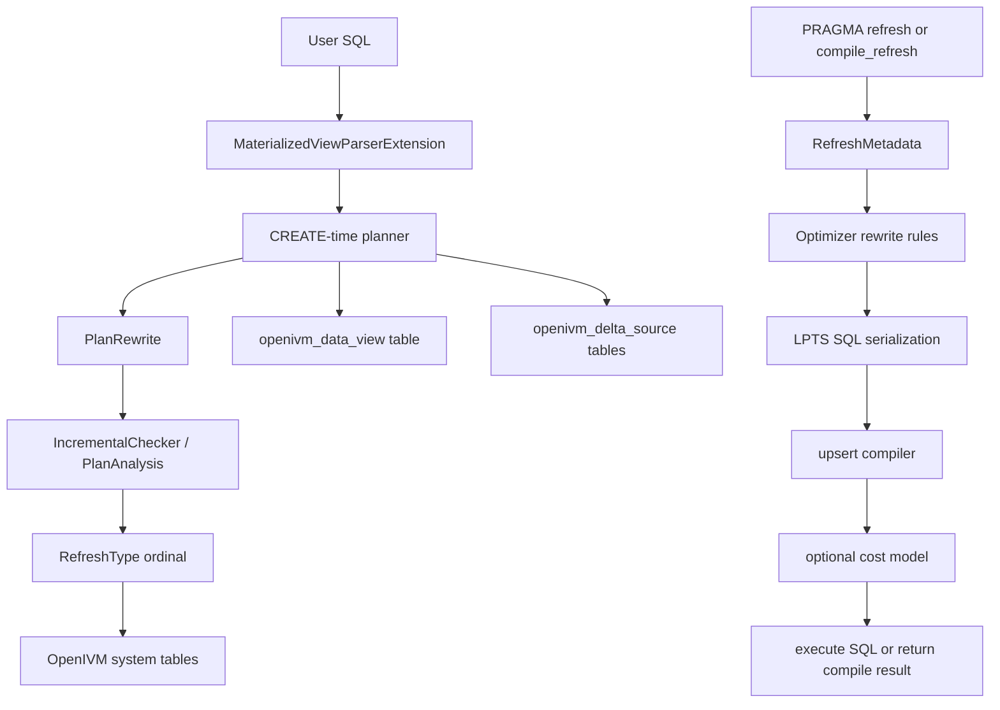
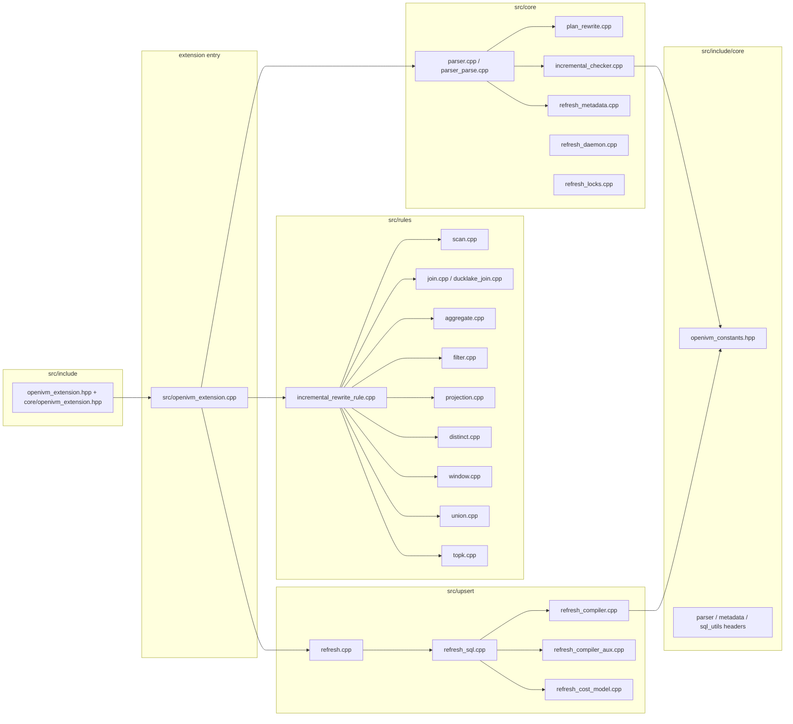
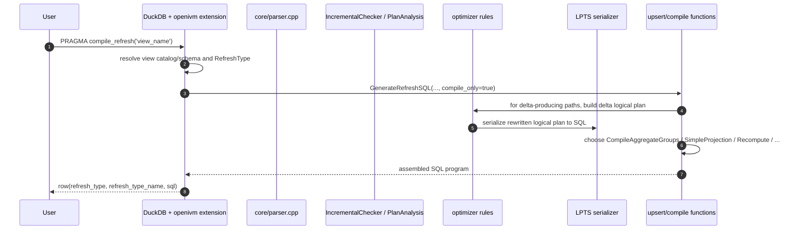
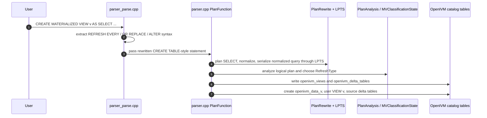

# OpenIVM DuckDB extension: 10,000-foot overview

OpenIVM is the DuckDB-side IVM brain: a DuckDB extension that classifies materialized-view SQL,
rewrites DuckDB logical plans with DBSP/Z-set algebra, and emits refresh SQL programs through LPTS.
This chapter covers the extension itself under `.temp/openivm/`, not the Spark execution layer.
For Spark's bridge, staging, RocksDB, and Delta execution, see `../openivm-spark/0.OVERVIEW.md`.

______________________________________________________________________

## 0.1 Scope and source map

This chapter is a map before the deeper OpenIVM chapters.
It answers these questions:

1. What is OpenIVM in DuckDB terms?
1. What PRAGMA/settings contract does the extension expose?
1. What modules own parsing, classification, algebraic rewrite rules, and SQL emission?
1. What are the 10 `RefreshType` enum ordinals?
1. What math ideas should you remember before reading the details?
1. What DuckDB catalog tables and physical OpenIVM tables are created?
1. Which chapter should you read next for each subsystem?

Primary source tree:

```text
/home/mdrrahman/openivm-spark/.temp/openivm/
├── src/
│   ├── openivm_extension.cpp
│   ├── core/
│   ├── rules/
│   ├── upsert/
│   ├── match/
│   └── include/
│       ├── core/
│       ├── rules/
│       ├── upsert/
│       ├── match/
│       └── openivm_extension.hpp
└── test/sql/
```

Citations:

- Extension entry and registration: `.temp/openivm/src/openivm_extension.cpp:104-246`.
- Parser extension interface: `.temp/openivm/src/include/core/parser.hpp:14-24`.
- Public extension class: `.temp/openivm/src/include/core/openivm_extension.hpp:7-12`.
- Forwarding header: `.temp/openivm/src/include/openivm_extension.hpp:1-2`.

One useful caveat:
this checkout does **not** contain `src/include/api/`.
The public extension API is the forwarding header plus `core/openivm_extension.hpp`, while subsystem APIs live under
`src/include/core`, `src/include/rules`, `src/include/upsert`, and `src/include/match`.

______________________________________________________________________

## 0.2 What OpenIVM is

OpenIVM is a DuckDB extension for **Incremental View Maintenance**.
It lets a user create a materialized view and later refresh it from deltas instead of recomputing the view from scratch.
The extension owns the algebraic reasoning:

- it parses `CREATE MATERIALIZED VIEW` and related OpenIVM DDL;
- it records materialized-view metadata in OpenIVM system tables;
- it tracks source tables through `openivm_delta_<source>` tables;
- it classifies the view into one of 10 `RefreshType` strategies;
- it rewrites logical plans using DBSP/Z-set delta rules;
- it emits SQL refresh programs through the LPTS logical-plan-to-SQL bridge;
- it optionally executes those programs inside DuckDB.

The formal model is **DBSP / Z-set algebra**.
A relation is treated as a map from tuple to an integer multiplicity.
Insertions are positive weights, deletions are negative weights, and refresh is the problem of applying $\Delta Q$ to a stored `Q`.
OpenIVM's code makes this explicit through the internal multiplicity column:
`openivm_multiplicity`, declared with the timestamp column in constants
`.temp/openivm/src/include/core/openivm_constants.hpp:20-23`.

The extension builds on **LPTS**.
During create-time normalization, OpenIVM transforms a DuckDB logical plan into SQL by calling
`LogicalPlanToAst`, `AstToCteList`, and `ToQuery`; see `.temp/openivm/src/core/parser.cpp:294-338`.
During refresh compilation, the same target-dialect setting is used by upsert SQL generation;
`openivm_target_dialect` is registered in `.temp/openivm/src/openivm_extension.cpp:239-246`.

______________________________________________________________________

## 0.3 Two-phase architecture

OpenIVM has two conceptual phases.
The first phase happens when the MV is created.
The second phase happens when a user refreshes it.



Create-time source facts:

- `ParseFunction` intercepts create/alter materialized-view syntax and returns parser-extension data
  in `.temp/openivm/src/core/parser_parse.cpp:12-89`.
- `PlanFunction` plans the raw query, runs plan rewrites, serializes through LPTS, and classifies the plan
  in `.temp/openivm/src/core/parser.cpp:207-380` and `.temp/openivm/src/core/parser.cpp:600-817`.
- System-table DDL is appended by `AppendCreateMVSystemTablesDDL`
  in `.temp/openivm/src/core/parser_create_mv_helpers.cpp:41-128`.
- The physical data table and user-facing DuckDB view are created in
  `.temp/openivm/src/core/parser.cpp:1157-1208`.
- Source delta tables are created with `openivm_multiplicity` and `openivm_timestamp`
  in `.temp/openivm/src/core/parser.cpp:1210-1255`.

Refresh-time source facts:

- `PRAGMA refresh` and `PRAGMA compile_refresh` are registered in
  `.temp/openivm/src/openivm_extension.cpp:357-386`.
- `RefreshViewLocked` serializes refresh, gathers metadata, calls `GenerateRefreshSQL`, and executes the SQL
  in `.temp/openivm/src/upsert/refresh.cpp:112-180` and `.temp/openivm/src/upsert/refresh.cpp:191-340`.
- `GenerateRefreshSQL` dispatches by `RefreshType` in
  `.temp/openivm/src/upsert/refresh_sql.cpp:489-687`.
- `CompileRefreshQuery` returns the compile-only row shape in
  `.temp/openivm/src/upsert/refresh.cpp:593-739`.

______________________________________________________________________

## 0.4 The PRAGMA and `openivm_*` settings contract

There are two surfaces to keep separate.

First, the extension registers callable DuckDB PRAGMAs whose names do **not** all start with `openivm_`.
They are registered with `PragmaFunction::PragmaCall` in `.temp/openivm/src/openivm_extension.cpp:357-464`.

| Callable PRAGMA                    | Arguments | Purpose                                              | Citation                                          |
| ---------------------------------- | --------: | ---------------------------------------------------- | ------------------------------------------------- |
| `PRAGMA refresh_options(...)`      | 3 strings | refresh with explicit options/catalog context        | `.temp/openivm/src/openivm_extension.cpp:357-362` |
| `PRAGMA refresh('view')`           |  1 string | generate and execute refresh SQL                     | `.temp/openivm/src/openivm_extension.cpp:363-364` |
| `PRAGMA refresh_cost('view')`      |  1 string | expose cost estimate query                           | `.temp/openivm/src/openivm_extension.cpp:365-366` |
| `PRAGMA refresh_history('view')`   |  1 string | expose learned-cost history                          | `.temp/openivm/src/openivm_extension.cpp:367-369` |
| `PRAGMA refresh_cross_system(...)` | 5 strings | refresh cross-system/DuckLake views                  | `.temp/openivm/src/openivm_extension.cpp:370-373` |
| `PRAGMA compile_refresh('view')`   |  1 string | compile refresh SQL but do not execute it            | `.temp/openivm/src/openivm_extension.cpp:375-387` |
| `PRAGMA refresh_status('view')`    |  1 string | report interval, last/next refresh, status, strategy | `.temp/openivm/src/openivm_extension.cpp:389-450` |
| `PRAGMA refresh_start_daemon`      |      none | restart the background refresh daemon                | `.temp/openivm/src/openivm_extension.cpp:452-464` |

Second, OpenIVM registers `openivm_*` extension options.
DuckDB accepts these as settings, commonly via `SET openivm_x = ...` or `PRAGMA openivm_x=...`.
These are the `openivm_*` contract names that matter to callers such as openivm-spark.
The literal grep requested by the prompt, `grep -rn "PRAGMA openivm_" .temp/openivm/`, finds only the documented-but-not-registered
`openivm_declare_rely_fk` mention in `.temp/openivm/src/include/match/constraint_cache.hpp:1-6`.
The actual exposed setting names come from `AddExtensionOption` in `.temp/openivm/src/openivm_extension.cpp:114-246`.

| `openivm_*` setting / PRAGMA-form option   | Type      |       Default | Purpose                                                     | Citation                                                                                                           |
| ------------------------------------------ | --------- | ------------: | ----------------------------------------------------------- | ------------------------------------------------------------------------------------------------------------------ |
| `openivm_files_path`                       | `VARCHAR` |        `NULL` | directory for compiled SQL/reference artifacts              | `.temp/openivm/src/openivm_extension.cpp:114-114`                                                                  |
| `openivm_refresh_mode`                     | `VARCHAR` | `incremental` | force `incremental`, `full`, or `auto` refresh strategy     | `.temp/openivm/src/openivm_extension.cpp:115-116`                                                                  |
| `openivm_adaptive_refresh`                 | `BOOLEAN` |       `false` | enable adaptive cost model                                  | `.temp/openivm/src/openivm_extension.cpp:117-119`                                                                  |
| `openivm_cascade_refresh`                  | `VARCHAR` |  `downstream` | cascade mode: off/upstream/downstream/both                  | `.temp/openivm/src/openivm_extension.cpp:120-121`                                                                  |
| `openivm_adaptive_backoff`                 | `BOOLEAN` |        `true` | increase interval when refresh exceeds schedule             | `.temp/openivm/src/openivm_extension.cpp:122-124`                                                                  |
| `openivm_disable_daemon`                   | `BOOLEAN` |       `false` | disable background refresh daemon                           | `.temp/openivm/src/openivm_extension.cpp:125-126`                                                                  |
| `openivm_skip_empty_deltas`                | `BOOLEAN` |        `true` | skip refresh/join terms with empty deltas                   | `.temp/openivm/src/openivm_extension.cpp:129-130`                                                                  |
| `openivm_compact_deltas`                   | `BOOLEAN` |        `true` | compact raw delta rows into net Z-set deltas                | `.temp/openivm/src/openivm_extension.cpp:131-133`                                                                  |
| `openivm_ducklake_nterm`                   | `BOOLEAN` |        `true` | use DuckLake N-term telescoping joins                       | `.temp/openivm/src/openivm_extension.cpp:134-136`                                                                  |
| `openivm_fk_pruning`                       | `BOOLEAN` |        `true` | prune join inclusion-exclusion terms with FK facts          | `.temp/openivm/src/openivm_extension.cpp:137-138`                                                                  |
| `openivm_skip_aggregate_delete`            | `BOOLEAN` |        `true` | skip grouped-aggregate delete when insert-only              | `.temp/openivm/src/openivm_extension.cpp:139-141`                                                                  |
| `openivm_skip_projection_delete`           | `BOOLEAN` |        `true` | skip projection delete/consolidation when insert-only       | `.temp/openivm/src/openivm_extension.cpp:142-144`                                                                  |
| `openivm_minmax_incremental`               | `BOOLEAN` |        `true` | use safe MIN/MAX insert-only incremental path               | `.temp/openivm/src/openivm_extension.cpp:145-147`                                                                  |
| `openivm_having_merge`                     | `BOOLEAN` |        `true` | use MERGE for HAVING views                                  | `.temp/openivm/src/openivm_extension.cpp:148-151`                                                                  |
| `openivm_left_join_merge`                  | `BOOLEAN` |        `true` | use Larson-Zhou-style LEFT JOIN aggregate MERGE             | `.temp/openivm/src/openivm_extension.cpp:153-156`                                                                  |
| `openivm_full_outer_merge`                 | `BOOLEAN` |        `true` | use Zhang-Larson-style FULL OUTER aggregate MERGE           | `.temp/openivm/src/openivm_extension.cpp:157-160`                                                                  |
| `openivm_distinct_aux_state`               | `BOOLEAN` |       `false` | maintain DISTINCT with auxiliary count state when supported | `.temp/openivm/src/openivm_extension.cpp:161-166`                                                                  |
| `openivm_cost_decay`                       | `DOUBLE`  |         `0.9` | exponential decay for learned cost model                    | `.temp/openivm/src/openivm_extension.cpp:169-171`                                                                  |
| `openivm_enable_view_matching`             | `BOOLEAN` |       `false` | master flag for query-time view matching                    | `.temp/openivm/src/openivm_extension.cpp:173-177`                                                                  |
| `openivm_predicate_oracle`                 | `VARCHAR` |    `interval` | predicate implication oracle mode                           | `.temp/openivm/src/openivm_extension.cpp:178-180`                                                                  |
| `openivm_match_strategies`                 | `VARCHAR` |         `all` | allowed matcher strategy set                                | `.temp/openivm/src/openivm_extension.cpp:181-183`                                                                  |
| `openivm_match_estimate_ttl_ms`            | `BIGINT`  |        `5000` | freshness window for pending-delta estimates                | `.temp/openivm/src/openivm_extension.cpp:184-186`                                                                  |
| `openivm_match_log_decisions`              | `BOOLEAN` |       `false` | log matcher decisions to `openivm_match_log`                | `.temp/openivm/src/openivm_extension.cpp:187-188`                                                                  |
| `openivm_match_log_retention`              | `BIGINT`  |          `50` | retained matcher-log rows per query hash                    | `.temp/openivm/src/openivm_extension.cpp:189-190`                                                                  |
| `openivm_profile_refresh`                  | `BOOLEAN` |       `false` | record per-step refresh timings                             | `.temp/openivm/src/openivm_extension.cpp:191-192`                                                                  |
| `openivm_profile_retention_days`           | `BIGINT`  |          `31` | retention for profile rows                                  | `.temp/openivm/src/openivm_extension.cpp:193-195`                                                                  |
| `openivm_explain_initial_load`             | `BOOLEAN` |       `false` | print initial-load SQL and EXPLAIN plans                    | `.temp/openivm/src/openivm_extension.cpp:196-198`                                                                  |
| `openivm_explain_initial_load_only`        | `BOOLEAN` |       `false` | diagnose initial load without executing DDL                 | `.temp/openivm/src/openivm_extension.cpp:199-201`                                                                  |
| `openivm_compile_only`                     | `BOOLEAN` |       `false` | generate refresh SQL artifact without execution             | `.temp/openivm/src/openivm_extension.cpp:203-210`                                                                  |
| `openivm_force_view_delta_cascade`         | `BOOLEAN` |       `false` | force aggregate cascade companion rows                      | `.temp/openivm/src/openivm_extension.cpp:212-228`                                                                  |
| `openivm_emit_cascade_delta_for_recompute` | `BOOLEAN` |       `false` | force recompute-style cascade deltas                        | `.temp/openivm/src/openivm_extension.cpp:230-237` and `.temp/openivm/src/include/core/openivm_constants.hpp:56-58` |
| `openivm_target_dialect`                   | `VARCHAR` |      `duckdb` | target SQL dialect for LPTS/upsert SQL                      | `.temp/openivm/src/openivm_extension.cpp:239-246`                                                                  |

`openivm_declare_rely_fk(...)` appears as a planned constraint-cache PRAGMA in a header comment,
but there is no `PragmaFunction::PragmaCall("openivm_declare_rely_fk", ...)` registration in this checkout.
Treat it as documented scaffold, not an exposed runtime PRAGMA, until chapter 9 verifies otherwise.
Citations: `.temp/openivm/src/include/match/constraint_cache.hpp:1-6` and `.temp/openivm/src/match/constraint_cache.cpp:39-43`.

______________________________________________________________________

## 0.5 Module map



Module responsibilities:

| Module                                   | Responsibility                                                                    | Key citations                                                                                         |
| ---------------------------------------- | --------------------------------------------------------------------------------- | ----------------------------------------------------------------------------------------------------- |
| `src/openivm_extension.cpp`              | extension loading, settings, system tables, parser/optimizer/PRAGMA registration  | `.temp/openivm/src/openivm_extension.cpp:104-246`, `.temp/openivm/src/openivm_extension.cpp:334-464`  |
| `src/core/`                              | parser, CREATE-time planning, plan facts, classification, metadata, daemon, locks | `.temp/openivm/src/core/parser.cpp:207-380`, `.temp/openivm/src/core/incremental_checker.cpp:103-180` |
| `src/rules/`                             | per-operator incremental logical-plan rewrites                                    | `.temp/openivm/src/rules/incremental_rewrite_rule.cpp:92-145`                                         |
| `src/upsert/`                            | refresh SQL generation and execution                                              | `.temp/openivm/src/upsert/refresh_sql.cpp:489-687`, `.temp/openivm/src/upsert/refresh.cpp:112-180`    |
| `src/include/core/openivm_constants.hpp` | system names, hidden column names, limits, `RefreshType` enum                     | `.temp/openivm/src/include/core/openivm_constants.hpp:9-79`                                           |
| `src/include/openivm_extension.hpp`      | public forwarding header for DuckDB's loader                                      | `.temp/openivm/src/include/openivm_extension.hpp:1-2`                                                 |

______________________________________________________________________

## 0.6 The 10 `RefreshType` ordinals

`RefreshType` is the source-of-truth enum for classification and refresh strategy.
The enum order in `.temp/openivm/src/include/core/openivm_constants.hpp:67-79` is the ordinal contract.
`RefreshTypeName` maps the enum back to user-readable strings in `.temp/openivm/src/include/core/openivm_constants.hpp:81-105`.

| Ordinal | Enum                   | Canonical description from `openivm_constants.hpp` and code name                           | Primary upsert path                                                                                                                        |
| ------: | ---------------------- | ------------------------------------------------------------------------------------------ | ------------------------------------------------------------------------------------------------------------------------------------------ |
|       0 | `AGGREGATE_GROUP`      | grouped aggregate MV                                                                       | `CompileAggregateGroups`, `.temp/openivm/src/upsert/refresh_sql.cpp:505-525`                                                               |
|       1 | `SIMPLE_AGGREGATE`     | ungrouped aggregate MV                                                                     | `CompileSimpleAggregates`, `.temp/openivm/src/upsert/refresh_sql.cpp:541-570`                                                              |
|       2 | `SIMPLE_PROJECTION`    | projection/filter MV without aggregation                                                   | `CompileProjectionRefresh`, `.temp/openivm/src/upsert/refresh_sql.cpp:527-538`                                                             |
|       3 | `FULL_REFRESH`         | full recompute strategy                                                                    | `BuildRecomputeQuery`, `.temp/openivm/src/upsert/refresh_sql.cpp:401-413`                                                                  |
|       4 | `AGGREGATE_HAVING`     | grouped aggregate with HAVING stored as all groups plus view filter                        | `.temp/openivm/src/upsert/refresh_sql.cpp:490-503`                                                                                         |
|       5 | `WINDOW_PARTITION`     | "window functions — partition-level recompute"                                             | `.temp/openivm/src/include/core/openivm_constants.hpp:73-73`; `.temp/openivm/src/upsert/refresh_sql.cpp:572-578`                           |
|       6 | `GROUP_RECOMPUTE`      | "DELETE+INSERT only the GROUP BY keys touched by source deltas"                            | `.temp/openivm/src/include/core/openivm_constants.hpp:74-74`; `.temp/openivm/src/upsert/refresh_sql.cpp:634-677`                           |
|       7 | `TOP_K`                | "Legacy enum value; current top-k support strips ORDER BY/LIMIT into the user-facing view" | `.temp/openivm/src/include/core/openivm_constants.hpp:75-75`; guarded as unreachable at `.temp/openivm/src/upsert/refresh_sql.cpp:678-682` |
|       8 | `DISTINCT_INCREMENTAL` | "inner-DISTINCT-under-AGG with aux state ... DBSP-correct"                                 | `.temp/openivm/src/include/core/openivm_constants.hpp:76-77`; `.temp/openivm/src/upsert/refresh_sql.cpp:579-603`                           |
|       9 | `SEMI_ANTI_RECOMPUTE`  | "SEMI/ANTI join aux state: per-left-tuple match counts"                                    | `.temp/openivm/src/include/core/openivm_constants.hpp:78-78`; `.temp/openivm/src/upsert/refresh_sql.cpp:604-633`                           |

Classifier decision shape in one paragraph:
window views become `WINDOW_PARTITION`; grouping sets usually become `GROUP_RECOMPUTE` when group keys exist;
unsupported constructs become `FULL_REFRESH`; semi/anti projection views can become `SEMI_ANTI_RECOMPUTE`;
inner DISTINCT under aggregate can become `DISTINCT_INCREMENTAL` when auxiliary state is enabled and extraction succeeds;
HAVING becomes `AGGREGATE_HAVING`; grouped aggregates become `AGGREGATE_GROUP`; ungrouped aggregates become
`SIMPLE_AGGREGATE`; projections become `SIMPLE_PROJECTION`; otherwise the fallback is `FULL_REFRESH`.
Citations: `.temp/openivm/src/core/parser.cpp:600-800`.

______________________________________________________________________

## 0.7 Math foundation summary

Read chapter 1 for the full treatment.
For the overview, keep five ideas in mind.

### 0.7.1 Z-sets

A Z-set is a bag relation where each tuple has an integer weight.
`+1` means an insertion; `-1` means a retraction; larger absolute values are repeated bag multiplicities.
OpenIVM carries this through the hidden `openivm_multiplicity` column.
Citations: `.temp/openivm/src/include/core/openivm_constants.hpp:20-23` and
`.temp/openivm/src/core/parser.cpp:1250-1254`.

### 0.7.2 Derivative and integral

The derivative operator says: given a query `Q` and a source delta $\Delta R$, produce $\Delta Q$.
The integral operator says: accumulate those deltas into the stored materialized view.
In code, rewrite rules derive $\Delta Q$, and upsert compilation integrates it into `openivm_data_<view>`.
The refresh flow is visible in `RefreshViewLocked` and `GenerateRefreshSQL`.
Citations: `.temp/openivm/src/upsert/refresh.cpp:112-180` and `.temp/openivm/src/upsert/refresh_sql.cpp:489-687`.

### 0.7.3 Linear operators

Filters, projections, and unions mostly preserve or add multiplicities.
That is why their rewrite rules are structurally simple: recurse into children, keep the multiplicity binding, and return the modified plan.
The dispatcher calls the specific rule classes in `.temp/openivm/src/rules/incremental_rewrite_rule.cpp:92-145`.

### 0.7.4 Aggregates as monoids

Aggregates require stateful integration.
Grouped aggregates add multiplicity as a grouping key in the delta plan, then the upsert layer consolidates per group and updates stored aggregate columns.
`IncrementalAggregateRule` adds the multiplicity column as a group key in
`.temp/openivm/src/rules/aggregate.cpp:10-43`.
The grouped-aggregate compiler is dispatched in `.temp/openivm/src/upsert/refresh_sql.cpp:490-525`.

### 0.7.5 Joins and the Möbius function

Joins are bilinear, but OpenIVM's physical layout matters.
DML has already changed the base table by the time refresh SQL runs, so a base scan sees $R_{\text{now}} = R_{\text{old}} + \Delta R$.
The join rule therefore emits a signed inclusion-exclusion sum over all non-empty subsets of delta-side leaves:

```text
Σ nonempty S (-1)^(|S|-1) × product(delta weights in S)
```

The implementation says this directly:
`Combined multiplicity: (-1)^(k-1) * ∏ w_i where k = |mask|`.
Citations: `.temp/openivm/src/rules/join.cpp:663-681`, `.temp/openivm/src/rules/join.cpp:764-817`, and
`.temp/openivm/src/rules/join.cpp:873-916`.

______________________________________________________________________

## 0.8 Compile pipeline as OpenIVM sees it

The compile-only API is used by consumers that want SQL, not mutation.
The code returns a single DuckDB result row with `refresh_type`, `refresh_type_name`, and `sql`.
That row is often wrapped by downstream tooling as JSON, but the DuckDB extension's source-level contract is the SELECT row built in
`.temp/openivm/src/upsert/refresh.cpp:734-738`.
Initial-load SQL belongs to the CREATE path, where OpenIVM creates `openivm_data_<view>` from the normalized `view_query`
in `.temp/openivm/src/core/parser.cpp:1132-1139` and `.temp/openivm/src/core/parser.cpp:1161-1167`.



The same compiler uses metadata created earlier by `CREATE MATERIALIZED VIEW`.
That earlier CREATE pipeline is:



Important details:

- `CompileRefreshQuery` temporarily sets `openivm_compile_only=true` so join compilation keeps template terms even if current delta tables are empty.
  Citation: `.temp/openivm/src/upsert/refresh.cpp:664-705`.
- The output row is built as `SELECT CAST(<type> AS INTEGER) AS refresh_type, '<name>' AS refresh_type_name, '<sql>' AS sql`.
  Citation: `.temp/openivm/src/upsert/refresh.cpp:734-738`.
- CREATE-time initial-load diagnostics can write an `openivm_initial_load_explain_<view>.txt` artifact when enabled.
  Citation: `.temp/openivm/src/core/parser.cpp:1125-1155`.

______________________________________________________________________

## 0.9 System catalog and OpenIVM-created tables

OpenIVM creates persistent catalog tables, refresh support tables, and per-view/per-source physical tables.
The table names are centralized in `.temp/openivm/src/include/core/openivm_constants.hpp:9-18`.
The DDL appears in `.temp/openivm/src/core/parser_create_mv_helpers.cpp:41-128` and
`.temp/openivm/src/openivm_extension.cpp:262-295`.

| Table pattern                         | Created where                                                                                                  | One-line description                                                                                                                            |
| ------------------------------------- | -------------------------------------------------------------------------------------------------------------- | ----------------------------------------------------------------------------------------------------------------------------------------------- |
| `openivm_views`                       | `.temp/openivm/src/core/parser_create_mv_helpers.cpp:41-64`                                                    | MV registry: query text, `RefreshType`, flags, group columns, aggregate metadata, matching metadata, auxiliary-state JSON.                      |
| `openivm_delta_tables`                | `.temp/openivm/src/core/parser_create_mv_helpers.cpp:95-104`                                                   | source-to-MV dependency rows plus refresh cursors such as `last_update`, `last_refresh_ts`, source catalog/schema, DuckLake snapshot/table ids. |
| `openivm_refresh_history`             | `.temp/openivm/src/core/parser_create_mv_helpers.cpp:113-122`                                                  | learned-cost-model history: estimates, actual duration, and strategy labels.                                                                    |
| `openivm_refresh_profile`             | `.temp/openivm/src/core/parser_create_mv_helpers.cpp:123-127`                                                  | per-step timing profile rows for CREATE/REFRESH when profiling is enabled.                                                                      |
| `openivm_refresh_hooks`               | `.temp/openivm/src/core/parser_create_mv_helpers.cpp:89-93`                                                    | optional hook SQL per view, with `replace`, `before`, or `after` modes.                                                                         |
| `openivm_match_log`                   | `.temp/openivm/src/openivm_extension.cpp:277-285`                                                              | view-matching decision log keyed by query hash and timestamp.                                                                                   |
| `openivm_mv_dependencies`             | `.temp/openivm/src/openivm_extension.cpp:286-289`                                                              | parent/child MV dependency edges for view matching and cascades.                                                                                |
| `openivm_constraints_cache`           | `.temp/openivm/src/openivm_extension.cpp:290-295`                                                              | cached/trusted constraints used by matching and FK-aware reasoning.                                                                             |
| `openivm_data_<view>`                 | `.temp/openivm/src/include/core/openivm_constants.hpp:24-27` and `.temp/openivm/src/core/parser.cpp:1157-1167` | physical DuckDB table storing MV rows, including hidden `openivm_*` columns.                                                                    |
| `openivm_delta_<source>`              | `.temp/openivm/src/include/core/openivm_constants.hpp:24-27` and `.temp/openivm/src/core/parser.cpp:1210-1255` | source delta table with base columns plus `openivm_multiplicity` and `openivm_timestamp`.                                                       |
| `openivm_delta_<view>`                | `.temp/openivm/src/core/parser.cpp:1257-1261`                                                                  | MV's own delta table, based on the full internal data table, for cascades.                                                                      |
| `openivm_distinct_count_<view>`       | `.temp/openivm/src/core/parser.cpp:946-970`                                                                    | auxiliary per-tuple count table for `DISTINCT_INCREMENTAL`.                                                                                     |
| `openivm_filtered_group_count_<view>` | `.temp/openivm/src/core/parser.cpp:973-999`                                                                    | auxiliary state for a filtered-group-count simple-aggregate pattern.                                                                            |
| `openivm_semi_anti_state_<view>`      | `.temp/openivm/src/core/parser.cpp:1002-1043`                                                                  | auxiliary match-count state for `SEMI_ANTI_RECOMPUTE`.                                                                                          |

There is no table literally named `openivm_sources` in this checkout.
The role suggested by that name is represented by `openivm_delta_tables`, especially its `source_catalog`, `source_schema`,
and `source_table_id` columns.
Citations: `.temp/openivm/src/core/parser_create_mv_helpers.cpp:95-111` and
`.temp/openivm/src/core/parser.cpp:1061-1117`.

______________________________________________________________________

## 0.10 How refresh SQL is selected

The refresh dispatcher first checks whether a full recompute is required.
If `openivm_refresh_mode='full'`, metadata says full refresh, the view is `FULL_REFRESH`, or adaptive cost says recompute,
then `BuildRecomputeQuery` wins.
Citation: `.temp/openivm/src/upsert/refresh_sql.cpp:401-413`.

Otherwise, dispatch is by `RefreshType`:

| `RefreshType`            | Compiler decision                                                     |
| ------------------------ | --------------------------------------------------------------------- |
| `AGGREGATE_HAVING`       | use `CompileAggregateGroups`, optionally with HAVING merge settings   |
| `AGGREGATE_GROUP`        | use grouped MERGE; full-outer views may add affected-group refresh    |
| `SIMPLE_PROJECTION`      | use DuckLake key refresh if possible, else projection/filter compiler |
| `SIMPLE_AGGREGATE`       | use filtered-group-count aux path or `CompileSimpleAggregates`        |
| `WINDOW_PARTITION`       | recompute only affected partitions                                    |
| `DISTINCT_INCREMENTAL`   | maintain distinct aux state, then aggregate transitions               |
| `SEMI_ANTI_RECOMPUTE`    | maintain left-tuple match-count aux state                             |
| `GROUP_RECOMPUTE`        | delete and reinsert only affected group keys                          |
| `TOP_K` / `FULL_REFRESH` | should not reach incremental upsert compilation                       |

Citation: `.temp/openivm/src/upsert/refresh_sql.cpp:489-682`.

The concrete compiler functions live mainly in `refresh_compiler.cpp` and `refresh_compiler_aux.cpp` in this checkout:

- `CompileAggregateGroups`: `.temp/openivm/src/upsert/refresh_compiler.cpp:168-387`.
- `CompileSimpleAggregates`: `.temp/openivm/src/upsert/refresh_compiler.cpp:667-764`.
- `CompileProjectionsFilters`: `.temp/openivm/src/upsert/refresh_compiler.cpp:764-849`.
- `CompileGroupRecompute`: `.temp/openivm/src/upsert/refresh_compiler.cpp:849-929`.
- `CompileDistinctIncremental`: `.temp/openivm/src/upsert/refresh_compiler_aux.cpp:64-128`.
- `CompileWindowRecompute`: `.temp/openivm/src/upsert/refresh_compiler_aux.cpp:341-374`.

______________________________________________________________________

## 0.11 What the optimizer rules do at 10,000 feet

`IncrementalRewriteRule::RewritePlan` is the dispatcher.
It pattern-matches DuckDB logical operator types and hands each node to a rule class.
Citation: `.temp/openivm/src/rules/incremental_rewrite_rule.cpp:92-145`.

| Operator family                 | Rule class / file                             | 10,000-foot effect                                                                               |
| ------------------------------- | --------------------------------------------- | ------------------------------------------------------------------------------------------------ |
| table scan                      | `IncrementalScanRule`, `scan.cpp`             | replace base scan with the matching `openivm_delta_<table>` scan and return multiplicity binding |
| join / cross product / any join | `IncrementalJoinRule`, `join.cpp`             | emit 2^N-1 signed inclusion-exclusion terms, with pruning                                        |
| DuckLake join                   | `ducklake_join.cpp`                           | use snapshot-aware N-term telescoping rather than full inclusion-exclusion                       |
| projection                      | `IncrementalProjectionRule`, `projection.cpp` | pass through expressions and multiplicity                                                        |
| aggregate                       | `IncrementalAggregateRule`, `aggregate.cpp`   | add multiplicity as an extra grouping key                                                        |
| filter                          | `IncrementalFilterRule`, `filter.cpp`         | push/filter deltas with multiplicity preserved                                                   |
| union                           | `IncrementalUnionRule`, `union.cpp`           | union child deltas                                                                               |
| distinct                        | `IncrementalDistinctRule`, `distinct.cpp`     | maintain distinct semantics through group/count state or fallback path                           |
| window                          | `IncrementalWindowRule`, `window.cpp`         | partition-scoped recompute path                                                                  |
| order/limit/top-n               | `IncrementalTopKRule`, `topk.cpp`             | legacy wrapper; current top-k is stripped into user-facing view                                  |

The join rule is the most algebraically dense.
It counts leaves, computes delta activity, prunes empty/FK-impossible terms, copies the plan for each subset mask,
replaces masked leaves with delta scans, and projects the signed multiplicity product.
Citations: `.temp/openivm/src/rules/join.cpp:663-681`, `.temp/openivm/src/rules/join.cpp:695-817`,
`.temp/openivm/src/rules/join.cpp:856-916`.

______________________________________________________________________

## 0.12 What to remember about LPTS

OpenIVM does not hand-write all query subplans as strings.
It often modifies a DuckDB logical plan and serializes that plan back to SQL via LPTS.
At CREATE time this is visible in `.temp/openivm/src/core/parser.cpp:294-338`.
At extension-load time the target dialect setting is registered as `openivm_target_dialect` in
`.temp/openivm/src/openivm_extension.cpp:239-246`.

When `openivm_target_dialect='duckdb'`, emitted SQL is for native DuckDB execution.
When a downstream system asks for `spark`, LPTS and OpenIVM emit a Spark-oriented dialect that still may need downstream rewriting.
That rewriting is outside this chapter and belongs to the openivm-spark docs.

______________________________________________________________________

## 0.13 Quick debugging handles

If a view unexpectedly refreshes by recompute, start with these probes:

```sql
SELECT view_name, type, sql_string
FROM openivm_views
WHERE view_name = 'my_mv';

PRAGMA refresh_status('my_mv');
PRAGMA refresh_cost('my_mv');
PRAGMA compile_refresh('my_mv');
```

Why these help:

- `openivm_views.type` stores the `RefreshType` ordinal inserted during CREATE.
  Citation: `.temp/openivm/src/core/parser.cpp:877-886`.
- `refresh_status` maps the ordinal to a strategy name in
  `.temp/openivm/src/openivm_extension.cpp:427-447`.
- `compile_refresh` returns the generated SQL without executing it in
  `.temp/openivm/src/upsert/refresh.cpp:593-739`.
- `openivm_profile_refresh=true` records per-step timings in `openivm_refresh_profile`.
  Citations: `.temp/openivm/src/openivm_extension.cpp:191-195`, `.temp/openivm/src/upsert/refresh.cpp:30-95`.

For debug logging, use `OPENIVM_DEBUG_PRINT` sites.
The macro is included by core, rules, and upsert files; for example, parser and join debug output appear in
`.temp/openivm/src/core/parser.cpp:26-26` and `.temp/openivm/src/rules/join.cpp:5-6`.

______________________________________________________________________

## 0.14 Reading order for the other 12 OpenIVM chapters

Read these in order if you are new to the DuckDB extension.
Skip ahead by subsystem if you are debugging a specific failure.

| Chapter | Suggested file                                        | One-line summary                                                                                                         |
| ------: | ----------------------------------------------------- | ------------------------------------------------------------------------------------------------------------------------ |
|       1 | `1-math-dbsp-zsets-and-mobius.md`                     | Full DBSP/Z-set math: derivatives, integrals, linear rules, aggregates, and the Möbius join formula.                     |
|       2 | `2-parser-extension-and-plan-rewrite.md`              | How `CREATE MATERIALIZED VIEW`, `REFRESH EVERY`, LPTS normalization, hidden columns, and plan rewrites happen.           |
|       3 | `3-delta-tables-and-system-catalogs.md`               | DuckDB-side state: `openivm_delta_<table>`, `openivm_views`, cursors, metadata JSON, and cleanup invariants.             |
|       4 | `4-classification-and-refresh-types.md`               | How `IncrementalChecker` and CREATE-time analysis choose one of the 10 `RefreshType` ordinals.                           |
|       5 | `5-optimizer-rewrite-rules.md`                        | Per-operator delta-plan rewrite rules for scans, joins, projections, filters, aggregates, distinct, windows, and top-k.  |
|       6 | `6-upsert-compilation-paths.md`                       | How each `RefreshType` becomes MERGE, UPDATE, DELETE+INSERT, full recompute, or auxiliary-state SQL.                     |
|       7 | `7-cost-model-and-adaptive-refresh.md`                | The cost model, pending-row estimates, learned regression, and `openivm_refresh_mode='auto'`.                            |
|       8 | `8-profiling-and-performance-tuning.md`               | `openivm_profile_refresh`, `openivm_refresh_profile`, retention, and practical profiling queries.                        |
|       9 | `9-ducklake-daemon-schema-evolution-view-matching.md` | DuckLake N-term joins, refresh daemon, schema evolution, and the view-matching scaffold.                                 |
|      10 | `10-debugging-full-refresh-fallback.md`               | How to prove why DuckDB chose `FULL_REFRESH`, with `compile_refresh`, `refresh_status`, debug prints, and examples.      |
|      11 | `11-state-storage-duckdb.md`                          | Physical DuckDB state: system tables, `openivm_data_<view>`, hidden columns, artifacts, and CLI probes.                  |
|      12 | `12-discoveries-limitations-and-sharp-edges.md`       | Cross-cutting findings: legacy `TOP_K`, unregistered RELY-FK PRAGMA scaffold, DECIMAL AVG drift, and unsupported shapes. |

Next: start with [chapter 1: math, DBSP, Z-sets, and Möbius joins](./1-math-dbsp-zsets-and-mobius.md).
