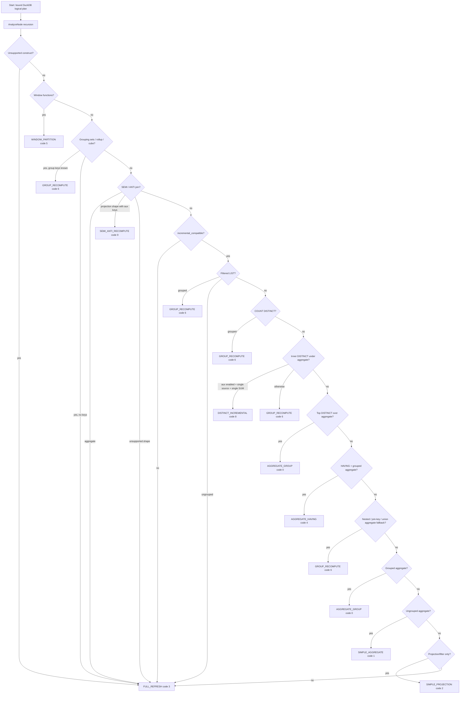

# Question D5 — The math under OpenIVM: Z-sets, DBSP, deltas, and Möbius

## TL;DR: OpenIVM is practical SQL engineering built on a small algebraic idea: represent a table as a **Z-set** (a bag whose tuple counts may be negative), represent changes as another Z-set, and compile a view's **delta function** so `REFRESH` applies only the change. DBSP and differential dataflow provide the stream/time model; OpenIVM turns that model into SQL programs, with special cases for joins, aggregates, `DISTINCT`, and `HAVING`.

## 1. Why this chapter exists

Question D5 asks for the math behind OpenIVM.
The short version is:

1. A base table is a function from rows to integer weights.
1. A transaction is also a function from rows to integer weights.
1. Insertions are positive weights.
1. Deletions are negative weights.
1. Updates are a deletion plus an insertion.
1. A materialized view is a function over those weighted tables.
1. Incremental refresh computes the view's **change**, not the view from scratch.
1. That change is added to the materialized view state.
   OpenIVM exposes this idea directly in its implementation.
   The core internal multiplicity column is named `openivm_multiplicity`.
   That constant is defined beside `openivm_timestamp`, which is the timestamp dimension of the delta stream:

- `.temp/openivm/src/include/core/openivm_constants.hpp:20-23`
  OpenIVM's `RefreshType` enum is the practical end of the math: after plan analysis, each view lands in one of ten maintenance strategies:
- `.temp/openivm/src/include/core/openivm_constants.hpp:67-79`
  The OpenIVM README explicitly points to the SIGMOD 2024 paper:
- `.temp/openivm/README.md:1-5`
  The project guide also says to keep the OpenIVM paper in mind for DBSP, Z-sets, and delta rules:
- `.temp/openivm/CLAUDE.md:23-25`
  This chapter connects those references to the code paths that matter for Spark.

______________________________________________________________________

## 2. Z-sets: signed bags

A normal SQL bag is a multiset.
It maps each tuple to a **non-negative** multiplicity:

$$
B : U \to \mathbb{N}
$$

A **Z-set** generalizes that to integer multiplicities:

$$
S : U \to \mathbb{Z}
$$

Where:

- `U` is the universe of possible tuples.
- `S(x)` is the signed multiplicity of tuple `x`.
- `S(x) = 0` means `x` is absent.
- `S(x) = 1` means one copy is present.
- `S(x) = 2` means two identical copies are present.
- `S(x) = -1` means one copy is being retracted.
  A Z-set is therefore a bag with negative counts.
  The DBSP paper uses this representation to model database collections with insertions and deletions. See the DBSP reference in §15: Budiu, Chajed, McSherry, Ryzhyk, and Tannen, *DBSP: Automatic Incremental View Maintenance for Rich Query Languages*, PVLDB 2023 / arXiv:2203.16684.
  In code, OpenIVM stores the signed multiplicity in `openivm_multiplicity`:
- `.temp/openivm/src/include/core/openivm_constants.hpp:20-23`
  And its distinct auxiliary-state comment spells out the same DBSP idea for `DISTINCT`:
- `.temp/openivm/src/include/core/openivm_constants.hpp:76-78`

### 2.1 Z-set notation

I will use these operations throughout:

| notation      | meaning                               |
| ------------- | ------------------------------------- |
| `S(x)`        | signed multiplicity of tuple `x`      |
| $S \oplus T$  | pointwise integer addition            |
| `-S`          | pointwise negation                    |
| $S \ominus T$ | $S \oplus (-T)$                       |
| `0`           | empty Z-set: every tuple maps to `0`  |
| `supp(S)`     | tuples whose multiplicity is non-zero |

Pointwise addition means:

$$
(S \oplus T)(x) = S(x) + T(x)
$$

So if:

$$
S((1, A)) = 1
$$

and:

$$
T((1, A)) = -1
$$

then:

$$
(S \oplus T)((1, A)) = 0
$$

The row cancels.
Implementation usually suppresses zero rows.
The algebra does not require them to be stored.

### 2.2 Why negative multiplicities are useful

A delete is not a separate concept.
It is just a tuple with weight `-1`.
An update is not a separate concept either.
It is:

1. A retraction of the old row.
1. An insertion of the new row.
   For example:

```sql
UPDATE accounts SET status = 'closed' WHERE id = 7;
```

Can be represented as this delta Z-set:

| row             | multiplicity |
| --------------- | -----------: |
| `(7, 'open')`   |         `-1` |
| `(7, 'closed')` |         `+1` |

That is why a single algebraic object can represent inserts, deletes, updates, and batches.
OpenIVM's Spark side also treats staged DML as signed changes.
The docs for `AGGREGATE_HAVING` explain that a data table can keep groups around so later signed changes can re-promote them into the visible result:

- `spark-ext/ivm-extension/src/main/scala/org/openivm/spark/commands/MaterializedViewCommands.scala:232-243`

______________________________________________________________________

## 3. From Z-sets to streams of Z-sets

A static table is a Z-set:

$$
S : U \to \mathbb{Z}
$$

A stream is a sequence of changes to that table.
DBSP and differential dataflow add a **time index**.
A simple model is:

$$
\Delta S : T \to (U \to \mathbb{Z})
$$

Read that as:

> At each logical time `t`, the stream contains a Z-set of tuple changes.
> Equivalently:

$$
\Delta S_t : U \to \mathbb{Z}
$$

Where $\Delta S_t(x)$ is the change in tuple `x` at time `t`.
This is the phrase from the prompt:

> Z-sets + a time index → stream of Z-sets.
> Differential dataflow popularized this model for data-parallel incremental computation.
> The canonical paper is McSherry, Murray, and Abadi, *Differential Dataflow*, CIDR 2013.
> DBSP applies the same idea to database query languages.
> The DBSP paper's abstract says it provides:

1. A language for computations over data streams.
1. A general algorithm for IVM over DBSP programs.
1. Models for full relational queries, grouping, aggregation, recursion, and streaming aggregation.
   Reference:

- DBSP paper: <https://arxiv.org/abs/2203.16684>
- PVLDB PDF: <https://www.vldb.org/pvldb/vol16/p1601-budiu.pdf>
  OpenIVM's project guide explicitly connects the OpenIVM paper to DBSP, Z-sets, and delta rules:
- `.temp/openivm/CLAUDE.md:23-25`
  OpenIVM's README cites the SIGMOD 2024 OpenIVM paper:
- `.temp/openivm/README.md:1-5`

### 3.1 State is an integral of deltas

If a stream gives us changes over time, the current table is the accumulated sum:

$$
S_t = \bigoplus_{\tau \le t} \Delta S_\tau
$$

This is the database version of integration.
A delta is a derivative.
A table is the integral of all prior deltas.
That analogy is more than poetic.
DBSP's title expands to **Database Stream Processor**, but the name deliberately echoes signal processing.
The derivative/integral intuition is central:

- `D` is the current state.
- $\Delta D$ is the next input signal.
- $D \oplus \Delta D$ is the next state.
- $V(D \oplus \Delta D) \ominus V(D)$ is the output signal.
  OpenIVM uses SQL to compile that output signal.

______________________________________________________________________

## 4. The fundamental IVM equation

Let:

- `V` be the view function.
- `D` be the source database state.
- $\Delta D$ be a source delta, represented as a Z-set.
- $V^\Delta$ be the delta version of `V`.
- $\oplus$ be Z-set addition.
  Then incremental view maintenance wants:

$$
V(D \oplus \Delta D) = V(D) \oplus V^\Delta(D, \Delta D)
$$

The prompt writes this as:

$$
V'(D + \Delta D) = V(D) \oplus V'(D, \Delta D)
$$

I will use $V^\Delta$ for the delta function to avoid overloading the prime on both sides.
The delta function is defined by:

$$
V^\Delta(D, \Delta D) = V(D \oplus \Delta D) \ominus V(D)
$$

So the refresh algorithm is:

1. Read the old materialized view state `V(D)`.
1. Read the base-table delta $\Delta D$.
1. Compute $V^\Delta (D, \Delta D)$.
1. Add it into the MV table.
1. Delete rows whose multiplicity/count reaches zero.
   In code, OpenIVM classifies the logical plan first.
   The recursive analyzer is `AnalyzeNode`:

- `.temp/openivm/src/core/incremental_checker.cpp:103-105`
  It returns a `PlanAnalysis` object with flags for aggregation, projection, HAVING, DISTINCT, joins, windows, top-k, and other cases:
- `.temp/openivm/src/include/core/incremental_checker.hpp:9-43`
  The parser then turns those flags into a `RefreshType`:
- `.temp/openivm/src/core/parser.cpp:591-800`
  The Spark extension caches and applies the compiled SQL program rather than recomputing it on every refresh:
- `spark-ext/ivm-extension/src/main/scala/org/openivm/spark/commands/MaterializedViewCommands.scala:658-664`

______________________________________________________________________

## 5. Linear operators: the easy case

An operator `L` is linear over Z-sets when:

$$
L(A \oplus B) = L(A) \oplus L(B)
$$

For a linear view:

$$
V^\Delta(D, \Delta D) = V(\Delta D)
$$

That is the best case.
You do not need the old state.
The delta is simply the query applied to the delta.

### 5.1 SELECT / projection

Projection is linear under bag semantics.
If a row appears with weight `+1`, its projected row appears with weight `+1`.
If a row appears with weight `-1`, its projected row appears with weight `-1`.
Example:

```sql
SELECT key FROM R;
```

If:

| input row  | multiplicity |
| ---------- | -----------: |
| `(1, 'A')` |         `-1` |
| `(3, 'C')` |         `+1` |

Then:

| output row | multiplicity |
| ---------- | -----------: |
| `(1)`      |         `-1` |
| `(3)`      |         `+1` |

No old state is needed.
OpenIVM classifies projection-only views as `SIMPLE_PROJECTION` when it finds projection but no aggregation:

- `.temp/openivm/src/core/parser.cpp:790-797`
  The enum gives `SIMPLE_PROJECTION` code position `2`:
- `.temp/openivm/src/include/core/openivm_constants.hpp:67-79`

### 5.2 WHERE / filter

A deterministic filter is linear.
For predicate `p`:

$$
\sigma_p(A \oplus B) = \sigma_p(A) \oplus \sigma_p(B)
$$

Rows that fail `p` map to zero.
Rows that pass preserve their signed weight.
The checker rejects volatile expressions in filters because a non-deterministic predicate is not a stable linear function:

- `.temp/openivm/src/core/incremental_checker.cpp:134-143`

### 5.3 UNION ALL

`UNION ALL` is Z-set addition.
So it is linear by definition:

$$
(A_1 \oplus B_1) \cup_{all} (A_2 \oplus B_2)
=
(A_1 \cup_{all} A_2) \oplus (B_1 \cup_{all} B_2)
$$

In practical SQL, this means deltas from both branches can be concatenated.

### 5.4 GROUP BY SUM / COUNT

Grouped `SUM` is additive when the delta carries signed multiplicity.
For group key `g` and value column `x`:

$$
\Delta sum_g = \sum_{r \in \Delta R, key(r)=g} weight(r) \cdot x(r)
$$

Grouped `COUNT` is also additive if we store the current count:

$$
\Delta count_g = \sum_{r \in \Delta R, key(r)=g} weight(r)
$$

OpenIVM records supported aggregate names in the checker, including `count`, `sum`, `avg`, `min`, `max`, variance, list, and boolean aggregates:

- `.temp/openivm/src/core/incremental_checker.cpp:24-29`
  It detects aggregate nodes and records aggregate function names:
- `.temp/openivm/src/core/incremental_checker.cpp:218-272`
  Spark-side refresh treats aggregate-group, aggregate-having, and distinct-incremental as count-monoid paths:
- `spark-ext/ivm-extension/src/main/scala/org/openivm/spark/commands/MaterializedViewCommands.scala:1322-1326`
  It resolves the count column from `openivm_count_star`, `openivm_distinct_count`, or a user-provided count alias:
- `spark-ext/ivm-extension/src/main/scala/org/openivm/spark/commands/MaterializedViewCommands.scala:1327-1351`

______________________________________________________________________

## 6. Bilinear operators: joins

A binary join is bilinear.
It is linear in the left input if the right input is fixed.
It is linear in the right input if the left input is fixed.
But it is not linear in both inputs together because both sides can change at once.
For two inputs:

$$
(R \oplus \Delta R) \Join (S \oplus \Delta S)
$$

Expand it like a binomial:

$$
(R \Join S)
\oplus (R \Join \Delta S)
\oplus (\Delta R \Join S)
\oplus (\Delta R \Join \Delta S)
$$

Subtract the old view:

$$
R \Join S
$$

The delta is:

$$
V^\Delta((R,S),(\Delta R,\Delta S))
=
(R \Join \Delta S)
\oplus
(\Delta R \Join S)
\oplus
(\Delta R \Join \Delta S)
$$

The prompt's single-symbol form is:

$$
V^\Delta(D, \Delta D)
=
(D \Join \Delta D)
\oplus
(\Delta D \Join D)
\oplus
(\Delta D \Join \Delta D)
$$

That is the textbook old-base version.

### 6.1 Why OpenIVM's join signs look different

OpenIVM's implementation uses a current-base scan in some paths.
The current base already includes the pending delta.
The join rule therefore uses inclusion-exclusion signs to avoid overcounting.
The code comment says the combined multiplicity is:

$$
(-1)^{k-1} \cdot \prod_i w_i
$$

Where `k` is the number of delta-side leaves in the term.
The implementation comment explains why:

- DML has already been applied to the source.
- The current scan reads $R_{now} = R_{old} + \Delta R$.
- The inclusion-exclusion sign cancels overcounting.
- This is algebraically equivalent to the textbook DBSP delta-join formula.
  Citation:
- `.temp/openivm/src/rules/join.cpp:873-891`
  This distinction matters.
  If you read the code expecting all-positive terms, it will look wrong.
  It is not wrong.
  It is using a different basis: current base plus signed Möbius cancellation.

______________________________________________________________________

## 7. N-way joins and the Möbius function

For an n-way join:

$$
R_1 \Join R_2 \Join \cdots \Join R_n
$$

The new state is:

$$
(R_1 \oplus \Delta R_1)
\Join
(R_2 \oplus \Delta R_2)
\Join
\cdots
\Join
(R_n \oplus \Delta R_n)
$$

The product expansion has `2^n` terms.
One term is the old view:

$$
R_1 \Join R_2 \Join \cdots \Join R_n
$$

The other `2^n - 1` terms contain at least one delta input.
With old-base scans, all non-empty delta-subset terms are positive.
With OpenIVM's current-base scans, the contribution for a non-empty subset $S \subseteq {1..n}$ is:

$$
sign(S) = (-1)^{|S|-1}
$$

and:

$$
term(S)
=
\left(\Join_{i \in S} \Delta R_i\right)
\Join
\left(\Join_{j \notin S} R_j\right)
$$

So the delta is:

$$
V^\Delta
=
\bigoplus_{\emptyset \ne S \subseteq \{1,\ldots,n\}}
(-1)^{|S|-1} \cdot term(S)
$$

This is the Möbius function of the subset lattice.
For the subset lattice ordered by inclusion, the relevant sign alternates by subset size.

### 7.1 Three-way example

For three relations:

$$
R \Join S \Join T
$$

OpenIVM's current-base inclusion-exclusion form is:

$$
+\Delta R \Join S \Join T
$$

$$
+R \Join \Delta S \Join T
$$

$$
+R \Join S \Join \Delta T
$$

$$
-\Delta R \Join \Delta S \Join T
$$

$$
-\Delta R \Join S \Join \Delta T
$$

$$
-R \Join \Delta S \Join \Delta T
$$

$$
+\Delta R \Join \Delta S \Join \Delta T
$$

The signs are:

| delta subset size | sign |
| ----------------: | ---: |
|                 1 |  `+` |
|                 2 |  `-` |
|                 3 |  `+` |

The code documents exactly that pattern:

- `k=1`: no sign flip.
- `k=2`: multiply by `-1`.
- `k=3`: no sign flip.
- `k=4`: multiply by `-1`.
  Citation:
- `.temp/openivm/src/rules/join.cpp:873-891`

### 7.2 How to read this as cancellation

The sign is not about whether the tuple is inserted or deleted.
Tuple insertion/deletion is already in each delta weight `w_i`.
The Möbius sign is about **basis conversion**.
It converts from a product over current relations to a delta relative to the old product.
For two relations:

$$
R_{now} = R_{old} \oplus \Delta R
$$

$$
S_{now} = S_{old} \oplus \Delta S
$$

The current-base formula is:

$$
\Delta R \Join S_{now}
\oplus
R_{now} \Join \Delta S
\ominus
\Delta R \Join \Delta S
$$

Expand it:

$$
\Delta R \Join (S_{old} \oplus \Delta S)
\oplus
(R_{old} \oplus \Delta R) \Join \Delta S
\ominus
\Delta R \Join \Delta S
$$

Now distribute:

$$
\Delta R \Join S_{old}
\oplus
\Delta R \Join \Delta S
\oplus
R_{old} \Join \Delta S
\oplus
\Delta R \Join \Delta S
\ominus
\Delta R \Join \Delta S
$$

One duplicate $\Delta R \bowtie \Delta S$ remains, which is exactly the textbook delta term.
So the current-base formula equals:

$$
\Delta R \Join S_{old}
\oplus
R_{old} \Join \Delta S
\oplus
\Delta R \Join \Delta S
$$

## Same result. Different implementation basis.

## 8. Non-linear and non-distributive operators

Not every SQL operator distributes cleanly over Z-set addition.
Some are linear.
Some are bilinear.
Some require auxiliary state.
Some require recomputation.

### 8.1 AVG decomposes into SUM / COUNT

`AVG(x)` is not directly additive:

$$
avg(A \oplus B) \ne avg(A) \oplus avg(B)
$$

But it decomposes into two additive pieces:

$$
avg(x) = \frac{sum(x)}{count(x)}
$$

So OpenIVM can maintain hidden sum and count columns, then derive the visible average.
The compiler detects decomposed aggregate types, including `avg`, `stddev`, and variance forms:

- `.temp/openivm/src/upsert/refresh_compiler.cpp:90-112`
  The MERGE compiler computes derived columns from hidden sum/count state:
- `.temp/openivm/src/upsert/refresh_compiler.cpp:468-510`
  The hidden-column propagation logic exists because those helper columns must survive planning:
- `.temp/openivm/src/core/plan_rewrite.cpp:720-757`

### 8.2 SUM is group-like

For a group key `g`, `SUM(x)` can absorb positive and negative contributions.
If a row with `x=10` is inserted, add `10`.
If it is deleted, add `-10`.
The inverse exists because the delta carries the deleted value.
This is why `SUM` behaves like a group over the additive state.

### 8.3 COUNT is a monoid with stored state

`COUNT` is not a group if you only look at the final visible value.
A visible count is normally non-negative.
But incremental maintenance stores the current count and applies signed deltas.
If the current count is `5` and a delete arrives, the new count is `4`.
If the current count reaches `0`, the group disappears from the visible result.
Spark's refresh command explicitly treats aggregate-group, aggregate-having, and distinct-incremental as count-monoid refresh types:

- `spark-ext/ivm-extension/src/main/scala/org/openivm/spark/commands/MaterializedViewCommands.scala:1322-1326`
  It then resolves the correct count column for cleanup:
- `spark-ext/ivm-extension/src/main/scala/org/openivm/spark/commands/MaterializedViewCommands.scala:1327-1351`

### 8.4 MIN and MAX are not invertible

`MIN` and `MAX` are not invertible under deletion.
Suppose the group values are:

| value | count |
| ----: | ----: |
|     5 |     1 |
|     7 |     1 |

The minimum is `5`.
If `(5)` is deleted, the new minimum is `7`.
You cannot know that from the old minimum alone.
You need an ordered auxiliary structure or you need to recompute the affected group.
OpenIVM's checker flags `min`, `max`, `arg_min`, and `arg_max` as min/max-sensitive:

- `.temp/openivm/src/core/incremental_checker.cpp:253-256`
  The parser's classification logic routes many non-linear group cases to `GROUP_RECOMPUTE` rather than pretending they are simple additive aggregates:
- `.temp/openivm/src/core/parser.cpp:767-789`
  OpenIVM also exposes insert-only MIN/MAX options, but the general deletion case is not invertible without more state.

______________________________________________________________________

## 9. DISTINCT as a count monoid

`DISTINCT` looks non-linear:

$$
DISTINCT(R) = \{x \mid count_R(x) > 0\}
$$

The threshold at zero is the hard part.
If tuple `x` has count `2` and one copy is deleted, it should remain visible.
If tuple `x` has count `1` and one copy is deleted, it should emit `-1`.
So the correct incremental state is the hidden count per distinct tuple.
OpenIVM's extension setting says exactly this:

- `openivm_distinct_aux_state` uses auxiliary count state.
- It follows `distinct(R)=sgn(R[t])`.
- It emits `±1` only on count transitions across zero.
  Citation:
- `.temp/openivm/src/openivm_extension.cpp:161-166`
  The enum also documents the same meaning:
- `.temp/openivm/src/include/core/openivm_constants.hpp:76-78`

### 9.1 Transition table

For a tuple `x`, let `c` be its old count and `d` be the incoming delta count.

| old count `c` | delta `d` | new count `c+d` | distinct delta |
| ------------: | --------: | --------------: | -------------: |
|             0 |        +1 |               1 |             +1 |
|             1 |        +1 |               2 |              0 |
|             2 |        -1 |               1 |              0 |
|             1 |        -1 |               0 |             -1 |
|             3 |        -3 |               0 |             -1 |
|             0 |         0 |               0 |              0 |

That is why `DISTINCT` is a count monoid.
The visible result is thresholded.
The maintained state is a count.

### 9.2 The SQL compiler implements that transition

`CompileDistinctIncremental` first builds `openivm_dinput_<view>` with a grouped signed delta:

- `.temp/openivm/src/upsert/refresh_compiler_aux.cpp:87-96`
  Then it computes `dd`, the visible distinct delta:
- `+1` when old count was zero and incoming delta is positive.
- `-1` when old count was positive and new count becomes zero or negative.
- `0` otherwise.
  Citation:
- `.temp/openivm/src/upsert/refresh_compiler_aux.cpp:98-107`
  Then it MERGEs the aggregate data table, deletes zero-count groups, MERGEs the auxiliary count table, and deletes auxiliary rows whose count is no longer positive:
- `.temp/openivm/src/upsert/refresh_compiler_aux.cpp:112-126`
  There is also a logical-plan rewrite for `DISTINCT` that replaces it with an aggregate count column named `openivm_distinct_count`:
- `.temp/openivm/src/rules/distinct.cpp:33-45`
  And the CREATE-time plan rewrite uses the same hidden count alias:
- `.temp/openivm/src/core/plan_rewrite.cpp:58-64`

______________________________________________________________________

## 10. HAVING needs special handling

`HAVING` is a predicate over aggregate state.
Example:

```sql
CREATE MATERIALIZED VIEW big_regions AS
SELECT region, SUM(amount) AS total, COUNT(*) AS cnt
FROM sales
GROUP BY region
HAVING SUM(amount) > 1000;
```

A group can move in and out of the visible result without the group itself being newly created.
For example:

| region | old total | delta | new total |  visible delta |
| ------ | --------: | ----: | --------: | -------------: |
| `US`   |       950 |   +75 |      1025 | +1 visible row |
| `EU`   |      1100 |  -200 |       900 | -1 visible row |
| `JP`   |       300 |   +10 |       310 |              0 |

If the MV only stored rows currently passing `HAVING`, it would lose the state needed to re-promote `US` later.
The Spark extension therefore splits `AGGREGATE_HAVING` into two objects:

1. A Delta data table that stores **all groups**.
1. A user-facing Spark VIEW that applies the HAVING predicate.
   The helper documents this convention:

- The sibling data table is `<table>__ivm_data`.
- It stores every group.
- The user-facing object applies the HAVING predicate at read time.
  Citation:
- `spark-ext/ivm-extension/src/main/scala/org/openivm/spark/commands/MaterializedViewCommands.scala:232-243`
  The CREATE path repeats the same design:
- `spark-ext/ivm-extension/src/main/scala/org/openivm/spark/commands/MaterializedViewCommands.scala:641-645`
  It creates the data table first, then creates the Spark VIEW:
- `spark-ext/ivm-extension/src/main/scala/org/openivm/spark/commands/MaterializedViewCommands.scala:696-742`

### 10.1 Trade-off

The trade-off is storage versus correctness.

| design                           | storage | correctness                                |
| -------------------------------- | ------: | ------------------------------------------ |
| Store only HAVING-passing groups | smaller | cannot re-promote groups without recompute |
| Store all groups + view filter   |  larger | correct incremental threshold transitions  |

OpenIVM chooses the second design for incremental `AGGREGATE_HAVING`.
The checker detects HAVING as a filter directly above aggregate:

- `.temp/openivm/src/core/incremental_checker.cpp:134-143`
  The parser classifies HAVING over grouped aggregate as `AGGREGATE_HAVING`:
- `.temp/openivm/src/core/parser.cpp:772-775`

______________________________________________________________________

## 11. The IncrementalChecker decision tree

OpenIVM does not start by generating SQL.
It first walks the logical plan and records facts.
`PlanAnalysis` contains flags such as:

- `found_aggregation`
- `found_projection`
- `found_having`
- `found_distinct`
- `found_minmax`
- `found_left_join`
- `found_full_outer`
- `found_semi_anti_join`
- `found_join`
- `found_window`
- `found_top_k`
- `found_count_distinct`
- `found_grouping_sets`
  Citation:
- `.temp/openivm/src/include/core/incremental_checker.hpp:9-43`
  The traversal is single-pass and recursive:
- `.temp/openivm/src/core/incremental_checker.cpp:103-105`
  It recognizes joins:
- `.temp/openivm/src/core/incremental_checker.cpp:181-216`
  It recognizes aggregates:
- `.temp/openivm/src/core/incremental_checker.cpp:218-290`
  It recognizes windows and top-k shapes:
- `.temp/openivm/src/core/incremental_checker.cpp:294-379`
  It returns compatibility through `AnalyzePlan` and `ValidateIncrementalPlan`:
- `.temp/openivm/src/core/incremental_checker.cpp:393-400`
  Then `parser.cpp` maps that analysis to refresh strategy:
- `.temp/openivm/src/core/parser.cpp:610-797`

### 11.1 Mermaid decision tree



The enum order for the ten codes is:

| code | RefreshType            | practical meaning                                 |
| ---: | ---------------------- | ------------------------------------------------- |
|    0 | `AGGREGATE_GROUP`      | keyed aggregate MERGE                             |
|    1 | `SIMPLE_AGGREGATE`     | scalar aggregate update                           |
|    2 | `SIMPLE_PROJECTION`    | signed projection/filter maintenance              |
|    3 | `FULL_REFRESH`         | full recompute / overwrite                        |
|    4 | `AGGREGATE_HAVING`     | all-groups data table + HAVING view               |
|    5 | `WINDOW_PARTITION`     | affected partition recompute                      |
|    6 | `GROUP_RECOMPUTE`      | affected group recompute                          |
|    7 | `TOP_K`                | legacy enum value in OpenIVM; Spark demotes top-k |
|    8 | `DISTINCT_INCREMENTAL` | auxiliary count-state distinct                    |
|    9 | `SEMI_ANTI_RECOMPUTE`  | transition-count semi/anti path                   |

Citation for enum:

- `.temp/openivm/src/include/core/openivm_constants.hpp:67-79`
  Spark has an additional effective-classification layer.
  For top-k, Spark forces `FULL_REFRESH` because it does not yet mirror OpenIVM's inner-data-table plus user-facing view split for `ORDER BY / LIMIT`:
- `spark-ext/ivm-extension/src/main/scala/org/openivm/spark/commands/MaterializedViewCommands.scala:488-507`
  The final Spark demotion/keep decision is made in a structured branch with reason keys such as `top_k`, `having_pred_empty`, and `no_real_delta`:
- `spark-ext/ivm-extension/src/main/scala/org/openivm/spark/commands/MaterializedViewCommands.scala:560-619`

______________________________________________________________________

## 12. Worked Z-set example

Source:

$$
R = \{(1,A): 1, (2,B): 2\}
$$

Delta:

$$
\Delta R = \{(1,A): -1, (3,C): 1\}
$$

New state:

$$
R \oplus \Delta R = \{(2,B): 2, (3,C): 1\}
$$

The `(1,A)` row has multiplicity zero after cancellation, so it is removed.
View:

```sql
SELECT key FROM R;
```

This projection is linear.
So:

$$
V^\Delta(\Delta R) = V(\Delta R)
$$

### 12.1 Source state

| tuple   | `R` multiplicity | $\Delta R$ multiplicity | $R \oplus \Delta R$ multiplicity |
| ------- | ---------------: | ----------------------: | -------------------------------: |
| `(1,A)` |                1 |                      -1 |                                0 |
| `(2,B)` |                2 |                       0 |                                2 |
| `(3,C)` |                0 |                       1 |                                1 |

### 12.2 Projected view state

| key | `V(R)` | $V^\Delta (\Delta R)$ | $V(R) \oplus V^\Delta (\Delta R)$ | $V(R \oplus \Delta R)$ |
| --: | -----: | --------------------: | --------------------------------: | ---------------------: |
|   1 |      1 |                    -1 |                                 0 |                      0 |
|   2 |      2 |                     0 |                                 2 |                      2 |
|   3 |      0 |                     1 |                                 1 |                      1 |

The equality holds:

$$
V(R) \oplus V^\Delta(\Delta R) = V(R \oplus \Delta R)
$$

Expanded:

$$
\{1:1, 2:2\} \oplus \{1:-1, 3:1\}
=
\{2:2, 3:1\}
$$

And:

$$
V(R \oplus \Delta R) = \{2:2, 3:1\}
$$

So the incremental refresh is correct.

### 12.3 Equivalent SQL intuition

A batch delta table could look like:

| key | val | `openivm_multiplicity` |
| --: | --- | ---------------------: |
|   1 | `A` |                     -1 |
|   3 | `C` |                     +1 |

The projection delta is:

```sql
SELECT key, openivm_multiplicity
FROM delta_R;
```

The MV apply step is conceptually:

```sql
MERGE INTO mv_keys AS old
USING projected_delta AS d
ON old.key = d.key
WHEN MATCHED THEN UPDATE SET count = old.count + d.openivm_multiplicity
WHEN NOT MATCHED THEN INSERT (key, count) VALUES (d.key, d.openivm_multiplicity);
DELETE FROM mv_keys WHERE count = 0;
```

## The real generated SQL is more careful about bag semantics, null-safe equality, hidden columns, and per-refresh staging, but the algebra is the same.

## 13. How LPTS fits into the math

LPTS is not the math foundation.
It is the bridge that makes the math executable as SQL.
OpenIVM rewrites a DuckDB logical plan into an incremental logical plan.
LPTS turns that logical plan back into SQL CTEs.
The LPTS README says it reconstructs DuckDB's post-optimizer logical plan as equivalent SQL:

- `.temp/lpts/README.md:1-5`
  Its onboarding guide explains why CTEs are used: each operator becomes one named CTE, producing a flat list that maps one-to-one to the logical plan:
- `.temp/lpts/onboarding.md:39-41`
  The current LPTS repository does not appear to ship a paper.
  Its README has a TODO to add `LPTS_Research_Project_Report.pdf`:
- `.temp/lpts/README.md:93-98`
  So in the reference list below, LPTS is cited as project documentation rather than as an academic publication.

______________________________________________________________________

## 14. Practical mental model for OpenIVM on Spark

When reading the Spark extension, keep this stack in mind:

```text
SQL table / Delta table
  ↓ interpreted as
Z-set: tuple -> integer multiplicity
  ↓ with transaction time
stream of Z-sets: time -> tuple -> integer multiplicity
  ↓ through a view function
view delta: V^Δ(D, ΔD)
  ↓ compiled by OpenIVM + LPTS
MERGE / UPDATE / DELETE / INSERT SQL
  ↓ executed by Spark
materialized Delta table
```

The CREATE path:

1. Parses the user SQL.
1. Calls OpenIVM's compiler.
1. Receives a `RefreshType` and SQL program.
1. Creates the initial MV table.
1. Stores metadata and compiled SQL.
   The REFRESH path:
1. Collects staged source deltas.
1. Creates temp views over those deltas.
1. Rewrites the compiled SQL for Spark.
1. Executes the SQL statements.
1. Marks staged deltas consumed.
1. Applies count cleanup for count-monoid paths.
   The count cleanup is necessary because Z-set algebra allows zero and negative intermediate weights, but SQL tables should not expose zero-count groups.
   That is why Spark has a `countMonoidColumn` helper and post-pass cleanup:

- `spark-ext/ivm-extension/src/main/scala/org/openivm/spark/commands/MaterializedViewCommands.scala:1320-1351`

______________________________________________________________________

## 15. Papers and references

1. **OpenIVM: a SQL-to-SQL Compiler for Incremental Computations.** SIGMOD 2024. The OpenIVM README links the ACM DOI: <https://dl.acm.org/doi/10.1145/3626246.3654743>. Citation in repo: `.temp/openivm/README.md:1-5`.
1. **OpenIVM arXiv version.** The project guide links *OpenIVM: a SQL-to-SQL Compiler for Incremental Computations* at <https://arxiv.org/abs/2404.16486> and says it is the theoretical reference for DBSP, Z-sets, and delta rules. Citation in repo: `.temp/openivm/CLAUDE.md:23-25`.
1. **Differential Dataflow.** Frank McSherry, Derek G. Murray, and Daniel J. Abadi. CIDR 2013. PDF: <https://www.cidrdb.org/cidr2013/Papers/CIDR13_Paper117.pdf>. This is the classic reference for data-parallel differential computation over changing collections.
1. **DBSP: Automatic Incremental View Maintenance for Rich Query Languages.** Mihai Budiu, Tej Chajed, Frank McSherry, Leonid Ryzhyk, and Val Tannen. PVLDB 2023 / arXiv:2203.16684. Links: <https://arxiv.org/abs/2203.16684>, <https://www.vldb.org/pvldb/vol16/p1601-budiu.pdf>. This is the clearest academic reference for Z-sets plus streams as a general IVM model.
1. **F-IVM / factorized IVM / Frances-IVM.** The OpenIVM paper positions OpenIVM in the SQL-to-SQL IVM line and is the best local citation for how these ideas connect to OpenIVM. Start with the OpenIVM paper above, then follow its related-work section.
1. **LPTS documentation.** LPTS is the Logical Plan To SQL bridge used by OpenIVM's SQL compilation flow. The README describes optimized-plan inspection and cross-system SQL compilation: `.temp/lpts/README.md:1-5`. A standalone LPTS paper is not present in the checkout; the README has a TODO for `LPTS_Research_Project_Report.pdf`: `.temp/lpts/README.md:93-98`.
1. **OpenIVM join implementation.** For the concrete Möbius inclusion-exclusion sign used by this codebase, read `.temp/openivm/src/rules/join.cpp:873-891`.
1. **OpenIVM classifier implementation.** For the actual decision tree, read `.temp/openivm/src/core/incremental_checker.cpp:103-400` and `.temp/openivm/src/core/parser.cpp:610-797`.

______________________________________________________________________

## 16. Summary

OpenIVM's math is compact:

$$
S : U \to \mathbb{Z}
$$

A table is a signed bag.
A transaction is a signed bag.
A stream is a time-indexed sequence of signed bags.
A view is a function over signed bags.
Refresh compiles this equation:

$$
V(D \oplus \Delta D) = V(D) \oplus V^\Delta(D, \Delta D)
$$

Linear operators pass deltas through.
Joins expand like products.
OpenIVM's n-way join uses Möbius signs because its current-base scans already include pending deltas.
Aggregates work when their state is additive or decomposable.
`DISTINCT` works by storing counts and emitting only threshold-crossing deltas.
`HAVING` works by storing all groups and exposing a filtered view.
Everything else is a classification problem: choose the cheapest correct `RefreshType`, or fall back to recompute when the algebra needs state OpenIVM does not maintain.
Next: see [2-compiler-and-refresh-types.md](./2-compiler-and-refresh-types.md) for how the OpenIVM compiler turns these rules into Spark-executable refresh programs.
