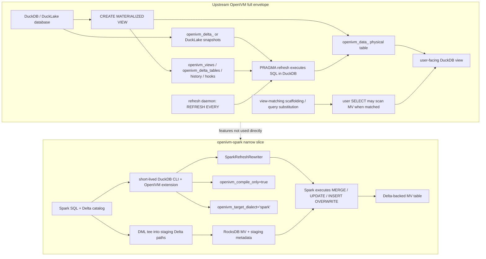

# 10. DuckLake mode, daemon, schema evolution, and view matching

This chapter is about upstream OpenIVM features that openivm-spark mostly does **not** use.
openivm-spark uses OpenIVM as a compiler.
It loads the DuckDB extension in a short-lived DuckDB CLI process.
It asks OpenIVM to classify one materialized view and emit refresh SQL.
Then Spark executes the rewritten program against Delta tables.
Upstream OpenIVM has a wider envelope.
It can own materialized-view storage inside DuckDB or DuckLake.
It can execute refreshes itself.
It has a background refresh daemon.
It has DuckDB-side ALTER TABLE handling for schema evolution.
It has view-matching scaffolding for automatic query substitution.
It also exposes several PRAGMAs that openivm-spark pins differently from native DuckDB mode.
The important distinction is:

```text
upstream OpenIVM = MV engine inside DuckDB / DuckLake
openivm-spark   = Spark extension + Delta storage + OpenIVM compile bridge
```

## 10.1 Source-verified scope

This document was written from the checked-out upstream source under the local OpenIVM research checkout.
Citations intentionally use upstream-relative paths such as `src/openivm_extension.cpp`.
They do not rely on the scratch checkout path.
Important source landmarks:

- `src/openivm_extension.cpp`: extension settings, PRAGMA registration, daemon startup.
- `src/core/parser.cpp`: `CREATE MATERIALIZED VIEW` handling and native MV storage DDL.
- `src/core/parser_parse.cpp`: `REFRESH EVERY` and `ALTER MATERIALIZED VIEW ... SET REFRESH ...` parsing.
- `src/core/refresh_daemon.cpp`: scheduled refresh loop.
- `src/upsert/refresh.cpp`: native refresh execution and compile-only bypass.
- `src/upsert/refresh_sql.cpp`: cascade-delta emission flags and SQL artifact writing.
- `src/rules/ducklake_join.cpp`: DuckLake N-term join delta construction.
- `src/rules/refresh_insert_rule.cpp`: native DML interception and schema-evolution ALTER handling.
- `src/rules/schema_evolution.cpp`: dependent-view metadata rewrite for column rename.
- `src/match/*` and `src/include/match/*`: view-matching scaffolding.
- `spark-ext/ivm-compiler/src/main/scala/org/openivm/spark/compiler/OpenIvmCompiler.scala`: the Spark compile bridge settings.
  Two requested defaults differ from the inspected upstream source:
- `openivm_enable_view_matching` is registered with default `false`, not `true`.
  Citation: `src/openivm_extension.cpp:173-177`.
- `openivm_minmax_incremental` is registered with default `true` upstream, while openivm-spark sets it to `false`.
  Citation: `src/openivm_extension.cpp:145-147` and `OpenIvmCompiler.scala:168-176`.
  This chapter therefore describes the source-verified behavior and calls out those differences explicitly.

## 10.2 The narrow openivm-spark slice

The openivm-spark compiler bridge pins OpenIVM into a narrow role.
The generated DuckDB script loads the extension and sets:

```sql
SET openivm_target_dialect='spark';
SET openivm_compile_only=true;
SET openivm_enable_view_matching=false;
SET openivm_force_view_delta_cascade=true;
SET openivm_emit_cascade_delta_for_recompute=true;
SET openivm_minmax_incremental=false;
SET openivm_files_path='<per-compile-directory>';
```

Citation: `spark-ext/ivm-compiler/src/main/scala/org/openivm/spark/compiler/OpenIvmCompiler.scala:150-176`.
That script is deliberately ephemeral.
It creates shadow DuckDB tables from Spark schemas.
It creates a shadow MV in DuckDB.
It calls `PRAGMA compile_refresh(...)`.
It reads the generated program.
Then Spark rewrites and executes the program.
The bridge does **not** let OpenIVM own the production storage.
It does **not** let OpenIVM's daemon refresh Spark MVs.
It does **not** use OpenIVM's native query-time view matching.
It does **not** trust DuckDB-side schema-evolution repair for Spark Delta tables.
The reason is architectural, not just missing glue.
Spark owns the SQL session, optimizer, catalog, Delta transaction protocol, and MV tables.
OpenIVM supplies the incremental algebra and refresh program.

## 10.3 DuckLake mode: OpenIVM as a database-side MV engine

Upstream OpenIVM supports MVs over DuckLake tables.
DuckLake is DuckDB's lakehouse extension: DuckDB stores catalog metadata and Parquet-backed table state with snapshot history.
The upstream documentation says OpenIVM detects DuckLake tables and uses DuckLake native change tracking instead of separate delta tables.
Citation: `docs/ducklake.md:1-5` and `docs/ducklake.md:39-58`.
A native DuckLake-backed MV looks like this:

```sql
INSTALL ducklake;
LOAD ducklake;
ATTACH ':memory:' AS dl (TYPE ducklake);
CREATE TABLE dl.products (pid INT, pname VARCHAR);
CREATE TABLE dl.sales (pid INT, qty INT, revenue INT);
CREATE MATERIALIZED VIEW dl.product_summary AS
SELECT p.pname, SUM(s.revenue) AS total_rev, COUNT(*) AS sale_count
FROM dl.products p INNER JOIN dl.sales s ON p.pid = s.pid
GROUP BY p.pname;
INSERT INTO dl.sales VALUES (1, 5, 50);
PRAGMA refresh('product_summary');
SELECT * FROM dl.product_summary;
```

The examples are source-documented in `docs/ducklake.md:7-35`.

### 10.3.1 What DuckLake mode persists

In native mode, OpenIVM creates real database objects.
At MV creation it creates a physical data table:

```text
openivm_data_<view>
```

Then it creates a user-facing DuckDB view named like the MV.
That view reads from the data table and hides internal `openivm_*` columns where needed.
Citations:

- physical data table creation: `src/core/parser.cpp:1120-1167`;
- user-facing view creation: `src/core/parser.cpp:1182-1207`.
  For ordinary DuckDB base tables, OpenIVM also creates per-source delta tables:

```text
openivm_delta_<base_table>
```

Those delta tables include `openivm_multiplicity` and `openivm_timestamp` columns.
Citation: `src/core/parser.cpp:1210-1255`.
For DuckLake base tables, OpenIVM skips those physical delta tables.
It stores source metadata in `openivm_delta_tables`, including `catalog_type = 'ducklake'`, `last_snapshot_id`, `source_catalog`, `source_schema`, and `source_table_id`.
Citations:

- metadata columns: `src/core/parser_create_mv_helpers.cpp:95-111`;
- DuckLake metadata row construction: `src/core/parser.cpp:1046-1116`.

### 10.3.2 What DuckLake mode does at refresh

In native mode, OpenIVM executes refresh SQL itself.
`PRAGMA refresh('view')` calls the refresh pipeline, generates SQL, and then executes it through DuckDB connections.
The refresh path explicitly says compile-only is a bypass: when `openivm_compile_only=true`, the SQL artifact is written but execution is skipped.
Citation: `src/upsert/refresh.cpp:166-190`.
When compile-only is **false**, the native path executes the generated SQL.
For ordinary DuckDB MVs it wraps the refresh in a transaction.
For DuckLake cross-system MVs it splits metadata writes and data writes because DuckDB cannot write two attached databases in a single transaction.
Citation: `src/upsert/refresh.cpp:200-247`.
That is the opposite of openivm-spark.
openivm-spark sets `openivm_compile_only=true` on every compile.
Spark then executes the equivalent program against Delta tables.

### 10.3.3 DuckLake change tracking

DuckLake tables have snapshot IDs.
OpenIVM stores the last refreshed snapshot and reads insertions/deletions between snapshots at refresh time.
The upstream docs describe this as replacing delta tables with native change tracking.
Citation: `docs/ducklake.md:46-58`.
The insert rule also confirms the storage split.
When a DML insert targets a DuckLake table, OpenIVM skips writing an OpenIVM delta table because DuckLake already has native change tracking.
Citation: `src/rules/refresh_insert_rule.cpp:412-415`.

### 10.3.4 DuckLake N-term join maintenance

DuckLake also changes the join delta rule.
For normal DuckDB tables, OpenIVM uses inclusion-exclusion over every non-empty subset of changed inputs.
For `N` joined tables that can mean `2^N - 1` terms.
For DuckLake tables, OpenIVM can read old snapshots with `AT VERSION`.
That lets it use a telescoping formula with exactly `N` terms.
The header documents the formula:

```text
Term i: ΔTᵢ ⋈ (T₁_new ⋈ ... ⋈ Tᵢ₋₁_new ⋈ Tᵢ₊₁_old ⋈ ... ⋈ Tₙ_old)
```

Citation: `src/include/rules/ducklake_join.hpp:12-21`.
The implementation pins later tables to old snapshots using DuckLake scan metadata and emits `AT (VERSION => <snapshot>)` through LPTS.
Citations:

- `DuckLakeQualifiedTable(... AT (VERSION => ...))`: `src/rules/ducklake_join.cpp:89-97`;
- `PinToOldSnapshot`: `src/rules/ducklake_join.cpp:132-151`;
- term builder setup: `src/rules/ducklake_join.cpp:153-180`.
  Upstream docs summarize the same optimization and state that `openivm_ducklake_nterm=false` falls back to the standard inclusion-exclusion rule.
  Citation: `docs/ducklake.md:60-88`.

### 10.3.5 Why openivm-spark does not use DuckLake mode

openivm-spark targets Delta Lake, not DuckLake.
Its production source tables are Delta tables.
Its production MVs are Delta tables.
Its DML capture is Spark-side staging.
The DuckDB process in openivm-spark is a compiler subprocess.
It does not have production data.
It sees only shadow DDLs and empty or compile-time helper tables.
Therefore DuckLake mode would be the wrong ownership model.
If openivm-spark ever adopted DuckLake mode, it would become a different product shape:

- Spark would need to read and write DuckLake-managed data tables.
- OpenIVM would become the production refresh executor, not just the compiler.
- Spark metadata would need to mirror OpenIVM metadata or delegate to it.
- Delta staging and RocksDB MV metadata would be replaced or bridged.
- Transaction ownership would shift from Delta to DuckDB / DuckLake.
  That is beyond the current openivm-spark architecture.

## 10.4 The maintenance daemon

Upstream OpenIVM includes a background refresh daemon.
It is not a Spark daemon.
It is a C++ `std::thread` attached to a DuckDB `DatabaseInstance`.
The header summarizes it:

```text
Background thread that periodically refreshes materialized views with a REFRESH EVERY interval.
The daemon wakes every 30 seconds, checks which views are due, and refreshes them.
Views already being refreshed are skipped via TryLockView.
```

Citation: `src/include/core/refresh_daemon.hpp:14-17`.

### 10.4.1 User interface

The daemon is configured through MV DDL:

```sql
CREATE MATERIALIZED VIEW mv REFRESH EVERY '5 minutes' AS
SELECT ...;
```

If no `REFRESH EVERY` clause exists, the view is manual-only.
Upstream docs state the syntax and supported interval families.
Citation: `docs/refresh/automatic-refresh.md:1-21`.
The parser extracts `REFRESH EVERY` from `CREATE MATERIALIZED VIEW`.
Citation: `src/core/parser_parse.cpp:73-86`.
The parser also supports changing the schedule:

```sql
ALTER MATERIALIZED VIEW mv SET REFRESH EVERY '10 minutes';
ALTER MATERIALIZED VIEW mv SET REFRESH MANUAL;
```

Citation: `src/core/parser_parse.cpp:22-45`.
Users can inspect status through:

```sql
PRAGMA refresh_status('mv');
```

The PRAGMA returns `view_name`, `refresh_interval`, `last_refresh`, `next_refresh`, `status`, `effective_interval`, and `refresh_strategy`.
Citation: `src/openivm_extension.cpp:389-450`.
There is also an explicit start PRAGMA:

```sql
PRAGMA refresh_start_daemon;
```

It stops any existing daemon object, creates a new `RefreshDaemon`, starts it, and returns `started = true`.
Citation: `src/openivm_extension.cpp:452-464`.

### 10.4.2 Startup and disable flag

The extension starts the daemon at load time unless `openivm_disable_daemon=true`.
Citation: `src/openivm_extension.cpp:466-477`.
The setting is registered as:

```text
openivm_disable_daemon: disable the refresh daemon (for shadow/compile-only DBs)
```

Citation: `src/openivm_extension.cpp:125-126`.
That parenthetical matters for openivm-spark.
A compile-only DuckDB subprocess is a shadow database.
It should not run a background refresh loop for production MVs.
The current Spark compile script does not set this flag directly in `OpenIvmCompiler.scala`, but it also uses a short-lived compile process and sets `openivm_compile_only=true`.
A long-lived compile service should set `openivm_disable_daemon=true` explicitly.

### 10.4.3 Daemon loop

The daemon loop is straightforward:

1. wait for 30 seconds;
1. open a DuckDB connection;
1. read cascade and backoff settings;
1. query scheduled views;
1. skip views not yet due;
1. skip views already locked;
1. call `PRAGMA refresh('view')`;
1. run optional refresh hooks;
1. apply adaptive backoff if refresh duration exceeds the configured interval.
   Citations:

- wait and wake: `src/core/refresh_daemon.cpp:56-70`;
- read scheduled views: `src/core/refresh_daemon.cpp:125-132`;
- due-time check: `src/core/refresh_daemon.cpp:142-163`;
- non-blocking view lock skip: `src/core/refresh_daemon.cpp:165-173`;
- hooks and refresh call: `src/core/refresh_daemon.cpp:183-219`;
- adaptive backoff: `src/core/refresh_daemon.cpp:245-258`.
  `RefreshMetadata::GetScheduledViews()` selects views with non-null `refresh_interval` and reads the minimum source-delta `last_update` as the last-refresh marker.
  Citation: `src/core/refresh_metadata.cpp:307-328`.

### 10.4.4 Hooks

The daemon reads `openivm_refresh_hooks` and supports hook modes:

- `before`: execute hook SQL before normal IVM refresh;
- `after`: execute hook SQL after normal IVM refresh;
- `replace`: execute hook SQL instead of normal IVM refresh.
  The hook table is created as part of OpenIVM system-table DDL.
  Citation: `src/core/parser_create_mv_helpers.cpp:89-93`.
  The daemon uses it at refresh time.
  Citation: `src/core/refresh_daemon.cpp:186-219`.

### 10.4.5 Why openivm-spark does not use the daemon

Spark has no hook where a DuckDB extension thread can safely refresh Spark MVs.
Spark refresh requires:

- SparkSession access;
- Delta catalog access;
- staged Delta paths;
- RocksDB metadata updates;
- Spark SQL execution;
- Spark-side locking and cleanup.
  The upstream daemon only knows DuckDB `DatabaseInstance` state.
  It calls DuckDB `PRAGMA refresh(...)`.
  That is useful in native OpenIVM mode, not in openivm-spark.
  A Spark equivalent would need to be a Spark-side scheduler or service.
  It would probably call `REFRESH MATERIALIZED VIEW` through Spark SQL, not OpenIVM's native PRAGMA.

## 10.5 Schema evolution

Schema evolution is one of the biggest differences between upstream OpenIVM and openivm-spark.
The short version:

```text
upstream OpenIVM: tries to keep native delta tables and metadata in sync for some ALTERs
openivm-spark: detects any source schema fingerprint drift and forces DROP + CREATE
```

### 10.5.1 Upstream OpenIVM behavior

Upstream has an executable schema-evolution test.
It covers:

- `ALTER TABLE ... ADD COLUMN`;
- `ALTER TABLE ... DROP COLUMN` for unreferenced columns;
- blocking `DROP COLUMN` for referenced columns;
- `ALTER TABLE ... RENAME COLUMN` for unreferenced and referenced columns;
- multiple add/drop cycles;
- aux-state metadata repair for more complex paths.
  Citation: `test/sql/schema_evolution.test:14-194`.
  The native insert rule handles `LOGICAL_ALTER`.
  If the altered table is tracked by IVM, it updates the corresponding delta table or dependent MV metadata.
  Citation: `src/rules/refresh_insert_rule.cpp:320-390`.
  For `ADD COLUMN`, OpenIVM runs:

```sql
ALTER TABLE openivm_delta_<table> ADD COLUMN IF NOT EXISTS <new_col> <type>
```

Citation: `src/rules/refresh_insert_rule.cpp:343-355`.
For `DROP COLUMN`, OpenIVM first asks whether any dependent MV references the column.
If so, it throws:

```text
Cannot drop column '<col>': it is referenced by materialized view '<view>'. Drop the view first.
```

If no dependent MV references the column, OpenIVM drops the column from the delta table.
Citation: `src/rules/refresh_insert_rule.cpp:356-371`.
For `RENAME COLUMN`, OpenIVM rewrites dependent view metadata and renames the column in the delta table.
Citation: `src/rules/refresh_insert_rule.cpp:373-385`.

### 10.5.2 Upstream metadata rewrite

The rename support is more than a string replace.
`schema_evolution.cpp` parses the stored SELECT query, walks query nodes and expressions, respects table aliases, rewrites matching column references, preserves top-level output aliases, and updates `openivm_views.sql_string`.
Citations:

- scoped expression rewrite: `src/rules/schema_evolution.cpp:111-134`;
- table/query rewrite traversal: `src/rules/schema_evolution.cpp:136-269`;
- stored view query rewrite and persistence: `src/rules/schema_evolution.cpp:284-310`.
  It also rewrites auxiliary metadata for distinct, filtered group-count, semi/anti, window lineage, and projection lineage paths.
  Citations:
- distinct aux metadata: `src/rules/schema_evolution.cpp:322-349`;
- filtered group-count metadata: `src/rules/schema_evolution.cpp:351-380`;
- semi/anti aux metadata: `src/rules/schema_evolution.cpp:382-415`;
- lineage metadata: `src/rules/schema_evolution.cpp:417-487`.
  The two exported helpers are:

```cpp
string FirstMVReferencingColumn(...);
void RewriteDependentViewMetadataForRename(...);
```

They detect referenced-column drops and apply rename repair under per-view locks and a transaction.
Citation: `src/rules/schema_evolution.cpp:550-588`.

### 10.5.3 openivm-spark behavior

openivm-spark intentionally chooses a stricter policy.
Each MV stores a `sourceSchemaFingerprint`.
The fingerprint is SHA-256 over sorted source table schemas, optionally extended with upstream MV identity hashes.
Citation: `spark-ext/ivm-common/src/main/scala/org/openivm/spark/common/MvCatalog.scala:553-580`.
On refresh, openivm-spark recomputes the current fingerprint.
If it differs from the stored fingerprint, Spark throws `INCOMPATIBLE_VIEW_SCHEMA_CHANGE` and suggests dropping and recreating the MV.
Citation: `spark-ext/ivm-extension/src/main/scala/org/openivm/spark/commands/MaterializedViewCommands.scala:830-854`.
The parity test documents the policy:

- upstream OpenIVM permits some unreferenced-column ALTERs;
- openivm-spark treats any add, drop, or type change as drift;
- recovery is `DROP MATERIALIZED VIEW`, alter table, then recreate.
  Citation: `spark-ext/ivm-it/src/test/scala/org/openivm/spark/parity/SchemaEvolutionSpec.scala:13-52`.

### 10.5.4 Why Spark is stricter

Spark's stricter policy avoids silent mismatch between:

- the Spark analyzer's resolved schema;
- the shadow DuckDB DDL used during compilation;
- staged Delta files written before and after the schema change;
- the stored MV Delta table schema;
- downstream MV fingerprints.
  Upstream OpenIVM can mutate its own delta tables and metadata in one engine.
  openivm-spark would need to coordinate Spark catalog changes, Delta schema evolution, RocksDB state, pending staging rows, and downstream MVs.
  The current policy is fail-loud and simple:

```text
fingerprint mismatch => do not apply incremental deltas => user recreates the MV
```

This is stricter than upstream, but it is safer for a cross-engine extension.

### 10.5.5 About “schema versions” and hashes

The inspected upstream source stores source catalog, schema, table id, and snapshot metadata in `openivm_delta_tables`.
It also contains DuckDB-side schema-evolution repair code.
Citations:

- source metadata columns: `src/core/parser_create_mv_helpers.cpp:95-111`;
- migration columns: `src/openivm_extension.cpp:320-329`;
- source location lookup: `src/core/refresh_metadata.cpp:95-125`.
  I did not find an upstream source-schema fingerprint mechanism equivalent to openivm-spark's `sourceSchemaFingerprint`.
  The fingerprint mechanism described above is openivm-spark-specific.
  So the practical comparison is:
  | Concern | Upstream OpenIVM | openivm-spark |
  |\---|---|---|
  | Add unreferenced column | Sync native delta table | Fingerprint mismatch; recreate |
  | Drop unreferenced column | Sync native delta table | Fingerprint mismatch; recreate |
  | Drop referenced column | Block with MV reference error | Fingerprint mismatch or analyzer error; recreate |
  | Rename referenced column | Rewrite stored query and aux metadata | Fingerprint mismatch; recreate |
  | Type change | Not covered by the same ALTER repair path in the cited source | Fingerprint mismatch; recreate |

## 10.6 View matching and query rewriting

View matching means rewriting a user query to use an existing materialized view.
In database literature this is automatic MV substitution.
In warehouse products it resembles Snowflake or BigQuery choosing an MV transparently when a user queries the base tables.
Upstream OpenIVM has a master setting:

```sql
SET openivm_enable_view_matching = true;
```

The inspected source registers that setting with default `false`.
Citation: `src/openivm_extension.cpp:173-177`.
It also registers related matcher settings:

- `openivm_predicate_oracle`;
- `openivm_match_strategies`;
- `openivm_match_estimate_ttl_ms`;
- `openivm_match_log_decisions`;
- `openivm_match_log_retention`.
  Citation: `src/openivm_extension.cpp:178-190`.

### 10.6.1 Metadata populated when enabled

During MV creation, parser code checks `openivm_enable_view_matching`.
When enabled, it records source table lists and MV dependency edges in metadata.
Citation: `src/core/parser.cpp:912-943`.
The system table has matcher columns such as:

- `signature_hash`;
- `canonical_plan_blob`;
- `output_columns_json`;
- `predicate_summary_json`;
- `fd_summary_json`;
- `source_tables_json`.
  Citation: `src/core/parser_create_mv_helpers.cpp:41-64` and `src/openivm_extension.cpp:298-310`.

### 10.6.2 Matcher building blocks

The source tree contains matcher components:

- plan canonicalization;
- equivalence classes from equality predicates;
- predicate implication oracle;
- constraint cache;
- view catalog index;
- per-query strategy cost model enum.
  The plan canonicalizer header describes semantic normalizations and a canonical hash/blob.
  Citation: `src/include/match/plan_canonical.hpp:1-40`.
  The equivalence-class header describes union-find groups over column bindings and says all consumers are gated by `openivm_enable_view_matching`.
  Citation: `src/include/match/equivalence_classes.hpp:1-8`.
  The predicate oracle header describes syntactic, interval, and future SAT/SMT modes, including residual predicates when a view has extra rows.
  Citation: `src/include/match/predicate_oracle.hpp:1-46`.
  The view catalog index header describes indexing registered views by source-table set, group-by columns, and output columns.
  Citation: `src/include/match/view_catalog_index.hpp:1-12`.
  The cost model declares match strategies:
- `BYPASS`;
- `USE_MV_AS_IS`;
- `MV_PLUS_RESIDUAL`;
- `CASCADE_REFRESH`;
- `PARTIAL_MV_PLUS_BASE`;
- `FULL_RECOMPUTE`.
  Citation: `src/include/upsert/refresh_cost_model.hpp:53-76`.

### 10.6.3 Implementation caveat

The inspected matcher implementation is scaffolding-heavy.
Several important methods still return empty or undecided results:

- `ViewCatalogIndex::CandidatesForQuery(...)` returns `{}` with TODO comments.
  Citation: `src/match/view_catalog_index.cpp:6-16`.
- `PlanCanonicalizer::Canonicalize(...)` returns a default result with TODO comments.
  Citation: `src/match/plan_canonical.cpp:11-16`.
- `PredicateOracle::Check(...)` returns `UNDECIDED` with TODO comments.
  Citation: `src/match/predicate_oracle.cpp:18-31`.
- `EstimatePerQuery(...)` returns `{}` even when the flag is enabled.
  Citation: `src/upsert/refresh_cost_model.cpp:745-758`.
  Therefore the safe statement for this source revision is:

```text
OpenIVM contains the setting, metadata columns, APIs, and scaffolding for view matching,
but the inspected implementation does not yet show a complete query substitution path.
```

That is still relevant to openivm-spark because openivm-spark explicitly disables the flag.
Even if native OpenIVM completes the feature, Spark would need a Spark optimizer integration point.

### 10.6.4 Why openivm-spark disables view matching

openivm-spark sets:

```sql
SET openivm_enable_view_matching=false;
```

Citation: `OpenIvmCompiler.scala:151-154`.
The compile bridge only asks OpenIVM to compile a named MV refresh.
It does not send arbitrary user queries to OpenIVM for substitution.
Spark's optimizer is the component that sees user queries.
To support automatic MV substitution in Spark, openivm-spark would need a Spark-side rule or strategy that:

1. canonicalizes the analyzed Spark logical plan;
1. looks up eligible registered MVs in `MvCatalog`;
1. proves query/MV equivalence or containment;
1. reasons about freshness and pending staging deltas;
1. rewrites the Spark plan to scan the MV or MV plus residual delta compensation;
1. preserves Spark semantics, permissions, statistics, and explainability.
   No such hook exists in the current openivm-spark implementation.
   The existing `IvmStrategy` plans OpenIVM DDL/DML commands; it is not a general query-substitution optimizer.

## 10.7 `openivm_force_view_delta_cascade`

openivm-spark sets:

```sql
SET openivm_force_view_delta_cascade=true;
```

Citation: `OpenIvmCompiler.scala:154-159`.
Upstream registers the setting with default `false`.
The source comment explains the native behavior:
OpenIVM normally emits the aggregate downstream retract companion only when a downstream MV is already registered in metadata.
In openivm-spark's compile-only subprocess, that metadata is empty, because each compile is isolated.
Citation: `src/openivm_extension.cpp:212-228`.
The refresh SQL generator computes `has_downstream` by querying `openivm_delta_tables` for rows referencing the MV's delta view.
If `openivm_force_view_delta_cascade=true` and the refresh type is `AGGREGATE_GROUP` or `AGGREGATE_HAVING`, it forces `has_downstream = true`.
Citation: `src/upsert/refresh_sql.cpp:696-721`.
The practical effect is predictable `openivm_delta_<view>` materialization for Spark cascades.
Without the flag, OpenIVM might compile an additive-only aggregate view-delta in the isolated compiler process.
Spark might later discover that a downstream MV needs retraction rows.
By then it is too late; the compiled program lacks the needed companion.
So openivm-spark pins the flag to true to make the compiled SQL self-contained for MV-over-MV cascade.

## 10.8 `openivm_emit_cascade_delta_for_recompute`

openivm-spark sets:

```sql
SET openivm_emit_cascade_delta_for_recompute=true;
```

Citation: `OpenIvmCompiler.scala:160-167`.
Upstream registers the setting with default `false`.
Citation: `src/openivm_extension.cpp:230-237`.
This flag covers refresh types where the MV is maintained by recomputing affected groups or partitions rather than by a simple additive MERGE.
The relevant paths are:

- `WINDOW_PARTITION`;
- `GROUP_RECOMPUTE`.
  When enabled, those paths snapshot old MV rows and new MV rows, then write signed `-1/+1` rows into `openivm_delta_<view>`.
  The SQL generator treats the MV as cascade-capable even when downstream metadata is absent.
  Citation: `src/upsert/refresh_sql.cpp:722-731`.
  The upstream test makes the behavior visible.
  With the flag disabled, `PRAGMA compile_refresh('cgr_mv')` produces only affected-group recompute SQL.
  With the flag enabled, the compiled SQL includes old/new temp tables and an `INSERT INTO openivm_delta_cgr_mv` with signed rows.
  Citation: `test/sql/cascade_group_recompute_delta.test:10-44`.
  openivm-spark needs this because downstream Spark MVs consume view-delta staging uniformly.
  If an upstream MV does a full or affected-key recompute without emitting signed cascade rows, the downstream MV cannot consume it as a normal delta.
  The Spark side would have to either force its own full refresh or synthesize a diff.
  The PRAGMA makes OpenIVM emit the diff program directly.

## 10.9 `openivm_minmax_incremental`

The requested topic describes an experimental MIN/MAX incremental path with an auxiliary candidate set.
In the inspected upstream source, the registered setting and implementation instead describe an insert-only fast path:

```text
openivm_minmax_incremental = use GREATEST/LEAST for MIN/MAX when deltas are insert-only
```

Citations:

- setting registration: `src/openivm_extension.cpp:145-147`;
- delta fast-path flag: `src/upsert/refresh_delta_fast_paths.cpp:229-247`;
- compiler comments: `src/upsert/refresh_compiler.cpp:334-398`;
- generated `LEAST` / `GREATEST` update expressions: `src/upsert/refresh_compiler.cpp:513-520`.
  The source-verified behavior is:
- if deltas are insert-only, `MIN` can be updated with `LEAST(old, delta_min)`;
- if deltas are insert-only, `MAX` can be updated with `GREATEST(old, delta_max)`;
- if deltas include deletes or updates, MIN/MAX generally require affected-group recompute;
- `ARG_MIN` / `ARG_MAX` are forced to group recompute by the caller path.
  Upstream docs for append-only optimizations say the same thing.
  Citation: `docs/optimizations/append-only.md:16-33`.
  openivm-spark sets the flag to `false`.
  Citation: `OpenIvmCompiler.scala:168-176`.
  The Spark-side reason is conservative correctness.
  The DuckDB compiler process sees compile-time delta tables, not the real Spark staged deltas.
  If OpenIVM chooses an insert-only MIN/MAX fast path from empty compile-time deltas, the Spark runtime batch might later contain a delete or update of the current extremum.
  That would make `LEAST` / `GREATEST` wrong.
  The Spark comment says exactly this: disable the fast path until Spark analyzes staged delta contents before invoking the compiler.
  Citation: `OpenIvmCompiler.scala:168-175`.
  If a future upstream candidate-set MIN/MAX path is added and exposed, openivm-spark would still need Spark-side state for candidate rows or a way to delegate that state to OpenIVM.
  That state is not implemented in the current Spark extension.

## 10.10 PRAGMA delta

The source-verified PRAGMA/settings delta is:

| PRAGMA / setting                           |      Default in inspected OpenIVM | openivm-spark setting | Why                                                                                               |
| ------------------------------------------ | --------------------------------: | --------------------: | ------------------------------------------------------------------------------------------------- |
| `openivm_target_dialect`                   |                        `'duckdb'` |             `'spark'` | LPTS emits Spark dialect SQL for the Spark rewriter.                                              |
| `openivm_compile_only`                     |                           `false` |                `true` | Spark executes; OpenIVM only compiles.                                                            |
| `openivm_enable_view_matching`             |                           `false` |               `false` | Spark optimizer has no MV-substitution hook; inspected OpenIVM matcher is also scaffolding-heavy. |
| `openivm_force_view_delta_cascade`         |                           `false` |                `true` | Required for predictable aggregate cascade deltas from isolated compile sessions.                 |
| `openivm_emit_cascade_delta_for_recompute` |                           `false` |                `true` | Required for cascade after recompute-style upstream refreshes.                                    |
| `openivm_minmax_incremental`               |                            `true` |               `false` | Compile-time empty deltas cannot prove Spark runtime insert-only safety.                          |
| `openivm_files_path`                       | unset / caller supplied directory | per-compile directory | Isolates generated SQL artifacts for each compiler subprocess.                                    |
| Citations for defaults:                    |                                   |                       |                                                                                                   |

- `openivm_files_path`: `src/openivm_extension.cpp:114`;
- `openivm_minmax_incremental`: `src/openivm_extension.cpp:145-147`;
- `openivm_enable_view_matching`: `src/openivm_extension.cpp:173-177`;
- `openivm_compile_only`: `src/openivm_extension.cpp:203-210`;
- `openivm_force_view_delta_cascade`: `src/openivm_extension.cpp:212-228`;
- `openivm_emit_cascade_delta_for_recompute`: `src/openivm_extension.cpp:230-237`;
- `openivm_target_dialect`: `src/openivm_extension.cpp:239-246`.
  Citations for Spark settings:
- `OpenIvmCompiler.scala:150-176`.
  The artifact path is consumed by refresh SQL generation.
  If `openivm_files_path` is set, OpenIVM writes `openivm_upsert_queries_<view>.sql` there.
  Citation: `src/upsert/refresh_sql.cpp:1038-1042`.
  `PRAGMA compile_refresh(...)` also forces compile-only internally and returns the refresh type, name, and SQL without executing it.
  Citation: `src/upsert/refresh.cpp:592-608` and `src/upsert/refresh.cpp:664-686`.

## 10.11 Mermaid: full upstream envelope vs Spark slice



The diagram shows the main asymmetry.
Native OpenIVM is an engine.
openivm-spark is a bridge.

## 10.12 Future integration opportunities

### 10.12.1 Spark-side automatic MV substitution

The highest-value future integration is view matching inside Spark.
The natural implementation point would be a Spark optimizer rule or planner strategy.
It would inspect ordinary user queries, compare them with registered MV definitions, and replace eligible subplans with MV scans.
A minimal first version could support exact canonical matches only:

```text
query canonical hash == MV canonical hash
and MV has no pending staging
=> replace base query with MV table scan
```

A later version could add containment:

```text
MV has superset predicate or grouping
=> scan MV + residual filter/projection
```

A cascade-aware version could choose:

```text
refresh MV first, then answer from MV
```

That resembles upstream `MatchStrategy::USE_MV_AS_IS`, `MV_PLUS_RESIDUAL`, and `CASCADE_REFRESH`.
Citation: `src/include/upsert/refresh_cost_model.hpp:57-63`.

### 10.12.2 Spark-side scheduled refresh

A Spark counterpart to the daemon could be useful.
It should not be a DuckDB thread.
It should be a Spark service that executes:

```sql
REFRESH MATERIALIZED VIEW <name>
```

It would need:

- persisted schedule metadata in `MvCatalog`;
- per-MV locking;
- backoff and observability;
- integration with Spark applications or an external orchestrator;
- safe behavior when no SparkSession is active.
  The upstream daemon's interface is still a good model: `REFRESH EVERY`, `SET REFRESH MANUAL`, status PRAGMA, and adaptive backoff.

### 10.12.3 More granular schema evolution

openivm-spark could eventually adopt a more granular policy than fingerprint mismatch.
Possible steps:

1. allow unreferenced column additions when staged Delta schemas can be projected safely;
1. allow unreferenced column drops when refresh SQL never references them;
1. update shadow DuckDB DDL generation after safe schema changes;
1. rewrite stored MV SQL on column rename using Spark analyzed plans;
1. update downstream fingerprints and pending staging rows transactionally.
   The upstream `schema_evolution.cpp` implementation provides a conceptual template.
   But Spark needs its own analyzer-safe implementation, not a direct call into DuckDB metadata rewrite.

### 10.12.4 Runtime delta-shape analysis

`openivm_minmax_incremental=false` is conservative.
A future Spark compiler call could inspect pending staging rows first.
If every staged operation for the MV sources is insert-only, Spark could set:

```sql
SET openivm_minmax_incremental=true;
```

for that compile.
That would enable the upstream `LEAST` / `GREATEST` fast path for safe append-only batches.
The hard part is proving insert-only after Spark's staging normalization, updates, deletes, and MV-over-MV deltas.

### 10.12.5 Deeper DuckLake integration

If Spark gains a production DuckLake integration path, openivm-spark could delegate more to native OpenIVM.
That would require a clear ownership decision:

- either Spark remains the executor and uses OpenIVM only for SQL generation;
- or OpenIVM / DuckLake owns MV data and Spark reads it as external data.
  The current Delta-backed design chooses the first option.
  It should not accidentally mix both.

### 10.12.6 Long-lived compiler service

If openivm-spark replaces per-refresh DuckDB CLI processes with a long-lived compiler service, it should explicitly set:

```sql
SET openivm_disable_daemon=true;
SET openivm_compile_only=true;
SET openivm_enable_view_matching=false;
```

The disable-daemon setting exists specifically for shadow or compile-only databases.
Citation: `src/openivm_extension.cpp:125-126`.
It should also preserve per-compile artifact isolation, probably by setting a unique `openivm_files_path` for each request.

## 10.13 Summary

Upstream OpenIVM is broader than the part openivm-spark uses.
Native OpenIVM can:

- persist MVs in DuckDB or DuckLake;
- refresh them inside DuckDB;
- use DuckLake snapshots instead of OpenIVM delta tables;
- run a background daemon for `REFRESH EVERY` schedules;
- repair some schema changes in native delta tables and stored metadata;
- expose scaffolding for future view matching;
- tune refresh SQL with PRAGMAs that affect cascade and MIN/MAX paths.
  openivm-spark intentionally narrows that to:
- compile in DuckDB;
- execute in Spark;
- store in Delta;
- track metadata in RocksDB and Spark tables;
- disable native view matching;
- force cascade-delta emission for Spark MV-over-MV chains;
- disable MIN/MAX insert-only fast paths until Spark can prove runtime delta shape.
  That narrow slice keeps ownership clear.
  Spark owns Spark data.
  Delta owns table transactions.
  OpenIVM supplies the incremental maintenance program.
