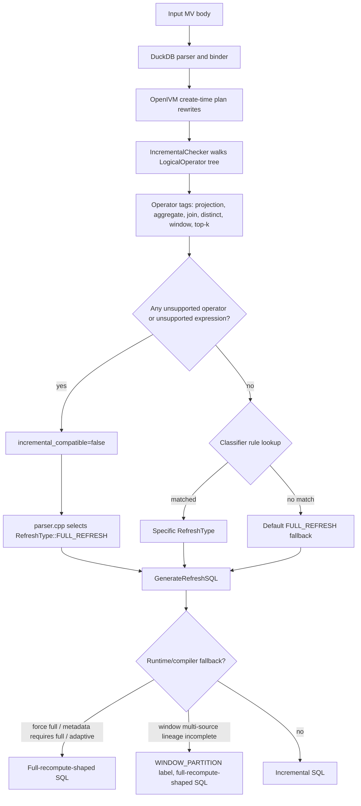

# 11. FULL_REFRESH debugging, DuckDB/OpenIVM side

TL;DR: not every `FULL_REFRESH` in openivm-spark is a Spark demotion.
Sometimes the DuckDB OpenIVM compiler itself classifies the MV as `FULL_REFRESH`,
or emits a full-recompute-shaped refresh program for a non-`FULL_REFRESH` label.
This chapter is the DuckDB-side companion to
`docs/architecture/openivm-spark/11-full-refresh-demotion-debugging.md`.
Use that Spark-side chapter when OpenIVM returned an incremental type and Spark
changed the effective metadata to `FULL_REFRESH`.

## 1. Vocabulary

`FULL_REFRESH` can mean three related but different things.

| Term                      | Where it appears                                   | Meaning                                                                               |
| ------------------------- | -------------------------------------------------- | ------------------------------------------------------------------------------------- |
| OpenIVM classified type   | `PRAGMA compile_refresh` JSON: `refresh_type_name` | The type stored in OpenIVM metadata at `CREATE MATERIALIZED VIEW` time.               |
| Full-recompute-shaped SQL | `sql` contains delete/overwrite + full `SELECT`    | The generated refresh program recomputes all rows, even if the label is another type. |
| Spark effective type      | `MvMetadata.refreshTypeName`                       | The type openivm-spark persisted after Spark-side safety checks.                      |

The common bug is to see Spark metadata `FULL_REFRESH` and assume Spark demoted.
That is only true if OpenIVM originally returned something else.
If OpenIVM returned `FULL_REFRESH`, Spark is merely preserving the upstream
classifier result.

The inverse also matters.
OpenIVM can keep a label such as `WINDOW_PARTITION` but emit SQL that does a
full recompute for a particular runtime shape.
That is not a Spark demotion either; it is a DuckDB-side refresh compiler
fallback under the same classified type.

## 2. Source map for this chapter

The following files in the upstream OpenIVM source are the important ones.
Paths below are written as upstream paths, not as local scratch-checkout paths.

| Source file                              | Why it matters                                                            |
| ---------------------------------------- | ------------------------------------------------------------------------- |
| `src/core/incremental_checker.cpp`       | Walks the optimized DuckDB logical plan and sets classifier booleans.     |
| `src/core/parser.cpp`                    | Converts classifier booleans into a `RefreshType`.                        |
| `src/core/parser_plan_helpers.cpp`       | Detects set operations, pivot, lateral/delim facts, and other plan facts. |
| `src/include/core/openivm_constants.hpp` | Defines the `RefreshType` enum and `RefreshTypeName`.                     |
| `src/rules/incremental_rewrite_rule.cpp` | Dispatches operator-specific delta rewrite rules.                         |
| `src/upsert/refresh_sql.cpp`             | Chooses full recompute vs incremental refresh SQL generation.             |
| `src/upsert/refresh_window.cpp`          | Contains the `WINDOW_PARTITION` multi-source full-recompute fallback.     |
| `src/upsert/refresh.cpp`                 | Implements `PRAGMA compile_refresh`.                                      |

The Spark bridge source also matters when you compare the DuckDB answer with
openivm-spark metadata.

| Spark-side file                                                                                    | Why it matters                                                   |
| -------------------------------------------------------------------------------------------------- | ---------------------------------------------------------------- |
| `spark-ext/ivm-compiler/src/main/scala/org/openivm/spark/compiler/OpenIvmCompiler.scala`           | Runs the DuckDB CLI and parses the JSON line.                    |
| `spark-ext/ivm-common/src/main/scala/org/openivm/spark/common/MvCatalog.scala`                     | Persists `refreshTypeName` and the `_ivm_compiled_sql` property. |
| `spark-ext/ivm-extension/src/main/scala/org/openivm/spark/commands/MaterializedViewCommands.scala` | Applies Spark-side demotion checks.                              |

## 3. Mermaid overview



## 4. When OpenIVM itself classifies as `FULL_REFRESH`

OpenIVM's create path computes a `PlanAnalysis`, then `parser.cpp` selects a
`RefreshType` from that analysis.
The broad shape is an ordered `if`/`else if` ladder.
The first matching condition wins.

The main `FULL_REFRESH` cases are:

1. Unsupported high-level constructs discovered before the normal classifier.
1. A logical operator or expression that the checker marks incompatible.
1. SEMI/ANTI joins combined with aggregation.
1. Some SEMI/ANTI extraction failures for projection-only SEMI/ANTI views.
1. Filtered `LIST` aggregates without group keys.
1. The final default fallback when no specific rule matches.

### 4.1 Unsupported construct pre-check

`parser_plan_helpers.cpp` marks several constructs as unsupported for
incremental maintenance before the normal operator-family decision.
In the current source, `LOGICAL_INTERSECT` and `LOGICAL_EXCEPT` set
`has_unsupported_set_operation = true`.
The parser combines that flag with PIVOT and LPTS-text fallbacks into
`has_unsupported_incremental_construct`.
If the flag is true, `parser.cpp` sets:

```cpp
refresh_type = RefreshType::FULL_REFRESH;
```

This is an OpenIVM classification.
Spark did not demote anything.
A parity example is `FullRefreshSpec` test 3:

```sql
SELECT region, amount FROM sales_fr3 WHERE amount > 100
EXCEPT ALL
SELECT region, amount FROM sales_fr3 WHERE amount > 300
```

DuckDB's logical plan contains a set-operation node, so OpenIVM stores the
original query and selects `FULL_REFRESH`.

### 4.2 Operator with no checker support

`src/core/incremental_checker.cpp` contains a `switch` over DuckDB
`LogicalOperatorType`.
Known infrastructure nodes, scans, projections, filters, aggregates, joins,
distinct, windows, top-k, order, limit, CTE wrappers, and a few constant-input
nodes are handled.
The default branch is intentionally conservative:

```cpp
default:
    // Unsupported operator type
    result.incremental_compatible = false;
    break;
```

Once `incremental_compatible` is false, `parser.cpp` selects
`RefreshType::FULL_REFRESH` and emits a warning that the MV uses constructs not
supported for incremental maintenance.

This is the source-backed answer to "plan has an operator with no rule".
The unsupported operator does not need to reach refresh-time rewrite.
The create-time checker already forces the full-refresh classifier.

### 4.3 Operator with no refresh rewrite rule

There is also a refresh-time dispatcher in
`src/rules/incremental_rewrite_rule.cpp`.
Its default branch throws:

```cpp
throw NotImplementedException("Operator type %s not supported", ...);
```

That branch is different from the create-time checker.
If a query is classified as incremental but later reaches a rewrite node with
no rule, the DuckDB compile may fail instead of returning a clean
`FULL_REFRESH` classifier.
In openivm-spark, such a compiler failure normally appears as a Spark-side
`compile_failed` demotion; see the Spark-side chapter.
When debugging, distinguish:

| Symptom                                                                   | Likely layer                                        |
| ------------------------------------------------------------------------- | --------------------------------------------------- |
| JSON row says `refresh_type_name="FULL_REFRESH"`                          | DuckDB create-time classifier.                      |
| DuckDB CLI errors with `Operator type ... not supported`                  | DuckDB refresh-time rewrite failed.                 |
| Spark metadata says `FULL_REFRESH` and log says `reason='compile_failed'` | Spark-side demotion after DuckDB failed to compile. |

### 4.4 Final default fallback

Even if all operators are compatible, `parser.cpp` still needs to match the
analysis to a specific `RefreshType`.
The final `else` in the ladder is:

```cpp
refresh_type = RefreshType::FULL_REFRESH;
Printer::Print("Warning: materialized view ... has an unrecognized query pattern.");
```

That is the default fallback when the checker did not identify a specific
incremental family such as aggregate, projection, distinct, window, join,
SEMI/ANTI, or top-k.

### 4.5 SEMI/ANTI plus aggregation

The current parser has an explicit full-refresh branch for SEMI/ANTI joins with
aggregation:

```cpp
} else if (classification.found_semi_anti_join && classification.found_aggregation) {
    refresh_type = RefreshType::FULL_REFRESH;
}
```

Projection-only SEMI/ANTI joins have an auxiliary-state recompute path when
OpenIVM can extract the left keys and predicate.
SEMI/ANTI plus aggregation does not yet have a transition-to-aggregate compiler,
so the classifier chooses full refresh.
`FullRefreshSpec` test 2 exercises this via `WHERE EXISTS (...) GROUP BY`.

### 4.6 Extractor failures inside otherwise recognized families

Some families have an extraction step after the operator tag is recognized.
For example, projection-only SEMI/ANTI must be converted to an aux-state form.
If `ExtractSemiAntiQuery` fails, or if no left columns can be collected,
`parser.cpp` chooses `FULL_REFRESH`.
That is still an OpenIVM classifier result.
It is not a Spark demotion.

### 4.7 Filtered `LIST` aggregate without group keys

The aggregate checker treats `LIST` specially.
A filtered `LIST` is not equivalent to a `CASE` rewrite that inserts `NULL`
elements, so the checker sets `found_filtered_list`.
`parser.cpp` sends grouped filtered-list views to `GROUP_RECOMPUTE`, but a
filtered-list aggregate without group keys becomes `FULL_REFRESH`.

### 4.8 Non-deterministic expressions

`HasVolatileExpression` walks expressions under filters, projections, distinct,
and aggregate groups.
If a function's DuckDB stability is not `CONSISTENT`, the checker marks the
plan incompatible.
A simple example is:

```sql
SELECT region, random() AS r FROM sales_fr5
```

`FullRefreshSpec` test 5 uses that shape.
The MV cannot be incrementally maintained as a stable relation because each
re-evaluation can produce different values.

## 5. Force-full settings and the current-source naming caveat

Some notes and older branches refer to a setting named
`openivm_force_full_refresh=true`.
That exact option is not present in the current upstream source reviewed for
this chapter.
The current source implements the force-full refresh-SQL path with:

```sql
SET openivm_refresh_mode='full';
```

`src/upsert/refresh_sql.cpp` reads `openivm_refresh_mode` and sets
`force_full_refresh = true` when the value is `full`.
Then `GenerateRefreshSQL` dispatches to `BuildRecomputeQuery` if any of these
are true:

- `force_full_refresh`;
- metadata says the delta activity requires full refresh;
- the stored view type is `RefreshType::FULL_REFRESH`;
- adaptive refresh estimated full recompute as cheaper.

Important nuance:
`openivm_refresh_mode='full'` forces a full-recompute-shaped SQL program.
It does not necessarily rewrite the stored classifier label.
`PRAGMA compile_refresh` obtains the type from `RefreshMetadata::GetViewType`
and emits `RefreshTypeName(type)`.
Therefore, in this checkout, an incremental view compiled under
`openivm_refresh_mode='full'` can have:

```json
{"refresh_type":0,"refresh_type_name":"AGGREGATE_GROUP","sql":"DELETE FROM openivm_data_...; INSERT INTO ... SELECT ..."}
```

When a future or older branch exposes `openivm_force_full_refresh`, verify from
that branch whether it changes the type label or only the SQL shape.
For debugging, always record both fields:

- the JSON `refresh_type_name`;
- the first few statements of JSON `sql`.

## 6. `WINDOW_PARTITION` special case: label kept, SQL can recompute

Window views are classified as `WINDOW_PARTITION` when the checker finds a
`LOGICAL_WINDOW`.
That happens before many other classifier branches.
For single-source standard tables, OpenIVM can recompute only affected window
partitions.
For multi-source window views, it needs enough lineage to identify affected
partition keys across all sources.

`src/upsert/refresh_window.cpp` contains the relevant fallback:

```cpp
if (!have_lineage_affected_keys && delta_table_names.size() > 1 &&
    !AllWindowPartitionSourcesCovered(...)) {
    return CompileFullRecompute(...);
}
```

That branch keeps the `WINDOW_PARTITION` label but returns full-recompute-shaped
SQL.
Do not diagnose that as Spark demotion.
Also do not diagnose it as OpenIVM create-time `FULL_REFRESH`.
It is a refresh-compiler fallback inside a non-full label.

The practical symptom is:

| Field                    | Value                                                |
| ------------------------ | ---------------------------------------------------- |
| JSON `refresh_type_name` | `WINDOW_PARTITION`                                   |
| JSON `sql`               | full delete/reinsert or equivalent recompute program |
| Spark `demotionReason`   | none, unless Spark adds its own later demotion       |

## 7. How openivm-spark distinguishes DuckDB full refresh from Spark demotion

The most reliable distinction is to preserve both classifications.
OpenIVM's compiler bridge parses a JSON line of the form:

```json
{"refresh_type":3,"refresh_type_name":"FULL_REFRESH","sql":"..."}
```

`OpenIvmCompiler.parseRefreshLine` extracts `refresh_type`,
`refresh_type_name`, and `sql` from that JSON.
`MvCatalog` persists the effective `refreshTypeName` and stores the compiled
SQL under `_ivm_compiled_sql` when a non-empty compiled program is retained.

Use this decision table:

| Evidence                                                                      | Conclusion                                                |
| ----------------------------------------------------------------------------- | --------------------------------------------------------- |
| OpenIVM JSON `refresh_type_name=FULL_REFRESH`, Spark `demotionReason` absent  | OpenIVM naturally emitted `FULL_REFRESH`.                 |
| OpenIVM JSON incremental, Spark metadata `FULL_REFRESH`, `demotionReason` set | Spark-side demotion.                                      |
| OpenIVM JSON incremental, SQL is full recompute, no demotion reason           | DuckDB refresh compiler fallback or force-full SQL shape. |
| OpenIVM CLI failed, Spark log says `reason='compile_failed'`                  | Spark demoted because the bridge could not compile.       |

Version caveat for this checkout:
`MvMetadata` currently has no first-class `demotionReason` field.
The Spark-side chapter uses that name for the conceptual reason string.
In this checkout, read the structured `[openivm-mv]` CREATE log line, or a
future metadata property such as `_ivm_demotion_reason` if present on your
branch.

Also note that this checkout suppresses `_ivm_compiled_sql` when the compiled
SQL string is empty.
Full-refresh metadata may therefore have no compiled cache at all.
If your branch caches the full-refresh SQL, use the cache to inspect the
program shape; if it does not, use the CREATE log and a standalone DuckDB
compile.

## 8. Step-by-step DuckDB-side debug recipe

### Step 1: reproduce with standalone OpenIVM

Start with the MV body and the source schemas.
The current raw OpenIVM `PRAGMA compile_refresh` signature takes a view name,
so the faithful standalone reproduction is:

```bash
mkdir -p .scratch/openivm-debug
/opt/openivm/duckdb :memory: -jsonlines <<'SQL'
LOAD '/opt/openivm/openivm.duckdb_extension';
SET openivm_target_dialect='spark';
SET openivm_compile_only=true;
SET openivm_enable_view_matching=false;
SET openivm_force_view_delta_cascade=true;
SET openivm_emit_cascade_delta_for_recompute=true;
SET openivm_minmax_incremental=false;
SET openivm_files_path='.scratch/openivm-debug';

CREATE TABLE my_src (a INT, b INT);
CREATE OR REPLACE MATERIALIZED VIEW mv_debug AS
  SELECT a, SUM(b) AS total FROM my_src GROUP BY a;
PRAGMA compile_refresh('mv_debug');
SQL
```

Those settings mirror the relevant compile bridge settings from
`OpenIvmCompiler.buildScript`.
For a grouped sum you should expect an incremental classification similar to:

```json
{"refresh_type":0,"refresh_type_name":"AGGREGATE_GROUP","sql":"WITH ... MERGE INTO ..."}
```

Interpretation:

| JSON field          | Meaning                                                             |
| ------------------- | ------------------------------------------------------------------- |
| `refresh_type`      | Numeric enum ordinal from `src/include/core/openivm_constants.hpp`. |
| `refresh_type_name` | Human-readable OpenIVM classifier label.                            |
| `sql`               | Refresh program generated by OpenIVM in the target dialect.         |

A true DuckDB-side full-refresh classifier looks like:

```json
{"refresh_type":3,"refresh_type_name":"FULL_REFRESH","sql":"DELETE FROM openivm_data_mv_debug;\nINSERT INTO openivm_data_mv_debug SELECT ..."}
```

Some fleet snippets wrap the above setup behind a body-and-schema helper like:

```sql
PRAGMA compile_refresh(
  'SELECT a, SUM(b) FROM my_src GROUP BY a',
  '{"my_src":[{"a":"INT"},{"b":"INT"}]}'
);
```

That two-argument convenience form is not the raw signature in the current
source reviewed here.
If your binary accepts it, treat it as a wrapper around the same operations:
create empty source tables, create a temporary MV, then call one-argument
`PRAGMA compile_refresh('<view_name>')`.

### Step 2: if `refresh_type=FULL_REFRESH`, inspect DuckDB's plan

Run `EXPLAIN` on the MV body in the same environment:

```bash
/opt/openivm/duckdb :memory: <<'SQL'
LOAD '/opt/openivm/openivm.duckdb_extension';
CREATE TABLE my_src (a INT, b INT);
EXPLAIN SELECT a, SUM(b) AS total FROM my_src GROUP BY a;
SQL
```

Look for DuckDB logical operator names.
If the plan contains `EXCEPT`, `INTERSECT`, recursive CTE, lateral/dependent
join shapes, volatile projections, PIVOT, or an aggregate function absent from
the checker whitelist, the create-time classifier is likely responsible.

### Step 3: identify the unclassifiable operator or expression

Common culprits:

- `WITH RECURSIVE` / recursive CTE plans.
- `LATERAL JOIN` and dependent join forms that cannot be extracted.
- Scalar subquery in a projection, especially correlated subqueries.
- `EXCEPT` / `INTERSECT` set operations.
- PIVOT or SQL text that LPTS cannot round-trip safely.
- Non-deterministic functions such as `random()`.
- Aggregate functions not listed by `GetSupportedAggregates()`.
- Operators not present in `src/rules/` or not handled by
  `IncrementalChecker`.

Use the source in this order:

1. `parser_plan_helpers.cpp` for plan facts such as set operations and PIVOT.
1. `incremental_checker.cpp` for operator compatibility.
1. `parser.cpp` for the `RefreshType` selection ladder.
1. `incremental_rewrite_rule.cpp` only if the classifier was incremental but
   compile failed during refresh SQL generation.

### Step 4: decide whether to rewrite or accept full refresh

If you control the MV body, rewrite it into a supported operator family.
Examples:

| Unsupported shape                | Possible rewrite                                                       |
| -------------------------------- | ---------------------------------------------------------------------- |
| `EXCEPT ALL` used as anti-filter | Express as `LEFT ANTI JOIN` or `NOT EXISTS` if semantics allow.        |
| Volatile projection              | Materialize the volatile value in a base table before creating the MV. |
| Correlated projection subquery   | Convert to an explicit join plus grouped aggregate.                    |
| Recursive CTE                    | Precompute the recursion into a base table or scheduled staging table. |
| Unsupported aggregate            | Replace with supported aggregates or a group recompute-friendly shape. |

If you do not control the MV body, accept `FULL_REFRESH` and tune the refresh
cadence, batch size, and warehouse layout.
For cadence guidance, see chapter 8 of the openivm-spark architecture docs.

## 9. Worked example: `EXCEPT ALL` from `FullRefreshSpec`

`FullRefreshSpec` contains several real Spark parity cases where OpenIVM itself
classifies the view as `FULL_REFRESH`.
The cleanest one is test 3:

```sql
CREATE MATERIALIZED VIEW mv_fr3 AS
SELECT region, amount FROM sales_fr3 WHERE amount > 100
EXCEPT ALL
SELECT region, amount FROM sales_fr3 WHERE amount > 300
```

Why it classifies as `FULL_REFRESH`:

1. DuckDB parses and binds the body.
1. The logical plan contains an `EXCEPT` set-operation node.
1. `parser_plan_helpers.cpp` marks `has_unsupported_set_operation = true` for
   `LOGICAL_EXCEPT` and `LOGICAL_INTERSECT`.
1. `parser.cpp` combines that into `has_unsupported_incremental_construct`.
1. The first classifier branch sets `refresh_type = RefreshType::FULL_REFRESH`.
1. `PRAGMA compile_refresh` returns `refresh_type=3` and
   `refresh_type_name="FULL_REFRESH"`.
1. Spark persists `FULL_REFRESH` with no Spark-side demotion reason.
1. Refresh is correct because the MV is rebuilt from the live query body.

A representative compile result is:

```json
{"refresh_type":3,"refresh_type_name":"FULL_REFRESH","sql":"DELETE FROM openivm_data_mv_fr3;\nINSERT INTO openivm_data_mv_fr3 SELECT region, amount FROM sales_fr3 WHERE amount > 100 EXCEPT ALL SELECT region, amount FROM sales_fr3 WHERE amount > 300;"}
```

The exact SQL text can differ by dialect, quoting, and generated data-table
name.
The debugging conclusion should not differ:
`refresh_type_name="FULL_REFRESH"` came from OpenIVM.

This example is better than a contrived recursive CTE for Spark parity because
Spark 3.5 does not accept `WITH RECURSIVE` in the relevant DDL context.
`EXCEPT ALL` is accepted by both engines and is therefore reproducible through
the openivm-spark bridge.

## 10. Hierarchical operator classification table

The table below is a debugging map, not a formal grammar.
It follows the order used by the checker and parser, with caveats from the
current source.

| DuckDB logical operator / family                                                          | Suggests                                                                                             | When `FULL_REFRESH` or full recompute enters                                                                                                                 |
| ----------------------------------------------------------------------------------------- | ---------------------------------------------------------------------------------------------------- | ------------------------------------------------------------------------------------------------------------------------------------------------------------ |
| `LOGICAL_PROJECTION`                                                                      | `SIMPLE_PROJECTION` when no aggregate dominates                                                      | Volatile functions or non-foldable `UNNEST` mark the plan incompatible.                                                                                      |
| `LOGICAL_FILTER`                                                                          | Preserves child family; HAVING flag over aggregate                                                   | Volatile filter expressions mark the plan incompatible.                                                                                                      |
| `LOGICAL_AGGREGATE_AND_GROUP_BY`                                                          | `SIMPLE_AGGREGATE`, `AGGREGATE_GROUP`, `AGGREGATE_HAVING`, or `GROUP_RECOMPUTE`                      | Unsupported aggregate functions, unnormalized filtered aggregates, or no extracted group keys can force `FULL_REFRESH`.                                      |
| `LOGICAL_DISTINCT`                                                                        | `DISTINCT_INCREMENTAL` for supported inner-distinct aux-state cases, otherwise aggregate/group paths | Top-level distinct is generally supported; extractor failure for inner distinct falls back to `GROUP_RECOMPUTE`, not usually `FULL_REFRESH`.                 |
| `LOGICAL_COMPARISON_JOIN` / `LOGICAL_JOIN` / `LOGICAL_ANY_JOIN` / `LOGICAL_CROSS_PRODUCT` | Join incrementalization or projection/aggregate family over joins                                    | Unsupported join types mark the plan incompatible; SEMI/ANTI plus aggregation is explicit `FULL_REFRESH`.                                                    |
| `LOGICAL_JOIN` with INNER/LEFT/RIGHT/FULL OUTER                                           | Join incrementalization; aggregate views may become group or merge paths                             | Practical limits and Spark-side demotions are separate; DuckDB source supports these families but can choose group recompute for non-linear aggregate cases. |
| `LOGICAL_JOIN` with SEMI/ANTI/MARK                                                        | `SEMI_ANTI_RECOMPUTE` for extracted projection-only shapes                                           | SEMI/ANTI plus aggregation is `FULL_REFRESH`; extractor failure can be `FULL_REFRESH`.                                                                       |
| `LOGICAL_DEPENDENT_JOIN` / `LOGICAL_DELIM_JOIN`                                           | Delim/dependent rewrite or group recompute for correlated shapes                                     | Some lateral/correlated forms fail extraction or later Spark execution; unhandled forms can become `FULL_REFRESH` or compile failure.                        |
| `LOGICAL_WINDOW`                                                                          | `WINDOW_PARTITION`                                                                                   | Single-source partition recompute is OK; multi-source lineage gaps keep the label but emit full-recompute-shaped SQL.                                        |
| `LOGICAL_TOP_N` / `LOGICAL_LIMIT` / `LOGICAL_ORDER_BY`                                    | `TOP_K` or top-k wrapper over child                                                                  | Non-column ORDER BY can mark the DuckDB plan incompatible; Spark otherwise maintains the inner type behind a user-facing VIEW.                               |
| `LOGICAL_UNION`                                                                           | Preserves or combines child family                                                                   | Volatile union expressions mark incompatible; unsupported set operations are `INTERSECT` and `EXCEPT`, not `UNION ALL`.                                      |
| `LOGICAL_INTERSECT` / `LOGICAL_EXCEPT`                                                    | none                                                                                                 | `parser_plan_helpers.cpp` marks unsupported set operation, then parser selects `FULL_REFRESH`.                                                               |
| `LOGICAL_MATERIALIZED_CTE`                                                                | Inherit the inlined/consumer family                                                                  | Non-inlinable or recursive-like CTE shapes can expose unsupported operators and fall back.                                                                   |
| `LOGICAL_RECURSIVE_CTE` or any unknown operator                                           | none                                                                                                 | Falls into the checker default branch and becomes incompatible, therefore `FULL_REFRESH`.                                                                    |
| Constant nodes (`DUMMY_SCAN`, `CHUNK_GET`, `EXPRESSION_GET`)                              | Infrastructure / constants                                                                           | Supported as leaves; not a reason for full refresh by themselves.                                                                                            |

Two practical notes:

- The rule dispatcher has a practical join limit and implementation limits.
  `openivm::MAX_JOIN_TABLES` is 16 in the constants header, while Spark parity
  docs often treat four-way joins as a practical testing boundary.
- A Spark-side demotion can still happen after any incremental label above.
  This table is only the DuckDB/OpenIVM side.

## 11. Aggregate function classification

The aggregate question is a frequent source of wrong diagnoses.
The current source does not support only `SUM`, `COUNT`, `AVG`, `MIN`, and
`MAX`.
`src/core/incremental_checker.cpp` defines the checker whitelist as:

```cpp
static const unordered_set<string> kSet = {
    "count_star", "count",    "sum",      "min",     "max",      "avg",     "list",    "stddev", "stddev_samp",
    "stddev_pop", "variance", "var_samp", "var_pop", "bool_and", "bool_or", "arg_min", "arg_max"};
```

That means, for this checkout:

| Aggregate                             | Classification status       | Refresh behavior notes                                                                                                           |
| ------------------------------------- | --------------------------- | -------------------------------------------------------------------------------------------------------------------------------- |
| `COUNT(*)`, `COUNT(x)`                | Supported                   | Linear aggregate path.                                                                                                           |
| `SUM(x)`                              | Supported                   | Linear aggregate path.                                                                                                           |
| `AVG(x)`                              | Supported                   | Rewritten/decomposed to sum and count helper columns.                                                                            |
| `MIN(x)`, `MAX(x)`                    | Supported                   | `found_minmax=true`; insert-only can use extrema merge when `openivm_minmax_incremental=true`; mixed deltas use group recompute. |
| `STDDEV`, `STDDEV_SAMP`, `STDDEV_POP` | Supported in current source | Decomposed to sum, count, and sum-of-squares helper columns.                                                                     |
| `VARIANCE`, `VAR_SAMP`, `VAR_POP`     | Supported in current source | Decomposed similarly; final formula is reconstructed.                                                                            |
| `LIST`                                | Whitelisted but non-linear  | Often uses group recompute; filtered ungrouped list can become `FULL_REFRESH`.                                                   |
| `BOOL_AND`, `BOOL_OR`                 | Whitelisted                 | Validate behavior with parity tests before assuming Spark support.                                                               |
| `ARG_MIN`, `ARG_MAX`                  | Whitelisted                 | Treated with min/max-like caveats; mixed changes generally recompute affected groups.                                            |

Common aggregates that are not in the whitelist include:

- `APPROX_COUNT_DISTINCT`;
- `MEDIAN`;
- percentile/quantile-style aggregates such as `PERCENTILE`, `PERCENTILE_CONT`,
  or branch-specific names not normalized to a whitelisted function;
- `FIRST` and `LAST` as general user aggregates;
- `MODE` and other order-sensitive aggregates unless a branch explicitly adds
  them.

There is one special case for `first` in the checker:
a scalar-subquery `first` can be tolerated when `result.group_index` is already
set.
Do not generalize that to user-facing `FIRST` aggregate support.

If an aggregate function does not classify, check the bound DuckDB function
name, not only the SQL spelling.
Aliases can bind to different function names.
The checker compares `bound_agg.function.name` against the whitelist.

If you are reading an older document that says `STDDEV` or `VARIANCE` are not
supported, treat that as stale for this source snapshot.
The current compiler has explicit decomposition helpers in
`refresh_compiler.cpp` for `avg`, `stddev`, and `variance` families.

## 12. Reading `FULL_REFRESH` evidence in openivm-spark

When you are inside a Spark test or shell, collect these facts:

```scala
import org.openivm.spark.common.{MvCatalog, MvMetadata}

MvCatalog.list(spark).foreach { meta =>
  val reason = meta.properties
    .get("_ivm_demotion_reason")
    .orElse(meta.properties.get("demotionReason"))
  println(s"${meta.name}: ${meta.refreshTypeName} (${meta.refreshType})")
  println(s"compiled cache present: ${meta.properties.get(MvMetadata.CompiledSqlKey).exists(_.nonEmpty)}")
  println(s"conceptual demotion reason: $reason")
}
```

Interpretation:

| Spark metadata                     | Cache / reason                                                    | Diagnosis                                     |
| ---------------------------------- | ----------------------------------------------------------------- | --------------------------------------------- |
| `refreshTypeName=FULL_REFRESH`     | no reason, DuckDB standalone also returns `FULL_REFRESH`          | OpenIVM emitted full refresh naturally.       |
| `refreshTypeName=FULL_REFRESH`     | reason `top_k_unsupported`, `no_real_delta`, `compile_failed`, etc. | Spark-side demotion; use the Spark chapter. |
| `refreshTypeName=WINDOW_PARTITION` | SQL performs full recompute                                       | DuckDB window refresh fallback, not demotion. |
| `refreshTypeName=AGGREGATE_GROUP`  | SQL performs full recompute because `openivm_refresh_mode='full'` | Force-full SQL shape, not classifier change.  |

If `_ivm_compiled_sql` is present, open it and inspect the first statement.
If it begins with full delete/reinsert while the type is incremental, ask why
`GenerateRefreshSQL` selected recompute.
The answer is usually force-full, metadata-required full refresh, adaptive
refresh, or a family-specific fallback such as multi-source window lineage.

If `_ivm_compiled_sql` is absent for a `FULL_REFRESH` MV, do not assume the
cache was lost.
In this checkout, full-refresh views often do not persist a non-empty compiled
program because Spark's full-refresh assembler can rebuild from the original
`querySql`.
Re-run the standalone DuckDB compile to recover the upstream classification.

## 13. Debugging checklist

Use this checklist before changing code.

- [ ] Capture the MV body exactly as stored in `MvMetadata.querySql`.
- [ ] Capture all source table schemas as DuckDB-compatible DDL.
- [ ] Run standalone OpenIVM with the compile-bridge pragmas.
- [ ] Save the JSON `refresh_type`, `refresh_type_name`, and first statements
  of `sql`.
- [ ] If the JSON type is `FULL_REFRESH`, run `EXPLAIN` on the MV body.
- [ ] Map the suspicious plan node to `incremental_checker.cpp`.
- [ ] Map the final classifier branch in `parser.cpp`.
- [ ] If JSON type is incremental but SQL recomputes, inspect
  `refresh_sql.cpp` and family-specific compilers.
- [ ] If JSON type is incremental but Spark metadata is `FULL_REFRESH`, switch
  to the Spark-side demotion chapter.
- [ ] Do not widen Spark demotion to hide a DuckDB classification question.
- [ ] Do not demote an incremental OpenIVM path merely to make a parity test
  pass.

## 14. Common questions

### 14.1 If OpenIVM returns `FULL_REFRESH`, is that a bug?

Not automatically.
`FULL_REFRESH` is the correctness-preserving fallback for unsupported or
unrecognized plans.
It is a bug only if the operator family is supposed to be supported and the
classifier failed to recognize it.
Use a minimized DuckDB reproduction before changing Spark code.

### 14.2 If SQL recomputes but the label is incremental, is that a bug?

Not automatically.
`WINDOW_PARTITION` over multi-source inputs can fall back to full recompute
when affected partition lineage is incomplete.
`openivm_refresh_mode='full'` can also force recompute SQL without changing the
stored label.
Check the family-specific source before filing a classifier bug.

### 14.3 Why not let Spark decide everything?

OpenIVM owns the relational classifier and emits the refresh program.
Spark owns whether that program can be executed safely against Delta tables and
whether cascade view-delta contracts are satisfied.
The two layers answer different questions.
Confusing them leads either to missed Spark demotions or to unnecessary DuckDB
workarounds.

### 14.4 Why does a recursive CTE full-refresh in DuckDB but not have a Spark parity test?

Spark 3.5 does not accept `WITH RECURSIVE` in the relevant DDL context.
The DuckDB classifier path is still important: a recursive CTE or any unknown
operator falls through to `incremental_compatible=false` and then
`FULL_REFRESH`.
For openivm-spark parity, use a shared-dialect shape such as `EXCEPT ALL` when
you need a reproducible `FULL_REFRESH` example.

### 14.5 How does Spark execute Top-K?

The direct enum is legacy. OpenIVM strips the wrapper and classifies its inner
query; Spark maintains that unlimited inner result in `<mv>__ivm_data` and
applies the Top-K suffix in the public Spark VIEW. A `FULL_REFRESH` with
`top_k_unsupported` currently means Spark encountered `TAIL`, not ordinary
`ORDER BY`/`LIMIT`/`OFFSET`.

## 15. Cross-links

- Spark-side `FULL_REFRESH` demotion debugging:
  `docs/architecture/openivm-spark/11-full-refresh-demotion-debugging.md`.
- Spark parity gap workflow:
  `docs/architecture/openivm-spark/12-parity-gap-forensics.md`.
- Refresh type enum and Spark meaning:
  `docs/architecture/openivm-spark/0.OVERVIEW.md`.
- Refresh rewriter and assemblers:
  `docs/architecture/openivm-spark/6-refresh-rewriter-and-assemblers.md`.

## 16. Minimal report template

When reporting a DuckDB-side `FULL_REFRESH`, include this block:

```text
MV name:
MV body:
Source DDL:
Standalone OpenIVM command:
JSON refresh_type:
JSON refresh_type_name:
First 50 lines of JSON sql:
EXPLAIN plan:
Suspected operator:
Suspected source branch:
Spark MvMetadata.refreshTypeName:
Spark demotion reason, if any:
```

A good report states whether the problem is:

1. expected OpenIVM `FULL_REFRESH`;
1. unexpected OpenIVM classifier fallback;
1. OpenIVM incremental label with full-recompute-shaped SQL;
1. Spark-side demotion after an incremental OpenIVM result;
1. DuckDB compile failure surfaced as Spark `compile_failed`.

Only item 4 belongs in the Spark demotion chapter.
Items 1 through 3 belong here.
Item 5 starts here for the DuckDB error text, then moves to the Spark chapter
for the persisted metadata decision.
