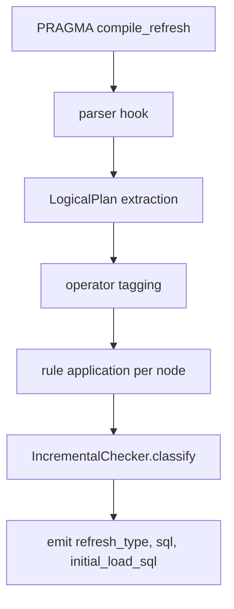

# 2. OpenIVM parser and plan rewrite
This chapter documents OpenIVM's parser and logical-plan rewrite path.
The focus is the path that ends at `PRAGMA compile_refresh`.
It also covers the create-time parser hook because `compile_refresh` depends on
metadata produced when the materialized view was created.
At a high level:
- Spark or DuckDB creates a materialized view.
- OpenIVM parses the view body through DuckDB.
- OpenIVM rewrites and analyzes the bound `LogicalPlan`.
- The result is a stored `RefreshType` plus normalized view SQL.
- `PRAGMA compile_refresh('<view>')` reads that metadata.
- It generates the refresh SQL that `PRAGMA refresh` would execute.
- It returns the SQL instead of executing it.
Important source anchors:
- `src/openivm_extension.cpp:334-341` registers parser and optimizer hooks.
- `src/openivm_extension.cpp:375-387` registers `compile_refresh`.
- `src/core/parser_parse.cpp:12-89` intercepts `CREATE MATERIALIZED VIEW`.
- `src/core/parser.cpp:32-34` is the create-time `PlanFunction` signature.
- `src/upsert/refresh.cpp:610-738` is the `compile_refresh` handler.
- `src/upsert/refresh_sql.cpp:244-1050` assembles refresh SQL.
- `src/rules/incremental_rewrite_rule.cpp:92-212` dispatches per-operator rules.
---
## 1. The PRAGMA compile_refresh entry
The pragma is registered by the extension loader:
```cpp
// src/openivm_extension.cpp:375-387
auto compile_refresh = PragmaFunction::PragmaCall(
    "compile_refresh",
    CompileRefreshQuery,
    {LogicalType::VARCHAR});
loader.RegisterFunction(compile_refresh);
```
The handler signature is:
```cpp
// src/upsert/refresh.cpp:610
string CompileRefreshQuery(ClientContext &context,
                           const FunctionParameters &parameters)
```
The public declaration says the same thing:
```cpp
// src/include/upsert/refresh.hpp:15-23
string CompileRefreshQuery(ClientContext &context,
                           const FunctionParameters &parameters);
```
The current C++ signature is one-argument.
It requires a view name:
```cpp
// src/upsert/refresh.cpp:610-614
if (parameters.values.empty()) {
    throw InvalidInputException("compile_refresh requires a view name argument");
}
string view_name = StringValue::Get(parameters.values[0]);
```
Then it resolves the view catalog and schema.
It first uses the current catalog search path.
If that lookup fails, it searches `information_schema.tables`.
That fallback is in `src/upsert/refresh.cpp:616-658`.
The handler reads the stored type:
```cpp
// src/upsert/refresh.cpp:660-663
RefreshMetadata metadata(con);
RefreshType type = metadata.GetViewType(view_name);
```
It temporarily forces compile-only behavior.
That preserves refresh compile semantics without mutating the database.
See `src/upsert/refresh.cpp:664-705`.
The central call is:
```cpp
// src/upsert/refresh.cpp:683-686
sql = GenerateRefreshSQL(context, view_catalog_name, view_schema_name,
                         view_name, cross_system,
                         "", "",
                         cross_system ? &out_pre_meta : nullptr,
                         cross_system ? &out_post_meta : nullptr);
```
Finally it returns a SQL string that DuckDB executes as the pragma result:
```cpp
// src/upsert/refresh.cpp:734-738
return "SELECT CAST(" + to_string(type_int) + " AS INTEGER) AS refresh_type, '" +
       SqlUtils::EscapeValue(type_name) + "' AS refresh_type_name, '" +
       escaped_sql + "' AS sql;";
```
So the direct C++ output columns are:
```text
refresh_type INTEGER
refresh_type_name VARCHAR
sql VARCHAR
```
---
## 2. Parameter shape
There are two shapes to keep separate.
### C++ pragma shape
The C++ pragma is:
```sql
PRAGMA compile_refresh('<view_name>');
```
It has one `VARCHAR` argument.
The current checkout has no `sources_schemas_json` symbol under OpenIVM `src/`.
Source schemas are not supplied as a second pragma argument.
They already exist in the DuckDB catalog when the view is created.
### Spark bridge conceptual shape
The Spark bridge effectively starts from:
```text
(view_name, sources_schemas_json)
```
That is conceptual.
In code it is represented by `CompileRequest`:
```scala
// spark-ext/ivm-compiler/.../OpenIvmCompiler.scala:28-33
final case class CompileRequest(
    viewName: String,
    viewSql: String,
    sources: Map[String, StructType],
    sourceQualifiedNames: Map[String, String] = Map.empty
)
```
`viewName` becomes the pragma argument.
`sources` encodes source table schemas.
`sourceQualifiedNames` maps short DuckDB names back to Spark identifiers.
Before the pragma, Spark creates empty DuckDB tables:
```scala
// OpenIvmCompiler.scala:75-78
val tableDdls = req.sources.toSeq.map { case (name, schema) =>
  val cols = schema.fields.map(f => s"${f.name} ${sparkToDuckdbType(f.dataType)}").mkString(", ")
  name -> s"CREATE TABLE $name ($cols)"
}
```
The generated script then creates the MV and calls the one-argument pragma:
```scala
// OpenIvmCompiler.scala:193-195
CREATE OR REPLACE MATERIALIZED VIEW <viewName> AS <viewSql>;
PRAGMA compile_refresh('<viewName>');
```
Thus the JSON-shaped schema input is materialized as catalog DDL.
DuckDB's binder sees real tables.
OpenIVM gets a real bound `LogicalPlan`.
---
## 3. Parser hook and create-time plan extraction
The parser extension is declared as:
```cpp
// src/include/core/parser.hpp:14-23
class MaterializedViewParserExtension : public ParserExtension {
public:
    explicit MaterializedViewParserExtension() {
        parse_function = ParseFunction;
        plan_function = PlanFunction;
    }
    static ParserExtensionParseResult ParseFunction(ParserExtensionInfo *info,
                                                    const string &query);
    static ParserExtensionPlanResult PlanFunction(
        ParserExtensionInfo *info,
        ClientContext &context,
        unique_ptr<ParserExtensionParseData> parse_data);
};
```
The extension loader registers it with DuckDB:
```cpp
// src/openivm_extension.cpp:334-341
ParserExtension::Register(db_config, std::move(materialized_view_parser));
OptimizerExtension::Register(db_config, std::move(incremental_rewrite_rule));
OptimizerExtension::Register(db_config, std::move(refresh_insert_rule));
```
`ParseFunction` is lightweight.
It lowercases and normalizes the statement.
It detects `CREATE MATERIALIZED VIEW` and `CREATE OR REPLACE MATERIALIZED VIEW`.
It extracts `REFRESH EVERY` metadata.
It rewrites materialized-view syntax into ordinary DuckDB parseable syntax.
Then it calls DuckDB's parser.
See `src/core/parser_parse.cpp:12-89`.
The heavy function is:
```cpp
// src/core/parser.cpp:32-34
ParserExtensionPlanResult
MaterializedViewParserExtension::PlanFunction(
    ParserExtensionInfo *info,
    ClientContext &context,
    unique_ptr<ParserExtensionParseData> parse_data)
```
It first plans the full `CREATE` statement:
```cpp
// src/core/parser.cpp:207-212
Planner planner(*con.context);
planner.CreatePlan(statement->Copy());
auto plan = std::move(planner.plan);
```
Then it separately parses and plans the raw SELECT body:
```cpp
// src/core/parser.cpp:222-228
Parser select_parser;
select_parser.ParseQuery(original_view_query);
Planner select_planner(*con.context);
select_planner.CreatePlan(std::move(select_parser.statements[0]));
auto select_plan = std::move(select_planner.plan);
```
The SELECT plan is the one normalized for storage and LPTS serialization:
```cpp
// src/core/parser.cpp:230-237
InlineCtesIfPresent(context, *select_planner.binder, select_plan);
PlanRewrite(context, *select_planner.binder, select_plan, select_planner.names);
```
The full plan is normalized for aggregate filters before analysis:
```cpp
// src/core/parser.cpp:346-350
RewriteAggregateFilters(context, plan);
```
The parser then extracts facts and classification state:
```cpp
// src/core/parser.cpp:352-360
auto facts = BuildCreateMVPlanFacts(plan.get(), current_catalog);
auto analysis = facts.analysis;
MVClassificationState classification(analysis);
```
`BuildCreateMVPlanFacts` calls `AnalyzePlan` and recursively collects tables,
projections, aggregates, joins, CTE refs, windows, and set-operation facts.
See `src/core/parser_plan_helpers.cpp:272-377,748-755`.
---
## 4. Operator type tagging
The operator tagging visitor is `AnalyzeNode`.
It lives in `src/core/incremental_checker.cpp`.
It produces `PlanAnalysis`:
```cpp
// src/include/core/incremental_checker.hpp:9-43
struct PlanAnalysis {
    bool incremental_compatible = true;
    bool found_aggregation = false;
    bool found_projection = false;
    bool found_having = false;
    bool found_distinct = false;
    bool found_join = false;
    bool found_window = false;
    bool found_top_k = false;
    vector<string> aggregate_columns;
    vector<string> aggregate_types;
    vector<string> window_partition_columns;
};
```
The visitor switches on `LogicalOperatorType`.
That switch is the IVM-relevant operator classifier.
Important cases:
- `LOGICAL_FILTER` rejects volatile predicates and detects HAVING.
  See `src/core/incremental_checker.cpp:134-143`.
- `LOGICAL_PROJECTION` marks `found_projection`.
  It rejects volatile expressions and non-foldable unnest.
  See `src/core/incremental_checker.cpp:145-153`.
- `LOGICAL_DISTINCT` marks `found_distinct` and records keys.
  See `src/core/incremental_checker.cpp:161-178`.
- join operators mark `found_join`, `found_left_join`, `found_full_outer`,
  `found_semi_anti_join`, `found_delim_join`, or `found_single_join`.
  See `src/core/incremental_checker.cpp:181-215`.
- `LOGICAL_AGGREGATE_AND_GROUP_BY` records supported aggregate functions,
  grouping-set state, min/max/list/count-distinct flags, group count, and
  aggregate function names.
  See `src/core/incremental_checker.cpp:218-292`.
- `LOGICAL_WINDOW` records window partition columns.
  See `src/core/incremental_checker.cpp:294-329`.
- `LOGICAL_TOP_N`, `LOGICAL_ORDER_BY`, and `LOGICAL_LIMIT` record top-k metadata.
  See `src/core/incremental_checker.cpp:332-380`.
After handling a node it recurses into children:
```cpp
// src/core/incremental_checker.cpp:388-396
for (auto &child : node->children) {
    AnalyzeNode(child.get(), result);
}
PlanAnalysis AnalyzePlan(LogicalOperator *plan) {
    PlanAnalysis result;
    AnalyzeNode(plan, result);
    return result;
}
```
`MVClassificationState` wraps these facts for parser decisions.
It is defined in `src/include/core/parser_plan_helpers.hpp:86-116`.
---
## 5. Create-time rewrite and classification output
Create-time `PlanRewrite` normalizes the SELECT plan before it is stored.
It is not the same as refresh-time delta rewrite.
It prepares physical MV data-table columns and LPTS output.
Important create-time rewrites include:
- aggregate `FILTER` normalization,
- `DISTINCT` normalization,
- derived aggregate decomposition such as `AVG` into SUM and COUNT,
- hidden `openivm_count_star` injection for grouped aggregates,
- hidden outer-join support columns,
- semi/anti subquery support.
A key example is hidden count injection:
```cpp
// src/core/plan_rewrite.cpp:615-692
// Inject a hidden COUNT(*) (alias `openivm_count_star`) into AGGREGATE_GROUP
// aggregates that don't already have a reliable total-row-count aggregate.
```
The classification ladder is in `src/core/parser.cpp:610-800`.
It maps the tagged plan to `RefreshType`.
The enum is:
```cpp
// src/include/core/openivm_constants.hpp:67-79
enum class RefreshType : uint8_t {
    AGGREGATE_GROUP,
    SIMPLE_AGGREGATE,
    SIMPLE_PROJECTION,
    FULL_REFRESH,
    AGGREGATE_HAVING,
    WINDOW_PARTITION,
    GROUP_RECOMPUTE,
    TOP_K,
    DISTINCT_INCREMENTAL,
    SEMI_ANTI_RECOMPUTE
};
```
Common classification branches:
- unsupported constructs become `FULL_REFRESH`;
- windows become `WINDOW_PARTITION`;
- grouping sets and other non-linear group cases often become `GROUP_RECOMPUTE`;
- top-level DISTINCT can become `AGGREGATE_GROUP`;
- HAVING aggregates become `AGGREGATE_HAVING`;
- grouped aggregates become `AGGREGATE_GROUP`;
- scalar aggregates become `SIMPLE_AGGREGATE`;
- projections and filters become `SIMPLE_PROJECTION`.
The selected type and normalized SQL are stored in `openivm_views`:
```cpp
// src/core/parser.cpp:877-886
insert or replace into openivm_views
(view_name, sql_string, type, has_minmax, has_left_join, ...)
values (...)
```
That stored `(RefreshType, sql_string)` pair is the main input to
`PRAGMA compile_refresh`.
---
## 6. Refresh-time rewrite phase
`compile_refresh` calls `GenerateRefreshSQL`.
Its signature begins:
```cpp
// src/upsert/refresh_sql.cpp:244-248
string GenerateRefreshSQL(ClientContext &context,
                          const string &view_catalog_name,
                          const string &view_schema_name,
                          const string &view_name,
                          bool cross_system,
                          ...)
```
It reads the stored view query, type, and source delta tables:
```cpp
// src/upsert/refresh_sql.cpp:312-328
auto view_query_sql = metadata.GetViewQuery(view_name);
RefreshType view_query_type = metadata.GetViewType(view_name);
auto delta_table_names = metadata.GetDeltaTables(view_name);
```
For ordinary incremental paths, it creates a marker query:
```cpp
// src/upsert/refresh_sql.cpp:840-842
select * from ComputeDelta('<catalog>','<schema>','<view>');
```
It parses, plans, and optimizes that query:
```cpp
// src/upsert/refresh_sql.cpp:845-857
Parser p;
p.ParseQuery(compute_delta);
Planner planner(con_ctx);
planner.CreatePlan(std::move(p.statements[0]));
auto plan = std::move(planner.plan);
Optimizer optimizer(*planner.binder, con_ctx);
plan = optimizer.Optimize(std::move(plan));
```
The optimizer extension detects the `COMPUTEDELTA` marker:
```cpp
// src/rules/incremental_rewrite_rule.cpp:215-227
if (!StringUtil::StartsWith(child->GetName(), "COMPUTEDELTA")) {
    return;
}
```
`ComputeDeltaBind` reads the stored view SQL and exposes output columns plus
`openivm_multiplicity`:
```cpp
// src/openivm_extension.cpp:56-93
string view_query = RefreshMetadata(con).GetViewQuery(view_name);
Parser parser;
parser.ParseQuery(view_query);
Planner planner(context);
planner.CreatePlan(statement->Copy());
return_types.emplace_back(LogicalTypeId::INTEGER);
names.emplace_back(openivm::MULTIPLICITY_COL);
```
The marker function itself emits no rows.
It exists so the optimizer can replace it with a rule-rewritten delta plan.
---
## 7. Operator rules under `src/rules/`
The dispatcher is `IncrementalRewriteRule::RewritePlan`:
```cpp
// src/rules/incremental_rewrite_rule.cpp:92-145
LOGICAL_GET                    -> IncrementalScanRule
LOGICAL_COMPARISON_JOIN/JOIN   -> IncrementalJoinRule
LOGICAL_DELIM_JOIN             -> IncrementalDelimJoinRule
LOGICAL_PROJECTION             -> IncrementalProjectionRule
LOGICAL_AGGREGATE_AND_GROUP_BY -> IncrementalAggregateRule
LOGICAL_FILTER                 -> IncrementalFilterRule
LOGICAL_UNION                  -> IncrementalUnionRule
LOGICAL_DISTINCT               -> IncrementalDistinctRule
LOGICAL_WINDOW                 -> IncrementalWindowRule
LOGICAL_TOP_N/LIMIT/ORDER_BY   -> IncrementalTopKRule
```
All rules implement:
```cpp
// src/include/rules/rule.hpp:66-74
class IncrementalRule {
public:
    virtual ModifiedPlan Rewrite(PlanWrapper pw) = 0;
    virtual Linearity GetLinearity() const = 0;
};
```
The same header documents operator linearity:
- `LINEAR`: apply the operator to the delta.
- `BILINEAR`: expand multi-input terms, especially joins.
- `NON_LINEAR`: use recompute, aux state, or full refresh.
Rule behavior by file:
- `scan.cpp:6-14` replaces a base scan with a delta scan.
- `helpers.cpp:274-400` builds `openivm_delta_<table>` scans.
- `projection.cpp:10-35` appends multiplicity to projection output.
- `filter.cpp:8-59` recurses through filters and strips HAVING filters.
- `aggregate.cpp:10-42` adds multiplicity as a group key.
- `union.cpp:8-30` rewrites both UNION ALL branches.
- `distinct.cpp:14-108` replaces DISTINCT with aggregate state.
- `topk.cpp:7-19` strips ORDER BY/LIMIT/TOP_N from delta plans.
- `window.cpp:8-27` preserves plan shape; window refresh uses partition recompute.
The join rule is the bilinear centerpiece.
For each non-empty subset of N join leaves, it copies the join tree and replaces
that subset with delta scans.
It projects original columns plus combined multiplicity:
```text
(-1)^(k-1) * product(w_i)
```
The comment explaining this inclusion-exclusion sign is in
`src/rules/join.cpp:873-891`.
The actual replacement of selected leaves is in `src/rules/join.cpp:837-851`.
This produces a delta plan for `V'(D, ΔD)`.
LPTS serializes that plan to SQL.
The upsert compiler then applies the signed rows to `openivm_data_<view>`.
---
## 8. Source-substitution trick
There are two placeholder conventions relevant to emitted SQL.
### Spark source placeholders
The Spark bridge creates short DuckDB table names.
LPTS may emit them as `memory.main.<short>`.
Those names are placeholders for real Spark sources.
The bridge documents this in `OpenIvmCompiler.scala:199-213`.
For `initialLoadSql`, replacement is explicit:
```scala
// OpenIvmCompiler.scala:344-348
for ((short, qual) <- req.sourceQualifiedNames) {
  sql = sql.replace(s"memory.main.$short", qual)
}
sql = sql.replaceAll("memory\\.main\\.", "")
LptsSparkDialect.translate(sql)
```
So the convention is:
```text
memory.main.<short_source_name>  ->  <qualified Spark source identifier>
```
Spark's refresh rewriter performs the same kind of mapping for refresh SQL using
`sourceQualifiedNames` and source temp views.
OpenIVM itself treats the names as ordinary DuckDB catalog names.
### DuckLake snapshot placeholders
DuckLake cross-system metadata uses another placeholder:
```cpp
// src/include/upsert/refresh_internal.hpp:15
constexpr const char *DUCKLAKE_SNAPSHOT_PLACEHOLDER =
    "__OPENIVM_DUCKLAKE_SNAPSHOT_ID__";
```
`DuckLakeSnapshotPlaceholder(catalog_name)` appends a hex-encoded catalog token
and `__`.
See `src/upsert/refresh_helpers.cpp:921-922`.
Compile-only SQL can return that placeholder unresolved.
Runtime refresh replaces it after reading the post-refresh DuckLake snapshot.
See `src/upsert/refresh.cpp:267-305`.
---
## 9. Output artifacts: `sql` and `initial_load_sql`
The direct C++ pragma artifact is `sql`.
`GenerateRefreshSQL` assembles it from metadata pre-SQL, delta SQL, upsert SQL,
cleanup SQL, timestamp updates, and metadata post-SQL:
```cpp
// src/upsert/refresh_sql.cpp:1024-1037
string data_sql = pre_companion + delta_query + "\n" + companion_query +
                  "\n" + upsert_query + "\n" + post_companion +
                  compact_delta_view_query + delete_from_view_query + "\n" +
                  delete_from_delta_table_query;
clean_query = meta_pre_sql + data_sql + meta_post_sql;
```
If `openivm_files_path` is set, it also writes:
```cpp
// src/upsert/refresh_sql.cpp:1038-1042
openivm_upsert_queries_<view>.sql
```
`compile_refresh` returns the same refresh SQL in the `sql` column.
See `src/upsert/refresh.cpp:734-738`.
`initial_load_sql` is a Spark-side artifact.
OpenIVM writes create-time sidecar SQL here:
```cpp
// src/core/parser.cpp:1332-1357
openivm_compiled_queries_<view>.sql
```
That file contains the physical data-table CTAS:
```sql
create table openivm_data_<view> as <normalized select>;
```
The Spark bridge extracts the SELECT body:
```scala
// OpenIvmCompiler.scala:313-349
private[compiler] def parseInitialLoadSql(tmpDir: Path,
                                          req: CompileRequest): String
```
The returned Scala value carries both strings:
```scala
// OpenIvmCompiler.scala:10-16
final case class CompiledRefresh(
    refreshType: Int,
    refreshTypeName: String,
    sql: String,
    initialLoadSql: String)
```
Spark stores both in MV metadata:
```scala
// MvCatalog.scala:95-101,116-120
_ivm_compiled_sql
_ivm_compiled_initial_load_sql
```
So the boundary artifacts are:
```text
sql              = incremental refresh program
initial_load_sql = first-time full-load SELECT, including hidden columns
```
---
## 10. WINDOW special case
Window views are classified as `WINDOW_PARTITION`:
```cpp
// src/core/parser.cpp:612-615
} else if (classification.found_window) {
    refresh_type = RefreshType::WINDOW_PARTITION;
}
```
Partition columns come from the operator tagger:
```cpp
// src/core/incremental_checker.cpp:294-329
LOGICAL_WINDOW -> collect BoundWindowExpression.partitions
```
Window lineage is stored during create:
```cpp
// src/core/parser.cpp:890-894
BuildWindowPartitionLineageEntryJson(facts, window_partition_columns)
```
At refresh compile time, `WINDOW_PARTITION` dispatches to partition recompute:
```cpp
// src/upsert/refresh_sql.cpp:572-577
case RefreshType::WINDOW_PARTITION:
    upsert_query = BuildWindowPartitionRefresh(...);
```
And it skips `ComputeDelta`:
```cpp
// src/upsert/refresh_sql.cpp:826-835
view_query_type == RefreshType::WINDOW_PARTITION -> delta_query = ""
```
Requested memory cite:
- `.temp/openivm/src/core/parser.cpp:597-624`
- `.temp/openivm/src/core/parser.cpp:947-950`
- `.temp/openivm/src/core/parser.cpp:977-979`
- `src/upsert/refresh_compiler_aux.cpp:268-269`
Memory note:
non-DuckLake multi-source `WINDOW_PARTITION` views may clear partition metadata
and compile to FULL_REFRESH-style recompute SQL while preserving refresh type
`WINDOW_PARTITION`.
That is why Spark must key behavior from both the numeric type and the SQL body.
The type says "window partition strategy".
The SQL may still look like recompute.
---
## 11. Mermaid flow

---
## 12. Worked example
Input view:
```sql
CREATE MATERIALIZED VIEW v AS
SELECT a, SUM(b) AS s
FROM t
GROUP BY a;
```
Spark bridge setup is conceptually:
```text
viewName = v
viewSql  = SELECT a, SUM(b) AS s FROM t GROUP BY a
sources  = { t -> schema(a, b) }
```
The bridge creates an empty DuckDB table `t`, creates the MV, and calls:
```sql
PRAGMA compile_refresh('v');
```
Before OpenIVM rewrite, the bound plan is roughly:
```text
PROJECTION(a, s)
  AGGREGATE groups=[a], aggregates=[sum(b)]
    GET t
```
The tagger records:
```text
found_projection  = true
found_aggregation = true
group_count       = 1
aggregate_types   = [sum]
found_join        = false
found_window      = false
```
Create-time `PlanRewrite` injects a hidden count:
```sql
SELECT a,
       SUM(b) AS s,
       COUNT(*) AS openivm_count_star
FROM t
GROUP BY a
```
That hidden column is stored in `openivm_data_v`.
The user-facing view hides it.
Classification chooses:
```text
RefreshType::AGGREGATE_GROUP
```
At refresh compile time OpenIVM plans:
```sql
SELECT * FROM ComputeDelta('memory','main','v');
```
The pre-rewrite view plan is still conceptually:
```text
PROJECTION(a, s, openivm_count_star)
  AGGREGATE groups=[a]
    aggregates=[sum(b), count_star()]
    GET t
```
After refresh-time rules:
```text
PROJECTION(a, s, openivm_count_star, openivm_multiplicity)
  AGGREGATE groups=[a, openivm_multiplicity]
    aggregates=[sum(b), count_star()]
    GET openivm_delta_t
      filter openivm_timestamp >= last_update(v,t)
```
SQL-like delta plan:
```sql
INSERT INTO openivm_delta_v
       (a, s, openivm_count_star, openivm_multiplicity)
SELECT a,
       SUM(b) AS s,
       COUNT(*) AS openivm_count_star,
       openivm_multiplicity
FROM openivm_delta_t
WHERE openivm_timestamp >= <last_update>
GROUP BY a, openivm_multiplicity;
```
Then the `AGGREGATE_GROUP` upsert compiler consolidates by `a` and merges into
`openivm_data_v`.
Conceptually:
```sql
WITH consolidated AS (
  SELECT a,
         SUM(openivm_multiplicity * s) AS delta_s,
         SUM(openivm_multiplicity * openivm_count_star) AS delta_count
  FROM openivm_delta_v
  GROUP BY a
)
MERGE INTO openivm_data_v AS target
USING consolidated AS delta
ON target.a <=> delta.a
WHEN MATCHED THEN UPDATE SET
  s = target.s + delta.delta_s,
  openivm_count_star = target.openivm_count_star + delta.delta_count
WHEN NOT MATCHED THEN INSERT (...);
```
The real SQL includes dialect details, cleanup, null-safe matching, and fast-path
guards.
The essential transformation is:
```text
Q(D) -> Q'(D, ΔD) -> signed delta rows -> RefreshType-specific upsert
```
The returned bridge value is conceptually:
```scala
CompiledRefresh(
  refreshType = 0,
  refreshTypeName = "AGGREGATE_GROUP",
  sql = "...refresh program...",
  initialLoadSql = "SELECT a, SUM(b) AS s, COUNT(*) AS openivm_count_star FROM t GROUP BY a"
)
```
