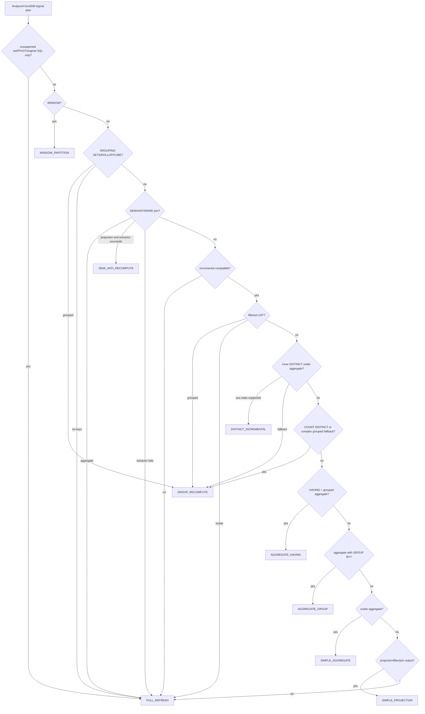
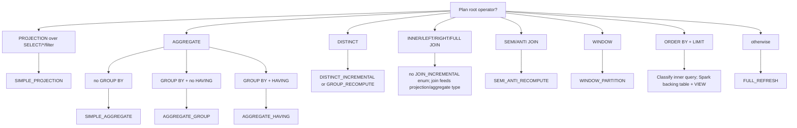

# 3. IncrementalChecker and RefreshType ordinals

> Scope: upstream OpenIVM `src/core/incremental_checker.cpp`,
> `src/core/parser.cpp`, `src/rules/*`, `src/upsert/*`, and
> `src/include/core/openivm_constants.hpp`.
>
> Spark bridge: `RefreshTypeCode.scala`, `SparkRefreshRewriter.scala`,
> `SparkMergeAssembler.scala`, and `MaterializedViewCommands.scala`.

## 3.1 What this chapter explains

`IncrementalChecker` is the CREATE-time plan classifier.
It walks the DuckDB logical plan once and records facts in `PlanAnalysis`:

- projection, filter, aggregate, DISTINCT, window, join, semi/anti join;
- scalar aggregate versus grouped aggregate;
- HAVING, GROUPING SETS, MIN/MAX, LIST, COUNT(DISTINCT), nested aggregate;
- unsupported operators, volatile expressions, and unsafe UNNEST expressions;
- top-k wrappers and window partition keys;
- GROUP BY columns needed for affected-key recompute.
  `IncrementalChecker` does not emit refresh SQL.
  The ownership split is:

1. `src/core/incremental_checker.cpp` records plan facts.
1. `src/core/parser.cpp` converts those facts into a stored `RefreshType`.
1. `src/upsert/refresh_sql.cpp` dispatches by that stored type.
1. `src/upsert/refresh_compiler*.cpp` emits DuckDB-dialect refresh SQL.
1. openivm-spark rewrites or assembles that SQL for Spark/Delta.

## 3.2 Verified enum and ordinals

The source request for this chapter included an alternate enum with
`FULL_REFRESH = 0`, `JOIN_INCREMENTAL = 6`, and `SEMI_ANTI = 9`.
That is **not** the enum in this checkout.
The verified enum at `src/include/core/openivm_constants.hpp:67-79` is:

```cpp
enum class RefreshType : uint8_t {
	AGGREGATE_GROUP,
	SIMPLE_AGGREGATE,
	SIMPLE_PROJECTION,
	FULL_REFRESH,
	AGGREGATE_HAVING,
	WINDOW_PARTITION, // window functions — partition-level recompute
	GROUP_RECOMPUTE, // inner-DISTINCT-under-AGG fallback: DELETE+INSERT only the GROUP BY keys touched by source deltas
	TOP_K,           // Legacy enum value; current top-k support strips ORDER BY/LIMIT into the user-facing view
	DISTINCT_INCREMENTAL, // inner-DISTINCT-under-AGG with aux state (openivm_distinct_aux_state=true): DBSP-correct
	                      // distinct(R)=sgn(R[t]); per-tuple count table emits ±1 only on count transitions
	SEMI_ANTI_RECOMPUTE   // SEMI/ANTI join aux state: per-left-tuple match counts, transition-scoped MV updates
};
```

Because the C++ enum has no explicit assignments, the ordinal is positional:

|                                                                                    Ordinal | Name                   |
| -----------------------------------------------------------------------------------------: | ---------------------- |
|                                                                                          0 | `AGGREGATE_GROUP`      |
|                                                                                          1 | `SIMPLE_AGGREGATE`     |
|                                                                                          2 | `SIMPLE_PROJECTION`    |
|                                                                                          3 | `FULL_REFRESH`         |
|                                                                                          4 | `AGGREGATE_HAVING`     |
|                                                                                          5 | `WINDOW_PARTITION`     |
|                                                                                          6 | `GROUP_RECOMPUTE`      |
|                                                                                          7 | `TOP_K`                |
|                                                                                          8 | `DISTINCT_INCREMENTAL` |
|                                                                                          9 | `SEMI_ANTI_RECOMPUTE`  |
|                                                              openivm-spark mirrors this in |                        |
| `spark-ext/ivm-common/src/main/scala/org/openivm/spark/common/RefreshTypeCode.scala:6-18`. |                        |
|                                   There is no `JOIN_INCREMENTAL` ordinal in this checkout. |                        |
|              Ordinary joins are rewritten by `src/rules/join.cpp`, then stored as the root |                        |
|                           shape that consumes the join delta: usually `SIMPLE_PROJECTION`, |                        |
|                                                  `AGGREGATE_GROUP`, or `AGGREGATE_HAVING`. |                        |

## 3.3 Rule files are not refresh types

The rule dispatcher is `src/rules/incremental_rewrite_rule.cpp:99-145`.
It maps logical operators to rewrite rules:

| Logical operator                                                         | Rule class                  | Rule file                  |
| ------------------------------------------------------------------------ | --------------------------- | -------------------------- |
| table scan                                                               | `IncrementalScanRule`       | `src/rules/scan.cpp`       |
| projection                                                               | `IncrementalProjectionRule` | `src/rules/projection.cpp` |
| filter                                                                   | `IncrementalFilterRule`     | `src/rules/filter.cpp`     |
| aggregate                                                                | `IncrementalAggregateRule`  | `src/rules/aggregate.cpp`  |
| distinct                                                                 | `IncrementalDistinctRule`   | `src/rules/distinct.cpp`   |
| union                                                                    | `IncrementalUnionRule`      | `src/rules/union.cpp`      |
| ordinary join                                                            | `IncrementalJoinRule`       | `src/rules/join.cpp`       |
| delim/dependent join                                                     | `IncrementalDelimJoinRule`  | `src/rules/delim_join.cpp` |
| window                                                                   | `IncrementalWindowRule`     | `src/rules/window.cpp`     |
| order/limit/top-n                                                        | `IncrementalTopKRule`       | `src/rules/topk.cpp`       |
| A grouped aggregate over a join therefore uses both `join.cpp` and       |                             |                            |
| `aggregate.cpp`, but its stored refresh type is still `AGGREGATE_GROUP`. |                             |                            |

## 3.4 Classification decision tree

The ordered classifier is `src/core/parser.cpp:610-800`.
A compact view is:



The requested root-operator tree needs two corrections:



## 3.5 Summary table

| Ordinal | Name                   | Linear?                              | Aux state                                           | DuckDB rule file                                 | Upstream compiler                                       | Spark assembler / shape              |
| ------: | ---------------------- | ------------------------------------ | --------------------------------------------------- | ------------------------------------------------ | ------------------------------------------------------- | ------------------------------------ |
|       0 | `AGGREGATE_GROUP`      | yes for additive aggregates          | group keys, hidden sum/count                        | `aggregate.cpp` plus child rules                 | `CompileAggregateGroups`                                | MERGE / `MergeAssembler`             |
|       1 | `SIMPLE_AGGREGATE`     | yes for additive scalar aggregate    | hidden sum/count; optional filtered-group-count aux | `aggregate.cpp`                                  | `CompileSimpleAggregates`; `CompileFilteredGroupCount`  | scalar UPDATE/MERGE                  |
|       2 | `SIMPLE_PROJECTION`    | yes                                  | none                                                | `projection.cpp`, `filter.cpp`, child `join.cpp` | `CompileProjectionRefresh`; `CompileProjectionsFilters` | DeleteByKeys + Insert                |
|       3 | `FULL_REFRESH`         | n/a                                  | none                                                | none; bypass                                     | `BuildRecomputeQuery`; `CompileFullRecompute`           | `FullRefreshAssembler`               |
|       4 | `AGGREGATE_HAVING`     | yes below HAVING                     | all groups stored below wrapper                     | `aggregate.cpp`, `filter.cpp`                    | `CompileAggregateGroups`                                | MERGE + HAVING view/filter           |
|       5 | `WINDOW_PARTITION`     | partition recompute, not pure linear | partition keys/lineage                              | `window.cpp`                                     | `BuildWindowPartitionRefresh`; `CompileWindowRecompute` | partition DELETE+INSERT              |
|       6 | `GROUP_RECOMPUTE`      | affected-key recompute               | group keys; optional cascade snapshots              | child rules; no single rule                      | `CompileGroupRecompute`                                 | affected-key DELETE+INSERT           |
|       7 | `TOP_K`                | legacy direct ordinal                | unlimited inner backing state                       | `topk.cpp`                                       | wrapper uses the inner query's compiler                  | dead ordinal; wrapper rides inner type |
|       8 | `DISTINCT_INCREMENTAL` | yes for transition-count shape       | per-distinct-tuple counts                           | `distinct.cpp`, `aggregate.cpp`                  | `CompileDistinctIncremental`                            | aux MERGE / count monoid             |
|       9 | `SEMI_ANTI_RECOMPUTE`  | transition-scoped                    | left counts and match counts                        | `join.cpp`                                       | `CompileSemiAntiRecompute`                              | `AuxStateAssembler`                  |

## 3.6 Ordinal 0: AGGREGATE_GROUP

`AGGREGATE_GROUP` is the normal grouped-aggregate path.
The data table is keyed by GROUP BY columns, and aggregate deltas update the row
for each touched group.
For additive aggregates the Z-set rule is keyed monoid addition:
$\Delta γ_k(R) = γ_k(\Delta R)$.
AVG, STDDEV, and VARIANCE are maintained through hidden SUM/COUNT helper columns.
MIN/MAX and non-summable cases may use insert-only fast paths or affected-group
recompute.
Plan shape:

- `found_aggregation = true`.
- group columns are non-empty;
- no earlier fallback branch fires;
- branch: `parser.cpp:790-791`.
  Rule file:
- `src/rules/aggregate.cpp` for the aggregate;
- child joins use `src/rules/join.cpp` but do not create a join ordinal.
  Compile file:
- `refresh_sql.cpp:505-525` dispatches;
- `refresh_compiler.cpp:168-665` implements `CompileAggregateGroups`.
  Representative MV:

```sql
CREATE MATERIALIZED VIEW mv_sales_by_store AS
SELECT store_id, SUM(amount) AS total, COUNT(*) AS cnt
FROM sales
GROUP BY store_id;
```

Expected refresh SQL shape:

```sql
WITH refresh_cte AS (
  SELECT store_id,
         SUM(openivm_multiplicity * total) AS total,
         SUM(openivm_multiplicity * cnt) AS cnt
  FROM openivm_delta_mv_sales_by_store
  GROUP BY store_id
)
MERGE INTO openivm_data_mv_sales_by_store v
USING refresh_cte d
ON v.store_id IS NOT DISTINCT FROM d.store_id
WHEN MATCHED THEN UPDATE SET total = v.total + d.total, cnt = v.cnt + d.cnt
WHEN NOT MATCHED THEN INSERT (...);
```

Spark reads this as MERGE-shaped SQL and optional companion view-delta shapes.

## 3.7 Ordinal 1: SIMPLE_AGGREGATE

`SIMPLE_AGGREGATE` is a scalar aggregate with no GROUP BY.
The key space has one implicit group, so the compiler can update one row rather
than merge by key.
The Z-set math is the same additive aggregate rule as grouped aggregate, but
with a unit key.
Plan shape:

- `found_aggregation = true`;
- group columns are empty;
- branch: `parser.cpp:792-793`.
  Rule file:
- `src/rules/aggregate.cpp`.
  Compile file:
- `refresh_sql.cpp:541-570` dispatches;
- `refresh_compiler.cpp:667-762` implements `CompileSimpleAggregates`;
- `refresh_compiler_aux.cpp:291-339` implements filtered-group-count aux.
  Representative MV:

```sql
CREATE MATERIALIZED VIEW mv_sales_total AS
SELECT SUM(amount) AS total, COUNT(*) AS cnt
FROM sales;
```

Expected refresh SQL shape:

```sql
WITH openivm_delta AS (
  SELECT SUM(openivm_multiplicity * total) AS d_total,
         SUM(openivm_multiplicity * cnt) AS d_cnt
  FROM openivm_delta_mv_sales_total
)
UPDATE openivm_data_mv_sales_total SET
  total = COALESCE(total, 0) + COALESCE((SELECT d_total FROM openivm_delta), 0),
  cnt = COALESCE(cnt, 0) + COALESCE((SELECT d_cnt FROM openivm_delta), 0);
```

Scalar MIN/MAX or non-summable scalar outputs can make the emitted SQL a
whole-MV DELETE+INSERT even though the stored type is scalar aggregate.

## 3.8 Ordinal 2: SIMPLE_PROJECTION

`SIMPLE_PROJECTION` covers bag projection and filter views, including many
non-aggregate join outputs.
Projection and selection are linear over Z-sets:
$\Delta π(R) = π(\Delta R)$ and $\Delta σ(R) = σ(\Delta R)$.
If a join is below the projection, `join.cpp` first produces a signed join delta.
Plan shape:

- `found_projection = true`;
- `found_aggregation = false`;
- no higher-priority semi/anti, window, distinct, or unsupported branch fires;
- branch: `parser.cpp:794-795`.
  Rule files:
- `src/rules/projection.cpp`;
- `src/rules/filter.cpp`;
- `src/rules/join.cpp` for child joins.
  Compile file:
- `refresh_sql.cpp:527-538` dispatches;
- `refresh_compiler.cpp:764-841` implements `CompileProjectionsFilters`.
  Representative MV:

```sql
CREATE MATERIALIZED VIEW mv_active_users AS
SELECT id, email
FROM users
WHERE active = true;
```

Expected refresh SQL shape:

```sql
WITH openivm_net AS (
  SELECT id, email, SUM(openivm_multiplicity) AS _net
  FROM openivm_delta_mv_active_users
  GROUP BY id, email
  HAVING SUM(openivm_multiplicity) != 0
)
DELETE FROM openivm_data_mv_active_users
WHERE rowid IN (<ranked rows for tuples with _net < 0>);

INSERT INTO openivm_data_mv_active_users
SELECT id, email
FROM openivm_net, generate_series(1, _net::BIGINT)
WHERE _net > 0;
```

Spark translates this to delete-by-tuple plus insert statements.

## 3.9 Ordinal 3: FULL_REFRESH

`FULL_REFRESH` is the baseline recompute path.
No incremental Z-set operator is used; refresh evaluates the whole query over
current sources and replaces the materialized result.
Duck-side causes include:

- plan has unclassifiable or unsupported operators;
- optimizer or rewrite output no longer matches a supported rule pattern;
- unsupported constructs such as volatile functions, unsupported joins, PIVOT,
  some set operations, or unsafe aggregate forms;
- user forces full refresh at refresh time.
  The request mentioned `openivm_force_full_refresh=true`.
  In this checkout the implemented setting is `openivm_refresh_mode = 'full'`:
  `refresh_sql.cpp:365-372` sets `force_full_refresh`, and
  `refresh_sql.cpp:401-412` emits `BuildRecomputeQuery`.
  That same emission site also handles stored `FULL_REFRESH`, metadata-required
  full refresh, and adaptive recompute.
  Plan shape:
- `incremental_compatible = false`, or;
- the classifier reaches the final unrecognized-pattern branch;
- branch examples: `parser.cpp:610-611`, `667-671`, `797-800`.
  Rule file:
- none; incremental rewrite is bypassed.
  Compile file:
- `refresh_sql.cpp:401-412` calls `BuildRecomputeQuery`;
- `refresh_compiler.cpp:844-847` implements `CompileFullRecompute`.
  Representative MV:

```sql
CREATE MATERIALIZED VIEW mv_random AS
SELECT id, random() AS sample
FROM users;
```

Expected refresh SQL shape:

```sql
DELETE FROM openivm_data_mv_random;
INSERT INTO openivm_data_mv_random
SELECT id, random() AS sample
FROM users;
```

Spark shape:

```sql
INSERT OVERWRITE TABLE mv_random
SELECT * FROM (<original Spark query>);
```

See `../openivm-spark/11-full-refresh-demotion-debugging.md` for Spark-side
demotion debugging.

## 3.10 Ordinal 4: AGGREGATE_HAVING

`AGGREGATE_HAVING` is grouped aggregation where visibility is filtered by a
HAVING predicate.
OpenIVM stores all groups in the data table and applies HAVING in a user-facing
view wrapper.
The maintained state is still grouped additive state; the HAVING predicate is a
visibility filter over that state.
Plan shape:

- `found_having = true`;
- `found_aggregation = true`;
- group columns are non-empty;
- branch: `parser.cpp:774-775`.
  Rule files:
- `src/rules/aggregate.cpp`;
- `src/rules/filter.cpp` for filter mechanics;
- parser logic strips/records the HAVING wrapper.
  Compile file:
- `refresh_sql.cpp:490-503` dispatches;
- `CompileAggregateGroups` emits the MERGE;
- `openivm_having_merge` controls MERGE versus conservative recompute shape.
  Representative MV:

```sql
CREATE MATERIALIZED VIEW mv_big_customers AS
SELECT customer_id, SUM(amount) AS total
FROM sales
GROUP BY customer_id
HAVING SUM(amount) > 1000;
```

Expected refresh SQL shape:

```sql
MERGE INTO openivm_data_mv_big_customers v
USING (<grouped delta>) d
ON v.customer_id IS NOT DISTINCT FROM d.customer_id
WHEN MATCHED THEN UPDATE SET total = v.total + d.total
WHEN NOT MATCHED THEN INSERT (...);

-- user-facing view applies WHERE total > 1000
```

Spark demotes if it cannot safely express the HAVING predicate over stored data
columns (`having_pred_empty` or `having_pred_hidden_agg`).

## 3.11 Ordinal 5: WINDOW_PARTITION

`WINDOW_PARTITION` handles window-function views by recomputing affected
partitions.
Window operators are not generally linear over tuple deltas: one row can change
rank, frame, lag/lead, or running aggregate values for many rows in its
partition.
The math is therefore partition replacement:
`V[p] := Q(R_now)[p]` for each changed partition key `p`.
Plan shape:

- `found_window = true` from `incremental_checker.cpp:294-329`;
- branch: `parser.cpp:612-614`.
  Rule file:
- `src/rules/window.cpp`.
  Compile file:
- `refresh_sql.cpp:572-577` dispatches;
- `refresh_window.cpp` builds partition/lineage metadata;
- `refresh_compiler_aux.cpp:341-410` implements `CompileWindowRecompute`.
  Representative MV:

```sql
CREATE MATERIALIZED VIEW mv_customer_ranks AS
SELECT customer_id, order_id, amount,
       ROW_NUMBER() OVER (PARTITION BY customer_id ORDER BY amount DESC) AS rn
FROM orders;
```

Expected refresh SQL shape:

```sql
CREATE OR REPLACE TEMP TABLE openivm_affected_mv_customer_ranks AS
SELECT DISTINCT customer_id FROM openivm_delta_orders;

DELETE FROM openivm_data_mv_customer_ranks
WHERE customer_id IN (SELECT customer_id FROM openivm_affected_mv_customer_ranks);

INSERT INTO openivm_data_mv_customer_ranks
SELECT * FROM (<original window query>) q
WHERE customer_id IN (SELECT customer_id FROM openivm_affected_mv_customer_ranks);
```

Multi-source window views depend on lineage from source deltas to partition
keys; if lineage cannot scope the change, the compiler widens the recompute.

## 3.12 Ordinal 6: GROUP_RECOMPUTE

`GROUP_RECOMPUTE` is affected-key partial recompute.
It is used when group keys exist but additive MERGE would be unsafe, such as
inner DISTINCT under aggregate without aux state, COUNT(DISTINCT), LIST, nested
aggregates, grouping sets, or complex correlated grouped shapes.
The math is delete and reinsert by affected key:
`V[k] := Q(R_now)[k]` for keys `k` touched by source deltas.
Plan shape:

- group keys are known;
- an earlier branch decides normal aggregate delta math is unsafe;
- examples: `parser.cpp:615-619`, `672-679`, `699-771`, `776-789`.
  Rule files:
- no single `group_recompute.cpp`;
- child scan/filter/projection/join/aggregate rules may still run.
  Compile file:
- `refresh_sql.cpp:634-677` dispatches;
- `refresh_compiler.cpp:849-957` implements `CompileGroupRecompute`.
  Representative MV:

```sql
CREATE MATERIALIZED VIEW mv_distinct_amounts AS
SELECT customer_id, COUNT(DISTINCT amount) AS distinct_amounts
FROM sales
GROUP BY customer_id;
```

Expected refresh SQL shape:

```sql
CREATE OR REPLACE TEMP TABLE openivm_affected_mv_distinct_amounts AS
SELECT DISTINCT customer_id
FROM (<view query with one source replaced by delta-filtered rows>) s;

DELETE FROM openivm_data_mv_distinct_amounts t
WHERE EXISTS (SELECT 1 FROM openivm_affected_mv_distinct_amounts a WHERE a.customer_id IS NOT DISTINCT FROM t.customer_id);

INSERT INTO openivm_data_mv_distinct_amounts
SELECT * FROM (<original grouped query>) r
WHERE EXISTS (SELECT 1 FROM openivm_affected_mv_distinct_amounts a WHERE a.customer_id IS NOT DISTINCT FROM r.customer_id);
```

With `openivm_emit_cascade_delta_for_recompute=true`, OpenIVM can also emit a
signed old/new snapshot delta for downstream MV-over-MV refresh.

## 3.13 Ordinal 7: TOP_K is a dead direct type on Spark

`TOP_K` is a legacy enum value.
OpenIVM can detect top-k wrappers and strip them from the stored inner data
query, then apply ORDER BY/LIMIT in a user-facing DuckDB view.
OpenIVM-Spark mirrors that layout: it incrementally maintains the inner query
under `<mv>__ivm_data` using the projection/aggregate refresh type and exposes
the public MV as a separate Spark VIEW. Only unsupported `TAIL` extraction is
demoted to `FULL_REFRESH`.
OpenIVM sources:

- `incremental_checker.cpp:332-380` detects TOP_N/ORDER/LIMIT;
- `parser.cpp:243-290` strips a top-level top-k wrapper;
- `openivm_constants.hpp:75` marks `TOP_K` as legacy.
  Spark integration source:
- `MaterializedViewCommands.scala` defines `extractTopKViewSpec` and the
  backing-table CREATE/REFRESH/DROP path;
- `MaterializedViewCommands.scala` keeps the inner refresh type with reason
  `top_k_kept`; unsupported wrappers use `top_k_unsupported` and full refresh.
  Representative MV:

```sql
CREATE MATERIALIZED VIEW mv_top_orders AS
SELECT order_id, amount
FROM orders
ORDER BY amount DESC
LIMIT 10;
```

Expected Spark refresh SQL shape:

```sql
MERGE INTO mv_top_orders__ivm_data AS v
USING (<incremental delta for the unlimited inner query>) AS d
ON <inner-query key equality>
WHEN MATCHED THEN UPDATE SET *
WHEN NOT MATCHED THEN INSERT *;
```

Math:

- top-k is non-monotone under deletes and updates;
- removing the current rank 1 row may require reading rank 11;
- without ranking boundary state, visible top-k rows are insufficient;
- Spark therefore stores the unlimited inner result and evaluates the
  user-facing ORDER BY/LIMIT in a VIEW. The direct ordinal `TOP_K` remains
  unreachable, but Top-K wrappers can still be incrementally maintained under
  their inner projection or aggregate refresh type.

## 3.14 Ordinal 8: DISTINCT_INCREMENTAL

`DISTINCT_INCREMENTAL` is the aux-state path for inner DISTINCT under a grouped
aggregate with one supported SUM.
It implements the DBSP identity `distinct(R)(t) = sgn(R[t])` by maintaining a
per-distinct-tuple count table.
A tuple emits `+1` only on zero-to-positive count transitions and `-1` only on
positive-to-zero transitions.
Plan shape:

- inner DISTINCT under aggregate;
- `openivm_distinct_aux_state = true`;
- single source;
- `ExtractInnerDistinct` succeeds;
- outer aggregate is exactly one SUM;
- branch: `parser.cpp:678-766`.
  Rule files:
- `src/rules/distinct.cpp`;
- `src/rules/aggregate.cpp`.
  Compile file:
- `refresh_sql.cpp:579-603` dispatches;
- `refresh_compiler_aux.cpp:53-132` implements `CompileDistinctIncremental`.
  Representative MV:

```sql
SET openivm_distinct_aux_state = true;
CREATE MATERIALIZED VIEW mv_distinct_revenue AS
SELECT customer_id, SUM(amount) AS revenue
FROM (SELECT DISTINCT customer_id, order_id, amount FROM orders) d
GROUP BY customer_id;
```

Expected refresh SQL shape:

```sql
CREATE OR REPLACE TEMP TABLE openivm_dinput_mv_distinct_revenue AS
SELECT customer_id, order_id, amount, SUM(openivm_multiplicity) AS dmult
FROM openivm_delta_orders
GROUP BY customer_id, order_id, amount
HAVING SUM(openivm_multiplicity) <> 0;

WITH ddist AS (<compare dinput to aux count table and emit dd in {-1,0,1}>),
     dagg AS (SELECT customer_id, SUM(amount * dd) AS d_sum, SUM(dd) AS d_count FROM ddist GROUP BY customer_id)
MERGE INTO openivm_data_mv_distinct_revenue v USING dagg d ON ...;

MERGE INTO openivm_distinct_aux_mv_distinct_revenue aux USING openivm_dinput_mv_distinct_revenue i ON ...;
DELETE FROM aux WHERE _count <= 0;
```

If distinct aux metadata is missing, `refresh_sql.cpp:600-603` falls through to
`GROUP_RECOMPUTE`.

## 3.15 Ordinal 9: SEMI_ANTI_RECOMPUTE

`SEMI_ANTI_RECOMPUTE` maintains projection/filter stacks over SEMI and ANTI
joins with auxiliary match-count state.
A SEMI row is visible when its right-side match count is positive.
An ANTI row is visible when that count is zero.
The refresh is driven by visibility transitions plus left-row multiplicity
changes.
Plan shape:

- `found_semi_anti_join = true`;
- no aggregate above it;
- `ExtractSemiAntiQuery` succeeds;
- left output/key columns are known;
- branch: `parser.cpp:620-666`.
  Rule file:
- `src/rules/join.cpp`; semi/anti-specific extraction is in parser helpers.
  Compile file:
- `refresh_sql.cpp:604-633` dispatches;
- `refresh_compiler_aux.cpp:134-277` implements `CompileSemiAntiRecompute`.
  Representative MV:

```sql
CREATE MATERIALIZED VIEW mv_customers_with_orders AS
SELECT c.customer_id, c.name
FROM customers c
WHERE EXISTS (SELECT 1 FROM orders o WHERE o.customer_id = c.customer_id);
```

Expected refresh SQL shape:

```sql
CREATE OR REPLACE TEMP TABLE openivm_saj_old_mv_customers_with_orders AS
SELECT *, (_match_count > 0) AS _visible FROM openivm_semi_anti_aux_mv_customers_with_orders;

CREATE OR REPLACE TEMP TABLE openivm_saj_dleft_mv_customers_with_orders AS ...;
CREATE OR REPLACE TEMP TABLE openivm_saj_dright_mv_customers_with_orders AS ...;
MERGE INTO openivm_semi_anti_aux_mv_customers_with_orders _aux USING openivm_saj_dright_mv_customers_with_orders _d ON ...;
CREATE OR REPLACE TEMP TABLE openivm_saj_aff_mv_customers_with_orders AS <keys whose count or visibility changed>;
DELETE old visible rows for affected keys;
INSERT current visible rows for affected keys;
DELETE FROM aux WHERE _left_count <= 0;
```

Spark maps ordinal 9 to `AuxStateAssembler` for assembled programs.

## 3.16 Ordinary joins and the missing JOIN_INCREMENTAL type

The requested tree included $INNER/LEFT/FULL JOIN \to JOIN_{\text{INCREMENTAL}}$.
Current OpenIVM does not have that stored type.
`src/rules/join.cpp` is still central: it produces a signed join delta that the
root operator consumes.
For N ordinary tables, the join rule uses inclusion-exclusion because the live
base scan already sees post-DML rows:

```text
Δ(R1 ⋈ ... ⋈ Rn)
  = UNION over non-empty S
    (-1)^(|S|-1) · (⋈_{i in S} ΔRi) ⋈ (⋈_{j not in S} Rj_now)
```

Then:

- projection over that join stores `SIMPLE_PROJECTION`;
- grouped aggregate over that join stores `AGGREGATE_GROUP` or
  `AGGREGATE_HAVING`;
- unsafe grouped join cases can store `GROUP_RECOMPUTE`;
- unsupported cases store or become `FULL_REFRESH`.
  Representative MV:

```sql
CREATE MATERIALIZED VIEW mv_order_customer AS
SELECT o.order_id, c.segment, o.amount
FROM orders o
JOIN customers c ON c.customer_id = o.customer_id;
```

Stored type is usually `SIMPLE_PROJECTION = 2`, not `JOIN_INCREMENTAL`.

## 3.17 Duck-side FULL_REFRESH cases

Duck-side `FULL_REFRESH` is different from Spark-side demotion.
Duck/OpenIVM itself emits or chooses full recompute when:

1. **Plan has unclassifiable operators.**
   `incremental_checker.cpp:382-385` marks unknown operators incompatible.
1. **The optimized or rewritten plan no longer matches a safe pattern.**
   Examples include unsupported set/PIVOT constructs, volatile functions,
   unsupported aggregate functions, unsupported joins, filtered LIST without
   group keys, semi/anti aggregates, and extractor failures.
1. **The user forces full refresh.**
   In this checkout this is `openivm_refresh_mode = 'full'`, not an
   `openivm_force_full_refresh` boolean.
1. **Adaptive refresh chooses recompute.**
   `openivm_adaptive_refresh` can decide full recompute is cheaper.
   The full-refresh emission site is `src/upsert/refresh_sql.cpp:401-412`:

```cpp
if (force_full_refresh || metadata_requires_full_refresh ||
    view_query_type == RefreshType::FULL_REFRESH || adaptive_recompute) {
  auto recompute_query = BuildRecomputeQuery(...);
  return recompute_query;
}
```

## 3.18 Investigating from Python

A direct DuckDB session can load the extension and ask it to compile refresh SQL:

```python
import duckdb
con = duckdb.connect(':memory:')
con.execute("LOAD '/opt/openivm/openivm.duckdb_extension'")
con.execute("PRAGMA openivm_target_dialect='spark'")
# ... set up sources ...
result = con.execute("PRAGMA compile_refresh('mv_name')").fetchall()
print(result)
```

A fuller reproduction usually creates the source tables, creates the MV, then
runs `PRAGMA compile_refresh`.
The Spark compiler bridge does the same thing in a DuckDB CLI subprocess and
parses the returned refresh type and SQL.

### `openivm_refresh_profile`

`openivm_refresh_profile` is declared by `openivm_constants.hpp:13` and created
in `openivm_extension.cpp:268-271` and
`parser_create_mv_helpers.cpp:123-127`.
Columns are:

```text
refresh_id, view_name, profile_timestamp, step_order,
step_name, duration_ms, detail
```

Useful query:

```sql
SELECT refresh_id, view_name, step_order, step_name, duration_ms, detail
FROM openivm_refresh_profile
ORDER BY profile_timestamp DESC, refresh_id, step_order;
```

CREATE-time profile rows include classification details from
`parser.cpp:837-843`, including `refresh_type=<name>`.
Refresh SQL generation rows are added through `refresh_sql.cpp:252-256`.
Chapter 9 of the OpenIVM architecture docs should cover profile interpretation
in depth; planned link: `9-refresh-profile-and-cost-model.md`.
For Spark cascade context, see
`../openivm-spark/9-mv-over-mv-cascade-and-fingerprints.md`.

## 3.19 Debugging checklist

1. Verify the enum ordinal first.
   This checkout uses `AGGREGATE_GROUP = 0` and `FULL_REFRESH = 3`.
1. Read `openivm_refresh_profile` for `create_compile_classification`.
   It records `refresh_type=<name>` and group-column counts.
1. Remember that `PlanRewrite` runs before classification.
   AVG, DISTINCT, HAVING, LEFT JOIN keys, and derived aggregate helpers may have
   been normalized before `IncrementalChecker` sees the plan.
1. For joins, do not look for `JOIN_INCREMENTAL`.
   Ask whether the root is projection, grouped aggregate, HAVING, or recompute.
1. For top-k on Spark, expect the inner projection/aggregate refresh type and
   `reason='top_k_kept'`; `TAIL` remains `top_k_unsupported` full refresh.
1. For Duck-side full refresh, inspect `parser.cpp:610-800` and
   `refresh_sql.cpp:401-412`.
1. For Spark-side full refresh, inspect chapter 11 of openivm-spark docs and the
   demotion ladder at `MaterializedViewCommands.scala:597-618`.

## 3.20 Final mnemonic

```text
0 grouped aggregate
1 scalar aggregate
2 projection/filter/join-output
3 full recompute
4 grouped aggregate with HAVING wrapper
5 window partition recompute
6 affected-group recompute
7 top-k legacy/dead on Spark
8 distinct aux count transitions
9 semi/anti aux match-count transitions
```
