# 4. OpenIVM system catalogs and DuckDB delta tables

OpenIVM's DuckDB extension persists its own catalog tables inside the DuckDB
file when it runs in standalone DuckDB mode.
openivm-spark uses the same extension differently: it starts a fresh
`duckdb :memory:` process, sets `openivm_compile_only=true`, asks for compiled
SQL, and discards that process.

```text
standalone DuckDB OpenIVM
  openivm_views + openivm_delta_tables + openivm_delta_<source>
  PRAGMA refresh('<view>') executes inside DuckDB
  catalog, data, deltas, history, and profile rows persist in the DuckDB file
openivm-spark
  duckdb :memory: + openivm.duckdb_extension + compile_only=true
  PRAGMA compile_refresh('<view>') emits SQL only
  RocksDB + Delta tables hold all durable state
```

`openivm_sources` and `openivm_source_deltas` do **not** exist in the current
OpenIVM codebase.  The equivalent implementation is `openivm_delta_tables` plus
one `openivm_delta_<source>` table per tracked DuckDB source.
Source landmarks used for this chapter:

- `openivm/src/include/core/openivm_constants.hpp:9-26` names catalog tables and
  prefixes.
- `openivm/src/core/parser_create_mv_helpers.cpp:41-128` creates the main
  catalog tables.
- `openivm/src/openivm_extension.cpp:250-332` creates migration/scaffold tables.
- `openivm/src/core/parser.cpp:877-1261` publishes MV rows and creates physical
  data/delta tables.
- `openivm/src/core/parser_ddl.cpp:153-195` derives MV-delta schemas from data
  tables.
- `openivm/src/rules/refresh_insert_rule.cpp:397-746` appends source deltas for
  INSERT/DELETE/UPDATE.
- `openivm/src/core/refresh_metadata.cpp:13-503` centralizes catalog reads and
  watermark writes.
- `openivm/src/upsert/refresh.cpp:30-95,112-345` executes refresh, profiling,
  and history recording.

## 4.1 Inventory

Static catalog tables:

| Table                                                                             | Purpose                                             |
| --------------------------------------------------------------------------------- | --------------------------------------------------- |
| `openivm_views`                                                                   | registered MV definitions and refresh-type metadata |
| `openivm_delta_tables`                                                            | source dependency catalog and per-view watermarks   |
| `openivm_refresh_hooks`                                                           | user SQL hooks for refresh                          |
| `openivm_refresh_history`                                                         | adaptive refresh cost-history samples               |
| `openivm_refresh_profile`                                                         | per-step CREATE/REFRESH telemetry                   |
| `openivm_match_log`                                                               | view-matching telemetry scaffold                    |
| `openivm_mv_dependencies`                                                         | view-matching dependency-edge scaffold              |
| `openivm_constraints_cache`                                                       | trusted constraint-cache scaffold                   |
| Generated state tables:                                                           |                                                     |
| Table family                                                                      | Purpose                                             |
| ---                                                                               | ---                                                 |
| `openivm_data_<view>`                                                             | physical backing table for the MV row set           |
| `openivm_delta_<source>`                                                          | signed source-delta table                           |
| `openivm_delta_<view>`                                                            | signed MV-delta table for cascades                  |
| `openivm_distinct_count_<view>`                                                   | DISTINCT aux-count state                            |
| `openivm_filtered_group_count_<view>`                                             | filtered group-count aux state                      |
| `openivm_semi_anti_state_<view>`                                                  | SEMI/ANTI match-count aux state                     |
| `openivm_old_*`, `openivm_affected_*`, `openivm_dinput_*`, ...                    | transient refresh scratch tables                    |
| The standalone demo used for sample rows created `sales` and `mv_sales`, inserted |                                                     |
| one pending row, and ran `PRAGMA refresh('mv_sales')` with profiling/adaptive     |                                                     |
| refresh enabled.                                                                  |                                                     |

## 4.2 `openivm_views`

DDL:

```sql
CREATE TABLE IF NOT EXISTS openivm_views (
  view_name VARCHAR PRIMARY KEY,
  sql_string VARCHAR,
  type TINYINT,
  has_minmax BOOLEAN DEFAULT false,
  has_left_join BOOLEAN DEFAULT false,
  last_update TIMESTAMP,
  refresh_interval BIGINT DEFAULT NULL,
  refresh_in_progress BOOLEAN DEFAULT false,
  group_columns VARCHAR DEFAULT NULL,
  aggregate_types VARCHAR DEFAULT NULL,
  having_predicate VARCHAR DEFAULT NULL,
  has_full_outer BOOLEAN DEFAULT false,
  full_outer_join_cols VARCHAR DEFAULT NULL,
  signature_hash UBIGINT DEFAULT NULL,
  canonical_plan_blob BLOB DEFAULT NULL,
  output_columns_json VARCHAR DEFAULT NULL,
  predicate_summary_json VARCHAR DEFAULT NULL,
  fd_summary_json VARCHAR DEFAULT NULL,
  source_tables_json VARCHAR DEFAULT NULL,
  aggregate_decomposition_json VARCHAR DEFAULT NULL,
  nullified_columns_json VARCHAR DEFAULT NULL,
  distinct_aux_meta_json VARCHAR DEFAULT NULL,
  semi_anti_aux_meta_json VARCHAR DEFAULT NULL,
  lineage_json VARCHAR DEFAULT NULL
);
```

Purpose:

- One row per materialized view.
- Stores the generated MV SQL, `RefreshType` code, group keys, aggregate kinds,
  HAVING predicate, outer-join flags, aux-state JSON, and matching metadata.
- Stores `refresh_interval` for scheduled refresh and `refresh_in_progress` for
  crash/concurrency state.
  Producer:
- `AppendCreateMVSystemTablesDDL` creates it.
- `parser.cpp` publishes rows late with `INSERT OR REPLACE INTO openivm_views`.
- Generated refresh SQL updates `refresh_in_progress` true/false.
  Consumer:
- `RefreshMetadata` reads query/type/flags/group columns/aggregate types.
- `refresh_daemon.cpp` scans scheduled views.
- `refresh_cost_model.cpp` reads refresh type.
- `refresh_insert_rule.cpp` uses it for DROP cleanup and base-vs-MV checks.
  Standalone sample:

```text
view_name=mv_sales
type=0
has_minmax=false
has_left_join=false
group_columns=region
aggregate_types=sum,count_star
refresh_in_progress=false
```

Demo row count: `1`.

## 4.3 `openivm_delta_tables`

DDL:

```sql
CREATE TABLE IF NOT EXISTS openivm_delta_tables (
  view_name VARCHAR,
  table_name VARCHAR,
  last_update TIMESTAMP,
  catalog_type VARCHAR DEFAULT 'duckdb',
  last_snapshot_id BIGINT DEFAULT NULL,
  last_refresh_ts TIMESTAMP DEFAULT NULL,
  pending_row_estimate BIGINT DEFAULT NULL,
  pending_estimate_ts TIMESTAMP DEFAULT NULL,
  source_catalog VARCHAR DEFAULT NULL,
  source_schema VARCHAR DEFAULT NULL,
  source_table_id BIGINT DEFAULT NULL,
  PRIMARY KEY(view_name, table_name)
);
```

Purpose:

- The actual source/dependency catalog.
- Maps each MV to its source delta relation or DuckLake source relation.
- Stores standard DuckDB watermarks in `last_update`.
- Stores DuckLake snapshot state in `last_snapshot_id`/`source_table_id`.
  Producer:
- `parser.cpp` inserts one row per source after physical MV objects exist.
- Standard DuckDB sources use `table_name = openivm_delta_<source>`.
- `RefreshMetadata::UpdateTimestamp` and DuckLake metadata helpers update rows
  after refresh.
  Consumer:
- `RefreshMetadata::GetDeltaTables`, `GetLastUpdate`, `GetSourceLocation`,
  `GetCatalogType`, `GetLastSnapshotId`, upstream/downstream walks, and cleanup.
- Refresh SQL generation uses it to build source-delta scans.
- Drop cleanup consults it to remove orphaned delta tables.
  Standalone sample:

```text
view_name=mv_sales
table_name=openivm_delta_sales
catalog_type=duckdb
source_catalog=catalog-demo-profile
source_schema=main
last_snapshot_id=NULL
```

Demo row count: `1`.

## 4.4 `openivm_refresh_hooks`

DDL:

```sql
CREATE TABLE IF NOT EXISTS openivm_refresh_hooks (
  view_name VARCHAR PRIMARY KEY,
  hook_sql VARCHAR NOT NULL,
  mode VARCHAR NOT NULL DEFAULT 'after'
);
```

Purpose:

- User/integration hook table.
- `mode='before'` runs before IVM refresh.
- `mode='after'` runs after IVM refresh.
- `mode='replace'` executes hook SQL instead of IVM.
  Producer:
- OpenIVM creates the table during CREATE MV.
- Users insert rows manually.
  Consumer:
- `RefreshViewLocked` reads it before refresh.
- `refresh_daemon.cpp` reads it for scheduled refreshes.
  Standalone sample: `row_count=0` in the demo.

## 4.5 `openivm_refresh_history`

DDL:

```sql
CREATE TABLE IF NOT EXISTS openivm_refresh_history (
  view_name VARCHAR,
  refresh_timestamp TIMESTAMP DEFAULT current_timestamp,
  method VARCHAR,
  incremental_compute_est DOUBLE,
  incremental_upsert_est DOUBLE,
  recompute_compute_est DOUBLE,
  recompute_replace_est DOUBLE,
  actual_duration_ms BIGINT,
  strategy VARCHAR DEFAULT 'incremental',
  PRIMARY KEY(view_name, refresh_timestamp)
);
```

Purpose:

- Learned/adaptive cost-model history.
- Records estimated incremental/recompute costs and actual refresh time.
  Producer:
- `RefreshViewLocked` calls `RefreshMetadata::RecordRefreshHistory` when
  adaptive estimation produced a strategy label.
  Consumer:
- `RefreshMetadata::GetRefreshHistory` reads it for regression.
- `PRAGMA refresh_history('<view>')` exposes it.
  Standalone sample with `openivm_adaptive_refresh=true`:

```text
view_name=mv_sales
method=incremental
incremental_compute_est=1.0
incremental_upsert_est=2.0
recompute_compute_est=5.0
recompute_replace_est=4.0
actual_duration_ms=14
strategy=incremental
```

Demo row count: `1`.

## 4.6 `openivm_refresh_profile`

DDL:

```sql
CREATE TABLE IF NOT EXISTS openivm_refresh_profile (
  refresh_id VARCHAR,
  view_name VARCHAR,
  profile_timestamp TIMESTAMP DEFAULT current_timestamp,
  step_order INTEGER,
  step_name VARCHAR,
  duration_ms BIGINT,
  detail VARCHAR,
  PRIMARY KEY(refresh_id, step_order)
);
```

Purpose:

- Per-step CREATE MV and REFRESH telemetry.
- Disabled by default; enable with `SET openivm_profile_refresh=true`.
- Old rows are pruned according to `openivm_profile_retention_days`.
  Producer:
- `CreateMVProfiler` inserts create-time rows.
- `RefreshProfiler` inserts refresh-time rows.
  Consumer:
- Users and tests query it directly.
- It is telemetry, not correctness metadata.
  Standalone sample:

```text
refresh_id=mv_sales_create_mv_..., step_order=0,
  step_name=create_compile_session_context, duration_ms=0
refresh_id=mv_sales_..., step_order=0,
  step_name=acquire_locks, duration_ms=0
refresh_id=mv_sales_..., step_order=5,
  step_name=generate_refresh_sql.adaptive_cost, detail=strategy=incremental
```

Demo row count: `43`.

## 4.7 `openivm_match_log`

DDL:

```sql
CREATE TABLE IF NOT EXISTS openivm_match_log (
  query_hash UBIGINT,
  log_timestamp TIMESTAMP,
  matched_view VARCHAR,
  chosen_strategy VARCHAR,
  bypass_cost_est DOUBLE,
  chosen_cost_est DOUBLE,
  actual_duration_ms BIGINT,
  PRIMARY KEY (query_hash, log_timestamp)
);
```

Purpose:

- Query-time view-matching telemetry scaffold.
- Controlled by `openivm_match_log_decisions` and retention settings.
- View matching is gated off by default.
  Producer:
- Created at extension load.
- No normal refresh insertion path is active in the inspected code.
  Consumer:
- Intended for the view-matching subsystem.
- Refresh correctness does not depend on it.
  Standalone sample: `row_count=0`.

## 4.8 `openivm_mv_dependencies`

DDL:

```sql
CREATE TABLE IF NOT EXISTS openivm_mv_dependencies (
  parent_view VARCHAR,
  child_view VARCHAR,
  edge_kind VARCHAR DEFAULT 'direct',
  PRIMARY KEY (parent_view, child_view)
);
```

Purpose:

- Explicit MV-to-MV edges for the view-matching project.
- Production cascade can also infer dependencies from `openivm_delta_tables`.
  Producer:
- `parser.cpp` deletes/reinserts child edges when
  `openivm_enable_view_matching=true`.
  Consumer:
- Intended for matcher catalog indexing.
- Standard refresh cascade primarily uses `openivm_delta_tables`.
  Standalone sample: `row_count=0`.

## 4.9 `openivm_constraints_cache`

DDL:

```sql
CREATE TABLE IF NOT EXISTS openivm_constraints_cache (
  table_name VARCHAR,
  constraint_kind VARCHAR,
  columns_json VARCHAR,
  referenced_table VARCHAR,
  referenced_columns_json VARCHAR,
  is_trusted BOOLEAN DEFAULT true,
  PRIMARY KEY (table_name, constraint_kind, columns_json)
);
```

Purpose:

- Trusted constraint-cache scaffold for matcher/pruning metadata.
- `constraint_cache.cpp` currently marks persistence into this table as TODO.
  Producer:
- Created at extension load.
- Not populated by normal CREATE MV or REFRESH paths in the demo.
  Consumer:
- Intended for matcher/pruning code.
- No current refresh correctness path depends on it.
  Standalone sample: `row_count=0`.

## 4.10 `openivm_data_<view>`

DDL template:

```sql
CREATE TABLE openivm_data_<view> AS <rewritten MV data query>;
CREATE VIEW <view> AS
SELECT * [EXCLUDE (openivm_* hidden columns)]
FROM openivm_data_<view> [WHERE <having_predicate>] [ORDER BY ... LIMIT ...];
```

Purpose:

- Physical backing table for the MV row set.
- The user-facing MV name is a DuckDB view over this table.
- Hidden `openivm_*` helper columns may live here.
- For `AGGREGATE_HAVING`, the data table stores all groups and the view applies
  the HAVING predicate.
  Producer:
- `parser.cpp` emits `CREATE TABLE <qdt> AS <view_query>`.
- `IncrementalTableNames::DataTableName(view_name)` returns
  `openivm_data_<view>`.
  Consumer:
- Refresh compilers mutate it with MERGE, UPDATE, DELETE, and INSERT.
- `ColumnHider` recognizes the `openivm_data_` prefix.
- openivm-spark mirrors this concept as `<mv>__ivm_data` on Delta.
  Standalone sample:

```text
openivm_data_mv_sales(region VARCHAR, total_amount HUGEINT, cnt BIGINT)
('east', 15, 2)
('west', 20, 1)
```

Demo row count: `2`.

## 4.11 `openivm_delta_<source>`

DDL template:

```sql
CREATE TABLE IF NOT EXISTS <catalog>.<schema>.openivm_delta_<source> AS
SELECT *,
       1::INTEGER AS openivm_multiplicity,
       now()::timestamp AS openivm_timestamp
FROM <catalog>.<schema>.<source>
LIMIT 0;
```

Purpose:

- Signed source-delta log for standard DuckDB source tables.
- `openivm_multiplicity=1` means inserted row image.
- `openivm_multiplicity=-1` means deleted row image.
- UPDATE writes old `-1` and new `+1` rows in one combined insert.
  Producer:
- `parser.cpp` creates it for every non-DuckLake source.
- `RefreshInsertRule` appends INSERT, DELETE, and UPDATE deltas.
  Consumer:
- `GenerateRefreshSQL` scans rows newer than the MV's `last_update` watermark.
- Rewrite rules replace source scans with delta scans.
- Cleanup removes rows older than every consumer watermark.
  Standalone sample:

```text
openivm_delta_sales(
  id INTEGER,
  region VARCHAR,
  amount INTEGER,
  openivm_multiplicity INTEGER,
  openivm_timestamp TIMESTAMP
)
(3, 'east', 5, 1, '2026-05-24 11:45:31.076233')
```

Demo row count after the sample refresh: `1`.

## 4.12 `openivm_delta_<view>`

DDL template:

```sql
CREATE TABLE IF NOT EXISTS openivm_delta_<view> (
  <all columns from openivm_data_<view>>,
  openivm_multiplicity INTEGER DEFAULT 1,
  openivm_timestamp TIMESTAMP DEFAULT now()
);
```

Purpose:

- Signed MV-delta table for MV-over-MV cascade.
- Downstream MVs consume it like a source delta.
  Producer:
- `parser.cpp` emits a create-delta-from-data marker for the MV.
- `BuildCreateDeltaFromDataSQL` derives the schema from `openivm_data_<view>`.
- Refresh SQL inserts cascade rows when downstream consumption is needed.
  Consumer:
- Downstream rows in `openivm_delta_tables` reference it.
- `RefreshMetadata::GetUpstreamViews` and `GetDownstreamViews` infer cascade
  edges from it.
  Standalone sample schema:

```text
openivm_delta_mv_sales(
  region VARCHAR,
  total_amount HUGEINT,
  cnt BIGINT,
  openivm_multiplicity INTEGER DEFAULT 1,
  openivm_timestamp TIMESTAMP DEFAULT now()
)
```

Demo row count: `0`, because no downstream MV consumed `mv_sales`.

## 4.13 Aux-state table families

### `openivm_distinct_count_<view>`

DDL template:

```sql
CREATE TABLE IF NOT EXISTS openivm_distinct_count_<view> AS
SELECT <distinct columns>, count(*)::BIGINT AS _count
FROM <distinct input relation>
[WHERE <filter>]
GROUP BY <distinct columns>;
```

Purpose: per-distinct-tuple count state for `DISTINCT_INCREMENTAL`.
Producer: `parser.cpp` via `BuildDistinctAuxStateCreateSQL`.
Consumer: `CompileDistinctIncremental` MERGEs delta counts and deletes rows with
`_count <= 0`.
Sample: not created for `mv_sales`.

### `openivm_filtered_group_count_<view>`

DDL template:

```sql
CREATE TABLE IF NOT EXISTS openivm_filtered_group_count_<view> AS
SELECT <group expression> AS <group column>,
       sum(<sum expression>) AS openivm_sum
FROM <source table>
GROUP BY <group expression>;
```

Purpose: aux state for filtered group-count/simple-aggregate decompositions.
Producer: `parser.cpp` via `BuildFilteredGroupCountAuxStateCreateSQL`.
Consumer: `CompileFilteredGroupCount` updates MV state and MERGEs this table.
Sample: not created for `mv_sales`.

### `openivm_semi_anti_state_<view>`

DDL template:

```sql
CREATE TABLE IF NOT EXISTS openivm_semi_anti_state_<view> AS
WITH left_source AS (...),
left_counts AS (... count(*)::BIGINT AS _left_count ...),
match_counts AS (... count(*)::BIGINT AS _match_count ...)
SELECT <left columns>, lc._left_count,
       coalesce(mc._match_count, 0)::BIGINT AS _match_count
FROM left_counts lc
LEFT JOIN match_counts mc ON <null-safe left-column match>;
```

Purpose: left-count/right-match-count state for SEMI/ANTI recompute.
Producer: `parser.cpp` via `BuildSemiAntiAuxStateCreateSQL`.
Consumer: `CompileSemiAntiRecompute` snapshots old state, applies left/right
changes, computes affected keys, rewrites MV rows, and prunes zero-left rows.
Sample: not created for `mv_sales`.

## 4.14 Transient `openivm_*` scratch tables

Examples:

```text
openivm_old_<view>
openivm_affected_<view>
openivm_dinput_<view>
openivm_saj_dleft_<view>
openivm_saj_dright_<view>
openivm_saj_old_<view>
openivm_saj_aff_<view>
openivm_fgc_delta_<view>
```

Purpose:

- Refresh-local staging for recompute and aux-state paths.
- Generally created as `CREATE TEMP TABLE` or `CREATE OR REPLACE TEMP TABLE`.
- Not durable catalog state.
  Producer: refresh compiler functions under `openivm/src/upsert/`.
  Consumer: later statements in the same generated refresh SQL batch.
  Sample: no durable row.

## 4.15 TPC-DI live exploration of the Spark warehouse

The requested query was run against each requested database path with DuckDB
Python and the bundled DuckDB CLI:

```sql
SELECT table_name
FROM duckdb_tables()
WHERE table_name LIKE 'openivm_%' OR table_name LIKE '__ivm_%';
```

Results:

| Requested basename                                                              | File-system type | DuckDB result              |
| ------------------------------------------------------------------------------- | ---------------: | -------------------------- |
| `bronze.db`                                                                     |        directory | `IO Error: Is a directory` |
| `silver.db`                                                                     |        directory | `IO Error: Is a directory` |
| `gold.db`                                                                       |        directory | `IO Error: Is a directory` |
| `tpcdi.db`                                                                      |        directory | `IO Error: Is a directory` |
| Those are Spark/Hive-style database directories, not DuckDB database files.     |                  |                            |
| They contain Spark/Delta warehouse state, so no DuckDB `openivm_*` or `__ivm_*` |                  |                            |
| schemas or row counts exist inside those paths.                                 |                  |                            |
| The same Spark warehouse does contain openivm-spark state:                      |                  |                            |

- RocksDB metadata/index files.
- Delta staging directories for source deltas.
- Delta view-delta directories for MV cascades.
- Delta MV data tables for materialized view output.
  That state is deliberately not standalone DuckDB's `openivm_views` catalog.

## 4.16 Compile-only mode in openivm-spark

openivm-spark's compiler bridge emits a script like:

```sql
LOAD 'openivm.duckdb_extension';
SET openivm_target_dialect='spark';
SET openivm_compile_only=true;
SET openivm_enable_view_matching=false;
SET openivm_force_view_delta_cascade=true;
SET openivm_emit_cascade_delta_for_recompute=true;
CREATE OR REPLACE MATERIALIZED VIEW <view> AS <normalized Spark SQL>;
PRAGMA compile_refresh('<view>');
```

The bridge runs the script in a fresh `duckdb :memory: -jsonlines` subprocess.
`openivm_compile_only=true` stops refresh after SQL generation and before data
mutation, cleanup, adaptive-history recording, and ordinary standalone side
effects.
Therefore, from Spark:

- DuckDB catalog tables are ephemeral.
- They disappear when the compiler subprocess exits.
- `openivm_refresh_history` and `openivm_refresh_profile` are normally empty.
- DuckDB is a compiler, not the state store.

## 4.17 What openivm-spark persists instead

| Standalone DuckDB OpenIVM                                                      | openivm-spark                                |
| ------------------------------------------------------------------------------ | -------------------------------------------- |
| `openivm_views`                                                                | RocksDB-backed MV metadata                   |
| `openivm_delta_tables.last_update`                                             | RocksDB consumed markers                     |
| `openivm_delta_<source>`                                                       | Delta staging paths plus temp Spark views    |
| `openivm_delta_<view>`                                                         | Delta view-delta paths plus temp Spark views |
| `openivm_data_<view>`                                                          | `<mv>__ivm_data` Delta table                 |
| DuckDB base tables                                                             | Spark Delta base tables                      |
| Spark refresh creates temporary Spark SQL views named like                     |                                              |
| `openivm_delta_<source>` so the OpenIVM-compiled SQL can run with the relation |                                              |
| names it expects.  Those names are compatibility shims, not persistent DuckDB  |                                              |
| relations.                                                                     |                                              |

## 4.18 Standalone DuckDB reference demo

```sql
LOAD 'openivm.duckdb_extension';
CREATE TABLE sales(id INTEGER, region VARCHAR, amount INTEGER);
INSERT INTO sales VALUES (1, 'east', 10), (2, 'west', 20);
CREATE MATERIALIZED VIEW mv_sales AS
SELECT region, SUM(amount) AS total_amount, COUNT(*) AS cnt
FROM sales
GROUP BY region;
INSERT INTO sales VALUES (3, 'east', 5);
PRAGMA refresh('mv_sales');
SELECT * FROM mv_sales ORDER BY region;
SELECT * FROM openivm_views;
SELECT * FROM openivm_delta_tables;
SELECT * FROM openivm_delta_sales;
```

Expected reference behavior:

```text
mv_sales:
('east', 15, 2)
('west', 20, 1)
openivm_delta_sales:
(3, 'east', 5, 1, <timestamp>)
openivm_delta_tables:
('mv_sales', 'openivm_delta_sales', <last_update>, 'duckdb', ...)
```

Telemetry example:

```sql
SET openivm_profile_refresh=true;
SET openivm_adaptive_refresh=true;
PRAGMA refresh('mv_sales');
SELECT * FROM openivm_refresh_profile ORDER BY refresh_id, step_order;
SELECT * FROM openivm_refresh_history;
```

This is the reference behavior openivm-spark reproduces at the SQL-semantics
level. Spark executes the emitted SQL against Delta instead of letting DuckDB
execute refresh against a persistent DuckDB catalog.

## 4.19 Delta-table naming: DuckDB vs Spark

| Concept                        | DuckDB OpenIVM                     | openivm-spark                                      |
| ------------------------------ | ---------------------------------- | -------------------------------------------------- |
| MV backing row set             | `openivm_data_<view>`              | `<mv>__ivm_data`                                   |
| source delta                   | `openivm_delta_<source>`           | staging Delta + temp `openivm_delta_<source>` view |
| cascade delta                  | `openivm_delta_<view>`             | view-delta Delta + temp view                       |
| per-consumer watermark         | `openivm_delta_tables.last_update` | RocksDB consumed metadata                          |
| The DuckDB creation sites are: |                                    |                                                    |

- data table: `parser.cpp` emits `CREATE TABLE <qdt> AS <view_query>`.
- source delta: `parser.cpp` emits `CREATE TABLE IF NOT EXISTS openivm_delta_<source> AS SELECT ..., openivm_multiplicity, openivm_timestamp FROM <source> LIMIT 0`.
- MV delta: `BuildCreateDeltaFromDataSQL` derives columns from
  `openivm_data_<view>` and adds multiplicity/timestamp.

## 4.20 Mermaid: catalog write/read sites

```mermaid
flowchart TB
  Parser[parser.cpp CREATE MV]
  DDL[AppendCreateMVSystemTablesDDL]
  Ext[openivm_extension.cpp migrations]
  InsertRule[RefreshInsertRule]
  Metadata[RefreshMetadata]
  Refresh[RefreshViewLocked]
  Compiler[refresh compilers]
  Daemon[refresh_daemon]
  Matcher[src/match scaffold]
  Views[(openivm_views)]
  DeltaTables[(openivm_delta_tables)]
  Hooks[(openivm_refresh_hooks)]
  History[(openivm_refresh_history)]
  Profile[(openivm_refresh_profile)]
  MatchLog[(openivm_match_log)]
  Deps[(openivm_mv_dependencies)]
  Constraints[(openivm_constraints_cache)]
  DataTable[(openivm_data_view)]
  SourceDelta[(openivm_delta_source)]
  ViewDelta[(openivm_delta_view)]
  Aux[(aux openivm_* state tables)]
  Temp[(TEMP openivm_* scratch)]
  Parser --> DDL
  DDL --> Views
  DDL --> DeltaTables
  DDL --> Hooks
  DDL --> History
  DDL --> Profile
  Ext --> MatchLog
  Ext --> Deps
  Ext --> Constraints
  Parser --> DataTable
  Parser --> SourceDelta
  Parser --> ViewDelta
  Parser --> Aux
  InsertRule --> SourceDelta
  InsertRule --> Views
  InsertRule --> DeltaTables
  Metadata --> Views
  Metadata --> DeltaTables
  Metadata --> History
  Refresh --> Hooks
  Refresh --> Profile
  Refresh --> History
  Compiler --> DataTable
  Compiler --> SourceDelta
  Compiler --> ViewDelta
  Compiler --> Aux
  Compiler --> Temp
  Daemon --> Views
  Daemon --> Hooks
  Matcher --> MatchLog
  Matcher --> Deps
  Matcher --> Constraints
```



## 4.21 Debugging checklist

Standalone DuckDB OpenIVM:

1. `SELECT * FROM openivm_views WHERE view_name = '<mv>';`
1. `SELECT * FROM openivm_delta_tables WHERE view_name = '<mv>';`
1. `SELECT * FROM openivm_delta_<source> ORDER BY openivm_timestamp;`
1. `SELECT * FROM openivm_data_<mv>;`
1. Enable `openivm_profile_refresh=true` for `openivm_refresh_profile`.
1. Enable `openivm_adaptive_refresh=true` only when cost history matters.
   openivm-spark:
1. Do not look for a persistent DuckDB `openivm_views` table.
1. Inspect RocksDB-backed MV metadata and staging catalogs.
1. Inspect Delta staging and view-delta directories.
1. Inspect generated Spark SQL from the compiler bridge and rewriter.
1. Remember that DuckDB compiled the refresh math; Spark owns the state.
