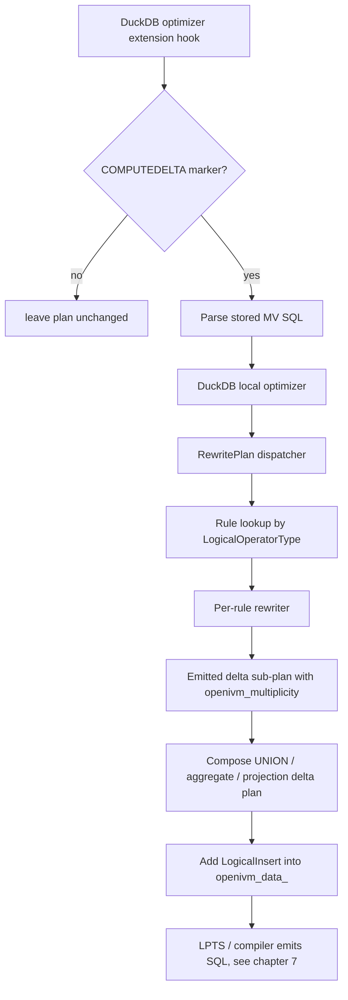

# 5. Optimizer rewrite rules per operator

This chapter maps the OpenIVM refresh-time optimizer rules in `src/rules/` to the algebra in [chapter 1](1-zsets-deltas-and-refresh-math.md) and to the SQL assembled later in [chapter 7](7-refresh-sql-emission-and-upsert.md).

The source examined here is the upstream OpenIVM checkout under `.temp/openivm`; the Spark extension consumes its emitted refresh program through the DuckDB CLI bridge.

## Source inventory

| File                           | `wc -l` | Primary role                                                        |
| ------------------------------ | ------: | ------------------------------------------------------------------- |
| `aggregate.cpp`                |      45 | Delta rewrite for `LOGICAL_AGGREGATE_AND_GROUP_BY`.                 |
| `column_hider.cpp`             |      15 | Header-backed naming shim for internal/user-facing MV columns.      |
| `delim_join.cpp`               |     538 | Delta rewrite for correlated `DELIM_JOIN` / `DEPENDENT_JOIN` plans. |
| `distinct.cpp`                 |     111 | Rewrites DISTINCT deltas as grouped count state.                    |
| `ducklake_join.cpp`            |     385 | DuckLake snapshot-aware join term builder.                          |
| `filter.cpp`                   |      61 | Filter passthrough and HAVING-filter stripping.                     |
| `helpers.cpp`                  |     403 | Shared delta-scan, compaction, and DuckLake-delta constructors.     |
| `incremental_rewrite_rule.cpp` |     302 | DuckDB optimizer-extension dispatcher and final insert wrapper.     |
| `join.cpp`                     |     992 | General join inclusion-exclusion / Möbius rewrite.                  |
| `join_output.cpp`              |      60 | UNION ALL assembly and parent binding repair for join terms.        |
| `projection.cpp`               |      37 | Projection passthrough with multiplicity appended.                  |
| `refresh_insert_rule.cpp`      |     755 | DML optimizer hook that writes source changes into delta tables.    |
| `scan.cpp`                     |      16 | Base scan to delta scan rewrite.                                    |
| `schema_evolution.cpp`         |     591 | DDL/schema metadata repair for stored MV definitions and aux state. |
| `topk.cpp`                     |      22 | ORDER BY / LIMIT / TOP_N stripping for refresh deltas.              |
| `union.cpp`                    |      33 | UNION ALL child-delta rewrite.                                      |
| `window.cpp`                   |      29 | Window passthrough for partition-recompute callers.                 |

There is no `simple_projection.cpp`, `aggregate_group.cpp`, `aggregate_having.cpp`, `semi_anti.cpp`, or `top_k.cpp` file in this tree. The corresponding behavior lives in `projection.cpp`, `aggregate.cpp` plus the refresh compiler, semi/anti aux-state code, and `topk.cpp`.

## Rule hook and application order

OpenIVM does not register a literal DuckDB `OPTIMIZER_RULES` list. It registers DuckDB optimizer extensions: `openivm_extension.cpp:334-341` constructs `IncrementalRewriteRule` and `RefreshInsertRule`, then calls `OptimizerExtension::Register` for both.

`IncrementalRewriteRule` is the refresh-time delta-plan dispatcher. Its optimizer hook first verifies that the optimized statement contains the synthetic `COMPUTEDELTA` marker (`incremental_rewrite_rule.cpp:217-227`). It reparses and optimizes the stored view SQL (`:241-271`), then calls `RewritePlan` once and wraps the result in a `LogicalInsert` into the MV data table (`:293-299`).

`RewritePlan` uses a fixed switch, not a registered rule batch: scan, join, delim/dependent join, projection, aggregate, filter, union, distinct, window, top-k/limit/order, CTE, CTE refs, and constant leaves are selected at `incremental_rewrite_rule.cpp:99-209`. There is no fixed-point loop in this dispatcher; each optimizer extension invocation performs one planned rewrite pass.

The traversal is recursive but not a single generic post-order walker. Most unary/binary rules recurse into their children before editing the current node, so they behave child-first for those operators. Join rules instead copy the whole join subtree for every delta mask and replace selected leaves inside each copy. CTE handling is custom: rewrite CTE definition, update references, then rewrite the consumer (`incremental_rewrite_rule.cpp:146-168`).

`RefreshInsertRule` is also an optimizer extension. It observes user DML and emits writes into `openivm_delta_<base>` before refresh; it is scheduled independently by DuckDB through the optimizer extension hook (`refresh_insert_rule.cpp:235-753`).



## Rule index and examples

### `aggregate.cpp`

- **Line count:** 45.

- **Operator(s):** `LOGICAL_AGGREGATE_AND_GROUP_BY` / `LogicalAggregate`.

- **Key functions/classes:** `IncrementalAggregateRule::Rewrite`, `LogicalAggregate`, `BoundColumnRefExpression`, `grouping_sets`, `group_stats`.

- **Plan rewrite:** Child-first rewrite: rewrite the aggregate input to produce delta rows, then append `openivm_multiplicity` as an additional group key (`aggregate.cpp:14-25`). The rule adjusts group statistics and grouping sets (`:27-35`) and returns the new group binding as the multiplicity binding (`:37-42`).

- **Math:** This implements the Z-set homomorphism for distributive aggregate deltas: every output aggregate row is keyed by the user group plus the delta sign/weight. The later compiler combines the weights with aggregate values, matching chapter 1's additive group law for `SUM` and count monoids.

- **Emitted SQL shape:** The rule itself emits a logical aggregate delta, not SQL. [Chapter 7](7-refresh-sql-emission-and-upsert.md) picks it up through `CompileAggregateGroups`, which builds `SUM(openivm_multiplicity * column)` per group (`refresh_compiler.cpp:408-440`) and a `MERGE INTO openivm_data_<view>` (`:613-621`).

- **Input → output example:**

  Input SQL: `SELECT k, SUM(v) AS s FROM t GROUP BY k`

  Output delta plan: `Aggregate(group=[k, openivm_multiplicity], aggs=[SUM(v)]) over DeltaScan(t)`.

  Refresh SQL shape: `WITH refresh_cte AS (SELECT k, SUM(w * s) AS s FROM delta_mv GROUP BY k) MERGE INTO data v USING refresh_cte d ...`.

### `column_hider.cpp`

- **Line count:** 15.

- **Operator(s):** No logical operator; this file documents and includes the header-only column-hiding helper.

- **Key functions/classes:** `IncrementalTableNames` in `column_hider.hpp`; comments cite parser and insert rule users.

- **Plan rewrite:** No plan rewrite. It defines the naming boundary between the backing table (`openivm_data_<name>`) and the user-facing view that excludes internal `openivm_*` columns (`column_hider.cpp:1-9`).

- **Math:** No delta algebra is applied here; it preserves the observation function from internal Z-set state to user-visible tuples, as described in chapter 1.

- **Emitted SQL shape:** No emitted refresh SQL. Creation/drop SQL is generated by parser and insert-rule code; the user view is `SELECT * EXCLUDE (...) FROM openivm_data_<view>` when hidden columns exist (`parser.cpp:1198-1205`).

- **Input → output example:**

  Input internal table: `openivm_data_mv(k, s, openivm_count_star)`.

  Output user view: `CREATE VIEW mv AS SELECT * EXCLUDE (openivm_count_star) FROM openivm_data_mv;`.

### `delim_join.cpp`

- **Line count:** 538.

- **Operator(s):** `LOGICAL_DELIM_JOIN`, `LOGICAL_DEPENDENT_JOIN`, `LOGICAL_DELIM_GET`, and correlated semi/anti shapes.

- **Key functions/classes:** `IncrementalDelimJoinRule::Rewrite`, `VerifyDelimJoinTypes`, `IsSafeSemiAntiDelimJoin`, `RewriteSafeSemiAntiDelimGets`, `BuildDelimKeySource`, `BuildMultiplicityProduct`, `AssembleUnionAll`, `ReplaceOutputBindings`.

- **Plan rewrite:** The general path collects mutable leaves, enumerates all non-empty masks (`term_count = 2^N - 1`), copies the plan, replaces masked leaves with delta scans, rewrites delim gets, appends a combined multiplicity expression, and unions the terms (`delim_join.cpp:462-535`).

- **Math:** The same inclusion-exclusion family as join deltas applies, with multiplicity products over masked leaves. Safe equality semi/anti delim joins are first normalized into distinct-key comparison joins so existence tests become key-set membership.

- **Emitted SQL shape:** Logical output is a `UNION ALL` over projected terms. SQL later resembles chapter 7 join delta SQL: one arm per mask, each arm ending with `openivm_multiplicity`.

- **Input → output example:**

  Input plan: `SEMI DELIM_JOIN(left, correlated_probe(right))`.

  Output plan: `UNION ALL(Project(left_cols, product(w_i)) over term(mask=1), ..., term(mask=2^N-1))`; safe equality probes become `ComparisonJoin(left, Distinct(Project(source_keys)))` first (`delim_join.cpp:404-459`).

### `distinct.cpp`

- **Line count:** 111.

- **Operator(s):** `LOGICAL_DISTINCT` / `LogicalDistinct`.

- **Key functions/classes:** `IncrementalDistinctRule::Rewrite`, `LogicalAggregate`, `BoundAggregateExpression`, `ColumnBindingReplacer`, `CountStarFun`.

- **Plan rewrite:** Rewrites the child first, replaces `DISTINCT` with `AGGREGATE`, groups by every child column except multiplicity, adds `COUNT(*) AS openivm_distinct_count`, appends multiplicity as a final group key, and remaps parent column bindings (`distinct.cpp:19-108`).

- **Math:** DISTINCT is maintained as a count monoid: for tuple `x`, state is `count(x)`, and visibility is `count(x) > 0`. That is chapter 1's support/indicator view over a Z-set, with `COUNT(*)` as the auxiliary additive state.

- **Emitted SQL shape:** The logical delta is grouped count state. In chapter 7, either `DISTINCT_INCREMENTAL` uses aux state and emits ±1 on zero-crossings, or group recompute handles broader cases; parser comments describe single-source aux vs group-recompute fallback (`parser.cpp:680-704`).

- **Input → output example:**

  Input SQL: `SELECT DISTINCT a, b FROM t`.

  Output delta plan: `Aggregate(group=[a, b, w], aggs=[COUNT(*) AS openivm_distinct_count]) over DeltaScan(t)`.

  Refresh shape: update the auxiliary count for `(a,b)` and emit visible tuple changes only when the count crosses zero.

### `ducklake_join.cpp`

- **Line count:** 385.

- **Operator(s):** DuckLake joins reached from `join.cpp` when all leaves are `ducklake_scan` and `openivm_ducklake_nterm` is enabled.

- **Key functions/classes:** `BuildDuckLakeJoinTerms`, `CollectDuckLakeKeyProbes`, `DuckLakeDeltaKeyHasMatch`, `DuckLakeQualifiedTable`, snapshot pinning helpers.

- **Plan rewrite:** Builds N telescoping terms, not `2^N-1` terms. For term `i`, leaf `i` is replaced by a DuckLake delta scan, leaves `j > i` are pinned to old snapshots, and leaves `j < i` stay current (`ducklake_join.cpp:273-383`). Empty-delta and key-domain probes prune terms (`:191-270`).

- **Math:** The telescoping sum is the same delta of a product from chapter 1, but it uses snapshot time travel to make the old/current boundary explicit, avoiding the Möbius correction needed for current-base standard tables.

- **Emitted SQL shape:** Emitted logical terms are projected original columns plus the single delta leaf multiplicity. SQL uses DuckLake table functions such as `ducklake_table_insertions` and `ducklake_table_deletions` for probes (`ducklake_join.cpp:108-122`) and delta scans.

- **Input → output example:**

  Input SQL: `SELECT * FROM dl_a JOIN dl_b USING (k)`.

  Output plan: $Term0(\Delta a \bowtie b_{\text{old}}) UNION ALL Term1(a_{\text{now}} \bowtie \Delta b)$ with snapshot annotations on later leaves.

### `filter.cpp`

- **Line count:** 61.

- **Operator(s):** `LOGICAL_FILTER`.

- **Key functions/classes:** `IncrementalFilterRule::Rewrite`, `LogicalFilter`, `projection_map`.

- **Plan rewrite:** For ordinary filters, rewrites the child and keeps the filter, adding the multiplicity column to `projection_map` if one exists (`filter.cpp:27-58`). For HAVING filters above aggregates, it strips the filter from the delta plan because refresh only needs affected groups (`:12-24`). Empty filters pass through the child (`:32-36`).

- **Math:** Selection is linear over Z-sets ($\Delta σ_p(R)=σ_p(\Delta R)$), so ordinary filters are safe. HAVING is non-local over aggregate state; chapter 1 treats it as a predicate over materialized group state, so OpenIVM stores all groups and applies HAVING at the user-view boundary.

- **Emitted SQL shape:** Ordinary filters serialize as `WHERE` in delta subqueries. HAVING views use `openivm_data_<view>` as the backing table and a user-facing view with `WHERE <having_predicate>` (`parser.cpp:235-241`, `:1198-1205`).

- **Input → output example:**

  Input SQL: `SELECT * FROM t WHERE v > 10`.
  Output delta plan: `Filter(v > 10) over DeltaScan(t)`.

  Input SQL: `SELECT k, SUM(v) s FROM t GROUP BY k HAVING s > 0`.
  Output delta plan: aggregate delta without HAVING; user view filters `openivm_data_mv` with `s > 0`.

### `helpers.cpp`

- **Line count:** 403.

- **Operator(s):** Shared helpers used by scan, join, DuckLake, and compaction paths.

- **Key functions/classes:** `CreateDeltaGetNode`, `CreateDuckLakeDeltaNode`, `CompactDeltaNode`, `RemapDeltaNode`, `CompactDeltasEnabled`, `BindAggregateByName`.

- **Plan rewrite:** `CreateDeltaGetNode` maps a base `LogicalGet` to the corresponding delta table, appends multiplicity and timestamp columns, applies a `last_update` timestamp filter, and optionally compacts rows (`helpers.cpp:274-400`). DuckLake deltas are built from insertions/deletions and signed weights. `CompactDeltaNode` groups identical tuples, sums multiplicity, filters zero, and remaps output (`:69-123`).

- **Math:** This is where the chapter 1 Z-set weight is made concrete: inserts have `+1`, deletes have `-1`, and compaction computes `SUM(weight)` while dropping zero net tuples.

- **Emitted SQL shape:** The helper emits logical scans/projections/aggregates, not text SQL. The equivalent SQL is `SELECT cols, SUM(w) AS w FROM delta WHERE ts >= last_update GROUP BY cols HAVING SUM(w) <> 0`.

- **Input → output example:**

  Input plan: `Get(t[a,b])`.

  Output plan: `Get(openivm_delta_t[a,b,w,ts])` filtered on timestamp, projected as `(a,b,w)`.

  With compaction: `Project(a,b,CAST(sum_w AS INT)) over Filter(sum_w != 0) over Aggregate(group=[a,b], sum(w))`.

### `incremental_rewrite_rule.cpp`

- **Line count:** 302.

- **Operator(s):** Top-level refresh rewrite dispatcher for `COMPUTEDELTA`.

- **Key functions/classes:** `IncrementalRewriteRule::IncrementalRewriteRuleFunction`, `RewritePlan`, `AddInsertNode`, `FindMaxTableIndex`, `UpdateCteRefsWithMul`.

- **Plan rewrite:** Detects the synthetic refresh marker, loads the stored MV SQL from metadata, plans and optimizes it, then recursively dispatches by logical operator type (`incremental_rewrite_rule.cpp:215-299`). `AddInsertNode` wraps the rewritten delta plan as an insert into the data table.

- **Math:** This function composes all per-operator delta homomorphisms from chapter 1 into one delta program. The returned multiplicity binding is the Z-set weight of the composed plan.

- **Emitted SQL shape:** The emitted shape is a `LogicalInsert` targetting `openivm_data_<view>`, later converted by LPTS / chapter 7 assemblers to executable SQL.

- **Input → output example:**

  Input refresh marker: `COMPUTEDELTA(view => mv)`.

  Output root: `Insert(openivm_data_mv, RewritePlan(optimized stored SELECT))`.

### `join.cpp`

- **Line count:** 992.

- **Operator(s):** `LOGICAL_COMPARISON_JOIN`, `LOGICAL_JOIN`, `LOGICAL_CROSS_PRODUCT`, `LOGICAL_ANY_JOIN`.

- **Key functions/classes:** `IncrementalJoinRule::Rewrite`, `BuildInclusionExclusionTerms`, `VerifyJoinTypes`, `DemoteLeftJoinsForMask`, `CollectJoinKeyProbes`, `ComputeSkipBits`, `ReplaceJoinOutputBindings`.

- **Plan rewrite:** For standard tables, collects join leaves, enumerates each non-empty delta subset mask, copies the join tree, replaces masked leaves with delta scans, optionally demotes outer joins per affected subtree, projects original columns plus combined multiplicity, and `UNION ALL`s the terms (`join.cpp:760-923`, `:931-989`).

- **Math:** This is the explicit Möbius expansion for joins over current bases. The sign formula is `(-1)^(k-1) * product(w_i)` where `k` is the number of delta leaves (`join.cpp:873-891`), matching chapter 1's inclusion-exclusion correction for current-state scans.

- **Emitted SQL shape:** The logical SQL shape is $SELECT cols, +w FROM \Delta R JOIN S UNION ALL SELECT cols, +w FROM R JOIN \Delta S UNION ALL SELECT cols, -w1*w2 FROM \Delta R JOIN \Delta S ...$. `join_output.cpp` assembles the union.

- **Input → output example:**

  Input SQL: `SELECT * FROM r JOIN s ON r.k=s.k`.

  Output refresh subplan: $Project(cols, w_r) over \Delta r\bowtie s_{\text{now}} UNION ALL Project(cols, w_s) over r_{\text{now}}\bowtie \Delta s UNION ALL Project(cols, -w_r*w_s) over \Delta r\bowtie \Delta s$.

### `join_output.cpp`

- **Line count:** 60.

- **Operator(s):** Join result assembly helper; no source relational operator by itself.

- **Key functions/classes:** `AssembleJoinUnionAll`, `ReplaceJoinOutputBindings`, `LogicalSetOperation`, `LogicalProjection`, `ColumnBindingReplacer`.

- **Plan rewrite:** Creates an empty result if no terms survive pruning; otherwise builds a left-deep `LOGICAL_UNION` chain and wraps it with a projection to normalize output bindings (`join_output.cpp:11-40`). It then rewrites parent references from original join bindings to the new union bindings (`:42-58`).

- **Math:** UNION ALL is additive Z-set composition: each term contributes signed weighted tuples to the same delta relation.

- **Emitted SQL shape:** SQL shape is a parenthesized `UNION ALL` of per-mask SELECTs with identical schemas, followed by use of the last column as `openivm_multiplicity`.

- **Input → output example:**

  Input terms: `[T1(cols,w), T2(cols,w), T3(cols,w)]`.

  Output plan: `Project(cols,w) over ((T1 UNION ALL T2) UNION ALL T3)`.

### `projection.cpp`

- **Line count:** 37.

- **Operator(s):** `LOGICAL_PROJECTION`; this is the file behind the simple-projection operator rule.

- **Key functions/classes:** `IncrementalProjectionRule::Rewrite`, `LogicalProjection`, `BoundColumnRefExpression`.

- **Plan rewrite:** Rewrites the child first, appends a bound reference to the child multiplicity as the last projection expression, recomputes output types, and returns the new last binding (`projection.cpp:10-34`). It passes user projection expressions through unchanged.

- **Math:** Projection is linear: $\Delta π_f(R)=π_f(\Delta R)$ as long as the multiplicity is carried along. This is chapter 1's homomorphism for maps over Z-sets.

- **Emitted SQL shape:** The refresh compiler for `SIMPLE_PROJECTION` consolidates by tuple with `SUM(openivm_multiplicity)` and emits exact bag deletes/inserts using `rowid`, `ROW_NUMBER`, and `generate_series` (`refresh_compiler.cpp:764-840`).

- **Input → output example:**

  Input SQL: `SELECT a + 1 AS b FROM t`.

  Output delta plan: `Project(a + 1 AS b, openivm_multiplicity) over DeltaScan(t)`.

  Refresh SQL shape: consolidate `_net` by `b`; delete `-_net` ranked copies when negative; insert `_net` generated copies when positive.

### `refresh_insert_rule.cpp`

- **Line count:** 755.

- **Operator(s):** DML roots: `LOGICAL_INSERT`, `LOGICAL_DELETE`, `LOGICAL_UPDATE`, plus `DROP`/`ALTER` metadata cases.

- **Key functions/classes:** `RefreshInsertRule::RefreshInsertRuleFunction`, `BuildDeltaInsertPrefix`, `BuildDeltaInsertFromPlan`, `BuildDeleteDeltaInsertFromPlan`, `CollectBoundColumnNames`, `QuoteBoundColumnRefs`, `IsSemiJoinOnRowId`.

- **Plan rewrite:** This is not a refresh delta rewriter; it is the write-side hook. INSERTs add `+1` rows to base delta tables, DELETEs add `-1` rows selected from the base table, and UPDATEs emit old-delete and new-insert rows in one atomic `UNION ALL` statement (`refresh_insert_rule.cpp:402-499`, `:531-617`, `:703-746`).

- **Math:** It materializes the chapter 1 input delta $\Delta R$: base-table writes become signed Z-set rows with timestamp. Atomic UPDATE preserves the invariant that `-old` and `+new` are observed together.

- **Emitted SQL shape:** SQL examples: `INSERT INTO openivm_delta_t(cols,w,ts) VALUES (...,1,now())`; `INSERT INTO openivm_delta_t SELECT cols,-1,now() FROM t WHERE predicate`; UPDATE uses `SELECT old,-1 UNION ALL SELECT new,+1`.

- **Input → output example:**

  Input DML: `UPDATE t SET v=v+1 WHERE k=7`.

  Output delta SQL: `INSERT INTO openivm_delta_t SELECT old_cols,-1,now() FROM t WHERE k=7 UNION ALL SELECT new_cols,1,now() FROM t WHERE k=7`.

### `scan.cpp`

- **Line count:** 16.

- **Operator(s):** `LOGICAL_GET` table scans.

- **Key functions/classes:** `IncrementalScanRule::Rewrite`, `CreateDeltaGetNode`, `DeltaGetResult`.

- **Plan rewrite:** Replaces a base scan with the delta scan created by `CreateDeltaGetNode`, verifies the new node, and returns the delta multiplicity binding (`scan.cpp:6-13`).

- **Math:** This is the base case of all chapter 1 delta rules: $\Delta R$ is read from the tracked delta relation rather than the base relation.

- **Emitted SQL shape:** Emitted plan is `GET openivm_delta_<table>` filtered by timestamp and projected with multiplicity; see `helpers.cpp:274-400`.

- **Input → output example:**

  Input plan: `Get(t)`.

  Output plan: `Get(openivm_delta_t) [cols..., openivm_multiplicity] WHERE openivm_timestamp >= last_update`.

### `schema_evolution.cpp`

- **Line count:** 591.

- **Operator(s):** DDL metadata repair rather than refresh computation: renamed columns in stored SQL, lineage JSON, aux metadata, and dependent views.

- **Key functions/classes:** `RewriteStoredViewQuery`, `RewriteLineageMeta`, `RewriteWindowGroupColumnSources`, `RewriteSemiAntiAuxMetaFields`, `RewriteDistinctAuxMetaFields`, `RewriteDependentViewMetadataForRename`.

- **Plan rewrite:** Walks stored query ASTs and metadata JSON when a base column is renamed. It rewrites table refs, select nodes, set-operation children, semi/anti aux fields, window lineage fields, projection lineage fields, and group-column sources (`schema_evolution.cpp:111-588`).

- **Math:** No new delta algebra; it preserves the interpretation of chapter 1 state after schema names change, so future deltas still refer to the same logical attributes.

- **Emitted SQL shape:** Emitted SQL updates metadata tables, not MV refresh output. The affected SQL is stored view text and JSON in `openivm_views`.

- **Input → output example:**

  Input DDL: `ALTER TABLE t RENAME COLUMN a TO a2`.

  Output metadata: stored MV query uses `a2`; lineage JSON changes `source_col` / `lookup_col` / `lookup_out` as needed.

### `topk.cpp`

- **Line count:** 22.

- **Operator(s):** `LOGICAL_TOP_N`, `LOGICAL_LIMIT`, `LOGICAL_ORDER_BY`; this is the actual file behind the TOP_K rule.

- **Key functions/classes:** `IncrementalTopKRule::Rewrite`, `LogicalOperatorToString`.

- **Plan rewrite:** Strips the top-k/order node, rewrites only its child, and returns the child delta unchanged (`topk.cpp:7-19`). OpenIVM keeps the maintained backing state unbounded; ordering/limit are applied in the user view.

- **Math:** Top-k and limit are non-linear over Z-sets: $\Delta LIMIT(R)$ is not $LIMIT(\Delta R)$. Chapter 1 treats this as requiring recompute or boundary-state reasoning, so this rule avoids pretending it is linear.

- **Emitted SQL shape:** The maintained data table receives unbounded delta rows. Parser creation stores all rows/groups and appends `ORDER BY ... LIMIT` only to the user-facing view (`parser.cpp:1198-1201`). Spark does not use OpenIVM TOP_K refresh types today, but the upstream OpenIVM rule is live.

- **Input → output example:**

  Input SQL: `SELECT * FROM t ORDER BY score DESC LIMIT 10`.

  Output delta plan: `DeltaScan(t)`; user view remains `SELECT * FROM openivm_data_mv ORDER BY score DESC LIMIT 10`.

### `union.cpp`

- **Line count:** 33.

- **Operator(s):** `LOGICAL_UNION` for UNION ALL set operations.

- **Key functions/classes:** `IncrementalUnionRule::Rewrite`, `LogicalSetOperation`, `ResolveOperatorTypes`.

- **Plan rewrite:** Rewrites left and right children independently, updates the union column count to include multiplicity, resolves types, and returns the last union output binding as multiplicity (`union.cpp:8-30`).

- **Math:** UNION ALL is addition in the Z-set semiring: $\Delta (R ⊎ S)=\Delta R ⊎ \Delta S$. The multiplicity columns carry the signed weights from both sides.

- **Emitted SQL shape:** SQL shape is simply `(<left-delta-select>) UNION ALL (<right-delta-select>)`, with both arms including `openivm_multiplicity`.

- **Input → output example:**

  Input SQL: `SELECT a FROM t1 UNION ALL SELECT a FROM t2`.

  Output delta plan: `Delta(t1) UNION ALL Delta(t2)`, both with schema `(a, openivm_multiplicity)`.

### `window.cpp`

- **Line count:** 29.

- **Operator(s):** `LOGICAL_WINDOW`.

- **Key functions/classes:** `IncrementalWindowRule::Rewrite`, `LogicalWindow`.

- **Plan rewrite:** Passes the window node through structurally: rewrite the child, keep the `LogicalWindow`, propagate child multiplicity (`window.cpp:8-26`). A comment notes that `WINDOW_PARTITION` refresh normally skips ComputeDelta and uses partition recompute (`:12-16`).

- **Math:** Window functions are not pointwise linear in general; chapter 1 treats them as partition-scoped recomputation rather than algebraic incrementalization of each row.

- **Emitted SQL shape:** Chapter 7 window SQL deletes and reinserts affected partitions. The compiler collects changed partition keys from delta tables and lineage (`refresh_window.cpp:28-44`, `:159-218`) and falls back for incomplete multi-source lineage (`:549-560`).

- **Input → output example:**

  Input SQL: `SELECT k, ts, ROW_NUMBER() OVER (PARTITION BY k ORDER BY ts) rn FROM t`.

  Output refresh shape: find changed `k` values from `openivm_delta_t`, delete old rows for those `k`, then insert recomputed rows from the full view query for those partitions.

## Operator-specific notes requested by name

### Simple projection

The requested `simple_projection.cpp` is named `projection.cpp` in this tree. It passes the projection through to the rewritten child and appends `openivm_multiplicity` (`projection.cpp:13-21`). The later `SIMPLE_PROJECTION` SQL compiler consolidates net tuple weights and uses rowid-ranked deletes plus `generate_series` inserts for bag correctness (`refresh_compiler.cpp:801-840`).

### Aggregate, aggregate group, and aggregate having

The requested `aggregate_group.cpp` and `aggregate_having.cpp` are not separate rule files. `aggregate.cpp` handles the logical aggregate delta by grouping on multiplicity, while `refresh_compiler.cpp:168-660` turns `AGGREGATE_GROUP` and `AGGREGATE_HAVING` metadata into SQL. The emitted core for additive aggregates is `SUM(openivm_multiplicity * column)` per group (`refresh_compiler.cpp:408-440`).

For HAVING, CREATE-time rewrite strips the HAVING filter and stores all groups in `openivm_data_<view>` (`parser.cpp:235-241`). The extracted predicate is applied to the user-facing view (`parser.cpp:1198-1205`). At refresh time, `AGGREGATE_HAVING` calls the same `CompileAggregateGroups` path, optionally forcing group recompute when `openivm_having_merge=false` (`refresh_sql.cpp:490-503`).

Sentinel and null handling for grouped aggregates lives mostly in the compiler and CREATE-time rewrites: null-safe key predicates use `IS NOT DISTINCT FROM` (`refresh_compiler.cpp:442-444`), count-like hidden columns such as `openivm_count_star` identify empty groups (`refresh_compiler.cpp:626-660`), and outer-join match-count sentinels use `openivm_match_count` / `openivm_right_match_count` (`plan_rewrite.cpp:953-1028`).

### DISTINCT count monoid

`distinct.cpp` makes the count monoid explicit: distinct outputs are grouped by their visible tuple and `COUNT(*) AS openivm_distinct_count` is added (`distinct.cpp:33-75`). Chapter 1's math is the map from integer count to boolean support: visible iff count is positive. The aux-state path emits deltas only when that support changes; otherwise group recompute is used for broader shapes.

### Semi/anti joins

There is no `semi_anti.cpp` file. Semi/anti joins are admitted by the join rule (`join.cpp:350-361`) and by delim joins (`delim_join.cpp:54-96`). CREATE-time plan rewrite simplifies decorrelated equality probes into distinct source keys (`plan_rewrite.cpp:183-345`). For projection/filter semi/anti views, OpenIVM classifies `SEMI_ANTI_RECOMPUTE`, creates an auxiliary state table, and maintains existence counts (`parser.cpp:621-660`, `parser.cpp:1002-1043`).

The refresh compiler keeps `_left_count` and `_match_count`: semi visibility is `_match_count > 0`, anti visibility is `_match_count = 0` (`refresh_compiler_aux.cpp:180-182`). It computes right-side delta match changes as `SUM(openivm_multiplicity)` by left key (`:223-227`), updates aux state (`:229-242`), finds keys whose visibility changed (`:244-252`), deletes old visible rows, and inserts current visible rows (`:254-266`).

### Window partitions and the multi-source corner case

`window.cpp` is deliberately a passthrough. The true maintenance path is `WINDOW_PARTITION`: the checker collects the union of all `PARTITION BY` columns across window expressions (`incremental_checker.cpp:295-325`), parser preserves partition metadata even for joined windows so refresh-time lineage can decide whether multi-source recompute is partition-scoped (`parser.cpp:559-561`), and `BuildWindowPartitionRefresh` uses lineage for multi-source affected keys when possible (`refresh_window.cpp:549-566`). If multiple sources changed and lineage cannot cover all sources, OpenIVM falls back to full recompute for correctness (`refresh_window.cpp:555-560`).

### TOP_K

The requested `top_k.cpp` is named `topk.cpp`. It strips `TOP_N`, `LIMIT`, and `ORDER_BY` from the delta plan (`topk.cpp:7-19`). The rule is live in upstream OpenIVM even though the Spark side currently treats TOP_K as effectively dead/unsupported by its refresh-type mapping.

## Möbius implementation deep dive: `join.cpp:873-891`

The join rule has to account for OpenIVM's physical timing: source base tables have already been updated when refresh runs, and delta tables record the signed changes. Therefore a base scan reads $R_{\text{now}} = R_{\text{old}} + \Delta R$, not `R_old`.

For two inputs, the desired delta is:

```text
Δ(R ⋈ S)
= (R_old + ΔR) ⋈ (S_old + ΔS) - R_old ⋈ S_old
= ΔR ⋈ S_now + R_now ⋈ ΔS - ΔR ⋈ ΔS
```

That final negative term is the first non-trivial Möbius correction. For `N` inputs, OpenIVM enumerates every non-empty subset of changed leaves:

```cpp
for (uint64_t mask = 1; mask < (1ULL << N); mask++) {
    ... replace leaves whose bit is set ...
}
```

The real loop is `join.cpp:764-923`. Before building a term it prunes masks that cannot contribute: FK skip bits (`:765-772`), empty deltas (`:773-779`), and key-domain probes (`:780-813`). Then it copies and rebinds the plan (`:814-817`), replaces each selected leaf with a delta scan (`:837-851`), and projects only user columns plus a new multiplicity expression (`:856-917`).

The sign formula is documented directly at `join.cpp:873-891`:

```text
combined multiplicity = (-1)^(k-1) * product(w_i), k = number of selected delta leaves
```

Lines `873-875` state the formula and connect it to the Z-set bilinear product. Lines `876-884` explain why the sign exists: current base scans include pending deltas, so the expansion must cancel over-counted terms. Lines `886-891` compare the formula to the old boolean-XOR sign chain for k = 1 through 4.

The implementation then builds the product expression. It starts from the first multiplicity binding (`join.cpp:892-893`) and folds `*` over the rest (`:894-904`). It applies the Möbius sign by multiplying by `-1` when `k` is even (`:905-916`), because `(-1)^(k-1)` is negative exactly for even `k`.

Finally, `join.cpp:917-923` appends the signed product to the projection and pushes the term into the term vector. `join_output.cpp:11-40` turns that vector into a `UNION ALL` chain, and `join_output.cpp:42-58` repairs parent column bindings so the rest of the plan sees the union outputs as if they were the original join outputs.

### Three-table example

|  Mask | Term                                                     | Sign |
| ----: | -------------------------------------------------------- | ---: |
| `001` | $\Delta A \bowtie B_{\text{now}} \bowtie C_{\text{now}}$ |  `+` |
| `010` | $A_{\text{now}} \bowtie \Delta B \bowtie C_{\text{now}}$ |  `+` |
| `100` | $A_{\text{now}} \bowtie B_{\text{now}} \bowtie \Delta C$ |  `+` |
| `011` | $\Delta A \bowtie \Delta B \bowtie C_{\text{now}}$       |  `-` |
| `101` | $\Delta A \bowtie B_{\text{now}} \bowtie \Delta C$       |  `-` |
| `110` | $A_{\text{now}} \bowtie \Delta B \bowtie \Delta C$       |  `-` |
| `111` | $\Delta A \bowtie \Delta B \bowtie \Delta C$             |  `+` |

The emitted SQL shape, after logical-plan-to-SQL, is a `UNION ALL` of those seven SELECT arms, each ending in `openivm_multiplicity` computed from the sign and the selected delta weights. This is exactly the chapter 1 Möbius inversion applied to the chapter 7 refresh SQL pipeline.

## Compact per-rule examples

| Rule file                      | Tiny input                                | Rewritten output                                                                     |
| ------------------------------ | ----------------------------------------- | ------------------------------------------------------------------------------------ |
| `aggregate.cpp`                | `SELECT k, SUM(v) FROM t GROUP BY k`      | $Aggregate(k,w; SUM(v)) over \Delta t$.                                              |
| `column_hider.cpp`             | `openivm_data_mv(k,s,openivm_count_star)` | User view excludes `openivm_count_star`.                                             |
| `delim_join.cpp`               | Correlated `EXISTS` / delim join          | Distinct-key comparison join or mask-union delta.                                    |
| `distinct.cpp`                 | `SELECT DISTINCT a FROM t`                | `Aggregate(a,w; COUNT(*) AS openivm_distinct_count)`.                                |
| `ducklake_join.cpp`            | DuckLake `a JOIN b`                       | N-term telescoping with old snapshots pinned.                                        |
| `filter.cpp`                   | `WHERE p`                                 | `Filter(p) over child_delta`; HAVING stripped.                                       |
| `helpers.cpp`                  | `Get(t)`                                  | `Get(openivm_delta_t)` plus timestamp/multiplicity.                                  |
| `incremental_rewrite_rule.cpp` | `COMPUTEDELTA(mv)`                        | `Insert(openivm_data_mv, delta_plan)`.                                               |
| `join.cpp`                     | `r JOIN s`                                | $\Delta r\bowtie s UNION ALL r\bowtie \Delta s UNION ALL -\Delta r\bowtie \Delta s$. |
| `join_output.cpp`              | Term vector                               | Left-deep `UNION ALL` plus clean projection.                                         |
| `projection.cpp`               | `SELECT f(a) FROM t`                      | $Project(f(a),w) over \Delta t$.                                                     |
| `refresh_insert_rule.cpp`      | `INSERT/DELETE/UPDATE t`                  | Signed rows inserted into `openivm_delta_t`.                                         |
| `scan.cpp`                     | `Scan(t)`                                 | `Scan(openivm_delta_t)`.                                                             |
| `schema_evolution.cpp`         | `RENAME COLUMN a TO b`                    | Stored SQL/metadata rewritten from `a` to `b`.                                       |
| `topk.cpp`                     | `ORDER BY x LIMIT 5`                      | Top-k node stripped; child delta retained.                                           |
| `union.cpp`                    | `q1 UNION ALL q2`                         | $\Delta q1 UNION ALL \Delta q2$.                                                     |
| `window.cpp`                   | `row_number() over(partition by k)`       | Partition recompute keyed by changed `k`.                                            |

## Source citation checklist

Use this checklist when reviewing a future change against the rewrite rules. It records the high-signal line ranges that define each file's behavior.

### `aggregate.cpp` line map

- Rule entry and debug trace: `aggregate.cpp:10-13`.
- Child-first recursion: `aggregate.cpp:14-17`.
- Multiplicity group expression: `aggregate.cpp:21-25`.
- Grouping-set update: `aggregate.cpp:30-35`.
- Returned multiplicity binding: `aggregate.cpp:37-42`.

### `column_hider.cpp` line map

- Purpose of backing data table: `column_hider.cpp:1-5`.
- Header-only implementation note: `column_hider.cpp:7-15`.

### `delim_join.cpp` line map

- Supported join types: `delim_join.cpp:54-64`.
- Safe semi/anti detection: `delim_join.cpp:71-96`.
- DELIM_GET replacement: `delim_join.cpp:404-459`.
- Mask enumeration: `delim_join.cpp:482-530`.
- Union and binding repair: `delim_join.cpp:532-535`.

### `distinct.cpp` line map

- Original binding capture: `distinct.cpp:19-23`.
- Child recursion: `distinct.cpp:24-31`.
- COUNT(\*) auxiliary aggregate: `distinct.cpp:40-50`.
- Group-by visible columns: `distinct.cpp:52-63`.
- Multiplicity group key: `distinct.cpp:65-75`.
- Parent binding remap: `distinct.cpp:80-102`.

### `ducklake_join.cpp` line map

- Key-probe collection: `ducklake_join.cpp:52-87`.
- Snapshot-qualified table names: `ducklake_join.cpp:89-97`.
- Delta/base key-domain EXISTS probe: `ducklake_join.cpp:99-130`.
- Old/current snapshot lookup: `ducklake_join.cpp:162-189`.
- Empty delta pruning: `ducklake_join.cpp:191-241`.
- N-term loop: `ducklake_join.cpp:273-383`.

### `filter.cpp` line map

- HAVING detection: `filter.cpp:12-24`.
- Ordinary child recursion: `filter.cpp:27-30`.
- Empty filter passthrough: `filter.cpp:32-36`.
- Projection-map multiplicity propagation: `filter.cpp:38-55`.

### `helpers.cpp` line map

- Delta compaction aggregate/filter/projection: `helpers.cpp:69-123`.
- Delta-get entry and DuckLake branch: `helpers.cpp:274-280`.
- Delta table catalog lookup: `helpers.cpp:301-311`.
- Column id mapping and multiplicity/timestamp append: `helpers.cpp:318-349`.
- Timestamp filter from metadata: `helpers.cpp:360-382`.
- Projection ids and optional compaction: `helpers.cpp:384-400`.

### `incremental_rewrite_rule.cpp` line map

- Dispatcher switch: `incremental_rewrite_rule.cpp:99-145`.
- CTE custom order: `incremental_rewrite_rule.cpp:146-168`.
- Constant leaf handling: `incremental_rewrite_rule.cpp:177-208`.
- COMPUTEDELTA guard: `incremental_rewrite_rule.cpp:217-227`.
- Stored query parse/optimize: `incremental_rewrite_rule.cpp:241-271`.
- Single rewrite pass and insert wrapper: `incremental_rewrite_rule.cpp:293-299`.

### `join.cpp` line map

- Join-key helper structures: `join.cpp:27-53`.
- Allowed join types: `join.cpp:350-364`.
- Outer-join demotion rules: `join.cpp:387-403`.
- Key-domain metadata collection: `join.cpp:720-757`.
- Mask loop and pruning: `join.cpp:764-813`.
- Leaf replacement: `join.cpp:837-851`.
- Möbius formula and implementation: `join.cpp:873-917`.
- DuckLake vs inclusion-exclusion dispatch: `join.cpp:962-978`.

### `join_output.cpp` line map

- Empty-result fallback: `join_output.cpp:13-21`.
- Left-deep UNION ALL build: `join_output.cpp:23-29`.
- Clean projection: `join_output.cpp:31-39`.
- Parent binding replacement: `join_output.cpp:42-58`.

### `projection.cpp` line map

- Child recursion: `projection.cpp:13-16`.
- Append multiplicity expression: `projection.cpp:18-21`.
- Type refresh and returned binding: `projection.cpp:22-34`.

### `refresh_insert_rule.cpp` line map

- DROP metadata cleanup: `refresh_insert_rule.cpp:239-318`.
- INSERT delta writes: `refresh_insert_rule.cpp:402-499`.
- DELETE delta writes and rowid semi-join special case: `refresh_insert_rule.cpp:531-617`.
- UPDATE atomic old/new UNION ALL: `refresh_insert_rule.cpp:703-746`.

### `scan.cpp` line map

- Base scan cast and delta get creation: `scan.cpp:6-13`.

### `schema_evolution.cpp` line map

- Stored query rewrite family: `schema_evolution.cpp:111-310`.
- Distinct aux metadata rewrite: `schema_evolution.cpp:322-337`.
- Filtered group count metadata rewrite: `schema_evolution.cpp:351-368`.
- Semi/anti aux metadata rewrite: `schema_evolution.cpp:382-410`.
- Window and projection lineage rewrite: `schema_evolution.cpp:417-487`.
- Rename orchestration: `schema_evolution.cpp:562-588`.

### `topk.cpp` line map

- Non-linearity comment: `topk.cpp:11-17`.
- Child-only rewrite: `topk.cpp:18-19`.

### `union.cpp` line map

- Left child rewrite: `union.cpp:11-13`.
- Right child rewrite: `union.cpp:15-16`.
- Column count and multiplicity binding: `union.cpp:18-30`.

### `window.cpp` line map

- Passthrough rationale: `window.cpp:12-16`.
- Child rewrite and window rewrap: `window.cpp:17-26`.

## SQL-shape crib sheet for chapter 7

The rule layer emits logical plans. The compiler layer turns those plans into a small set of recurring SQL templates:

| Template                 | Rule inputs                                   | Canonical shape                                                                                                                              |
| ------------------------ | --------------------------------------------- | -------------------------------------------------------------------------------------------------------------------------------------------- |
| Delta scan               | `scan.cpp`, `helpers.cpp`                     | `SELECT cols, openivm_multiplicity FROM openivm_delta_t WHERE openivm_timestamp >= last_update`                                              |
| Additive aggregate merge | `aggregate.cpp`, `projection.cpp`, `join.cpp` | `WITH refresh_cte AS (SELECT keys, SUM(w * value) ... GROUP BY keys) MERGE INTO openivm_data_mv ...`                                         |
| Projection bag repair    | `projection.cpp`                              | `WITH openivm_net AS (... SUM(w) AS _net ...) DELETE rowid-ranked copies; INSERT generate_series(1,_net)`                                    |
| Join delta union         | `join.cpp`, `join_output.cpp`                 | $SELECT ..., +w FROM \Delta R JOIN S UNION ALL SELECT ..., +w FROM R JOIN \Delta S UNION ALL SELECT ..., -w1*w2 FROM \Delta R JOIN \Delta S$ |
| DISTINCT aux             | `distinct.cpp`                                | Maintain count state and emit tuple only on zero/non-zero transitions                                                                        |
| Semi/anti aux            | `delim_join.cpp`, parser/upsert aux           | Maintain `_match_count`; semi visible if positive, anti visible if zero                                                                      |
| Window partition         | `window.cpp`, `refresh_window.cpp`            | Compute affected partition keys; delete/reinsert only those partitions, or full recompute if lineage incomplete                              |
| Top-k view tail          | `topk.cpp`                                    | Maintain unbounded data table; append `ORDER BY`/`LIMIT` to user-facing view                                                                 |

## Why rule order matters

1. Scans must be the leaf base case because every higher operator needs a multiplicity binding to propagate.
1. Projection and filter rules are child-first so their expressions continue to refer to rewritten child bindings.
1. Aggregates add multiplicity as a group key after their child has produced it.
1. Joins do not simply rewrite children once; they own the whole join subtree so they can enumerate delta masks and attach signs.
1. Distinct replaces itself with an aggregate and must repair parent bindings immediately, otherwise ancestors still point at the removed distinct node.
1. Top-k is intentionally late in the switch but local in effect: when encountered, it is stripped and the child is rewritten.
1. CTEs are special because references must learn about the added multiplicity column between rewriting the definition and rewriting the consumer.
1. No fixed-point iteration means every rule must leave a fully valid logical subtree on its first return.

## Review questions for future edits

- If a rule adds or removes a column, does it update `types`, `column_count`, and parent `ColumnBinding`s?
- If a rule copies a subtree, does it renumber table indexes before binding new expressions?
- If a rule changes tuple multiplicity, is the change an additive Z-set operation from chapter 1?
- If a rule emits a non-linear operator, is the non-linearity deferred to group/partition recompute rather than faked as a linear delta?
- If a join term reads current bases, has the Möbius sign been applied for every even-size delta subset?
- If an optimization prunes a term, is the proof based on emptiness, key-domain disjointness, or a declared FK constraint?
- If a refresh SQL template deletes rows, does it preserve bag semantics by deleting exactly the required number of duplicates?
- If a semi/anti or distinct path uses aux state, does it emit user-visible deltas only on threshold crossings?
- If a window view has multiple sources, is lineage complete for every changed source before partition-scoped refresh is used?
- If a DuckLake path uses snapshots, are later leaves pinned to old snapshots exactly where telescoping requires?
