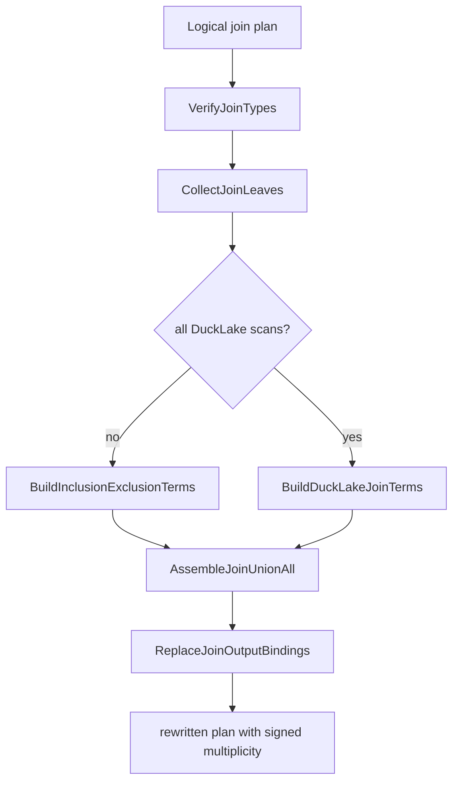
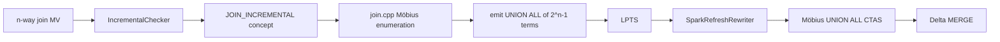
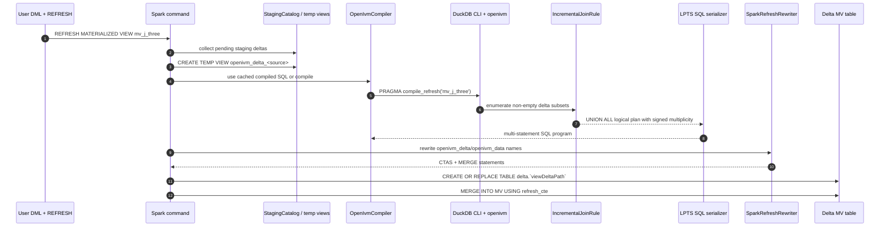

# Möbius-signed multi-way joins

TL;DR: multi-way joins are the highest-complexity OpenIVM refresh path because a single refresh can touch any non-empty subset of the join inputs. Classical delta joins over old base tables produce all-positive terms; OpenIVM uses the algebraically equivalent current-base form, so the term for a subset `S` is multiplied by the Boolean-lattice Möbius sign `(-1)^(|S|-1)`. The C++ rule enumerates those subsets, replaces selected leaves with `openivm_delta_*` scans, appends the signed multiplicity, unions the terms, and lets LPTS plus openivm-spark turn that into Spark CTAS + MERGE SQL.

______________________________________________________________________

## 0. Where this chapter sits

This chapter is about the join branch of the refresh compiler, not the parser or the RocksDB catalog.
The relevant source tree is:

```text
openivm-spark/
├── .temp/openivm/
│   └── src/
│       ├── core/incremental_checker.cpp
│       ├── include/core/openivm_constants.hpp
│       ├── rules/join.cpp
│       └── rules/join_output.cpp
└── spark-ext/
    ├── ivm-common/src/main/scala/org/openivm/spark/common/
    │   ├── SparkRefreshRewriter.scala
    │   ├── StagingDeltaView.scala
    │   └── MergeAssembler.scala
    ├── ivm-compiler/src/main/scala/org/openivm/spark/compiler/
    │   ├── OpenIvmCompiler.scala
    │   └── LptsSparkDialect.scala
    ├── ivm-extension/src/main/scala/org/openivm/spark/commands/
    │   └── MaterializedViewCommands.scala
    └── ivm-it/src/test/scala/org/openivm/spark/parity/
        ├── JoinsInnerSpec.scala
        ├── InnerJoinInsertSpec.scala
        ├── JoinsOuterSpec.scala
        ├── SimpleProjectionOuterJoinSpec.scala
        └── FullOuterJoinSpec.scala
```

The term “JOIN_INCREMENTAL” is used here as a conceptual stage in the OpenIVM pipeline: the checker finds a join tree, then `IncrementalJoinRule` rewrites it. The enum exposed to Spark is still a normal refresh type such as `AGGREGATE_GROUP`, `SIMPLE_PROJECTION`, or `GROUP_RECOMPUTE`; openivm-spark mirrors those ordinal codes in `RefreshTypeCode` rather than defining a separate join ordinal (`spark-ext/ivm-common/src/main/scala/org/openivm/spark/common/RefreshTypeCode.scala:3-18`).

The core facts to keep in mind:

| layer                  | join responsibility                                                        | citation                                                                                                    |
| ---------------------- | -------------------------------------------------------------------------- | ----------------------------------------------------------------------------------------------------------- |
| Incremental checker    | detects join nodes and records join flavor flags                           | `.temp/openivm/src/core/incremental_checker.cpp:181-213`                                                    |
| OpenIVM rule           | enumerates Möbius subsets and rewrites the logical join plan               | `.temp/openivm/src/rules/join.cpp:663-928`                                                                  |
| OpenIVM output helper  | stacks term plans using `LogicalSetOperation(... LOGICAL_UNION, true)`     | `.temp/openivm/src/rules/join_output.cpp:11-39`                                                             |
| Spark compiler bridge  | invokes DuckDB CLI `PRAGMA compile_refresh` with target dialect `spark`    | `spark-ext/ivm-compiler/src/main/scala/org/openivm/spark/compiler/OpenIvmCompiler.scala:149-196`            |
| Spark refresh rewriter | converts OpenIVM's `INSERT INTO openivm_delta_<view>` into a Delta CTAS    | `spark-ext/ivm-common/src/main/scala/org/openivm/spark/common/SparkRefreshRewriter.scala:408-419`           |
| Spark executor command | registers source delta temp views, rewrites, logs, and executes statements | `spark-ext/ivm-extension/src/main/scala/org/openivm/spark/commands/MaterializedViewCommands.scala:962-1004` |

______________________________________________________________________

## 1. The classical two-way join delta

Start with the textbook old-base view:

```sql
V = R ⋈ S
```

Let `R` and `S` mean the pre-refresh base relations and let $\Delta R$, $\Delta S$ be the pending changes.
The post-refresh view is:

```text
V_new = (R + ΔR) ⋈ (S + ΔS)
```

The delta is:

```text
V' = (R + ΔR) ⋈ (S + ΔS) - R ⋈ S
   = R⋈ΔS + ΔR⋈S + ΔR⋈ΔS
```

This is the familiar binomial expansion.
Every term is positive because the unchanged sides are old bases.
No inclusion-exclusion is needed.

| Subset `{R,S}`         | Sign | Term                        |
| ---------------------- | ---: | --------------------------- |
| ${\Delta R}$           |  `+` | $\Delta R \bowtie S$        |
| ${\Delta S}$           |  `+` | $R \bowtie \Delta S$        |
| ${\Delta R, \Delta S}$ |  `+` | $\Delta R \bowtie \Delta S$ |

A tiny bag example makes the all-positive result intuitive:

| tuple source                          | joined row count contribution |
| ------------------------------------- | ----------------------------: |
| old `R` joined with inserted `S`      |                           `+` |
| inserted `R` joined with old `S`      |                           `+` |
| inserted `R` joined with inserted `S` |                           `+` |

If both sides receive inserts that match each other, the new joined row did not exist before the refresh.
It must be added exactly once, so the $\Delta R\bowtie \Delta S$ term is positive.

### 1.1 The OpenIVM twist: current bases, not old bases

OpenIVM's C++ comments explicitly call out why its compiled rule has signs.
At refresh time, the source scan sees the current base table, because the DML has already been applied to the source table before the view refresh runs.
The comment says the scan reads $R_{now} = R_{old} + \Delta R$, and therefore the join delta must use an inclusion-exclusion form (`.temp/openivm/src/rules/join.cpp:873-884`).

For two inputs, write the current bases as `R` and `S`.
Then old bases are $R - \Delta R$ and $S - \Delta S$.
The view delta is:

```text
V' = R⋈S - (R - ΔR)⋈(S - ΔS)
   = R⋈S - (R⋈S - ΔR⋈S - R⋈ΔS + ΔR⋈ΔS)
   = ΔR⋈S + R⋈ΔS - ΔR⋈ΔS
```

That final negative term is not a contradiction of the classical formula.
It corrects for the fact that `R` and `S` in the OpenIVM formula already include pending rows.
The singleton terms $\Delta R\bowtie S$ and $R\bowtie \Delta S$ both see the newly inserted cross-pair, so the pair term subtracts one copy.

| Convention                | unchanged side means | sign of $\Delta R\bowtie \Delta S$ |
| ------------------------- | -------------------- | ---------------------------------: |
| textbook delta join       | old base             |                                `+` |
| OpenIVM current-base join | current base         |                                `-` |

The source code encodes this as `(-1)^(k-1)` where `k` is the number of delta-side leaves in the term (`.temp/openivm/src/rules/join.cpp:873-891`).

______________________________________________________________________

## 2. The three-way join: seven terms

Now consider:

```sql
V = R ⋈ S ⋈ T
```

There are `2^3 - 1 = 7` non-empty choices of delta-side leaves.
Using OpenIVM's current-base convention, subsets of odd size have positive sign and subsets of even size have negative sign.

| Subset `{R,S,T}` | `|S|` | Sign | Term |
|\---|---:|---:|---|
| ${\Delta R}$ | 1 | `+` | $\Delta R \bowtie S \bowtie T$ |
| ${\Delta S}$ | 1 | `+` | $R \bowtie \Delta S \bowtie T$ |
| ${\Delta T}$ | 1 | `+` | $R \bowtie S \bowtie \Delta T$ |
| ${\Delta R, \Delta S}$ | 2 | `-` | $\Delta R \bowtie \Delta S \bowtie T$ |
| ${\Delta R, \Delta T}$ | 2 | `-` | $\Delta R \bowtie S \bowtie \Delta T$ |
| ${\Delta S, \Delta T}$ | 2 | `-` | $R \bowtie \Delta S \bowtie \Delta T$ |
| ${\Delta R, \Delta S, \Delta T}$ | 3 | `+` | $\Delta R \bowtie \Delta S \bowtie \Delta T$ |

This is the first case where the term count is high enough to matter in Spark.
A 3-way join refresh can compile into seven joined SELECT blocks before aggregation and upsert.
The parity spec calls this out explicitly: `JoinsInnerSpec` names its 3-way aggregate test “7 Möbius terms” (`spark-ext/ivm-it/src/test/scala/org/openivm/spark/parity/JoinsInnerSpec.scala:146-147`) and then inserts on all three sides to exercise that path (`spark-ext/ivm-it/src/test/scala/org/openivm/spark/parity/JoinsInnerSpec.scala:168-172`).

The `InnerJoinInsertSpec` also labels a 3-table inner join as `2^3-1 = 7 Möbius terms` (`spark-ext/ivm-it/src/test/scala/org/openivm/spark/parity/InnerJoinInsertSpec.scala:91-99`).
That spec is projection-oriented, while `JoinsInnerSpec` uses an aggregate on top of the join.
Together they cover the two Spark shapes most readers will see: signed projection deltas and signed aggregate deltas.

______________________________________________________________________

## 3. General n-way Möbius formula

For `n` inputs, let `R_i` denote the current base relation for input `i`.
Let $\Delta R_i$ denote the pending signed delta relation for that input.
For every non-empty subset $S \subseteq {1..n}$, choose delta scans for inputs in `S` and current base scans for inputs outside `S`.
Then:

```text
V' = SUM over non-empty subsets S of {1..n}
       [ sign(S) * ( ⋈_{i in S} ΔR_i ) ⋈ ( ⋈_{j not in S} R_j ) ]

sign(S) = (-1)^(|S|-1)
```

This is the Möbius function on the Boolean lattice, restricted to non-empty subsets.
The sign is the inclusion-exclusion coefficient that converts current-base scans into an old-to-new delta.
The code comment calls it a “Z-set bilinear product times a Möbius inclusion-exclusion sign” (`.temp/openivm/src/rules/join.cpp:873-875`).

| subset size `k` | Boolean-lattice coefficient | OpenIVM effect                             |
| --------------: | --------------------------: | ------------------------------------------ |
|               1 |                        `+1` | add singleton-delta joins                  |
|               2 |                        `-1` | remove double-counted current-base overlap |
|               3 |                        `+1` | add back triple overlap                    |
|               4 |                        `-1` | remove quadruple overlap                   |
|               5 |                        `+1` | add back five-way overlap                  |

The multiplicity is not only the Möbius sign.
Each delta row already carries an `openivm_multiplicity` of `+1` or `-1`, and upstream MV deltas can carry arbitrary signed bag weights.
OpenIVM multiplies all delta-side multiplicities, then applies the Möbius sign (`.temp/openivm/src/rules/join.cpp:892-917`).
The Spark source-delta temp view preserves or synthesizes those multiplicities: base inserts use `+1`, deletes use `-1`, and MV-over-MV deltas preserve the upstream column verbatim (`spark-ext/ivm-common/src/main/scala/org/openivm/spark/common/StagingDeltaView.scala:5-18`, `spark-ext/ivm-common/src/main/scala/org/openivm/spark/common/StagingDeltaView.scala:65-84`).

______________________________________________________________________

## 4. Why the formula is inclusion-exclusion

The cleanest derivation is to start from current bases.
Let `R_i` be current.
Then old input `i` is $R_i - \Delta R_i$.
For an `n`-way join:

```text
V' = R_1⋈...⋈R_n - (R_1-ΔR_1)⋈...⋈(R_n-ΔR_n)
```

Expand the second product.
A term with exactly `k` deltas has coefficient `(-1)^k` inside the old-product expansion.
Because the whole old product is subtracted, the coefficient in `V'` becomes:

```text
- (-1)^k = (-1)^(k-1)
```

The all-base term has `k=0` and cancels with the leading $R_1\bowtie ...\bowtie R_n$.
That is why the sum is restricted to non-empty subsets.

### 4.1 Concrete n=4 expansion

Let the four current bases be `R`, `S`, `T`, and `U`.
Then:

```text
V' = R⋈S⋈T⋈U - (R-ΔR)⋈(S-ΔS)⋈(T-ΔT)⋈(U-ΔU)
```

The old-product expansion contains sixteen terms.
The all-current term cancels.
The remaining fifteen terms are:

| subset size | sign | number of terms | terms                                                                                                                                                |
| ----------: | ---: | --------------: | ---------------------------------------------------------------------------------------------------------------------------------------------------- |
|           1 |  `+` |               4 | $\Delta R S T U$, $R \Delta S T U$, $R S \Delta T U$, $R S T \Delta U$                                                                               |
|           2 |  `-` |               6 | $\Delta R \Delta S T U$, $\Delta R S \Delta T U$, $\Delta R S T \Delta U$, $R \Delta S \Delta T U$, $R \Delta S T \Delta U$, $R S \Delta T \Delta U$ |
|           3 |  `+` |               4 | $\Delta R \Delta S \Delta T U$, $\Delta R \Delta S T \Delta U$, $\Delta R S \Delta T \Delta U$, $R \Delta S \Delta T \Delta U$                       |
|           4 |  `-` |               1 | $\Delta R \Delta S \Delta T \Delta U$                                                                                                                |

Here juxtaposition means “joined with the original join predicates preserved.”
For `n=4`, OpenIVM may therefore emit fifteen join blocks before aggregation.
The max supported join leaf count in the native rule is sixteen, guarded by `MAX_JOIN_TABLES` (`.temp/openivm/src/include/core/openivm_constants.hpp:59-60`) and checked before rewrite (`.temp/openivm/src/rules/join.cpp:943-955`).

______________________________________________________________________

## 5. Native OpenIVM implementation

The core rewrite function starts by resolving output types, verifying supported joins, collecting leaves, and counting `N` (`.temp/openivm/src/rules/join.cpp:931-960`).
Then it chooses the regular inclusion-exclusion builder unless all leaves are DuckLake scans and the DuckLake N-term path is enabled (`.temp/openivm/src/rules/join.cpp:962-978`).
Finally it unions the term plans and rebinds parent references (`.temp/openivm/src/rules/join.cpp:980-988`).



### 5.1 Subset enumeration by bitmask

The inclusion-exclusion builder declares that it creates `2^N - 1` delta terms (`.temp/openivm/src/rules/join.cpp:663-669`).
It computes:

```cpp
uint64_t total_terms = (1ULL << N) - 1;
```

and then iterates every non-zero mask:

```cpp
for (uint64_t mask = 1; mask < (1ULL << N); mask++) {
  ...
}
```

The relevant lines are `.temp/openivm/src/rules/join.cpp:676-677` and `.temp/openivm/src/rules/join.cpp:760-764`.
A bit set at position `i` means “replace leaf `i` with its delta plan.”
A bit not set means “keep the current-base scan.”

For a 3-way join, the masks are:

| binary mask | decimal | selected leaves                  | sign |
| ----------- | ------: | -------------------------------- | ---: |
| `001`       |       1 | ${\Delta R}$                     |  `+` |
| `010`       |       2 | ${\Delta S}$                     |  `+` |
| `011`       |       3 | ${\Delta R, \Delta S}$           |  `-` |
| `100`       |       4 | ${\Delta T}$                     |  `+` |
| `101`       |       5 | ${\Delta R, \Delta T}$           |  `-` |
| `110`       |       6 | ${\Delta S, \Delta T}$           |  `-` |
| `111`       |       7 | ${\Delta R, \Delta S, \Delta T}$ |  `+` |

### 5.2 Pruning before term construction

OpenIVM does not blindly build every mask in every runtime configuration.
Before the loop, it detects delta status for each leaf, including total pending rows, delete rows, base cardinality, and a “tiny delta” flag (`.temp/openivm/src/rules/join.cpp:481-578`).
It then computes FK pruning and empty-delta behavior (`.temp/openivm/src/rules/join.cpp:680-702`).

Inside the mask loop:

| pruning gate              | source lines                               | effect                                                     |
| ------------------------- | ------------------------------------------ | ---------------------------------------------------------- |
| FK insert-only PK pruning | `.temp/openivm/src/rules/join.cpp:765-772` | skip masks whose selected PK delta cancels algebraically   |
| empty delta skipping      | `.temp/openivm/src/rules/join.cpp:773-779` | skip any term that joins against a known-empty delta input |
| key-domain probe          | `.temp/openivm/src/rules/join.cpp:780-812` | skip if delta join keys cannot match the other side        |

The FK rule is documented with the cancellation proof in code comments: terms with the inserted PK leaf cancel because old FK rows cannot reference newly inserted PKs (`.temp/openivm/src/rules/join.cpp:642-653`).
Key-domain probes build small `EXISTS` joins over delta keys against base or delta keys (`.temp/openivm/src/rules/join.cpp:129-171`).

For openivm-spark, one subtle line matters: if `openivm_compile_only=true`, empty-delta skipping only treats constant leaves as empty, not ordinary Spark source tables (`.temp/openivm/src/rules/join.cpp:695-702`).
The Spark compiler bridge sets `openivm_compile_only=true` while compiling (`spark-ext/ivm-compiler/src/main/scala/org/openivm/spark/compiler/OpenIvmCompiler.scala:149-159`).
That means Spark usually receives a stable SQL shape; per-refresh empty Spark staging views produce zero rows at execution time rather than changing the compiled branch count.

### 5.3 Per-term plan construction

For each surviving mask, OpenIVM copies the whole logical plan, renumbers bindings, and tracks the multiplicity bindings from each delta-side leaf (`.temp/openivm/src/rules/join.cpp:814-819`).
If the term contains an outer join, it may demote only the affected outer join nodes to inner joins for that mask (`.temp/openivm/src/rules/join.cpp:820-835`).
Then it walks every leaf:

| mask bit                     | action                                                                | citation                                   |
| ---------------------------- | --------------------------------------------------------------------- | ------------------------------------------ |
| unset                        | leave the copied current-base scan alone                              | `.temp/openivm/src/rules/join.cpp:837-852` |
| set and leaf is a table scan | create a delta get node and record its multiplicity binding           | `.temp/openivm/src/rules/join.cpp:837-843` |
| set and leaf is a subtree    | recursively rewrite that subtree and record its multiplicity binding  | `.temp/openivm/src/rules/join.cpp:844-849` |
| set                          | update parent projection maps so the new multiplicity column flows up | `.temp/openivm/src/rules/join.cpp:850-852` |

After substitution, the rule filters out internal multiplicity columns from the visible payload and appends one final combined multiplicity expression (`.temp/openivm/src/rules/join.cpp:856-872`).
That final column is the signed Z-set weight used by downstream aggregate or projection rules.

### 5.4 Sign computation

The C++ implementation computes the product of the selected delta multiplicity columns first:

```cpp
unique_ptr<Expression> product = make_uniq<BoundColumnRefExpression>(pw.mul_type, mul_bindings[0]);
for (size_t i = 1; i < mul_bindings.size(); i++) {
  product = product * mul_bindings[i];
}
```

Then it applies the Möbius sign:

```cpp
if (mul_bindings.size() % 2 == 0) {
  product = -1 * product;
}
```

Those are the concrete lines `.temp/openivm/src/rules/join.cpp:892-917`.
The comment right above the code spells out the parity table for `k=1..4`: no flip for `k=1`, flip for `k=2`, no flip for `k=3`, flip for `k=4` (`.temp/openivm/src/rules/join.cpp:886-891`).

The prompt mentions `__builtin_popcount(mask) & 1` as a common implementation.
This code uses the equivalent term-local count: `mul_bindings.size()` equals the mask popcount after replacement.

### 5.5 UNION ALL composition

The built term plans are appended to `terms` (`.temp/openivm/src/rules/join.cpp:919-923`).
The caller then invokes:

```cpp
auto result = AssembleJoinUnionAll(terms, types, binder);
```

at `.temp/openivm/src/rules/join.cpp:980-981`.
`AssembleJoinUnionAll` folds the vector into `LogicalSetOperation(... LOGICAL_UNION, true)`, where `true` is the all-preserving UNION ALL flag (`.temp/openivm/src/rules/join_output.cpp:23-29`).
It adds a cleanup projection over the union result so downstream bindings are normalized (`.temp/openivm/src/rules/join_output.cpp:31-39`).

______________________________________________________________________

## 6. Emitted SQL shape

After the logical rewrite, LPTS serializes the plan as SQL.
The emitted shape is a `UNION ALL` of `2^n - 1` join blocks, each producing the same payload columns plus a signed multiplicity column.
For an aggregate MV, those signed rows are then grouped into per-key aggregate deltas before the MERGE.
For a projection MV, the signed rows drive insertions and retractions.

A simplified 3-way current-base join delta looks like:

```sql
WITH join_delta AS (
  SELECT a.k, c.descr, b.v,  +1 * da.openivm_multiplicity AS openivm_multiplicity
  FROM openivm_delta_j_three_a da
  JOIN j_three_b b ON da.k = b.k
  JOIN j_three_c c ON b.j = c.j

  UNION ALL
  SELECT a.k, c.descr, db.v, +1 * db.openivm_multiplicity AS openivm_multiplicity
  FROM j_three_a a
  JOIN openivm_delta_j_three_b db ON a.k = db.k
  JOIN j_three_c c ON db.j = c.j

  UNION ALL
  SELECT a.k, dc.descr, b.v, +1 * dc.openivm_multiplicity AS openivm_multiplicity
  FROM j_three_a a
  JOIN j_three_b b ON a.k = b.k
  JOIN openivm_delta_j_three_c dc ON b.j = dc.j

  UNION ALL
  SELECT da.k, c.descr, db.v, -1 * da.openivm_multiplicity * db.openivm_multiplicity
  FROM openivm_delta_j_three_a da
  JOIN openivm_delta_j_three_b db ON da.k = db.k
  JOIN j_three_c c ON db.j = c.j

  -- three more pair/triple branches omitted here; see section 10 for all seven
)
SELECT k,
       descr,
       SUM(openivm_multiplicity * v) AS total_delta,
       SUM(openivm_multiplicity) AS count_delta
FROM join_delta
GROUP BY k, descr;
```

The actual LPTS aliases are mechanical and not stable enough to document as an API.
The stable contract is the shape: `UNION ALL` branches, a signed multiplicity, an `INSERT INTO openivm_delta_<view>`, and then a MERGE into `openivm_data_<view>`.
`SparkRefreshRewriter` documents the AGGREGATE_GROUP program as a multi-statement flow where statement B inserts into `openivm_delta_<view>` and statement C merges that delta into `openivm_data_<view>` (`spark-ext/ivm-common/src/main/scala/org/openivm/spark/common/SparkRefreshRewriter.scala:13-45`).

On Spark, statement B is rewritten from an insert into an internal DuckDB table into a per-refresh Delta CTAS (`spark-ext/ivm-common/src/main/scala/org/openivm/spark/common/SparkRefreshRewriter.scala:500-547`).
Statement C replaces `openivm_delta_<view>` with that Delta path and `openivm_data_<view>` with the Spark MV table (`spark-ext/ivm-common/src/main/scala/org/openivm/spark/common/SparkRefreshRewriter.scala:691-739`).

______________________________________________________________________

## 7. Outer join handling

Outer joins are not fully linear in the same way as inner joins because unmatched rows are null-padded.
OpenIVM handles them by tracking which leaves are on null-supplying sides and by demoting affected outer join nodes to inner joins inside the current Möbius term.

The checker marks supported join types and records left/right/full-outer flags (`.temp/openivm/src/core/incremental_checker.cpp:181-213`).
The join rule also verifies accepted join types: inner, left, right, full outer, and several semi/anti/mark variants are accepted, while other join types throw an optimizer exception (`.temp/openivm/src/rules/join.cpp:349-371`).

Leaf collection records whether a leaf is on a null-supplying side of a left, right, or full outer join (`.temp/openivm/src/rules/join.cpp:205-231`).
The demotion rule is mask-specific:

| join type         | null-supplying side | demote to inner when                            | citation                                   |
| ----------------- | ------------------- | ----------------------------------------------- | ------------------------------------------ |
| `LEFT JOIN`       | right side          | the right subtree has a delta leaf in this mask | `.temp/openivm/src/rules/join.cpp:394-431` |
| `RIGHT JOIN`      | left side           | the left subtree has a delta leaf in this mask  | `.temp/openivm/src/rules/join.cpp:394-433` |
| `FULL OUTER JOIN` | both sides          | either subtree has a delta leaf in this mask    | `.temp/openivm/src/rules/join.cpp:394-439` |

The comments explain why the rule is per-join-node rather than global.
In a chain like `(base LEFT JOIN d1) LEFT JOIN d2`, globally demoting every left join when only `d2` changes would drop rows that must remain visible for the partial recompute (`.temp/openivm/src/rules/join.cpp:820-835`).

Spark parity coverage includes:

| Spark spec                      | join flavor                 | what it validates                                                                                                                                                           |
| ------------------------------- | --------------------------- | --------------------------------------------------------------------------------------------------------------------------------------------------------------------------- |
| `SimpleProjectionOuterJoinSpec` | left join                   | incremental partial recompute for unmatched and matched transitions (`spark-ext/ivm-it/src/test/scala/org/openivm/spark/parity/SimpleProjectionOuterJoinSpec.scala:77-110`) |
| `SimpleProjectionOuterJoinSpec` | full outer join             | bidirectional partial recompute for both null-padded sides (`spark-ext/ivm-it/src/test/scala/org/openivm/spark/parity/SimpleProjectionOuterJoinSpec.scala:149-187`)         |
| `JoinsOuterSpec`                | full outer projection       | unmatched rows from both sides (`spark-ext/ivm-it/src/test/scala/org/openivm/spark/parity/JoinsOuterSpec.scala:217-255`)                                                    |
| `JoinsOuterSpec`                | full outer aggregate        | Zhang & Larson-style MERGE or group-recompute path (`spark-ext/ivm-it/src/test/scala/org/openivm/spark/parity/JoinsOuterSpec.scala:258-297`)                                |
| `FullOuterJoinSpec`             | full outer regression suite | matched/unmatched, null keys, cancellation, and transition matrix coverage (`spark-ext/ivm-it/src/test/scala/org/openivm/spark/parity/FullOuterJoinSpec.scala:12-35`)       |

The important mental model is: the same Möbius subset enumeration still exists, but each term may have a slightly different join tree because null-padding must be suppressed when the changed side supplies the would-be match.

______________________________________________________________________

## 8. Optimizations and Spark assembler behavior

### 8.1 Mostly empty deltas

The best case for incremental joins is the common warehouse pattern: one small fact delta joins against large dimension tables, or one small dimension delta joins against facts.
OpenIVM has three native optimizations for this:

1. Empty-delta skipping: any term that includes a known-empty delta leaf is zero (`.temp/openivm/src/rules/join.cpp:695-702`, `.temp/openivm/src/rules/join.cpp:773-779`).
1. FK pruning: insert-only primary-key dimension deltas can cancel entire families of terms (`.temp/openivm/src/rules/join.cpp:642-660`, `.temp/openivm/src/rules/join.cpp:680-693`).
1. Key-domain probes: if delta keys cannot match the other side, the term is skipped before the full join is built (`.temp/openivm/src/rules/join.cpp:704-717`, `.temp/openivm/src/rules/join.cpp:780-812`).

The `tiny_mask` threshold is deliberately data-dependent: a non-empty delta is considered tiny when it has at most `max(8, 5% of base_count)` rows (`.temp/openivm/src/rules/join.cpp:538-570`).
That allows key-domain probes to remain enabled for cheap multi-source changes.

### 8.2 What openivm-spark does at the assembler level

There is no dedicated Scala `JoinAssembler` class in `spark-ext`.
The join-specific assembly happens in native OpenIVM before LPTS, and the Spark incremental path receives ordinary SQL that is rewritten statement-by-statement.
For aggregate joins, native OpenIVM emits a `WITH refresh_cte AS (...) MERGE INTO openivm_data_<view>` statement with per-aggregate update expressions and insert values (`.temp/openivm/src/upsert/refresh_compiler.cpp:430-444`, `.temp/openivm/src/upsert/refresh_compiler.cpp:613-624`).
openivm-spark then rewrites the internal `openivm_delta_<view>` and `openivm_data_<view>` names to the per-refresh Delta path and Spark MV identifier (`spark-ext/ivm-common/src/main/scala/org/openivm/spark/common/SparkRefreshRewriter.scala:691-739`).
The generic Scala `MergeAssembler` still exists as an assembler abstraction for CTE-form merge patterns, but it is not a join-specific cardinality optimizer (`spark-ext/ivm-common/src/main/scala/org/openivm/spark/common/MergeAssembler.scala:3-16`, `spark-ext/ivm-common/src/main/scala/org/openivm/spark/common/MergeAssembler.scala:36-47`).

Spark does perform coarse refresh skips:

| Spark-side behavior                                                      | citation                                                                                                                                                                                                   | meaning                                                         |
| ------------------------------------------------------------------------ | ---------------------------------------------------------------------------------------------------------------------------------------------------------------------------------------------------------- | --------------------------------------------------------------- |
| skip the whole refresh when no source has pending deltas                 | `spark-ext/ivm-extension/src/main/scala/org/openivm/spark/commands/MaterializedViewCommands.scala:796-805`                                                                                                 | avoids even compiling/executing a no-op incremental refresh     |
| create an empty `openivm_delta_<source>` temp view for unchanged sources | `spark-ext/ivm-extension/src/main/scala/org/openivm/spark/commands/MaterializedViewCommands.scala:962-970` and `spark-ext/ivm-common/src/main/scala/org/openivm/spark/common/StagingDeltaView.scala:31-35` | branch SQL can reference every source delta name safely         |
| materialize empty delta views with correct schema and zero rows          | `spark-ext/ivm-common/src/main/scala/org/openivm/spark/common/StagingDeltaView.scala:92-100`                                                                                                               | join branches involving that delta naturally return no rows     |
| skip the SIMPLE_PROJECTION delete MERGE when there are no negative rows  | `spark-ext/ivm-extension/src/main/scala/org/openivm/spark/commands/MaterializedViewCommands.scala:1014-1089`                                                                                               | not join-specific, but relevant for signed projection refreshes |

So, if one of three sources changes, openivm-spark generally still executes a compiled CTAS that contains multiple branches, but branches that read empty `openivm_delta_*` temp views produce zero rows.
That is a runtime data effect, not a Scala-level branch-elimination rewrite.

______________________________________________________________________

## 9. Spark concrete sample: `mv_j_three`

The best compact example is the 3-way aggregate in `JoinsInnerSpec`.
The spec creates three Delta tables (`j_three_a`, `j_three_b`, `j_three_c`) and populates them (`spark-ext/ivm-it/src/test/scala/org/openivm/spark/parity/JoinsInnerSpec.scala:148-154`).
Then it creates this MV (`spark-ext/ivm-it/src/test/scala/org/openivm/spark/parity/JoinsInnerSpec.scala:156-163`):

```sql
CREATE MATERIALIZED VIEW mv_j_three AS
SELECT a.k, c.descr, SUM(b.v) AS total
FROM j_three_a a
JOIN j_three_b b ON a.k = b.k
JOIN j_three_c c ON b.j = c.j
GROUP BY a.k, c.descr;
```

The spec accepts `AGGREGATE_GROUP` or `GROUP_RECOMPUTE` as the effective refresh type (`spark-ext/ivm-it/src/test/scala/org/openivm/spark/parity/JoinsInnerSpec.scala:165-166`).
For the Möbius path, the join delta feeding the aggregate has seven branches.
Using `A`, `B`, and `C` as current bases and $\Delta A$, $\Delta B$, and $\Delta C$ as Spark temp views, the terms are:

|   # | subset                         | sign | SQL skeleton                                                                             |
| --: | ------------------------------ | ---: | ---------------------------------------------------------------------------------------- |
|   1 | ${\Delta A}$                   |  `+` | $\Delta A JOIN B ON \Delta A.k=B.k JOIN C ON B.j=C.j$                                    |
|   2 | ${\Delta B}$                   |  `+` | $A JOIN \Delta B ON A.k=\Delta B.k JOIN C ON \Delta B.j=C.j$                             |
|   3 | ${\Delta C}$                   |  `+` | $A JOIN B ON A.k=B.k JOIN \Delta C ON B.j=\Delta C.j$                                    |
|   4 | ${\Delta A,\Delta B}$          |  `-` | $\Delta A JOIN \Delta B ON \Delta A.k=\Delta B.k JOIN C ON \Delta B.j=C.j$               |
|   5 | ${\Delta A,\Delta C}$          |  `-` | $\Delta A JOIN B ON \Delta A.k=B.k JOIN \Delta C ON B.j=\Delta C.j$                      |
|   6 | ${\Delta B,\Delta C}$          |  `-` | $A JOIN \Delta B ON A.k=\Delta B.k JOIN \Delta C ON \Delta B.j=\Delta C.j$               |
|   7 | ${\Delta A,\Delta B,\Delta C}$ |  `+` | $\Delta A JOIN \Delta B ON \Delta A.k=\Delta B.k JOIN \Delta C ON \Delta B.j=\Delta C.j$ |

A readability-normalized Spark CTAS for the view delta looks like this.
Real LPTS aliases will differ, but the CTAS target, branch count, signs, and merge flow are the stable emitted shape described by `SparkRefreshRewriter` (`spark-ext/ivm-common/src/main/scala/org/openivm/spark/common/SparkRefreshRewriter.scala:500-547`, `spark-ext/ivm-common/src/main/scala/org/openivm/spark/common/SparkRefreshRewriter.scala:691-739`).

```sql
CREATE OR REPLACE TABLE delta.`<warehouse>/_ivm/view_deltas/default_mv_j_three/<uuid>` USING DELTA AS
WITH mobius_rows AS (
  SELECT da.k, c.descr, b.v,
         da.openivm_multiplicity AS openivm_multiplicity
  FROM openivm_delta_j_three_a da
  JOIN j_three_b b ON da.k = b.k
  JOIN j_three_c c ON b.j = c.j

  UNION ALL
  SELECT a.k, c.descr, db.v,
         db.openivm_multiplicity AS openivm_multiplicity
  FROM j_three_a a
  JOIN openivm_delta_j_three_b db ON a.k = db.k
  JOIN j_three_c c ON db.j = c.j

  UNION ALL
  SELECT a.k, dc.descr, b.v,
         dc.openivm_multiplicity AS openivm_multiplicity
  FROM j_three_a a
  JOIN j_three_b b ON a.k = b.k
  JOIN openivm_delta_j_three_c dc ON b.j = dc.j

  UNION ALL
  SELECT da.k, c.descr, db.v,
         -1 * da.openivm_multiplicity * db.openivm_multiplicity AS openivm_multiplicity
  FROM openivm_delta_j_three_a da
  JOIN openivm_delta_j_three_b db ON da.k = db.k
  JOIN j_three_c c ON db.j = c.j

  UNION ALL
  SELECT da.k, dc.descr, b.v,
         -1 * da.openivm_multiplicity * dc.openivm_multiplicity AS openivm_multiplicity
  FROM openivm_delta_j_three_a da
  JOIN j_three_b b ON da.k = b.k
  JOIN openivm_delta_j_three_c dc ON b.j = dc.j

  UNION ALL
  SELECT a.k, dc.descr, db.v,
         -1 * db.openivm_multiplicity * dc.openivm_multiplicity AS openivm_multiplicity
  FROM j_three_a a
  JOIN openivm_delta_j_three_b db ON a.k = db.k
  JOIN openivm_delta_j_three_c dc ON db.j = dc.j

  UNION ALL
  SELECT da.k, dc.descr, db.v,
         da.openivm_multiplicity * db.openivm_multiplicity * dc.openivm_multiplicity AS openivm_multiplicity
  FROM openivm_delta_j_three_a da
  JOIN openivm_delta_j_three_b db ON da.k = db.k
  JOIN openivm_delta_j_three_c dc ON db.j = dc.j
), refresh_cte AS (
  SELECT k,
         descr,
         SUM(openivm_multiplicity * v) AS total,
         SUM(openivm_multiplicity) AS openivm_count_star,
         1 AS openivm_multiplicity,
         current_timestamp() AS openivm_timestamp
  FROM mobius_rows
  GROUP BY k, descr
)
SELECT * FROM refresh_cte;
```

Then the Spark-side MERGE reads the CTAS path.
Again, this is shape-preserving and normalized for readability; the real emitted statement is whatever OpenIVM/LPTS produced after `rewriteMvMerge` replaces internal table names (`spark-ext/ivm-common/src/main/scala/org/openivm/spark/common/SparkRefreshRewriter.scala:691-739`).

```sql
WITH refresh_cte AS (
  SELECT k,
         descr,
         SUM(total) AS total,
         SUM(openivm_count_star) AS openivm_count_star
  FROM delta.`<warehouse>/_ivm/view_deltas/default_mv_j_three/<uuid>`
  GROUP BY k, descr
)
MERGE INTO `mv_j_three` AS v
USING refresh_cte AS d
ON v.`k` <=> d.`k` AND v.`descr` <=> d.`descr`
WHEN MATCHED THEN UPDATE SET
  `total` = COALESCE(v.`total`, 0) + d.`total`,
  `openivm_count_star` = COALESCE(v.`openivm_count_star`, 0) + d.`openivm_count_star`
WHEN NOT MATCHED THEN INSERT (`k`, `descr`, `total`, `openivm_count_star`)
VALUES (d.`k`, d.`descr`, d.`total`, d.`openivm_count_star`);
```

After executing the rewritten statements, `MaterializedViewCommands` records the per-refresh view delta for downstream MV-over-MV consumers when the refresh type supports cascade deltas (`spark-ext/ivm-extension/src/main/scala/org/openivm/spark/commands/MaterializedViewCommands.scala:1107-1155`).
It then performs post-refresh cleanup and advances the MV watermark (`spark-ext/ivm-extension/src/main/scala/org/openivm/spark/commands/MaterializedViewCommands.scala:1171-1178`).

______________________________________________________________________

## 10. End-to-end flow

The requested flow is:



Expanded with the actual Spark bridge components:



The compile bridge uses a fresh DuckDB CLI process per compile and sets `openivm_target_dialect='spark'` before running `PRAGMA compile_refresh` (`spark-ext/ivm-compiler/src/main/scala/org/openivm/spark/compiler/OpenIvmCompiler.scala:40-49`, `spark-ext/ivm-compiler/src/main/scala/org/openivm/spark/compiler/OpenIvmCompiler.scala:149-196`).
The dialect post-processor then fixes DuckDB/LPTS syntax leaks such as double-quoted identifiers, `generate_series`, postfix casts, and intervals (`spark-ext/ivm-compiler/src/main/scala/org/openivm/spark/compiler/LptsSparkDialect.scala:3-10`, `spark-ext/ivm-compiler/src/main/scala/org/openivm/spark/compiler/LptsSparkDialect.scala:94-131`).

______________________________________________________________________

## 11. Performance footnote

Möbius joins have exponential branch count:

| join inputs `n` | terms `2^n - 1` | practical interpretation                                                  |
| --------------: | --------------: | ------------------------------------------------------------------------- |
|               2 |               3 | cheap; classical join delta scale                                         |
|               3 |               7 | common and well-covered by parity specs                                   |
|               4 |              15 | practical when deltas are small or pruning fires                          |
|               5 |              31 | watch CTAS planning time and shuffle cost                                 |
|               6 |              63 | usually needs consolidation, pruning, or a different maintenance strategy |

The native limit is much higher (`MAX_JOIN_TABLES = 16`), but the practical Spark threshold is lower because each term is a join block and Spark still has to optimize the generated SQL (`.temp/openivm/src/include/core/openivm_constants.hpp:59-60`, `.temp/openivm/src/rules/join.cpp:943-955`).
For $n \le 4$, the branch count is usually manageable.
For $n \ge 5$, consider whether the MV can be decomposed into a depth-2 MV chain, whether dimension-table FK pruning applies, or whether delta consolidation should happen before the refresh.

The most important operator-level lesson is not “Möbius is slow.”
It is: “Möbius exposes every changed-subset interaction explicitly.”
When staged deltas are small, multi-delta terms are often tiny.
When many inputs change at once, the generated CTAS can become the dominant refresh cost.

______________________________________________________________________

## 12. Checklist for debugging a multi-way join refresh

Use this checklist when a multi-way join MV looks wrong or unexpectedly slow:

| question                                                                | why it matters                                                     | source                                                                                                                                                                                                                     |
| ----------------------------------------------------------------------- | ------------------------------------------------------------------ | -------------------------------------------------------------------------------------------------------------------------------------------------------------------------------------------------------------------------- |
| Did the MV compile to an incremental type rather than `FULL_REFRESH`?   | join body may contain a Spark-only construct DuckDB cannot compile | `spark-ext/ivm-extension/src/main/scala/org/openivm/spark/commands/MaterializedViewCommands.scala:359-393`                                                                                                                 |
| Are source delta temp views present for every source?                   | LPTS SQL references every `openivm_delta_<source>` name            | `spark-ext/ivm-extension/src/main/scala/org/openivm/spark/commands/MaterializedViewCommands.scala:962-972`                                                                                                                 |
| Does a branch read an empty temp view?                                  | unchanged sources produce zero rows by schema-correct empty views  | `spark-ext/ivm-common/src/main/scala/org/openivm/spark/common/StagingDeltaView.scala:31-35`, `spark-ext/ivm-common/src/main/scala/org/openivm/spark/common/StagingDeltaView.scala:92-100`                                  |
| Are the signs alternating by subset size?                               | sign bugs usually double-count overlap rows                        | `.temp/openivm/src/rules/join.cpp:873-917`                                                                                                                                                                                 |
| Is the join outer?                                                      | mask-specific demotion changes the branch join type                | `.temp/openivm/src/rules/join.cpp:387-451`                                                                                                                                                                                 |
| Did Spark rewrite `openivm_delta_<view>` to the per-refresh Delta path? | the MERGE must read the CTAS output, not a DuckDB table name       | `spark-ext/ivm-common/src/main/scala/org/openivm/spark/common/SparkRefreshRewriter.scala:691-739`                                                                                                                          |
| Did the command log rewritten SQL?                                      | failures include the rewritten statements in the exception         | `spark-ext/ivm-extension/src/main/scala/org/openivm/spark/commands/MaterializedViewCommands.scala:1017-1026`, `spark-ext/ivm-extension/src/main/scala/org/openivm/spark/commands/MaterializedViewCommands.scala:1156-1168` |

______________________________________________________________________

## 13. Takeaways

1. The all-positive two-way formula is correct for old-base delta joins.
1. OpenIVM uses current-base scans, so it needs the Boolean-lattice Möbius sign `(-1)^(|S|-1)`.
1. The C++ join rule enumerates masks from `1` to `(1 << n) - 1`, substitutes delta leaves, multiplies delta multiplicities, flips even-popcount terms, and UNION ALLs the results.
1. Outer joins keep the same subset idea but demote only the null-supplying join nodes affected by the current mask.
1. Spark does not have a separate join assembler; it executes the OpenIVM/LPTS SQL after rewriting internal table names to Delta CTAS paths and MV MERGE targets.
1. The branch count is exponential, so 3-way and 4-way joins are the sweet spot; 5-way and larger joins need careful delta size and plan-shape attention.

Next: see [7-state-storage-rocksdb-and-delta.md](./7-state-storage-rocksdb-and-delta.md) for how the staging rows, MV metadata, and per-refresh view deltas are persisted between DML and REFRESH.
