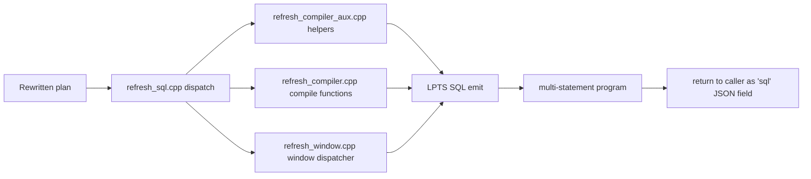

# 7. OpenIVM compile paths per `RefreshType`

> Scope: upstream OpenIVM compile emission under `.temp/openivm/src/upsert/`,
> and the contract consumed by openivm-spark's refresh rewriter.
>
> Cross-links:
>
> - openivm-spark chapter 5: `../openivm-spark/5-lpts-spark-dialect-postprocessor.md`
> - openivm-spark chapter 6: `../openivm-spark/6-refresh-rewriter-and-assemblers.md`
> - Spark side enum mirror: `spark-ext/ivm-common/src/main/scala/org/openivm/spark/common/RefreshTypeCode.scala`

## 1. What this chapter covers

- OpenIVM classifies an MV body into a `RefreshType` at CREATE time.
- `PRAGMA compile_refresh('<view>')` then emits a multi-statement SQL program.
- openivm-spark runs that pragma in a DuckDB CLI subprocess.
- The result row has `refresh_type`, `refresh_type_name`, and `sql` fields.
- The `sql` field is the refresh program, not the user's original query.
- A side file also records the initial-load CTAS used at CREATE time.
- Spark extracts the SELECT body from that side file as `initialLoadSql`.
- `SparkRefreshRewriter` consumes the refresh program statement-by-statement.
- The rewriter is shape-driven: it dispatches on `StatementKind`, not directly on `RefreshType`.

## 2. Directory verification

The requested topic names a set of logical files such as
`compile_simple_projection.cpp` and `full_refresh.cpp`.
Those names are useful as conceptual buckets, but they are not the file names in
this checkout.
Actual files under `.temp/openivm/src/upsert/`, verified in this workspace:

```text
refresh.cpp
refresh_compiler.cpp
refresh_compiler_aux.cpp
refresh_cost_model.cpp
refresh_delta_fast_paths.cpp
refresh_group_measure.cpp
refresh_helpers.cpp
refresh_index_regen.cpp
refresh_sql.cpp
refresh_window.cpp
```

Requested logical file names and their current implementation locations:

| Requested logical file          | Current source location                                                                                                                                           |
| ------------------------------- | ----------------------------------------------------------------------------------------------------------------------------------------------------------------- |
| `compile_simple_projection.cpp` | `refresh_compiler.cpp::CompileProjectionsFilters`, `refresh_helpers.cpp::CompileProjectionRefresh`                                                                |
| `compile_simple_aggregate.cpp`  | `refresh_compiler.cpp::CompileSimpleAggregates`                                                                                                                   |
| `compile_aggregate_groups.cpp`  | `refresh_compiler.cpp::CompileAggregateGroups`                                                                                                                    |
| `compile_aggregate_having.cpp`  | mostly `refresh_compiler.cpp::CompileAggregateGroups`; backed by CREATE-time view wrapping in `core/parser.cpp`                                                   |
| `compile_distinct.cpp`          | `refresh_compiler_aux.cpp::CompileDistinctIncremental`                                                                                                            |
| `compile_join.cpp`              | join deltas are produced before emission by optimizer rewrite and LPTS; grouped/projection joins then use `CompileAggregateGroups` or `CompileProjectionsFilters` |
| `compile_semi_anti.cpp`         | `refresh_compiler_aux.cpp::CompileSemiAntiRecompute`                                                                                                              |
| `compile_window.cpp`            | `refresh_window.cpp::BuildWindowPartitionRefresh`, `refresh_compiler_aux.cpp::CompileWindowRecompute`                                                             |
| `compile_top_k.cpp`             | no active compile file; `TOP_K` is a legacy/dead enum path and ORDER BY/LIMIT is applied by the user-facing view wrapper                                          |
| `refresh_compiler_aux.cpp`      | shared aux emitters: DISTINCT, SEMI/ANTI, filtered group count, window recompute                                                                                  |
| `full_refresh.cpp`              | `refresh_compiler.cpp::CompileFullRecompute`, `refresh_helpers.cpp::BuildRecomputeQuery`, `SqlUtils::BuildFullRecomputeSQL`                                       |

## 3. End-to-end compile flow



Expanded path:

1. openivm-spark builds a DuckDB CLI script.
1. The script loads the OpenIVM extension.
1. It sets `openivm_target_dialect='spark'`.
1. It sets `openivm_compile_only=true`.
1. It registers empty DuckDB source tables matching Spark schemas.
1. It creates a DuckDB materialized view from the Spark MV body.
1. It runs `PRAGMA compile_refresh('<view>')`.
1. `CompileRefreshQuery` calls `GenerateRefreshSQL`.
1. `GenerateRefreshSQL` looks up MV metadata and the CREATE-time `RefreshType`.
1. The dispatcher chooses the compile helper for that type.
1. Non-recompute paths first run `ComputeDelta` through optimizer rules.
1. LPTS serializes the rewritten logical delta plan to SQL.
1. The compile helper emits the upsert program for the MV data table.
1. The assembler surrounds that with metadata and cleanup statements.
1. The pragma returns one JSON row with the full refresh program in `sql`.
1. The CREATE side file `openivm_compiled_queries_<view>.sql` supplies `initialLoadSql`.

## 4. Output contract with openivm-spark

The contract is cross-described in openivm-spark chapter 6.
OpenIVM may emit many SQL statements, but Spark recognizes only a controlled
set of statement shapes.
`SparkRefreshRewriter` currently classifies statements into these tags:

| `StatementKind`                | Shape                                                                 |
| ------------------------------ | --------------------------------------------------------------------- |
| `InProgressFlag`               | `UPDATE openivm_views SET refresh_in_progress = ...`                  |
| `ViewDeltaInsert`              | first `INSERT INTO openivm_delta_<view>`                              |
| `ViewDeltaCompanion`           | subsequent self-reading `INSERT INTO openivm_delta_<view>` companion  |
| `MvMerge`                      | `MERGE INTO openivm_data_<view>`                                      |
| `SimpleProjectionDataInsert`   | `INSERT INTO openivm_data_<view> ... FROM openivm_delta_<view>`       |
| `ScalarUpdate`                 | `UPDATE openivm_data_<view> SET ...`                                  |
| `ScalarDeleteMv`               | `DELETE FROM openivm_data_<view>`                                     |
| `ScalarFullRecomputeInsert`    | full-recompute `INSERT INTO openivm_data_<view>` reading live sources |
| `GroupRecomputeAffectedCreate` | `CREATE OR REPLACE TEMP TABLE openivm_affected_<view> AS ...`         |
| `GroupRecomputeAffectedDrop`   | `DROP TABLE IF EXISTS openivm_affected_<view>`                        |
| `OldSnapshotCreate`            | `CREATE OR REPLACE TEMP TABLE openivm_old_<view> AS ...`              |
| `NewSnapshotCreate`            | `CREATE OR REPLACE TEMP TABLE openivm_new_<view> AS ...`              |
| `SnapshotDataInsert`           | `INSERT INTO openivm_data_<view> SELECT * FROM openivm_new_<view>`    |
| `SnapshotDrop`                 | drop old/new snapshot scratch tables                                  |
| `PartitionScopedDelete`        | window `DELETE ... WHERE key IN (SELECT ...)`                         |
| `PartitionScopedInsert`        | window `INSERT ... WHERE key IN (SELECT ...)`                         |
| `Cleanup`                      | OpenIVM metadata/delta cleanup owned by Spark-side catalogs           |
| `Unknown`                      | ignored by the shape rewriter                                         |

### StatementKind tags by `RefreshType`

| RefreshType            | Canonical OpenIVM statements that Spark keeps                                                                                                                                                                         |
| ---------------------- | --------------------------------------------------------------------------------------------------------------------------------------------------------------------------------------------------------------------- |
| `AGGREGATE_GROUP`      | `ViewDeltaInsert`, optional `ViewDeltaCompanion`, `MvMerge`; sometimes `GroupRecomputeAffectedCreate`, `ScalarDeleteMv`, `ScalarFullRecomputeInsert`, `GroupRecomputeAffectedDrop` for min/max or non-summable groups |
| `SIMPLE_AGGREGATE`     | `ViewDeltaInsert`, `ScalarUpdate`; possibly `ScalarDeleteMv` + `ScalarFullRecomputeInsert` for min/max/non-summable full recompute; possibly an empty-source `ScalarUpdate`                                           |
| `SIMPLE_PROJECTION`    | `ViewDeltaInsert`, `SimpleProjectionDataInsert`; full/outer join projection fallbacks may use `ScalarDeleteMv` + `ScalarFullRecomputeInsert`                                                                          |
| `FULL_REFRESH`         | handled by `FullRefreshAssembler` as `INSERT OVERWRITE`; OpenIVM native full SQL is `DELETE` + `INSERT` + cleanup                                                                                                     |
| `AGGREGATE_HAVING`     | same shapes as `AGGREGATE_GROUP`; Spark writes backing table and exposes a filtered view                                                                                                                              |
| `WINDOW_PARTITION`     | `PartitionScopedDelete`, `PartitionScopedInsert`; with recompute-cascade pragma also `OldSnapshotCreate`, `NewSnapshotCreate`, `SnapshotDataInsert`, `ViewDeltaInsert`, `SnapshotDrop`                                |
| `GROUP_RECOMPUTE`      | `GroupRecomputeAffectedCreate`, `ScalarDeleteMv`, `ScalarFullRecomputeInsert`, `GroupRecomputeAffectedDrop`; with recompute-cascade also snapshot tags and `ViewDeltaInsert`                                          |
| `TOP_K`                | no active incremental tags; top-k rides on the inner query or demotes to full refresh in Spark                                                                                                                        |
| `DISTINCT_INCREMENTAL` | aux-state SQL: temp input, `MvMerge`, `ScalarDeleteMv`, aux MERGE/delete/drop; Spark also has a count-monoid assembler path                                                                                           |
| `SEMI_ANTI_RECOMPUTE`  | aux-state SQL: old snapshot, delta-left/right temp tables, aux MERGEs, affected temp, MV delete/insert, aux cleanup                                                                                                   |

## 5. The `n surviving statements` table

The counts below describe the canonical compile programs after OpenIVM assembly
and before Spark execution.
They are intentionally approximate where optional cascade, min/max, DuckLake,
or outer-join refinements add extra statements.

| RefreshType                           |              DuckDB-side stmts emitted | Spark assembler reduces to | Reason for reduction                                                                                                                              |
| ------------------------------------- | -------------------------------------: | -------------------------: | ------------------------------------------------------------------------------------------------------------------------------------------------- |
| `SIMPLE_AGGREGATE`                    |                                8 (A-H) |                          4 | Reuses the per-refresh view-delta scratch table; drops metadata cleanup; scalar DELETE+INSERT paths can merge into Spark-side update/delete forms |
| `AGGREGATE_GROUP`                     |                                7 (A-G) |                          2 | Drops `openivm_views`, source-delta cleanup, timestamp updates, and delta-table cleanup; keeps view-delta CTAS plus keyed MERGE                   |
| `AGGREGATE_GROUP` with forced cascade |                                    8-9 |                          3 | Same as above plus the `ViewDeltaCompanion` append for downstream signed deltas                                                                   |
| `AGGREGATE_HAVING`                    |                                      3 |                          3 | The data-bearing table must be updated and the view wrapper applies HAVING; no statement reduction in the logical HAVING transition path          |
| `SIMPLE_PROJECTION`                   |                                    6-7 |                          3 | Drops metadata cleanup; rewrites one data INSERT into delete-merge plus insert for bag-correct retractions                                        |
| `FULL_REFRESH`                        |         2 data statements plus cleanup |                          1 | Spark full refresh uses one `INSERT OVERWRITE TABLE ... SELECT ...` rather than DuckDB's `DELETE` then `INSERT`                                   |
| `WINDOW_PARTITION`                    |         2 data statements plus cleanup |                  2 or more | Keeps partition DELETE and partition INSERT; DELETE may split into one Delta MERGE per `IN` clause                                                |
| `GROUP_RECOMPUTE`                     |         4 data statements plus cleanup |                          4 | Creates affected-key temp view, deletes affected groups, inserts recomputed groups, drops temp view                                               |
| `GROUP_RECOMPUTE` with cascade        | 8 data/scratch statements plus cleanup |                        7-8 | Snapshot old/new rows and append signed view-delta rows; metadata cleanup still drops                                                             |
| `DISTINCT_INCREMENTAL`                |     6 data/aux statements plus cleanup |                        4-6 | Temp input/drop may be Spark temp views; core merge/delete/aux maintenance survives                                                               |
| `SEMI_ANTI_RECOMPUTE`                 | 10-12 data/aux statements plus cleanup |                         5+ | Auxiliary table and visibility transitions survive; Spark may use `AuxStateAssembler` for a compact five-step program                             |
| `TOP_K`                               |                          none specific |          0 or full refresh | Legacy enum; ORDER BY/LIMIT is not maintained by a separate top-k compiler                                                                        |

## 6. Initial-load SQL

OpenIVM CREATE materializes the MV data table before any refresh happens.
For every `RefreshType`, the initial-load shape is conceptually:

```sql
CREATE TABLE openivm_data_<view> AS <rewritten_view_query>;
```

OpenIVM writes that DDL into `openivm_compiled_queries_<view>.sql` when
`openivm_files_path` is set.
openivm-spark extracts the SELECT body from that file as `initialLoadSql`.
Important details:

- The initial-load SELECT includes hidden columns such as `openivm_count_star`.
- AVG and variance-like aggregates may appear as hidden SUM/COUNT helper columns.
- The user-facing MV view hides `openivm_*` columns.
- For `AGGREGATE_HAVING`, the backing table stores all groups.
- For `AGGREGATE_HAVING`, the user-facing view applies the HAVING predicate.
- If the extracted initial-load SQL references DuckDB-only `rowid`, Spark discards it and uses the original view body.
- `LptsSparkDialect.translate` normalizes DuckDB syntax before Spark executes the initial load.

## 7. `refresh.cpp`

`refresh.cpp` owns the public refresh entry points.
For this chapter, the key function is `CompileRefreshQuery`.
Emission role:

1. Resolve the target view's catalog and schema.
1. Read the classified `RefreshType` from `openivm_views` metadata.
1. Temporarily force `openivm_compile_only=true`.
1. Call `GenerateRefreshSQL`.
1. Restore the user's prior compile-only setting.
1. Return a single-row result with:
   - `refresh_type`;
   - `refresh_type_name`;
   - `sql`.
     The function does not execute the emitted SQL.
     It also does not cascade to dependent views.
     That makes it safe for openivm-spark's compile bridge.
     For cross-system DuckLake views, it sandwiches data SQL between metadata pre/post
     blocks before returning the JSON row.
     Spark callers must be aware that unresolved DuckLake snapshot placeholders can
     appear in that program.

## 8. `refresh_sql.cpp`: the dispatcher and assembler

`GenerateRefreshSQL` is the central dispatch point.
It assembles the final multi-statement program around the data-bearing refresh
statements.
The dispatcher does the following:

1. Resolve internal catalog prefixes.
1. Fetch `view_query_sql` from metadata.
1. Fetch `view_query_type` from metadata.
1. Check recovery and forced full-refresh modes.
1. Load the delta view column names and types.
1. Compute fast-path flags such as insert-only.
1. Switch on `RefreshType`.
1. Call the type-specific compiler.
1. Optionally compute the view delta through LPTS.
1. Add cascade companion statements when requested.
1. Add OpenIVM metadata updates and cleanup statements.
1. Return the assembled program.
   Dispatch table in `refresh_sql.cpp`:
   | RefreshType | Dispatch action |
   |\---|---|
   | `AGGREGATE_HAVING` | Call `CompileAggregateGroups`; HAVING itself is represented by the user-facing view wrapper |
   | `AGGREGATE_GROUP` | Call `CompileAggregateGroups`; special full-outer cases may append affected-group recompute |
   | `SIMPLE_PROJECTION` | Try DuckLake key refresh, else `CompileProjectionRefresh` |
   | `SIMPLE_AGGREGATE` | Optional filtered-group-count aux path, else `CompileSimpleAggregates`; append empty-source nulling when needed |
   | `WINDOW_PARTITION` | Call `BuildWindowPartitionRefresh` |
   | `DISTINCT_INCREMENTAL` | Ensure aux table, then `CompileDistinctIncremental`; fall through to group recompute if metadata missing |
   | `SEMI_ANTI_RECOMPUTE` | Ensure aux table, then `CompileSemiAntiRecompute`; fall through to group recompute if metadata missing |
   | `GROUP_RECOMPUTE` | Build delta specs and call `CompileGroupRecompute` |
   | `TOP_K` | Falls through with `FULL_REFRESH` and should not reach incremental upsert compilation |
   | `FULL_REFRESH` | Should have been caught earlier by `BuildRecomputeQuery` |
   After dispatch, `refresh_sql.cpp` decides whether to run `ComputeDelta`.
   It skips `ComputeDelta` for:

- `WINDOW_PARTITION`;
- `GROUP_RECOMPUTE`;
- `DISTINCT_INCREMENTAL`;
- `SEMI_ANTI_RECOMPUTE`;
- a DuckLake projection key fast path.
  For other types, it plans `ComputeDelta`, optimizes the logical plan, serializes
  it via LPTS, and inserts the output into `openivm_delta_<view>`.

## 9. `refresh_compiler.cpp`: aggregate, projection, full, group recompute

### 9.1 `CompileAggregateGroups`

`CompileAggregateGroups` is the main emitter for `AGGREGATE_GROUP`.
It also serves `AGGREGATE_HAVING` when the merge path is enabled.
Input:

- view name;
- optional index entry used to discover group keys;
- delta view column names;
- original rewritten view query;
- flags for min/max, list mode, insert-only, and catalog prefix;
- group column metadata;
- aggregate type metadata;
- column logical types.
  Canonical emitted refresh SQL:

```sql
WITH refresh_cte AS (
  SELECT <group keys>,
         SUM(openivm_multiplicity * <agg_col>) AS <agg_col>,
         ...
  FROM openivm_delta_<view>
  WHERE openivm_timestamp > '<last>'::TIMESTAMP
  GROUP BY <group keys>
)
MERGE INTO openivm_data_<view> v
USING refresh_cte d
ON <null-safe key match>
WHEN MATCHED THEN UPDATE SET <additive updates>
WHEN NOT MATCHED THEN INSERT (<keys>, <aggs>) VALUES (...);
DELETE FROM openivm_data_<view> WHERE <count columns are zero>;
```

The DELETE is conditional.
It is skipped for insert-only deltas.
It is skipped when the compiler cannot identify a count-like column.
It is also skipped for preserved-side left-join match-count cases.
Fallback emitted refresh SQL for non-summable or min/max-delete cases:

```sql
CREATE OR REPLACE TEMP TABLE openivm_affected_<view> AS
  SELECT DISTINCT <group keys> FROM <delta-scoped view query>;
DELETE FROM openivm_data_<view> AS openivm_tgt
WHERE EXISTS (
  SELECT 1 FROM openivm_affected_<view> AS openivm_aff
  WHERE <null-safe key match>
);
INSERT INTO openivm_data_<view>
SELECT * FROM (<view_query_sql>) AS openivm_recompute
WHERE EXISTS (
  SELECT 1 FROM openivm_affected_<view> AS openivm_aff
  WHERE <null-safe key match>
);
DROP TABLE IF EXISTS openivm_affected_<view>;
```

Spark statement tags:

- normal path: `MvMerge`, optionally `ScalarDeleteMv`;
- fallback path: `GroupRecomputeAffectedCreate`, `ScalarDeleteMv`, `ScalarFullRecomputeInsert`, `GroupRecomputeAffectedDrop`;
- cascade compile adds `ViewDeltaInsert` before the upsert and possibly `ViewDeltaCompanion`.
  Initial-load SQL:

```sql
SELECT <group keys>, <aggregate outputs>, <hidden helper columns>
FROM <source plan>
GROUP BY <group keys>
```

### 9.2 `CompileSimpleAggregates`

`CompileSimpleAggregates` handles scalar aggregates without `GROUP BY`.
Input:

- view name;
- data/delta column names;
- rewritten view query;
- flags for min/max and list mode;
- delta timestamp filter;
- catalog prefix;
- logical types.
  Normal emitted refresh SQL:

```sql
WITH openivm_delta AS (
  SELECT
    SUM(openivm_multiplicity * <col1>) AS d_<col1>,
    SUM(openivm_multiplicity * <col2>) AS d_<col2>
  FROM openivm_delta_<view>
  WHERE openivm_timestamp > '<last>'::TIMESTAMP
)
UPDATE openivm_data_<view> SET
  <col1> = COALESCE(<col1>, 0) + COALESCE((SELECT d_<col1> FROM openivm_delta), 0),
  <col2> = COALESCE(<col2>, 0) + COALESCE((SELECT d_<col2> FROM openivm_delta), 0);
```

For derived AVG or variance columns, it appends additional UPDATE statements:

```sql
UPDATE openivm_data_<view>
SET <avg_alias> = <sum_col>::DOUBLE / NULLIF(<count_col>, 0);
```

For min/max or non-summable scalar aggregate columns, it emits full recompute:

```sql
DELETE FROM openivm_data_<view>;
INSERT INTO openivm_data_<view> <view_query_sql>;
```

The dispatcher may append empty-source nulling:

```sql
UPDATE openivm_data_<view>
SET <cols> = NULL
WHERE NOT EXISTS (SELECT 1 FROM <source> LIMIT 1);
```

Spark statement tags:

- `ScalarUpdate` for incremental updates;
- `ScalarDeleteMv` and `ScalarFullRecomputeInsert` for full recompute;
- `ViewDeltaInsert` for the delta materialization preceding the scalar update.
  Initial-load SQL:

```sql
SELECT <aggregate outputs>, <hidden helper columns>
FROM <source plan>
```

### 9.3 `CompileProjectionsFilters`

`CompileProjectionsFilters` handles simple projection/filter MVs.
It is bag-aware.
It treats `openivm_multiplicity` as signed tuple multiplicity.
Insert-only emitted SQL:

```sql
INSERT INTO openivm_data_<view>
SELECT <visible columns>
FROM openivm_delta_<view>, generate_series(1, openivm_multiplicity::BIGINT)
WHERE openivm_multiplicity > 0;
```

Mixed insert/delete emitted SQL:

```sql
WITH openivm_net AS (
  SELECT <visible columns>, SUM(openivm_multiplicity) AS _net
  FROM openivm_delta_<view>
  WHERE openivm_timestamp > '<last>'::TIMESTAMP
  GROUP BY <visible columns>
  HAVING SUM(openivm_multiplicity) != 0
),
openivm_delete_net AS (
  SELECT * FROM openivm_net WHERE _net < 0
),
openivm_delete_candidates AS (...),
openivm_ranked_deletes AS (...)
DELETE FROM openivm_data_<view>
WHERE rowid IN (
  SELECT rowid FROM openivm_ranked_deletes WHERE _rn <= -_net
);
WITH openivm_net AS (...)
INSERT INTO openivm_data_<view>
SELECT <visible columns>
FROM openivm_net, generate_series(1, openivm_net._net::BIGINT)
WHERE openivm_net._net > 0;
```

Spark statement tags:

- `SimpleProjectionDataInsert` for the data INSERT;
- Spark rewrites mixed projection into a delete MERGE plus INSERT;
- `ViewDeltaInsert` for the view-delta CTAS.
  Initial-load SQL:

```sql
SELECT <projection columns>
FROM <source plan>
WHERE <filter predicate>
```

### 9.4 `CompileFullRecompute`

`CompileFullRecompute` delegates to `SqlUtils::BuildFullRecomputeSQL`.
DuckDB emitted SQL:

```sql
DELETE FROM openivm_data_<view>;
INSERT INTO openivm_data_<view> <view_query_sql>;
```

Spark full-refresh contract:

```sql
INSERT OVERWRITE TABLE <mv> SELECT * FROM (<original Spark query>)
```

Initial-load SQL is the same SELECT body as the original view query unless the
compiler produced a hidden-column form that Spark can safely execute.

### 9.5 `CompileGroupRecompute`

`CompileGroupRecompute` handles grouped views where additive delta-summing is
not valid but affected groups can still be identified.
It builds one affected-key query per source table occurrence:

```sql
SELECT DISTINCT <group keys>
FROM (<view query with one source replaced by its delta rows>) openivm_src_i_j
```

It unions those affected-key queries, then emits:

```sql
CREATE OR REPLACE TEMP TABLE openivm_affected_<view> AS
  <affected-key union>;
DELETE FROM openivm_data_<view> AS openivm_tgt
WHERE EXISTS (
  SELECT 1 FROM openivm_affected_<view> AS openivm_aff
  WHERE <target-key match>
);
INSERT INTO openivm_data_<view>
SELECT * FROM (<view_query_sql>) AS openivm_recompute
WHERE EXISTS (
  SELECT 1 FROM openivm_affected_<view> AS openivm_aff
  WHERE <recompute-key match>
);
DROP TABLE IF EXISTS openivm_affected_<view>;
```

With `openivm_emit_cascade_delta_for_recompute=true`, it snapshots old/new rows:

```sql
CREATE OR REPLACE TEMP TABLE openivm_affected_<view> AS ...;
CREATE OR REPLACE TEMP TABLE openivm_old_<view> AS SELECT * FROM openivm_data_<view> ...;
CREATE OR REPLACE TEMP TABLE openivm_new_<view> AS SELECT * FROM (<view_query_sql>) ...;
DELETE FROM openivm_data_<view> ...;
INSERT INTO openivm_data_<view> SELECT * FROM openivm_new_<view>;
INSERT INTO openivm_delta_<view>
SELECT *, CAST(-1 AS INTEGER), CURRENT_TIMESTAMP FROM openivm_old_<view>
UNION ALL
SELECT *, CAST(1 AS INTEGER), CURRENT_TIMESTAMP FROM openivm_new_<view>;
DROP TABLE IF EXISTS ...;
```

Spark tags:

- non-cascade: `GroupRecomputeAffectedCreate`, `ScalarDeleteMv`, `ScalarFullRecomputeInsert`, `GroupRecomputeAffectedDrop`;
- cascade: add `OldSnapshotCreate`, `NewSnapshotCreate`, `SnapshotDataInsert`, `ViewDeltaInsert`, and `SnapshotDrop`.

## 10. `refresh_compiler_aux.cpp`: aux and special emitters

### 10.1 `CompileDistinctIncremental`

`DISTINCT_INCREMENTAL` uses an auxiliary count table.
The aux table tracks how many base rows currently support each distinct tuple.
A distinct tuple contributes to the parent aggregate only when its count crosses
between zero and nonzero.
Emitted SQL:

```sql
CREATE OR REPLACE TEMP TABLE openivm_dinput_<view> AS
  SELECT <distinct cols>, SUM(openivm_multiplicity)::BIGINT AS dmult
  FROM <source delta>
  WHERE openivm_timestamp >= '<last>'::TIMESTAMP
  GROUP BY <distinct cols>
  HAVING SUM(openivm_multiplicity) <> 0;
WITH ddist AS (...), dagg AS (...)
MERGE INTO openivm_data_<view> v USING dagg d ON <group-key match>
WHEN MATCHED THEN UPDATE SET <sum/count updates>
WHEN NOT MATCHED THEN INSERT (...);
DELETE FROM openivm_data_<view> WHERE openivm_count_star <= 0;
MERGE INTO <aux_table> _aux USING openivm_dinput_<view> i ON <distinct-key match>
WHEN MATCHED THEN UPDATE SET _count = _aux._count + i.dmult
WHEN NOT MATCHED AND i.dmult > 0 THEN INSERT (...);
DELETE FROM <aux_table> WHERE _count <= 0;
DROP TABLE IF EXISTS openivm_dinput_<view>;
```

Spark tags include `MvMerge` and `ScalarDeleteMv`, with aux statements handled
by the count-monoid or aux-state assembler layer depending on the caller path.
Initial-load SQL:

```sql
SELECT <group keys>, SUM(<arg>) AS <sum_out>, COUNT(*) AS openivm_count_star
FROM (SELECT DISTINCT <distinct cols> FROM <source>) d
GROUP BY <group keys>
```

### 10.2 `CompileSemiAntiRecompute`

`SEMI_ANTI_RECOMPUTE` uses a per-left-row auxiliary state table.
The aux table stores:

- left tuple columns;
- `_left_count`;
- `_match_count`.
  For SEMI joins, a tuple is visible when `_match_count > 0`.
  For ANTI joins, a tuple is visible when `_match_count = 0`.
  Emitted SQL outline:

```sql
CREATE OR REPLACE TEMP TABLE openivm_saj_old_<view> AS
SELECT *, (<visibility>) AS _visible FROM <aux_table>;
CREATE OR REPLACE TEMP TABLE openivm_saj_dleft_<view> AS ...;
CREATE OR REPLACE TEMP TABLE openivm_saj_dright_<view> AS ...;
MERGE INTO <aux_table> _aux USING openivm_saj_dright_<view> _d ON ...
WHEN MATCHED THEN UPDATE SET _match_count = _aux._match_count + _d.dmatch;
MERGE INTO <aux_table> _aux USING openivm_saj_dleft_<view> i ON ...
WHEN MATCHED THEN UPDATE SET _left_count = _aux._left_count + i.dmult;
INSERT INTO <aux_table> (...) SELECT ... FROM openivm_saj_dleft_<view> ...;
CREATE OR REPLACE TEMP TABLE openivm_saj_aff_<view> AS
SELECT <keys> FROM old/current comparison;
WITH _old_rows AS (...)
DELETE FROM openivm_data_<view> WHERE rowid IN (...);
INSERT INTO openivm_data_<view>
SELECT <output cols>
FROM <aux_table> _cur JOIN openivm_saj_aff_<view> _aff ON ...;
DELETE FROM <aux_table> WHERE _left_count <= 0;
DROP TABLE IF EXISTS openivm_saj_old_<view>;
DROP TABLE IF EXISTS openivm_saj_dleft_<view>;
DROP TABLE IF EXISTS openivm_saj_dright_<view>;
DROP TABLE IF EXISTS openivm_saj_aff_<view>;
```

Initial-load SQL is the visible SEMI/ANTI result over the live sources.
The auxiliary state itself is built separately from source counts and match counts.

### 10.3 `CompileFilteredGroupCount`

This helper supports a scalar count of groups satisfying a threshold predicate.
It is the small aux-state pattern behind some HAVING-like scalar aggregates.
Emitted SQL:

```sql
CREATE OR REPLACE TEMP TABLE openivm_fgc_delta_<view> AS
  SELECT <group> AS <group>, SUM(openivm_multiplicity * <sum_arg>) AS openivm_delta_sum
  FROM <source delta>
  WHERE openivm_timestamp >= '<last>'::TIMESTAMP
  GROUP BY <group>
  HAVING SUM(openivm_multiplicity * <sum_arg>) <> 0;
WITH openivm_transition AS (
  SELECT SUM((<new_visible>) - (<old_visible>)) AS openivm_delta_count
  FROM openivm_fgc_delta_<view> d LEFT JOIN <aux_table> _aux ON ...
)
UPDATE openivm_data_<view>
SET <output> = COALESCE(<output>, 0) + COALESCE((SELECT openivm_delta_count FROM openivm_transition), 0);
MERGE INTO <aux_table> _aux USING openivm_fgc_delta_<view> d ON ...;
DELETE FROM <aux_table> WHERE openivm_sum = 0;
DROP TABLE IF EXISTS openivm_fgc_delta_<view>;
```

### 10.4 `CompileWindowRecompute`

`CompileWindowRecompute` is the final window data emitter.
If no partition metadata is available, it falls back to full recompute:

```cpp
if (!have_affected_keys && (partition_columns.empty() || partition_delta_specs.empty())) {
    return CompileFullRecompute(view_name, view_query_sql, catalog_prefix);
}
```

That means a `WINDOW_PARTITION` label can still produce full-refresh-shaped SQL.
This is the important behavior to remember.
The user request called out `refresh_compiler_aux.cpp:268-269` for window clear-
partition metadata plus recompute behavior. In this checkout, those exact lines
belong to SEMI/ANTI cleanup. The equivalent current window fallback is in
`CompileWindowRecompute` and `refresh_window.cpp::BuildWindowPartitionRefresh`:
when lineage or partition coverage is missing, the compiler returns
`CompileFullRecompute(...)`, which emits `DELETE` + `INSERT` over the full view.
Normal partition-scoped emitted SQL:

```sql
DELETE FROM openivm_data_<view>
WHERE <partition_col> IN (
  SELECT DISTINCT <source_col>
  FROM openivm_delta_<source>
  WHERE openivm_timestamp > '<last>'::TIMESTAMP
);
INSERT INTO openivm_data_<view>
SELECT * FROM (<view_query_sql>) openivm_recompute
WHERE <partition_col> IN (
  SELECT DISTINCT <source_col>
  FROM openivm_delta_<source>
  WHERE openivm_timestamp > '<last>'::TIMESTAMP
);
```

With recompute cascade enabled, emitted SQL snapshots old and new partition rows
and then emits signed rows to `openivm_delta_<view>`.
Initial-load SQL is the complete window query:

```sql
SELECT <cols>, <window_function> OVER (PARTITION BY <partition> ORDER BY <order>) AS <alias>
FROM <source plan>
```

## 11. `refresh_window.cpp`: window routing

`BuildWindowPartitionRefresh` decides whether window maintenance can be scoped.
It checks:

- partition columns stored in metadata;
- source delta tables;
- DuckLake source status;
- whether lineage can map changed source columns to output partition columns;
- whether every changed source is covered by partition metadata.
  Possible outputs:

1. Single-source DuckLake snapshot-diff partition refresh.
1. Multi-source DuckLake lineage partition refresh.
1. Multi-source DuckLake view-diff fallback to identify partitions.
1. Standard delta lineage partition refresh.
1. Full recompute fallback when lineage is incomplete.
1. `CompileWindowRecompute` for the normal standard path.
   The emitted statements are therefore either:

- partition-scoped DELETE + INSERT;
- affected-key temp table + partition-scoped DELETE + INSERT + drop;
- full recompute DELETE + INSERT;
- snapshot old/new + DELETE + INSERT + signed delta insert + cleanup.

## 12. `refresh_helpers.cpp`: shared SQL builders

Important helpers:

- `BuildDeleteInsertRefreshSQL` emits DELETE + INSERT against the data table.
- `BuildAffectedKeyRefreshSQL` emits temp affected keys + DELETE + INSERT + drop.
- `BuildSignedMultisetDeltaInsertSQL` emits `-1` old rows and `+1` new rows.
- `BuildRecomputeQuery` emits full recompute plus metadata timestamp updates.
- `CompileProjectionRefresh` routes projection views around outer-join cases.
- `AppendSimpleAggregateEmptySourceNulling` adds scalar aggregate NULL reset.
- `BuildGroupRecomputeDeltaSpecs` turns metadata into source-delta specs.
  These helpers explain why several logical `RefreshType`s share the same emitted
  statement shapes.
  A join projection and a plain projection can both end as DELETE + INSERT.
  A min/max group aggregate and a DISTINCT-under-aggregate fallback can both end
  as affected-key recompute.

## 13. `refresh_delta_fast_paths.cpp`

This file does not emit final SQL directly.
It decides which emission path is safe.
It computes:

- whether all pending deltas are insert-only;
- whether aggregate delete cleanup can be skipped;
- whether projection delete consolidation can be skipped;
- whether min/max incremental update is safe;
- which delta tables are active.
  Those flags influence:
- `CompileAggregateGroups` insert-only min/max mode;
- `CompileProjectionsFilters` insert-only direct INSERT mode;
- `CompileSimpleAggregates` scalar aggregate handling;
- `GROUP_RECOMPUTE` active-delta selection.

## 14. `refresh_group_measure.cpp`

This file contains a specialized group-measure update path.
It can short-circuit general group recompute when only measure columns changed
and the affected group keys can be inferred cheaply.
Conceptually it still fits the same contract:

- detect changed measure columns;
- compute affected groups;
- update the materialized data table;
- keep emitted SQL within shapes Spark can reason about.
  If it cannot prove safety, the dispatcher falls back to `CompileGroupRecompute`.

## 15. `refresh_index_regen.cpp`

This file is not a refresh-program emitter.
It repairs table/index bindings in copied logical plans so rewritten delta plans
can be serialized correctly.
Without that repair, LPTS can print SQL for the wrong table index or fail to
resolve a copied plan.
It is part of the compile path because LPTS emission depends on correct plan
metadata, but it does not produce a top-level refresh statement.

## 16. `refresh_cost_model.cpp`

This file estimates whether incremental refresh is cheaper than full recompute
when adaptive refresh is enabled.
It gathers:

- source cardinalities;
- delta cardinalities;
- join leaf counts;
- aggregate presence;
- filter selectivity;
- DuckLake snapshot-delta sizes.
  If the model chooses recompute, `GenerateRefreshSQL` bypasses incremental
  emission and returns `BuildRecomputeQuery`.
  Thus a view classified as incremental can still emit full-refresh SQL at runtime
  under adaptive mode.

## 17. `refresh_compiler_aux.cpp` and `AGGREGATE_HAVING` backing table pattern

HAVING is special because a group's visibility can flip during incremental
maintenance.
For example:

```sql
CREATE MATERIALIZED VIEW mv AS
SELECT region, SUM(amount) AS total
FROM sales
GROUP BY region
HAVING SUM(amount) >= 100;
```

A delta can move `north` from 90 to 110.
Another delta can move it from 110 to 95.
A maintenance algorithm that stores only visible groups cannot update this
correctly without knowing the hidden group state.
OpenIVM therefore stores all groups in a backing data table:

```text
<view>__ivm_data      -- Spark-side sibling/backing table name
openivm_data_<view>   -- upstream OpenIVM data table name
```

The public MV is a view over that backing table:

```sql
SELECT <user columns>
FROM <view>__ivm_data
WHERE <HAVING predicate>
```

The backing table changes incrementally using the grouped aggregate path.
The public view applies the HAVING predicate dynamically.
This is why threshold crossings are correct:

- old backing row remains available when a group falls below the threshold;
- new backing row becomes visible when a group rises above the threshold;
- no special delete-from-public-view operation is needed during refresh.
  Initial-load SQL for HAVING is therefore not only the visible HAVING result.
  It is the full grouped backing-table query, with the public view filtering at
  read time.

## 18. `TOP_K`

`TOP_K` is enum value 7.
In this checkout it is documented as a legacy/dead enum path.
The classifier strips `ORDER BY` / `LIMIT` into the user-facing view wrapper
or lets the inner query ride on another `RefreshType`.
Consequences:

- there is no `compile_top_k.cpp`;
- there is no top-k-specific emitted maintenance program;
- openivm-spark maintains the inner aggregate or projection in an unlimited
  sibling table and applies ordering/limit in the read-time Spark VIEW;
- unsupported `TAIL` extraction remains a conservative full refresh.

## 19. Concrete walkthrough: `AGGREGATE_GROUP`

### Input MV SQL

```sql
CREATE MATERIALIZED VIEW sales_by_region AS
SELECT region, SUM(amount) AS total, COUNT(*) AS cnt
FROM sales
GROUP BY region;
```

### Rewritten plan, logical view

OpenIVM stores a data query like:

```sql
SELECT region,
       SUM(amount) AS total,
       COUNT(*) AS cnt,
       COUNT(*) AS openivm_count_star
FROM memory.main.sales
GROUP BY region
```

The incremental delta plan replaces `sales` with `openivm_delta_sales` and
adds signed multiplicity.
LPTS serializes that plan as an INSERT into `openivm_delta_sales_by_region`.

### Emitted statements in order

A. Mark refresh in progress:

```sql
UPDATE openivm_views SET refresh_in_progress = true WHERE view_name = 'sales_by_region';
```

Purpose:

- OpenIVM crash/recovery bookkeeping.
- Spark drops this as `InProgressFlag`.
  B. Compute and store the view delta:

```sql
INSERT INTO openivm_delta_sales_by_region (region, total, cnt, openivm_count_star, openivm_multiplicity, openivm_timestamp)
WITH ...
SELECT * FROM <last_cte>;
```

Purpose:

- Turn source deltas into per-view signed deltas.
- Spark rewrites this as a Delta CTAS at the per-refresh `viewDeltaPath`.
- StatementKind: `ViewDeltaInsert`.
  C. Optional cascade companion:

```sql
INSERT INTO openivm_delta_sales_by_region (...)
SELECT d.region, NULL, NULL, NULL, -1, d.openivm_timestamp
FROM openivm_delta_sales_by_region d
WHERE d.openivm_multiplicity > 0
  AND EXISTS (SELECT 1 FROM openivm_data_sales_by_region m WHERE m.region IS NOT DISTINCT FROM d.region);
```

Purpose:

- Emit retraction rows for downstream MV-over-MV consumers.
- Spark appends it to the same view-delta path.
- StatementKind: `ViewDeltaCompanion`.
  D. Merge aggregate deltas into the backing data table:

```sql
WITH refresh_cte AS (
  SELECT region,
         SUM(openivm_multiplicity * total) AS total,
         SUM(openivm_multiplicity * cnt) AS cnt,
         SUM(openivm_multiplicity * openivm_count_star) AS openivm_count_star
  FROM openivm_delta_sales_by_region
  WHERE openivm_timestamp > '<last>'::TIMESTAMP
  GROUP BY region
)
MERGE INTO openivm_data_sales_by_region v
USING refresh_cte d
ON v.region IS NOT DISTINCT FROM d.region
WHEN MATCHED THEN UPDATE SET
  total = COALESCE(v.total + d.total, v.total, d.total),
  cnt = COALESCE(v.cnt + d.cnt, v.cnt, d.cnt),
  openivm_count_star = COALESCE(v.openivm_count_star + d.openivm_count_star, v.openivm_count_star, d.openivm_count_star)
WHEN NOT MATCHED THEN INSERT (...) VALUES (...);
```

Purpose:

- Maintain one row per group.
- Use null-safe key matching.
- Add Z-set deltas to monoid aggregates.
- StatementKind: `MvMerge`.
  E. Delete empty groups:

```sql
DELETE FROM openivm_data_sales_by_region
WHERE COALESCE(openivm_count_star, 0) = 0;
```

Purpose:

- Remove groups whose count reached zero.
- Spark may classify as `ScalarDeleteMv`.
- This is absent on insert-only fast paths.
  F. Clean up OpenIVM delta tables and metadata:

```sql
DELETE FROM openivm_delta_sales_by_region;
DELETE FROM openivm_delta_sales WHERE openivm_timestamp < ...;
UPDATE openivm_delta_tables SET last_update = ...;
UPDATE openivm_views SET refresh_in_progress = false WHERE view_name = 'sales_by_region';
```

Purpose:

- Native DuckDB bookkeeping.
- Spark owns staging catalog consumption separately.
- Spark drops these as `Cleanup` / `InProgressFlag`.

### Spark-rewritten result

The surviving Spark program is usually:

1. CTAS view-delta scratch table.
1. Optional cascade companion append.
1. Delta MERGE into the MV or backing table.
1. Optional delete-empty-groups statement.

## 20. Concrete walkthrough: incremental join riding `AGGREGATE_GROUP`

There is no separate `JOIN_INCREMENTAL` enum.
Join incrementalization happens before the upsert compiler.
The resulting view-delta plan then rides on `AGGREGATE_GROUP` or
`SIMPLE_PROJECTION` depending on the outer query.

### Input MV SQL

```sql
CREATE MATERIALIZED VIEW customer_revenue AS
SELECT c.region, SUM(o.amount) AS revenue, COUNT(*) AS cnt
FROM customers c
JOIN orders o ON c.id = o.customer_id
GROUP BY c.region;
```

### Rewritten plan, logical

The join rule applies inclusion-exclusion over changed sources.
For two sources, the delta join is conceptually:

```sql
(Δcustomers JOIN orders_now)
UNION ALL
(customers_now JOIN Δorders)
UNION ALL
-(Δcustomers JOIN Δorders)
```

OpenIVM's actual plan tracks signs through `openivm_multiplicity`.
LPTS serializes the optimized delta plan as CTEs ending in:

```sql
INSERT INTO openivm_delta_customer_revenue (...)
SELECT * FROM <last_cte>;
```

### Emitted statements in order

1. `UPDATE openivm_views ... refresh_in_progress = true`.
   - Bookkeeping.
   - Dropped by Spark.
1. `INSERT INTO openivm_delta_customer_revenue ... WITH ... SELECT ...`.
   - The CTE body contains the inclusion-exclusion join delta.
   - StatementKind: `ViewDeltaInsert`.
   - Spark rewrites to `CREATE OR REPLACE TABLE delta.<viewDeltaPath> AS ...`.
1. Optional `INSERT INTO openivm_delta_customer_revenue ... FROM openivm_delta_customer_revenue d ...`.
   - Cascade companion for downstream MVs.
   - StatementKind: `ViewDeltaCompanion`.
1. Grouped aggregate `MERGE INTO openivm_data_customer_revenue`.
   - Same keyed MERGE as non-join `AGGREGATE_GROUP`.
   - The source delta already contains joined, grouped rows.
   - StatementKind: `MvMerge`.
1. Optional delete-empty-groups.
   - Removes groups whose `openivm_count_star` reaches zero.
   - StatementKind: `ScalarDeleteMv`.
1. Delta cleanup and timestamp updates.
   - Native OpenIVM bookkeeping.
   - Spark drops these statements.

### Annotated purpose

- The join compiler's job is to produce the correct signed rows in the view delta.
- The aggregate compiler's job is to merge those signed rows by `region`.
- The Spark rewriter does not need to understand join algebra.
- It only needs to recognize the emitted statement shapes.
- That is the practical value of the StatementKind contract.

## 21. Practical debugging checklist

When a compiled refresh does not execute in Spark:

1. Identify the `refresh_type` returned by `PRAGMA compile_refresh`.
1. Split the `sql` field on semicolons.
1. Classify each statement using chapter 6's `StatementKind` table.
1. Verify that every data-bearing statement is recognized.
1. Check whether an optional path added unrecognized TEMP-table SQL.
1. Confirm `LptsSparkDialect.translate` handles remaining DuckDB syntax.
1. For HAVING, verify Spark writes the backing table, not the public view.
1. For WINDOW, check whether the emitted SQL is partition-scoped or full recompute.
1. For GROUP_RECOMPUTE, check whether cascade snapshots are enabled.
1. For joins, debug the LPTS view-delta CTE first, then the upsert MERGE.

## 22. Summary

- OpenIVM emits refresh SQL by `RefreshType`, but Spark consumes statements by shape.
- The actual upstream files are consolidated under `refresh_compiler*.cpp`, `refresh_sql.cpp`, `refresh_helpers.cpp`, and `refresh_window.cpp`.
- `AGGREGATE_GROUP`, joins, and HAVING mostly share the grouped MERGE emitter.
- `SIMPLE_AGGREGATE` uses scalar UPDATEs unless it must recompute.
- `SIMPLE_PROJECTION` is bag-aware and may split into delete plus insert.
- `WINDOW_PARTITION` can be partition-scoped, snapshot-cascade, or full-refresh-shaped.
- `GROUP_RECOMPUTE` is affected-key DELETE+INSERT, with optional signed cascade delta.
- `DISTINCT_INCREMENTAL` and `SEMI_ANTI_RECOMPUTE` use auxiliary state.
- The initial-load SQL always comes from CREATE-time CTAS, not from the refresh program.
- The stable output contract is the set of `StatementKind` tags in openivm-spark chapter 6.
