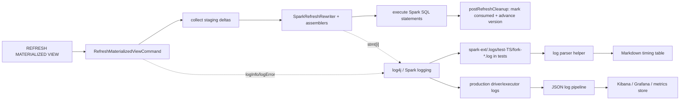

# 9. Profiling OpenIVM refreshes: `openivm_refresh_profile` and Spark logs

Question D7 asks how to profile OpenIVM refreshes across the two execution modes used by this repository.
Both modes expose step-oriented refresh profiles. Spark persists its profile in
a dedicated RocksDB catalog and exposes it through SQL.

## 9.1 TL;DR

- In standalone DuckDB mode, enable `SET openivm_profile_refresh=true` before `CREATE MATERIALIZED VIEW` or `PRAGMA refresh(...)`.
- OpenIVM writes one row per measured step into `openivm_refresh_profile`.
- The table is step-oriented, not summary-oriented.
- It has `duration_ms` and `detail`.
- It does not have dedicated `plan_duration_ms`, `exec_duration_ms`, `rows_processed`, or `refresh_type` columns.
- In openivm-spark, the DuckDB extension is invoked with `openivm_compile_only=true`.
- That means DuckDB compiles refresh SQL and returns without running the refresh program.
- Spark executes the rewritten SQL itself.
- Therefore the DuckDB `openivm_refresh_profile` table is not the place to look for Spark refresh runtime.
- Set `spark.openivm.profile.refresh=true` to capture Spark CREATE and REFRESH steps.
- Query Spark profiles with `SHOW OPENIVM REFRESH PROFILE`.
- Spark profiles include aggregated `rocksdb_operation` contention rows.
- Spark profiles include one `query_span` row with start/end epoch milliseconds,
  thread name, outcome, and duration for trace/Gantt views.
- Spark also emits `[openivm-mv]` log lines and normal Spark SQL/job metrics.
- The requested structured tokens such as `compile_start`, `collect_staging_end`, and `stmt_duration_ms` are not emitted in this checkout.
- Use the actual `[openivm-mv]` prefix and the helper below.

## 9.2 Source verification

The profile-table DDL appears in the upstream OpenIVM source in two places.

- Extension initialization: `openivm/src/openivm_extension.cpp:268-271`.
- Parser-side bootstrap DDL: `openivm/src/core/parser_create_mv_helpers.cpp:123-127`.

Both definitions agree on the current schema.

```sql
CREATE TABLE IF NOT EXISTS openivm_refresh_profile (
  refresh_id VARCHAR,
  view_name VARCHAR,
  profile_timestamp TIMESTAMP DEFAULT current_timestamp,
  step_order INTEGER,
  step_name VARCHAR,
  duration_ms BIGINT,
  detail VARCHAR,
  PRIMARY KEY(refresh_id, step_order)
);
```

The setting that enables writes is registered at `openivm/src/openivm_extension.cpp:191-195`.

```sql
SET openivm_profile_refresh=true;
SET openivm_profile_retention_days=31;
```

`openivm_profile_refresh` defaults to `false`.
An empty profile table often just means profiling was not enabled.

## 9.3 Column-by-column reference

| Column              | Type                                  | Meaning                                                                                                                              | Source evidence                                                                                     |
| ------------------- | ------------------------------------- | ------------------------------------------------------------------------------------------------------------------------------------ | --------------------------------------------------------------------------------------------------- |
| `refresh_id`        | `VARCHAR`                             | Unique logical profile id. For refreshes it is `<view>_<steady_clock_ns>`; for CREATE MV it is `<view>_create_mv_<steady_clock_ns>`. | `openivm/src/upsert/refresh.cpp:44-46`, `openivm/src/core/parser_ddl.cpp:38-46`                     |
| `view_name`         | `VARCHAR`                             | Materialized view name being created or refreshed.                                                                                   | inserted at `openivm/src/upsert/refresh.cpp:84-88` and `openivm/src/core/parser_ddl.cpp:80-85`      |
| `profile_timestamp` | `TIMESTAMP DEFAULT current_timestamp` | Wall-clock insertion timestamp assigned by DuckDB when each row is written.                                                          | DDL at `openivm/src/openivm_extension.cpp:268-271`                                                  |
| `step_order`        | `INTEGER`                             | Zero-based sequence number within one `refresh_id`.                                                                                  | `next_step++` at `openivm/src/upsert/refresh.cpp:60,67` and `openivm/src/core/parser_ddl.cpp:56,63` |
| `step_name`         | `VARCHAR`                             | Logical step label such as `acquire_locks`, `generate_refresh_sql`, `execute_refresh_sql_stmt`, or `total_refresh`.                  | writes at `openivm/src/upsert/refresh.cpp:84-88`                                                    |
| `duration_ms`       | `BIGINT`                              | Elapsed milliseconds for that step, measured with `std::chrono::steady_clock`.                                                       | `openivm/src/upsert/refresh.cpp:53-60`; CREATE path at `openivm/src/core/parser_ddl.cpp:49-56`      |
| `detail`            | `VARCHAR`                             | Free-form payload. This is where statement counts, SQL sizes, refresh type names, and SQL previews appear.                           | `openivm/src/upsert/refresh.cpp:174-176`, `237-240`, `249-250`                                      |

Important negative verification: there are no separate columns named `timestamp`, `mv_name`, `refresh_type`, `plan_duration_ms`, `exec_duration_ms`, or `rows_processed`.
Those concepts can be derived only indirectly.

- `profile_timestamp` is the timestamp column.
- `view_name` is the MV-name column.
- `refresh_type` sometimes appears inside `detail`, for example `refresh_type=AGGREGATE_GROUP`.
- Planning time is represented by a family of `generate_refresh_sql.*` rows plus the aggregate `generate_refresh_sql` row.
- Execution time is represented by `execute_refresh_sql_stmt` rows plus the aggregate `execute_refresh_sql` row.
- Row counts are not a first-class profile-table column in the current schema.

## 9.4 How standalone OpenIVM populates the table

Runtime refresh profiling is implemented by `RefreshProfiler` in `openivm/src/upsert/refresh.cpp:23-104`.
The profiler is enabled only when the current DuckDB context has `openivm_profile_refresh=true`.
It records steps in memory and flushes them to `openivm_refresh_profile` at refresh end.

Key source points:

- `RefreshProfiler` reads `openivm_profile_refresh` and `openivm_profile_retention_days` at `openivm/src/upsert/refresh.cpp:35-43`.
- It creates the refresh id at `openivm/src/upsert/refresh.cpp:44-46`.
- `AddStep` measures elapsed time at `openivm/src/upsert/refresh.cpp:53-60`.
- `Flush` prunes old rows and inserts profile rows at `openivm/src/upsert/refresh.cpp:74-95`.
- The refresh orchestrator starts profiling at `openivm/src/upsert/refresh.cpp:118`.
- The compile-only early return is at `openivm/src/upsert/refresh.cpp:178-190`.
- The per-statement diagnostic path is at `openivm/src/upsert/refresh.cpp:223-250`.

CREATE MATERIALIZED VIEW profiling uses `CreateMVProfiler` in `openivm/src/core/parser_ddl.cpp:17-90`.
That path writes `create_*` step names into the same table and uses the same retention setting.

## 9.5 Common standalone step names

The exact steps depend on view shape and settings, but these are common in the current source.

| Phase     | Step name                                 | What it means                                                    | Source                                         |
| --------- | ----------------------------------------- | ---------------------------------------------------------------- | ---------------------------------------------- |
| refresh   | `acquire_locks`                           | Per-view and per-delta-table locks were acquired.                | `openivm/src/upsert/refresh.cpp:118-137`       |
| planning  | `generate_refresh_sql.context`            | Context and catalog/schema setup.                                | `openivm/src/upsert/refresh_sql.cpp:247-276`   |
| planning  | `generate_refresh_sql.metadata_lookup`    | MV metadata, delta tables, and target storage lookup.            | `openivm/src/upsert/refresh_sql.cpp:329`       |
| planning  | `generate_refresh_sql.qualify_sources`    | Source qualification / query text preparation.                   | `openivm/src/upsert/refresh_sql.cpp:337`       |
| planning  | `generate_refresh_sql.recovery_check`     | Recovery-state check before generating SQL.                      | `openivm/src/upsert/refresh_sql.cpp:351`       |
| planning  | `generate_refresh_sql.column_metadata`    | Target column metadata collection.                               | `openivm/src/upsert/refresh_sql.cpp:457`       |
| planning  | `generate_refresh_sql.delta_fast_paths`   | Insert-only/delete-skipping/min-max fast-path decision.          | `openivm/src/upsert/refresh_sql.cpp:474`       |
| planning  | `generate_refresh_sql.dispatch`           | Strategy-specific compiler dispatch.                             | `openivm/src/upsert/refresh_sql.cpp:407,684`   |
| planning  | `generate_refresh_sql.compute_delta_plan` | Incremental delta logical plan construction.                     | `openivm/src/upsert/refresh_sql.cpp:860`       |
| planning  | `generate_refresh_sql.lpts`               | LogicalPlanToString serialization.                               | `openivm/src/upsert/refresh_sql.cpp:873`       |
| planning  | `generate_refresh_sql.assembly`           | Final SQL assembly.                                              | `openivm/src/upsert/refresh_sql.cpp:1045`      |
| planning  | `generate_refresh_sql`                    | Aggregate SQL generation elapsed time.                           | `openivm/src/upsert/refresh.cpp:164-176`       |
| execution | `execute_refresh_sql_stmt`                | One generated SQL statement, only when profiling is enabled.     | `openivm/src/upsert/refresh.cpp:223-244`       |
| execution | `execute_refresh_sql`                     | Total refresh SQL execution time.                                | `openivm/src/upsert/refresh.cpp:248-250`       |
| history   | `record_refresh_history`                  | Learned cost-model history write, when adaptive estimate exists. | `openivm/src/upsert/refresh.cpp:316-343`       |
| total     | `total_refresh`                           | End-to-end refresh time from profiler construction.              | `openivm/src/upsert/refresh.cpp:70-72,344-345` |

## 9.6 Why `openivm_refresh_profile` is empty on the Spark side

openivm-spark does not ask DuckDB/OpenIVM to execute refreshes.
It uses DuckDB/OpenIVM as a compiler and then executes a rewritten version of the emitted SQL in Spark.

The compiler bridge builds a DuckDB script in `OpenIvmCompiler.buildScript`.
The relevant prologue is in `spark-ext/ivm-compiler/src/main/scala/org/openivm/spark/compiler/OpenIvmCompiler.scala:144-196`.

```sql
LOAD '<openivm extension>';
SET openivm_target_dialect='spark';
SET openivm_compile_only=true;
SET openivm_enable_view_matching=false;
SET openivm_force_view_delta_cascade=true;
SET openivm_emit_cascade_delta_for_recompute=true;
SET openivm_minmax_incremental=false;
SET openivm_files_path='<compiler scratch dir>';
CREATE OR REPLACE MATERIALIZED VIEW <mv> AS <normalized query>;
PRAGMA compile_refresh('<mv>');
```

The upstream extension describes `openivm_compile_only` at `openivm/src/openivm_extension.cpp:203-210`.
The refresh orchestrator honors it at `openivm/src/upsert/refresh.cpp:178-190`.
After `GenerateRefreshSQL`, it adds `total_refresh`, flushes any enabled profile rows, and returns before executing the refresh SQL.

In ordinary openivm-spark refreshes, the persisted compiled SQL is read from MV metadata, rewritten, and executed by Spark.
There is no long-lived DuckDB database whose `openivm_refresh_profile` table represents the Spark runtime.
The DuckDB compile subprocess is ephemeral, and its profile table is not a Spark telemetry sink.

## 9.7 Spark-side profiling evidence that exists today

Enable the Spark profile and query it after a refresh:

```sql
SET spark.openivm.profile.refresh=true;

REFRESH MATERIALIZED VIEW daily_sales;

SHOW OPENIVM REFRESH PROFILE;
```

`RefreshProfile` buffers lifecycle steps on the driver thread. It writes the
rows to `<state_path>/_openivm/refresh_profile/rocksdb` after the command ends.
The profile uses the same seven-column schema as standalone OpenIVM.

RocksDB access adds one `rocksdb_operation` row for each database scope,
operation, and multi-process mode. Its `duration_ms` is the aggregated
operation time. The `detail` field preserves exact nanosecond timing for JVM
lock waits, external lock waits, native open/close, and the operation body.

The collector is thread-local. Concurrent materialized views cannot mix their
metrics through process-global counters. Collection stops before the profile
catalog write, so a profile does not measure its own persistence.

`query_span.detail` has the stable shape
`start_epoch_ms=...;end_epoch_ms=...;thread=...;outcome=...`. Plot one horizontal
bar per `refresh_id`, from start to end, to compare overlap between an A baseline
and a B run. A failure before the normal end marker is recorded as
`outcome=failed_before_end`, and the thread-local collector is still detached.

The profile complements Spark event metrics. Use event metrics for records,
files, shuffle, and spill. Use `rocksdb_operation` for state-layer contention.

The current Spark source emits operational log lines with the prefix `[openivm-mv]`.
The emit sites found by `grep -rn "logInfo.*refresh" spark-ext/` and related `logError`/`logWarning` searches are below.

| Event in logs                          | Example fields                                                                                                   | Level         | Source                                                                                                     |
| -------------------------------------- | ---------------------------------------------------------------------------------------------------------------- | ------------- | ---------------------------------------------------------------------------------------------------------- |
| compile failure demotion               | `compiled_refresh_type='COMPILE_FAILED' effective_refresh_type='FULL_REFRESH' reason='compile_failed' cause=...` | ERROR         | `spark-ext/ivm-extension/src/main/scala/org/openivm/spark/commands/MaterializedViewCommands.scala:378-386` |
| classification / demotion decision     | `compiled_refresh_type`, `effective_refresh_type`, `reason`, `emits_cascade_view_delta`                          | INFO or ERROR | `MaterializedViewCommands.scala:630-638`                                                                   |
| no pending deltas                      | `refresh_type`, `outcome='no_pending_deltas'`                                                                    | INFO          | `MaterializedViewCommands.scala:796-805`, `817-821`                                                        |
| refresh has pending deltas             | `refresh_type`, `pending_deltas`, `source_tables`                                                                | INFO          | `MaterializedViewCommands.scala:824-827`                                                                   |
| compile cache backfill failure         | exception class and message                                                                                      | WARN          | `MaterializedViewCommands.scala:920-939`                                                                   |
| rewritten statement text               | `stmt[i]=<Spark SQL preview>`                                                                                    | INFO          | `MaterializedViewCommands.scala:1017-1026`                                                                 |
| skipped simple projection delete merge | `outcome='skip_simple_projection_delete_merge' reason='no_negative_rows'`                                        | INFO          | `MaterializedViewCommands.scala:1061-1070`, `1077-1086`                                                    |

The assemblers under `spark-ext/ivm-common/src/main/scala/org/openivm/spark/common/*Assembler.scala` do not currently emit log lines themselves.
They return `AssembledRefresh` objects to `RefreshMaterializedViewCommand`, which logs the final rewritten statements before execution.

## 9.8 Requested event names vs current source

The requested names are useful as a desired structured vocabulary, but they are not present as literal log events in this checkout.
This matters because a parser that greps for `refresh_step=compile_start` will return no rows today.

| Requested event                             | Current status                                                                               | Closest current evidence                                                                                                             |
| ------------------------------------------- | -------------------------------------------------------------------------------------------- | ------------------------------------------------------------------------------------------------------------------------------------ |
| `compile_start`                             | not emitted                                                                                  | CREATE-time classification line after compile; cache-miss compile path at `MaterializedViewCommands.scala:920-941` has no timing log |
| `compile_end`                               | not emitted                                                                                  | same classification line includes `compiled_refresh_type`                                                                            |
| `compile_duration_ms`                       | not emitted                                                                                  | measure externally or add instrumentation around `compiler.compile(...)`                                                             |
| `collect_staging_start`                     | not emitted                                                                                  | refresh entry calls `StagingCatalog.collectFor` at `MaterializedViewCommands.scala:807-812`                                          |
| `collect_staging_end`                       | not emitted                                                                                  | subsequent log line reports `pending_deltas=${stagingDeltas.size}` at `MaterializedViewCommands.scala:824-827`                       |
| `rows_collected`                            | not emitted                                                                                  | only number of staging delta records is logged as `pending_deltas`; row counts inside Delta paths are not logged                     |
| `rewrite_start`                             | not emitted                                                                                  | `SparkRefreshRewriter.rewrite(...)` happens before statement logs; no explicit timer                                                 |
| `rewrite_end`                               | not emitted                                                                                  | `stmt[i]` lines show the rewritten output exists                                                                                     |
| `execute_stmt`                              | partially emitted                                                                            | `stmt[i]=...` logs the statement text before execution, but not a start/end marker                                                   |
| `stmt_duration_ms`                          | not emitted                                                                                  | use Spark SQL/job metrics or add a timer around `executeSql`                                                                         |
| `mark_consumed_start` / `mark_consumed_end` | not emitted                                                                                  | cleanup calls `StagingCatalog.markConsumed` at `MaterializedViewCommands.scala:1273-1274`                                            |
| `emits_cascade_view_delta`                  | emitted at CREATE/classification                                                             | `MaterializedViewCommands.scala:626-638`                                                                                             |
| `demotion_reason`                           | field is named `reason`, not `demotion_reason`                                               | `MaterializedViewCommands.scala:597-638`                                                                                             |
| `refresh_type_name`                         | emitted as `compiled_refresh_type`, `effective_refresh_type`, or refresh-time `refresh_type` | `MaterializedViewCommands.scala:632-634`, `800-827`                                                                                  |
| `refresh_type_code`                         | not emitted                                                                                  | persisted in `MvMetadata.refreshType`, enum in `RefreshTypeCode.scala:6-18`                                                          |

## 9.9 Where Spark logs land

For test runs driven by `./spark-ext/dev/dev.sh test`, the harness prints the log directory at startup.
A targeted run in this checkout printed this line.

```text
[dev] Test logs → spark-ext/.logs/test-20260524-114303/ (DEBUG-level full trace; console keeps WARN+ only)
```

That run produced one fork log.

```text
spark-ext/.logs/test-20260524-114303/fork-114314-661.log
```

Some older notes describe `.logs/test-<TS>/fork-*.log` at the repository root.
The current dev harness output is authoritative for the run you are inspecting.
Use the printed directory path rather than hard-coding either location.

In production, these same `logInfo`, `logWarning`, and `logError` calls go through the Spark driver/executor logging stack.
Configure the SparkSession log4j/log4j2 settings the same way you would for other Spark SQL extension logs.
For structured collection, route `org.openivm.spark.commands` to JSON output and aggregate downstream in Kibana, Loki/Grafana, CloudWatch, or the platform used by the cluster.

## 9.10 Spark demo: `AggregateSumSpec`

Command run:

```bash
./spark-ext/dev/dev.sh test 'testOnly org.openivm.spark.parity.AggregateSumSpec'
```

Result: 9 tests passed in 2 minutes, 4 seconds of sbt time.
The relevant log grep for the large-batch MV was:

```bash
grep -n "\[openivm-mv\].*aggsum_mv_batch" spark-ext/.logs/test-20260524-114303/fork-114314-661.log
```

Observed lines:

```text
85: 2026-05-24 11:44:29.580 ... [openivm-mv] view='`aggsum_mv_batch`' compiled_refresh_type='AGGREGATE_GROUP' effective_refresh_type='AGGREGATE_GROUP' reason='kept' emits_cascade_view_delta='true'
86: 2026-05-24 11:44:31.049 ... [openivm-mv] refresh view='`aggsum_mv_batch`' refresh_type='AGGREGATE_GROUP' pending_deltas=1 source_tables=default.aggsum_batch_tbl
87: 2026-05-24 11:44:31.071 ... [openivm-mv] refresh view='`aggsum_mv_batch`' stmt[0]=CREATE OR REPLACE TABLE delta.`file:/work/.../_ivm/view_deltas/aggsum_mv_batch/...` USING DELTA AS WITH ...
88: 2026-05-24 11:44:31.071 ... [openivm-mv] refresh view='`aggsum_mv_batch`' stmt[1]=INSERT INTO delta.`file:/work/.../_ivm/view_deltas/aggsum_mv_batch/...` ...
89: 2026-05-24 11:44:31.071 ... [openivm-mv] refresh view='`aggsum_mv_batch`' stmt[2]=WITH refresh_cte AS (...) MERGE INTO `aggsum_mv_batch` ...
```

Because this checkout does not emit explicit Spark start/end/duration markers, the table below separates measured log timestamps from unavailable timings.
The relative time origin is the classification log line at `11:44:29.580`.

| Step            | Started at (ms) | Ended at (ms) | Duration (ms) | Evidence                                                                         |
| --------------- | --------------: | ------------: | ------------: | -------------------------------------------------------------------------------- |
| compile         |             n/a |             0 |           n/a | classification line appears after compile and reports `AGGREGATE_GROUP`          |
| collect_staging |             n/a |          1469 |           n/a | pending-delta line at `11:44:31.049`                                             |
| rewrite         |             n/a |          1491 |           n/a | first statement line at `11:44:31.071`                                           |
| execute_stmt_1  |             n/a |           n/a |           n/a | only `stmt[0]=...` text is logged before execution                               |
| execute_stmt_2  |             n/a |           n/a |           n/a | only `stmt[1]=...` text is logged before execution                               |
| execute_stmt_3  |             n/a |           n/a |           n/a | only `stmt[2]=...` text is logged before execution                               |
| mark_consumed   |             n/a |           n/a |           n/a | cleanup is not logged; source call is `MaterializedViewCommands.scala:1273-1274` |

If you need the requested exact table with non-null durations, add explicit timers around compile, staging collection, rewrite, each `executeSql`, and `postRefreshCleanup`.
Until then, combine `[openivm-mv]` lines with Spark SQL/job metrics for runtime.

## 9.11 Standalone DuckDB profiling demo

The standalone reference demo was run inside the same dev container, using the bundled DuckDB CLI and extension.

```bash
cd spark-ext/dev
docker compose --env-file pins.env -f docker/docker-compose.yml run --rm -T build bash -lc "
/opt/openivm/duckdb -csv <<'SQL'
LOAD '/opt/openivm/openivm.duckdb_extension';
SET openivm_profile_refresh=true;
CREATE TABLE sales(region INTEGER, amount BIGINT);
CREATE MATERIALIZED VIEW mv_sales AS
  SELECT region, SUM(amount) AS total_amount, COUNT(*) AS cnt
  FROM sales GROUP BY region;
INSERT INTO sales SELECT i % 10, i FROM range(1000000) AS t(i);
PRAGMA refresh('mv_sales');
.headers on
.mode markdown
SELECT refresh_id, view_name, step_order, step_name, duration_ms, detail
FROM openivm_refresh_profile
WHERE view_name = 'mv_sales'
ORDER BY refresh_id, step_order;
SQL"
```

The refresh portion of the output looked like this.

| refresh_id                 | view_name  | step_order | step_name                                 | duration_ms | detail                                                                                   |
| -------------------------- | ---------- | ---------: | ----------------------------------------- | ----------: | ---------------------------------------------------------------------------------------- |
| `mv_sales_661448269587947` | `mv_sales` |          0 | `acquire_locks`                           |           0 | `1 delta locks`                                                                          |
| `mv_sales_661448269587947` | `mv_sales` |          1 | `generate_refresh_sql.context`            |           0 | `cross_system=false`                                                                     |
| `mv_sales_661448269587947` | `mv_sales` |          2 | `generate_refresh_sql.metadata_lookup`    |           2 | `refresh_type=AGGREGATE_GROUP; delta_tables=1; target_ducklake=false`                    |
| `mv_sales_661448269587947` | `mv_sales` |          3 | `generate_refresh_sql.qualify_sources`    |           0 | `query_bytes=455`                                                                        |
| `mv_sales_661448269587947` | `mv_sales` |          4 | `generate_refresh_sql.recovery_check`     |           0 | empty                                                                                    |
| `mv_sales_661448269587947` | `mv_sales` |          5 | `generate_refresh_sql.column_metadata`    |           0 | `columns=4; list_mode=false`                                                             |
| `mv_sales_661448269587947` | `mv_sales` |          6 | `generate_refresh_sql.delta_fast_paths`   |           0 | `insert_only=true; skip_agg_delete=true; skip_proj_delete=true; minmax_incremental=true` |
| `mv_sales_661448269587947` | `mv_sales` |          7 | `generate_refresh_sql.dispatch`           |           0 | `refresh_type=AGGREGATE_GROUP; upsert_bytes=609`                                         |
| `mv_sales_661448269587947` | `mv_sales` |          8 | `generate_refresh_sql.compute_delta_plan` |           4 | empty                                                                                    |
| `mv_sales_661448269587947` | `mv_sales` |          9 | `generate_refresh_sql.lpts`               |           0 | `delta_sql_bytes=1968`                                                                   |
| `mv_sales_661448269587947` | `mv_sales` |         10 | `generate_refresh_sql.assembly`           |           2 | `sql_bytes=3250; meta_post_bytes=337`                                                    |
| `mv_sales_661448269587947` | `mv_sales` |         11 | `generate_refresh_sql`                    |          15 | `sql_bytes=3250, meta_pre_bytes=0, meta_post_bytes=0`                                    |
| `mv_sales_661448269587947` | `mv_sales` |         12 | `execute_refresh_sql_stmt`                |           1 | `statement=1/7, bytes=80, sql=UPDATE openivm_views ...`                                  |
| `mv_sales_661448269587947` | `mv_sales` |         13 | `execute_refresh_sql_stmt`                |          26 | `statement=2/7, bytes=2018, sql=WITH scan_0 ...`                                         |
| `mv_sales_661448269587947` | `mv_sales` |         14 | `execute_refresh_sql_stmt`                |           3 | `statement=3/7, bytes=606, sql=WITH refresh_cte ...`                                     |
| `mv_sales_661448269587947` | `mv_sales` |         15 | `execute_refresh_sql_stmt`                |           0 | `statement=4/7, bytes=34, sql=DELETE FROM openivm_delta_mv_sales`                        |
| `mv_sales_661448269587947` | `mv_sales` |         16 | `execute_refresh_sql_stmt`                |           2 | `statement=5/7, bytes=162, sql=DELETE FROM memory.main.openivm_delta_sales ...`          |
| `mv_sales_661448269587947` | `mv_sales` |         17 | `execute_refresh_sql_stmt`                |           2 | `statement=6/7, bytes=251, sql=UPDATE openivm_delta_tables ...`                          |
| `mv_sales_661448269587947` | `mv_sales` |         18 | `execute_refresh_sql_stmt`                |           1 | `statement=7/7, bytes=81, sql=UPDATE openivm_views ... false ...`                        |
| `mv_sales_661448269587947` | `mv_sales` |         19 | `execute_refresh_sql`                     |          37 | `bytes=3250, statements=7`                                                               |
| `mv_sales_661448269587947` | `mv_sales` |         20 | `total_refresh`                           |          63 | empty                                                                                    |

The same query also returned `create_*` rows for the MV creation profile, because profiling was enabled before `CREATE MATERIALIZED VIEW`.
That is expected: CREATE and REFRESH share the same profile table but use different `refresh_id` shapes and step names.

## 9.12 Profiling utilities

### 9.12.1 `PRAGMA openivm_profile_dump`

A source search for `openivm_profile_dump` and `profile_dump` found no implementation in this checkout.
Therefore there is no built-in `PRAGMA openivm_profile_dump('/path/to/output.csv')` to document today.
Export manually instead.

```sql
COPY (
  SELECT *
  FROM openivm_refresh_profile
  ORDER BY profile_timestamp, refresh_id, step_order
)
TO 'openivm-refresh-profile.csv' (HEADER, DELIMITER ',');
```

### 9.12.2 `EXPLAIN ANALYZE`

`EXPLAIN ANALYZE` remains useful on both sides, but use it against the SQL that will actually execute.

- In DuckDB standalone mode, run `EXPLAIN ANALYZE` on individual statements extracted from `detail` or from the generated refresh SQL artifact.
- In Spark mode, run `EXPLAIN ANALYZE <rewritten Spark SQL>` for a statement printed by `[openivm-mv] ... stmt[i]=...`, or paste the statement into a Spark notebook.
- For mutation statements, prefer a scratch dataset because `EXPLAIN ANALYZE` may execute the plan depending on engine semantics.

### 9.12.3 SparkListener integration

A search for `SparkListener` found only RocksDB lifecycle cleanup, not refresh profiling.
`OpenIvmRocksDBRegistry.registerSparkListenerIfNeeded` registers an `onApplicationEnd` hook to close RocksDB handles at `spark-ext/ivm-common/src/main/scala/org/openivm/spark/common/rocksdb/OpenIvmRocksDBRegistry.scala:135-149`.
There is no OpenIVM refresh-duration SparkListener in this checkout.
Use Spark SQL listener/job metrics externally, or add a dedicated listener if you need job IDs correlated with MV names.

## 9.13 What you can do today

1. Tail the fork log and grep the actual prefix.

   ```bash
   tail -f spark-ext/.logs/test-<TS>/fork-*.log | grep --line-buffered '\[openivm-mv\]'
   ```

1. Run a targeted test and capture durations from logs plus Spark job metrics.

   ```bash
   ./spark-ext/dev/dev.sh test 'testOnly org.openivm.spark.parity.AggregateSumSpec'
   grep -n '\[openivm-mv\].*refresh' spark-ext/.logs/test-<TS>/fork-*.log
   ```

1. For production, configure log4j/log4j2 to emit `org.openivm.spark.commands` as structured JSON and aggregate downstream.
   Suggested fields to extract are `view`, `refresh_type`, `compiled_refresh_type`, `effective_refresh_type`, `reason`, `emits_cascade_view_delta`, `pending_deltas`, and `stmt_index`.

1. Manually time DML-to-refresh cycles in a Spark notebook.

   ```scala
   val t0 = System.nanoTime()
   spark.sql("INSERT INTO orders VALUES (1, 42)")
   val t1 = System.nanoTime()
   spark.sql("REFRESH MATERIALIZED VIEW mv_orders")
   val t2 = System.nanoTime()
   println(s"dml_ms=${(t1 - t0) / 1000000}, refresh_ms=${(t2 - t1) / 1000000}")
   ```

1. For standalone DuckDB/OpenIVM, use the profile table directly.

   ```sql
   SET openivm_profile_refresh=true;
   PRAGMA refresh('mv_name');
   SELECT *
   FROM openivm_refresh_profile
   ORDER BY profile_timestamp, refresh_id, step_order;
   ```

## 9.14 Small Python helper

The helper below accepts a fork-log path and prints a Markdown table for each MV it sees.
It supports two formats.

- Current `[openivm-mv]` lines, where many durations are unavailable.
- Future structured lines containing `refresh_step=... started_at_ms=... ended_at_ms=... duration_ms=...`.

Create it with a cat-EOF block outside committed source, for example in your working shell.

```bash
cat > parse-openivm-refresh-log.py <<'PY'
#!/usr/bin/env python3
import re
import sys
from collections import defaultdict
from datetime import datetime

TS_RE = re.compile(r'^(\d{4}-\d{2}-\d{2} \d{2}:\d{2}:\d{2}\.\d{3})')
VIEW_RE = re.compile(r"(?:refresh view|view)='`?([^'`]+)`?'")
STMT_RE = re.compile(r"stmt\[(\d+)\]=")
STRUCT_RE = re.compile(
    r"refresh_step=(\S+).*?started_at_ms=(\d+).*?ended_at_ms=(\d+).*?duration_ms=(\d+)"
)

def parse_ts(line):
    m = TS_RE.search(line)
    if not m:
        return None
    return datetime.strptime(m.group(1), '%Y-%m-%d %H:%M:%S.%f')

def ms_since(t, origin):
    return int((t - origin).total_seconds() * 1000)

def main(path):
    by_view = defaultdict(list)
    with open(path, encoding='utf-8', errors='replace') as fh:
        for line in fh:
            if '[openivm-mv]' not in line:
                continue
            ts = parse_ts(line)
            vm = VIEW_RE.search(line)
            if ts is None or vm is None:
                continue
            view = vm.group(1)
            sm = STRUCT_RE.search(line)
            if sm:
                by_view[view].append((sm.group(1), int(sm.group(2)), int(sm.group(3)), int(sm.group(4))))
                continue
            if 'compiled_refresh_type=' in line:
                by_view[view].append(('compile/classify', ts, ts, None))
            elif 'pending_deltas=' in line:
                by_view[view].append(('collect_staging', ts, ts, None))
            elif "outcome='no_pending_deltas'" in line:
                by_view[view].append(('collect_staging(no-op)', ts, ts, None))
            else:
                stmt = STMT_RE.search(line)
                if stmt:
                    by_view[view].append((f'execute_stmt_{int(stmt.group(1)) + 1}', ts, ts, None))
    for view, rows in sorted(by_view.items()):
        print(f'### {view}')
        print('| Step | Started at (ms) | Ended at (ms) | Duration (ms) |')
        print('|---|---:|---:|---:|')
        if not rows:
            continue
        datetimes = [r[1] for r in rows if isinstance(r[1], datetime)]
        origin = min(datetimes) if datetimes else None
        for step, start, end, dur in rows:
            if isinstance(start, datetime):
                s = ms_since(start, origin)
                e = ms_since(end, origin)
                d = 'n/a' if dur is None else str(dur)
            else:
                s, e, d = start, end, dur
            print(f'| {step} | {s} | {e} | {d} |')
        print()

if __name__ == '__main__':
    if len(sys.argv) != 2:
        raise SystemExit('usage: parse-openivm-refresh-log.py <fork-log>')
    main(sys.argv[1])
PY
chmod +x parse-openivm-refresh-log.py
./parse-openivm-refresh-log.py spark-ext/.logs/test-<TS>/fork-<HHmmss-SSS>.log
```

Example output for `aggsum_mv_batch` with current logs:

| Step             | Started at (ms) | Ended at (ms) | Duration (ms) |
| ---------------- | --------------: | ------------: | ------------: |
| compile/classify |               0 |             0 |           n/a |
| collect_staging  |            1469 |          1469 |           n/a |
| execute_stmt_1   |            1491 |          1491 |           n/a |
| execute_stmt_2   |            1491 |          1491 |           n/a |
| execute_stmt_3   |            1491 |          1491 |           n/a |

## 9.15 Mermaid data flow



## 9.16 Recommendations for better Spark profiling

If exact Spark-side per-step timings are required, add structured logs around the existing code seams rather than scraping SQL text.
Recommended fields:

- `prefix="[openivm-mv]"` and `refresh_step=<name>` for easy grep compatibility.
- `view=<sqlIdent>` and `refresh_type_name=<meta.refreshTypeName>`.
- `refresh_type_code=<meta.refreshType>`.
- `started_at_ms`, `ended_at_ms`, and `duration_ms` from `System.nanoTime`.
- `rows_collected` for source staging-row counts or Delta row counts, clearly named.
- `stmt_index`, `stmt_count`, and a bounded `sql_preview` for statement execution.
- `demotion_reason` as an alias of current `reason` if operators need that exact name.
- `emits_cascade_view_delta` copied from MV metadata.

Suggested insertion points are direct and low-risk.

| Step              | Code seam                                                                                                             |
| ----------------- | --------------------------------------------------------------------------------------------------------------------- |
| compile           | around `compiler.compile(...)` in CREATE and refresh cache-miss paths                                                 |
| collect staging   | around `StagingCatalog.collectFor(...)` at `MaterializedViewCommands.scala:807-812`                                   |
| rewrite           | around `SparkRefreshRewriter.rewrite(...)` in `runUnderLock`                                                          |
| execute statement | inside the `executeSql` wrapper at `MaterializedViewCommands.scala:1027-1028`                                         |
| mark consumed     | around `postRefreshCleanup(...)` and `StagingCatalog.markConsumed(...)` at `MaterializedViewCommands.scala:1273-1274` |
| cascade delta     | immediately after `meta.emitsCascadeViewDelta` is evaluated in `MaterializedViewCommands.scala`                       |

Until that instrumentation exists, treat Spark logs as control-plane evidence and Spark SQL metrics as runtime evidence.
For DuckDB standalone refresh runtime, use `openivm_refresh_profile` directly.
