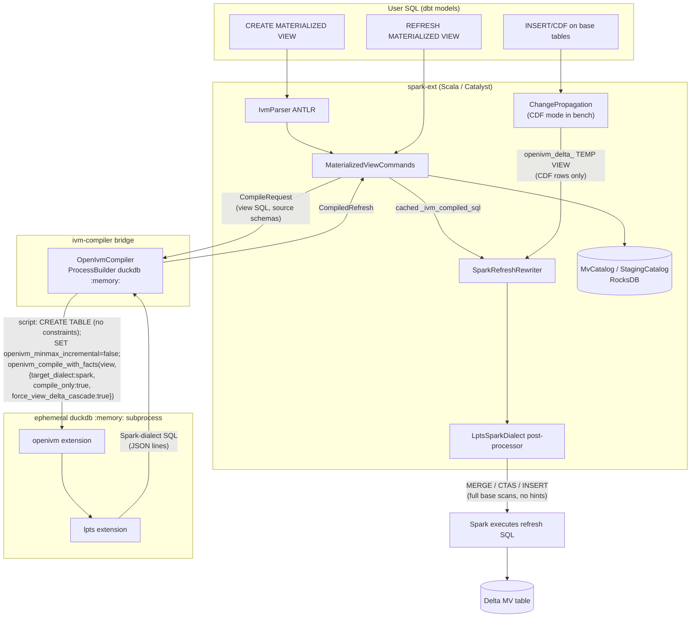
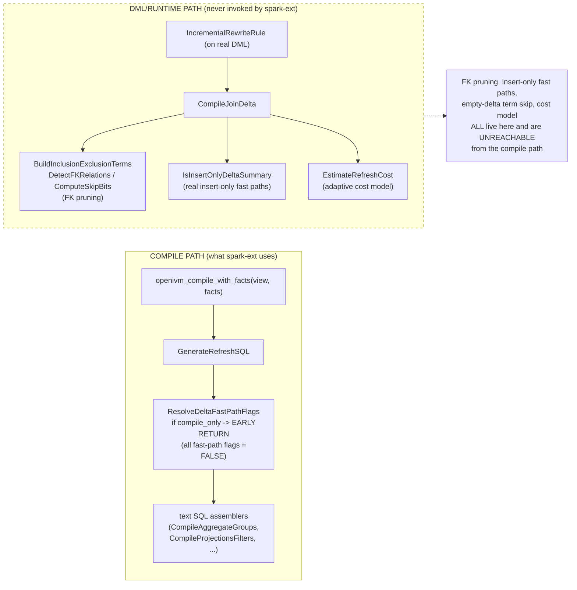
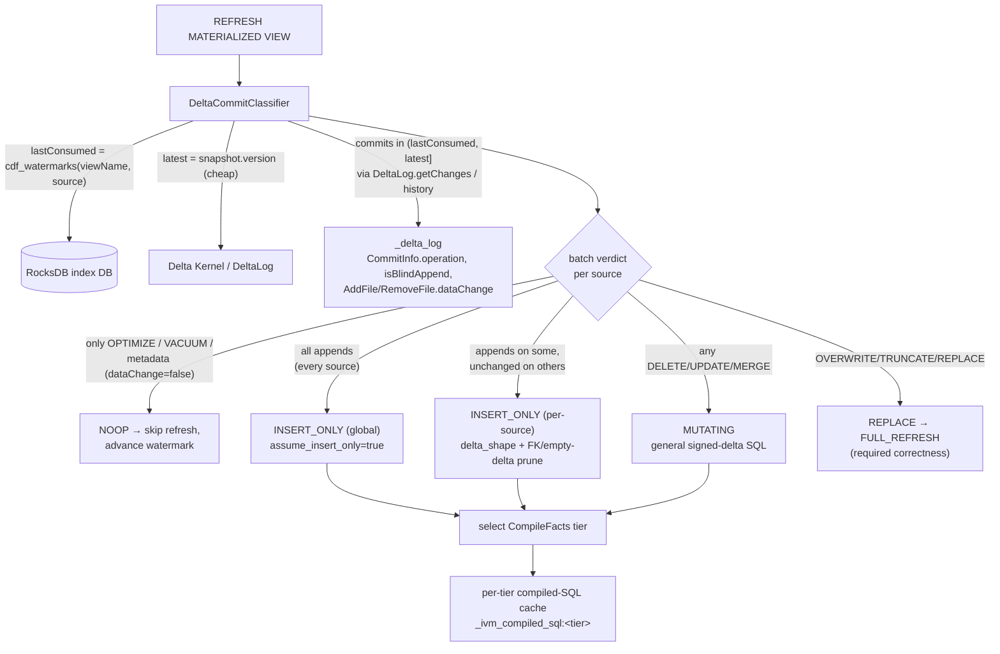
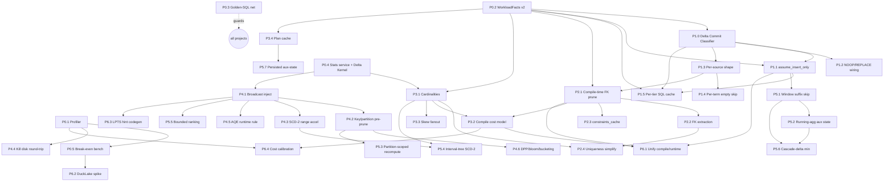

# Speeding Up openivm‑spark: A Dependency‑Aware, Parallelizable Engineering Roadmap

> **Mandate.** Make incremental view maintenance (IVM) on Spark 3.5 / Delta Lake 3.2 via openivm **dramatically faster than full refresh**, by (1) hooking spark‑ext into *far more* Spark/Delta metadata and transmitting it to openivm, and (2) tuning openivm *as hard as possible* for the actual workload — **detected per refresh from the Delta transaction log, never assumed.** Code changes are permitted in every repo under `.temp` **except `delta` and `spark`**, plus `spark-ext`.
>
> **Design principle — translate, don't assume.** Never *assume* an append‑only workload and flipped openivm into insert‑only fast‑path mode on faith. That is unsafe: a single DELETE/UPDATE/MERGE batch makes insert‑only fast‑path SQL **wrong**, and no‑op commits (OPTIMIZE/VACUUM) trigger wasteful refreshes. Instead, the extension becomes an **intelligent Delta→openivm translator bridge** (Workstream 1): it reads the actual commits since the last processed transaction, classifies the batch shape, and selects the *precisely‑correct‑and‑fastest* openivm `CompileFacts` tier. Append‑only is then the *common, detected* case — not a global assumption.
>
> **Scope of repos in play:** `spark-ext` (the Spark extension), `.temp/openivm` (the DuckDB IVM engine), `.temp/lpts` (the logical‑plan‑to‑SQL transpiler), `.temp/ivm-bench` (the TPC‑DI benchmark). Read‑only: `.temp/delta`, `.temp/spark`.

---

## 1. Executive Summary

openivm‑spark is slow **not** because openivm's IVM algorithms are weak — they are state‑of‑the‑art (Z‑set / DBSP Möbius inclusion‑exclusion, with FK pruning, insert‑only fast paths, N‑term telescoping, an adaptive cost model, and segment‑of‑optimizations).[^engine][^optcat] It is slow because the Spark integration uses **almost none of that intelligence**, and then runs the resulting fully‑general SQL on Spark in the worst possible shape.

Four findings define the entire roadmap:

1. **openivm‑spark only invokes openivm's *compiler*, never its *runtime*.** It calls `openivm_compile_with_facts(view, facts_json)` in an ephemeral `duckdb :memory:` subprocess with **empty tables**, gets back Spark‑dialect SQL, and executes that SQL on Spark itself.[^bridge][^lpts] openivm's FK pruning, insert‑only fast‑path detection, empty‑delta term skipping, and adaptive cost model **all live on a different code path** (the DML‑time optimizer rules `IncrementalRewriteRule` → `CompileJoinDelta` → `BuildInclusionExclusionTerms`) that `openivm_compile_with_facts` *never reaches*.[^plumbing]

2. **The single flag the bridge hardcodes — `compile_only=true` — actively *disables* every append‑only optimization.** It forces an early return in `ResolveDeltaFastPathFlags` that zeroes `insert_only`, `skip_agg_delete`, `skip_proj_delete`, and `minmax_incremental`, so the emitted SQL is valid for *any* delta shape (the most expensive form).[^plumbing][^inputsurface] The bridge's lone `SET openivm_minmax_incremental=false` is **provably inert** — it is read *after* that early return.[^plumbing]

3. **The emitted SQL full‑scans base tables and Spark is told not to broadcast.** The Möbius "current‑base" join terms (`Δfact ⋈ dim_now`, `fact_now ⋈ Δdim`) require scanning the *complete* Delta tables; the rewriter resolves `memory.main.<table>` to the full ``db`.`table`` with **no partition filter, no key pushdown, and no broadcast/DPP/runtime‑filter hints**.[^cdf] Worse, broadcast is *deliberately disabled* (`autoBroadcastJoinThreshold=-1`) for the heavy statements to avoid an 8 GiB `BroadcastExchange` cap failure caused by mis‑estimated SCD‑2 range‑join expansion.[^cdf] The result for `gold.fact_market_history`: **977.8 s on Spark vs 33.7 s on DuckDB — a 29× gap on a single MV.**[^bench]

4. **The hard query shapes (windows, SCD‑2 range joins, global ranking) fall back to maximally expensive strategies.** Unbounded windows recompute the *entire* affected partition (≈1,260× amplification per key); the documented append‑only "window suffix skip" (Rule 6) is **100% unimplemented**; SCD‑2 `BETWEEN` joins materialize a full cross‑product (57.6 GiB intermediate at SF=10) before filtering; global ranking goes to `FULL_REFRESH`.[^window]

5. **The extension is blind to what actually changed.** Today it tracks only a per‑source last‑processed Delta *version* in RocksDB and asks the binary question "is there anything newer?" (`latestVersion > lastConsumedVersion`).[^watermark] It never inspects the **commit operations** in the new transactions, so it cannot tell an append from a delete, an `OPTIMIZE`/`VACUUM` no‑op from real data, or an `OVERWRITE` (which *breaks* incremental semantics) from an incremental change. This blindness is *why* the only safe global default was the conservative, slow, all‑delta‑shapes SQL — and it is the gap Workstream 1 closes by reading `DeltaLog.getChanges`/`history` and classifying each batch.[^watermark][^bench]

The roadmap below is organized as **7 workstreams** (foundations; the **Delta→openivm workload translator** + append‑only tuning; constraints/FK; statistics‑driven compilation; Spark‑native execution; deep IVM algorithmics; and an architectural unification track), decomposed into ~40 dependency‑aware projects. The early projects are small, high‑ROI, and unblock dozens of parallel engineers; the later ones are deep database‑systems research that lifts the ceiling 10–1000× on the pathological shapes.

**Non‑negotiable invariant (the user's hard rule):** *no project may regress an MV's ability to incrementalize down to `FULL_REFRESH`.* Workstream 0 builds the golden‑SQL regression net that enforces this for everyone.[^testconv] One subtlety the translator makes explicit (§5, Workstream 1): choosing `FULL_REFRESH` for the *specific batch* where the Delta commit is an `OVERWRITE`/`TRUNCATE`/`REPLACE` is **required correctness, not a regression** — the MV remains incremental for every subsequent append batch; the golden‑SQL net still guards the append/default path against silent downgrades.

---

## 2. How openivm‑spark Works Today



**What flows to openivm today is impoverished.** The entire `CompileFacts` payload is a hardcoded 3‑field constant — `{"target_dialect":"spark","compile_only":true,"force_view_delta_cascade":true}` — assembled once at class‑load and never varied per MV, per table, or per refresh.[^bridge][^inputsurface] The only Spark/Delta metadata the extension reads at all is *column names + types* (`StructType.toDDL`), the MV's Delta version (for watermarks), and CDF change rows.[^archmeta] It ignores per‑file `numRecords`/min/max stats, partition structure, clustering, deletion vectors, table/column statistics, and PK/FK constraints — **all of which exist and are cheap to read.**[^archmeta][^deltameta][^sparkstats]

### 2.1 The Central Architectural Divide — why optimizations don't fire



This divide is the single most important fact in the codebase. It means:

- Declaring FK constraints in the bridge DDL would do **nothing** at compile time — `DetectFKRelations` reads `TableCatalogEntry::GetConstraints()` only on the DML path.[^plumbing]
- `SET openivm_skip_*` / `openivm_fk_pruning` / `openivm_adaptive_refresh` before the compile call are **inert or wrong** (read after the `compile_only` early return, or only on the DML path).[^plumbing]
- Injecting `pending_row_estimate` / cardinalities has **zero effect** on compiled SQL shape (they feed only the runtime cost model, which is off and would see empty tables anyway).[^plumbing]

Therefore the roadmap must either **extend the compile path to accept and act on a rich workload payload** (Workstreams 1–3, 6) or **make the generated SQL Spark‑optimizer‑friendly** (Workstreams 4–5). Both are needed.

### 2.2 The Benchmark Reality (TPC‑DI, append‑only, CDF mode)

ivm‑bench is a TPC‑DI‑derived dbt project: 49 materialized views across bronze→silver→gold→analytics, 3 batches — batch 1 = 100% historical load, batches 2/3 = **pure inserts** (0% update, 0% delete).[^bench] It runs in **Delta CDF mode** (`spark.openivm.changeFeed.mode=cdf`). Committed SF=100 numbers (per‑MV, batch 2, spark‑openivm vs duckdb‑openivm):[^bench]

| MV                         | RefreshType       | spark‑openivm | duckdb‑openivm | gap     |
| -------------------------- | ----------------- | ------------- | -------------- | ------- |
| `gold.fact_market_history` | SIMPLE_PROJECTION | **977.8 s**   | 33.7 s         | **29×** |
| `gold.fact_holdings`       | SIMPLE_PROJECTION | 89.8 s        | 16.6 s         | 5.4×    |
| `silver.watches`           | AGGREGATE_GROUP   | 78.6 s        | 6.0 s          | 13×     |
| `gold.dim_trade`           | SIMPLE_PROJECTION | 66.1 s        | 1.2 s          | 55×     |
| `silver.trades_history`    | WINDOW_PARTITION  | 61.6 s        | 14.9 s         | 4.1×    |
| `silver.daily_market`      | WINDOW_PARTITION  | 55.1 s        | 12.8 s         | 4.3×    |
| `silver.trades`            | WINDOW_PARTITION  | 49.6 s        | 1.3 s          | 38×     |
| `gold.dim_customer`        | WINDOW_PARTITION  | 41.8 s        | 1.2 s          | 35×     |
| 19 NOOP MVs                | NOOP              | 0.2–0.9 s     | 0.09–0.2 s     | works ✓ |

The shape distribution at batch 2: ~13 SIMPLE_PROJECTION, ~13 WINDOW_PARTITION, 2 AGGREGATE_GROUP, 19 NOOP.[^bench] **The dominant cost is concentrated in projection‑over‑range‑join and window MVs** — exactly the shapes Workstreams 4 and 5 target.

### 2.3 The Workload Translator — detect, don't assume

The benchmark *happens* to be append‑only, but the production goal is a system that is **fast when it can be and always correct**. The extension already persists, per `(MV, source)`, the **last‑processed Delta version** in a RocksDB `cdf_watermarks` column family, and seeds `_ivm_watermark:<src>` = `v:<version>`.[^watermark] What it does *not* do is look at *what those new commits were*. The translator (Workstream 1) closes that gap:



**Classification → openivm fast‑path ladder ("the next best fast path").** For each source, the commits since `lastConsumed` are read via Spark `DeltaLog.getChanges(start,end)` / `DeltaLog.history(n)` — already on the classpath (`delta-spark 3.2.0 % Provided`), exposing `CommitInfo.operation`, `isBlindAppend`, and `AddFile`/`RemoveFile.dataChange`.[^watermark][^deltachanges] (Delta Kernel 3.2.1 is **not** used here — it has no public per‑commit‑range API; see §3.1/Risks. Kernel is reserved for fast metadata/stats reads in P0.4.)

| Commits observed in `(lastConsumed, latest]`                                                                 | Detected shape               | openivm `CompileFacts` / action                                                                                                      | Why                                                                       |
| ------------------------------------------------------------------------------------------------------------ | ---------------------------- | ------------------------------------------------------------------------------------------------------------------------------------ | ------------------------------------------------------------------------- |
| Only no‑data‑change: `OPTIMIZE` (`dataChange=false`), `VACUUM START/END`, `SET TBLPROPERTIES`, metadata‑only | **NOOP**                     | Skip refresh entirely; advance watermark                                                                                             | Today this wastefully runs an empty‑CDF refresh; classifier makes it free |
| All data‑change commits are appends (`isBlindAppend=true` / AddFile‑only, no RemoveFile) on **every** source | **INSERT_ONLY (global)**     | `assume_insert_only=true` → skip‑delete, skip‑proj‑delete, minmax‑incremental, direct insert (P1.1)                                  | Removes the full‑MV‑scan DELETE + group recompute                         |
| Appends on some sources, no change on others (one‑sided star)                                                | **INSERT_ONLY (per‑source)** | per‑source `delta_shape` → FK pruning + empty‑delta term skip, 2^N−1 → 1 (P1.3/P1.4/P2.1)                                            | The common star‑schema "only the fact loaded" case                        |
| Any `DELETE`/`UPDATE`/`MERGE` (`RemoveFile dataChange=true`) on a source                                     | **MUTATING**                 | General signed‑delta SQL (today's behavior) for that source; still empty‑delta‑skip the unchanged sources; MIN/MAX → group‑recompute | Correct for deletes/updates; no false insert‑only fast path               |
| `OVERWRITE` / `TRUNCATE` / `REPLACE` / `WRITE REPLACEALL` / incompatible schema change                       | **REPLACE**                  | **`FULL_REFRESH` for that batch (correctness)**                                                                                      | Incremental delta semantics don't hold across a full table replace        |

Two of these rows are **correctness**, not just speed: `OVERWRITE/TRUNCATE → FULL_REFRESH` (a full replace cannot be maintained incrementally) and `OPTIMIZE/VACUUM → NOOP` (no logical change). The classifier is **conservative by construction** — any unrecognized operation falls to `MUTATING` (or `REPLACE` if it could rewrite all files), never to `INSERT_ONLY`. This is what makes "tune for append‑only" safe to ship: append‑only fast paths fire **only** when the transaction log *proves* the batch was append‑only.

---

## 3. Inventory: Metadata We Have But Don't Use

These three tables are the raw material for "bring Spark/Delta rigor to openivm." Everything below is **cheap** (transaction‑log or metastore only) unless marked.

### 3.1 Delta Lake 3.2 metadata sources (read‑only repo; we read, never modify)

| Source                      | API (Scala)                                                                    | Contents                                                                                | Cost          | Use in roadmap                                                                        |
| --------------------------- | ------------------------------------------------------------------------------ | --------------------------------------------------------------------------------------- | ------------- | ------------------------------------------------------------------------------------- |
| Per‑file stats              | `Snapshot.allFiles` / `snap.withStats`; `AddFile.stats` (JSON)                 | `numRecords`, `minValues`, `maxValues`, `nullCount`, `tightBounds` per file[^deltameta] | metadata‑only | Row counts, min/max ranges → cardinality, data‑skipping predicates, partition pruning |
| Table totals                | `snap.withStats.agg(sum(numRecords − dvCard))`                                 | exact logical row count, `numOfFiles`, `sizeInBytes`[^deltameta]                        | metadata‑only | Broadcast eligibility; cost model                                                     |
| Partitioning                | `Metadata.partitionColumns`, `AddFile.partitionValues`                         | partition layout, per‑file partition values[^deltameta]                                 | metadata‑only | Partition‑scoped recompute; DPP                                                       |
| Liquid clustering / Z‑order | `ClusteringMetadataDomain`, `delta.clusteringColumns`, `AddFile.tags(ZCUBE_*)` | clustering keys[^deltameta]                                                             | metadata‑only | Tell openivm the data is pre‑clustered → skip re‑sort                                 |
| Deletion vectors            | `AddFile.deletionVector.cardinality`                                           | per‑file deleted‑row count[^deltameta]                                                  | metadata‑only | Detect "no deletes" cheaply (append‑only signal)                                      |
| CDF                         | `readChangeFeed`, `_change_type`, `_commit_version`, `_commit_timestamp`       | changed rows + cheap change counts[^deltameta]                                          | metadata/scan | Delta‑shape detection; per‑batch sizes                                                |
| Constraints                 | `Protocol`, `delta.constraints.*`, generated columns, NOT NULL                 | declared invariants[^deltameta]                                                         | metadata‑only | FK/PK surrogate (limited); NOT NULL → null‑branch elimination                         |

### 3.2 Spark 3.5 statistics & optimizer features (read‑only repo; we extract + exploit)

**Extract (A):** `CatalogStatistics` (sizeInBytes, rowCount, colStats), `CatalogColumnStat` / `ColumnStat` (distinctCount via HLL++, min, max, nullCount, avgLen, maxLen, **equi‑height histograms**), `LogicalPlan.stats` (`plan.stats.rowCount/sizeInBytes/attributeStats`), and AQE runtime stats (`ShuffleQueryStageExec.computeStats`, `isRuntime=true`).[^sparkstats] Gate: set `spark.sql.cbo.planStats.enabled=true` to get row/col stats into plans without full CBO.[^sparkstats]

**Exploit (B):** the things the *generated refresh SQL* can leverage but currently does not:[^sparkstats]

| Feature                           | Trigger                                                 | Win for IVM                                                           |
| --------------------------------- | ------------------------------------------------------- | --------------------------------------------------------------------- |
| `BROADCAST(t)` hint               | `/*+ BROADCAST(dim) */`                                 | Eliminate shuffle for small dims; the direct fix for the 977 s case   |
| Auto‑broadcast                    | `spark.sql.autoBroadcastJoinThreshold`                  | Same, threshold‑driven from extracted sizes                           |
| Dynamic Partition Pruning         | partitioned fact + selective dim predicate              | Prune 95%+ of fact partitions in star joins                           |
| Runtime bloom filters             | `runtime.bloomFilter.*` (lower the 10 GB app threshold) | Skip fact rows before shuffle                                         |
| AQE coalesce / skew split         | on by default                                           | Collapse 200 reduce tasks for a 10K‑row delta; de‑skew hot keys       |
| CBO join reorder + star detection | `cbo.joinReorder.enabled`                               | Put the tiny delta innermost in multi‑joins                           |
| Bucketing / V2 SPJ                | co‑bucket MV + staging on join key                      | Zero‑shuffle delta⋈MV joins                                           |
| AQE runtime rule                  | `injectRuntimeOptimizerRule`                            | Read *actual* materialized delta size, then decide broadcast/coalesce |

### 3.3 openivm knobs & extension points (we own this repo)

28 `AddExtensionOption` settings exist.[^inputsurface] The append‑only‑relevant ones default **on** but are **unreachable from the compile path** (§2.1): `openivm_skip_aggregate_delete`, `openivm_skip_projection_delete`, `openivm_minmax_incremental`, `openivm_skip_empty_deltas`, `openivm_fk_pruning`, `openivm_compact_deltas`, `openivm_left_join_merge`, `openivm_full_outer_merge`, `openivm_adaptive_refresh`.[^inputsurface][^optcat] Writable system tables usable as injection points: `openivm_delta_tables.pending_row_estimate` (runtime cost only), `openivm_constraints_cache` (FK — currently a **stub**, unwired), `openivm_refresh_history` (cost calibration), `openivm_refresh_hooks` (`mode='replace'` fully overrides a refresh).[^inputsurface]

---

## 4. The `CompileFacts` → `WorkloadFacts` Contract (the API the user asked about)

The user explicitly framed the question around extending `CompileFacts`. Today (v1):

```jsonc
{ "target_dialect": "spark", "compile_only": true, "force_view_delta_cascade": true }
```

The proposed **`WorkloadFacts` v2** is the backbone artifact that every metadata project writes into and openivm consumes. It is intentionally a *superset* — fields are optional and forward‑compatible (openivm already silently ignores unknown keys[^inputsurface]).

```jsonc
{
  "schema_version": 2,
  "target_dialect": "spark",
  "compile_only": true,
  "force_view_delta_cascade": true,

  // ── Workstream 1: classifier-derived workload shape (NOT assumed) ──
  // All three below are produced by the DeltaCommitClassifier (P1.0) from the
  // actual commits since the RocksDB last-processed version — never hardcoded.
  "batch_verdict": "INSERT_ONLY",              // NOOP | INSERT_ONLY | MUTATING | REPLACE
  "assume_insert_only": true,                  // set true ONLY when verdict==INSERT_ONLY (global)
  "delta_shape": {                             // per-source shape from the commit log (P1.3)
    "silver.daily_market": "INSERT_ONLY",
    "gold.dim_security":   "UNCHANGED"
  },

  // ── Workstream 2: constraints / FK pruning ────────────────────
  "fk_relations": [                            // RELY-style, unenforced FKs (P2.x)
    { "fk_table": "fact_market_history", "fk_cols": ["sk_security_id"],
      "pk_table": "dim_security", "pk_cols": ["sk_security_id"], "rely": true }
  ],
  "unique_keys": { "dim_security": [["sk_security_id"]] },

  // ── Workstream 3: statistics-driven compilation ───────────────
  "table_stats": {
    "silver.daily_market": { "row_count": 85000000, "num_files": 1200,
                              "size_bytes": 17000000000 },
    "gold.dim_security":   { "row_count": 15000, "size_bytes": 1200000 }
  },
  "column_stats": {
    "gold.dim_security.sk_security_id": { "ndv": 3000, "nulls": 0 }
  },
  "delta_stats": {                             // size of THIS batch's delta per source
    "silver.daily_market": { "row_count": 850000, "min": {"dm_date":"2026-06-01"} }
  },

  // ── Workstream 4/5: physical layout hints ─────────────────────
  "partitioning": { "silver.daily_market": ["dm_date_bucket"] },
  "clustering":   { "gold.dim_security": ["symbol"] },
  "sortedness":   { "silver.daily_market": ["dm_s_symb","dm_date"] }
}
```

Three consumers map to three depths of change:
1. **Classifier‑derived shape that gates fast paths** (`batch_verdict`, `assume_insert_only`, `delta_shape`) — produced per refresh by the `DeltaCommitClassifier` (P1.0) from the real commit log; tiny openivm changes, huge wins (W1).
2. **Structural facts that prune the plan** (`fk_relations`, `unique_keys`) — require porting DML‑path pruning into the compile path (W2).
3. **Quantitative facts that drive cost decisions** (`table_stats`, `column_stats`, `delta_stats`) — require a compile‑time cost model (W3).

---

## 5. The Roadmap

Each project carries: **ID**, goal, the **CS/database technique** (so it is not shallow), files to touch, dependencies, **relative effort** (T‑shirt size S/M/L/XL, or *Spike* for research — per owning squad, sized for parallel execution, **not** a calendar duration), and the expected win. The **anti‑regression** rule from §1 applies throughout and is enforced by P0.3.

### Workstream 0 — Foundations & Observability *(unblocks everything; staff first and heavily)*

| ID       | Project                                                                                                                                                                                                                                                                                                                                                                                                                                                                                                                                                                                                                          | Technique / depth                              | Key files                                                                                                                                                                                              | Deps | Effort | Win                                                                          |
| -------- | -------------------------------------------------------------------------------------------------------------------------------------------------------------------------------------------------------------------------------------------------------------------------------------------------------------------------------------------------------------------------------------------------------------------------------------------------------------------------------------------------------------------------------------------------------------------------------------------------------------------------------- | ---------------------------------------------- | ------------------------------------------------------------------------------------------------------------------------------------------------------------------------------------------------------ | ---- | ------ | ---------------------------------------------------------------------------- |
| **P0.1** | **Per‑statement refresh profiler + emitted‑SQL capture.** Time each rewritten statement; attribute wall‑clock to view‑delta CTAS vs DELETE vs INSERT; persist the *actual* SQL + Spark physical plan (`EXPLAIN FORMATTED`) per refresh.                                                                                                                                                                                                                                                                                                                                                                                          | Workload telemetry; flame‑attribution          | `MaterializedViewCommands` exec loop; extend existing `SHOW OPENIVM REFRESH PROFILE`/`QUERY LOG`[^bench]                                                                                               | —    | S      | Turns guesswork into data; ranks MVs by cost                                 |
| **P0.2** | **`WorkloadFacts` v2 schema + bridge plumbing.** Thread a typed `WorkloadFacts` from `CompileRequest` → JSON → `compile_facts.{hpp,cpp}` parser; add `schema_version=2`; keep v1 behavior when fields absent.                                                                                                                                                                                                                                                                                                                                                                                                                    | API/contract design; forward‑compat parsing    | `OpenIvmCompiler.scala` (`SparkCompileFactsJson`→builder); `openivm/src/compile_facts.{hpp,cpp}`[^bridge][^plumbing]                                                                                   | —    | M      | The backbone every W1–W3 project writes into                                 |
| **P0.3** | **Golden‑SQL + RefreshType regression net.** For every parity spec, freeze (a) the classified `RefreshType` and (b) a normalized hash of emitted SQL. CI fails if any MV's type changes or downgrades toward `FULL_REFRESH`.                                                                                                                                                                                                                                                                                                                                                                                                     | Snapshot/oracle testing; invariant enforcement | `ivm-it` parity suite; `EXCEPT ALL` oracle convention[^testconv]                                                                                                                                       | —    | S      | Enforces the **never‑regress‑to‑FULL_REFRESH** mandate for 100s of engineers |
| **P0.4** | **`SparkDeltaStatsService` — one‑shot metadata extractor.** A cached, per‑refresh component that reads Delta `AddFile.stats` (row counts, min/max, partition values, DV cardinality, clustering) and Spark `CatalogStatistics`/`ColumnStat` once and exposes a typed `SourceStats`. **Uses Delta Kernel (`delta-kernel-api 3.2.1`) for the fast, Spark‑job‑free snapshot/version/stats reads** where it avoids launching jobs; falls back to `Snapshot.withStats` for stats Kernel only exposes via internal APIs. *Build: add `delta-kernel-api` (bundled) + a `RoaringBitmap` shade rule; `delta-kernel-defaults % Provided`.* | Metastore + transaction‑log mining; caching    | new in `ivm-common`; Delta Kernel `Table`/`Snapshot`, Delta `Snapshot.withStats`, Spark `SessionCatalog`; `project/Dependencies.scala`, `Settings.scala` shade rules[^deltameta][^sparkstats][^kernel] | —    | L      | Single source of truth feeding W1–W5; fast metadata reads without Spark jobs |
| **P0.5** | **Micro‑bench harness for break‑even.** Parametric base sizes (1M/10M/100M) × delta % to find where incremental beats full per shape (openivm `TODO.md` calls this out).[^optcat]                                                                                                                                                                                                                                                                                                                                                                                                                                                | Experimental methodology                       | `ivm-bench` experiments                                                                                                                                                                                | P0.1 | S      | Calibrates cost model + tells us where to push                               |

> **Parallelization:** P0.1–P0.4 are independent and can start day 1 with 4 squads. They are the trunk; the other six workstreams branch from them.

### Workstream 1 — The Delta→openivm Workload Translator + Append‑Only Tuning *(fastest ROI; "detect, don't assume")*

| ID       | Project                                                                                                                                                                                                                                                                                                                                                                                                                                                                                                                                                                                                                                                                              | Technique / depth                                          | Key files                                                                                                                                        | Deps             | Effort | Win                                                                                    |
| -------- | ------------------------------------------------------------------------------------------------------------------------------------------------------------------------------------------------------------------------------------------------------------------------------------------------------------------------------------------------------------------------------------------------------------------------------------------------------------------------------------------------------------------------------------------------------------------------------------------------------------------------------------------------------------------------------------ | ---------------------------------------------------------- | ------------------------------------------------------------------------------------------------------------------------------------------------ | ---------------- | ------ | -------------------------------------------------------------------------------------- |
| **P1.0** | **`DeltaCommitClassifier` — the translator bridge (flagship).** Per refresh, read the commits in `(lastConsumed, latest]` for each source via Spark `DeltaLog.getChanges`/`history` (already on classpath); inspect `CommitInfo.operation`, `isBlindAppend`, and `AddFile`/`RemoveFile.dataChange`; emit a `batch_verdict` + per‑source `delta_shape` per the §2.3 ladder (NOOP / INSERT_ONLY / MUTATING / REPLACE). **Conservative by construction** — unknown ops ⇒ MUTATING/REPLACE, never INSERT_ONLY. Reuses the existing RocksDB `cdf_watermarks` last‑processed version. Fallback if `getChanges` access is constrained: parse `_delta_log/*.json` `commitInfo` with Jackson. | Change‑data‑capture classification; transaction‑log mining | new in `ivm-common`; `DeltaLog.getChanges`/`history`; `CdfWatermarkCatalog`, `MaterializedViewCommands` refresh entry[^watermark][^deltachanges] | P0.2             | M      | Turns "assume append‑only" into "prove it per batch"; unblocks P1.1–P1.4 + correctness |
| **P1.1** | **`assume_insert_only` fast‑path flag (the 4‑file MVC).** Add `assume_insert_only` to `CompileFacts`; in `ResolveDeltaFastPathFlags`, inside the `compile_only` early‑return, set `insert_only/skip_agg_delete/skip_proj_delete/minmax_incremental=true` (respecting kill‑switch settings). Set **only** when P1.0 returns `batch_verdict=INSERT_ONLY`. Emits: projection → direct `INSERT … generate_series` (no DELETE/net‑CTE); aggregate → MERGE without the zero‑row DELETE scan; MIN/MAX → `GREATEST/LEAST` (no group recompute).                                                                                                                                              | Linearity‑aware code specialization (DBSP)                 | `compile_facts.{hpp,cpp}`; `refresh_delta_fast_paths.cpp:273`; `OpenIvmCompiler.scala`[^plumbing]                                                | P1.0, P0.2, P0.3 | S      | Removes full‑MV‑scan DELETE + group recompute on every *proven* insert‑only refresh    |
| **P1.2** | **NOOP + REPLACE verdict wiring (correctness).** Honor the classifier's two correctness verdicts in `MaterializedViewCommands.refresh`: `NOOP` (only `OPTIMIZE`/`VACUUM`/metadata) → skip recompute, advance watermark; `REPLACE` (`OVERWRITE`/`TRUNCATE`/`REPLACE`) → `FULL_REFRESH` for that batch only (MV stays incremental afterward).                                                                                                                                                                                                                                                                                                                                          | Commit‑operation semantics; correctness gating             | `MaterializedViewCommands` NOOP/refresh‑type branches; `RefreshTypeCode`[^watermark][^archmeta]                                                  | P1.0             | S      | Avoids wasteful empty refreshes; fixes silent incorrectness on overwrite               |
| **P1.3** | **Per‑source delta shape into the compile facts.** Thread classifier `delta_shape: {table → INSERT_ONLY/UNCHANGED/GENERAL}` so one‑sided‑change joins and FK pruning fire even when *some* sources see deletes.                                                                                                                                                                                                                                                                                                                                                                                                                                                                      | Per‑relation Z‑set sign analysis                           | `WorkloadFacts`; openivm fast‑path resolver                                                                                                      | P1.0, P2.1       | S      | Enables star‑schema one‑sided pruning under mixed workloads                            |
| **P1.4** | **Per‑term empty‑delta skip at compile time.** Port `openivm_skip_empty_deltas` term‑skipping (2^N−1 → 1 when one table changed) into the compile path, keyed on `delta_shape` "UNCHANGED this batch."                                                                                                                                                                                                                                                                                                                                                                                                                                                                               | Inclusion‑exclusion term elimination                       | `refresh_sql.cpp`/`join.cpp` compile branch[^optcat][^plumbing]                                                                                  | P1.3             | M      | Collapses join‑term explosion for star schemas where only the fact loads               |
| **P1.5** | **Per‑tier compiled‑SQL lattice cache.** Today `_ivm_compiled_sql` is a single static CREATE‑time artifact. Pre‑compile a small fast‑path lattice (one variant per applicable tier) and cache as `_ivm_compiled_sql:<tier>`; select at REFRESH by the P1.0 verdict (no per‑refresh DuckDB subprocess). Fallback: recompile‑on‑demand + cache per shape.                                                                                                                                                                                                                                                                                                                              | Multi‑version compilation; cache keying                    | `MvCatalog` properties CF; `OpenIvmCompiler`; `MaterializedViewCommands` compile/refresh paths[^archmeta][^watermark]                            | P0.2, P1.0, P1.1 | M      | Makes per‑batch facts selection free at refresh time                                   |

### Workstream 2 — Constraints & FK‑Aware Pruning *(unlocks star‑schema joins; deeper because FK pruning is DML‑only today)*

| ID       | Project                                                                                                                                                                                                                                                                                                                                  | Technique / depth                                    | Key files                                                                                                   | Deps       | Effort | Win                                                      |
| -------- | ---------------------------------------------------------------------------------------------------------------------------------------------------------------------------------------------------------------------------------------------------------------------------------------------------------------------------------------- | ---------------------------------------------------- | ----------------------------------------------------------------------------------------------------------- | ---------- | ------ | -------------------------------------------------------- |
| **P2.1** | **Compile‑time FK/PK term pruning.** Port `DetectFKRelations`/`ComputeSkipBits` so `GenerateRefreshSQL` prunes inclusion‑exclusion terms using `fk_relations` from `WorkloadFacts` (not DuckDB catalog constraints, which the compile path can't see). With insert‑only PK side, a (N+1)‑table star drops from 2^(N+1)−1 terms to **1**. | FK‑IVM (Svingos SIGMOD'23); Möbius algebra[^fkpaper] | `openivm/src/upsert/refresh_sql.cpp`, `delta/operators/join.cpp` (lift to compile path)[^plumbing][^engine] | P0.2       | L      | The biggest structural reduction for multi‑join MVs      |
| **P2.2** | **FK/PK extraction + declaration registry in spark‑ext.** Read Delta declared constraints/generated columns where present; provide a user‑facing FK registry (table properties or a `WorkloadFacts` config) since lakehouse tables rarely declare enforced FKs.                                                                          | Constraint discovery; RELY semantics                 | `ivm-common` registry; Delta `Protocol`/properties[^deltameta]                                              | P0.4, P2.1 | M      | Supplies the `fk_relations` P2.1 consumes                |
| **P2.3** | **Wire the dormant `openivm_constraints_cache`.** Implement `ConstraintCache::GetConstraints()` (today a stub returning `{}`) and a `declare_rely_fk` entry so unenforced FK hints actually drive pruning on both compile and runtime paths.                                                                                             | Trusted‑constraint plumbing                          | `openivm/src/match/constraint_cache.cpp`[^inputsurface]                                                     | P2.1       | S      | Generalizes FK hints beyond enforced catalog constraints |
| **P2.4** | **Uniqueness‑driven join simplification.** Use `unique_keys` (Spark NDV≈rowCount, or declared) to demote a dimension join to a multiplicity‑preserving probe (delta‑skipping Rule 5) and to enable the LEFT‑JOIN unused‑right rewrite (Rule 4).                                                                                          | Functional‑dependency reasoning                      | `WorkloadFacts`; openivm join compile branch[^optcat]                                                       | P2.2, P3.1 | M      | Removes redundant dimension recomputation                |

### Workstream 3 — Statistics‑Driven Compilation *(brings CBO rigor to openivm)*

| ID       | Project                                                                                                                                                                                                                                                                                                  | Technique / depth                               | Key files                                                                                                      | Deps       | Effort | Win                                                           |
| -------- | -------------------------------------------------------------------------------------------------------------------------------------------------------------------------------------------------------------------------------------------------------------------------------------------------------- | ----------------------------------------------- | -------------------------------------------------------------------------------------------------------------- | ---------- | ------ | ------------------------------------------------------------- |
| **P3.1** | **Cardinality/selectivity into `WorkloadFacts`.** Populate `table_stats`, `column_stats` (NDV, min/max, histograms), `delta_stats` from P0.4. Replaces openivm's live `COUNT(*)` probes (which return 0 on the empty compile DB) with injected truth.                                                    | Stats propagation; sketch transport (HLL++)     | `SparkDeltaStatsService`; `WorkloadFacts`[^sparkstats][^plumbing]                                              | P0.4, P0.2 | M      | Foundation for any cost decision in the compile path          |
| **P3.2** | **Compile‑time cost model.** Give `GenerateRefreshSQL` a cost estimator (port openivm's `EstimateRefreshCost` formulas) fed by injected stats, choosing: incremental vs full, GROUP_RECOMPUTE vs CURRENT_DIFF, join‑term order. *Guardrail: never select FULL when an incremental path is sound (P0.3).* | Cost‑based optimization; cardinality estimation | `openivm/src/upsert/refresh_cost_model.cpp` (decouple from runtime tables); cost_model.md[^costmodel][^engine] | P3.1, P2.1 | XL     | Right strategy per MV, deterministically, without live probes |
| **P3.3** | **Skew‑aware fanout.** Replace average fanout (`mv_rows/table_rows`) with histogram‑bin overlap join estimation; openivm `TODO` flags average fanout as misleading on skewed joins.                                                                                                                      | Equi‑height histogram join estimation           | `refresh_cost_model.cpp` fanout calc[^engine][^sparkstats]                                                     | P3.1       | M      | Correct strategy on skewed keys (e.g., hot recent dates)      |
| **P3.4** | **Compile‑plan caching.** Cache the `DeltaViewModel` per (view, source‑schema fingerprint) so refreshes don't re‑classify; openivm `TODO` explicitly requests this.                                                                                                                                      | Memoization                                     | `openivm/src/delta/delta_compiler.cpp:94`; spark‑ext already caches `_ivm_compiled_sql`[^engine][^archmeta]    | P0.2       | M      | Removes per‑refresh planning overhead                         |

### Workstream 4 — Spark‑Native Execution of Refresh SQL *(the single biggest lever for the 977 s case)*

| ID       | Project                                                                                                                                                                                                                                                                                                                                              | Technique / depth                                               | Key files                                                                                                                 | Deps       | Effort | Win                                                                   |
| -------- | ---------------------------------------------------------------------------------------------------------------------------------------------------------------------------------------------------------------------------------------------------------------------------------------------------------------------------------------------------- | --------------------------------------------------------------- | ------------------------------------------------------------------------------------------------------------------------- | ---------- | ------ | --------------------------------------------------------------------- |
| **P4.1** | **Selective broadcast injection.** Replace the blunt `autoBroadcastJoinThreshold=-1` with *targeted* `/*+ BROADCAST(dim) */` hints (or a raised threshold) only for join sides whose extracted `size_bytes` is provably small, so the 8 GiB cap can't trip. Inject via the `LptsSparkDialect`/`postProcess` hook (an established extension point).   | Cost‑guided physical‑join selection                             | `SparkRefreshRewriter` `postProcess`; `MaterializedViewCommands` broadcast‑disable sites; sizes from P0.4[^cdf][^lptsext] | P0.4       | M      | Directly attacks the shuffle/sort‑merge cost in the 977 s MV          |
| **P4.2** | **Kill the full‑base‑table scan via key/partition pre‑pruning.** Before the Möbius "current‑base" join, restrict the base scan to the delta's key domain and partition values (push a semi‑join / `IN (partition values)` *through* the rewriter, using Delta `partitionValues` + min/max skipping), so `fact_now ⋈ Δdim` reads only relevant files. | Sideways information passing; data skipping; DPP                | `SparkRefreshRewriter` rewrite passes; Delta `filesForScan`/min‑max[^cdf][^deltameta]                                     | P0.4, P4.1 | XL     | Converts O(full table) scans to O(affected) — the core structural fix |
| **P4.3** | **SCD‑2 range‑join acceleration.** For `dm_date BETWEEN effective_ts AND end_ts`: broadcast the tiny SCD dimension; and/or convert `BETWEEN` to a bucketed equi‑join (date‑bucket key) or a precomputed date→version lookup so Catalyst stops materializing the 57.6 GiB cross‑product.                                                              | Interval indexing; range→equi rewrite; bucketing                | `SparkRefreshRewriter` range‑join detection; `gold.fact_market_history` shape[^cdf][^window]                              | P4.1       | XL     | The specific 29× MV; eliminates the cross‑product blow‑up             |
| **P4.4** | **Eliminate disk round‑trip.** Persist the view‑delta as a cached/`persist`ed DataFrame reused by the DELETE+INSERT statements even when downstream consumers exist (today the fuse fast‑path is skipped whenever `hasNoDownstreamConsumer=false`).                                                                                                  | Materialization reuse; spill‑aware caching                      | `MaterializedViewCommands` fuse path[^cdf]                                                                                | P0.1       | M      | Removes 1 write + 2 reads of Delta I/O per refresh                    |
| **P4.5** | **AQE runtime optimizer rule.** `injectRuntimeOptimizerRule` to read the *actual* materialized delta size (`ShuffleQueryStageExec.computeStats`, `isRuntime=true`) and decide broadcast/coalesce for the next stage — safe even when file‑size estimates lie.                                                                                        | Adaptive execution; runtime re‑planning                         | `OpenIvmSparkExtensions` inject hook; Spark AQE APIs[^sparkstats]                                                         | P4.1       | L      | Robust broadcast decisions without the 8 GiB cap risk                 |
| **P4.6** | **DPP + runtime bloom filters + bucketing/SPJ.** Enable DPP for partitioned facts; lower `runtime.bloomFilter.applicationSideScanSizeThreshold`; co‑bucket MV + staging on join keys for zero‑shuffle delta⋈MV.                                                                                                                                      | Dynamic pruning; semi‑join reduction; storage‑partitioned joins | refresh conf + DDL of MV/staging tables; Spark confs[^sparkstats]                                                         | P4.2       | L      | Compounding multiplicative pruning on star joins                      |

### Workstream 5 — Deep IVM Algorithmics *(the hardcore CS; lifts the ceiling on pathological shapes)*

| ID       | Project                                                                                                                                                                                                                                                                                                                                                   | Technique / depth                                         | Key files                                                                                                                       | Deps       | Effort | Win                                                             |
| -------- | --------------------------------------------------------------------------------------------------------------------------------------------------------------------------------------------------------------------------------------------------------------------------------------------------------------------------------------------------------- | --------------------------------------------------------- | ------------------------------------------------------------------------------------------------------------------------------- | ---------- | ------ | --------------------------------------------------------------- |
| **P5.1** | **Append‑only window suffix skip (Rule 6).** Implement the documented‑but‑absent rule: for backward‑looking frames, if every delta key's order value exceeds the partition's current `MAX(order_col)`, *append only the suffix* — no DELETE, no full‑partition recompute. Correctness: prior rows' backward frames are unchanged.                         | Monotone window incrementalization                        | `openivm/src/upsert/refresh_window.cpp` (new branch before `CompileWindowRecompute`); `delta-skipping-rules.md` Rule 6[^window] | P1.1       | L      | O(partition)→O(delta): ~1,260× per key on `silver.daily_market` |
| **P5.2** | **Running‑aggregate auxiliary state for unbounded windows.** New `WINDOW_RUNNING_AGGREGATE` refresh type maintaining per‑partition `(running_min, running_max, last_order)` so an append is O(1) (`LEAST/GREATEST`), no rescan. For sliding frames, segment‑tree / deque state.                                                                           | Segment trees; sliding‑window aggregation (Arasu VLDB'04) | `openivm` new refresh type + `openivm_aux_<view>`; spark‑ext assembler                                                          | P5.1       | XL     | Removes partition rescans entirely for cumulative windows       |
| **P5.3** | **Partition‑scoped recompute pushed into Spark/Delta.** Make WINDOW_PARTITION DELETE+INSERT touch only changed partitions by mapping affected keys → Delta partition values / clustering ranges, so Spark reads only those files.                                                                                                                         | Partition pruning; clustering‑aware scan                  | spark‑ext window assembler; Delta `partitionValues`/clustering[^window][^deltameta]                                             | P4.2       | L      | Bounds window recompute I/O to changed partitions               |
| **P5.4** | **Interval‑tree / range‑partition SCD‑2 join operator.** A reusable operator (or precomputed bitemporal lookup) turning `BETWEEN` probes into O(log V) interval lookups; maintained incrementally as the SCD dimension grows.                                                                                                                             | Augmented interval trees (CLRS 14.3); bitemporal indexing | openivm range‑join handling + spark‑ext rewrite; `fact_*` MVs[^window]                                                          | P4.3, P3.1 | XL     | Generalizes P4.3 across all SCD‑2 fact MVs                      |
| **P5.5** | **Bounded incremental ranking / cheap‑full for global analytics.** For `DENSE_RANK() OVER (ORDER BY …)` with no PARTITION BY and CROSS‑JOIN‑to‑global‑aggregate (e.g., `broker_performance`): keep `FULL`/`CURRENT_DIFF` for correctness but make the recompute cheap (broadcast the global aggregate, AQE), or maintain order‑statistic state for top‑k. | Order‑statistic maintenance; threshold algorithms         | openivm classifier + spark‑ext; `analytics/*` MVs[^window]                                                                      | P4.1       | L      | Caps the analytics‑layer cost; avoids naive full scans          |
| **P5.6** | **Cascade‑delta minimization.** Make an upstream window/SCD MV emit only *truly changed* rows to downstream (not the whole recomputed partition), so `gold.fact_market_history` receives O(new rows), not O(K·P̄).                                                                                                                                         | Signed‑multiset diffing; change minimization              | `openivm refresh_compiler_aux.cpp` cascade emit; companion‑rows[^window][^optcat]                                               | P5.1/P5.2  | L      | Breaks the partition→downstream amplification chain             |
| **P5.7** | **Persisted aux‑state for stateful operators.** Maintain DISTINCT / SEMI‑ANTI / MIN‑MAX‑with‑deletes / `COUNT(DISTINCT)` auxiliary tables in Delta so these become incremental instead of FULL/GROUP_RECOMPUTE.                                                                                                                                           | DBSP stateful operators; aux‑state IVM                    | openivm aux‑state tables; spark‑ext persistence                                                                                 | P3.4       | XL     | Converts several FULL_REFRESH shapes to incremental             |

### Workstream 6 — Architectural Unification *(deepest dependencies, highest ceiling)*

| ID       | Project                                                                                                                                                                                                                                                            | Technique / depth                          | Key files                                                                                      | Deps             | Effort | Win                                                                 |
| -------- | ------------------------------------------------------------------------------------------------------------------------------------------------------------------------------------------------------------------------------------------------------------------ | ------------------------------------------ | ---------------------------------------------------------------------------------------------- | ---------------- | ------ | ------------------------------------------------------------------- |
| **P6.1** | **Unify compile & runtime intelligence.** Refactor so the compile path can reach the same FK‑pruning / fast‑path / empty‑delta logic as the DML path, driven entirely by `WorkloadFacts` — eliminating the §2.1 divide structurally rather than per‑feature.       | Compiler architecture; IR unification      | `openivm/src` compile vs DML paths[^plumbing][^engine]                                         | P1.x, P2.1, P3.2 | XL     | Removes the root cause behind W1–W3; future opts fire automatically |
| **P6.2** | **Spike: openivm runtime engine over Delta‑as‑DuckLake / cross‑system.** Evaluate using `PRAGMA refresh` / `refresh_cross_system` + N‑term telescoping directly against Delta snapshots (time‑travel = old state), bypassing Spark‑SQL compilation for select MVs. | Snapshot‑diff IVM; cross‑engine execution  | openivm DuckLake path; `.temp` integration[^optcat]                                            | P0.5             | Spike  | Could sidestep the full‑scan Möbius shape entirely for some MVs     |
| **P6.3** | **LPTS Spark‑dialect hardening + hint codegen.** Push the Scala post‑processor fixes (VARCHAR→STRING, HUGEINT, hint injection) into LPTS C++ (`RenderCastTargetType`, `JoinNode::ToQuery`) so hints/clustering are emitted at serialization with plan context.     | Transpiler dialect engineering             | `lpts/src/lpts_expression_renderer.cpp`, `cte_nodes.cpp`, `dialect_function_map.cpp`[^lptsext] | P4.1             | L      | Cleaner, statistics‑aware Spark SQL at the source                   |
| **P6.4** | **Cost‑model calibration loop.** Pre‑seed and continuously update `openivm_refresh_history` from P0.1 telemetry; enable learned ridge‑regression calibration so strategy choice improves over time.                                                                | Online learning; weighted ridge regression | `openivm refresh_cost_model.cpp`; `openivm_refresh_history`[^costmodel][^inputsurface]         | P3.2, P0.1       | L      | Self‑tuning strategy selection at scale                             |

---

## 6. Dependency Graph



---

## 7. Execution Waves & Parallelization for 100s of Engineers

The work fans out into **~7 parallel pods** after a short trunk. The waves below are ordered **by dependency, not by calendar** — a wave is "everything that becomes unblocked once the prior wave's gating projects land." With enough squads working concurrently, wall‑clock collapses toward the **critical path** (P0.2 → P1.0 → P1.1 → … → P6.1); the waves are not fixed time periods. Headcounts assume squads of 3–4.

| Wave (dependency order — not calendar) | Critical path (gates the next wave)           | Parallel pods (independent within the wave)                                    | Concurrent squads |
| -------------------------------------- | --------------------------------------------- | ------------------------------------------------------------------------------ | ----------------- |
| **Wave 0 — Foundations + translator**  | P0.1, P0.2, P0.3, P0.4, **P1.0 (classifier)** | all five are mutually independent — start together                             | 6–9               |
| **Wave 1 — Quick wins**                | P1.0→P1.1→P1.2→P1.3, P1.5, P3.1               | P4.1, P4.4, P4.2, P4.3 (the 977 s MV), P2.1 (deep), P5.1 (window suffix), P0.5 | 10–14             |
| **Wave 2 — Structural**                | P2.1→P2.2/P2.3, P3.2, P1.4                    | P4.5, P4.6, P5.2, P5.3, P3.3/P3.4, P2.4                                        | 14–18             |
| **Wave 3 — Deep + unify**              | P3.2 calibration, P6.1 (begin)                | P5.4, P5.5, P5.6, P5.7, P6.2 spike, P6.4                                       | 16–20             |
| **Wave 4 — Ceiling**                   | P6.1 land                                     | residual P5.x, cross‑MV generalization, productionization                      | flexible          |

**Parallelization principles:**
- **One MV‑shape per squad.** The benchmark cleanly partitions into shape families (projection‑over‑range‑join, unbounded window, SCD‑2, aggregate‑group, global analytics). Assign each family a squad with end‑to‑end ownership (openivm emit → LPTS → spark‑ext rewrite → Delta execution). The repo conventions already encourage per‑shape spec files.[^testconv]
- **Isolated Docker containers per squad.** The repo's dev workflow is container‑based (`dev.sh`, docker‑compose `build` service); give each squad its own image tag and run the parity suite in parallel (forked‑test concurrency is already a first‑class concept, `-Dopenivm.test.forks=N`).
- **The golden‑SQL net (P0.3) is the contract** that lets dozens of squads change the rewriter and openivm emit simultaneously without silently regressing each other to FULL_REFRESH.
- **W4 (Spark‑native) and W5 (algorithmics) are largely independent of W1–W3** (they fix *how* SQL runs and *what* gets recomputed, not *what facts flow*), so they can run fully in parallel once P0.4 lands.

---

## 8. Expected Impact (qualitative, by lever)

| Lever                    | Projects   | Mechanism removed                                                           | Expected order‑of‑magnitude                                                    |
| ------------------------ | ---------- | --------------------------------------------------------------------------- | ------------------------------------------------------------------------------ |
| Append‑only fast paths   | P1.x       | Full‑MV‑scan DELETE; group recompute; net‑CTE                               | Removes the per‑refresh O(MV) tax on every insert‑only MV                      |
| FK / empty‑delta pruning | P2.x, P1.4 | 2^N−1 join terms → 1                                                        | Multiplicative on star/snowflake MVs                                           |
| Stats‑driven compile     | P3.x       | Wrong strategy; blind fanout; live COUNT(*)                                 | Correct strategy deterministically; avoids accidental fulls                    |
| Spark‑native execution   | P4.x       | Full base scans; disabled broadcast; disk round‑trip; range cross‑product   | The **direct fix for the 29× MV**; targets the 977 s → tens of seconds         |
| Deep algorithmics        | P5.x       | Full‑partition window recompute; SCD‑2 cross‑product; cascade amplification | O(partition)→O(delta) (~1,000×) on window MVs; eliminates amplification chains |
| Architectural unify      | P6.x       | The compile/runtime divide itself                                           | Future opts fire automatically; self‑tuning                                    |

---

## 9. Risks, Invariants, and Sharp Edges

- **Never regress to FULL_REFRESH (hard rule).** Enforced by P0.3. Every openivm emit change and every rewriter change must pass the RefreshType‑freeze + golden‑SQL hash. This is the user's most emphatic constraint. **Nuance:** the translator choosing `FULL_REFRESH` for a *specific* `OVERWRITE`/`TRUNCATE` batch (P1.2) is required correctness — not a capability regression; the golden‑SQL net asserts the *append/default* path is never silently downgraded.
- **`compile_only` correctness — the translator is the interlock.** `assume_insert_only` (P1.1) is set *only* when the `DeltaCommitClassifier` (P1.0) has **proven** from the commit log that the batch is append‑only (every new commit `isBlindAppend` / AddFile‑only, no `RemoveFile` with `dataChange=true`); a single delete/update row otherwise makes the fast‑path SQL wrong. Classification is **conservative** — any unrecognized operation ⇒ `MUTATING`/`REPLACE`, never `INSERT_ONLY`.[^plumbing][^watermark]
- **Delta Kernel cannot classify commits (caveat).** Kernel 3.2.1 has no public per‑commit‑range API (only internal `ActionsIterator`/`CommitInfo`). P1.0 therefore uses Spark `DeltaLog.getChanges`/`history` (already on the classpath); Kernel is used *only* for fast snapshot/version/stats reads (P0.4). If `DeltaLog.getChanges` accessibility is constrained from the extension package, the fallback is a direct `_delta_log/*.json` `commitInfo` parse with Jackson.[^kernel][^deltachanges]
- **Broadcast safety (P4.1/P4.5).** The existing `autoBroadcastJoinThreshold=-1` exists for a real reason — mis‑estimated SCD‑2 expansion hitting the 8 GiB cap. Replace it *only* with size‑proven targeted hints or AQE‑runtime decisions, never a blunt global re‑enable.[^cdf]
- **`tightBounds=false` stats.** Delta min/max become conservative once DVs attach; data‑skipping predicates (P4.2) must treat wide stats as bounds only.[^deltameta]
- **Known correctness corners** already documented in the repo (SIMPLE_PROJECTION over byte‑identical duplicates; `EXCEPT ALL` over scalar correlated subqueries; DROP‑MV not pruning staging) must be respected by any rewriter change.[^testconv]
- **MV‑over‑MV depth ≤ 2** is the current supported chain depth; cascade‑delta minimization (P5.6) must preserve companion‑row correctness.[^optcat]

---

## 10. Confidence Assessment

**High confidence (verified in source with file:line citations):**
- The hardcoded 3‑field `CompileFacts` and the compile‑only‑disables‑fast‑paths mechanism, including the exact early‑return at `refresh_delta_fast_paths.cpp:273` and the inert `SET openivm_minmax_incremental=false`.[^bridge][^plumbing]
- The compile‑path vs DML‑path divide (FK pruning / fast paths / cost model are DML‑only).[^plumbing][^engine]
- The full‑base‑scan + broadcast‑disabled + disk‑round‑trip + SCD‑2 cross‑product mechanics behind the 977 s MV, with the exact rewriter and command sites.[^cdf]
- The openivm optimization catalog, the 28 settings, the refresh‑type taxonomy, and the unimplemented Rule 6.[^optcat][^inputsurface][^window]
- The Delta and Spark metadata/optimizer APIs available to extract and exploit.[^deltameta][^sparkstats]
- LPTS location/architecture and its extension points (`postProcess` hook; C++ `JoinNode::ToQuery`/`RenderCastTargetType`).[^lpts][^lptsext]
- The RocksDB last‑processed‑version state (`cdf_watermarks` CF; `_ivm_watermark:<src>` = `v:<version>`), the coarse `latestVersion > lastConsumed` NOOP check, and that **no commit‑operation inspection exists today** — verified in source.[^watermark]
- That Delta Kernel 3.2.1 has **no public per‑commit‑range API** while Spark `DeltaLog.getChanges`/`history` does (`CommitInfo.operation`, `isBlindAppend`, `AddFile`/`RemoveFile.dataChange`), and the kernel build/shading implications.[^kernel][^deltachanges]

**Medium confidence (inferred / sized, needs a spike to confirm):**
- The precise speedups per project (orders of magnitude are well‑grounded by the DuckDB‑vs‑Spark gap and the amplification math, but exact numbers need P0.1/P0.5 measurement).
- P6.1 (compile/runtime unification) and P6.2 (DuckLake runtime over Delta) effort and feasibility — these are genuine architecture spikes; the estimates are directional.
- Whether some `analytics/*` MVs can ever be made incremental vs. must stay cheap‑full (P5.5) — depends on aux‑state feasibility (P5.7).
- `DeltaLog.getChanges`/action classes' accessibility from the `org.openivm.spark.*` package (they are `delta-spark` developer APIs) — P1.0 carries a `_delta_log` JSON‑parse fallback if package visibility blocks direct use.[^deltachanges]

**Assumptions / scope (per the prompt):**
- **Workload shape is detected, not assumed.** ivm‑bench batches 2/3 happen to be append‑only (0% update/delete[^bench]), but the roadmap's translator (Workstream 1) classifies every batch from the Delta commit log so append‑only fast paths fire only when proven, and deletes/updates/overwrites are handled correctly.
- "Optimize Delta Lake purely" and Spark 3.5 are fixed; `delta`/`spark` are read‑only; all `.temp` repos + `spark-ext` are editable.
- The benchmark runs in **CDF mode**, so projects must work for `CdfChangePropagation` (the intercept path is a secondary target); the classifier (P1.0) is mode‑agnostic but CDF‑first.[^bench][^cdf]

---

## Footnotes

[^bridge]: spark‑ext bridge — `ivm-compiler/src/main/scala/org/openivm/spark/compiler/OpenIvmCompiler.scala:28-33` (`CompileRequest`), `:113-193` (`buildScript`, type map, `SET openivm_minmax_incremental=false` at `:159`), `:269-297` (subprocess `duckdb :memory: -jsonlines`), `:446-447` (hardcoded `SparkCompileFactsJson`). Repo: [mdrakiburrahman/openivm-spark](https://github.com/mdrakiburrahman/openivm-spark).

[^inputsurface]: openivm input/config surface — `src/openivm_extension.cpp:105-202` (28 `AddExtensionOption` settings), `:320-325` (`openivm_compile_with_facts` table function), `:331-422` (PRAGMAs); `src/compile_facts.{hpp:19-32, cpp:142-159}` (`CompileFacts` struct + `ParseFactsJson`); writable system tables `openivm_delta_tables` / `openivm_constraints_cache` (stub `GetConstraints()`) / `openivm_refresh_history` / `openivm_refresh_hooks`. Repo: [ila/openivm](https://github.com/ila/openivm).

[^plumbing]: Fact‑injection plumbing & compile‑vs‑runtime divide — `OpenIvmCompiler.scala:76-78` (DDL with no constraints); openivm `refresh_delta_fast_paths.cpp:265-308` (the `if (compile_only) return` early exit at `:273` that zeroes `insert_only/skip_agg_delete/skip_proj_delete/minmax_incremental`; settings read at `:296-302` *after* it); `delta/operators/join.cpp:527-578` (`DetectFKRelations` reads `TableCatalogEntry::GetConstraints()`), `:591-598` (`ComputeSkipBits`) — DML‑path only; `refresh_sql.cpp:469-492` (`openivm_adaptive_refresh` default false); minimal‑viable‑change = add `assume_insert_only` to `compile_facts.{hpp,cpp}` + `refresh_delta_fast_paths.cpp:273` + `OpenIvmCompiler.scala` (4 files).

[^cdf]: CDF refresh‑SQL trace — `CdfChangePropagation.scala:132-175` (CDF‑only delta TEMP VIEW); `SparkRefreshRewriter.scala:613-633` (`rewriteMemoryMainPrefix`: `memory.main.<t>` → full ``db`.`table``, no pruning), `:974-1094` (SIMPLE_PROJECTION 3‑stmt), `:2392-2483` (`WHERE EXISTS`→`LEFT SEMI JOIN`, comment cites 57.6 GiB at SF=10), `:683-685` (view‑delta CTAS to disk); `MaterializedViewCommands.scala:1099-1131` (AQE broadcast disable), `:1164-1174` (`withPlanTimeBroadcastDisabled`), `:1920-1925` (per‑stmt disable); `SparkRefreshRewriterSpec.scala:807-856` (golden fact_market_history shape).

[^bench]: ivm‑bench characterization — `src/containers/benchmark-server/services/engine_runner.py:311-399` (3‑batch timer); `experiments/sf-sweep.json:45-55` + `models/experiments.py:107-110` (batch 2/3 = 0% update/delete = pure insert); `spark-openivm/config/spark-defaults.conf.tmpl` (`changeFeed.mode=cdf`, `rocksdb.multiProcess=false`); committed SF=100 per‑MV charts `imgs/openivm/100/openivm-ops-spark-openivm-batch2.png` (fact_market_history 977.8 s vs duckdb 33.7 s). Repo under `/home/mdrrahman/openivm-spark/.temp/ivm-bench` (mdrakiburrahman/ivm-bench).

[^engine]: openivm core engine — Z‑set/DBSP Möbius inclusion‑exclusion; `src/include/core/ivm_view_classifier.hpp:26-66` (`DeltaModelFeature`/`DeltaRuleKind`), `src/core/ivm_view_classifier.cpp:328-396` (`SelectRefreshType`); `src/delta/operators/join.cpp:604-863` (inclusion‑exclusion terms, Möbius sign `:808-850`); `src/upsert/refresh_compiler.cpp` (aggregate/projection/MIN‑MAX emitters); `src/upsert/refresh_cost_model.cpp:132-208,496-541` (stats collection, fanout); `delta_compiler.cpp:94` (TODO: cache `DeltaViewModel`); `openivm_constants.hpp:60` (`statistics_propagation` disabled during rewrite).

[^optcat]: openivm optimization catalog — `docs/optimizations/append-only.md` (skip‑agg‑delete, skip‑proj‑delete, GREATEST/LEAST), `empty-delta-skip.md`, `fk-aware-pruning.md`, `delta-consolidation.md`, `indexing.md`, `companion-rows.md`, `ducklake.md` (N‑term telescoping), `delta-skipping-rules.md` (7 planned rules incl. Rule 6), `internals/linearity.md`, `refresh/refresh-strategies.md`, `TODO.md`. Repo: [ila/openivm](https://github.com/ila/openivm).

[^costmodel]: openivm cost model — [docs/internals/cost_model.md](https://github.com/ila/openivm/blob/main/docs/internals/cost_model.md): static model (join‑term pricing `2^priced−1` vs N‑term vs FK‑pruned; fanout `Σ delta_rows·mv_rows/actual_rows·sel`; upsert/recompute estimates), learned weighted‑ridge calibration (`openivm_cost_decay=0.9`, ≥3 samples), cold‑start prior; gated by `openivm_adaptive_refresh` (default false).

[^window]: Window/SCD‑2/ranking bottleneck — `docs/operators/window-functions.md:94-97` ("No insert‑only optimization"); `src/upsert/refresh_window.cpp:520-570` + `refresh_compiler_aux.cpp:359-409` (full‑partition DELETE+INSERT, cascade runs body twice); `src/delta/operators/window.cpp:7-26` (passthrough); Rule 6 unimplemented (zero hits for suffix/max_order logic); SCD‑2 `BETWEEN` cross‑product per `SimpleProjectionSCD2RangeJoinRecomputeScenarios.scala:26-48`; `broker_performance` → FULL_REFRESH via `COUNT(DISTINCT)` + global `DENSE_RANK`; proposed fixes: suffix‑only recompute, segment trees (Arasu, "Resource Sharing in Continuous Sliding‑Window Aggregates", VLDB 2004), interval trees (CLRS ch. 14.3), broadcast.

[^deltameta]: Delta 3.2.0 metadata — `actions/actions.scala:672-809` (`AddFile` incl. `stats`, `partitionValues`, `deletionVector`, `clusteringProvider`), `:600-663` (`HasNumRecords`); `stats/ReadsMetadataFields.scala:34-50` (`numRecords/minValues/maxValues/nullCount/tightBounds`); `stats/DataSkippingReader.scala` (`withStats`, `getStatsColumnOpt`, `filesForScan`); `DeltaConfig.scala:527-561` (`dataSkippingNumIndexedCols=32`); `StatisticsCollection.scala:179-233` (`tightBounds`). Source: `/home/mdrrahman/openivm-spark/.temp/delta` (`version.sbt` → 3.2.0). **Read‑only repo.**

[^sparkstats]: Spark 3.5.1 stats/CBO/AQE — `catalyst/.../catalog/interface.scala:556-720` (`CatalogStatistics`, `CatalogColumnStat`, `BucketSpec`); `plans/logical/Statistics.scala:54-243` (`Statistics`, `ColumnStat`, `Histogram`/`HistogramBin`), `statsEstimation/LogicalPlanStats.scala:25-49` (`plan.stats`); `optimizer/{CostBasedJoinReorder,StarSchemaDetection,InjectRuntimeFilter}.scala`; `execution/adaptive/{AdaptiveSparkPlanExec,CoalesceShufflePartitions,OptimizeSkewedJoin,DynamicJoinSelection,QueryStageExec}.scala`; `execution/dynamicpruning/PartitionPruning.scala`; `plans/logical/hints.scala:109-198` (`BROADCAST/MERGE/SHUFFLE_HASH`); `SparkSessionExtensions.scala:197-199` (`injectRuntimeOptimizerRule`). Source: `/home/mdrrahman/openivm-spark/.temp/spark`. **Read‑only repo.**

[^lpts]: LPTS location/architecture — `/home/mdrrahman/openivm-spark/.temp/lpts` (v0.9.0), pinned `spark-ext/dev/pins.env:9-12` (`LPTS_COMMIT=9019277d27b27d791f9112667ad9099ab034c8df`). Three‑phase pipeline `include/lpts_pipeline.hpp:1-17` (`LogicalPlanToAst`→`AstToCteList`→`CteList::ToQuery`); 9 dialects incl. SPARK at `sql_dialect.hpp:13-24`. Repo: [ila/lpts](https://github.com/ila/lpts).

[^lptsext]: LPTS Spark serialization & extension points — `dialect_function_map.cpp:37-63` (`RemapForSpark`), `lpts_expression_renderer.cpp:103-145` (`RenderCastTargetType`; VARCHAR→"VARCHAR" gap, HUGEINT throws), `:563-679` (window: GROUPS/EXCLUDE throw for Spark), `cte_nodes.cpp:210-291` (`JoinNode::ToQuery` — **no broadcast hints emitted**); no plugin architecture (`docs/architecture/lpts/6-dialect-support.md:305-330`). Scala post‑processor `spark-ext/ivm-compiler/.../LptsSparkDialect.scala:104-131` (14 passes; the practical hint‑injection hook). Rewriter hook: `SparkRefreshRewriter.scala:226` (`postProcess`), applied `:300`.

[^fkpaper]: FK‑aware IVM theory cited by the openivm docs — Svingos et al., "Foreign Keys Open the Door for Faster Incremental View Maintenance," [SIGMOD 2023](https://dl.acm.org/doi/10.1145/3588720); Kara et al., "Insert‑Only versus Insert‑Delete in Dynamic Query Evaluation," [SIGMOD 2024](https://dl.acm.org/doi/10.1145/3695837); DBSP linearity framework: Budiu et al., "DBSP: Automatic Incremental View Maintenance for Rich Query Languages," VLDB 2023.

[^archmeta]: Current Spark/Delta metadata touched by spark‑ext — `MaterializedViewCommands.scala:314,1301` (`spark.table(name).schema`), `:1051,2294` (Delta version via `DeltaTable.history(1)`); `MvCatalog.scala:32-43` (`MvMetadata`), `:602-615` (`schemaFingerprint` over `StructType.toDDL` only — no stats); `StagingCatalog.scala:21-27` (`StagingDelta`). Everything in §3.1/§3.2 is *not* accessed today.

[^testconv]: Test conventions & sharp edges — `spark-ext/ivm-it` parity suite; bidirectional `EXCEPT ALL` correctness oracle (`assertMvCorrect`); per‑spec unique table/MV prefixes + per‑suite UUID warehouse; "when blocked by an engine gap, `ignore(...) /* TODO */` — never demote a real refresh path to FULL_REFRESH"; documented corners (SIMPLE_PROJECTION over byte‑identical dups; `EXCEPT ALL` over scalar correlated subquery; DROP MV not pruning staging; MV‑over‑MV depth ≤ 2). Per repo Copilot instructions and `spark-ext/README.md`.

[^watermark]: RocksDB last‑processed‑version state & NOOP detection — shared index DB `cdf_watermarks` CF: `(viewName, source) → lastConsumedVersion` (`CdfWatermarkCatalog.scala:36-50`); per‑MV `properties` CF `_ivm_watermark:<src>` = `v:<version>` (CDF) / timestamp (intercept), encoded by `ChangeWatermark.scala:5-28` (`DeltaVersion.encode = "v:" + version`). NOOP check is the coarse `cur > lastConsumed` via `DeltaTable.history(1)` (`CdfChangePropagation.hasPendingChanges`, `:58-77`; `collectChanges :79-94`); watermark advanced in `MaterializedViewCommands.postRefreshCleanup` (`:2293-2297`) + `markConsumed`. Compiled SQL is a static CREATE‑time artifact under `_ivm_compiled_sql` (`MvCatalog.scala` `CompiledSqlKey`); REFRESH never recompiles. **No code inspects commit‑level operations** today — only row‑level CDF `_change_type` (`CdfChangePropagation.scala:108-167`). Verified in source.

[^deltachanges]: Spark commit‑classification APIs (already on classpath via `delta-spark 3.2.0 % Provided`) — `org.apache.spark.sql.delta.DeltaLog.getChanges(startVersion, endVersion)` returns `Iterator[(Long, Seq[Action])]` exposing `AddFile`/`RemoveFile` (with `dataChange`) and `CommitInfo`; `DeltaLog.history(n)` returns `Seq[CommitInfo]` with `.operation` (`"WRITE"|"DELETE"|"UPDATE"|"MERGE"|"TRUNCATE"|"OPTIMIZE"|"VACUUM START/END"|"WRITE REPLACEALL"`, mode in `operationParameters`) and `.isBlindAppend`. Fallback: parse `_delta_log/<version>.json` `commitInfo` line with Jackson (already available). Accessibility from `org.openivm.spark.*` to be confirmed (developer API); JSON fallback removes the risk.

[^kernel]: Delta Kernel 3.2.1 assessment — **not currently a dependency** (`spark-ext/project/Dependencies.scala:5` `deltaV=3.2.0` as `delta-spark % Provided`; no kernel line). `delta-kernel-api 3.2.1` is pure Java (no Scala suffix), deps `RoaringBitmap 0.9.25` + `slf4j`; needs a `ShadeRule.rename("org.roaringbitmap.**" → "org.openivm.shaded.roaringbitmap.@1")` in `Settings.scala:145`. `delta-kernel-defaults` should be `% Provided` (jackson/parquet/hadoop conflicts otherwise). **Capability gap:** Kernel 3.2.1 public API gives cheap latest‑version/snapshot reads (`Table.forPath`/`getLatestSnapshot`/`getVersion`, driver‑only, no Spark job) and AddFile stats (via semi‑internal `ScanImpl`), but has **no public API to read per‑commit actions between versions** (`ActionsIterator`/`CommitInfo` are `io.delta.kernel.internal.*`). Hence the Hybrid decision: classify with Spark `DeltaLog`, use Kernel only for fast stats reads. Kernel source: `.temp/delta/kernel/kernel-api/...`; delta‑io/delta `v3.2.1`.
